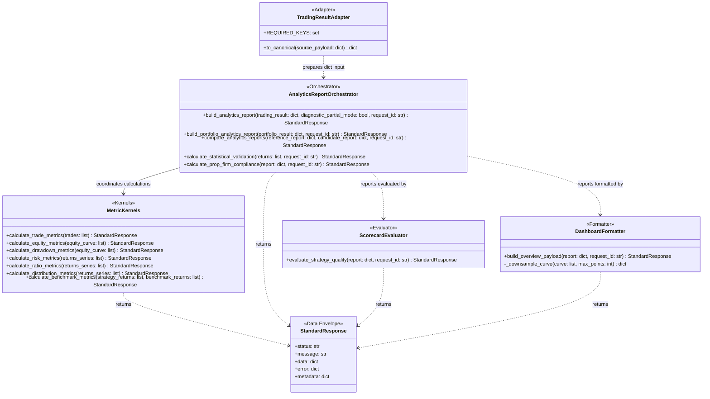

# Analytics Service Module

The Analytics Service provides read-only performance calculations, metrics, canonical report builders, quality scorecard evaluation, and dashboard payload formatters for strategy backtests, simulations, paper trading, and historical live results.

---

## 1. Overview & Architectural Boundaries

* **Read-Only Guarantee**: This service is strictly downstream of Strategies, Risk, and Persisted Data. It is completely side-effect-free: it **does not** write files, modify databases, place trades, or make direct network/broker requests.
* **Standardized Responses**: All official tools wrap their data payloads in standard `StandardResponse` JSON envelopes (defined in `app.utils.standard`), which contain `status`, `message`, `data`, `error`, and `metadata` (tracking `request_id`, execution duration, and permission boundaries).
* **Lineage & Timezones**: All timestamps must be timezone-aware or explicitly normalized to UTC before calculations, benchmark alignment, report hashing, or dashboard payload generation.

---

## 2. Core Module Layout

* **[adapters.py](file:///c:/Users/rharu/Documents/MyApplications/Quant/app/services/analytics/adapters.py)**: Deserializes and normalizes raw backtest, paper, or live payloads into a canonical `TradingResult` view containing symbol parameters and timezone-aware transaction timestamps.
* **[trade.py](file:///c:/Users/rharu/Documents/MyApplications/Quant/app/services/analytics/trade.py)**: Implements trade stats such as win rates, consecutive win/loss streaks, duration summaries, MFE/MAE efficiency capture, and R-multiples.
* **[equity.py](file:///c:/Users/rharu/Documents/MyApplications/Quant/app/services/analytics/equity.py)**: Implements equity and return series calculations (percentage/log returns, daily/weekly/monthly/annual grouping).
* **[drawdown.py](file:///c:/Users/rharu/Documents/MyApplications/Quant/app/services/analytics/drawdown.py)**: Implements peak-to-valley drawdown depth, recovery factors, drawdown duration in hours, pain index, and ulcer index.
* **[risk.py](file:///c:/Users/rharu/Documents/MyApplications/Quant/app/services/analytics/risk.py)**: Implements Volatility, Value at Risk (VaR), Conditional VaR (CVaR), and compounding risk of ruin Monte Carlo simulations.
* **[ratios.py](file:///c:/Users/rharu/Documents/MyApplications/Quant/app/services/analytics/ratios.py)**: Implements Sharpe, Sortino, Omega, Gain-to-Pain, Edge, Expectancy, and Kappa ratios.
* **[distributions.py](file:///c:/Users/rharu/Documents/MyApplications/Quant/app/services/analytics/distributions.py)**: Implements skewness, excess kurtosis, Jarque-Bera and Shapiro-Wilk normality tests, and outlier flags.
* **[benchmark.py](file:///c:/Users/rharu/Documents/MyApplications/Quant/app/services/analytics/benchmark.py)**: Performs UTC-first chronological alignment of strategy and benchmark streams, calculating Beta, annualized Jensen Alpha, Tracking Error, and Information Ratio.
* **[efficiency.py](file:///c:/Users/rharu/Documents/MyApplications/Quant/app/services/analytics/efficiency.py)**: Implements capital deployment efficiency (return per adverse excursion mae/mfe and calendar days).
* **[scorecard.py](file:///c:/Users/rharu/Documents/MyApplications/Quant/app/services/analytics/scorecard.py)**: Scorecard evaluator assigning a quality score between `0` and `100`, listing strategy strengths, warnings, and recommendations.
* **[report.py](file:///c:/Users/rharu/Documents/MyApplications/Quant/app/services/analytics/report.py)**: Orchestrates individual report building (`AnalyticsReport`) or portfolio report building (`PortfolioAnalyticsReport`).
* **[dashboard.py](file:///c:/Users/rharu/Documents/MyApplications/Quant/app/services/analytics/dashboard.py)**: Formats reports and curves into dashboard-ready JSON structures (extrema downsampling, summary cards, returns heatmap).

---

## 3. Official AI Tools & Facade API

Exposed at the root service level (`from app.services.analytics import ...`):

* **`build_analytics_report`**: Generates a complete structured report from a raw backtest/trading result.
* **`build_portfolio_analytics_report`**: Merges multiple trading results into a single portfolio performance report.
* **`evaluate_strategy_quality`**: Evaluates strategy quality metrics and assigns a quality score using `scorecard.py`.
* **`compare_analytics_reports`**: Compares a candidate report against a baseline report to compute differences.
* **`calculate_trade_metrics`**: Computes core realized trade stats.
* **`calculate_equity_metrics`**: Computes total returns and maximum drawdowns from equity curves.
* **`calculate_drawdown_metrics`**: Computes detailed ulcer, pain, and drawdown stats.
* **`calculate_risk_metrics`**: Computes VaR, CVaR, and returns volatilities.
* **`calculate_benchmark_metrics`**: Aligns streams and computes alpha, beta, and information ratios.
* **`calculate_statistical_validation`**: Computes deflated Sharpe ratio, backtest overfitting probability, and permutation tests.
* **`calculate_prop_firm_compliance`**: Evaluates compliance checks (daily drawdown limits, sizing, consistency).
* **`get_analytics_overview`**: Provides an overview split into long/short/all trade subsets.
* **`sample_size_warning`**: Warns when sample size is below recommended minimums.
* **`bootstrap_probability_above_threshold`**: Estimates metric probabilities using bootstrapping.

---

## 4. Component Architecture & Class Relationships

The diagram below outlines how raw trading results are adapted into canonical schemas, processed by separate specialized metrics kernels, and compiled by orchestrators into standardized envelopes, scorecard evaluations, or downsampled dashboard payloads.



---

## 5. Usage Examples

Below is a walkthrough of typical programmatic interactions with the Analytics service facade. All facade functions return standard, typed envelopes.

### 5.1 Realizing Trade & Curve Metrics Directly

You can calculate individual performance indicators from trade logs and curves:

```python
from app.services.analytics import calculate_trade_metrics, calculate_equity_metrics

# 1. Closed trades list
trades = [
    {
        "trade_id": "t1",
        "symbol": "EURUSD",
        "direction": "long",
        "open_time": "2026-01-02T00:00:00Z",
        "close_time": "2026-01-02T04:00:00Z",
        "net_pnl": 150.0,
        "initial_risk": 50.0,
        "mae": -10.0,
        "mfe": 200.0,
    },
    {
        "trade_id": "t2",
        "symbol": "EURUSD",
        "direction": "short",
        "open_time": "2026-01-03T00:00:00Z",
        "close_time": "2026-01-03T06:00:00Z",
        "net_pnl": -50.0,
        "initial_risk": 50.0,
        "mae": -60.0,
        "mfe": 5.0,
    }
]

trade_res = calculate_trade_metrics(trades, request_id="req_trade_01")
if trade_res["status"] == "success":
    stats = trade_res["data"]
    print(f"Total Trades: {stats['total_trades']}")
    print(f"Win Rate: {stats['win_rate']}")
    print(f"Profit Factor: {stats['profit_factor']}")

# 2. Equity curves list
equity_curve = [
    {"timestamp": "2026-01-01T00:00:00Z", "equity": 10000.0},
    {"timestamp": "2026-01-02T04:00:00Z", "equity": 10150.0},
    {"timestamp": "2026-01-03T06:00:00Z", "equity": 10100.0},
]

equity_res = calculate_equity_metrics(equity_curve, request_id="req_eq_01")
if equity_res["status"] == "success":
    eq_stats = equity_res["data"]
    print(f"Total Return %: {eq_stats['total_return_percent']}")
    print(f"Total Return USD: {eq_stats['total_return_usd']}")
```

### 5.2 Building a Full Analytics Report

Use the orchestrator tool to build a complete canonical report, perform timezone normalizations, generate quality flags, and compute ratios, drawdowns, and distribution summaries:

```python
from app.services.analytics import build_analytics_report

trading_result = {
    "schema_version": "1.3.1",
    "result_id": "bt_run_example_06",
    "phase": "backtest",
    "strategy_id": "strategy_trend_follower",
    "strategy_version": "v1.2",
    "account_base_currency": "USD",
    "start_time": "2026-01-01T00:00:00Z",
    "end_time": "2026-01-31T23:59:59Z",
    "symbols": ["EURUSD"],
    "timeframe": "H1",
    "trades": trades,
    "equity_curve": equity_curve,
    "benchmark_curve": [
        {"timestamp": "2026-01-01T00:00:00Z", "equity": 10000.0},
        {"timestamp": "2026-01-02T04:00:00Z", "equity": 10050.0},
        {"timestamp": "2026-01-03T06:00:00Z", "equity": 10020.0},
    ],
    "metadata": {"data_quality_status": "passed"},
}

report_res = build_analytics_report(trading_result, request_id="req_report_01")
if report_res["status"] == "success":
    report = report_res["data"]
    print(f"Report ID: {report['report_id']}")
    print(f"Report Status: {report['report_status']}")
```

### 5.3 Quality Scorecard and Dashboard Payload Preparation

You can check whether a report meets promotion guidelines and formatting requirements for visual rendering:

```python
from app.services.analytics import evaluate_strategy_quality, build_overview_payload

if report_res["status"] == "success":
    report = report_res["data"]

    # 1. Evaluate quality
    scorecard_res = evaluate_strategy_quality(report, request_id="req_scorecard_01")
    if scorecard_res["status"] == "success":
        card = scorecard_res["data"]
        print(f"Quality Score: {card['score']}/100")
        print(f"Strengths: {card['strengths']}")
        print(f"Warnings: {card['warnings']}")
        print(f"Action: {card['recommended_action']}")

    # 2. Format for Dashboard (reduces equity curve points down to 100)
    dashboard_res = build_overview_payload(report, request_id="req_dash_01")
    if dashboard_res["status"] == "success":
        payload = dashboard_res["data"]
        print(f"Summary Cards: {payload['summary_cards']}")
        print(f"Chart Points: {payload['equity_curve_chart']['returned_count']}")
```

---

## 6. Catalogs, Schemas, and Limits

The Analytics service exposes durable catalog objects from `app.services.analytics`
so agents and APIs can inspect approved public behavior without deep imports.

### 6.1 Official Analytics Tool Catalog

`OFFICIAL_ANALYTICS_TOOL_CATALOG` maps every approved high-level tool to:

- input schema summary
- output schema summary
- stable error codes
- side-effect profile
- stability label (`stable`, `approved_experimental`, `deprecated`, or `internal_support_only`)
- agent/API safety
- test evidence paths

Approved high-level tools include `build_analytics_report`,
`build_portfolio_analytics_report`, `evaluate_strategy_quality`,
`calculate_trade_metrics`, `calculate_equity_metrics`,
`calculate_drawdown_metrics`, `calculate_risk_metrics`,
`calculate_benchmark_metrics`, `calculate_statistical_validation`,
`calculate_prop_firm_compliance`, and `build_overview_payload`.

Low-level metric kernels remain developer/internal helpers unless they are listed
in the catalog as agent/API-safe tools.

### 6.2 Metric Definition Catalog

`METRIC_DEFINITION_CATALOG` records formulas, units, required inputs, optional
inputs, aliases, return scale, annualization basis, sample convention, minimum
sample size, undefined-result behavior, golden-fixture expectations, role, and
confidence for approved metrics. R-multiple proxy behavior is explicitly listed
as degraded confidence under `r_multiple_proxy_profit_loss`.

Use `validate_metric_catalog()` to fail closed if a catalog entry is malformed.

### 6.3 Schema Compatibility Matrix

`SCHEMA_COMPATIBILITY_MATRIX` classifies report/result schemas as `accepted`,
`deprecated`, `legacy_adapted`, `rejected`, or `unsupported_future`. The current
accepted analytics schema version is `1.3.1`; older compatible 1.x schemas are
treated as legacy-adapted or deprecated, and future major versions are rejected
until explicitly approved.

### 6.4 Warning and Quality Flags

Warnings and quality flags are separated from calculated facts. Supported
severity meanings are `informational`, `warning`, `major`, `critical`, and
`blocker`. Strategy-quality and prop-firm outputs are non-binding analytics
evidence only; they do not approve live trading or mutate risk/trading state.

### 6.5 Dashboard Payload Classes and Truncation

Required dashboard payload classes are summary cards, equity curve charts,
drawdown section status, warnings, quality flags, and metadata. Optional classes
include monthly return heatmaps, rolling ratios, rolling drawdown, trade
distribution, cost breakdown, and symbol contribution. Future classes must be
added to the catalog before becoming public.

Dashboard truncation is deterministic. Truncated series include whether
truncation occurred, original count, returned count, max points, and the
downsample method.

---

## 7. Run Verification Tests & Examples

To run the full suite of unit tests verifying all calculators and standard envelopes:
```bash
.venv\Scripts\pytest tests/unit/app/services/analytics/ -o addopts="" --cov=app/services/analytics --cov-report=term-missing
```

To run the comprehensive end-to-end usage example showing tool execution:
```bash
.venv\Scripts\python tests/usage/app/services/06_analytics.py
```
