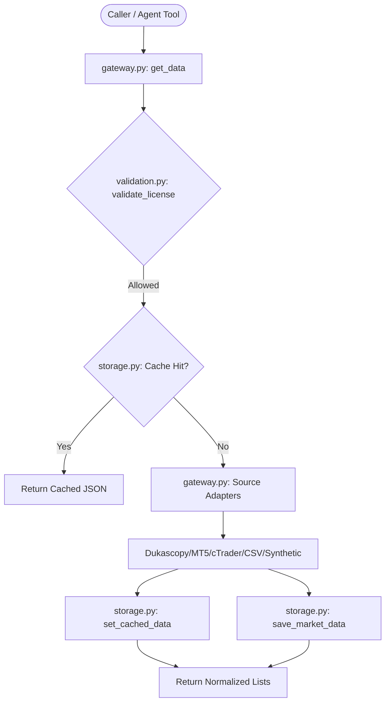

# Market Data Service

The `app/services/data` package is the core **Layer 5 (Service Layer)** module responsible for data ingestion, caching, persistence, alignment, scheduling, and validation. It maintains clean business logic returning raw dictionaries/lists and raising standard exceptions, completely separated from the **Layer 2 (Agent Tools)** envelope-wrapped layer in `agentic/tools/data/`.

---

## 1. System Architecture & Flow

The service orchestrates data flows across multiple sub-components (Adapters, Cache, Database, Transforms, and Scheduler) under a single consolidated gateway interface.



---

## 2. Core Modules

The service is compacted into 7 highly-focused modules:

1. **[__init__.py](file:///c:/Users/rharu/Documents/MyApplications/Quant/app/services/data/__init__.py)**: Exposes the 21 clean Layer 5 service functions. It contains no implementation details.
2. **[gateway.py](file:///c:/Users/rharu/Documents/MyApplications/Quant/app/services/data/gateway.py)**: Router gateway and source adapters. Orchestrates historical, real-time, local, synthetic, and broker data queries. Consolidates source adapters (`CSVAdapter`, `ParquetAdapter`, `DukascopyAdapter`, `MT5Adapter`, `CTraderAdapter`, `SyntheticAdapter`).
3. **[models.py](file:///c:/Users/rharu/Documents/MyApplications/Quant/app/services/data/models.py)**: Houses Pydantic schemas and standard data models (`OHLCVRecord`, `TickRecord`, `SpreadRecord`, `SymbolMetadata`, `DataAvailability`, `FeedStatus`, `JobConfig`, `JobStatus`).
4. **[storage.py](file:///c:/Users/rharu/Documents/MyApplications/Quant/app/services/data/storage.py)**: Interface for persistent storage (SQLite) and caching (SQLite-backed caching tables). Includes transaction-isolated writes and cache key generation.
5. **[scheduler.py](file:///c:/Users/rharu/Documents/MyApplications/Quant/app/services/data/scheduler.py)**: Managed background scheduler to fetch recurring updates, run once-off syncs, track feed status, and handle queue concurrency.
6. **[transforms.py](file:///c:/Users/rharu/Documents/MyApplications/Quant/app/services/data/transforms.py)**: Pure mathematical and structural operations. Manages tick aggregation, pandas resampling, timeframe alignment, indicators labeling, and NumPy type cleaning.
7. **[validation.py](file:///c:/Users/rharu/Documents/MyApplications/Quant/app/services/data/validation.py)**: Enforcement of safety boundaries, including timeframe format checks, volume/spread limits validation, licensing context verification, and timezone-aware market hours.

---

## 3. Database Schema

The package utilizes SQLite for storage, caching, and state management. The tables include:

### `data_cache`
Stores serialized JSON payloads of queried data for ultra-fast subsequent retrievals.
* `key` (TEXT, PRIMARY KEY): MD5 digest of query parameters.
* `value` (TEXT): Serialized JSON payload.
* `expires_at` (TEXT): ISO 8601 UTC expiration timestamp.
* `created_at` (TEXT): ISO 8601 UTC creation timestamp.

### `data_licenses`
Enforces distribution policies, preventing redistribution of proprietary datasets.
* `source` (TEXT)
* `symbol` (TEXT)
* `license_type` (TEXT): e.g., `commercial`, `open`, `restricted`.
* `redistribution_restricted` (INTEGER): `0` or `1`.
* `attribution` (TEXT, NULL)
* `created_at` (TEXT)
* *Constraint*: PRIMARY KEY (`source`, `symbol`).

### `data_feeds`
Registers real-time and historical data feeds.
* `feed_id` (TEXT, PRIMARY KEY)
* `name` (TEXT)
* `source` (TEXT)
* `symbol` (TEXT)
* `timeframe` (TEXT)
* `is_active` (INTEGER): `0` or `1`.
* `created_at` (TEXT)

### `data_jobs`
Registers scheduled update tasks.
* `job_id` (TEXT, PRIMARY KEY)
* `name` (TEXT)
* `feed_id` (TEXT): Foreign key referencing `data_feeds`.
* `cron` (TEXT)
* `concurrency_limit` (INTEGER)
* `is_active` (INTEGER): `0` or `1`.
* `created_at` (TEXT)

---

## 4. Public API Catalog & Usage Examples

All public functions return clean Python primitives (`dict`, `list`, etc.) and throw standard errors: `ValidationError` (Layer 5 validation failures), `DataError` (SQLite or data integrity issues), or `ExternalServiceError` (adapter failure).

### Gateway Queries (`gateway.py`)

#### `get_data`
Fetch historical OHLCV, tick, or spread records from cache or adapters.

```python
from app.services.data import get_data

# Fetch OHLCV bars
ohlcv_bars = get_data(
    symbol="EURUSD",
    timeframe="H1",
    data_kind="ohlcv",
    start_time="2026-06-01T00:00:00Z",
    end_time="2026-06-02T00:00:00Z",
)
```

##### Field Options & Detailed Configuration

Below is a detailed breakdown of all fields, accepted options, and execution behaviors for `get_data()`:

* **`symbol`** (`str`): *Required*.
  * **Description**: Financial symbol identifier to retrieve data for.
  * **Examples**:
    * Forex: `"EURUSD"`, `"GBPUSD"`, `"USDJPY"`, `"AUDUSD"`
    * Indices: `"SPX500"`, `"NAS100"`, `"GER30"`, `"US30"`
    * Metals / Commodities: `"XAUUSD"`, `"XAGUSD"`, `"USOIL"`
    * Cryptocurrencies: `"BTCUSDT"`, `"ETHUSDT"`
    * Equities: `"AAPL"`, `"MSFT"`, `"TSLA"`

* **`start_time`** (`str`): *Required*.
  * **Description**: ISO 8601 UTC start time string specifying the beginning of the retrieval window.
  * **Formats supported**:
    * Complete timestamp: `"2026-06-01T00:00:00Z"` or `"2026-06-01T00:00:00+00:00"`
    * Date-only (interpreted as UTC midnight): `"2026-06-01"`

* **`end_time`** (`str`): *Required*.
  * **Description**: ISO 8601 UTC end time string specifying the completion of the retrieval window.
  * **Formats supported**:
    * Complete timestamp: `"2026-06-02T23:59:59Z"` or `"2026-06-02T23:59:59+00:00"`
    * Date-only (interpreted as UTC midnight): `"2026-06-02"`

* **`data_kind`** (`str`): Optional. Default is `"ohlcv"`.
  * **Description**: The structural format and type of market records to return.
  * **Allowed Options**:
    * `"ohlcv"`: Returns bar records. Each record is a dictionary representing a timeframe bar, validated by `OHLCVRecord`. Keys include:
      * `timestamp` (`str`): ISO 8601 UTC.
      * `open`, `high`, `low`, `close` (`float` or `str`): Bar prices.
      * `volume` (`float` or `str`): Volume.
      * `tick_volume` (`float` or `str`): Total count of tick adjustments.
      * `real_volume` (`float` or `str`): Actual matched market volume (often 0 or empty for OTC forex).
      * `spread` (`float` or `str`): Averaged spread.
      * `source`, `symbol`, `timeframe` (`str`): Query metadata values.
    * `"ticks"`: Returns individual tick snapshots, validated by `TickRecord`. Keys include:
      * `timestamp` (`str`): ISO 8601 UTC.
      * `bid`, `ask` (`float` or `str`): Current buy/sell price boundaries (ask must be >= bid).
      * `last` (`float` or `str`): Last execution price.
      * `volume` (`float` or `str`): Size of the tick.
      * `spread` (`float` or `str`): Instantaneous spread.
      * `source`, `symbol` (`str`).
    * `"spreads"`: Returns spread snapshots, validated by `SpreadRecord`. Keys include:
      * `timestamp` (`str`): ISO 8601 UTC.
      * `symbol` (`str`).
      * `bid`, `ask` (`float` or `str`): Underlier ask/bid boundaries.
      * `spread_points` (`float` or `str`): Raw spread in broker points.
      * `spread_pips` (`float` or `str`): Standardized spread in pips.
      * `source` (`str`).
    * `"volume"`: Returns trading volume summaries extracted from the source adapter.

* **`timeframe`** (`str | None`): Optional. Default is `None`.
  * **Description**: Bar timeframe. **Required** when `data_kind` is `"ohlcv"` or `"volume"`, ignored otherwise.
  * **Allowed Options**:
    * Minutes: `"M1"`, `"M2"`, `"M3"`, `"M4"`, `"M5"`, `"M6"`, `"M10"`, `"M12"`, `"M15"`, `"M20"`, `"M30"`
    * Hours: `"H1"`, `"H2"`, `"H3"`, `"H4"`, `"H6"`, `"H8"`, `"H12"`
    * Days / Weeks / Months: `"D1"`, `"W1"`, `"MN1"`

* **`source`** (`str`): Optional. Default is `"csv"`.
  * **Description**: The primary adapter or channel utilized to fetch records.
  * **Allowed Options**:
    * `"csv"`: Reads from raw local CSV files located under the `data/raw/csv/` directory (e.g. `data/raw/csv/EURUSD_H1.csv`). Supports automatic tab/comma delimiter detection.
    * `"parquet"`: Reads from local Apache Parquet archives under the `data/raw/parquet/` directory (e.g. `data/raw/parquet/EURUSD_H1.parquet`).
    * `"mt5"`: Pulls historical records directly from the MetaTrader 5 terminal gateway.
    * `"ctrader"`: Retrieves from the Spotware cTrader OpenAPI TCP connection client.
    * `"dukascopy"`: Downloads ticks from the public Dukascopy community feed.
    * `"yahoo"`: Retrieves public data from Yahoo Finance equity and index feeds.
    * `"binance"`: Retrieves cryptocurrency spot/future records from the Binance public API.
    * `"synthetic"`: Generates simulated price data using pure mathematical random walks (ideal for local integration sandbox testing).

* **`limit`** (`int | None`): Optional. Default is `None`.
  * **Description**: Maximum number of records to return. If `None` or not provided, returns the system default for the data kind:
    * `"ohlcv"`: Default limit is `5,000` records. Maximum permitted cap is `50,000` records.
    * `"ticks"`: Default limit is `10,000` records. Maximum permitted cap is `250,000` records.
    * `"spreads"`: Default limit is `10,000` records. Maximum permitted cap is `250,000` records.
  * *Note*: If the requested limit exceeds the maximum permitted cap, a `ValidationError` is raised.

* **`stale_data_behavior`** (`str`): Optional. Default is `"refresh_and_return"`.
  * **Description**: Cache lookup and invalidation policy when looking up local SQLite records.
  * **Allowed Options**:
    * `"refresh_and_return"`: If a cached entry exists but is expired (based on Cache TTL), the gateway automatically requests new records from the external source, updates the local cache/DB, and returns the fresh data.
    * `"fail"`: Fails closed. If a cached entry is expired or missing, it raises a `DataError` without triggering a live network/adapter call.
    * `"return_stale"`: Returns the cached data regardless of whether it is expired or stale. A warning log/metadata note is added to indicate the stale state.

* **`workflow_context`** (`str`): Optional. Default is `"research"`.
  * **Description**: Determines precision formatting, decimal representation, and redistribution licensing rules.
  * **Allowed Options**:
    * `"research"`: Returns numerical columns as standard floating-point values (`float`) for high-speed computation (e.g., `1.0825`). Emits warning logs only for licensing restrictions.
    * `"backtest"`: Returns numbers formatted as exact decimal strings (e.g., `"1.08250"`) for reproducible mathematical backtesting.
    * `"validation"`: Enforces licensing verification. Numbers are returned as decimal strings.
    * `"risk"`: Fail-closed context. Rejects queries on redistribution-restricted sources (like proprietary MT5/cTrader data feeds) to avoid regulatory violation. Returns decimal strings.
    * `"execution_bound"`: Highest security context. Full compliance licensing validation. Rejects restricted redistributions and returns decimal strings.

* **`fallback_sources`** (`list[str] | None`): Optional. Default is `None`.
  * **Description**: An explicit list of alternative source adapter strings to query sequentially if the primary `source` fails or raises an error.
  * **Example**: `fallback_sources=["yahoo", "synthetic"]`

* **`request_id`** (`str | None`): Optional. Default is `None`.
  * **Description**: Traceability tracking UUID/correlation identifier to link logs, DB queries, and audits.

#### `list_symbols`
Discovers available symbols from local CSV/Parquet archives or brokers.
```python
from app.services.data import list_symbols

symbols = list_symbols(source="csv")
# Output: ["EURUSD", "GBPUSD", ...]
```

### Data Transformations (`transforms.py`)

#### `resample_ohlcv`
Resample low-timeframe OHLCV records to a higher timeframe.
```python
from app.services.data import resample_ohlcv

resampled = resample_ohlcv(
    records=one_minute_bars,
    from_tf="1m",
    to_tf="15m",
)
```

#### `aggregate_ticks_to_bars`
Aggregate ticks into OHLCV bars of a target timeframe.
```python
from app.services.data import aggregate_ticks_to_bars

bars = aggregate_ticks_to_bars(
    ticks=tick_records,
    timeframe="5m",
)
```

### Job Scheduling (`scheduler.py`)

#### `create_data_update_job`
Register a cron-based data download job.
```python
from app.services.data import create_data_update_job

job = create_data_update_job(
    name="EURUSD-hourly-sync",
    feed_id="feed_eurusd_1h",
    cron="0 * * * *",
    concurrency_limit=1,
)
```

#### `start_data_update_job`
Starts a background scheduled job task.
```python
from app.services.data import start_data_update_job

start_data_update_job(job_id="job_eurusd_1h")
```

---

## 5. Testing & Static Quality

All files under `app/services/data` enforce **strict static type annotations** checked with Mypy, and Ruff formatting/lint guidelines.

To run tests and static analysis:
```bash
# Run all unit tests and verify >80% coverage
.venv\Scripts\pytest

# Run Ruff check
.venv\Scripts\ruff check app/services/data/

# Run Mypy checks
.venv\Scripts\mypy --strict app/services/data/
```
