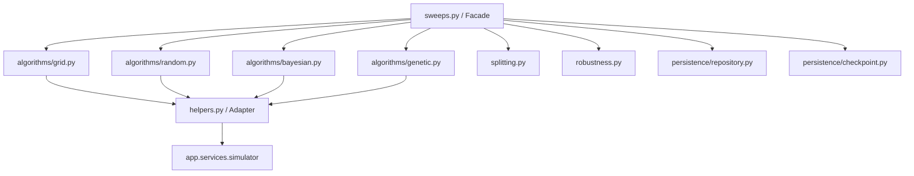

# Optimization Service

The **Optimization Service** is a high-performance parameter optimization, validation, and walk-forward analysis engine designed for quantitative trading strategies. It supports exhaustive grid searches, pseudo-random searches, genetic evolution, and Bayesian optimization fallbacks, combined with time-series splitting, stress-testing, and atomic persistence.

---

## Architecture Overview

The module is structured as follows:



---

## Core Components

### 1. Public Facades (`sweeps.py`)
Provides the main user-facing interfaces:
- `run_parameter_sweep`: Coordinating grid, random, Bayesian, or genetic sweeps.
- `run_walk_forward_optimization`: Running walk-forward train/test sweeps.
- `compare_optimization_runs`: Analyzing metrics between separate sweeps.
- `detect_overfit_parameters`: Quantifying IS vs. OOS performance degradation.

### 2. Search Algorithms (`algorithms/`)
- **Grid Search** (`grid.py`): Exhaustive parameter combinations with parallel thread execution.
- **Random Search** (`random.py`): Space sampling supporting pseudo-random generation (LHS/Sobol fallbacks).
- **Genetic Algorithm** (`genetic.py`): Generation-based parameter evolution with crossover, mutation, and tournament selection.
- **Bayesian Optimization** (`bayesian.py`): Gaussian-process wrapper (utilizing Optuna/scikit-optimize if present, otherwise falling back to random search).

### 3. Time-Series Splitting (`splitting.py`)
Provides walk-forward training/validation splits:
- **Rolling Window Splits**: Overlapping sliding training and testing folds.
- **Expanding Window Splits**: Anchored training window with sliding test segments.
- **Purging & Embargo**: Removing overlaps between training/testing boundaries to eliminate data leakage.

### 4. Robustness & Stress-Testing (`robustness.py`)
- **Monte Carlo Resampling**: Generates randomized trade sequences to estimate ruin probability and drawdown metrics.
- **Stress-Testing**: Simulates market shock scenarios (e.g., win trade drops, fee shocks, latency slippage degradation).
- **Robustness Score**: A composite metric scoring strategy survivability under stressors.

### 5. Persistence & Checkpoints (`persistence/`)
- **Atomic Checkpoints** (`checkpoint.py`): Write tempfiles and atomically swap them using `Path.replace()` to prevent corruption.
- **Repository Interface** (`repository.py`): Generic thread-safe database storage wrappers for saving and resuming sweep runs.

---

## Usage Example

Refer to [tests/usage/app/services/09_optimization.py](file:///c:/Users/rharu/Documents/MyApplications/Quant/tests/usage/app/services/09_optimization.py) for the complete executable examples.

```python
from app.services.optimization.models import ParameterSpace, ParameterRange
from app.services.optimization.sweeps import run_parameter_sweep

space = ParameterSpace(
    parameters=[
        ParameterRange(name="short_window", type="int", min_value=5, max_value=15, step=1),
        ParameterRange(name="long_window", type="int", min_value=10, max_value=30, step=2),
    ],
    constraints=["short_window < long_window"]
)

payload = {
    "strategy_ref": "trend_following",
    "symbols": ["EURUSD"],
    "timeframe": "M1",
    "start": "2026-01-01T00:00:00Z",
    "end": "2026-01-01T01:00:00Z",
    "parameter_space": space.model_dump(),
    "search_method": "grid",
    "objective": "sharpe",
    "initial_balance": 10000.0,
    "dry_run": True,
}

result = run_parameter_sweep(payload)
print(result)
```
