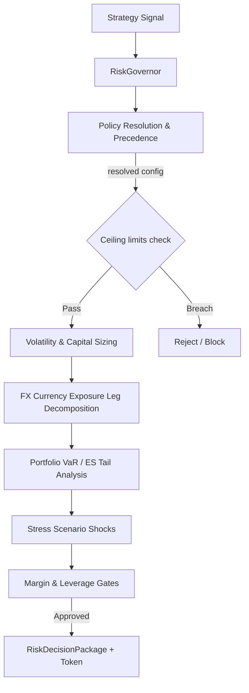

# Risk Governance Service

The `app/services/risk/` package is the core **Layer 4 (Trading/Risk/Strategy Layer)** module responsible for pre-trade risk checks, stateless position sizing, stress scenario evaluations, policy-as-code resolution, and execution-risk gating.

---

## 1. System Architecture & Flow

The service acts as the single deterministic gatekeeper before order generation or execution. All signals must pass through the `RiskGovernor` to be approved, reduced, rejected, or blocked.



---

## 2. Configuration Profiles (`configs/`)

Risk profiles are stored as YAML configurations under `app/services/risk/configs/`. Each profile defines defaults for daily loss, total loss, effective leverage, and live execution authorization.

* **`default.yaml`**: Safe defaults for local testing and simulations. Live execution disabled.
* **`prop_firm_default.yaml`**: Conservative limits adhering to standard prop-firm constraints.
* **`paper.yaml`**: Standard limits for paper-trading environments.
* **`live_conservative.yaml`**: Stricter limits with `allow_live_execution` set to `true`.

---

## 3. Hard Safety Ceilings

To prevent accidental overrides from setting extreme or dangerous limits, the configuration parser validates all values against hard-coded global ceilings defined in [config.py](file:///c:/Users/rharu/Documents/MyApplications/Quant/app/services/risk/config.py):

| Limit Parameter | Hard Ceiling Value | Description |
| :--- | :--- | :--- |
| `max_daily_loss_pct` | `0.20` (20%) | Absolute limit on daily drawdown before halt. |
| `max_total_loss_pct` | `0.50` (50%) | Absolute lifetime drawdown threshold. |
| `max_margin_utilization_pct` | `1.00` (100%) | Capped margin usage. |
| `max_effective_leverage` | `500.0` | Capped account leverage. |
| `max_risk_per_trade` | `0.10` (10%) | Maximum capital risk allocation for a single trade. |

Any override rule or profile value exceeding these ceilings triggers an immediate `ValidationError` or evaluates to a `REJECT` state.

---

## 4. Configuration Hashing

Configuration models support deterministic, stable cryptographic hashing.
* Instantiation timestamps (`created_at`) are normalized during config loading to ensure identical configurations yield the exact same SHA256 signature.
* Config signatures are embedded in all emitted `RiskDecisionToken` structures for audit trails, ensuring executing modules cannot run under altered settings.

---

## 5. Policy-as-Code Resolution & Precedence

Scoped overrides are specified as `PolicyRule` configurations containing matching scopes and target limit overrides. When resolving active policies for an execution context, rules are matched and sorted based on specificity scoring:

```text
Precedence Score = (workflow_id * 10000)
                 + (symbol * 1000)
                 + (strategy_id * 100)
                 + (account_id * 10)
                 + (currency * 5)
                 + (operator_role * 2)
                 + (mode * 1)
                 + (environment * 1)
```

Rules are sorted by ascending specificity score. The most general rules (lowest scores) are applied first, and the most specific rules (highest scores) are applied last, overwriting more general limits (e.g., a symbol-specific override overrides a strategy-level or account-level limit).

### Live sensitive fail-closed behavior
* If the context matches a live environment/mode (e.g. `full_live`), and the resolved configuration has `allow_live_execution: false`, the policy resolution automatically fails closed with a `BLOCK` status.
* If a request lacks a resolved policy or default configuration, the gate fails closed by default.

---

## 6. Override Token Verification

Ad-hoc limit overrides require cryptographically signed `RiskApprovalToken` structures. Token validation enforces:
1. **Time-bounded Expiration**: Rejects expired tokens.
2. **Configuration Compatibility**: Checks that the token's `config_hash` matches the current active `RiskConfig` hash to prevent applying old overrides to new profiles.
3. **Scope Alignment**: Validates that scope parameters (like `symbol` or `strategy_id`) match the target execution context.
4. **Authority Checks**: Live staging/production overrides require an authorized approver role (`risk_manager`, `admin`, or `compliance_officer`). Lower privilege roles (like `strategy_developer`) are blocked.

---

## 7. Market Regime Gate

The Market Regime Gate validates current market conditions against historic baselines and calendar events, blocking or rejecting proposals when conditions are unsafe.

### Classification Categories
1. **Spread Regime (`SpreadRegime`)**: Classifies current spread as `NORMAL`, `WIDE`, or `EXTREME` based on rolling spread statistics and z-score thresholds. `EXTREME` breaches fail the gate with `RiskDecisionStatus.REJECT` and reason code `SPREAD_BREACH`.
2. **Volatility Regime (`VolatilityRegime`)**: Uses short and long rolling standard deviation windows to detect low volatility (`LOW`), normal (`NORMAL`), high volatility (`HIGH`), or an abnormal volatility spike (`SPIKE`). `SPIKE` outcomes reject the trade with reason code `DAILY_LOSS_BREACH`.
3. **Liquidity Regime (`LiquidityRegime`)**: Checks quote age, tick frequency, and missing bars. Stale, thin, or illiquid states resolve to `ILLIQUID` or `THIN`. Illiquidity rejects execution with reason code `STALE_EVIDENCE`.
4. **Session Regime (`SessionRegime`)**: Rejects trades if the target market session is `CLOSED` or symbol is `SUSPENDED`.
5. **Rollover Regime (`RolloverRegime`)**: Enforces blackout windows surrounding broker midnight. Active rollover windows reject the trade with reason code `ROLLOVER_BLACKOUT`.
6. **News Regime (`NewsRegime`)**: Parses high-impact news calendar schedules. High impact news within the blackout range triggers a blackout regime, rejecting the proposal with reason code `NEWS_BLACKOUT`.

### Live Fail-Closed Calendars
In live-sensitive environments, the engine enforces strict news calendar checks. If a live profile requires news calendar coverage and the calendar evidence is missing or empty, the gate fails closed with a `BLOCK` decision and reason code `STALE_EVIDENCE` to prevent trading into unmonitored macro events.

---

## 8. Pre-Trade Deterministic Limits & Aggregation

The deterministic limits engine evaluates candidate execution payloads sequentially against 20 configured limits.

### Execution Sequence Precedence
Limit checks are ordered strictly as follows:
1. **Governance & Switch Gates**: `kill_switch_state` -> `stale_evidence` -> `max_drawdown_limit` -> `daily_loss_limit` -> `strategy_loss_limit` -> `news_blackout` -> `rollover_blackout`
2. **Execution Feasibility Gates**: `spread_limit` -> `slippage_limit` -> `trade_frequency_limit` -> `pending_order_limit`
3. **Exposure & Concentration Gates**: `portfolio_exposure_limit` -> `symbol_exposure_limit` -> `currency_exposure_limit` -> `correlated_cluster_limit`
4. **Tail-Risk & Financial Leverage Gates**: `var_limit` -> `expected_shortfall_limit` -> `stress_loss_limit` -> `leverage_limit` -> `margin_limit`

### Breach Decision Aggregation
When multiple limits fail simultaneously:
* The consolidated status uses the highest severity precedence: `BLOCK > REJECT > NEEDS_MORE_EVIDENCE > NEEDS_APPROVAL > REDUCE_SIZE > APPROVE`.
* The `primary_failure_limit` reports the first limit breached according to the deterministic check sequence.
* A sorted composite list of `composite_breach_flags` lists all triggered limit violations.

---

## 9. Testing & Quality Assurance

All risk components implement strict static type annotations checked with Mypy, and Ruff formatting/lint guidelines.

To run verification checks:
```bash
# Run unit tests
.venv\Scripts\pytest tests/unit/app/services/risk/

# Run Ruff check
.venv\Scripts\ruff check app/services/risk/

# Run Mypy checks
.venv\Scripts\mypy .
```

---

## 10. Position Sizing Engine

The Position Sizing Engine calculates safe, risk-budgeted position volumes under [sizing.py](file:///c:/Users/rharu/Documents/MyApplications/Quant/app/services/risk/sizing.py).

### Sizing Methods (`SizingMethod`)
1. **Fixed Lot (`fixed_lot`)**: Returns a fixed trade volume.
2. **Fixed Risk (`fixed_risk`)**: Sizes volume based on a target risk capital amount (or percentage of equity) and the stop loss distance.
3. **Fixed Fractional (`fixed_fractional`)**: Sizes volume as a fixed fraction of total portfolio equity.
4. **Volatility Adjusted (`volatility_adjusted`)**: Uses rolling ATR or M1 standard deviation volatility measurements to dynamically size the stop distance and resulting position.
5. **Correlation Adjusted (`correlation_adjusted`)**: Reduces position size dynamically based on the proposed asset's correlation to the active portfolio.
6. **Milestone (`milestone`)**: Gradually scales down sizing based on trade/milestone targets.
7. **Kelly Sizing (`kelly`)**: Computes the optimal statistical sizing fraction based on historical win rates and win-loss ratios. Enforced as advisory-only if trade history count is below the configured threshold (default 30).

### Verification and Constraints
* **Lot Step Formatting**: Sizing outputs are formatted to match broker-specific minimums, maximums, and step increments.
* **Risk Budget Ceilings**: Sizing respects global and policy-specific risk percent boundaries before rounding.
* **Reductions**: Applies step-down multipliers for active drawdown states, currency exposure concentrations, and correlation cluster risks prior to final sizing.
* **Rejection Conditions**: Zero or negative stop distance, missing symbol metadata, or calculated sizes below broker minimums result in a rejection or zero lot volume.

---

## 11. FX Currency Exposure Engine

The FX Currency Exposure Engine decomposes portfolios, pending orders, and proposed trades into their underlying base and quote currency legs to calculate gross and net currency exposures, as well as account-currency equivalent exposures.

### Key Components
1. **Decomposition (`decompose_position`)**: Splits a standard lot or size position into its base (long/short asset) and quote (short/long asset) legs. E.g., buying EURUSD is long EUR and short USD.
2. **Rate Resolution (`_resolve_conversion_rate`)**: Dynamically converts any leg amount to the base account currency using conversion rates from `market_context` or static fallbacks.
3. **Pending Order Policies**: Evaluates projected exposure of pending orders according to active policies:
   * `ignore`: Excludes all pending orders from exposure.
   * `full-potential`: Counts all pending orders at 100% size.
   * `near-market-only`: Includes pending orders only if their distance to the current market price is below a threshold.
   * `probability-weighted`: Scales the exposure by the order's configured trigger probability.
4. **Live fail-closed checks**: Rejects calculations if the portfolio is unreconciled or quote status is unknown in live mode.

---

## 12. Correlation and Cluster Risk Engine

The Correlation and Cluster Risk Engine computes price returns, aligns timeseries across multiple assets, calculates Pearson correlation matrices, detects correlation spikes, groups assets into connected-component clusters, and determines sizing multipliers or threshold-based rejections for proposed trades.

### Key Components
1. **Returns Computation (`calculate_returns`)**: Supports close-to-close, log, open-to-close, and standard deviation (sigma) normalized returns.
2. **Alignment & Exclusions (`align_return_series`)**: Aligns series by UTC opening timestamps and skips the current open bar to prevent lookahead bias.
3. **Correlation Snapshot (`calculate_correlation_snapshot`)**: Computes rolling Pearson correlation matrices over configurable lookbacks (M1, M5, H1 timeframes). Falls back to a conservative default value in production if history is insufficient.
4. **Connected Cluster Exposures (`calculate_cluster_exposures`)**: Groups symbols into clusters based on pairwise correlation thresholds and computes the sum of gross exposures per cluster.
5. **Marginal Sizing & Trade Resolution (`evaluate_proposed_trade_correlation`)**: Evaluates a candidate trade's marginal correlation to the active portfolio to determine if the trade should be approved, scaled down using the sizing multiplier, or rejected.

---

## 13. Value-at-Risk (VaR) and Expected Shortfall (ES) Engine

The Value-at-Risk (VaR) and Expected Shortfall (ES) Engine under [var_es.py](file:///c:/Users/rharu/Documents/MyApplications/Quant/app/services/risk/var_es.py) computes portfolio tail-risk metrics.

### Key Capabilities
1. **Parametric Portfolio VaR & ES**: Computes analytics-based VaR and Expected Shortfall assuming normally distributed return series using a covariance matrix (with optional EWMA decay and diagonal shrinkage).
2. **Historical Portfolio VaR & ES**: Computes non-parametric VaR and Expected Shortfall (CVaR) directly from historical return percentiles and tail averages, avoiding normal distribution assumptions.
3. **Euler Risk Decomposition**: Computes Marginal Risk Contributions (MRC) and Component Risk Contributions (CRC) to decompose total portfolio tail risk into individual asset contributions.
4. **Covariance Matrix Estimation**:
   - Sample covariance.
   - EWMA (Exponentially Weighted Moving Average) covariance.
   - Diagonal Shrinkage (Ledoit-Wolf style shrinkage towards the identity/diagonal) to ensure the covariance matrix is well-conditioned.
5. **Validation Gates**: Rejects calculations if the covariance matrix is asymmetric, has non-positive diagonal variances, or if results are non-finite.

### Role in Limits & Approvals
- **VaR Limit**: Evaluated as a warning or hard block based on profile settings.
- **Expected Shortfall Limit**: Acts as a hard tail-risk approval gate for live trading profiles, ensuring potential average tail losses are capped.


## 14. Stress Testing Engine

The Stress Testing Engine under [stress.py](file:///c:/Users/rharu/Documents/MyApplications/Quant/app/services/risk/stress.py) evaluates portfolio and candidate trade resilience under extreme macro shocks and execution failures.

### Default Scenarios
The default registry contains 12 pre-loaded scenarios:
1. **USD Shock Up / Down**: Shocks USD exchange rates by $\pm 10\%$.
2. **JPY Risk-Off**: Appreciation of JPY by $10\%$ against other currencies.
3. **GBP Volatility Shock**: Doubling of GBP spreads and $\pm 15\%$ worst-case price shocks.
4. **Spread Widening 5x**: Multiplies spreads by $5$ to evaluate liquidity stress.
5. **Slippage Shock 50 pips**: Assesses slippage impact on proposed executions.
6. **Correlation to One**: Simulates tail risk under perfect asset correlation.
7. **News Candle 5% Shock**: Instant $5\%$ unfavorable price movement against all positions.
8. **Rollover Liquidity Shock**: Widens spreads by $10\text{x}$ to check rollover risk.
9. **Margin Requirement Spike 2x**: Broker doubles margin requirements, checking for shortfall.
10. **Platform Disconnect**: Fail-closed scenario simulating terminal disconnection.
11. **Stale Quote Check**: Blocks proposals when incoming quotes are stale ($>120\text{s}$).
12. **Forced Liquidation Proximity**: Verifies stop-out safety margins.

### Custom Scenarios & Safety
Custom scenarios can be dynamically parsed and validated using `validate_custom_scenario(config)`. The configuration restricts inputs to numeric percentage shocks within $\pm 100\%$ boundaries, preventing any arbitrary code execution or out-of-bounds inputs.

Stress test results evaluate against the configuration's `max_total_loss_pct_advisory` threshold to determine pass/fail status.


## 15. Margin, Drawdown, and Execution Feasibility Gates

The Margin, Drawdown, and Execution Feasibility Gates evaluate capital requirements, account-level performance drawdowns, and broker-level execution constraints prior to trade execution.

### Key Components

1. **Margin Governance (`margin.py`)**:
   - **Current & Projected Margin**: Computes active margin requirements and projects margin usage after executing proposed candidate trades.
   - **Free Margin After Orders**: Calculates remaining free margin while accounting for pending orders under different policies (`ignore`, `full-potential`, `near-market-only`, `probability-weighted`).
   - **Margin & Leverage Limits**: Rejects trades if projected margin utilization breaches the account threshold (`max_margin_utilization_pct`) or if effective leverage exceeds the cap (`max_effective_leverage`).
   - **Exit Liquidity Stress Check**: Simulates cost impact of selling all active positions under spread spikes (e.g., 5x spread shock) to ensure account solvency.

2. **Drawdown Governor (`drawdown.py`)**:
   - **Drawdown Metrics**: Computes daily drawdown, lifetime total drawdown, and strategy-specific drawdown.
   - **Throttling Transitions**: Automatically maps drawdown levels to throttling states:
     - `NORMAL` (drawdown < 50% of soft limit): Multiplier `1.0`.
     - `CAUTION` (drawdown >= 50% of soft limit): Multiplier `0.8`.
     - `DEFENSIVE` (drawdown >= soft limit): Multiplier `0.5`.
     - `RECOVERY_ONLY` (drawdown >= 80% of hard limit): Multiplier `0.2`.
     - `HALTED` (drawdown >= hard limit): Multiplier `0.0` (trading blocked).
   - **State Persistence**: Serializes and restores drawdown states to/from local JSON storage to survive restarts, handling corruption gracefully.
   - **Revenge Trading Check**: Rejects trades whose volumes exceed drawdown-scaled average volumes.

3. **Execution Feasibility Gate (`execution_gate.py`)**:
   - **Spread & Slippage Checks**: Validates that current spreads or slippage thresholds do not exceed multipliers of rolling volatility standard deviations.
   - **Stop Compliance Check**: Ensures that proposed stop-loss and take-profit distances are outside broker minimum stop levels (`stop_level`) and modification freeze levels (`freeze_level`).
   - **Volume Check**: Verifies that proposed lot volume sizes fall within broker minimum and maximum limits, and align with the broker lot step size.
   - **Session Status**: Blocks execution if the symbol's market session is closed or trading is suspended.
   - **Frequency Check**: Limits trades per strategy over a lookback window (e.g., max 5 trades per minute) to prevent runaway automated trading loops.


## 16. Allocation and Lifecycle Governance

Allocation and Lifecycle Governance manages the capital budget distributed to strategies and controls the stage progression of strategies from backtesting up to live execution.

### Capital Allocation Governance (`allocation.py`)
1. **Allocation Parity Methods**:
   - **Equal-Risk Allocation**: Equally divides capital budgets among active strategies.
   - **Volatility Parity Allocation**: Allocates budgets inversely proportional to strategy rolling volatilities.
   - **Correlation-Adjusted Parity Allocation**: Volatility parity weights adjusted by the mean correlation of strategy returns.
2. **Multipliers & Adjustments**:
   - **Regime Weighting**: Scales allocations based on market regimes.
   - **Drawdown Adjustments**: Scales allocations down individually using strategy-specific drawdown multipliers.
3. **Allocation Limits Gate**:
   - Rejects proposed allocations if the total allocation exceeds total account equity or if a single strategy exceeds the configured maximum strategy allocation cap (`max_strategy_allocation_pct`).
   - Requires historic performance evidence (Sharpe ratio and trade count) before allowing any strategy allocation increase.
   - Requires a valid governed approval token if the allocation increase exceeds `max_allocation_increase_pct`.

### Lifecycle Staging and Promotion (`lifecycle.py`)
1. **Sequential Stages**: Defines standard progression sequence: `backtest` -> `walk-forward` -> `simulation` -> `paper` -> `shadow` -> `micro-live` -> `full-live`.
2. **Promotion Gate Verification**:
   - Prevents skipping stages.
   - Validates that promotion evidence (e.g. Sharpe ratio, trade count, duration, out-of-sample performance, or tracking error) meets profile-configured minimum requirements for each transition step.
3. **Live Readiness Gate**:
   - Validates that live-sensitive stages (`shadow`, `micro-live`, `full-live`) meet system integration requirements:
     - Audit persistence must be active (`audit_persistence_active`).
     - Kill switch must be configured (`kill_switch_configured`).
     - Reconciliation and idempotency checks must be active (`portfolio_reconciliation_active`, `idempotency_evidence_present`).


## 17. Safety Kill Switches

The Safety Kill Switches engine under [kill_switch.py](file:///c:/Users/rharu/Documents/MyApplications/Quant/app/services/risk/kill_switch.py) implements fail-closed trading halts, persistent tracking, and governed resume deactivation limits.

### Hierarchical Scopes
Trading blocks are evaluated in a hierarchical sequence where higher-level switches block lower-level targets:
* **`global`**: Halts all system execution across all accounts and strategies.
* **`portfolio`**: Halts all executions on a target account/portfolio.
* **`strategy`**: Halts all orders originating from a specific strategy ID.
* **`symbol`**: Halts execution for a specific asset (e.g. `EURUSD`), or if base/quote currency legs of that asset are halted.
* **`currency`**: Halts trading for any symbols containing the currency leg (e.g. halting `EUR` blocks `EURUSD` and `EURGBP` but not `GBPUSD`).

### Switch States
* **`inactive`**: Normal operation. Trading is authorized.
* **`active`**: Halted/blocked. Trading is blocked. Requires administrative operator credentials or a valid approval token to resume.
* **`locked`**: Critical state. Triggered by severe failures (e.g. persistence corruption or audit-chain failure). Resuming is locked and strictly requires an explicit operator role of `compliance` or `admin` (cannot be bypassed by approval token alone).

### Persistence & Fail-Closed Behavior
* States are written to local JSON storage (by default `data/risk/kill_switch_state.json`).
* If the persistence file is missing or corrupted at launch, the system **fails closed**, transitioning to a `locked` global active state to block any trade submissions.

### Automated Trigger Events
The `evaluate_triggers` function statelessly parses pre-trade assessment requests and limit results, pulling kill switches automatically on:
1. **Daily Loss Breach**: Global active state.
2. **Drawdown Breach**: Global active state.
3. **Audit-Chain Failure**: Global locked state.
4. **Extreme Spread Widening**: Symbol active state.
5. **Portfolio Reconciliation Failure**: Portfolio active state.
6. **Broker Terminal Disconnect**: Global active state (in live mode).
7. **Margin Emergency**: Portfolio active state.
8. **Manual Operator Halt**: Global active state.

---

## 18. Risk Reporting & Observability (Sprint 5.16)

The reporting module provides structured, JSON-safe compilation of risk assessments, breaches, and historical decisions without recomputing or fabricating evidence. Observability metrics track calculation performance, decision distributions, and safety gate states.

### Risk Report Builder (`reports.py`)
* **Data Sources**: Generates consolidated reports exclusively from stored decisions, snapshots, and audit events.
* **Redaction Policy**: Strips private account numbers, credentials, and raw broker response packets.
* **Path Traversal Guard**: Gated write-to-path operations reject outputs directed outside the workspace directory or temporary system directories.

### Recorded Observability Metrics (`RISK_METRICS_REGISTRY`)
The governor records metrics to a thread-safe local registry exported to Prometheus:
* `haruquant_risk_governor_latency_ms`: p95 latency tracking for pre-trade reviews.
* `haruquant_risk_var_es_latency_ms` & `haruquant_risk_stress_latency_ms`: Latency of complex portfolio evaluations.
* `haruquant_risk_decision_total`: Counters of approvals, reductions, and rejections.
* `haruquant_risk_stale_evidence_failures_total`: Counter for fail-closed stale context halts.
* `haruquant_risk_kill_switch_state`: Gauges for global/portfolio/symbol kill switches.
* `haruquant_risk_audit_persistence_health`: Gauge representing cryptographic audit-chain integrity.
