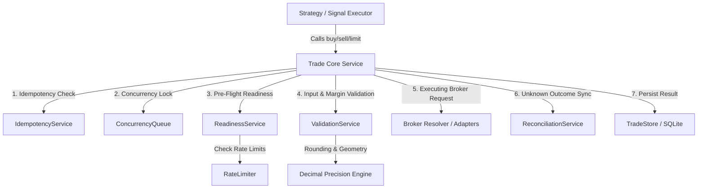

# app/services/trader

The `trader` module is the core execution boundary of the **HaruQuantAI** trading system. It provides an MQL5-compatible trading surface that encapsulates low-level broker operations, wrapped in high-resilience safety gates, validation engines, concurrency locks, and state synchronization.

---

## 1. Module Architecture & Design

The module is designed as a **fail-closed, transactional gateway**. Rather than allowing direct calls to raw broker adapters (e.g., MT5 or cTrader clients), all trade requests pass through the core `Trade` service, which acts as a orchestrator for validation, safety checks, locking, execution, and local database syncing.

### System Topology



---

## 2. Execution Lifecycle

Every execution call (`buy()`, `sell()`, `buy_limit()`, etc.) maps to the internal `_send_request` execution path, implementing the following sequence:

```
[Request Received] (trade.py)
        │
        ▼
[Check Global States] (trade.py) ─► Is Kill Switch active? (Reject unless emergency bypass flag is set)
        │                        ─► Is Graceful Shutdown active? (Reject)
        ▼
[Generate Idempotency Key] ──────► Check local store (idempotency.py & store.py).
        │                         If "in_progress", reject. If "completed", return cached outcome.
        ▼
[Startup Reconciliation Gate] ───► Block trading if startup reconciliation has not passed (reconciliation.py).
        │
        ▼
[Acquire Concurrency Lock] ──────► Lock thread execution per (account, symbol) (concurrency.py).
        │
        ▼
[Run Readiness Verification] ────► Check terminal, account permissions, and rate limits (readiness.py & rate_limiter.py).
        │
        ▼
[Validate Parameters & SL/TP] ───► Decimal rounding, stops geometry, margin checks (validation.py).
        │
        ▼
[Submit Request to Broker] ──────► Executes with a 5.0s timeout (app/routes/brokers.py).
   ┌────┴───────────────┐
   ▼ (Timeout Exceeded)  ▼ (Success / Failure Receipt)
[Unknown Outcome]       [Normalize Broker Response] (result.py)
   │                     │
[Forced Reconciliation]  [Update Local State Store] (store.py)
(reconciliation.py)      │
   │                     │
   └──────────┬──────────┘
              ▼
   [Release Concurrency Lock] (concurrency.py)
              │
              ▼
   [Mark Idempotency Completed] (idempotency.py)
```

---

## 3. Component Directory

| Component / Service | File | Purpose |
|---|---|---|
| **`Trade`** | [trade.py](file:///c:/Users/rharu/Documents/MyApplications/Quant/app/services/trader/trade.py) | Main entrypoint for trading actions. Coordinates safety policies and delegates execution. |
| **`IdempotencyService`** | [idempotency.py](file:///c:/Users/rharu/Documents/MyApplications/Quant/app/services/trader/idempotency.py) | Uses hashed signatures of attributes `(account_id, symbol, action_type, volume, price, slippage, timestamp_window)` to filter duplicate requests. |
| **`ConcurrencyQueue`** | [concurrency.py](file:///c:/Users/rharu/Documents/MyApplications/Quant/app/services/trader/concurrency.py) | Enforces strict, sequential thread locks per `(account_id, symbol)` scope to prevent double-fills and race conditions. |
| **`ReadinessService`** | [readiness.py](file:///c:/Users/rharu/Documents/MyApplications/Quant/app/services/trader/readiness.py) | Verifies broker terminal connection state, trading permission state, account trading status, and rate-limiting limits. |
| **`RateLimiter`** | [rate_limiter.py](file:///c:/Users/rharu/Documents/MyApplications/Quant/app/services/trader/rate_limiter.py) | Token-bucket rate limiter configured per broker provider to prevent API banning. |
| **`ValidationService`** | [validation.py](file:///c:/Users/rharu/Documents/MyApplications/Quant/app/services/trader/validation.py) | Normalizes financial decimals, enforces order volume steps/bounds, validates stop loss/take profit geometry, checks margin, handles netting/hedging dealing rules, and verifies market sessions. |
| **`ReconciliationService`** | [reconciliation.py](file:///c:/Users/rharu/Documents/MyApplications/Quant/app/services/trader/reconciliation.py) | Syncs local state with active broker state, computes monetary/percentage drift, and fires critical **[P1]** alerts when threshold violations are found. |
| **`TradeStore`** | [store.py](file:///c:/Users/rharu/Documents/MyApplications/Quant/app/services/trader/store.py) | Abstract repository contract defining persistent storage for orders, positions, execution deals, and idempotency states. Defaults to `InMemoryTradeStore`. |

---

## 4. Resilience & Operational Safety

### Startup Reconciliation Gate
Trading execution is blocked by default until the `ReconciliationService` performs an initial comparison of the local `TradeStore` state against the broker's active list. Discrepancies are synchronized immediately (e.g., local positions closed on the broker are purged locally, and missing positions on the local store are updated from the broker).

### Concurrency Queue Locks
To eliminate concurrent race conditions, requests are queued sequentially. The `ConcurrencyQueue` implements a localized thread-locking mechanism using Python's `threading.Lock` map keyed on `f"{account_id}:{symbol}"`.

### Global Kill Switch
An emergency toggle (`set_kill_switch(True)`) halts all incoming trade requests. Under an active kill switch:
- Normal orders are rejected with a code `10001` error.
- Active pending orders can still be cancelled, and open positions can still be flattened by utilizing the internal emergency bypass flag (`_bypass_kill_switch=True`).

### Graceful Shutdown Sequence
Invoking `shutdown(timeout=10.0)` triggers a coordinated exit protocol:
1. Rejects any new incoming trade requests.
2. Tracks `_in_flight_requests` using atomic increments/decrements inside a thread lock.
3. Blocks and waits until the in-flight counter drops to zero, or until the timeout window expires, before closing the broker connectivity.

### Broker Synchronous Timeouts
Broker API requests are executed inside a separate thread pool executor with a **5.0-second** timeout gate. If a timeout occurs, the system cannot verify if the order reached the matching engine. It marks the result code as `10005` (Unknown Outcome) and immediately triggers a **Forced Reconciliation** run to reconcile any unexpected market side effects.

---

## 5. Code Usage Examples

### Basic Position Execution
```python
from app.services.trader import Trade

# Initialize trade service (uses default store and active broker module)
trade = Trade()

# Configure execution parameters
trade.set_symbol("EURUSD")
trade.set_expert_magic_number(123456)
trade.set_deviation_in_points(20)

# Open a Long Market Position (Volume = 0.1 Lots)
if trade.buy(volume=0.1, sl=1.08200, tp=1.09000, comment="System Long"):
    print(f"Success! Deal Ticket: {trade.result_deal()}")
else:
    print(f"Failed: {trade.result_comment()} (Code: {trade.result_retcode()})")
```

### Emergency Switch and Flattening Flow
```python
from app.services.trader import Trade
from app.services.trader.position_info import PositionInfo

trade = Trade()

# Engage the system-wide kill switch
trade.set_kill_switch(True)

# Flatten active positions (using bypass flags to override the kill switch block)
pos_info = PositionInfo()
active_positions = pos_info.get_positions() # Fetches currently tracking open positions

for pos in active_positions:
    ticket = pos["ticket"]
    # Close each position under emergency conditions
    trade.position_close(ticket, comment="Emergency Flatten")
```

---

## 6. MQL5 Emulation Wrappers

To maintain cross-platform parity and ease the porting of MetaTrader-based strategies, the module exposes structural wrapper classes matching the standard MQL5 interface:

- **`AccountInfo`**: Retrieves login credentials, balance, equity, margin, free margin, margin level, leverage, and trading permissions.
- **`SymbolInfo`**: Exposes symbol specifications (ask, bid, point size, digits, lot boundaries, volume step, stop levels, margin/profit calculations).
- **`TerminalInfo`**: Returns broker connection status, terminal build version, and system path settings.
- **`PositionInfo`**: Stores/retrieves active open positions (ticket, volume, price, type, profit, sl, tp, comment).
- **`OrderInfo`**: Represents active pending orders awaiting execution.
- **`HistoryOrderInfo`**: Tracks historical pending orders (filled or cancelled).
- **`DealInfo`**: Represents execution transactions (deals) corresponding to position transitions.

---

## 7. Verification & Testing

Unit tests for the entire `trader` suite verify parameter limits, stop geometries, rate-limit failures, kill switches, idempotency records, reconciliation drift, and shutdown protocols.

Run the test suite using `pytest`:
```bash
pytest tests/unit/app/services/trader/test_trader.py
```

To run checks with code coverage statistics:
```bash
pytest --cov=app/services/trader tests/unit/app/services/trader/
```
