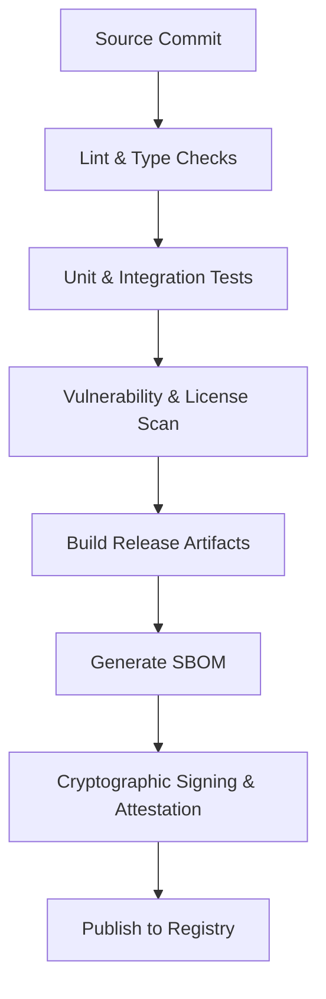

# HaruQuantAI CI/CD and Release Process Specification

This document details the CI/CD and release-engineering controls for HaruQuantAI production packages, ensuring traceability, compliance, and cryptographic integrity.

---

## 1. Release Engineering Pipeline

All official package distributions (wheels, source distributions, Docker images) are built, verified, and signed in a locked-down CI/CD release pipeline.



### 1.1 Cryptographic Signing and PEP 740 Attestations
- **Sigstore Signing**: Distributed Python packages are cryptographically signed using **Sigstore** within the approved GitHub Actions environment.
- **PEP 740 Attestations**: Release pipelines generate PEP 740-compatible attestations. These attestations bind the built wheel/sdist hash to the specific builder environment and Identity Provider (IdP) token.
- **Verification**: Downstream clients can verify release package integrity before installation:
  ```bash
  python -m pip install --require-hashes -r requirements.txt
  # Verify Sigstore signatures
  sigstore verify python-wheel ...
  ```

### 1.2 Provenance Attestations
Every release artifact includes a SLSA (Source Level for Securing Artifacts) Level 3 provenance attestation. The provenance record identifies:
1. **Source Revision**: The exact git commit hash of the source code.
2. **Build Workflow**: The triggering GitHub Actions workflow run ID and filename.
3. **Build Environment**: The virtual runner operating system, Python version, and execution environment.
4. **Package Hash**: SHA-256 hash of the generated wheel or source distribution.
5. **Signing Identity**: The OpenID Connect (OIDC) identity associated with the release pipeline runner.

---

## 2. Supply Chain Risk & License Governance

### 2.1 Software Bill of Materials (SBOM)
- The pipeline executes `scripts/generate_sbom.py` to compile a CycloneDX v1.5 JSON SBOM file identifying all direct and transitive dependencies.
- This SBOM is attached as a release asset in the production registry.

### 2.2 Vulnerability Gates
- **Safety / Pip-audit**: The CI pipeline scans all dependencies for known vulnerabilities.
- **Gate Policy**: Builds containing dependencies with high or critical CVE severity scores are automatically failed and blocked from release unless an explicit, signed security exception/waiver is committed to governance configurations.

### 2.3 License Compliance
- Dependency licenses must be compatible with commercial proprietary use (e.g., MIT, BSD, Apache 2.0).
- Copyleft licenses (such as GPLv3, AGPL) are prohibited in production packages. The pipeline runs a license scanner (e.g., `license-check`) to verify compliance on every build.

---

## 3. Runtime Safety and Threading Guarantees

The indicator calculations service under `app/services/indicators` provides strict thread-safety and execution isolation guarantees for concurrent strategy and simulation workflows:

### 3.1 Thread-Safety Guarantees
- **Registry Thread-Safety**: The central indicator registration catalog (`IndicatorRegistry`) is protected by a standard reentrant threading lock (`threading.Lock`), ensuring thread-safe additions, lookups, and listing operations.
- **Calculation Thread-Safety**: Indicator calculation classes (e.g., `SimpleMovingAverage`, `ExponentialMovingAverage`) are designed as state-free calculation pipelines for batch calculations. Since they do not mutate internal attributes or input dataframes during the `.calculate()` pass, they are fully thread-safe for concurrent read access.
- **Cache Thread-Safety**: The standard calculation cache utilizes thread-safe locking primitives around cache read/write/clear actions to prevent race conditions during concurrent cache query/update operations.
