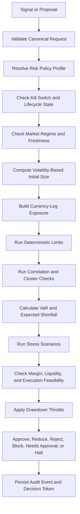

## Phase 5 Risk Governance — Institutional RiskGovernor Rewrite

### Goal

Implement an institutional-grade Risk Governance layer under `app/services/risk/` that becomes the final deterministic authority before execution.

Phase 5 shall not be a single VaR calculator. It shall be a layered, fail-closed `RiskGovernor` combining policy-as-code, deterministic limits, volatility-based sizing, currency exposure decomposition, dynamic correlation control, portfolio VaR, Expected Shortfall/CVaR, stress testing, drawdown throttling, execution-risk gating, allocation governance, kill-switches, and tamper-evident audit logging.

No trade, allocation increase, strategy promotion, live-mode transition, or execution mutation may reach the Trading, Live, Portfolio, Optimization, UI/API, or Conversation layers without a valid, fresh, signed `RiskDecisionPackage` or explicit governed rejection.

Task inventory: 876 checkbox tasks (0 checked, all unchecked).

### Institutional Risk Philosophy

```text
Signal / Proposal
  -> RiskGovernor
      -> Policy Gate
      -> Market Regime Gate
      -> Deterministic Limit Gate
      -> Volatility Sizing Engine
      -> Currency Exposure Engine
      -> Correlation Engine
      -> Portfolio VaR / ES Engine
      -> Stress Testing Engine
      -> Margin and Liquidity Engine
      -> Drawdown Governor
      -> Execution Risk Gate
      -> Allocation Governor
      -> Audit Decision Token
  -> Approve / Reduce / Reject / Block / Needs Approval / Halt
```

- [ ] Phase 5 shall treat Risk Governance as a layered control system, not a single formula or indicator.
- [ ] Phase 5 shall make VaR one engine inside the RiskGovernor, not the whole risk strategy.
- [ ] Phase 5 shall use Expected Shortfall/CVaR and stress loss as stronger tail-risk approval controls than parametric VaR alone.
- [ ] Phase 5 shall decompose Forex positions into currency legs before calculating exposure and concentration.
- [ ] Phase 5 shall treat correlated symbol trades as clustered portfolio risk rather than independent trades.
- [ ] Phase 5 shall fail closed when required evidence is stale, missing, inconsistent, unreconciled, or not trusted.
- [ ] Phase 5 shall output deterministic decisions that can be replayed, audited, and explained without LLM reasoning.
- [ ] Phase 5 shall allow LLM agents to summarize or explain risk decisions but never make final safety-critical decisions.
- [ ] Phase 5 shall preserve module ownership boundaries and shall not place, close, modify, or cancel broker orders.
- [ ] Phase 5 shall be stricter than broker constraints and stricter than external prop-firm limits.

### Dependency Files and Functionality

Required files:

```text
app/utils/__init__.py
app/utils/errors.py
app/utils/standard.py
app/utils/logger.py
app/utils/normalization.py
app/utils/security.py
app/utils/settings.py
app/utils/event_bus.py
app/utils/observability.py
app/contracts/__init__.py
app/contracts/risk.py
app/contracts/market.py
app/contracts/portfolio.py
app/contracts/trading.py
app/services/data/__init__.py
app/services/strategies/__init__.py
app/services/strategies/protocols.py
```

Required functionality:

- Strategy signals, protocols, and configs are defined and verifiable.
- Canonical contracts exist for `Signal`, `ProposedTrade`, `OrderIntent`, `RiskDecision`, `RiskRejection`, `PortfolioRiskSnapshot`, `PositionSizingResult`, `KillSwitchState`, and `RiskAuditEvent`.
- Event bus is functional for dispatching risk-governor events.
- Settings loading and security validation schemas exist.
- Market data freshness metadata is available from Data.
- Portfolio/trading state snapshots are available through stable public interfaces or injected ports.
- Execution and Live services cannot bypass risk approval tokens.

- [ ] Verify all required dependency files are implemented, importable, side-effect safe, and covered by tests before Phase 5 implementation begins.
- [ ] Verify Risk consumes canonical Phase 1.5 contracts instead of redefining duplicate cross-domain models.
- [ ] Verify Risk receives market, account, portfolio, pending-order, and execution-state evidence through explicit ports or canonical snapshots.
- [ ] Verify Risk has no direct broker SDK dependency.
- [ ] Verify Risk has no UI, FastAPI route, LLM-provider, notification-provider, or database-migration ownership.
- [ ] Verify Risk can run in offline test, simulation, paper, shadow, read-only live, micro-live, and full-live modes using profile-specific policies.
- [ ] Verify every live-sensitive Risk workflow has access to UTC timestamps, broker-server timestamps where needed, and freshness metadata.
- [ ] Verify every Risk decision can propagate request ID, workflow ID, correlation ID, strategy ID, and signal ID.

### Files to Create or Update

```text
app/services/risk/__init__.py
app/services/risk/models.py
app/services/risk/errors.py
app/services/risk/config.py
app/services/risk/policy.py
app/services/risk/regime.py
app/services/risk/limits.py
app/services/risk/sizing.py
app/services/risk/exposure.py
app/services/risk/correlation.py
app/services/risk/var_es.py
app/services/risk/stress.py
app/services/risk/margin.py
app/services/risk/drawdown.py
app/services/risk/execution_gate.py
app/services/risk/allocation.py
app/services/risk/lifecycle.py
app/services/risk/kill_switch.py
app/services/risk/governor.py
app/services/risk/audit.py
app/services/risk/storage.py
app/services/risk/reports.py
app/services/risk/tools.py
app/services/risk/README.md
configs/risk/default.yaml
configs/risk/prop_firm_default.yaml
configs/risk/paper.yaml
configs/risk/live_conservative.yaml
tests/unit/app/services/risk/
tests/integration/app/services/risk/
tests/scenario/app/services/risk/
tests/security/app/services/risk/
tests/performance/app/services/risk/
tests/usage/app/services/05_risk.py
```

- [ ] Create or update every production file listed above.
- [ ] Create or update every config profile listed above.
- [ ] Create or update every test folder listed above.
- [ ] Ensure `app/services/risk/__init__.py` is a public registry only and contains no business logic.
- [ ] Ensure all internal helpers remain private unless intentionally exported.
- [ ] Ensure each file has a file-level docstring describing purpose, exports, side effects, and safety-critical behavior.
- [ ] Ensure no file imports optional broker SDKs, UI packages, LLM providers, or notification clients at module import time.

### Approved Phase 5 Sprint Packs

These sprint packs split the institutional Risk Governance rewrite into small Builder-approved implementation scopes. Each pack still requires the normal dry run and `APPROVED: EXECUTE` before repository edits.

#### Sprint Pack 5.0 Institutional readiness and boundary setup

Requirements:

- [ ] Read the v1 Phase 5 baseline, Risk v8 technical specification, Core Contracts phase, and current Strategy/Data/Portfolio/Trading interfaces before editing.
- [ ] Create a Phase 5 dry-run report listing files to read, files to change, commands to run, scope boundaries, blockers, and rollback path.
- [ ] Confirm Phase 5 does not begin until Phase 1.5 canonical contracts are available or explicitly stubbed by approved sprint scope.
- [ ] Confirm every live-sensitive dependency has a fail-closed fallback path.
- [ ] Confirm every risk input is either canonical, injected, or explicitly rejected.
- [ ] Confirm no direct broker SDK imports are planned inside Risk.
- [ ] Confirm no API route, UI, or Conversation code will own risk algorithms.
- [ ] Confirm no strategy code can approve its own signals.
- [ ] Confirm no optimization result can allocate capital without Risk review.
- [ ] Confirm no live-mode promotion can proceed without Risk lifecycle approval.
- [ ] Define the Phase 5 implementation sequence before creating production files.
- [ ] Create a local issue map or checklist linking each sprint pack to expected files and tests.
- [ ] Define rollback points after contracts, config, calculators, governor, audit, and tools.
- [ ] Confirm all test fixtures use synthetic account and market data only.
- [ ] Confirm no fixture contains real account numbers, broker credentials, tokens, or private payloads.
- [ ] Define deterministic random seeds for any stochastic stress or simulation tests.
- [ ] Define benchmark dataset shapes for correlation, VaR/ES, stress, and governor latency tests.
- [ ] Define redaction expectations for logs, audit events, reports, and standard envelopes.
- [ ] Define mode matrix for offline, simulation, paper, shadow, read-only live, micro-live, and full-live.
- [ ] Define which workflows require approval tokens and which are advisory only.
- [ ] Define which workflows write audit records and which remain pure calculations.
- [ ] Define which functions are support helpers and which are official AI-callable tools.
- [ ] Define side-effect flags for every official risk tool before implementation.
- [ ] Define minimum required evidence for trade review, allocation review, strategy admission, and live readiness.
- [ ] Define initial performance targets for pre-trade review, correlation matrix, VaR/ES, and stress scenarios.
- [ ] Define the initial conservative risk policy profile before implementation.
- [ ] Define the owner-approved threshold-change process for risk config profiles.
- [ ] Define failure behavior when audit storage is unavailable in non-live modes.
- [ ] Define failure behavior when audit storage is unavailable in live-sensitive modes.
- [ ] Record Phase 5 readiness decisions in the implementation report before coding.

#### Sprint Pack 5.1 Contracts and models

Requirements:

- [ ] Create `app/services/risk/models.py` with file-level purpose, exports, and side-effect docstring.
- [ ] Define all risk enums with deterministic string values.
- [ ] Define `RiskDecisionStatus` and cover all allowed outcomes.
- [ ] Define `RiskReasonCode` catalog with stable names and descriptions.
- [ ] Define `RiskSeverity` catalog with stable ordering.
- [ ] Define `RiskEvidenceRef` for source-traceable evidence references.
- [ ] Define `ProposedTrade` with validation for symbol, side, size, order type, stops, targets, timestamps, and strategy metadata.
- [ ] Define `ProposedAllocation` with strategy, symbol, currency, requested budget, and evidence metadata.
- [ ] Define `StrategyAdmissionRequest` with required research, simulation, and risk evidence fields.
- [ ] Define `RiskAssessmentRequest` with mode, policy profile, account state, market state, portfolio state, pending orders, open positions, and freshness metadata.
- [ ] Define `AccountRiskSnapshot` with equity, balance, free margin, margin used, leverage, base currency, and timestamp.
- [ ] Define `MarketRiskSnapshot` with spreads, volatility, session, rollover, news, symbol metadata, and freshness fields.
- [ ] Define `PortfolioRiskSnapshot` with open positions, pending orders, in-flight orders, exposure, VaR/ES, stress, and drawdown fields.
- [ ] Define `PositionRiskSnapshot` with signed size, entry, current price, PnL, risk, margin, strategy ID, and timestamps.
- [ ] Define `PendingOrderRiskSnapshot` with pending-order exposure policy fields.
- [ ] Define `CurrencyLegExposure` with signed base and quote currency amounts.
- [ ] Define `CurrencyExposure` with gross, net, and account-currency equivalent exposure.
- [ ] Define `CorrelationSnapshot` with matrix, lookback, timeframe, method, sample count, and fallback status.
- [ ] Define `VaRSnapshot` with method, confidence, portfolio volatility, exposure, result, and assumptions.
- [ ] Define `ExpectedShortfallSnapshot` with confidence, threshold loss, average tail loss, sample count, and method.
- [ ] Define `StressScenarioResult` with scenario ID, shock assumptions, estimated loss, pass/fail status, and reason codes.
- [ ] Define `MarginRiskSnapshot` with projected margin, free margin, margin usage, leverage, and broker constraints.
- [ ] Define `DrawdownState` with current state, soft/hard limits, step-down multiplier, and persistence metadata.
- [ ] Define `ExecutionRiskSnapshot` with spread, slippage, stop-level, freeze-level, lot-step, and marketability checks.
- [ ] Define `RiskDecisionToken` with scope, expiry, policy hash, config hash, signature metadata, and revocation fields.
- [ ] Define `RiskDecisionPackage` as the single canonical output from Risk reviews.
- [ ] Add canonical serialization helpers for all risk models.
- [ ] Add validation tests for all model success paths.
- [ ] Add validation tests for invalid financial values and missing required fields.
- [ ] Add JSON round-trip and canonicalization tests for every model crossing public boundaries.

#### Sprint Pack 5.2 Config profiles and policy-as-code

Requirements:

- [ ] Create `app/services/risk/config.py` with side-effect-free imports.
- [ ] Create `configs/risk/default.yaml` with safe simulation defaults.
- [ ] Create `configs/risk/prop_firm_default.yaml` with conservative prop-firm controls.
- [ ] Create `configs/risk/paper.yaml` with paper-trading validation controls.
- [ ] Create `configs/risk/live_conservative.yaml` with full fail-closed live controls.
- [ ] Define strict schema for risk config profiles.
- [ ] Reject unknown config keys by default.
- [ ] Reject unsafe threshold values above configured maximums.
- [ ] Reject live profiles that lack explicit live authority fields.
- [ ] Compute stable risk config hashes.
- [ ] Add hash regression tests for identical and changed configs.
- [ ] Create `app/services/risk/policy.py` with deterministic policy resolution.
- [ ] Define policy scope by environment, mode, account, strategy, symbol, currency, workflow, and operator role.
- [ ] Define policy precedence rules for global, account, strategy, symbol, and workflow scopes.
- [ ] Implement policy resolution with missing-policy fail-closed behavior.
- [ ] Implement policy hash propagation into decisions.
- [ ] Implement policy enforcement result model.
- [ ] Implement risk budget policy gates.
- [ ] Implement risk threshold override request validation.
- [ ] Implement governed approval requirement for high-risk overrides.
- [ ] Implement config compatibility checks for approval tokens.
- [ ] Implement policy expiry handling where policies are time-bounded.
- [ ] Implement safe default policy for offline tests.
- [ ] Implement stricter default policy for live-sensitive modes.
- [ ] Add policy resolution tests for every scope.
- [ ] Add policy precedence tests.
- [ ] Add missing policy fail-closed tests.
- [ ] Add unsafe config rejection tests.
- [ ] Add override authorization tests.
- [ ] Document config and policy behavior in the Risk README.

#### Sprint Pack 5.3 Market regime gate

Requirements:

- [ ] Create `app/services/risk/regime.py` with deterministic regime assessment.
- [ ] Define `RiskRegime` enum and regime result contract.
- [ ] Implement spread regime classification using spread-to-σ thresholds.
- [ ] Implement volatility regime classification using short rolling windows.
- [ ] Implement volatility regime classification using medium rolling windows.
- [ ] Implement volatility regime classification using long rolling windows.
- [ ] Implement liquidity regime classification from quote freshness and missing bars.
- [ ] Implement session regime classification for always-on trading.
- [ ] Implement broker-midnight rollover regime detection.
- [ ] Implement configured rollover blackout before broker midnight.
- [ ] Implement configured rollover blackout after broker midnight.
- [ ] Implement news regime classification from injected trusted calendar evidence.
- [ ] Fail closed when live profile requires calendar evidence and it is missing.
- [ ] Throttle or reject extreme volatility spikes.
- [ ] Reject stale quotes and stale market data snapshots.
- [ ] Reject invalid spreads and inverted bid/ask data.
- [ ] Reject entries in market-closed or symbol-suspended states.
- [ ] Expose reason codes for each regime warning or blocker.
- [ ] Ensure regime checks use closed bars where required.
- [ ] Ensure regime checks do not mutate inputs.
- [ ] Add normal regime tests.
- [ ] Add low-volatility regime tests.
- [ ] Add high-volatility regime tests.
- [ ] Add spread-widening tests.
- [ ] Add rollover blackout tests.
- [ ] Add stale-data fail-closed tests.
- [ ] Add missing-news-evidence tests.
- [ ] Add invalid quote tests.
- [ ] Add session behavior tests.
- [ ] Add docs and usage example for the market regime gate.

#### Sprint Pack 5.4 Deterministic limits

Requirements:

- [ ] Create `app/services/risk/limits.py` with explicit ordered checks.
- [ ] Define `ORDERED_LIMIT_CHECKS` as a tuple, not a set or unordered mapping.
- [ ] Define `LimitCheck` contract.
- [ ] Define `LimitResult` contract.
- [ ] Implement kill-switch state limit check.
- [ ] Implement stale-evidence limit check.
- [ ] Implement max daily loss limit check.
- [ ] Implement max total drawdown limit check.
- [ ] Implement max strategy loss limit check.
- [ ] Implement portfolio exposure limit check.
- [ ] Implement symbol exposure limit check.
- [ ] Implement currency exposure limit check.
- [ ] Implement correlated cluster exposure limit check.
- [ ] Implement VaR limit check.
- [ ] Implement Expected Shortfall limit check.
- [ ] Implement stress loss limit check.
- [ ] Implement leverage limit check.
- [ ] Implement margin usage limit check.
- [ ] Implement news blackout limit check.
- [ ] Implement rollover blackout limit check.
- [ ] Implement spread limit check.
- [ ] Implement slippage limit check.
- [ ] Implement trade frequency limit check.
- [ ] Implement pending order limit check.
- [ ] Implement limit aggregation with configured precedence.
- [ ] Implement stable primary failure selection.
- [ ] Implement composite breach flags.
- [ ] Add tests for pass, warn, fail, and missing evidence for every limit.
- [ ] Add multi-breach deterministic order regression tests.
- [ ] Document limit ordering and breach aggregation.

#### Sprint Pack 5.5 Volatility-based sizing

Requirements:

- [ ] Create `app/services/risk/sizing.py` with pure sizing calculators.
- [ ] Define `SizingMethod` enum.
- [ ] Define `PositionSizingRequest` contract.
- [ ] Define `PositionSizingResult` contract.
- [ ] Implement fixed-risk sizing.
- [ ] Implement fixed-fractional sizing.
- [ ] Implement volatility-adjusted sizing.
- [ ] Implement correlation-adjusted sizing.
- [ ] Implement milestone sizing.
- [ ] Implement Kelly-reference sizing as advisory by default.
- [ ] Enforce minimum evidence before Kelly-reference affects live risk.
- [ ] Compute M1 σ-based stop distance when strategy uses volatility-adaptive stops.
- [ ] Convert pip distance to account-currency risk.
- [ ] Convert tick distance to account-currency risk.
- [ ] Use tick value, tick size, contract size, base currency, quote currency, and conversion metadata.
- [ ] Apply risk budget caps before broker lot rounding.
- [ ] Apply drawdown step-down multiplier before final sizing.
- [ ] Apply currency exposure reductions before final sizing.
- [ ] Apply correlation cluster reductions before final sizing.
- [ ] Round final size to broker lot step after risk math.
- [ ] Reject missing symbol metadata.
- [ ] Reject zero or negative stop distance.
- [ ] Reject invalid conversion rates.
- [ ] Return reduce-size when requested size is too large but a smaller safe size exists.
- [ ] Return reject when no valid size satisfies risk and broker constraints.
- [ ] Add golden tests for fixed-risk sizing.
- [ ] Add golden tests for volatility sizing.
- [ ] Add tests for JPY pairs and non-USD account currency conversion.
- [ ] Add tests for broker lot-step rounding.
- [ ] Document sizing assumptions and defaults.

#### Sprint Pack 5.6 FX currency exposure engine

Requirements:

- [ ] Create `app/services/risk/exposure.py` with pure exposure calculators.
- [ ] Define symbol exposure calculation.
- [ ] Define currency-leg exposure calculation.
- [ ] Define net currency exposure calculation.
- [ ] Define gross currency exposure calculation.
- [ ] Define account-currency equivalent exposure calculation.
- [ ] Decompose long EURUSD as long EUR and short USD.
- [ ] Decompose short EURUSD as short EUR and long USD.
- [ ] Support all major currency buckets by default.
- [ ] Support custom currency clusters from config.
- [ ] Include open positions in current exposure.
- [ ] Include pending orders in projected exposure.
- [ ] Include in-flight orders in projected exposure.
- [ ] Implement pending-order exposure policy: ignore.
- [ ] Implement pending-order exposure policy: near-market-only.
- [ ] Implement pending-order exposure policy: probability-weighted.
- [ ] Implement pending-order exposure policy: full-potential.
- [ ] Reject unknown pending-order state in live-sensitive modes.
- [ ] Reject unreconciled portfolio state in live-sensitive modes.
- [ ] Detect hidden USD concentration across multiple USD-quote pairs.
- [ ] Calculate exposure by strategy.
- [ ] Calculate exposure by symbol.
- [ ] Calculate exposure by currency.
- [ ] Calculate exposure by cluster.
- [ ] Calculate exposure by portfolio.
- [ ] Add tests for long/short pair decomposition.
- [ ] Add tests for multi-pair hidden concentration.
- [ ] Add tests for pending-order exposure policies.
- [ ] Add tests for conversion failure.
- [ ] Document FX exposure model with examples.

#### Sprint Pack 5.7 Correlation and cluster risk

Requirements:

- [ ] Create `app/services/risk/correlation.py` with closed-bar correlation calculations.
- [ ] Define correlation method enum.
- [ ] Define return series alignment helper.
- [ ] Implement log returns.
- [ ] Implement close-to-close returns.
- [ ] Implement open-to-close returns.
- [ ] Implement σ-normalized returns.
- [ ] Align return series by identical opening timestamps.
- [ ] Skip current open bar in correlation calculations.
- [ ] Support M1 execution correlation window.
- [ ] Support M5/M15 intraday cluster correlation window.
- [ ] Support H1 regime correlation window.
- [ ] Reject insufficient sample size unless conservative fallback is configured.
- [ ] Implement conservative fallback correlation for production.
- [ ] Implement dynamic correlation spike detection.
- [ ] Implement marginal correlation impact of proposed trade.
- [ ] Implement correlation-adjusted sizing multiplier.
- [ ] Implement cluster exposure calculation.
- [ ] Implement correlation threshold reduce behavior.
- [ ] Implement correlation threshold reject behavior.
- [ ] Add tests for timestamp alignment.
- [ ] Add tests for closed-bar exclusion.
- [ ] Add tests for insufficient samples.
- [ ] Add tests for perfect positive correlation.
- [ ] Add tests for perfect negative correlation.
- [ ] Add tests for dynamic correlation spikes.
- [ ] Add tests for cluster exposure.
- [ ] Add tests for correlation-adjusted sizing.
- [ ] Add tests for conservative fallback behavior.
- [ ] Document correlation assumptions and limitations.

#### Sprint Pack 5.8 VaR and Expected Shortfall engines

Requirements:

- [ ] Create `app/services/risk/var_es.py` with pure tail-risk calculators.
- [ ] Define VaR method enum.
- [ ] Define Expected Shortfall method enum.
- [ ] Implement parametric portfolio VaR.
- [ ] Implement historical portfolio VaR.
- [ ] Implement Expected Shortfall/CVaR calculation.
- [ ] Implement covariance matrix calculation.
- [ ] Implement EWMA covariance option.
- [ ] Implement shrinkage covariance option where configured.
- [ ] Calculate signed portfolio weights.
- [ ] Calculate component risk contribution.
- [ ] Calculate marginal risk contribution.
- [ ] Convert all exposure and loss values to account currency.
- [ ] Support configurable confidence levels.
- [ ] Default intraday confidence level to profile-configured 95% unless overridden.
- [ ] Treat parametric VaR as warning or hard block according to policy.
- [ ] Treat ES/CVaR as hard approval gate for live profiles.
- [ ] Reject invalid covariance matrices.
- [ ] Reject non-finite VaR results.
- [ ] Reject insufficient return history where fallback is not allowed.
- [ ] Return reason codes for every calculation failure.
- [ ] Add golden tests for parametric VaR.
- [ ] Add historical percentile tests.
- [ ] Add ES tail-average tests.
- [ ] Add covariance edge-case tests.
- [ ] Add fat-tail loss distribution tests.
- [ ] Add account-currency conversion tests.
- [ ] Add component risk contribution tests.
- [ ] Benchmark VaR/ES calculations for target portfolio sizes.
- [ ] Document VaR assumptions and ES approval role.

#### Sprint Pack 5.9 Stress testing

Requirements:

- [ ] Create `app/services/risk/stress.py` with registered scenario evaluation.
- [ ] Define `StressScenario` contract.
- [ ] Define `StressScenarioResult` contract.
- [ ] Define `StressScenarioRegistry`.
- [ ] Build default scenario registry.
- [ ] Implement USD shock scenario.
- [ ] Implement JPY risk-off shock scenario.
- [ ] Implement GBP volatility shock scenario.
- [ ] Implement spread widening shock scenario.
- [ ] Implement slippage shock scenario.
- [ ] Implement correlation-to-one shock scenario.
- [ ] Implement news candle shock scenario.
- [ ] Implement rollover liquidity shock scenario.
- [ ] Implement margin spike shock scenario.
- [ ] Implement platform disconnect shock scenario.
- [ ] Implement stale quote shock scenario.
- [ ] Implement forced liquidation stress scenario.
- [ ] Validate custom scenario config without arbitrary code execution.
- [ ] Calculate stress loss in account currency.
- [ ] Compare stress loss against profile threshold.
- [ ] Reject trades passing VaR but failing stress survival.
- [ ] Return scenario-level reason codes.
- [ ] Return summary pass/fail status for audit.
- [ ] Add tests for every default scenario.
- [ ] Add tests for custom scenario validation.
- [ ] Add tests for stress failure causing rejection.
- [ ] Add tests for stress warning causing reduction.
- [ ] Add performance test for 100 scenarios and 500 positions.
- [ ] Document stress scenario methodology.
- [ ] Add usage example for stress analysis.

#### Sprint Pack 5.10 Margin, liquidity, drawdown, and execution feasibility

Requirements:

- [ ] Create `app/services/risk/margin.py` with margin calculations.
- [ ] Create `app/services/risk/drawdown.py` with drawdown governor.
- [ ] Create `app/services/risk/execution_gate.py` with execution feasibility checks.
- [ ] Calculate current margin usage.
- [ ] Calculate projected margin usage after proposed trade.
- [ ] Calculate free margin after open, pending, and in-flight orders.
- [ ] Enforce max margin usage by account.
- [ ] Enforce max margin usage by portfolio.
- [ ] Enforce max margin usage by strategy where configured.
- [ ] Enforce leverage caps stricter than broker maximum.
- [ ] Reject missing broker margin metadata.
- [ ] Implement exit-liquidity stress check.
- [ ] Calculate daily drawdown.
- [ ] Calculate total drawdown.
- [ ] Calculate strategy drawdown.
- [ ] Implement normal drawdown state.
- [ ] Implement caution drawdown state.
- [ ] Implement defensive drawdown state.
- [ ] Implement recovery-only drawdown state.
- [ ] Implement halted drawdown state.
- [ ] Persist and restore drawdown step-down state.
- [ ] Reject catch-up or revenge risk behavior.
- [ ] Check spread-to-σ execution feasibility.
- [ ] Check slippage-to-σ execution feasibility.
- [ ] Check stop-level and freeze-level feasibility.
- [ ] Check lot-step and min/max volume feasibility.
- [ ] Check market-open and symbol-tradable feasibility.
- [ ] Check trade-frequency limits.
- [ ] Add tests for margin, drawdown, execution feasibility, and restored state corruption.
- [ ] Document margin, drawdown, and execution feasibility behavior.

#### Sprint Pack 5.11 Allocation and lifecycle governance

Requirements:

- [ ] Create `app/services/risk/allocation.py` with allocation review workflows.
- [ ] Create `app/services/risk/lifecycle.py` with lifecycle gates.
- [ ] Implement equal-risk budget allocation review.
- [ ] Implement volatility parity budget allocation review.
- [ ] Implement correlation-adjusted risk parity review.
- [ ] Implement regime-weighted budget review.
- [ ] Implement drawdown-adjusted budget review.
- [ ] Default live allocation to conservative correlation-adjusted volatility risk parity.
- [ ] Require evidence before increasing strategy allocation.
- [ ] Require governed approval for allocation increases above threshold.
- [ ] Reject allocations breaching symbol limits.
- [ ] Reject allocations breaching currency limits.
- [ ] Reject allocations breaching cluster limits.
- [ ] Reject allocations breaching VaR/ES limits.
- [ ] Reject allocations breaching stress loss limits.
- [ ] Reject allocations breaching margin limits.
- [ ] Implement strategy admission review.
- [ ] Require backtest evidence for strategy admission where applicable.
- [ ] Require walk-forward or out-of-sample evidence for promotion where applicable.
- [ ] Require simulation evidence before paper budget.
- [ ] Require paper evidence before shadow mode.
- [ ] Require shadow evidence before micro-live.
- [ ] Require micro-live evidence before full-live.
- [ ] Implement live readiness review.
- [ ] Reject live readiness without audit persistence.
- [ ] Reject live readiness without kill switch.
- [ ] Reject live readiness without reconciliation and idempotency evidence.
- [ ] Add allocation review tests.
- [ ] Add lifecycle gate tests.
- [ ] Document allocation and lifecycle governance.

#### Sprint Pack 5.12 Kill switches

Requirements:

- [ ] Create `app/services/risk/kill_switch.py` with fail-closed kill switches.
- [ ] Define global kill switch.
- [ ] Define portfolio kill switch.
- [ ] Define strategy kill switch.
- [ ] Define symbol kill switch.
- [ ] Define currency-bucket kill switch.
- [ ] Define kill-switch states.
- [ ] Define kill-switch reason codes.
- [ ] Implement trigger behavior.
- [ ] Implement resume request behavior.
- [ ] Require governed approval for resume where configured.
- [ ] Fail closed on unknown kill-switch state in live-sensitive modes.
- [ ] Block approvals while kill switch is active.
- [ ] Block approvals while kill switch state is locked.
- [ ] Support emergency halt-all decision.
- [ ] Trigger on hard daily loss breach.
- [ ] Trigger on total drawdown breach.
- [ ] Trigger on audit-chain failure.
- [ ] Trigger on extreme spread event.
- [ ] Trigger on unreconciled portfolio state.
- [ ] Trigger on broker disconnect where live mode requires broker health.
- [ ] Trigger on margin emergency.
- [ ] Trigger on manual operator halt.
- [ ] Persist kill-switch state through storage port.
- [ ] Emit kill-switch audit event.
- [ ] Emit kill-switch metric.
- [ ] Add active/inactive tests.
- [ ] Add unknown-state fail-closed tests.
- [ ] Add attempted override tests.
- [ ] Add resume approval tests.

#### Sprint Pack 5.13 Governor orchestration

Requirements:

- [ ] Create `app/services/risk/governor.py` as the canonical orchestration layer.
- [ ] Implement `RiskGovernor` constructor with explicit dependency injection.
- [ ] Implement request schema validation as first step.
- [ ] Implement policy resolution as second step.
- [ ] Implement kill-switch check before any approval.
- [ ] Implement lifecycle state check before new risk.
- [ ] Implement market regime gate before sizing.
- [ ] Implement freshness gate before sizing.
- [ ] Implement initial volatility-based sizing.
- [ ] Implement projected exposure calculation.
- [ ] Implement deterministic limit execution.
- [ ] Implement correlation impact calculation.
- [ ] Implement VaR calculation.
- [ ] Implement Expected Shortfall calculation.
- [ ] Implement stress scenario evaluation.
- [ ] Implement margin and liquidity gate.
- [ ] Implement drawdown throttle application.
- [ ] Implement execution feasibility gate.
- [ ] Implement final decision synthesis.
- [ ] Implement approve outcome.
- [ ] Implement reduce-size outcome.
- [ ] Implement reject outcome.
- [ ] Implement block outcome.
- [ ] Implement needs-more-evidence outcome.
- [ ] Implement needs-approval outcome.
- [ ] Implement halt-strategy outcome.
- [ ] Implement halt-all outcome.
- [ ] Implement approval token creation for approved decisions only.
- [ ] Implement audit event creation for every outcome.
- [ ] Add full-path governor tests for every outcome.

#### Sprint Pack 5.14 Audit, token, and storage boundaries

Requirements:

- [ ] Create `app/services/risk/audit.py` with tamper-evident audit events.
- [ ] Create `app/services/risk/storage.py` with storage ports.
- [ ] Define `RiskStateStore` port.
- [ ] Define `RiskAuditSink` port.
- [ ] Define `RiskPolicyStore` port.
- [ ] Define `RiskDecisionStore` port.
- [ ] Define in-memory risk state store for tests.
- [ ] Implement canonical audit payload builder.
- [ ] Implement audit redaction policy.
- [ ] Implement audit-chain genesis hash.
- [ ] Implement audit hash chaining.
- [ ] Implement audit-chain verification.
- [ ] Implement tamper detection fail-closed behavior for live-sensitive workflows.
- [ ] Implement decision token signer interface.
- [ ] Implement decision token validation.
- [ ] Implement token expiry validation.
- [ ] Implement token revocation validation.
- [ ] Implement token scope validation.
- [ ] Implement policy hash validation for tokens.
- [ ] Implement config hash validation for tokens.
- [ ] Implement idempotent decision persistence.
- [ ] Implement duplicate same-material request handling.
- [ ] Implement duplicate different-material request rejection.
- [ ] Implement schema-version compatibility checks.
- [ ] Fail closed when mandatory live audit persistence is unavailable.
- [ ] Add audit hash stability tests.
- [ ] Add tamper detection tests.
- [ ] Add token validation tests.
- [ ] Add storage failure tests.
- [ ] Document audit, token, and storage behavior.

#### Sprint Pack 5.15 Official tools and public registry

Requirements:

- [ ] Create `app/services/risk/tools.py` for official AI-callable risk tools.
- [ ] Create `app/services/risk/__init__.py` as public registry only.
- [ ] Export approved support capabilities only.
- [ ] Export approved official AI tools only.
- [ ] Implement `build_portfolio_risk_snapshot_tool`.
- [ ] Implement `review_trade_risk_tool`.
- [ ] Implement `calculate_position_size_tool`.
- [ ] Implement `assess_risk_regime_tool`.
- [ ] Implement `review_strategy_admission_tool`.
- [ ] Implement `review_allocation_proposal_tool`.
- [ ] Implement `run_portfolio_risk_governor_tool`.
- [ ] Implement `validate_risk_approval_token_tool`.
- [ ] Implement `check_risk_kill_switch_tool`.
- [ ] Implement `run_risk_scenario_analysis_tool`.
- [ ] Implement `generate_risk_report_tool`.
- [ ] Set places_trade to false for every risk tool.
- [ ] Set read_only metadata accurately for every risk tool.
- [ ] Set writes_file metadata accurately for report tools.
- [ ] Set modifies_database metadata accurately for audit-writing tools.
- [ ] Validate all tool inputs.
- [ ] Return standard success envelopes.
- [ ] Return standard error envelopes.
- [ ] Propagate request ID and workflow ID.
- [ ] Prevent raw model object leakage.
- [ ] Prevent raw exception leakage.
- [ ] Add metadata tests for every tool.
- [ ] Add success-path tests for every tool.
- [ ] Add invalid-input tests for every tool.
- [ ] Add fail-closed tests for live-sensitive tools.
- [ ] Document official tool catalog.

#### Sprint Pack 5.16 Reports, observability, and usage examples

Requirements:

- [ ] Create `app/services/risk/reports.py` for risk reporting.
- [ ] Generate reports from stored evidence only.
- [ ] Prevent reports from recomputing missing evidence.
- [ ] Implement JSON-safe report output.
- [ ] Implement optional file output with explicit write authorization.
- [ ] Redact sensitive fields in reports.
- [ ] Emit metrics for risk decision counts.
- [ ] Emit metrics for approval, reduction, rejection, and halt rates.
- [ ] Emit metrics for top reason codes.
- [ ] Emit latency metrics for governor reviews.
- [ ] Emit latency metrics for correlation calculations.
- [ ] Emit latency metrics for VaR/ES calculations.
- [ ] Emit latency metrics for stress scenario analysis.
- [ ] Emit metrics for stale evidence failures.
- [ ] Emit metrics for kill-switch state.
- [ ] Emit metrics for audit persistence health.
- [ ] Create `tests/usage/app/services/05_risk.py`.
- [ ] Implement usage example for risk profile validation.
- [ ] Implement usage example for market regime gate.
- [ ] Implement usage example for position sizing.
- [ ] Implement usage example for currency exposure.
- [ ] Implement usage example for correlation and cluster risk.
- [ ] Implement usage example for VaR/ES and stress.
- [ ] Implement usage example for kill switch.
- [ ] Implement usage example for governor decisions.
- [ ] Implement usage example for official tools.
- [ ] Implement usage example for governed action boundaries.
- [ ] Ensure usage examples are runnable without broker SDKs.
- [ ] Ensure usage examples never place live orders.
- [ ] Document reporting and observability behavior.

#### Sprint Pack 5.17 Integrated acceptance and production hardening

Requirements:

- [ ] Create a Phase 5 implementation report after completion.
- [ ] Create a Phase 5 rollback report after completion.
- [ ] Verify all unit tests pass.
- [ ] Verify all integration tests pass.
- [ ] Verify all scenario tests pass.
- [ ] Verify all security tests pass.
- [ ] Verify all chaos tests pass.
- [ ] Verify all performance tests pass or have approved deferrals.
- [ ] Verify all usage examples run.
- [ ] Verify Ruff format check passes.
- [ ] Verify Ruff check passes.
- [ ] Verify mypy strict passes.
- [ ] Verify pytest passes.
- [ ] Verify package coverage is at least 80%.
- [ ] Verify no safety-critical path is excluded from coverage without approved rationale.
- [ ] Verify no public registry leaks unapproved helpers.
- [ ] Verify no risk file imports broker SDKs.
- [ ] Verify no risk tool places trades.
- [ ] Verify Trading and Live tests reject missing approval tokens.
- [ ] Verify stale approval tokens are rejected.
- [ ] Verify config-incompatible approval tokens are rejected.
- [ ] Verify kill switch cannot be bypassed.
- [ ] Verify missing evidence fails closed in live-sensitive modes.
- [ ] Verify audit-chain tampering blocks live-sensitive workflows.
- [ ] Verify final docs and changelog are updated.
- [ ] Verify performance benchmark manifest records environment details.
- [ ] Verify all conservative risk profiles are documented.
- [ ] Verify final acceptance checklist is complete.
- [ ] Verify owner-approved deferrals are explicit.
- [ ] Verify Phase 5 is ready for Phase 7 Trading integration.

### Architecture Class Diagram

```mermaid
classDiagram
    class RiskGovernor {
        +review_trade(request) RiskDecisionPackage
        +review_allocation(request) RiskDecisionPackage
        +review_strategy_admission(request) RiskDecisionPackage
        +run_governor_checks(request) RiskDecisionPackage
    }

    class RiskPolicyEngine
    class RegimeRiskEngine
    class LimitEngine
    class VolatilitySizingEngine
    class CurrencyExposureEngine
    class CorrelationEngine
    class PortfolioVaREngine
    class ExpectedShortfallEngine
    class StressTestingEngine
    class MarginRiskEngine
    class DrawdownGovernor
    class ExecutionRiskGate
    class RiskAllocator
    class RiskAuditStore
    class KillSwitchService

    RiskGovernor --> RiskPolicyEngine
    RiskGovernor --> RegimeRiskEngine
    RiskGovernor --> LimitEngine
    RiskGovernor --> VolatilitySizingEngine
    RiskGovernor --> CurrencyExposureEngine
    RiskGovernor --> CorrelationEngine
    RiskGovernor --> PortfolioVaREngine
    RiskGovernor --> ExpectedShortfallEngine
    RiskGovernor --> StressTestingEngine
    RiskGovernor --> MarginRiskEngine
    RiskGovernor --> DrawdownGovernor
    RiskGovernor --> ExecutionRiskGate
    RiskGovernor --> RiskAllocator
    RiskGovernor --> KillSwitchService
    RiskGovernor --> RiskAuditStore
```



### Decision Flow



### Official Public Capabilities

The risk module shall expose a small public surface through `app/services/risk/__init__.py` and `app/services/risk/tools.py`.

Official support functions/classes:

```text
load_risk_policy
validate_risk_policy
build_portfolio_risk_snapshot
calculate_position_size
calculate_currency_exposure
calculate_correlation_matrix
calculate_portfolio_var
calculate_expected_shortfall
run_stress_scenario_analysis
check_risk_limits
check_risk_kill_switch
review_trade_risk
review_allocation_proposal
review_strategy_admission
review_live_readiness
run_portfolio_risk_governor
create_risk_decision_package
validate_risk_approval_token
generate_risk_report
```

- [ ] Export only approved public capabilities through `app/services/risk/__init__.py`.
- [ ] Export official AI-callable tools only through `app/services/risk/tools.py`.
- [ ] Every official AI-callable tool shall return the standard HaruQuant response envelope.
- [ ] Every official AI-callable tool shall include `tool_name`, `tool_version`, `tool_category`, `tool_risk_level`, `request_id`, `execution_ms`, `read_only`, `writes_file`, `modifies_database`, `places_trade`, and `requires_network` metadata.
- [ ] Every official AI-callable tool shall be classified as read-only, database-writing, file-writing, or approval-sensitive.
- [ ] No official risk tool shall place broker trades or mutate broker state.
- [ ] Live-sensitive official tools shall require valid mode, policy profile, operator authority, and freshness evidence.
- [ ] Public tool docstrings shall explain when agents should use the tool and what the tool cannot do.
- [ ] Public tools shall never return raw exceptions, raw broker payloads, secrets, full approval packets, or private account identifiers.

### `app/services/risk/models.py`

Functions/classes:

```text
RiskMode
RiskAction
RiskDecisionStatus
RiskReasonCode
RiskSeverity
RiskPolicyProfile
RiskAssessmentRequest
ProposedTrade
ProposedAllocation
StrategyAdmissionRequest
RiskDecisionPackage
RiskDecisionToken
RiskRejection
RiskWarning
RiskReduction
RiskMemo
RiskEvidenceRef
RiskSnapshot
AccountRiskSnapshot
MarketRiskSnapshot
PortfolioRiskSnapshot
PositionRiskSnapshot
PendingOrderRiskSnapshot
CurrencyExposure
CurrencyLegExposure
CorrelationSnapshot
VaRSnapshot
ExpectedShortfallSnapshot
StressScenario
StressScenarioResult
MarginRiskSnapshot
DrawdownState
ExecutionRiskSnapshot
RiskAuditEvent
RiskBudget
RiskBudgetUtilization
```

Requirements:

- [ ] Define all canonical risk enums with deterministic serialization.
- [ ] Define `RiskDecisionStatus` values: `approve`, `reduce_size`, `reject`, `block`, `needs_more_evidence`, `needs_approval`, `halt_strategy`, and `halt_all`.
- [ ] Define `RiskSeverity` values for info, warning, soft breach, hard breach, critical breach, and emergency halt.
- [ ] Define stable `RiskReasonCode` values for every deterministic rejection, warning, reduction, and halt reason.
- [ ] Model `ProposedTrade` with symbol, side, requested size, order type, intended stop, intended target, strategy ID, signal ID, timestamp, expected holding period, and evidence references.
- [ ] Model `RiskAssessmentRequest` with proposed action, account state, portfolio state, market state, pending orders, open positions, policy profile, mode, and freshness metadata.
- [ ] Model `RiskDecisionPackage` as the single response object for approvals, reductions, rejections, warnings, approval-required states, and halts.
- [ ] Ensure `RiskDecisionPackage` includes requested size, approved size, max allowed size, action, reason codes, risk snapshot, policy hash, config hash, decision token, expiry, and audit hash reference.
- [ ] Ensure `RiskDecisionPackage` is JSON-safe and stable across serialization/deserialization.
- [ ] Ensure rejected decisions include deterministic `RiskRejection` details instead of free-text-only explanations.
- [ ] Ensure approved decisions produce bounded `OrderIntent` metadata without becoming an execution order.
- [ ] Ensure all financial values include units, account currency, quote currency, or explicit conversion metadata.
- [ ] Ensure model validation rejects NaN, infinity, negative prices where invalid, zero stop distance, impossible leverage, missing currency, stale timestamps, and unknown symbols.
- [ ] Ensure models support closed-bar-only market evidence for risk calculations that require historical bars.
- [ ] Ensure every model has tests for valid input, invalid input, JSON serialization, equality/canonicalization, and redaction.

### `app/services/risk/config.py`

Functions/classes:

```text
RiskConfig
RiskConfigLoader
RiskProfileRegistry
RiskConfigHash
load_risk_config
validate_risk_config
hash_risk_config
```

Requirements:

- [ ] Create `configs/risk/default.yaml` with safe offline/simulation defaults.
- [ ] Create `configs/risk/prop_firm_default.yaml` with conservative prop-firm risk controls.
- [ ] Create `configs/risk/paper.yaml` with paper-trading validation gates.
- [ ] Create `configs/risk/live_conservative.yaml` with full fail-closed live controls.
- [ ] Validate risk configs against a strict schema before use.
- [ ] Compute a stable config hash for each loaded risk profile.
- [ ] Reject configs with unknown keys unless explicitly marked experimental and disabled by default.
- [ ] Reject configs with limits above allowed safety maximums.
- [ ] Reject configs that enable live mode without explicit operator approval fields.
- [ ] Support environment-specific overrides only through approved keys.
- [ ] Ensure config changes invalidate stale approval tokens unless governed compatibility explicitly allows them.
- [ ] Include defaults for VaR, Expected Shortfall, stress loss, correlation, currency buckets, drawdown step-down, margin, spread, slippage, and rollover blackout.
- [ ] Include risk policy defaults for the automated M1 micro-scalping system: volatility-adaptive sizing, spread-to-σ filters, and broker-midnight blackout.
- [ ] Test config loading, schema validation, hash stability, unknown-key rejection, unsafe-threshold rejection, and profile-specific overrides.

### `app/services/risk/policy.py`

Functions/classes:

```text
RiskPolicy
RiskPolicyEngine
PolicyScope
PolicyVersion
PolicyBundle
PolicyResolutionQuery
PolicyEnforcementResult
PolicyOverrideRequest
resolve_risk_policy
check_policy_permission
```

Requirements:

- [ ] Implement risk policy as deterministic policy-as-code.
- [ ] Resolve policies by environment, trading mode, strategy, symbol, account, operator role, and workflow scope.
- [ ] Enforce maximum daily loss, maximum total drawdown, maximum per-trade risk, maximum strategy risk, maximum symbol risk, maximum currency exposure, maximum correlated cluster risk, maximum margin usage, and maximum live-mode authority.
- [ ] Enforce rollover blackout policy using broker server midnight with configurable before/after hours.
- [ ] Enforce news blackout policy when a trusted news/calendar source is available.
- [ ] Fail closed when required policy is missing, ambiguous, expired, unsigned, or has a mismatched config hash.
- [ ] Require governed approval for risk budget increases, allocation increases beyond threshold, live-mode promotions, overrides, and high-risk state transitions.
- [ ] Store policy version, policy hash, and policy scope in every decision package.
- [ ] Prevent agents, UI, API routes, research, optimization, or execution from bypassing policy enforcement.
- [ ] Test policy resolution, scope precedence, missing policy rejection, override authorization, and policy-hash propagation.

### `app/services/risk/regime.py`

Functions/classes:

```text
RiskRegime
RegimeRiskEngine
SpreadRegime
VolatilityRegime
LiquidityRegime
NewsRegime
SessionRegime
RolloverRegime
assess_risk_regime
```

Requirements:

- [ ] Implement market regime assessment before sizing and portfolio checks.
- [ ] Classify spread regime using spread-to-σ thresholds.
- [ ] Classify volatility regime using short, medium, and long rolling volatility windows.
- [ ] Classify liquidity regime using tick availability, missing bars, stale quotes, spread jumps, and session context.
- [ ] Classify news regime using injected calendar/news evidence when available.
- [ ] Classify rollover regime and block entries during the configured broker-midnight blackout.
- [ ] Allow always-on automated trading outside blackout windows only when spread and liquidity gates pass.
- [ ] Reject or throttle trades during abnormal volatility spikes, gap events, stale market data, and unreliable quote conditions.
- [ ] Make all regime outputs deterministic and explainable through reason codes.
- [ ] Test normal, low-volatility, high-volatility, spread-widening, rollover, news, stale-data, and missing-evidence regimes.

### `app/services/risk/limits.py`

Functions/classes:

```text
ORDERED_LIMIT_CHECKS
LimitCheck
LimitResult
LimitEngine
check_max_drawdown_limit
check_daily_loss_limit
check_strategy_loss_limit
check_portfolio_exposure_limit
check_symbol_exposure_limit
check_currency_exposure_limit
check_correlation_limit
check_var_limit
check_expected_shortfall_limit
check_stress_loss_limit
check_leverage_limit
check_margin_limit
check_news_blackout
check_rollover_blackout
check_spread_limit
check_slippage_limit
check_trade_frequency_limit
check_pending_order_limit
check_kill_switch_state
run_limit_checks
```

Requirements:

- [ ] Define `ORDERED_LIMIT_CHECKS` as an explicit deterministic sequence.
- [ ] Run hard-blocking limits before advisory warnings.
- [ ] Run kill-switch, stale-evidence, policy, and authority checks before sizing-dependent checks.
- [ ] Run spread, rollover, market-closed, stale-market, and execution feasibility checks before approving intraday scalping trades.
- [ ] Run portfolio exposure, symbol exposure, currency exposure, correlation, VaR, Expected Shortfall, stress loss, margin, and leverage checks before final approval.
- [ ] Implement limit aggregation order: `blocked > fail > needs_more_evidence > warn > pass`.
- [ ] Produce stable `primary_failure_limit` when multiple limits fail simultaneously.
- [ ] Produce `composite_breach_flags` for all failed, warned, or missing-evidence limits.
- [ ] Reject unknown or unregistered limit names.
- [ ] Reject limit calculations that return non-finite values.
- [ ] Ensure deterministic limit order never relies on dict, set, or plugin iteration order.
- [ ] Test every limit check with pass, warning, fail, missing evidence, invalid input, and calculation failure cases.
- [ ] Add regression tests for deterministic order and primary failure selection.

### `app/services/risk/sizing.py`

Functions/classes:

```text
SizingMethod
PositionSizingRequest
PositionSizingResult
VolatilitySizingEngine
FixedRiskSizer
FixedFractionalSizer
VolatilityAdjustedSizer
KellyReferenceSizer
MilestoneSizer
CorrelationAdjustedSizer
calculate_position_size
calculate_sigma_stop_distance
```

Requirements:

- [ ] Implement volatility-based position sizing as the default production sizing model.
- [ ] Calculate initial risk amount from account equity, risk profile, drawdown state, strategy budget, and policy caps.
- [ ] Calculate stop distance from volatility units such as M1 σ/ATR when used by the strategy.
- [ ] Convert stop distance into account-currency risk using symbol metadata, tick value, tick size, contract size, and quote/base conversion.
- [ ] Support fixed-risk, fixed-fractional, volatility-adjusted, correlation-adjusted, milestone, and Kelly-reference sizing.
- [ ] Treat Kelly sizing as advisory or upper-bound only unless explicit governed policy enables fractional Kelly.
- [ ] Require minimum evidence before Kelly-derived sizing can influence live risk.
- [ ] Apply drawdown step-down multipliers before final size approval.
- [ ] Apply correlation and currency-exposure reductions before final size approval.
- [ ] Round final size to broker lot step only after risk calculations are complete.
- [ ] Reject sizing when symbol metadata is missing, tick value is invalid, stop distance is zero, conversion rate is unavailable, or broker minimum/maximum lot rules cannot be satisfied.
- [ ] Return `reduce_size` rather than `approve` when requested size exceeds allowed risk but a smaller safe size is possible.
- [ ] Test sizing across majors, minors, JPY pairs, account-currency conversions, zero volatility, huge volatility, invalid metadata, and broker lot-step rounding.

### `app/services/risk/exposure.py`

Functions/classes:

```text
CurrencyExposureEngine
SymbolExposureEngine
ClusterExposureEngine
ExposureSnapshotBuilder
calculate_symbol_exposure
calculate_currency_leg_exposure
calculate_net_currency_exposure
calculate_projected_exposure
calculate_pending_order_exposure
```

Requirements:

- [ ] Decompose every FX trade into base-currency and quote-currency legs.
- [ ] Calculate signed symbol exposure, signed currency-leg exposure, gross exposure, net exposure, and account-currency equivalent exposure.
- [ ] Treat long EURUSD as long EUR and short USD.
- [ ] Treat short EURUSD as short EUR and long USD.
- [ ] Include pending orders in projected exposure using configured policy: ignore, near-market-only, probability-weighted, or full-potential.
- [ ] Include open positions, pending orders, proposed trades, and in-flight orders in projected exposure where evidence is available.
- [ ] Reject approvals when pending orders are unknown or portfolio state is not reconciled.
- [ ] Calculate exposure by symbol, strategy, currency, currency cluster, session, account, and portfolio.
- [ ] Support USD, EUR, GBP, JPY, AUD, NZD, CAD, and CHF buckets by default.
- [ ] Support custom currency clusters through config.
- [ ] Flag hidden concentration such as multiple USD-short trades across EURUSD, GBPUSD, AUDUSD, and NZDUSD.
- [ ] Test currency-leg decomposition, multi-pair exposure aggregation, pending-order policies, conversion failure, and hidden concentration detection.

### `app/services/risk/correlation.py`

Functions/classes:

```text
CorrelationMethod
CorrelationEngine
CorrelationSnapshot
CorrelationMatrix
CorrelationCluster
calculate_returns
align_return_series
calculate_correlation_matrix
calculate_correlation_impact
calculate_cluster_exposure
```

Requirements:

- [ ] Calculate correlation on returns, not raw prices.
- [ ] Support log returns, close-to-close returns, open-to-close returns, and σ-normalized returns where configured.
- [ ] Align bars by identical opening timestamps and use closed bars only.
- [ ] Support M1, M5/M15, and H1 correlation windows for execution, intraday cluster, and regime correlation.
- [ ] Use rolling correlation windows with configurable lookback lengths.
- [ ] Reject correlation evidence when aligned sample size is below minimum threshold unless fallback policy is explicitly configured.
- [ ] Use conservative correlation fallback behavior in production when evidence is insufficient.
- [ ] Detect correlation spike conditions and force cluster-risk reduction or rejection when configured.
- [ ] Compute marginal correlation impact of a proposed trade before approval.
- [ ] Support correlation-adjusted sizing and correlation-adjusted cluster caps.
- [ ] Test timestamp alignment, closed-bar exclusion, insufficient sample fallback, perfect positive/negative correlation, changing correlation, and correlation-spike override.

### `app/services/risk/var_es.py`

Functions/classes:

```text
PortfolioVaREngine
ExpectedShortfallEngine
VaRMethod
ExpectedShortfallMethod
PortfolioVarianceInputs
VaRResult
ExpectedShortfallResult
calculate_parametric_var
calculate_historical_var
calculate_expected_shortfall
calculate_covariance_matrix
calculate_risk_contribution
```

Requirements:

- [ ] Implement fast parametric portfolio VaR for real-time pre-trade checks.
- [ ] Implement historical VaR from empirical portfolio return distributions.
- [ ] Implement Expected Shortfall/CVaR as the primary tail-risk approval metric.
- [ ] Support configurable confidence levels, with 95% default for intraday governance unless profile overrides.
- [ ] Support EWMA covariance and shrinkage covariance where configured.
- [ ] Calculate portfolio variance from signed weights, volatility, covariance, and correlation.
- [ ] Calculate marginal and component risk contribution by symbol, strategy, and currency bucket.
- [ ] Convert exposures and losses into account currency before comparing against limits.
- [ ] Treat VaR as a warning and sizing signal unless policy marks it as hard-blocking.
- [ ] Treat Expected Shortfall/CVaR and stress loss as hard approval gates for live profiles.
- [ ] Reject calculations when return windows are too short, covariance is invalid, exposure conversion fails, or results are non-finite.
- [ ] Document assumptions and limitations of parametric VaR.
- [ ] Test parametric VaR against golden examples, historical VaR percentile behavior, ES tail averaging, covariance edge cases, and non-normal loss scenarios.

### `app/services/risk/stress.py`

Functions/classes:

```text
StressScenario
StressScenarioResult
StressScenarioRegistry
StressTestingEngine
build_default_scenario_registry
run_stress_scenario_analysis
evaluate_usd_shock
evaluate_jpy_risk_off_shock
evaluate_spread_widening_shock
evaluate_slippage_shock
evaluate_correlation_to_one_shock
evaluate_news_candle_shock
evaluate_rollover_liquidity_shock
evaluate_margin_spike_shock
evaluate_platform_disconnect_shock
```

Requirements:

- [ ] Implement stress testing as a mandatory live-profile approval gate.
- [ ] Include default stress scenarios for USD shock, JPY risk-off shock, GBP volatility shock, spread widening, slippage shock, correlation-to-one, news candle, rollover liquidity, margin spike, platform disconnect, stale quote, and forced liquidation.
- [ ] Allow custom stress scenarios to be registered through config without arbitrary code execution.
- [ ] Evaluate proposed trade impact under each enabled stress scenario.
- [ ] Calculate stress loss in account currency and compare against stress loss limit.
- [ ] Reject trades that pass normal VaR but fail stress survival limits.
- [ ] Support scenario severity, shock magnitude, affected symbols, affected currencies, and affected liquidity assumptions.
- [ ] Support scenario result summaries for audit and reporting.
- [ ] Run up to 100 scenarios and 500 positions within the approved performance target.
- [ ] Test default scenarios, custom scenario validation, stress loss calculation, fail-closed behavior, and performance benchmark cases.

### `app/services/risk/margin.py`

Functions/classes:

```text
MarginRiskEngine
MarginRequirement
LeverageSnapshot
LiquiditySnapshot
calculate_margin_requirement
calculate_free_margin_after_trade
check_margin_usage
check_leverage_limit
check_exit_liquidity
```

Requirements:

- [ ] Calculate current and projected margin usage before approval.
- [ ] Calculate free margin after proposed trade, pending orders, and in-flight execution reservations.
- [ ] Enforce maximum margin usage per account, symbol, strategy, currency bucket, and portfolio.
- [ ] Enforce leverage limits independently from broker-allowed leverage.
- [ ] Include exit-liquidity stress where configured.
- [ ] Reject trades when margin metadata is missing, broker constraints are unknown, or projected free margin is unsafe.
- [ ] Support broker-specific margin rules through injected metadata, not direct broker SDK calls.
- [ ] Test margin requirement calculation, multi-position projected margin, leverage caps, missing metadata, and margin spike stress.

### `app/services/risk/drawdown.py`

Functions/classes:

```text
DrawdownGovernor
DrawdownState
RiskStepDownState
calculate_daily_drawdown
calculate_total_drawdown
calculate_strategy_drawdown
apply_drawdown_throttle
restore_drawdown_state
```

Requirements:

- [ ] Implement drawdown-aware risk throttling before hard loss limits are hit.
- [ ] Support normal, caution, defensive, recovery-only, and halted drawdown states.
- [ ] Apply risk step-down multipliers as drawdown increases.
- [ ] Persist and restore drawdown step-down state deterministically on startup.
- [ ] Reject new risk when daily hard loss limit is reached.
- [ ] Reject new risk when total hard drawdown limit is reached.
- [ ] Restrict or reject strategy-level risk when strategy loss limits are reached.
- [ ] Prevent catch-up, revenge, martingale recovery, or budget-reset behavior after losses unless a governed policy explicitly allows it in simulation only.
- [ ] Test drawdown state transitions, soft limits, hard limits, startup restoration, corrupted persisted state, and reset approval requirements.

### `app/services/risk/execution_gate.py`

Functions/classes:

```text
ExecutionRiskGate
ExecutionFeasibilityResult
SlippagePolicy
SpreadPolicy
BrokerConstraintSnapshot
check_execution_feasibility
check_spread_limit
check_slippage_limit
check_stop_distance_validity
check_lot_step_validity
check_trade_frequency_limit
```

Requirements:

- [ ] Validate execution feasibility after portfolio risk checks and before final approval.
- [ ] Enforce spread-to-σ limits for M1 micro-scalping profiles.
- [ ] Enforce expected slippage-to-σ limits.
- [ ] Enforce broker stop-level, freeze-level, lot-step, minimum volume, maximum volume, filling mode, and market-open constraints using injected symbol metadata.
- [ ] Enforce max trade frequency by symbol, strategy, account, and portfolio.
- [ ] Enforce max holding-time policy when strategy metadata provides expected duration.
- [ ] Reject trades when stop or target cannot be represented under broker constraints.
- [ ] Reject trades when broker metadata is stale, missing, or inconsistent.
- [ ] Return `reduce_size` when only size violates execution feasibility and a smaller size is valid.
- [ ] Test spread, slippage, stop distance, lot step, market closed, invalid broker metadata, and trade frequency cases.

### `app/services/risk/allocation.py`

Functions/classes:

```text
RiskAllocator
AllocationMethod
AllocationReviewRequest
AllocationReviewResult
calculate_equal_risk_budget
calculate_volatility_parity_budget
calculate_correlation_adjusted_budget
calculate_regime_weighted_budget
review_allocation_proposal
```

Requirements:

- [ ] Implement allocation review for strategy, symbol, currency, and portfolio budgets.
- [ ] Support equal-risk, volatility parity, correlation-adjusted risk parity, regime-weighted, and drawdown-adjusted allocation methods.
- [ ] Default live allocation shall be conservative correlation-adjusted volatility risk parity unless profile overrides.
- [ ] Require evidence before increasing strategy allocation.
- [ ] Require governed approval for allocation increases above threshold.
- [ ] Reject allocations that exceed portfolio, strategy, currency, correlation cluster, VaR, ES, stress loss, margin, or drawdown limits.
- [ ] Prevent optimization or research workflows from promoting allocations without risk review.
- [ ] Test allocation proposals, budget reductions, evidence missing, correlation adjustment, drawdown adjustment, and approval-required thresholds.

### `app/services/risk/lifecycle.py`

Functions/classes:

```text
RiskLifecycleState
RiskLifecycleGate
StrategyAdmissionReview
LiveReadinessReview
ModePromotionReview
review_strategy_admission
review_live_readiness
review_mode_promotion
```

Requirements:

- [ ] Implement lifecycle gates for research, simulation, paper, shadow, live-read-only, micro-live, and full-live modes.
- [ ] Require strategy admission review before any strategy receives live or paper risk budget.
- [ ] Require evidence packages for strategy admission, including backtest, walk-forward, out-of-sample, simulation, and risk metrics where available.
- [ ] Require live-readiness review before live mode can be enabled.
- [ ] Require mode promotion review before paper, shadow, micro-live, or full-live transitions.
- [ ] Reject live readiness when audit persistence, kill switch, reconciliation, idempotency, broker metadata, risk config, or policy enforcement is unavailable.
- [ ] Require approval for high-risk lifecycle transitions.
- [ ] Test all lifecycle states, missing evidence, promotion blockers, approval-required transitions, and fail-closed live readiness.

### `app/services/risk/kill_switch.py`

Functions/classes:

```text
KillSwitchState
KillSwitchReason
RiskKillSwitch
PortfolioKillSwitch
StrategyKillSwitch
trigger_kill_switch
resume_after_kill_switch
check_risk_kill_switch
```

Requirements:

- [ ] Implement global, portfolio, strategy, symbol, and currency-bucket kill switches.
- [ ] Kill switches shall block approvals regardless of signal quality, optimization evidence, or operator convenience.
- [ ] Kill switches shall support active, inactive, unknown, triggered, pending resume, and locked states.
- [ ] Unknown kill-switch state shall fail closed for live-sensitive workflows.
- [ ] Resume after kill switch shall require configured approval and audit evidence.
- [ ] Emergency kill switches shall support immediate halt-all decisions.
- [ ] Kill-switch triggers shall include hard loss breach, audit-chain failure, extreme spread, unreconciled state, broker disconnect, margin emergency, and manual operator halt.
- [ ] Test active, inactive, unknown, attempted override, trigger, resume, approval-required resume, and non-bypass behavior.

### `app/services/risk/governor.py`

Functions/classes:

```text
RiskGovernor
RiskGovernorDecision
RiskDecisionPackage
RiskAssessmentRequest
ProposedTrade
RiskPolicyEngine
RegimeRiskEngine
LimitEngine
VolatilitySizingEngine
CurrencyExposureEngine
CorrelationEngine
PortfolioVaREngine
ExpectedShortfallEngine
StressTestingEngine
MarginRiskEngine
DrawdownGovernor
ExecutionRiskGate
RiskAllocator
run_risk_governor_checks
run_portfolio_risk_governor
review_trade_risk
```

Requirements:

- [ ] Implement `RiskGovernor` as the canonical orchestration layer for pre-trade, allocation, admission, live-readiness, and lifecycle reviews.
- [ ] `RiskGovernor` shall validate the request schema before any calculation.
- [ ] `RiskGovernor` shall resolve policy before any sizing or portfolio calculation.
- [ ] `RiskGovernor` shall check kill-switch and lifecycle state before approving new risk.
- [ ] `RiskGovernor` shall check market regime, evidence freshness, rollover blackout, spread, and liquidity before sizing intraday trades.
- [ ] `RiskGovernor` shall compute initial volatility-adjusted size before portfolio-level projected risk.
- [ ] `RiskGovernor` shall compute projected symbol, strategy, currency, cluster, and portfolio exposure including pending and in-flight orders.
- [ ] `RiskGovernor` shall run deterministic limits in explicit order.
- [ ] `RiskGovernor` shall compute correlation impact, portfolio VaR, Expected Shortfall, stress loss, margin usage, drawdown throttle, and execution feasibility before final approval.
- [ ] `RiskGovernor` shall return `approve` only when all required hard limits pass and no unresolved blocking evidence exists.
- [ ] `RiskGovernor` shall return `reduce_size` when a smaller safe size can satisfy all hard gates.
- [ ] `RiskGovernor` shall return `reject` or `block` for hard-limit breaches, active kill switches, invalid input, missing mandatory evidence, or stale state.
- [ ] `RiskGovernor` shall return `needs_more_evidence` when evidence might permit future approval but current evidence is insufficient.
- [ ] `RiskGovernor` shall return `needs_approval` for governed overrides, allocation increases, live promotions, and configured warning overrides.
- [ ] `RiskGovernor` shall return `halt_strategy` or `halt_all` when safety conditions require immediate shutdown.
- [ ] `RiskGovernor` shall produce one canonical `RiskDecisionPackage` for every request.
- [ ] `RiskGovernor` shall issue approval tokens only for approved or reduced decisions and only with bounded expiry.
- [ ] `RiskGovernor` shall persist or emit a tamper-evident audit event for every decision.
- [ ] `RiskGovernor` shall not call broker order APIs, place trades, or modify live account state.
- [ ] Test the full governor path for approve, reduce, reject, block, needs-more-evidence, needs-approval, halt-strategy, and halt-all outcomes.

### `app/services/risk/audit.py`

Functions/classes:

```text
RiskAuditStore
RiskAuditEventBuilder
RiskAuditHashChain
RiskDecisionTokenSigner
create_risk_audit_event
verify_risk_audit_chain
create_risk_decision_token
validate_risk_approval_token
revoke_risk_approval_token
```

Requirements:

- [ ] Create one audit event for every risk request and decision.
- [ ] Include signal ID, strategy ID, symbol, side, requested size, approved size, reason codes, policy hash, config hash, risk snapshot, VaR, ES, stress loss, exposure, margin, drawdown state, and decision status in audit events.
- [ ] Redact secrets, broker account identifiers, raw private payloads, and full approval packets from logs and reports.
- [ ] Use deterministic canonical payloads for audit hashing.
- [ ] Implement audit-chain genesis hash rule for the first record.
- [ ] Implement tamper-evident hash chaining for subsequent records.
- [ ] Validate approval tokens against token signature, expiry, policy hash, config hash, action scope, environment, account, strategy, symbol, and revocation status.
- [ ] Reject stale, revoked, tampered, expired, or incompatible approval tokens.
- [ ] Fail closed for live-sensitive workflows when mandatory audit persistence is unavailable.
- [ ] Test audit event creation, redaction, hash stability, genesis hash, tamper detection, token validation, expiry, revocation, and config-hash incompatibility.

### `app/services/risk/storage.py`

Functions/classes:

```text
RiskStateStore
RiskAuditSink
RiskPolicyStore
RiskDecisionStore
InMemoryRiskStateStore
```

Requirements:

- [ ] Define storage ports for risk state, audit events, policies, decisions, kill-switch state, drawdown state, and token revocation state.
- [ ] Provide an in-memory store for tests and offline simulation.
- [ ] Do not own durable database migrations unless explicitly assigned by the Data or platform persistence phase.
- [ ] Define exact port method signatures, required fields, failure behavior, and schema-version compatibility expectations.
- [ ] Fail closed when mandatory live persistence is unavailable.
- [ ] Support idempotent decision persistence keyed by request ID, workflow ID, signal ID, and decision material hash.
- [ ] Test in-memory persistence, duplicate decision handling, persistence failure behavior, schema-version mismatch, and live fail-closed behavior.

### `app/services/risk/reports.py`

Functions/classes:

```text
RiskReport
RiskReportBuilder
RiskDecisionSummary
PortfolioRiskReport
generate_risk_report
build_risk_decision_summary
```

Requirements:

- [ ] Generate risk reports from stored decisions, snapshots, and audit events without recomputing or fabricating evidence.
- [ ] Include policy profile, config hash, mode, portfolio exposure, currency exposure, correlation clusters, VaR, ES, stress loss, drawdown state, margin usage, breaches, warnings, and decisions.
- [ ] Support JSON-safe report output.
- [ ] Support optional file output only through explicit write-enabled paths.
- [ ] Redact sensitive data in all reports.
- [ ] Test report generation, no-recompute behavior, JSON serialization, file-write gating, and redaction.

### `app/services/risk/tools.py`

Functions/classes:

```text
build_portfolio_risk_snapshot_tool
review_trade_risk_tool
calculate_position_size_tool
assess_risk_regime_tool
review_strategy_admission_tool
review_allocation_proposal_tool
run_portfolio_risk_governor_tool
validate_risk_approval_token_tool
check_risk_kill_switch_tool
run_risk_scenario_analysis_tool
generate_risk_report_tool
```

Requirements:

- [ ] Wrap approved risk capabilities in official AI-tool functions with standard response envelopes.
- [ ] Set `places_trade=False` for every risk tool.
- [ ] Set `read_only=False` only for tools that write audit, report, or decision state.
- [ ] Mark live-sensitive review tools as approval-sensitive and fail-closed.
- [ ] Validate every tool input and return deterministic error envelopes for expected failures.
- [ ] Propagate request IDs and workflow IDs through tool metadata and audit events.
- [ ] Prevent tools from returning raw model objects that are not JSON-safe.
- [ ] Test every official risk tool for success path, invalid input, fail-closed path, metadata correctness, and deterministic error codes.

### Cross-Module Boundary Rules

- [ ] Risk shall consume Strategy signals but shall not own strategy generation or strategy execution.
- [ ] Risk shall consume Data market snapshots but shall not own market-data ingestion, cleaning, repair, enrichment, or persistence.
- [ ] Risk shall consume Portfolio state but shall not own full portfolio accounting unless explicitly assigned by the Portfolio phase.
- [ ] Risk shall produce approval/rejection decisions but shall not own broker order placement.
- [ ] Risk shall consume Governance approval metadata through stable interfaces but shall not own enterprise governance policy unless explicitly assigned.
- [ ] Risk shall consume Execution metadata and broker constraints through injected snapshots but shall not import broker SDKs.
- [ ] API routes, UI screens, and Conversation flows shall delegate to Risk services and shall not embed risk algorithms.
- [ ] Optimization and Research shall not bypass Risk when proposing allocation, promotion, or deployment.
- [ ] Live and Trading shall revalidate Risk tokens immediately before broker mutation.

### Institutional Default Policy Values

Recommended starting defaults, subject to profile tuning:

```yaml
risk:
  max_risk_per_trade: 0.25%
  max_total_open_risk: 1.50%
  max_symbol_open_risk: 0.50%
  max_currency_bucket_risk: 0.75%
  max_correlated_cluster_risk: 0.75%
  max_margin_usage: 30%

drawdown:
  daily_loss_soft_limit: 2.0%
  daily_loss_hard_limit: 4.0%
  total_drawdown_soft_limit: 6.0%
  total_drawdown_hard_limit: 9.0%

correlation:
  lookback_m1: 120
  lookback_m5: 96
  reject_threshold: 0.70
  reduce_threshold: 0.50

tail_risk:
  var_confidence: 0.95
  es_confidence: 0.95
  max_portfolio_var: 1.00%
  max_portfolio_es: 1.50%
  stress_loss_limit: 2.00%

execution:
  max_spread_to_sigma: 0.25
  max_slippage_to_sigma: 0.20
  rollover_blackout_hours_before: 2
  rollover_blackout_hours_after: 2
```

- [ ] Encode institutional default values in config profiles with strict validation.
- [ ] Document that default values are conservative baselines and not optimized promises.
- [ ] Require owner approval before increasing risk thresholds above conservative defaults.
- [ ] Ensure live profiles remain below external prop-firm daily and total drawdown limits.

### Unit Tests Required

```text
tests/unit/app/services/risk/
```

Test coverage:

- [ ] Cover every requirement in this phase with normal, edge, invalid-input, fail-closed, logging, schema, and regression tests as applicable.
- [ ] Preserve the project gate of at least 80% coverage for each affected file and package.
- [ ] Verify standard envelopes, deterministic error codes, import behavior, and ownership boundaries.
- [ ] Test every model, enum, config, policy, regime, limit, sizing, exposure, correlation, VaR/ES, stress, margin, drawdown, execution-gate, allocation, lifecycle, kill-switch, governor, audit, storage, report, and tool path.
- [ ] Test all safety-critical paths without excluding them from coverage unless explicitly justified and approved.
- [ ] Test that missing optional dependencies do not break importability.
- [ ] Test that no risk module import performs broker calls, network calls, filesystem writes, subprocess execution, environment mutation, or secret reads.
- [ ] Test that LLM-facing tools cannot place trades or mutate broker state.

### Integration Tests Required

```text
tests/integration/app/services/risk/
```

Integration tests:

- [ ] Test signal-to-risk-decision workflow.
- [ ] Test pre-trade risk review workflow with Strategy, Data, Portfolio, and Execution metadata snapshots.
- [ ] Test volatility sizing plus currency exposure plus correlation plus VaR/ES plus stress approval path.
- [ ] Test reduce-size workflow when requested size is unsafe but smaller size is acceptable.
- [ ] Test rejection workflow when stale market, account, portfolio, pending-order, or reconciliation evidence exists.
- [ ] Test kill-switch blocks execution regardless of signal quality.
- [ ] Test approval token can be consumed by Trading/Live only when fresh, scoped, and compatible.
- [ ] Test policy/config hash changes invalidate old approval tokens.
- [ ] Test audit persistence failure causes live workflows to fail closed when mandatory.
- [ ] Test portfolio allocation review cannot bypass risk gates.
- [ ] Test optimization candidate promotion cannot bypass strategy admission and allocation review.

### Scenario, Security, Chaos, and Performance Tests Required

```text
tests/scenario/app/services/risk/
tests/security/app/services/risk/
tests/performance/app/services/risk/
```

Scenario/security/performance tests:

- [ ] Scenario test: USD shock across multiple USD-short pairs forces reduction or rejection.
- [ ] Scenario test: JPY risk-off shock across JPY crosses forces cluster-risk reduction or rejection.
- [ ] Scenario test: spread widening beyond spread-to-σ limit blocks M1 scalping entries.
- [ ] Scenario test: broker-midnight rollover blackout blocks entries.
- [ ] Scenario test: correlation-to-one stress blocks hidden cluster concentration.
- [ ] Scenario test: platform disconnect or stale broker metadata blocks live approval.
- [ ] Security test: direct execution attempt without valid risk token is rejected.
- [ ] Security test: stale, tampered, expired, revoked, or config-incompatible token is rejected.
- [ ] Security test: unauthorized operator cannot override risk limits or kill switch.
- [ ] Security test: prompt injection cannot alter deterministic risk policy or decision outcome.
- [ ] Chaos test: missing audit sink causes live fail-closed behavior.
- [ ] Chaos test: corrupted drawdown state restores safely or halts.
- [ ] Chaos test: calculation exceptions become deterministic risk errors without raw exception leakage.
- [ ] Performance test: standard pre-trade review completes within configured p95 latency target.
- [ ] Performance test: scenario analysis with up to 100 scenarios and 500 positions completes within configured p95 latency target.
- [ ] Performance test: correlation matrix and VaR/ES calculation remain within benchmark thresholds.

### Usage Examples Required

```text
tests/usage/app/services/05_risk.py
```

Usage examples must show:

- [ ] `example_01_risk_profile_validation`: Demonstrate profile loading, schema validation, safe defaults, and invalid profile failures.
- [ ] `example_02_market_regime_gate`: Demonstrate spread-to-σ, rollover blackout, stale-data, and liquidity checks.
- [ ] `example_03_position_sizing`: Demonstrate fixed-risk, fixed-fractional, volatility-adjusted, correlation-adjusted, Kelly-reference, and milestone sizing calculators.
- [ ] `example_04_currency_exposure`: Demonstrate FX currency-leg decomposition and hidden USD concentration detection.
- [ ] `example_05_correlation_and_cluster_risk`: Demonstrate rolling correlation, σ-normalized returns, cluster exposure, and reduction/rejection behavior.
- [ ] `example_06_var_es_and_stress`: Demonstrate parametric VaR, historical VaR, Expected Shortfall, stress scenarios, and fail-closed warnings.
- [ ] `example_07_kill_switch`: Demonstrate kill-switch activation, status lookup, deterministic blocking, and non-bypass behavior.
- [ ] `example_08_risk_governor_decisions`: Demonstrate approve, reduce, reject, block, needs-more-evidence, needs-approval, halt-strategy, and halt-all decisions.
- [ ] `example_09_official_risk_tools`: Demonstrate standard-envelope outputs for exported risk tools and deterministic error code correctness.
- [ ] `example_10_governed_action_boundaries`: Demonstrate that Risk cannot execute trades and live mutations remain blocked.
- [ ] The single usage file shall be runnable as a script and organize separate examples as focused functions.
- [ ] Examples shall use realistic inputs but shall never place live broker orders.

### Documentation and Logging Requirements

- [ ] Document Phase 5 as the final deterministic authority before execution.
- [ ] Document module purpose, non-goals, ownership boundaries, and integration boundaries in `app/services/risk/README.md`.
- [ ] Document official public capability catalog and import pattern.
- [ ] Document every config profile and safety threshold.
- [ ] Document deterministic limit evaluation order.
- [ ] Document policy-as-code behavior and policy resolution precedence.
- [ ] Document VaR assumptions, Expected Shortfall behavior, stress testing methodology, and limitations.
- [ ] Document FX currency-leg exposure model with examples.
- [ ] Document correlation methodology, return alignment, closed-bar policy, and fallback behavior.
- [ ] Document volatility-based sizing and M1 σ usage for micro-scalping profiles.
- [ ] Document rollover blackout behavior anchored to broker server midnight.
- [ ] Document drawdown step-down states and persistence behavior.
- [ ] Document kill-switch fail-closed behavior and resume approval flow.
- [ ] Document audit-chain genesis hash, hash chaining, verification, and tamper response.
- [ ] Document approval-token scope, expiry, revocation, and compatibility behavior.
- [ ] Document error code reference and reason-code catalog.
- [ ] Log risk requests, validation failures, pass/fail decisions, reductions, warnings, halts, token creation, token validation, audit failures, and kill-switch changes with redacted metadata only.
- [ ] Never log secrets, broker credentials, raw approval packets, full account numbers, authorization headers, or private broker payloads.
- [ ] Emit metrics for decision counts, approval/rejection/reduction rates, top reason codes, latency, stale evidence, VaR/ES usage, stress failures, kill-switch state, and audit persistence health.

### Acceptance Checklist

- Done criterion: All Phase 5 checkbox tasks are implemented or explicitly deferred with owner-approved rationale.
- Done criterion: Scope stayed within Risk Governance ownership and approved dependency surfaces.
- Done criterion: Risk is the final deterministic authority before Trading or Live broker mutation.
- Done criterion: No trade reaches execution without a valid, fresh, scoped, config-compatible `RiskDecisionPackage` and approval token where required.
- Done criterion: Missing evidence, invalid state, stale snapshots, unknown pending orders, unreconciled portfolio state, calculation failure, audit failure, or kill-switch uncertainty fails closed in live-sensitive modes.
- Done criterion: Public exports match registry rules and expose no unapproved helpers.
- Done criterion: Standard envelopes, metadata, request IDs, error codes, logging, metrics, and redaction rules are satisfied.
- Done criterion: Parametric VaR, historical VaR, Expected Shortfall, stress testing, currency exposure, correlation, drawdown, margin, execution feasibility, and allocation gates are all covered by tests.
- Done criterion: Unit, integration, scenario, security, chaos, usage, performance, static typing, linting, formatting, and coverage gates pass.
- Done criterion: Active docs and changelog are updated for any implemented project meaning changes.
- Done criterion: Rollback path and implementation report are recorded before handoff.

### Commit Message

```text
feat(risk-governance): implement institutional RiskGovernor controls

- Replace single-method risk review with layered policy, regime, limit, sizing, exposure, correlation, VaR/ES, stress, margin, drawdown, execution, allocation, and audit gates
- Add FX currency-leg exposure decomposition and correlation-adjusted portfolio risk controls
- Add Expected Shortfall, stress testing, drawdown step-down, execution feasibility, approval-token, kill-switch, and tamper-evident audit workflows
- Add fail-closed tests, usage examples, and conservative risk profiles for simulation, paper, prop-firm, and live modes
```
