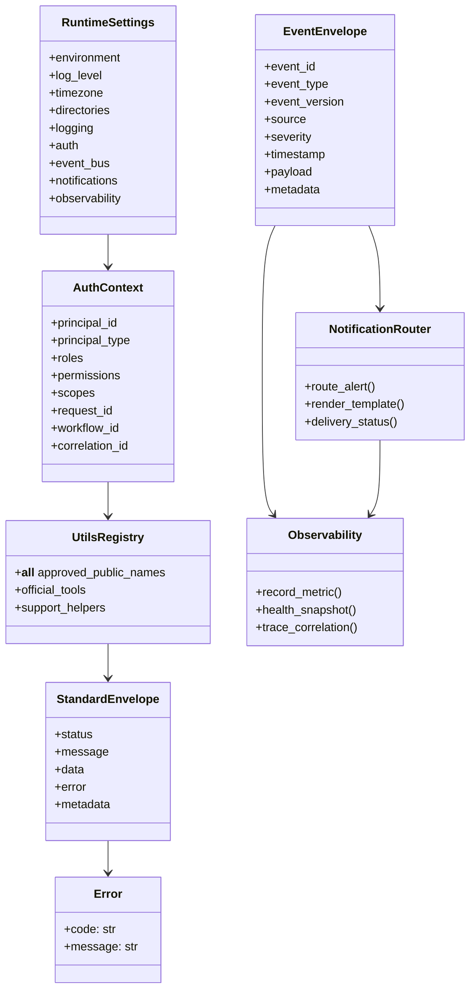

# 01-utils.md - Requirements

**Target path:** `docs/planning/DOMAIN.md`
**Target module:** `tools/utils/`
**Status:** Restructured production-ready requirements by expected implementation file
**Source basis:** Uploaded `01-utils.md`; all unchecked checklist items were extracted and mapped exactly once.
**Source checkbox count:** `1,163` unchecked items; `0` checked items.

---

## 1. Purpose

This document reorganizes the HaruQuant `tools/utils/` domain requirements into implementation-file ownership sections. It preserves the high-level planning context while making each file responsible for a clear, testable slice of the utility foundation.

The `tools/utils/` module is the shared production-grade utility foundation for HaruQuantAI. It provides stable, typed, documented, deterministic, logged, testable, and secure primitives consumed by data, research, simulation, risk, portfolio, execution, analytics, governance, and agentic workflows.

---

## 2. Assumptions

- This remains a domain-level requirements document, not a sprint-specific implementation prompt.
- Implementation is clean and fresh; no backward-compatibility shims are required.
- Support helpers stay native unless explicitly classified as official AI tools.
- Official AI tools use the standard HaruQuant response envelope.
- Optional dependencies remain lazy-loaded and feature-scoped.
- External provider credentials are supplied through secure runtime configuration, not hard-coded utilities.
- `tools.data` owns market-data repair, cleaning, persistence, enrichment, and resampling; `tools.utils` only validates and reports diagnostics.

---

## 3. Open Questions

No unresolved open questions remain for the baseline production-ready utils module. The source file treats the module as ready for implementation once the checklist is satisfied.

---

## 4. Ownership Specifications

### Owns

- Structured logging primitives.
- Standard tool response envelopes and metadata contracts.
- Deterministic error classes, error-code helpers, and safe exception mapping.
- Request, workflow, event, correlation, causation, version, and idempotency helpers.
- UTC-first time normalization and monotonic execution timing helpers.
- Safe path utilities.
- DataFrame helper utilities and diagnostic OHLCV data-quality validation.
- Schema, payload, evidence, approval, registry, freshness, artifact, numeric-range, and blocked-action validation helpers.
- Redaction, password hashing, encryption/decryption boundaries, and secret-version selection helpers.
- Runtime settings loading and injection contracts.
- Auth context validation and authorization helper checks.
- In-process Event Bus/pub-sub contracts and adapter boundaries.
- Error routing, alert routing, notification routing, metrics, health snapshots, and trace-correlation primitives.

### Does Not Own

- Trading strategy logic.
- Broker execution logic or live account mutation.
- Risk-governor decisions, portfolio allocation decisions, strategy promotion, or live activation approvals.
- Application orchestration, UI behavior, database repositories, broker SDK ownership, or backtest engines.
- External identity-provider token validation unless an explicit application-layer adapter is supplied.
- Market-data repair, resampling, enrichment, persistence, or cleaning workflows.

### Public Capabilities

- Official AI tools: approved validators and redaction tools that return standard envelopes.
- Support helpers: native Python helpers used by higher-level modules.
- Restricted helpers: encryption/decryption and side-effecting adapter helpers that require explicit approval and audit logging before agent access.

---

## 5. Global API Contracts Matrix

| File                             | Contract Area                | Primary API Shape                                          | Boundary Rule                     |
| -------------------------------- | ---------------------------- | ---------------------------------------------------------- | --------------------------------- |
| tools/utils/__init__.py    | Public registry              | Exports approved names only                                | No runtime side effects           |
| tools/utils/standard.py          | Tool envelope + constants    | `status`, `message`, `data`, `error`, `metadata` | Official tool contract owner      |
| tools/utils/logger.py            | Structured logging           | JSON-compatible production logs; human console logs        | No secrets, no implicit config    |
| tools/utils/errors.py            | Error registry               | Typed exceptions + deterministic codes                     | Safe fallback mapping             |
| tools/utils/identity.py          | Trace IDs                    | Request/workflow/correlation/event/idempotency helpers     | Safe for logs/audit               |
| tools/utils/normalization.py     | Time normalization           | UTC-first timestamps + monotonic durations                 | No local timezone assumption      |
| tools/utils/paths.py             | Safe paths                   | Normalized `Path` outputs                                | Base-dir traversal protection     |
| tools/utils/dataframe_tools.py   | DataFrame helpers            | Native values / JSON-safe records                          | Lazy pandas import                |
| tools/utils/data_quality.py      | OHLCV quality tool           | Standard envelope for official tool                        | Diagnostic-only, no mutation      |
| tools/utils/schema_validation.py | Schema validators            | Native validation + official wrappers                      | Bounded invalid-field diagnostics |
| tools/utils/security.py          | Redaction/encryption         | Redacted scalars/mappings/text; encryption helpers         | No key/plaintext leakage          |
| tools/utils/settings.py          | Runtime settings             | Immutable typed settings                                   | Explicit load/injection only      |
| tools/utils/auth.py              | Auth context + authorization | Allow/deny decisions                                       | Deny by default                   |
| tools/utils/event_bus.py         | Event envelope + pub/sub     | Publish/subscribe delivery result                          | Bounded queues/idempotency        |
| tools/utils/error_routing.py     | Error events + routing       | Routed/suppressed/deduped status                           | No recursive alert storms         |
| tools/utils/notifications.py     | Notification routing         | Sent/suppressed/throttled/deduped/failed status            | Fake adapters for tests           |
| tools/utils/observability.py     | Metrics + health             | Prometheus-compatible metrics + health snapshots           | No-op when not configured         |

---

## 6. Configuration Defaults

| Setting / Policy                           | Default / Rule                                                                      | Expected Owner               |
| ------------------------------------------ | ----------------------------------------------------------------------------------- | ---------------------------- |
| DEFAULT_TIMEZONE                           | `UTC`                                                                             | tools/utils/normalization.py |
| Tool response top-level keys               | `status`, `message`, `data`, `error`, `metadata`                          | tools/utils/standard.py      |
| Execution timer                            | `time.perf_counter()` rounded to 3 ms decimals                                    | tools/utils/standard.py      |
| OHLCV quality pass threshold               | `90.0`                                                                            | tools/utils/data_quality.py  |
| OHLCV penalty model                        | critical `-40`, error `-20`, warning `-5`, info `-1`                        | tools/utils/data_quality.py  |
| Runtime settings precedence                | explicit mapping/function args → environment variables →`.env` → safe defaults | tools/utils/settings.py      |
| Default HaruQuant home                     | `HARUQUANT_HOME` or deterministic `.haruquant` under CWD                        | tools/utils/settings.py      |
| Default directories                        | `data`, `cache`, `audit` under HaruQuant home                                 | tools/utils/settings.py      |
| Encryption key env var                     | `ENCRYPTION_KEY`                                                                  | tools/utils/security.py      |
| Password hashing                           | Argon2id preferred; fail clearly unless approved fallback configured                | tools/utils/security.py      |
| Production desktop notifications           | Disabled by default unless explicitly enabled                                       | tools/utils/notifications.py |
| Production Event Bus critical queue policy | Fail-fast by default                                                                | tools/utils/event_bus.py     |

---

## 7. Target Folder Structure

```text
tools/
    __init__.py

    utils/
        __init__.py
        logger.py
        standard.py
        errors.py
        identity.py
        normalization.py
        paths.py
        dataframe_tools.py
        data_quality.py
        schema_validation.py
        security.py
        settings.py
        auth.py
        event_bus.py
        error_routing.py
        notifications.py
        observability.py

tests/
    unit/
        tools/
            utils/
                test_utils_registry.py
                test_logger.py
                test_standard.py
                test_errors.py
                test_identity.py
                test_normalization.py
                test_paths.py
                test_dataframe_tools.py
                test_data_quality.py
                test_schema_validation.py
                test_security.py
                test_settings.py
                test_auth.py
                test_event_bus.py
                test_error_routing.py
                test_notifications.py
                test_observability.py

    usage/
        tools/
            utils/
                standard.py
                data_quality.py
                schema_validation.py
                security.py
                settings.py
                auth.py
                event_bus.py
                notifications.py
                observability.py
```

---

## 8. Architecture Class Diagrams



---

## 9. General / Cross-Cutting Non-Functional Requirements

- Clean API only: no transitional aliases, compatibility shims, duplicate wrapper modules, or fallback import paths.
- Import safety: importing utility modules must not configure logging, read `.env`, open network connections, initialize clients, create files, or import heavy optional dependencies prematurely.
- Determinism: timestamps, IDs, schema diagnostics, canonical JSON, issue limits, and validation outputs must remain reproducible where practical.
- Security: logs, tool responses, events, metrics, notifications, health checks, and dead-letter diagnostics must never leak secrets or raw private payloads.
- Observability: logs, metrics, health snapshots, trace identifiers, and dashboard expectations must be included for operational readiness.
- Bounded operation: validation diagnostics, idempotency caches, queues, samples, issue lists, and metrics labels must have explicit limits.

Detailed checklist items for these cross-cutting requirements are mapped exactly once under the expected implementation file sections below.

---

## 10. Requirements by Expected Implementation File

### 10.1. `tools/__init__.py`

Root package marker for the tools package. Must stay import-safe and side-effect free.

**Related test / usage files:** `tests/unit/tools/test_package_imports.py`

**Mapped source checklist items:** `2`

#### Purpose & Scope

_No source checklist items mapped to this subgroup._

#### Functional Requirements

- [X] Implement `tools/__init__.py` first to establish a clean side-effect-free package.  _Source: 14. Implementation Priority Order, line 1327_
- [X] `tools/__init__.py` exists and is side-effect free.  _Source: 15. Definition of Done, line 1354_

#### Non-Functional & Security Requirements

_No source checklist items mapped to this subgroup._

#### Testing & Edge Cases

_No source checklist items mapped to this subgroup._

---

### 10.2. `tools/utils/__init__.py`

Public registry for the utilities domain. Owns approved exports and public API boundaries.

**Related test / usage files:** `tests/unit/tools/utils/test_utils_registry.py`

**Mapped source checklist items:** `15`

#### Purpose & Scope

- [X] The implementation is expected to be fresh and clean, with no backward-compatibility shims.  _Source: 13. Assumptions, line 1303_

#### Functional Requirements

- [X] `tools/utils/__init__.py` must act as the public registry for the utility domain.  _Source: 3. Functional Requirements > 3.2 Public API and Registry, line 147_
- [X] Only intentionally imported names listed in `__all__` may be public.  _Source: 3. Functional Requirements > 3.2 Public API and Registry, line 148_
- [X] Support helpers may return native Python values when they are not agent-callable tools.  _Source: 3. Functional Requirements > 3.2 Public API and Registry, line 151_
- [X] Internal helpers must remain private unless explicitly intended for public import.  _Source: 3. Functional Requirements > 3.2 Public API and Registry, line 154_
- [X] No accidental public exports may exist.  _Source: 3. Functional Requirements > 3.2 Public API and Registry, line 155_
- [X] No compatibility shims, aliases, fallback import modules, or duplicate wrapper modules may exist.  _Source: 3. Functional Requirements > 3.2 Public API and Registry, line 156_
- [X] New public exports must be justified by real cross-domain reuse.  _Source: 3. Functional Requirements > 3.2 Public API and Registry, line 157_
- [X] Public exports may not be renamed or removed after v8 acceptance without a new versioned specification and registry review.  _Source: 3. Functional Requirements > 3.2 Public API and Registry, line 158_
- [X] Implement `tools/utils/__init__.py` only after modules exist and public names are finalized.  _Source: 14. Implementation Priority Order, line 1344_
- [X] `tools/utils/__init__.py` exposes only approved public names.  _Source: 15. Definition of Done, line 1355_

#### Non-Functional & Security Requirements

- [X] `tools/utils/__init__.py` must not eagerly import pandas, cryptography, dotenv, broker SDKs, network clients, notification clients, Prometheus exporters, or other heavy optional dependencies unless absolutely necessary.  _Source: 4. Non-Functional Requirements > 4.2 Import-Time Performance and Side Effects, line 689_
- [X] Documentation must maintain compatibility review notes for future public API changes.  _Source: 12. Documentation Requirements, line 1289_
- [X] Internal helpers are not accidentally exported.  _Source: 15. Definition of Done, line 1357_
- [X] No compatibility shims, aliases, fallback import modules, or duplicate wrapper modules exist.  _Source: 15. Definition of Done, line 1358_

#### Testing & Edge Cases

_No source checklist items mapped to this subgroup._

---

### 10.3. `tools/utils/logger.py`

Project-wide logging helpers, structured logging configuration, safe file logging, and logger lifecycle behavior.

**Related test / usage files:** `tests/unit/tools/utils/test_logger.py`

**Mapped source checklist items:** `44`

#### Purpose & Scope

_No source checklist items mapped to this subgroup._

#### Functional Requirements

- [X] The logger must be exported as a support object and must not be treated as an official AI tool.  _Source: 3. Functional Requirements > 3.2 Public API and Registry, line 152_
- [X] Official AI tools must use structured logging.  _Source: 3. Functional Requirements > 3.3 Official AI Tools, line 181_
- [X] The module must expose a project-wide `logger`.  _Source: 3. Functional Requirements > 3.5 Logging, line 205_
- [X] The module must expose `get_logger(name: str | None = None)`.  _Source: 3. Functional Requirements > 3.5 Logging, line 206_
- [X] The module must expose `configure_logging(level: str | int = "INFO")`.  _Source: 3. Functional Requirements > 3.5 Logging, line 207_
- [X] Logging must use Python `logging`.  _Source: 3. Functional Requirements > 3.5 Logging, line 208_
- [X] Logging must use structured JSON-compatible output for production runtime events.  _Source: 3. Functional Requirements > 3.5 Logging, line 209_
- [X] Production logging must use a JSON-compatible structured formatter.  _Source: 3. Functional Requirements > 3.5 Logging, line 210_
- [X] Local development console logging must support colorized human-readable output.  _Source: 3. Functional Requirements > 3.5 Logging, line 211_
- [X] Human-readable console log lines must use the format `datetime | level | module.submodule.filename:function:line | message`.  _Source: 3. Functional Requirements > 3.5 Logging, line 212_
- [X] Human-readable console timestamps must use the format `YYYY-MM-DD HH:MM:SS`.  _Source: 3. Functional Requirements > 3.5 Logging, line 213_
- [X] Logging must include `timestamp`, `level`, `logger_name`, `message`, `event_name`, `module`, `function`, `request_id`, `workflow_id`, `correlation_id`, and `error_code` where available.  _Source: 3. Functional Requirements > 3.5 Logging, line 214_
- [X] Human-readable console logging must include source line numbers where available.  _Source: 3. Functional Requirements > 3.5 Logging, line 215_
- [X] Logging must support child loggers per module while preserving a stable root logger name.  _Source: 3. Functional Requirements > 3.5 Logging, line 216_
- [X] Logging configuration must avoid duplicate handlers.  _Source: 3. Functional Requirements > 3.5 Logging, line 217_
- [X] Logging configuration must happen only through an explicit configuration function.  _Source: 3. Functional Requirements > 3.5 Logging, line 218_
- [X] Importing logger utilities must not force application-level logging configuration.  _Source: 3. Functional Requirements > 3.5 Logging, line 219_
- [X] File logging must be opt-in and configured explicitly through runtime settings or `configure_logging`.  _Source: 3. Functional Requirements > 3.5 Logging, line 220_
- [X] File logging must write only to configured log directories that are normalized through safe path handling.  _Source: 3. Functional Requirements > 3.5 Logging, line 221_
- [X] File logging must use rotating log files when enabled.  _Source: 3. Functional Requirements > 3.5 Logging, line 222_
- [X] Log rotation must support configurable maximum file size and maximum retained file count.  _Source: 3. Functional Requirements > 3.5 Logging, line 223_
- [X] Log retention must support configurable deletion of old rotated log files.  _Source: 3. Functional Requirements > 3.5 Logging, line 224_
- [X] Log retention deletion must be bounded to configured log directories and must not delete arbitrary files.  _Source: 3. Functional Requirements > 3.5 Logging, line 225_
- [X] Log file writes, rotation, and retention deletion must degrade safely if the filesystem or logging sink fails.  _Source: 3. Functional Requirements > 3.5 Logging, line 226_
- [X] Logging must avoid writing secrets.  _Source: 3. Functional Requirements > 3.5 Logging, line 227_
- [X] Log-level configuration must be controlled by runtime settings.  _Source: 3. Functional Requirements > 3.5 Logging, line 228_
- [X] Production files must log function/tool calls, validation failures, successful completions, recoverable warnings, and execution failures where applicable.  _Source: 3. Functional Requirements > 3.5 Logging, line 229_
- [X] Official AI tool logs must distinguish start, completion, validation failure, recoverable warning, and execution failure lifecycle events.  _Source: 3. Functional Requirements > 3.5 Logging, line 230_
- [X] Official AI tool logs must include request and workflow trace identifiers where available.  _Source: 3. Functional Requirements > 3.5 Logging, line 231_
- [X] Event Bus logs must include publish, subscribe, delivery failure, retry, dead-letter, queue-full, and dropped-event events.  _Source: 3. Functional Requirements > 3.5 Logging, line 232_
- [X] Notification logs must include routing decisions and delivery outcomes without exposing sensitive message bodies.  _Source: 3. Functional Requirements > 3.5 Logging, line 233_
- [X] Auth logs must include sanitized auth validation and authorization decisions.  _Source: 3. Functional Requirements > 3.5 Logging, line 234_
- [X] Observability logs must include metrics/export/health-check failures where detectable.  _Source: 3. Functional Requirements > 3.5 Logging, line 235_
- [X] Production files must never log passwords, API keys, broker credentials, encryption keys, tokens, raw private payloads, full approval packets, notification provider credentials, authorization headers, or Telegram bot tokens.  _Source: 3. Functional Requirements > 3.5 Logging, line 236_
- [X] Implement `tools/utils/logger.py` before modules that need production logging.  _Source: 14. Implementation Priority Order, line 1328_

#### Non-Functional & Security Requirements

- [X] Important events and recoverable failures must use structured logging.  _Source: 4. Non-Functional Requirements > 4.1 Code Quality, line 679_
- [X] Immutable constants and logger objects are allowed.  _Source: 4. Non-Functional Requirements > 4.3 Determinism, Concurrency, and Shared State, line 708_
- [X] Logging must be thread-safe under concurrent tool execution.  _Source: 4. Non-Functional Requirements > 4.3 Determinism, Concurrency, and Shared State, line 724_
- [X] Logging overhead must be minimal for normal tool execution.  _Source: 4. Non-Functional Requirements > 4.6 Performance, line 766_
- [X] Logging must degrade safely if a logging sink fails.  _Source: 4. Non-Functional Requirements > 4.7 Reliability and Degradation, line 772_
- [X] Documentation must describe required log fields and optional trace fields.  _Source: 12. Documentation Requirements, line 1253_
- [X] Local development logging supports colorized human-readable console output in the approved format.  _Source: 15. Definition of Done, line 1369_

#### Testing & Edge Cases

- [X] Logging output must be deterministic enough for unit testing where log fields are asserted.  _Source: 4. Non-Functional Requirements > 4.3 Determinism, Concurrency, and Shared State, line 716_
- [X] Logger tests must verify colorized console output can be enabled and disabled deterministically.  _Source: 11. Testing Requirements, line 1145_

---

### 10.4. `tools/utils/standard.py`

Standard tool envelopes, metadata constants, side-effect flags, canonical JSON behavior, shared constants, and official tool contract helpers.

**Related test / usage files:** `tests/unit/tools/utils/test_standard.py`, `tests/usage/tools/utils.py`

**Mapped source checklist items:** `144`

#### Purpose & Scope

- [X] The utilities module must not own trading strategy logic.  _Source: 5. Business Rules, line 797_
- [X] The utilities module must not own broker execution logic.  _Source: 5. Business Rules, line 798_
- [X] The utilities module must not own risk-governor decisions.  _Source: 5. Business Rules, line 799_
- [X] The utilities module must not own portfolio allocation decisions.  _Source: 5. Business Rules, line 800_
- [X] The utilities module must not own application orchestration.  _Source: 5. Business Rules, line 801_
- [X] The utilities module must not become a dumping ground for unrelated helpers.  _Source: 5. Business Rules, line 802_
- [X] The utilities module must not export every internal helper as a public agent tool.  _Source: 5. Business Rules, line 803_
- [X] The utilities module must not hide external dependency behavior behind unclear convenience functions.  _Source: 5. Business Rules, line 804_
- [X] The utilities module must not perform live trading or live account mutation.  _Source: 5. Business Rules, line 805_
- [X] The utilities module must not make trading, risk, allocation, execution, or strategy acceptance decisions.  _Source: 5. Business Rules, line 806_
- [X] Utilities must not approve or reject trades.  _Source: 5. Business Rules, line 809_
- [X] Utilities must not recommend allocations.  _Source: 5. Business Rules, line 810_
- [X] Utilities must not decide strategy promotion.  _Source: 5. Business Rules, line 811_
- [X] Utilities must not approve risk changes.  _Source: 5. Business Rules, line 812_
- [X] Utilities must not place, close, modify, or cancel orders.  _Source: 5. Business Rules, line 813_
- [X] Utilities must not activate live systems.  _Source: 5. Business Rules, line 814_
- [X] Utilities must not override kill switches.  _Source: 5. Business Rules, line 815_
- [X] Modules requiring financial decisions must call the appropriate risk, portfolio, execution, strategy, or governance domain.  _Source: 5. Business Rules, line 816_
- [X] This is a domain-level requirements document for `docs/planning/DOMAIN.md`, not a sprint-specific requirements document.  _Source: 13. Assumptions, line 1302_
- [X] Support helpers remain native unless explicitly classified as official AI tools.  _Source: 13. Assumptions, line 1304_
- [X] Conditional AI tools remain support helpers unless direct agent use is approved.  _Source: 13. Assumptions, line 1305_
- [X] `tools.data` will own repair, resampling, enrichment, persistence, and cleaning workflows for market data.  _Source: 13. Assumptions, line 1306_
- [X] Optional dependencies may or may not be installed; importability must remain intact either way.  _Source: 13. Assumptions, line 1308_
- [X] No UI, broker runtime, database repository, or LLM framework dependency is required inside `tools.utils`.  _Source: 13. Assumptions, line 1311_

#### Functional Requirements

- [X] Public names must be classified as either official AI tools or support objects/helpers.  _Source: 3. Functional Requirements > 3.2 Public API and Registry, line 149_
- [X] Official AI tools must return the standard HaruQuant tool envelope.  _Source: 3. Functional Requirements > 3.2 Public API and Registry, line 150_
- [X] Official AI tools must include tool metadata.  _Source: 3. Functional Requirements > 3.3 Official AI Tools, line 177_
- [X] Official AI tools must include risk and side-effect flags.  _Source: 3. Functional Requirements > 3.3 Official AI Tools, line 178_
- [X] Official AI tools must validate inputs.  _Source: 3. Functional Requirements > 3.3 Official AI Tools, line 179_
- [X] Official AI tools must not fail silently.  _Source: 3. Functional Requirements > 3.3 Official AI Tools, line 184_
- [X] Agents may call only approved official AI tools through approved tool attachment.  _Source: 3. Functional Requirements > 3.3 Official AI Tools, line 185_
- [X] Every official AI tool must return the top-level keys `status`, `message`, `data`, `error`, and `metadata`.  _Source: 3. Functional Requirements > 3.4 Standard Tool Response, line 189_
- [X] `status` must be either `success` or `error`.  _Source: 3. Functional Requirements > 3.4 Standard Tool Response, line 190_
- [X] `message` must be a string.  _Source: 3. Functional Requirements > 3.4 Standard Tool Response, line 191_
- [X] `error` must be either `None` or a mapping with `code` and `details`.  _Source: 3. Functional Requirements > 3.4 Standard Tool Response, line 192_
- [X] Standard response validation must reject missing top-level keys.  _Source: 3. Functional Requirements > 3.4 Standard Tool Response, line 194_
- [X] Standard response validation must reject missing metadata keys.  _Source: 3. Functional Requirements > 3.4 Standard Tool Response, line 195_
- [X] Standard response validation must reject malformed errors.  _Source: 3. Functional Requirements > 3.4 Standard Tool Response, line 197_
- [X] `get_execution_ms(start_time)` must calculate execution duration consistently for official tools.  _Source: 3. Functional Requirements > 3.4 Standard Tool Response, line 199_
- [X] `get_execution_ms(start_time)` must return milliseconds rounded to three decimals.  _Source: 3. Functional Requirements > 3.4 Standard Tool Response, line 201_
- [X] Official tools must not return unstructured `None`.  _Source: 4. Non-Functional Requirements > 4.1 Code Quality, line 681_
- [X] Official AI tools must return standard HaruQuant tool envelopes.  _Source: 6. Inputs and Outputs > 6.2 Outputs, line 866_
- [X] Official success responses must include `status="success"`, message, data, `error=None`, and metadata.  _Source: 6. Inputs and Outputs > 6.2 Outputs, line 867_
- [X] Data-quality issues must include code, severity, message, column, row count, and samples.  _Source: 6. Inputs and Outputs > 6.2 Outputs, line 870_
- [X] Canonical JSON serialization must return deterministic JSON strings.  _Source: 6. Inputs and Outputs > 6.2 Outputs, line 877_
- [X] Error helpers must return deterministic names and fallback messages.  _Source: 6. Inputs and Outputs > 6.2 Outputs, line 879_
- [X] Official AI tools must return standard error envelopes for expected validation failures.  _Source: 9. Error Handling Expectations, line 1011_
- [X] Circuit-open failures must return `CIRCUIT_OPEN` or provider-specific deterministic details.  _Source: 9. Error Handling Expectations, line 1035_
- [X] Error events must include sanitized details only.  _Source: 9. Error Handling Expectations, line 1041_
- [X] Every public function must document return value.  _Source: 12. Documentation Requirements, line 1241_
- [X] Documentation must include an operational runbook for critical utility-layer failures.  _Source: 12. Documentation Requirements, line 1293_
- [X] Implement `tools/utils/standard.py` before official AI tools.  _Source: 14. Implementation Priority Order, line 1329_
- [X] Implement usage examples for official AI tools and production primitives.  _Source: 14. Implementation Priority Order, line 1346_
- [X] Run CI quality gates before accepting the implementation.  _Source: 14. Implementation Priority Order, line 1347_
- [X] The target folder structure exists.  _Source: 15. Definition of Done, line 1353_
- [X] Public registry documentation classifies every official AI tool and support helper.  _Source: 15. Definition of Done, line 1356_
- [X] Official tools return standard envelopes.  _Source: 15. Definition of Done, line 1364_
- [X] Official tools include metadata constants.  _Source: 15. Definition of Done, line 1370_
- [X] Official tools include side-effect flags.  _Source: 15. Definition of Done, line 1371_
- [X] Official tools include `execution_ms`.  _Source: 15. Definition of Done, line 1373_

#### Non-Functional & Security Requirements

- [X] Every Python file must have a file-level docstring.  _Source: 4. Non-Functional Requirements > 4.1 Code Quality, line 673_
- [X] Every public function and class must have a useful docstring.  _Source: 4. Non-Functional Requirements > 4.1 Code Quality, line 674_
- [X] All public functions and methods must be typed.  _Source: 4. Non-Functional Requirements > 4.1 Code Quality, line 675_
- [X] Inputs must be validated where appropriate.  _Source: 4. Non-Functional Requirements > 4.1 Code Quality, line 676_
- [X] Output shapes must be explicit where applicable.  _Source: 4. Non-Functional Requirements > 4.1 Code Quality, line 677_
- [X] Error behavior must be deterministic.  _Source: 4. Non-Functional Requirements > 4.1 Code Quality, line 678_
- [X] Production logic must not use `print()`.  _Source: 4. Non-Functional Requirements > 4.1 Code Quality, line 680_
- [X] Utility functions must be safe for concurrent use unless explicitly documented otherwise.  _Source: 4. Non-Functional Requirements > 4.3 Determinism, Concurrency, and Shared State, line 706_
- [X] Mutable module-level state must be avoided.  _Source: 4. Non-Functional Requirements > 4.3 Determinism, Concurrency, and Shared State, line 707_
- [X] Caller-owned inputs must not be mutated unless documented in the function name and docstring.  _Source: 4. Non-Functional Requirements > 4.3 Determinism, Concurrency, and Shared State, line 709_
- [X] Concurrency guarantees and limitations must be documented per component.  _Source: 4. Non-Functional Requirements > 4.3 Determinism, Concurrency, and Shared State, line 725_
- [X] Optional dependencies must not break importability.  _Source: 4. Non-Functional Requirements > 4.4 Optional Dependencies, line 729_
- [X] Missing optional dependencies must fail only when the relevant feature is used.  _Source: 4. Non-Functional Requirements > 4.4 Optional Dependencies, line 730_
- [X] Missing optional dependency failures must be explicit.  _Source: 4. Non-Functional Requirements > 4.4 Optional Dependencies, line 731_
- [X] Optional dependency error messages must identify the missing dependency and required feature.  _Source: 4. Non-Functional Requirements > 4.4 Optional Dependencies, line 733_
- [X] Official AI tools must not raise expected validation errors to callers.  _Source: 9. Error Handling Expectations, line 1010_
- [X] Domain-specific errors must be mappable through `Error` inheritance or a compatible `code` attribute.  _Source: 9. Error Handling Expectations, line 1018_
- [X] Error helpers must not raise for unknown codes unless explicitly requested.  _Source: 9. Error Handling Expectations, line 1019_
- [X] Error messages must be human-readable and actionable.  _Source: 9. Error Handling Expectations, line 1020_
- [X] Event validation failures must map to `INVALID_EVENT`.  _Source: 9. Error Handling Expectations, line 1022_
- [X] Every Python file must start with a file-level docstring.  _Source: 12. Documentation Requirements, line 1233_
- [X] File-level docstrings must state purpose.  _Source: 12. Documentation Requirements, line 1234_
- [X] File-level docstrings must state whether the file contains official AI tools or support helpers.  _Source: 12. Documentation Requirements, line 1235_
- [X] File-level docstrings must list exported public functions/classes.  _Source: 12. Documentation Requirements, line 1236_
- [X] File-level docstrings must describe side effects, if any.  _Source: 12. Documentation Requirements, line 1237_
- [X] Every public function must document what it does.  _Source: 12. Documentation Requirements, line 1238_
- [X] Every public function must document when to use it.  _Source: 12. Documentation Requirements, line 1239_
- [X] Every public function must document arguments.  _Source: 12. Documentation Requirements, line 1240_
- [X] Every public function must document side effects, if any.  _Source: 12. Documentation Requirements, line 1243_
- [X] Official AI tool docstrings must be agent-facing.  _Source: 12. Documentation Requirements, line 1244_
- [X] Official AI tool docstrings must explain when an agent should use the tool.  _Source: 12. Documentation Requirements, line 1245_
- [X] Official AI tool docstrings must explain what the tool does not do.  _Source: 12. Documentation Requirements, line 1247_
- [X] Usage examples must demonstrate success and error handling.  _Source: 12. Documentation Requirements, line 1249_
- [X] Usage examples must use realistic inputs.  _Source: 12. Documentation Requirements, line 1250_
- [X] Documentation must describe safe metric-label rules and examples of rejected labels.  _Source: 12. Documentation Requirements, line 1285_
- [X] Documentation must describe which features are support helpers and which are official AI tools.  _Source: 12. Documentation Requirements, line 1287_
- [X] Documentation must describe which adapters are optional and lazy-loaded.  _Source: 12. Documentation Requirements, line 1290_
- [X] Every Python file has a file-level docstring.  _Source: 15. Definition of Done, line 1359_
- [X] Every public function/class has a useful docstring.  _Source: 15. Definition of Done, line 1360_
- [X] Public functions and methods are typed.  _Source: 15. Definition of Done, line 1361_
- [X] Inputs are validated where appropriate.  _Source: 15. Definition of Done, line 1362_
- [X] Errors are explicit and deterministic.  _Source: 15. Definition of Done, line 1363_
- [X] No production `print()` calls exist.  _Source: 15. Definition of Done, line 1366_
- [X] Data repair and cleaning workflows are explicitly excluded from `tools.utils` and reserved for `tools.data`.  _Source: 15. Definition of Done, line 1380_
- [X] Future domain-specific errors inherit from `Error` or expose a compatible `code` attribute.  _Source: 15. Definition of Done, line 1383_
- [X] Standard response builders can map `Error` subclasses generically without hardcoding every future domain error.  _Source: 15. Definition of Done, line 1384_
- [X] Usage examples exist for official AI tools.  _Source: 15. Definition of Done, line 1411_
- [X] Usage examples use realistic inputs.  _Source: 15. Definition of Done, line 1412_
- [X] Usage examples show success and error handling.  _Source: 15. Definition of Done, line 1413_
- [X] Full-project quality gate passes.  _Source: 15. Definition of Done, line 1421_
- [X] No unresolved open questions remain for the baseline production-ready utils module.  _Source: 15. Definition of Done, line 1424_

#### Testing & Edge Cases

- [X] The implementation must be compatible with Black, isort, Flake8, mypy, pytest, and coverage.  _Source: 4. Non-Functional Requirements > 4.1 Code Quality, line 684_
- [X] Shared caches are allowed only when explicitly specified, bounded, and tested.  _Source: 4. Non-Functional Requirements > 4.3 Determinism, Concurrency, and Shared State, line 710_
- [X] Time-dependent helpers must support deterministic testing where practical.  _Source: 4. Non-Functional Requirements > 4.3 Determinism, Concurrency, and Shared State, line 711_
- [X] ID-dependent and randomness-dependent helpers must support deterministic testing where practical.  _Source: 4. Non-Functional Requirements > 4.3 Determinism, Concurrency, and Shared State, line 714_
- [X] The utilities module must not implement UI, database repositories, or backtest engines.  _Source: 5. Business Rules, line 807_
- [X] Negative prices must be reported.  _Source: 8. Edge Cases, line 935_
- [X] Zero prices must be reported.  _Source: 8. Edge Cases, line 936_
- [X] OHLC values outside high/low range must be reported.  _Source: 8. Edge Cases, line 938_
- [X] NaN and infinity values must be detected.  _Source: 8. Edge Cases, line 944_
- [X] Symbol verification must be marked `not_available` when no symbol column exists.  _Source: 8. Edge Cases, line 946_
- [X] Issue lists and issue samples must truncate when limits are reached.  _Source: 8. Edge Cases, line 948_
- [X] Repeated identical alerts must be deduplicated or throttled.  _Source: 8. Edge Cases, line 987_
- [X] High-cardinality metric labels must be rejected or normalized.  _Source: 8. Edge Cases, line 992_
- [X] Open circuit state must fail fast.  _Source: 8. Edge Cases, line 997_
- [X] Unit tests must exist for every utility module.  _Source: 11. Testing Requirements, line 1125_
- [X] Usage examples must exist for official AI tools.  _Source: 11. Testing Requirements, line 1126_
- [X] Minimum line coverage must be at least 80% for `tools.utils`.  _Source: 11. Testing Requirements, line 1127_
- [X] Tests must cover edge cases.  _Source: 11. Testing Requirements, line 1131_
- [X] Official AI tool tests must verify metadata correctness.  _Source: 11. Testing Requirements, line 1134_
- [X] Official AI tool tests must verify `execution_ms` existence.  _Source: 11. Testing Requirements, line 1136_
- [X] Data-quality tests must cover at least 15 distinct data-quality cases.  _Source: 11. Testing Requirements, line 1153_
- [X] CI must pass Black, isort, Flake8, mypy, pytest, and the coverage gate.  _Source: 11. Testing Requirements, line 1227_
- [X] Implement unit tests for every module.  _Source: 14. Implementation Priority Order, line 1345_
- [X] Unit tests exist for every module.  _Source: 15. Definition of Done, line 1403_
- [X] Official tools have metadata tests.  _Source: 15. Definition of Done, line 1405_
- [X] Edge case tests exist.  _Source: 15. Definition of Done, line 1407_
- [X] Coverage is at least 80%.  _Source: 15. Definition of Done, line 1410_
- [X] Black passes.  _Source: 15. Definition of Done, line 1415_
- [X] isort passes.  _Source: 15. Definition of Done, line 1416_
- [X] Flake8 passes.  _Source: 15. Definition of Done, line 1417_
- [X] mypy passes.  _Source: 15. Definition of Done, line 1418_
- [X] pytest passes.  _Source: 15. Definition of Done, line 1419_
- [X] Coverage gate passes.  _Source: 15. Definition of Done, line 1420_

---

### 10.5. `tools/utils/errors.py`

Typed HaruQuant exceptions, deterministic error-code registry, and safe exception-to-envelope mapping.

**Related test / usage files:** `tests/unit/tools/utils/test_errors.py`, `tests/usage/tools/utils.py`

**Mapped source checklist items:** `50`

#### Purpose & Scope

_No source checklist items mapped to this subgroup._

#### Functional Requirements

- [X] Official AI tools must use deterministic error codes.  _Source: 3. Functional Requirements > 3.3 Official AI Tools, line 183_
- [X] Standard response validation should validate error codes against the approved error-code set where practical.  _Source: 3. Functional Requirements > 3.4 Standard Tool Response, line 198_
- [X] The module must define `Error`.  _Source: 3. Functional Requirements > 3.8 Error Utilities, line 280_
- [X] The module must define `ValidationError`.  _Source: 3. Functional Requirements > 3.8 Error Utilities, line 281_
- [X] The module must define `ConfigurationError`.  _Source: 3. Functional Requirements > 3.8 Error Utilities, line 282_
- [X] The module must define `SecurityError`.  _Source: 3. Functional Requirements > 3.8 Error Utilities, line 283_
- [X] The module must define `DataError`.  _Source: 3. Functional Requirements > 3.8 Error Utilities, line 284_
- [X] The module must define `ExternalServiceError`.  _Source: 3. Functional Requirements > 3.8 Error Utilities, line 285_
- [X] Every shared exception must carry a deterministic `code` attribute.  _Source: 3. Functional Requirements > 3.8 Error Utilities, line 286_
- [X] Error messages must be human-readable.  _Source: 3. Functional Requirements > 3.8 Error Utilities, line 287_
- [X] `error_name(code)` must return deterministic names.  _Source: 3. Functional Requirements > 3.8 Error Utilities, line 288_
- [X] `message_for(code, default)` must return useful fallback messages.  _Source: 3. Functional Requirements > 3.8 Error Utilities, line 289_
- [X] Unknown codes must resolve safely to `UNKNOWN_ERROR` or a provided default.  _Source: 3. Functional Requirements > 3.8 Error Utilities, line 290_
- [X] Future domain-specific errors must inherit from `Error` or expose a compatible `code: str` attribute.  _Source: 3. Functional Requirements > 3.8 Error Utilities, line 291_
- [X] Standard response builders must map `Error` subclasses generically without requiring every future domain error to be hardcoded.  _Source: 3. Functional Requirements > 3.8 Error Utilities, line 292_
- [X] Unknown non-HaruQuant exceptions must map safely to `UNKNOWN_ERROR` or `TOOL_EXECUTION_FAILED` at controlled tool boundaries.  _Source: 3. Functional Requirements > 3.8 Error Utilities, line 293_
- [X] Official error responses must include `status="error"`, message, `data=None`, error code/details, and metadata.  _Source: 6. Inputs and Outputs > 6.2 Outputs, line 868_
- [X] Support helpers may return native Python values or raise typed exceptions.  _Source: 6. Inputs and Outputs > 6.2 Outputs, line 880_
- [X] Unexpected execution failures must return `TOOL_EXECUTION_FAILED` or another safe deterministic error code.  _Source: 9. Error Handling Expectations, line 1013_
- [X] Implement `tools/utils/errors.py` before deterministic failure behavior is needed.  _Source: 14. Implementation Priority Order, line 1330_
- [X] Support helpers return clear native values or raise typed exceptions.  _Source: 15. Definition of Done, line 1365_

#### Non-Functional & Security Requirements

- [X] Support helpers may raise typed HaruQuant exceptions for programmer or validation errors.  _Source: 9. Error Handling Expectations, line 1009_
- [X] Expected validation failures should use deterministic codes such as `INVALID_INPUT` or `VALIDATION_FAILED`.  _Source: 9. Error Handling Expectations, line 1012_
- [X] Raw exception objects must never be returned in `data`.  _Source: 9. Error Handling Expectations, line 1014_
- [X] Raw exception objects must never be returned in `error`.  _Source: 9. Error Handling Expectations, line 1015_
- [X] Unknown non-HaruQuant exceptions must map safely to `UNKNOWN_ERROR` or `TOOL_EXECUTION_FAILED`.  _Source: 9. Error Handling Expectations, line 1017_
- [X] `INVALID_AUTH_CONTEXT`  _Source: 9. Error Handling Expectations > 9.1 Approved Error-Code Registry Additions, line 1048_
- [X] `AUTHORIZATION_FAILED`  _Source: 9. Error Handling Expectations > 9.1 Approved Error-Code Registry Additions, line 1049_
- [X] `INVALID_EVENT`  _Source: 9. Error Handling Expectations > 9.1 Approved Error-Code Registry Additions, line 1050_
- [X] `EVENT_PUBLISH_FAILED`  _Source: 9. Error Handling Expectations > 9.1 Approved Error-Code Registry Additions, line 1051_
- [X] `EVENT_HANDLER_FAILED`  _Source: 9. Error Handling Expectations > 9.1 Approved Error-Code Registry Additions, line 1052_
- [X] `EVENT_DEAD_LETTER_FAILED`  _Source: 9. Error Handling Expectations > 9.1 Approved Error-Code Registry Additions, line 1053_
- [X] `QUEUE_FULL`  _Source: 9. Error Handling Expectations > 9.1 Approved Error-Code Registry Additions, line 1054_
- [X] `BACKPRESSURE_EXCEEDED`  _Source: 9. Error Handling Expectations > 9.1 Approved Error-Code Registry Additions, line 1055_
- [X] `NOTIFICATION_FAILED`  _Source: 9. Error Handling Expectations > 9.1 Approved Error-Code Registry Additions, line 1056_
- [X] `NOTIFICATION_SUPPRESSED`  _Source: 9. Error Handling Expectations > 9.1 Approved Error-Code Registry Additions, line 1057_
- [X] `NOTIFICATION_THROTTLED`  _Source: 9. Error Handling Expectations > 9.1 Approved Error-Code Registry Additions, line 1058_
- [X] `OBSERVABILITY_ERROR`  _Source: 9. Error Handling Expectations > 9.1 Approved Error-Code Registry Additions, line 1059_
- [X] `METRICS_EXPORT_FAILED`  _Source: 9. Error Handling Expectations > 9.1 Approved Error-Code Registry Additions, line 1060_
- [X] `CLOCK_DRIFT_DETECTED`  _Source: 9. Error Handling Expectations > 9.1 Approved Error-Code Registry Additions, line 1061_
- [X] `CIRCUIT_OPEN`  _Source: 9. Error Handling Expectations > 9.1 Approved Error-Code Registry Additions, line 1062_
- [X] `SECRET_VERSION_CONFLICT`  _Source: 9. Error Handling Expectations > 9.1 Approved Error-Code Registry Additions, line 1063_
- [X] Every public function must document raised exceptions or structured error behavior.  _Source: 12. Documentation Requirements, line 1242_
- [X] Official AI tool docstrings must explain what error codes may be returned.  _Source: 12. Documentation Requirements, line 1248_
- [X] Official tools use deterministic error codes.  _Source: 15. Definition of Done, line 1374_

#### Testing & Edge Cases

- [X] Missing mandatory OHLC columns must return structured `INVALID_INPUT`.  _Source: 8. Edge Cases, line 926_
- [X] Unknown error codes must resolve safely.  _Source: 8. Edge Cases, line 966_
- [X] Unknown non-HaruQuant exceptions must map safely at controlled tool boundaries.  _Source: 8. Edge Cases, line 967_
- [X] Official AI tool tests must verify deterministic error codes.  _Source: 11. Testing Requirements, line 1137_
- [X] Error tests must verify exception attributes, known codes, unknown codes, and fallback messages.  _Source: 11. Testing Requirements, line 1147_

---

### 10.6. `tools/utils/identity.py`

IDs, version helpers, request/workflow/correlation/causation/event/idempotency traceability primitives.

**Related test / usage files:** `tests/unit/tools/utils/test_identity.py`

**Mapped source checklist items:** `37`

#### Purpose & Scope

_No source checklist items mapped to this subgroup._

#### Functional Requirements

- [X] Official AI tools must include `request_id: str | None = None`.  _Source: 3. Functional Requirements > 3.3 Official AI Tools, line 176_
- [X] `metadata` must include `tool_name`, `tool_version`, `tool_category`, `tool_risk_level`, `request_id`, `execution_ms`, `read_only`, `writes_file`, `modifies_database`, `places_trade`, and `requires_network`.  _Source: 3. Functional Requirements > 3.4 Standard Tool Response, line 193_
- [X] Standard response validation must reject invalid statuses.  _Source: 3. Functional Requirements > 3.4 Standard Tool Response, line 196_
- [X] The module must provide `generate_id`.  _Source: 3. Functional Requirements > 3.9 Identity and Traceability, line 297_
- [X] The module must provide `generate_prefixed_id`.  _Source: 3. Functional Requirements > 3.9 Identity and Traceability, line 298_
- [X] The module must provide `generate_request_id`.  _Source: 3. Functional Requirements > 3.9 Identity and Traceability, line 299_
- [X] The module must provide `generate_workflow_id`.  _Source: 3. Functional Requirements > 3.9 Identity and Traceability, line 300_
- [X] The module must provide `generate_correlation_id` or equivalent correlation ID support.  _Source: 3. Functional Requirements > 3.9 Identity and Traceability, line 301_
- [X] The module must provide `generate_event_id` or equivalent event ID support.  _Source: 3. Functional Requirements > 3.9 Identity and Traceability, line 302_
- [X] The module must provide `validate_request_id`.  _Source: 3. Functional Requirements > 3.9 Identity and Traceability, line 303_
- [X] The module must provide `validate_workflow_id`.  _Source: 3. Functional Requirements > 3.9 Identity and Traceability, line 304_
- [X] The module must provide `ensure_version`.  _Source: 3. Functional Requirements > 3.9 Identity and Traceability, line 305_
- [X] IDs must be string-safe.  _Source: 3. Functional Requirements > 3.9 Identity and Traceability, line 306_
- [X] IDs must be safe for logs, filenames where practical, audit records, tool metadata, events, notifications, and metrics after cardinality controls.  _Source: 3. Functional Requirements > 3.9 Identity and Traceability, line 307_
- [X] IDs must not contain secrets or raw user-provided text.  _Source: 3. Functional Requirements > 3.9 Identity and Traceability, line 308_
- [X] Prefix validation must reject empty or unsafe prefixes.  _Source: 3. Functional Requirements > 3.9 Identity and Traceability, line 309_
- [X] Generated IDs must be collision-resistant.  _Source: 3. Functional Requirements > 3.9 Identity and Traceability, line 310_
- [X] Generated IDs must use UUID4, ULID-like generation, or an equivalently collision-resistant approach unless deterministic IDs are explicitly required.  _Source: 3. Functional Requirements > 3.9 Identity and Traceability, line 311_
- [X] Request IDs and workflow IDs must be suitable for logs, audit records, tool responses, and agent handoffs.  _Source: 3. Functional Requirements > 3.9 Identity and Traceability, line 312_
- [X] ID validation must be deterministic and must not perform external lookups.  _Source: 3. Functional Requirements > 3.9 Identity and Traceability, line 313_
- [X] `ensure_version(None)` must return the configured default.  _Source: 3. Functional Requirements > 3.9 Identity and Traceability, line 314_
- [X] Official AI tools must accept optional `request_id`.  _Source: 6. Inputs and Outputs > 6.1 Inputs, line 837_
- [X] Identity helpers must accept prefixes and version strings.  _Source: 6. Inputs and Outputs > 6.1 Inputs, line 850_
- [X] Implement `tools/utils/identity.py` before request/workflow/event trace helpers are needed.  _Source: 14. Implementation Priority Order, line 1331_
- [X] Official tools accept `request_id`.  _Source: 15. Definition of Done, line 1372_

#### Non-Functional & Security Requirements

- [X] The implementation must avoid avoidable circular imports.  _Source: 4. Non-Functional Requirements > 4.1 Code Quality, line 683_
- [X] Large data-quality validations must avoid unnecessary deep copies.  _Source: 4. Non-Functional Requirements > 4.6 Performance, line 757_
- [X] Usage examples must use `request_id` where applicable.  _Source: 12. Documentation Requirements, line 1251_
- [X] Usage examples use `request_id` where applicable.  _Source: 15. Definition of Done, line 1414_

#### Testing & Edge Cases

- [X] Empty or unsafe ID prefixes must fail validation.  _Source: 8. Edge Cases, line 913_
- [X] `ensure_version(None)` must return the default.  _Source: 8. Edge Cases, line 914_
- [X] Invalid datetime inputs must fail clearly.  _Source: 8. Edge Cases, line 915_
- [X] Invalid high-low relationships must be reported.  _Source: 8. Edge Cases, line 937_
- [X] Tests must cover invalid inputs.  _Source: 11. Testing Requirements, line 1130_
- [X] Official AI tool tests must verify request ID propagation.  _Source: 11. Testing Requirements, line 1135_
- [X] Identity tests must verify ID uniqueness, prefix validation, and version defaulting.  _Source: 11. Testing Requirements, line 1148_
- [X] Invalid input tests exist.  _Source: 15. Definition of Done, line 1406_

---

### 10.7. `tools/utils/normalization.py`

UTC-first timestamp normalization, datetime parsing, stale checks, and wall-clock versus monotonic duration policy.

**Related test / usage files:** `tests/unit/tools/utils/test_normalization.py`

**Mapped source checklist items:** `41`

#### Purpose & Scope

_No source checklist items mapped to this subgroup._

#### Functional Requirements

- [ ] Official AI tools must measure execution timing.  _Source: 3. Functional Requirements > 3.3 Official AI Tools, line 180_
- [ ] `get_execution_ms(start_time)` must use a monotonic clock source such as `time.perf_counter()`.  _Source: 3. Functional Requirements > 3.4 Standard Tool Response, line 200_
- [ ] The module must define `DEFAULT_TIMEZONE = "UTC"`.  _Source: 3. Functional Requirements > 3.6 Time and Clock Handling, line 240_
- [ ] The module must provide datetime parsing.  _Source: 3. Functional Requirements > 3.6 Time and Clock Handling, line 241_
- [ ] The module must provide timestamp normalization.  _Source: 3. Functional Requirements > 3.6 Time and Clock Handling, line 242_
- [ ] The module must provide UTC conversion.  _Source: 3. Functional Requirements > 3.6 Time and Clock Handling, line 243_
- [ ] The module must provide naive UTC conversion.  _Source: 3. Functional Requirements > 3.6 Time and Clock Handling, line 244_
- [ ] The module must provide UTC timestamp formatting with trailing `Z`.  _Source: 3. Functional Requirements > 3.6 Time and Clock Handling, line 245_
- [ ] The module must provide timezone normalization for pandas-like series or timestamp columns.  _Source: 3. Functional Requirements > 3.6 Time and Clock Handling, line 246_
- [ ] The module must provide stale-data checks.  _Source: 3. Functional Requirements > 3.6 Time and Clock Handling, line 247_
- [ ] Timezone behavior must be explicit.  _Source: 3. Functional Requirements > 3.6 Time and Clock Handling, line 248_
- [ ] Naive datetimes must be handled deterministically using an explicit assumed timezone.  _Source: 3. Functional Requirements > 3.6 Time and Clock Handling, line 249_
- [ ] ISO strings must parse consistently.  _Source: 3. Functional Requirements > 3.6 Time and Clock Handling, line 250_
- [ ] Time-dependent helpers must support injected `now` values or injected clock objects where practical.  _Source: 3. Functional Requirements > 3.6 Time and Clock Handling, line 251_
- [ ] Invalid datetimes must fail clearly.  _Source: 3. Functional Requirements > 3.6 Time and Clock Handling, line 252_
- [ ] Helpers must not use the local machine timezone implicitly.  _Source: 3. Functional Requirements > 3.6 Time and Clock Handling, line 253_
- [ ] Wall-clock timestamps must be UTC-aware.  _Source: 3. Functional Requirements > 3.6 Time and Clock Handling, line 254_
- [ ] Execution timing must use monotonic timers.  _Source: 3. Functional Requirements > 3.6 Time and Clock Handling, line 255_
- [ ] The system must distinguish wall-clock timestamps from monotonic durations.  _Source: 3. Functional Requirements > 3.6 Time and Clock Handling, line 256_
- [ ] Distributed workflow timestamp validation must surface clock-drift risk where relevant.  _Source: 3. Functional Requirements > 3.6 Time and Clock Handling, line 257_
- [ ] Event envelopes must include event creation time and event processing time where applicable.  _Source: 3. Functional Requirements > 3.6 Time and Clock Handling, line 258_
- [ ] Notification diagnostics must include created, routed, sent, and failed timestamps where applicable.  _Source: 3. Functional Requirements > 3.6 Time and Clock Handling, line 259_
- [ ] Health checks should include clock-drift status where supported by runtime environment.  _Source: 3. Functional Requirements > 3.6 Time and Clock Handling, line 260_
- [ ] Timestamp helpers must accept datetime-like values and explicit timezone assumptions.  _Source: 6. Inputs and Outputs > 6.1 Inputs, line 851_
- [ ] Timestamp formatting must return UTC ISO strings ending in `Z`.  _Source: 6. Inputs and Outputs > 6.2 Outputs, line 878_
- [ ] Implement `tools/utils/normalization.py` before data quality, settings, freshness checks, and event timestamp validation.  _Source: 14. Implementation Priority Order, line 1332_

#### Non-Functional & Security Requirements

- [ ] Importing `tools.utils` must be lightweight.  _Source: 4. Non-Functional Requirements > 4.2 Import-Time Performance and Side Effects, line 688_
- [ ] Heavy dependencies must be imported inside the specific submodule or function that needs them.  _Source: 4. Non-Functional Requirements > 4.2 Import-Time Performance and Side Effects, line 690_
- [ ] Importing any `tools.utils` module must not open network connections.  _Source: 4. Non-Functional Requirements > 4.2 Import-Time Performance and Side Effects, line 696_
- [ ] Importing any `tools.utils` module must not initialize broker clients.  _Source: 4. Non-Functional Requirements > 4.2 Import-Time Performance and Side Effects, line 697_
- [ ] Importing any `tools.utils` module must not run validation jobs.  _Source: 4. Non-Functional Requirements > 4.2 Import-Time Performance and Side Effects, line 701_
- [ ] Documentation must describe UTC-first time policy.  _Source: 12. Documentation Requirements, line 1254_
- [ ] Documentation must describe monotonic execution timing policy.  _Source: 12. Documentation Requirements, line 1255_

#### Testing & Edge Cases

- [ ] Importing `tools.utils` must be safe in tests, CLI scripts, FastAPI startup, and agent runtime initialization.  _Source: 4. Non-Functional Requirements > 4.2 Import-Time Performance and Side Effects, line 692_
- [ ] Naive datetimes must be normalized using the explicit assumed timezone.  _Source: 8. Edge Cases, line 916_
- [ ] Stale checks must be deterministic when `now` is injected.  _Source: 8. Edge Cases, line 917_
- [ ] Unparseable datetimes must be reported.  _Source: 8. Edge Cases, line 928_
- [ ] Non-monotonic timestamps must be reported.  _Source: 8. Edge Cases, line 929_
- [ ] Duplicate timestamps must be reported.  _Source: 8. Edge Cases, line 930_
- [ ] Stale data must fail deterministically.  _Source: 8. Edge Cases, line 957_
- [ ] Normalization tests must verify ISO parsing, naive timezone assumptions, UTC conversion, and stale checks.  _Source: 11. Testing Requirements, line 1149_

---

### 10.8. `tools/utils/paths.py`

Safe path normalization and explicit directory creation helpers.

**Related test / usage files:** `tests/unit/tools/utils/test_paths.py`

**Mapped source checklist items:** `22`

#### Purpose & Scope

_No source checklist items mapped to this subgroup._

#### Functional Requirements

- [ ] The module must provide `normalize_path`.  _Source: 3. Functional Requirements > 3.10 Path Utilities, line 318_
- [ ] The module must provide `ensure_dir`.  _Source: 3. Functional Requirements > 3.10 Path Utilities, line 319_
- [ ] The module must provide `ensure_parent_dir`.  _Source: 3. Functional Requirements > 3.10 Path Utilities, line 320_
- [ ] Path inputs must be validated.  _Source: 3. Functional Requirements > 3.10 Path Utilities, line 321_
- [ ] Directory creation helpers must be explicit side-effect helpers.  _Source: 3. Functional Requirements > 3.10 Path Utilities, line 322_
- [ ] `normalize_path` must have no side effects.  _Source: 3. Functional Requirements > 3.10 Path Utilities, line 323_
- [ ] `ensure_dir` must create a directory when missing.  _Source: 3. Functional Requirements > 3.10 Path Utilities, line 324_
- [ ] `ensure_parent_dir` must create a parent directory when missing.  _Source: 3. Functional Requirements > 3.10 Path Utilities, line 325_
- [ ] Path traversal outside `base_dir` must be rejected when a base directory is supplied.  _Source: 3. Functional Requirements > 3.10 Path Utilities, line 326_
- [ ] Path helpers must return `Path` objects.  _Source: 3. Functional Requirements > 3.10 Path Utilities, line 327_
- [ ] File and directory permissions must use platform-safe defaults.  _Source: 3. Functional Requirements > 3.10 Path Utilities, line 328_
- [ ] Path helpers must accept string or `Path` values and optional `base_dir`.  _Source: 6. Inputs and Outputs > 6.1 Inputs, line 852_
- [ ] Path helpers must return `Path` objects.  _Source: 6. Inputs and Outputs > 6.2 Outputs, line 873_
- [ ] Implement `tools/utils/paths.py` before settings and artifact helpers.  _Source: 14. Implementation Priority Order, line 1333_

#### Non-Functional & Security Requirements

- [ ] Importing any `tools.utils` module must not create files or directories.  _Source: 4. Non-Functional Requirements > 4.2 Import-Time Performance and Side Effects, line 693_

#### Testing & Edge Cases

- [ ] Empty paths must fail validation.  _Source: 8. Edge Cases, line 918_
- [ ] Unsafe path traversal outside `base_dir` must be rejected.  _Source: 8. Edge Cases, line 919_
- [ ] Tests must cover success paths.  _Source: 11. Testing Requirements, line 1129_
- [ ] Tests must cover failure paths.  _Source: 11. Testing Requirements, line 1132_
- [ ] Logger tests must verify human-readable console formatting includes datetime, level, module path, function name, line number, and message.  _Source: 11. Testing Requirements, line 1144_
- [ ] Path tests must verify safe normalization, unsafe traversal, directory creation, and parent creation.  _Source: 11. Testing Requirements, line 1150_
- [ ] A concurrency stress test suite must exist outside the fast unit-test path.  _Source: 11. Testing Requirements, line 1225_

---

### 10.9. `tools/utils/dataframe_tools.py`

Lazy-pandas DataFrame helpers, serialization, comparison, chunking, and parameter-combination support.

**Related test / usage files:** `tests/unit/tools/utils/test_dataframe_tools.py`

**Mapped source checklist items:** `31`

#### Purpose & Scope

_No source checklist items mapped to this subgroup._

#### Functional Requirements

- [ ] The module must provide datetime alignment for dataframes.  _Source: 3. Functional Requirements > 3.11 Dataframe Utilities, line 332_
- [ ] The module must provide bar-to-record conversion.  _Source: 3. Functional Requirements > 3.11 Dataframe Utilities, line 333_
- [ ] The module must provide chunking for sequences.  _Source: 3. Functional Requirements > 3.11 Dataframe Utilities, line 334_
- [ ] The module must provide parameter-combination helpers.  _Source: 3. Functional Requirements > 3.11 Dataframe Utilities, line 335_
- [ ] The module must provide dataframe comparison helpers.  _Source: 3. Functional Requirements > 3.11 Dataframe Utilities, line 336_
- [ ] The module must provide OHLC and OHLCV comparison helpers.  _Source: 3. Functional Requirements > 3.11 Dataframe Utilities, line 337_
- [ ] The module must provide dataframe-record serialization.  _Source: 3. Functional Requirements > 3.11 Dataframe Utilities, line 338_
- [ ] Dataframe helpers may return native Python objects.  _Source: 3. Functional Requirements > 3.11 Dataframe Utilities, line 339_
- [ ] Dataframe columns must be validated where required.  _Source: 3. Functional Requirements > 3.11 Dataframe Utilities, line 340_
- [ ] Dataframe helpers must not mutate caller-owned dataframes unless explicitly documented.  _Source: 3. Functional Requirements > 3.11 Dataframe Utilities, line 341_
- [ ] Dataframe helpers must document copy, view, or transformed-data behavior.  _Source: 3. Functional Requirements > 3.11 Dataframe Utilities, line 342_
- [ ] Serialization must handle timestamps safely.  _Source: 3. Functional Requirements > 3.11 Dataframe Utilities, line 343_
- [ ] `serialize_dataframe_records` must emit UTC ISO timestamp strings ending in `Z`.  _Source: 3. Functional Requirements > 3.11 Dataframe Utilities, line 344_
- [ ] `compare_dataframes` must align by comparable indexes or fail with a clear validation error when deterministic alignment is impossible.  _Source: 3. Functional Requirements > 3.11 Dataframe Utilities, line 345_
- [ ] `chunked` must reject `size <= 0` with a clear validation error.  _Source: 3. Functional Requirements > 3.11 Dataframe Utilities, line 346_
- [ ] Comparisons must support tolerance.  _Source: 3. Functional Requirements > 3.11 Dataframe Utilities, line 347_
- [ ] Empty dataframes must be handled deterministically.  _Source: 3. Functional Requirements > 3.11 Dataframe Utilities, line 348_
- [ ] Importing `tools.utils` must not eagerly import pandas.  _Source: 3. Functional Requirements > 3.11 Dataframe Utilities, line 349_
- [ ] Missing pandas must fail only when a dataframe helper is called.  _Source: 3. Functional Requirements > 3.11 Dataframe Utilities, line 350_
- [ ] Dataframe serialization must return JSON-safe records where practical.  _Source: 6. Inputs and Outputs > 6.2 Outputs, line 876_
- [ ] Implement `tools/utils/dataframe_tools.py` after normalization and errors.  _Source: 14. Implementation Priority Order, line 1341_

#### Non-Functional & Security Requirements

- [ ] Dataframe helpers must use lazy pandas imports or `TYPE_CHECKING` guards.  _Source: 4. Non-Functional Requirements > 4.2 Import-Time Performance and Side Effects, line 691_
- [ ] Importing any `tools.utils` module must not execute expensive dataframe operations.  _Source: 4. Non-Functional Requirements > 4.2 Import-Time Performance and Side Effects, line 702_
- [ ] Dataframe helpers must avoid repeated full-dataframe scans where possible.  _Source: 4. Non-Functional Requirements > 4.6 Performance, line 758_
- [ ] Dataframe helpers use lazy pandas imports or `TYPE_CHECKING` guards.  _Source: 15. Definition of Done, line 1377_

#### Testing & Edge Cases

- [ ] Missing pandas must fail only when dataframe helpers are called.  _Source: 8. Edge Cases, line 920_
- [ ] Missing required dataframe columns must fail clearly.  _Source: 8. Edge Cases, line 921_
- [ ] Empty dataframes must be handled deterministically.  _Source: 8. Edge Cases, line 922_
- [ ] Dataframe index mismatch must fail clearly when deterministic alignment is impossible.  _Source: 8. Edge Cases, line 923_
- [ ] `chunked(size <= 0)` must fail clearly.  _Source: 8. Edge Cases, line 924_
- [ ] Dataframe tests must verify alignment, serialization, UTC timestamp output, comparison, index mismatch behavior, missing columns, chunk-size validation, and no input mutation.  _Source: 11. Testing Requirements, line 1151_

---

### 10.10. `tools/utils/data_quality.py`

Diagnostic-only OHLCV quality preparation and validation official tool behavior.

**Related test / usage files:** `tests/unit/tools/utils/test_data_quality.py`, `tests/usage/tools/utils/data_quality.py`

**Mapped source checklist items:** `68`

#### Purpose & Scope

- [ ] Data-quality market-calendar gap handling depends on session rules being supplied by a caller or future domain module.  _Source: 13. Assumptions, line 1307_
- [ ] The default OHLCV scoring model applies unless a later module-specific specification replaces it.  _Source: 13. Assumptions, line 1309_

#### Functional Requirements

- [ ] `validate_ohlcv_quality` must be implemented as a low-risk, read-only official AI tool.  _Source: 3. Functional Requirements > 3.3 Official AI Tools, line 162_
- [ ] The module must provide `prepare_ohlcv_data`.  _Source: 3. Functional Requirements > 3.12 OHLCV Data Quality, line 354_
- [ ] The module must provide `validate_ohlcv_quality`.  _Source: 3. Functional Requirements > 3.12 OHLCV Data Quality, line 355_
- [ ] `validate_ohlcv_quality` must be stateless and diagnostic-only.  _Source: 3. Functional Requirements > 3.12 OHLCV Data Quality, line 356_
- [ ] `validate_ohlcv_quality` must not repair, enrich, persist, resample, clean, or mutate input data.  _Source: 3. Functional Requirements > 3.12 OHLCV Data Quality, line 357_
- [ ] `validate_ohlcv_quality` may inspect, profile, score, report issues, and provide descriptive remediation recommendations.  _Source: 3. Functional Requirements > 3.12 OHLCV Data Quality, line 358_
- [ ] Data repair, resampling, enrichment, persistence, and cleaning workflows must be reserved for `tools.data`.  _Source: 3. Functional Requirements > 3.12 OHLCV Data Quality, line 359_
- [ ] Caller-owned dataframes must not be mutated.  _Source: 3. Functional Requirements > 3.12 OHLCV Data Quality, line 360_
- [ ] Validation must verify the input is a pandas DataFrame.  _Source: 3. Functional Requirements > 3.12 OHLCV Data Quality, line 361_
- [ ] Validation must verify mandatory OHLC columns exist.  _Source: 3. Functional Requirements > 3.12 OHLCV Data Quality, line 362_
- [ ] Missing mandatory columns must produce structured `INVALID_INPUT` details.  _Source: 3. Functional Requirements > 3.12 OHLCV Data Quality, line 363_
- [ ] Extra columns must be ignored by default and must not fail validation unless they create ambiguity.  _Source: 3. Functional Requirements > 3.12 OHLCV Data Quality, line 364_
- [ ] Validation must verify datetime column or datetime-compatible index availability.  _Source: 3. Functional Requirements > 3.12 OHLCV Data Quality, line 365_
- [ ] Validation must verify datetimes are parseable.  _Source: 3. Functional Requirements > 3.12 OHLCV Data Quality, line 366_
- [ ] Validation must report timestamp monotonicity.  _Source: 3. Functional Requirements > 3.12 OHLCV Data Quality, line 367_
- [ ] Validation must detect duplicate timestamps.  _Source: 3. Functional Requirements > 3.12 OHLCV Data Quality, line 368_
- [ ] Validation must detect duplicate OHLC/OHLCV rows.  _Source: 3. Functional Requirements > 3.12 OHLCV Data Quality, line 369_
- [ ] Validation must detect missing timestamps or inferred gaps when timeframe is known.  _Source: 3. Functional Requirements > 3.12 OHLCV Data Quality, line 370_
- [ ] Validation must distinguish market-calendar gaps from unexpected gaps where session rules are supplied.  _Source: 3. Functional Requirements > 3.12 OHLCV Data Quality, line 371_
- [ ] Validation must verify OHLC values are numeric.  _Source: 3. Functional Requirements > 3.12 OHLCV Data Quality, line 372_
- [ ] Validation must flag negative prices.  _Source: 3. Functional Requirements > 3.12 OHLCV Data Quality, line 373_
- [ ] Validation must flag zero prices.  _Source: 3. Functional Requirements > 3.12 OHLCV Data Quality, line 374_
- [ ] Validation must validate high-low relationships.  _Source: 3. Functional Requirements > 3.12 OHLCV Data Quality, line 375_
- [ ] Validation must verify OHLC values are within candle high/low range.  _Source: 3. Functional Requirements > 3.12 OHLCV Data Quality, line 376_
- [ ] Validation must flag zero volume when volume is supplied.  _Source: 3. Functional Requirements > 3.12 OHLCV Data Quality, line 377_
- [ ] Validation must flag negative volume when volume is supplied.  _Source: 3. Functional Requirements > 3.12 OHLCV Data Quality, line 378_
- [ ] Validation must verify spread is numeric and non-negative when supplied.  _Source: 3. Functional Requirements > 3.12 OHLCV Data Quality, line 379_
- [ ] Validation must detect extreme spikes using configurable thresholds.  _Source: 3. Functional Requirements > 3.12 OHLCV Data Quality, line 380_
- [ ] Validation must detect flatline candles.  _Source: 3. Functional Requirements > 3.12 OHLCV Data Quality, line 381_
- [ ] Validation must detect numeric infinities and NaN values.  _Source: 3. Functional Requirements > 3.12 OHLCV Data Quality, line 382_
- [ ] Validation must report timezone awareness.  _Source: 3. Functional Requirements > 3.12 OHLCV Data Quality, line 383_
- [ ] Validation must produce session-level statistics where possible.  _Source: 3. Functional Requirements > 3.12 OHLCV Data Quality, line 384_
- [ ] Validation must calculate a deterministic quality score.  _Source: 3. Functional Requirements > 3.12 OHLCV Data Quality, line 385_
- [ ] Validation must assign severity levels consistently.  _Source: 3. Functional Requirements > 3.12 OHLCV Data Quality, line 386_
- [ ] Validation must bound issue samples by `max_issue_samples`.  _Source: 3. Functional Requirements > 3.12 OHLCV Data Quality, line 387_
- [ ] Validation must bound issue list length by `max_issues_returned`.  _Source: 3. Functional Requirements > 3.12 OHLCV Data Quality, line 388_
- [ ] Validation must avoid oversized tool responses for large datasets.  _Source: 3. Functional Requirements > 3.12 OHLCV Data Quality, line 389_
- [ ] Validation must report symbol mismatches as `SYMBOL_MISMATCH` when `symbol` is provided and a dataframe `symbol` column exists.  _Source: 3. Functional Requirements > 3.12 OHLCV Data Quality, line 390_
- [ ] Validation must mark symbol verification as `not_available` in summary when `symbol` is provided and no dataframe `symbol` column exists.  _Source: 3. Functional Requirements > 3.12 OHLCV Data Quality, line 391_
- [ ] Validation must report timeframe mismatches as `TIMEFRAME_MISMATCH` or `UNEXPECTED_TIME_GAP` when timeframe checks fail.  _Source: 3. Functional Requirements > 3.12 OHLCV Data Quality, line 392_
- [ ] Successful validation responses must include `symbol`, `timeframe`, `rows_checked`, `quality_score`, `passed`, `severity`, `issues`, `summary`, `profile`, and `remediation`.  _Source: 3. Functional Requirements > 3.12 OHLCV Data Quality, line 393_
- [ ] Each issue must include `code`, `severity`, `message`, `column`, `row_count`, and `sample`.  _Source: 3. Functional Requirements > 3.12 OHLCV Data Quality, line 394_
- [ ] The default quality score penalty model must be: critical `-40`, error `-20`, warning `-5`, info `-1`, bounded from `0` to `100`.  _Source: 3. Functional Requirements > 3.12 OHLCV Data Quality, line 395_
- [ ] OHLCV validation must use a default quality pass threshold of `90.0`.  _Source: 3. Functional Requirements > 3.12 OHLCV Data Quality, line 396_
- [ ] OHLCV `passed=True` must require no critical issues, no error issues, and `quality_score >= quality_pass_threshold`.  _Source: 3. Functional Requirements > 3.12 OHLCV Data Quality, line 397_
- [ ] Warning and info issues may still produce `passed=True` only when the quality score remains above threshold.  _Source: 3. Functional Requirements > 3.12 OHLCV Data Quality, line 398_
- [ ] Overall severity must aggregate deterministically: any critical issue means `critical`; otherwise any error means `error`; otherwise any warning means `warning`; otherwise `info`.  _Source: 3. Functional Requirements > 3.12 OHLCV Data Quality, line 399_
- [ ] Issue truncation must be explicit through `summary["issues_truncated"]` and `summary["samples_truncated"]` when limits are reached.  _Source: 3. Functional Requirements > 3.12 OHLCV Data Quality, line 400_
- [ ] OHLCV validation must accept a pandas DataFrame.  _Source: 6. Inputs and Outputs > 6.1 Inputs, line 838_
- [ ] OHLCV validation must accept optional symbol and timeframe context.  _Source: 6. Inputs and Outputs > 6.1 Inputs, line 839_
- [ ] `validate_ohlcv_quality` success data must include symbol, timeframe, rows checked, quality score, pass/fail state, severity, issues, summary, profile, and remediation.  _Source: 6. Inputs and Outputs > 6.2 Outputs, line 869_
- [ ] Implement `tools/utils/data_quality.py` after standard, errors, normalization, dataframe tools, and schema validation.  _Source: 14. Implementation Priority Order, line 1343_

#### Non-Functional & Security Requirements

- [ ] `validate_ohlcv_quality` should handle 1,000 rows quickly for normal agent workflows.  _Source: 4. Non-Functional Requirements > 4.6 Performance, line 755_
- [ ] `validate_ohlcv_quality` should handle 100,000 rows within a practical local validation budget.  _Source: 4. Non-Functional Requirements > 4.6 Performance, line 756_
- [ ] `validate_ohlcv_quality` is stateless, diagnostic-only, and does not repair, resample, persist, enrich, or mutate input data.  _Source: 15. Definition of Done, line 1379_

#### Testing & Edge Cases

- [ ] Invalid OHLCV input type must return `INVALID_INPUT`.  _Source: 8. Edge Cases, line 925_
- [ ] Extra OHLCV columns must not fail validation unless they create ambiguity.  _Source: 8. Edge Cases, line 927_
- [ ] Duplicate OHLC/OHLCV rows must be reported.  _Source: 8. Edge Cases, line 931_
- [ ] Missing timestamps or inferred gaps must be reported when timeframe is known.  _Source: 8. Edge Cases, line 932_
- [ ] Market-calendar gaps must be distinguished from unexpected gaps where session rules are supplied.  _Source: 8. Edge Cases, line 933_
- [ ] Zero volume must be reported when volume is supplied.  _Source: 8. Edge Cases, line 939_
- [ ] Negative volume must be reported when volume is supplied.  _Source: 8. Edge Cases, line 940_
- [ ] Flatline candles must be detected.  _Source: 8. Edge Cases, line 943_
- [ ] Symbol mismatches must be reported when symbol verification is available.  _Source: 8. Edge Cases, line 945_
- [ ] Timeframe mismatches must be reported when timeframe is supplied.  _Source: 8. Edge Cases, line 947_
- [ ] Data-quality tests cover realistic OHLCV defects.  _Source: 15. Definition of Done, line 1409_

---

### 10.11. `tools/utils/schema_validation.py`

Reusable contract validators and official schema validation wrappers for agent/workflow artifacts.

**Related test / usage files:** `tests/unit/tools/utils/test_schema_validation.py`, `tests/usage/tools/utils/schema_validation.py`

**Mapped source checklist items:** `94`

#### Purpose & Scope

- [ ] Strict schema-version enforcement occurs only when a caller or schema requires a version.  _Source: 13. Assumptions, line 1310_

#### Functional Requirements

- [ ] `validate_input_schema` must be implemented as a low-risk, read-only official AI tool.  _Source: 3. Functional Requirements > 3.3 Official AI Tools, line 163_
- [ ] `validate_output_schema` must be implemented as a low-risk, read-only official AI tool.  _Source: 3. Functional Requirements > 3.3 Official AI Tools, line 164_
- [ ] `validate_handoff_payload` must be implemented as a low-risk, read-only official AI tool.  _Source: 3. Functional Requirements > 3.3 Official AI Tools, line 165_
- [ ] `validate_evidence_pack` must be implemented as a low-risk, read-only official AI tool.  _Source: 3. Functional Requirements > 3.3 Official AI Tools, line 166_
- [ ] `validate_approval_packet` must be implemented as a low-risk, read-only official AI tool.  _Source: 3. Functional Requirements > 3.3 Official AI Tools, line 167_
- [ ] `validate_registry_entry` must be implemented as a low-risk, read-only official AI tool.  _Source: 3. Functional Requirements > 3.3 Official AI Tools, line 168_
- [ ] `validate_data_freshness` must be implemented as a low-risk, read-only official AI tool.  _Source: 3. Functional Requirements > 3.3 Official AI Tools, line 169_
- [ ] Official AI tools must return the standard response schema.  _Source: 3. Functional Requirements > 3.3 Official AI Tools, line 182_
- [ ] The module must provide reusable validation helpers for agent, workflow, tool, registry, evidence, approval, freshness, artifact, and payload contracts.  _Source: 3. Functional Requirements > 3.13 Schema Validation, line 404_
- [ ] `validate_numeric_range` must be a support helper returning a native validation result.  _Source: 3. Functional Requirements > 3.13 Schema Validation, line 405_
- [ ] `validate_required_fields` must be a support helper returning a native validation result.  _Source: 3. Functional Requirements > 3.13 Schema Validation, line 406_
- [ ] Native validation results must include at minimum `valid`, `message`, `code`, and `details`.  _Source: 3. Functional Requirements > 3.13 Schema Validation, line 407_
- [ ] Official validators may wrap native validation results in standard tool envelopes.  _Source: 3. Functional Requirements > 3.13 Schema Validation, line 408_
- [ ] Numeric validation must support risk values, prices, volumes, spreads, scores, thresholds, and allocation limits.  _Source: 3. Functional Requirements > 3.13 Schema Validation, line 409_
- [ ] Numeric validation must reject non-numeric values with deterministic details.  _Source: 3. Functional Requirements > 3.13 Schema Validation, line 410_
- [ ] Numeric validation must reject `NaN`, positive infinity, and negative infinity unless a future specialized function explicitly allows them.  _Source: 3. Functional Requirements > 3.13 Schema Validation, line 411_
- [ ] Numeric validation bounds must be inclusive unless documented otherwise.  _Source: 3. Functional Requirements > 3.13 Schema Validation, line 412_
- [ ] Numeric validation messages must include the logical field name.  _Source: 3. Functional Requirements > 3.13 Schema Validation, line 413_
- [ ] Missing required fields must be explicit.  _Source: 3. Functional Requirements > 3.13 Schema Validation, line 414_
- [ ] Unknown extra fields must be rejected by default for official schema validators.  _Source: 3. Functional Requirements > 3.13 Schema Validation, line 415_
- [ ] Schemas may explicitly allow extra fields through a documented schema policy.  _Source: 3. Functional Requirements > 3.13 Schema Validation, line 416_
- [ ] Input and output schema validators must support optional schema-version checks.  _Source: 3. Functional Requirements > 3.13 Schema Validation, line 417_
- [ ] Version mismatches must return `VALIDATION_FAILED` with a clear compatibility message.  _Source: 3. Functional Requirements > 3.13 Schema Validation, line 418_
- [ ] Schema compatibility must follow semantic-version rules.  _Source: 3. Functional Requirements > 3.13 Schema Validation, line 419_
- [ ] Schema compatibility must require the same major version.  _Source: 3. Functional Requirements > 3.13 Schema Validation, line 420_
- [ ] Schema compatibility may accept payload minor versions less than or equal to the schema minor version when no breaking change is declared.  _Source: 3. Functional Requirements > 3.13 Schema Validation, line 421_
- [ ] Schema compatibility may be overridden by an explicit compatible-version allowlist in the schema.  _Source: 3. Functional Requirements > 3.13 Schema Validation, line 422_
- [ ] Schema validation errors must return the specific path to the invalid field.  _Source: 3. Functional Requirements > 3.13 Schema Validation, line 423_
- [ ] Official schema validator errors must include `invalid_fields` as a bounded list of `{path, code, message}` objects where practical.  _Source: 3. Functional Requirements > 3.13 Schema Validation, line 424_
- [ ] Invalid-field paths must use a deterministic format such as JSON Pointer.  _Source: 3. Functional Requirements > 3.13 Schema Validation, line 425_
- [ ] Dot-path strings may be allowed for human-readable display when documented.  _Source: 3. Functional Requirements > 3.13 Schema Validation, line 426_
- [ ] Nested validation errors must include the nearest valid parent path when the exact path cannot be determined.  _Source: 3. Functional Requirements > 3.13 Schema Validation, line 427_
- [ ] Schema validation error details must remain bounded and redacted.  _Source: 3. Functional Requirements > 3.13 Schema Validation, line 428_
- [ ] Evidence validation must require source, timestamp, and evidence type.  _Source: 3. Functional Requirements > 3.13 Schema Validation, line 429_
- [ ] Approval packet validation must require action, reason, evidence, risk class, and approval status.  _Source: 3. Functional Requirements > 3.13 Schema Validation, line 430_
- [ ] Registry entry validation must require name, version, category or domain, risk level, and status.  _Source: 3. Functional Requirements > 3.13 Schema Validation, line 431_
- [ ] Risk-level validation must use the central `VALID_RISK_LEVELS` model.  _Source: 3. Functional Requirements > 3.13 Schema Validation, line 432_
- [ ] Environment validation must use the central `VALID_ENVIRONMENT_MODES` model unless a stricter allowlist is supplied.  _Source: 3. Functional Requirements > 3.13 Schema Validation, line 433_
- [ ] Blocked action validation must require an `action` field.  _Source: 3. Functional Requirements > 3.13 Schema Validation, line 434_
- [ ] Blocked action validation must fail closed when `payload["action"]` appears in `blocked_actions`.  _Source: 3. Functional Requirements > 3.13 Schema Validation, line 435_
- [ ] Freshness validation must require a timestamp field with default `as_of`.  _Source: 3. Functional Requirements > 3.13 Schema Validation, line 436_
- [ ] Freshness validation must support a configurable timestamp field.  _Source: 3. Functional Requirements > 3.13 Schema Validation, line 437_
- [ ] Freshness validation must compare against injected timestamps where supported.  _Source: 3. Functional Requirements > 3.13 Schema Validation, line 438_
- [ ] Artifact reference validation must require `artifact_id`, `version`, and at least one location field such as `storage_path`, `uri`, or `content_hash`.  _Source: 3. Functional Requirements > 3.13 Schema Validation, line 439_
- [ ] Schema validation helpers must enforce configured maximum depth, maximum field count, maximum issue count, maximum sample count, and maximum payload size.  _Source: 3. Functional Requirements > 3.13 Schema Validation, line 440_
- [ ] Resource-limit failures must return bounded diagnostics.  _Source: 3. Functional Requirements > 3.13 Schema Validation, line 441_
- [ ] Resource-limit failures must include the relevant path or validation area where available.  _Source: 3. Functional Requirements > 3.13 Schema Validation, line 442_
- [ ] Schema validation helpers must avoid dumping entire payloads in errors.  _Source: 3. Functional Requirements > 3.13 Schema Validation, line 443_
- [ ] Schema validation must accept payload mappings.  _Source: 6. Inputs and Outputs > 6.1 Inputs, line 842_
- [ ] Input/output schema validation must accept schema mappings.  _Source: 6. Inputs and Outputs > 6.1 Inputs, line 843_
- [ ] Schema validators must accept optional `schema_version`.  _Source: 6. Inputs and Outputs > 6.1 Inputs, line 844_
- [ ] Numeric-range validation must accept a value, logical field name, optional minimum, optional maximum, and `allow_none`.  _Source: 6. Inputs and Outputs > 6.1 Inputs, line 846_
- [ ] Blocked-action validation must accept payload and blocked-action list.  _Source: 6. Inputs and Outputs > 6.1 Inputs, line 848_
- [ ] Artifact-reference validation must accept artifact identity, version, and location/hash fields.  _Source: 6. Inputs and Outputs > 6.1 Inputs, line 849_
- [ ] Native validation helpers must return validation-result dictionaries containing at least `valid`, `message`, `code`, and `details`.  _Source: 6. Inputs and Outputs > 6.2 Outputs, line 871_
- [ ] Schema validation failures must include bounded invalid-field diagnostics with deterministic field paths.  _Source: 6. Inputs and Outputs > 6.2 Outputs, line 872_
- [ ] Schema validation errors must include invalid-field path, error code, sanitized message, and bounded details.  _Source: 9. Error Handling Expectations, line 1038_
- [ ] Documentation must include schema examples for evidence packs, approval packets, registry entries, freshness metadata, and artifact references.  _Source: 12. Documentation Requirements, line 1288_
- [ ] Implement `tools/utils/schema_validation.py` after standard, errors, normalization, security, auth, and observability foundations.  _Source: 14. Implementation Priority Order, line 1342_
- [ ] Validators accept supported enum values and strings where practical, then normalize to canonical JSON-safe strings.  _Source: 15. Definition of Done, line 1381_
- [ ] Schema validation errors include deterministic invalid-field paths.  _Source: 15. Definition of Done, line 1396_
- [ ] Official schema validation errors include bounded `invalid_fields` diagnostics where practical.  _Source: 15. Definition of Done, line 1397_

#### Non-Functional & Security Requirements

- [ ] Canonical JSON output must be deterministic across equivalent payloads.  _Source: 4. Non-Functional Requirements > 4.3 Determinism, Concurrency, and Shared State, line 715_
- [ ] Schema validation helpers must be optimized for low latency.  _Source: 4. Non-Functional Requirements > 4.6 Performance, line 759_
- [ ] Schema validation helpers must not perform blocking I/O.  _Source: 4. Non-Functional Requirements > 4.6 Performance, line 760_
- [ ] Schema validation helpers must not perform network calls.  _Source: 4. Non-Functional Requirements > 4.6 Performance, line 761_
- [ ] Schema validation helpers must not introduce unbounded CPU spikes during normal market-data processing.  _Source: 4. Non-Functional Requirements > 4.6 Performance, line 762_
- [ ] Official AI tool docstrings must explain what evidence the tool produces.  _Source: 12. Documentation Requirements, line 1246_
- [ ] Documentation must describe the structured logging schema.  _Source: 12. Documentation Requirements, line 1252_
- [ ] Documentation must define schema-validation invalid-field path format.  _Source: 12. Documentation Requirements, line 1279_
- [ ] Documentation must define schema-validation resource limits and performance expectations.  _Source: 12. Documentation Requirements, line 1280_
- [ ] Official tools pass `validate_tool_response_schema`.  _Source: 15. Definition of Done, line 1375_
- [ ] Public responses, metadata, audit records, logs, and serialized payloads never expose enum objects directly.  _Source: 15. Definition of Done, line 1382_
- [ ] Schema validation resource limits prevent unbounded CPU, memory, and response sizes.  _Source: 15. Definition of Done, line 1398_

#### Testing & Edge Cases

- [ ] Non-numeric OHLC values must be reported.  _Source: 8. Edge Cases, line 934_
- [ ] Non-numeric or negative spread must be reported when spread is supplied.  _Source: 8. Edge Cases, line 941_
- [ ] Missing required payload fields must fail explicitly.  _Source: 8. Edge Cases, line 949_
- [ ] Schema version mismatches must fail with `VALIDATION_FAILED`.  _Source: 8. Edge Cases, line 950_
- [ ] Schema validation of oversized payloads must fail with bounded diagnostics.  _Source: 8. Edge Cases, line 952_
- [ ] Schema validation errors for nested fields must include deterministic field paths.  _Source: 8. Edge Cases, line 953_
- [ ] Blocked-action payloads without `action` must fail clearly.  _Source: 8. Edge Cases, line 954_
- [ ] Blocked actions must fail closed.  _Source: 8. Edge Cases, line 955_
- [ ] Missing freshness metadata must fail.  _Source: 8. Edge Cases, line 956_
- [ ] Artifact references missing identity, version, or location/hash must fail.  _Source: 8. Edge Cases, line 959_
- [ ] Official AI tool tests must verify standard return schema compliance.  _Source: 11. Testing Requirements, line 1133_
- [ ] Standard response tests must verify success envelope, error envelope, metadata, invalid schema, missing keys, execution timing, schema constants, and error code validation.  _Source: 11. Testing Requirements, line 1146_
- [ ] Data-quality tests must verify clean OHLCV data, missing columns, extra columns, symbol mismatch, timeframe mismatch, duplicates, gaps, bad OHLC, zero/negative values, spread, volume, spikes, flatlines, truncation limits, and schema compliance.  _Source: 11. Testing Requirements, line 1152_
- [ ] Schema-validation tests must verify native helper results, required fields, input/output schemas, schema versioning, handoffs, evidence, approvals, registry entries, blocked actions, freshness, and artifact references.  _Source: 11. Testing Requirements, line 1155_
- [ ] Schema-validation tests must verify invalid-field paths for flat and nested payloads.  _Source: 11. Testing Requirements, line 1156_
- [ ] Schema-validation tests must verify payload-size, depth, field-count, issue-count, and sample-count limits.  _Source: 11. Testing Requirements, line 1157_
- [ ] Schema-validation tests must verify low-latency behavior with representative market-data payloads.  _Source: 11. Testing Requirements, line 1158_
- [ ] Schema-validation tests must verify no blocking I/O or network access occurs.  _Source: 11. Testing Requirements, line 1159_
- [ ] Official tools have schema compliance tests.  _Source: 15. Definition of Done, line 1404_

---

### 10.12. `tools/utils/security.py`

Redaction, hashing, encryption/decryption boundaries, secret-version selection, and no-leak safeguards.

**Related test / usage files:** `tests/unit/tools/utils/test_security.py`, `tests/usage/tools/utils/security.py`

**Mapped source checklist items:** `83`

#### Purpose & Scope

- [ ] Agents must not call low-level helpers such as `normalize_timestamp`, `ensure_dir`, or `hash_password` unless a workflow explicitly approves that capability.  _Source: 5. Business Rules, line 817_
- [ ] Sensitive runtime settings and provider credentials are supplied through secure environment/configuration mechanisms.  _Source: 13. Assumptions, line 1319_

#### Functional Requirements

- [ ] `redact_text` must be classified as a low-risk, read-only official AI tool only for approved audit/log-redaction workflows.  _Source: 3. Functional Requirements > 3.3 Official AI Tools, line 170_
- [ ] `redact_mapping` must be classified as a low-risk, read-only official AI tool only for approved audit/log-redaction workflows.  _Source: 3. Functional Requirements > 3.3 Official AI Tools, line 171_
- [ ] `encrypt_data` must remain a restricted support helper and must not be attached to agents by default.  _Source: 3. Functional Requirements > 3.3 Official AI Tools, line 173_
- [ ] `decrypt_data` must remain a restricted support helper and must not be attached to agents by default.  _Source: 3. Functional Requirements > 3.3 Official AI Tools, line 174_
- [ ] The module must provide sensitive-key detection.  _Source: 3. Functional Requirements > 3.14 Security Utilities, line 447_
- [ ] The module must provide scalar redaction.  _Source: 3. Functional Requirements > 3.14 Security Utilities, line 448_
- [ ] The module must provide text redaction.  _Source: 3. Functional Requirements > 3.14 Security Utilities, line 449_
- [ ] The module must provide mapping redaction.  _Source: 3. Functional Requirements > 3.14 Security Utilities, line 450_
- [ ] The module must provide password hashing.  _Source: 3. Functional Requirements > 3.14 Security Utilities, line 451_
- [ ] The module must provide password verification.  _Source: 3. Functional Requirements > 3.14 Security Utilities, line 452_
- [ ] The module must provide encryption key loading.  _Source: 3. Functional Requirements > 3.14 Security Utilities, line 453_
- [ ] The module must provide encryption.  _Source: 3. Functional Requirements > 3.14 Security Utilities, line 454_
- [ ] The module must provide decryption.  _Source: 3. Functional Requirements > 3.14 Security Utilities, line 455_
- [ ] The module must provide active secret-version selection.  _Source: 3. Functional Requirements > 3.14 Security Utilities, line 456_
- [ ] Secret-like keys must be detected case-insensitively.  _Source: 3. Functional Requirements > 3.14 Security Utilities, line 457_
- [ ] Redaction must use a denylist-first strategy.  _Source: 3. Functional Requirements > 3.14 Security Utilities, line 458_
- [ ] The denylist must include password, passwd, token, secret, key, credential, authorization, auth, API key, private key, access key, login, session, cookie, bearer, broker, and encryption-related patterns.  _Source: 3. Functional Requirements > 3.14 Security Utilities, line 459_
- [ ] Denylist matching must be case-insensitive.  _Source: 3. Functional Requirements > 3.14 Security Utilities, line 460_
- [ ] Denylist matching must support partial-key matching for common sensitive names.  _Source: 3. Functional Requirements > 3.14 Security Utilities, line 461_
- [ ] Redaction helpers must provide an explicit allowlist mechanism for fields that are safe to log despite matching denylist patterns.  _Source: 3. Functional Requirements > 3.14 Security Utilities, line 462_
- [ ] Redaction allowlist decisions must be narrow and field-specific.  _Source: 3. Functional Requirements > 3.14 Security Utilities, line 464_
- [ ] Redaction allowlist decisions must not allow broad wildcard exposure of secrets.  _Source: 3. Functional Requirements > 3.14 Security Utilities, line 465_
- [ ] Redaction helpers must expose diagnostics showing which fields were redacted without exposing redacted values.  _Source: 3. Functional Requirements > 3.14 Security Utilities, line 466_
- [ ] Redaction must preserve non-sensitive fields.  _Source: 3. Functional Requirements > 3.14 Security Utilities, line 467_
- [ ] Redaction must handle nested dictionaries and lists.  _Source: 3. Functional Requirements > 3.14 Security Utilities, line 468_
- [ ] Redaction must stop safely at `MAX_REDACTION_DEPTH` and mark truncated structures.  _Source: 3. Functional Requirements > 3.14 Security Utilities, line 469_
- [ ] Redaction must be applied before sensitive values appear in logs, error responses, metadata, remediation text, tool responses, events, notifications, metrics, health checks, dead-letter diagnostics, or canonical JSON payloads.  _Source: 3. Functional Requirements > 3.14 Security Utilities, line 470_
- [ ] Canonical JSON serialization must redact sensitive values by default unless a caller explicitly disables redaction in a trusted internal context.  _Source: 3. Functional Requirements > 3.14 Security Utilities, line 471_
- [ ] Canonical JSON serialization must expose redaction configuration through documented options.  _Source: 3. Functional Requirements > 3.14 Security Utilities, line 472_
- [ ] Password hashing must use Argon2id as the preferred production algorithm.  _Source: 3. Functional Requirements > 3.14 Security Utilities, line 473_
- [ ] If Argon2id is unavailable, the implementation must fail clearly unless a separately approved fallback is configured.  _Source: 3. Functional Requirements > 3.14 Security Utilities, line 474_
- [ ] Password verification must use constant-time comparison where relevant.  _Source: 3. Functional Requirements > 3.14 Security Utilities, line 475_
- [ ] Encryption features must use `cryptography.fernet.Fernet` for phase 1 symmetric encryption when encryption is enabled.  _Source: 3. Functional Requirements > 3.14 Security Utilities, line 476_
- [ ] Missing `cryptography` must not break module import, but encryption/decryption calls must fail with a clear configuration error.  _Source: 3. Functional Requirements > 3.14 Security Utilities, line 477_
- [ ] Encryption key loading must never log key material.  _Source: 3. Functional Requirements > 3.14 Security Utilities, line 478_
- [ ] Environment-based encryption keys must use `ENCRYPTION_KEY`.  _Source: 3. Functional Requirements > 3.14 Security Utilities, line 479_
- [ ] `ENCRYPTION_KEY` must be a 32-byte URL-safe base64-encoded Fernet key when environment-based key loading is used.  _Source: 3. Functional Requirements > 3.14 Security Utilities, line 480_
- [ ] Encryption and decryption failures must not expose plaintext or key material.  _Source: 3. Functional Requirements > 3.14 Security Utilities, line 481_
- [ ] Secret version selection must choose the active item with the highest numeric version.  _Source: 3. Functional Requirements > 3.14 Security Utilities, line 482_
- [ ] If no active secret version exists, the function must raise `SecurityError` or return a structured `SECRET_VERSION_NOT_FOUND` error at the tool boundary.  _Source: 3. Functional Requirements > 3.14 Security Utilities, line 483_
- [ ] Duplicate active secret versions with the same numeric version must fail closed with `SECRET_VERSION_CONFLICT`.  _Source: 3. Functional Requirements > 3.14 Security Utilities, line 484_
- [ ] Security helpers must accept text, scalars, mappings, passwords, hashed passwords, encryption keys, encrypted tokens, and secret-version mappings.  _Source: 6. Inputs and Outputs > 6.1 Inputs, line 853_
- [ ] Event metadata must not include secrets.  _Source: 10. Security Requirements, line 1098_
- [ ] Documentation must include safe examples that do not contain real secrets.  _Source: 12. Documentation Requirements, line 1286_
- [ ] Implement `tools/utils/security.py` before logging, settings, events, notifications, and audit-safe behavior are finalized.  _Source: 14. Implementation Priority Order, line 1334_

#### Non-Functional & Security Requirements

- [ ] Security helpers must avoid expensive redaction recursion loops.  _Source: 4. Non-Functional Requirements > 4.6 Performance, line 763_
- [ ] Security helpers must use recursion depth protection for nested structures.  _Source: 4. Non-Functional Requirements > 4.6 Performance, line 764_
- [ ] Security helpers must avoid logging sensitive payloads during failure.  _Source: 4. Non-Functional Requirements > 4.6 Performance, line 765_
- [ ] Error details must not expose secrets.  _Source: 9. Error Handling Expectations, line 1016_
- [ ] Sensitive values must be redacted before logging.  _Source: 10. Security Requirements, line 1069_
- [ ] Sensitive values must be redacted before appearing in error responses.  _Source: 10. Security Requirements, line 1070_
- [ ] Sensitive values must be redacted before appearing in metadata.  _Source: 10. Security Requirements, line 1071_
- [ ] Sensitive values must be redacted before appearing in remediation messages.  _Source: 10. Security Requirements, line 1072_
- [ ] Sensitive values must be redacted before canonical JSON serialization where configured.  _Source: 10. Security Requirements, line 1073_
- [ ] Sensitive values must be redacted before appearing in exception text exposed to callers.  _Source: 10. Security Requirements, line 1074_
- [ ] Encryption keys must never be logged.  _Source: 10. Security Requirements, line 1078_
- [ ] Password hashes must never be treated as plaintext.  _Source: 10. Security Requirements, line 1079_
- [ ] Approval packets must not leak secrets through error messages.  _Source: 10. Security Requirements, line 1080_
- [ ] Path helpers must defend against unsafe traversal when `base_dir` is supplied.  _Source: 10. Security Requirements, line 1081_
- [ ] Official AI tools must declare side effects correctly.  _Source: 10. Security Requirements, line 1082_
- [ ] Side-effecting utilities must not be attached to agents without explicit approval.  _Source: 10. Security Requirements, line 1083_
- [ ] Validation tools must fail closed when blocked actions are detected.  _Source: 10. Security Requirements, line 1084_
- [ ] Unknown environment modes must fail validation.  _Source: 10. Security Requirements, line 1085_
- [ ] Invalid freshness evidence must be surfaced, not ignored.  _Source: 10. Security Requirements, line 1086_
- [ ] Redaction must handle nested mappings, lists, string payloads, exception messages, metadata, and returned error details.  _Source: 10. Security Requirements, line 1087_
- [ ] Encryption and decryption failures must not expose plaintext or key material.  _Source: 10. Security Requirements, line 1089_
- [ ] Secret selection must be deterministic.  _Source: 10. Security Requirements, line 1090_
- [ ] No secrets are logged.  _Source: 15. Definition of Done, line 1367_

#### Testing & Edge Cases

- [ ] Redaction allowlist entries must be audited through configuration, tests, or documented approval.  _Source: 3. Functional Requirements > 3.14 Security Utilities, line 463_
- [ ] Sensitive nested mappings and lists must be redacted without mutating input.  _Source: 8. Edge Cases, line 960_
- [ ] Excessively deep redaction structures must stop at `MAX_REDACTION_DEPTH`.  _Source: 8. Edge Cases, line 961_
- [ ] Invalid encryption input must fail safely.  _Source: 8. Edge Cases, line 962_
- [ ] Missing or malformed encryption keys must fail without leaking key material.  _Source: 8. Edge Cases, line 963_
- [ ] Missing active secret versions must fail with `SecurityError` or `SECRET_VERSION_NOT_FOUND`.  _Source: 8. Edge Cases, line 964_
- [ ] Duplicate active secret versions with the same numeric version must fail with `SECRET_VERSION_CONFLICT`.  _Source: 8. Edge Cases, line 965_
- [ ] Security regression tests must prove common secret patterns do not leak.  _Source: 10. Security Requirements, line 1088_
- [ ] Branch coverage must be meaningful for validators and security helpers.  _Source: 11. Testing Requirements, line 1128_
- [ ] Official AI tool tests must verify no secret leakage where relevant.  _Source: 11. Testing Requirements, line 1138_
- [ ] Security tests must verify redaction, nested redaction, password hashing, password verification, Fernet key behavior, encryption round trip, invalid tokens, secret selection, and `SECRET_VERSION_NOT_FOUND`.  _Source: 11. Testing Requirements, line 1160_
- [ ] Security tests must verify metric labels reject sensitive or high-cardinality values.  _Source: 11. Testing Requirements, line 1164_
- [ ] Security tests verify redaction and no secret leakage.  _Source: 15. Definition of Done, line 1408_

---

### 10.13. `tools/utils/settings.py`

Immutable runtime settings, source precedence, safe defaults, and explicit settings injection.

**Related test / usage files:** `tests/unit/tools/utils/test_settings.py`, `tests/usage/tools/utils/settings.py`

**Mapped source checklist items:** `51`

#### Purpose & Scope

_No source checklist items mapped to this subgroup._

#### Functional Requirements

- [ ] `load_runtime_settings` must remain a support helper and must not be attached to agents by default.  _Source: 3. Functional Requirements > 3.3 Official AI Tools, line 172_
- [ ] The module must define immutable typed runtime settings.  _Source: 3. Functional Requirements > 3.15 Runtime Settings, line 488_
- [ ] Runtime settings must include environment, log level, data directory, cache directory, audit directory, timezone, and strict validation.  _Source: 3. Functional Requirements > 3.15 Runtime Settings, line 489_
- [ ] Runtime settings must include logging configuration.  _Source: 3. Functional Requirements > 3.15 Runtime Settings, line 490_
- [ ] Logging configuration must include optional log directory, file logging enablement, rotation maximum size, retained file count, and retention deletion policy.  _Source: 3. Functional Requirements > 3.15 Runtime Settings, line 491_
- [ ] Logging configuration must include human-readable console format selection and color enablement or disablement.  _Source: 3. Functional Requirements > 3.15 Runtime Settings, line 492_
- [ ] Runtime settings must include auth configuration.  _Source: 3. Functional Requirements > 3.15 Runtime Settings, line 493_
- [ ] Runtime settings must include Event Bus configuration.  _Source: 3. Functional Requirements > 3.15 Runtime Settings, line 494_
- [ ] Runtime settings must include notification configuration.  _Source: 3. Functional Requirements > 3.15 Runtime Settings, line 495_
- [ ] Runtime settings must include observability configuration.  _Source: 3. Functional Requirements > 3.15 Runtime Settings, line 496_
- [ ] The module must load runtime settings from explicit calls only.  _Source: 3. Functional Requirements > 3.15 Runtime Settings, line 497_
- [ ] The module must load runtime settings from mappings.  _Source: 3. Functional Requirements > 3.15 Runtime Settings, line 498_
- [ ] The module must inject runtime settings into an explicitly supplied mutable target mapping.  _Source: 3. Functional Requirements > 3.15 Runtime Settings, line 499_
- [ ] Required settings must have deterministic defaults where safe.  _Source: 3. Functional Requirements > 3.15 Runtime Settings, line 500_
- [ ] Sensitive settings must not be logged.  _Source: 3. Functional Requirements > 3.15 Runtime Settings, line 501_
- [ ] Environment names must be validated.  _Source: 3. Functional Requirements > 3.15 Runtime Settings, line 502_
- [ ] Path settings must use `Path` objects.  _Source: 3. Functional Requirements > 3.15 Runtime Settings, line 503_
- [ ] `.env` loading must be optional and dependency-aware.  _Source: 3. Functional Requirements > 3.15 Runtime Settings, line 504_
- [ ] Settings source precedence must be explicit mapping/function arguments, then environment variables, then `.env` file, then safe defaults.  _Source: 3. Functional Requirements > 3.15 Runtime Settings, line 505_
- [ ] Importing `tools.utils` must not read `.env`.  _Source: 3. Functional Requirements > 3.15 Runtime Settings, line 506_
- [ ] Optional dependency absence must not break import.  _Source: 3. Functional Requirements > 3.15 Runtime Settings, line 507_
- [ ] Optional dependency absence must fail only when the requested feature requires the dependency.  _Source: 3. Functional Requirements > 3.15 Runtime Settings, line 508_
- [ ] Invalid settings must fail clearly with configuration errors.  _Source: 3. Functional Requirements > 3.15 Runtime Settings, line 509_
- [ ] `strict_validation=True` must escalate non-critical validation warnings to failures where the caller asks settings to enforce strict behavior.  _Source: 3. Functional Requirements > 3.15 Runtime Settings, line 510_
- [ ] `strict_validation=False` must allow warnings to be returned or logged without failing settings load.  _Source: 3. Functional Requirements > 3.15 Runtime Settings, line 511_
- [ ] `inject_runtime_settings` must mutate only the provided target mapping and return that mapping.  _Source: 3. Functional Requirements > 3.15 Runtime Settings, line 512_
- [ ] Default runtime paths must resolve under `HARUQUANT_HOME` when configured.  _Source: 3. Functional Requirements > 3.15 Runtime Settings, line 513_
- [ ] Production deployments must configure `HARUQUANT_HOME` explicitly.  _Source: 3. Functional Requirements > 3.15 Runtime Settings, line 515_
- [ ] Default directories must be `data`, `cache`, and `audit` under the resolved HaruQuant home directory.  _Source: 3. Functional Requirements > 3.15 Runtime Settings, line 516_
- [ ] OHLCV validation must accept configurable datetime, open, high, low, close, volume, and spread column names.  _Source: 6. Inputs and Outputs > 6.1 Inputs, line 840_
- [ ] OHLCV validation must accept configurable gap multiplier, spike threshold, issue-sample limit, and returned-issue limit.  _Source: 6. Inputs and Outputs > 6.1 Inputs, line 841_
- [ ] Schema validators must accept resource-limit configuration where applicable.  _Source: 6. Inputs and Outputs > 6.1 Inputs, line 845_
- [ ] Freshness validation must accept timestamp metadata, configurable timestamp field, injected `now`, and `max_age_seconds`.  _Source: 6. Inputs and Outputs > 6.1 Inputs, line 847_
- [ ] Settings loaders must accept mappings and optional `.env` file paths.  _Source: 6. Inputs and Outputs > 6.1 Inputs, line 854_
- [ ] Settings loaders must return `RuntimeSettings`.  _Source: 6. Inputs and Outputs > 6.2 Outputs, line 874_
- [ ] Settings injection must return the same target mapping it mutates.  _Source: 6. Inputs and Outputs > 6.2 Outputs, line 875_
- [ ] Implement `tools/utils/settings.py` before adapters and runtime configuration consumers.  _Source: 14. Implementation Priority Order, line 1335_

#### Non-Functional & Security Requirements

- [ ] Importing any `tools.utils` module must not read `.env` files.  _Source: 4. Non-Functional Requirements > 4.2 Import-Time Performance and Side Effects, line 694_
- [ ] Importing any `tools.utils` module must not mutate environment variables.  _Source: 4. Non-Functional Requirements > 4.2 Import-Time Performance and Side Effects, line 700_
- [ ] Time handling must be deterministic and timezone-safe across supported runtime environments.  _Source: 4. Non-Functional Requirements > 4.3 Determinism, Concurrency, and Shared State, line 712_
- [ ] Missing optional dependency failures must use `HaruQuantConfigurationError`, `CONFIGURATION_ERROR`, or the standard tool error envelope where applicable.  _Source: 4. Non-Functional Requirements > 4.4 Optional Dependencies, line 732_
- [ ] Missing pandas fails only when dataframe helpers are called, with a clear configuration/dependency error.  _Source: 15. Definition of Done, line 1378_

#### Testing & Edge Cases

- [ ] When `HARUQUANT_HOME` is not configured, local/test defaults must resolve under a deterministic `.haruquant` directory beneath the current working directory.  _Source: 3. Functional Requirements > 3.15 Runtime Settings, line 514_
- [ ] Spikes must be detected using configurable thresholds.  _Source: 8. Edge Cases, line 942_
- [ ] Schema validation of deeply nested payloads must stop at configured depth.  _Source: 8. Edge Cases, line 951_
- [ ] Invalid environment modes must fail.  _Source: 8. Edge Cases, line 958_
- [ ] Logger tests must verify file logging writes only to configured safe log directories.  _Source: 11. Testing Requirements, line 1141_
- [ ] Logger tests must verify log rotation by maximum file size or equivalent configured policy.  _Source: 11. Testing Requirements, line 1142_
- [ ] Logger tests must verify old rotated log files are deleted according to configured retention limits without deleting unrelated files.  _Source: 11. Testing Requirements, line 1143_
- [ ] Data-quality tests must verify 10,000 bad rows return no more than configured issue and sample limits.  _Source: 11. Testing Requirements, line 1154_
- [ ] Settings tests must verify defaults, mapping load, invalid environments, `strict_validation`, path normalization, and injection.  _Source: 11. Testing Requirements, line 1165_

---

### 10.14. `tools/utils/auth.py`

Auth context model, validation, deny-by-default authorization, and tool allowlist checks.

**Related test / usage files:** `tests/unit/tools/utils/test_auth.py`, `tests/usage/tools/utils/auth.py`

**Mapped source checklist items:** `83`

#### Purpose & Scope

- [ ] The system must implement `tools/utils/` as the shared utility foundation for HaruQuantAI.  _Source: 3. Functional Requirements > 3.1 Module Foundation and Scope, line 114_
- [ ] The module must support higher-level domains including data, research, simulation, risk, portfolio, execution, analytics, governance, and agentic workflows.  _Source: 3. Functional Requirements > 3.1 Module Foundation and Scope, line 115_
- [ ] The module must provide project-wide structured logging.  _Source: 3. Functional Requirements > 3.1 Module Foundation and Scope, line 116_
- [ ] The module must provide standard HaruQuant tool response envelopes.  _Source: 3. Functional Requirements > 3.1 Module Foundation and Scope, line 117_
- [ ] The module must provide deterministic error codes and exception mapping.  _Source: 3. Functional Requirements > 3.1 Module Foundation and Scope, line 118_
- [ ] The module must provide timestamp and timezone normalization using a UTC-first policy.  _Source: 3. Functional Requirements > 3.1 Module Foundation and Scope, line 121_
- [ ] The module must provide safe path handling.  _Source: 3. Functional Requirements > 3.1 Module Foundation and Scope, line 122_
- [ ] The module must provide dataframe and OHLCV helper utilities.  _Source: 3. Functional Requirements > 3.1 Module Foundation and Scope, line 124_
- [ ] The module must provide OHLCV data-quality validation with bounded diagnostics and deterministic scoring.  _Source: 3. Functional Requirements > 3.1 Module Foundation and Scope, line 125_
- [ ] The module must provide schema, payload, risk-level, numeric-range, and contract validation.  _Source: 3. Functional Requirements > 3.1 Module Foundation and Scope, line 126_
- [ ] The module must provide security helpers for redaction, hashing, encryption, decryption, and secret-version selection.  _Source: 3. Functional Requirements > 3.1 Module Foundation and Scope, line 127_
- [ ] The module must provide runtime settings loading and injection with deterministic source precedence.  _Source: 3. Functional Requirements > 3.1 Module Foundation and Scope, line 128_
- [ ] The module must provide standard execution timing helpers for consistent `execution_ms` values.  _Source: 3. Functional Requirements > 3.1 Module Foundation and Scope, line 129_
- [ ] The module must provide explicit tool-response schema validation constants.  _Source: 3. Functional Requirements > 3.1 Module Foundation and Scope, line 130_
- [ ] The module must provide schema-version compatibility checks for validation contracts.  _Source: 3. Functional Requirements > 3.1 Module Foundation and Scope, line 131_
- [ ] The module must provide resource-limit controls for large validation workloads.  _Source: 3. Functional Requirements > 3.1 Module Foundation and Scope, line 132_
- [ ] The module must support lazy loading for pandas and other heavy optional dependencies.  _Source: 3. Functional Requirements > 3.1 Module Foundation and Scope, line 133_
- [ ] The module must preserve a stateless, diagnostic-only data-quality boundary.  _Source: 3. Functional Requirements > 3.1 Module Foundation and Scope, line 134_
- [ ] The module must support string-serializable constants and enum-friendly canonicalization.  _Source: 3. Functional Requirements > 3.1 Module Foundation and Scope, line 135_
- [ ] The module must support extensible domain error mapping through `Error` and compatible `code` attributes.  _Source: 3. Functional Requirements > 3.1 Module Foundation and Scope, line 136_
- [ ] The module must provide auth context validation and authorization support helpers.  _Source: 3. Functional Requirements > 3.1 Module Foundation and Scope, line 137_
- [ ] Auth helpers may validate identity context, roles, scopes, and permissions, but must not become the identity provider.  _Source: 5. Business Rules, line 818_
- [ ] Authorization checks must deny access by default when context is missing or malformed.  _Source: 5. Business Rules, line 828_
- [ ] Agent access to official tools must be allowlisted.  _Source: 5. Business Rules, line 829_
- [ ] **Agent/tool caller:** Calls approved official AI tools and receives standard envelopes.  _Source: 7. User Roles, line 893_
- [ ] **Authorized tool caller:** A caller with explicit permission to invoke an official AI tool.  _Source: 7. User Roles, line 894_
- [ ] **Authenticated principal:** A user, service, workflow, or agent identity represented in auth context.  _Source: 7. User Roles, line 895_
- [ ] **Workflow caller:** Uses validation, tracing, metadata, event, alert, and handoff utilities in automated workflows.  _Source: 7. User Roles, line 896_
- [ ] **Production module developer:** Imports support helpers from `tools.utils` and uses typed native helper APIs.  _Source: 7. User Roles, line 897_
- [ ] **Higher-level domain module:** Data, research, simulation, risk, portfolio, execution, analytics, governance, and agentic workflow modules consume utility functionality.  _Source: 7. User Roles, line 898_
- [ ] **Human approver:** Uses or is represented by approval packets requiring action, reason, evidence, risk class, and approval status.  _Source: 7. User Roles, line 899_
- [ ] **Maintainer/reviewer:** Governs public API changes, CI gates, quality checks, and acceptance criteria.  _Source: 7. User Roles, line 905_
- [ ] **Security reviewer:** A maintainer responsible for auth, secret redaction, encrypted payload handling, and no-leak guarantees.  _Source: 7. User Roles, line 906_
- [ ] The utils module will provide auth primitives and validation helpers, but the application or infrastructure layer will own external identity-provider integration.  _Source: 13. Assumptions, line 1312_

#### Functional Requirements

- [ ] Agent access to encryption or decryption must require explicit security approval, permission checks, and audit logging.  _Source: 3. Functional Requirements > 3.3 Official AI Tools, line 175_
- [ ] The module must define a shared authentication context model for internal tools, agents, workflows, and services.  _Source: 3. Functional Requirements > 3.7 Authentication and Authorization, line 264_
- [ ] The auth context must support principal ID, principal type, roles, permissions, scopes, tenant or environment context where applicable, request ID, workflow ID, and correlation ID.  _Source: 3. Functional Requirements > 3.7 Authentication and Authorization, line 265_
- [ ] The module must provide validation helpers for authenticated principal context.  _Source: 3. Functional Requirements > 3.7 Authentication and Authorization, line 266_
- [ ] The module must provide authorization helper checks for required roles, permissions, scopes, and tool names.  _Source: 3. Functional Requirements > 3.7 Authentication and Authorization, line 267_
- [ ] Authorization helpers must deny by default when identity, permission, role, scope, or tool context is missing.  _Source: 3. Functional Requirements > 3.7 Authentication and Authorization, line 268_
- [ ] Agents must be authorized through an explicit tool allowlist before accessing official AI tools.  _Source: 3. Functional Requirements > 3.7 Authentication and Authorization, line 269_
- [ ] Side-effecting or sensitive utilities must require explicit permission checks before execution.  _Source: 3. Functional Requirements > 3.7 Authentication and Authorization, line 270_
- [ ] Auth helpers must return deterministic validation results or standard tool error envelopes at official tool boundaries.  _Source: 3. Functional Requirements > 3.7 Authentication and Authorization, line 271_
- [ ] Auth helpers must not validate external identity-provider tokens unless an explicit adapter is supplied by the application layer.  _Source: 3. Functional Requirements > 3.7 Authentication and Authorization, line 272_
- [ ] Auth helpers must not contact external identity providers at import time.  _Source: 3. Functional Requirements > 3.7 Authentication and Authorization, line 273_
- [ ] Auth context must be redacted before logging, events, metrics, or error reporting.  _Source: 3. Functional Requirements > 3.7 Authentication and Authorization, line 274_
- [ ] Auth failures must use deterministic error codes such as `PERMISSION_DENIED`, `INVALID_AUTH_CONTEXT`, or `AUTHORIZATION_FAILED`.  _Source: 3. Functional Requirements > 3.7 Authentication and Authorization, line 275_
- [ ] Authentication and authorization events must be observable through logs, metrics, and sanitized audit events.  _Source: 3. Functional Requirements > 3.7 Authentication and Authorization, line 276_
- [ ] Auth helpers must accept sanitized auth context mappings or typed auth context objects.  _Source: 6. Inputs and Outputs > 6.1 Inputs, line 855_
- [ ] Auth helpers must accept required permissions, roles, scopes, and tool names.  _Source: 6. Inputs and Outputs > 6.1 Inputs, line 856_
- [ ] Auth helpers must return allow/deny decisions with sanitized reason details.  _Source: 6. Inputs and Outputs > 6.2 Outputs, line 881_
- [ ] Redaction allowlist misuse must return `SECURITY_ERROR` or a more specific deterministic security code.  _Source: 9. Error Handling Expectations, line 1039_
- [ ] Documentation must include examples of safe redaction allowlist use.  _Source: 12. Documentation Requirements, line 1283_
- [ ] Implement `tools/utils/auth.py` before tool allowlists and side-effect permission checks.  _Source: 14. Implementation Priority Order, line 1336_

#### Non-Functional & Security Requirements

- [ ] Auth helpers must avoid hidden global mutable state.  _Source: 4. Non-Functional Requirements > 4.3 Determinism, Concurrency, and Shared State, line 717_
- [ ] Auth failures must map to `PERMISSION_DENIED`, `INVALID_AUTH_CONTEXT`, or `AUTHORIZATION_FAILED`.  _Source: 9. Error Handling Expectations, line 1021_
- [ ] Auth context must be redacted before logging.  _Source: 10. Security Requirements, line 1091_
- [ ] Agent tool authorization must use explicit allowlists.  _Source: 10. Security Requirements, line 1104_
- [ ] Redaction allowlist entries must be narrow and auditable.  _Source: 10. Security Requirements, line 1115_
- [ ] Documentation must describe auth context fields.  _Source: 12. Documentation Requirements, line 1256_
- [ ] Documentation must describe authorization deny-by-default behavior.  _Source: 12. Documentation Requirements, line 1257_
- [ ] Documentation must describe redaction denylist defaults.  _Source: 12. Documentation Requirements, line 1281_
- [ ] Documentation must describe audited redaction allowlist configuration.  _Source: 12. Documentation Requirements, line 1282_
- [ ] Documentation must warn against broad redaction allowlist rules.  _Source: 12. Documentation Requirements, line 1284_
- [ ] File logging is explicit, safely scoped, rotating, and retention-limited when enabled.  _Source: 15. Definition of Done, line 1368_
- [ ] Auth helpers deny by default and enforce tool allowlists.  _Source: 15. Definition of Done, line 1385_

#### Testing & Edge Cases

- [ ] The module must provide canonical JSON serialization for audit, hashing, caching, reproducible tests, and comparison workflows.  _Source: 3. Functional Requirements > 3.1 Module Foundation and Scope, line 123_
- [ ] Missing auth context must deny access.  _Source: 8. Edge Cases, line 968_
- [ ] Malformed auth context must deny access with a deterministic error.  _Source: 8. Edge Cases, line 969_
- [ ] Missing required role, permission, or scope must deny access.  _Source: 8. Edge Cases, line 970_
- [ ] Unknown tool name in authorization checks must deny access.  _Source: 8. Edge Cases, line 971_
- [ ] Redaction allowlist conflicts with denylist must fail closed unless explicitly approved.  _Source: 8. Edge Cases, line 1002_
- [ ] Redaction allowlist configuration must be reviewed and tested.  _Source: 10. Security Requirements, line 1114_
- [ ] Security tests must verify redaction denylist matching.  _Source: 11. Testing Requirements, line 1161_
- [ ] Security tests must verify audited allowlist exceptions.  _Source: 11. Testing Requirements, line 1162_
- [ ] Security tests must verify denylist/allowlist conflict behavior.  _Source: 11. Testing Requirements, line 1163_
- [ ] Auth tests must cover valid auth context.  _Source: 11. Testing Requirements, line 1166_
- [ ] Auth tests must cover missing auth context.  _Source: 11. Testing Requirements, line 1167_
- [ ] Auth tests must cover malformed auth context.  _Source: 11. Testing Requirements, line 1168_
- [ ] Auth tests must cover missing role, permission, and scope.  _Source: 11. Testing Requirements, line 1169_
- [ ] Auth tests must cover denied-by-default behavior.  _Source: 11. Testing Requirements, line 1170_
- [ ] Auth tests must verify no token or credential leakage.  _Source: 11. Testing Requirements, line 1171_
- [ ] Redaction denylist and audited allowlist behavior is implemented and tested.  _Source: 15. Definition of Done, line 1399_

---

### 10.15. `tools/utils/event_bus.py`

Event envelope, in-process pub/sub, idempotency, backpressure, retry, dead-letter, and external adapter boundaries.

**Related test / usage files:** `tests/unit/tools/utils/test_event_bus.py`, `tests/usage/tools/utils/event_bus.py`

**Mapped source checklist items:** `151`

#### Purpose & Scope

- [ ] The module must provide request, workflow, generic ID, version, correlation ID, causation ID, and idempotency helpers.  _Source: 3. Functional Requirements > 3.1 Module Foundation and Scope, line 119_
- [ ] The module must provide Event Bus and pub/sub primitives.  _Source: 3. Functional Requirements > 3.1 Module Foundation and Scope, line 138_
- [ ] Event Bus utilities may route events, but must not own application orchestration.  _Source: 5. Business Rules, line 819_
- [ ] Event Bus utilities must not place trades, approve trades, modify orders, activate live systems, or override kill switches.  _Source: 5. Business Rules, line 820_
- [ ] **Event publisher:** A module or workflow that emits validated events.  _Source: 7. User Roles, line 900_
- [ ] **Event subscriber:** A handler that receives events by topic or event type.  _Source: 7. User Roles, line 901_
- [ ] The utils module will provide Event Bus contracts and an in-process implementation, while production broker-backed adapters may live in infrastructure modules or optional adapters.  _Source: 13. Assumptions, line 1313_

#### Functional Requirements

- [ ] The system must provide a shared Event Bus abstraction for internal utility, workflow, alert, and error-routing events.  _Source: 3. Functional Requirements > 3.16 Event Bus and Pub/Sub, line 520_
- [ ] The system must define a standard event envelope.  _Source: 3. Functional Requirements > 3.16 Event Bus and Pub/Sub, line 523_
- [ ] The standard event envelope must include `event_id`, `event_type`, `event_version`, `source`, `severity`, `timestamp`, `request_id`, `workflow_id`, `correlation_id`, `causation_id`, `idempotency_key`, `payload`, and `metadata`.  _Source: 3. Functional Requirements > 3.16 Event Bus and Pub/Sub, line 524_
- [ ] Event payloads must be JSON-serializable or fail validation clearly.  _Source: 3. Functional Requirements > 3.16 Event Bus and Pub/Sub, line 525_
- [ ] Event payloads must be redacted before logging, metrics labeling, notification routing, audit serialization, or dead-letter forwarding.  _Source: 3. Functional Requirements > 3.16 Event Bus and Pub/Sub, line 526_
- [ ] The Event Bus must support publish and subscribe operations.  _Source: 3. Functional Requirements > 3.16 Event Bus and Pub/Sub, line 527_
- [ ] The Event Bus must support topic or event-type subscriptions.  _Source: 3. Functional Requirements > 3.16 Event Bus and Pub/Sub, line 528_
- [ ] The Event Bus must support handler registration and unregistration.  _Source: 3. Functional Requirements > 3.16 Event Bus and Pub/Sub, line 529_
- [ ] Distributed broker adapters are not required to guarantee global ordering unless the adapter explicitly documents that guarantee.  _Source: 3. Functional Requirements > 3.16 Event Bus and Pub/Sub, line 531_
- [ ] The Event Bus must support error isolation so one failing subscriber does not silently prevent other subscribers from receiving the event.  _Source: 3. Functional Requirements > 3.16 Event Bus and Pub/Sub, line 532_
- [ ] The Event Bus must route subscriber failures to the error-routing mechanism.  _Source: 3. Functional Requirements > 3.16 Event Bus and Pub/Sub, line 533_
- [ ] The Event Bus must support retry policy metadata for delivery failures.  _Source: 3. Functional Requirements > 3.16 Event Bus and Pub/Sub, line 534_
- [ ] The Event Bus must support dead-letter routing for events that exceed retry limits.  _Source: 3. Functional Requirements > 3.16 Event Bus and Pub/Sub, line 535_
- [ ] The Event Bus must support idempotency keys to reduce duplicate event processing.  _Source: 3. Functional Requirements > 3.16 Event Bus and Pub/Sub, line 536_
- [ ] Idempotency keys must have both a configurable TTL and a configurable maximum cache size.  _Source: 3. Functional Requirements > 3.16 Event Bus and Pub/Sub, line 537_
- [ ] The default idempotency TTL must be short enough to prevent memory growth but long enough to cover expected retry windows.  _Source: 3. Functional Requirements > 3.16 Event Bus and Pub/Sub, line 538_
- [ ] Idempotency entries must store compact metadata rather than full event payloads by default.  _Source: 3. Functional Requirements > 3.16 Event Bus and Pub/Sub, line 539_
- [ ] Idempotency duplicate detection may use hashes of sanitized canonical event payloads and must not retain full sensitive payloads.  _Source: 3. Functional Requirements > 3.16 Event Bus and Pub/Sub, line 540_
- [ ] Idempotency-key storage must not grow without bound in long-running processes.  _Source: 3. Functional Requirements > 3.16 Event Bus and Pub/Sub, line 541_
- [ ] Expired idempotency keys must be evicted deterministically.  _Source: 3. Functional Requirements > 3.16 Event Bus and Pub/Sub, line 542_
- [ ] The default idempotency cache eviction policy must evict expired entries first, then oldest entries.  _Source: 3. Functional Requirements > 3.16 Event Bus and Pub/Sub, line 543_
- [ ] Idempotency cache eviction must be observable through logs and metrics.  _Source: 3. Functional Requirements > 3.16 Event Bus and Pub/Sub, line 544_
- [ ] Idempotency cache state must not expose sensitive payloads, raw event bodies, tokens, credentials, approval packets, or private data.  _Source: 3. Functional Requirements > 3.16 Event Bus and Pub/Sub, line 545_
- [ ] Duplicate idempotency keys with different payload hashes must fail safely or emit deterministic conflict diagnostics.  _Source: 3. Functional Requirements > 3.16 Event Bus and Pub/Sub, line 546_
- [ ] The Event Bus must support correlation IDs across tool calls, logs, notifications, and metrics.  _Source: 3. Functional Requirements > 3.16 Event Bus and Pub/Sub, line 548_
- [ ] The Event Bus must expose bounded queue depth or handler backlog diagnostics.  _Source: 3. Functional Requirements > 3.16 Event Bus and Pub/Sub, line 549_
- [ ] Event Bus delivery diagnostics must include delivered, failed, retried, dead-lettered, dropped counts, and queue depth where applicable.  _Source: 3. Functional Requirements > 3.16 Event Bus and Pub/Sub, line 550_
- [ ] When the Event Bus queue is full, publish operations must immediately return a deterministic `QUEUE_FULL` or `BACKPRESSURE_EXCEEDED` error code.  _Source: 3. Functional Requirements > 3.16 Event Bus and Pub/Sub, line 551_
- [ ] Queue-full behavior must return `BACKPRESSURE_EXCEEDED` when the caller can retry later.  _Source: 3. Functional Requirements > 3.16 Event Bus and Pub/Sub, line 552_
- [ ] Queue-full behavior may return `QUEUE_FULL` for lower-level queue diagnostics.  _Source: 3. Functional Requirements > 3.16 Event Bus and Pub/Sub, line 553_
- [ ] Event publishers must receive enough structured queue-full detail to implement retry, degradation, or fail-closed behavior.  _Source: 3. Functional Requirements > 3.16 Event Bus and Pub/Sub, line 554_
- [ ] Event Bus queue policies must be explicit modes such as fail-fast, bounded wait, or lossy-drop.  _Source: 3. Functional Requirements > 3.16 Event Bus and Pub/Sub, line 555_
- [ ] Production Event Bus queue policy must default to fail-fast for critical workflows.  _Source: 3. Functional Requirements > 3.16 Event Bus and Pub/Sub, line 556_
- [ ] Queue-full behavior must not silently drop events unless the caller explicitly selected a lossy policy.  _Source: 3. Functional Requirements > 3.16 Event Bus and Pub/Sub, line 557_
- [ ] Lossy-drop behavior must be allowed only for explicitly configured low-severity telemetry events.  _Source: 3. Functional Requirements > 3.16 Event Bus and Pub/Sub, line 558_
- [ ] Dropped events must be counted in metrics.  _Source: 3. Functional Requirements > 3.16 Event Bus and Pub/Sub, line 559_
- [ ] Dropped events must be logged with sanitized metadata.  _Source: 3. Functional Requirements > 3.16 Event Bus and Pub/Sub, line 560_
- [ ] Queue-full diagnostics must include event type, source, severity, queue name or topic, queue depth, configured queue limit, request ID, workflow ID, and correlation ID where available.  _Source: 3. Functional Requirements > 3.16 Event Bus and Pub/Sub, line 561_
- [ ] Queue-full diagnostics must not include raw event payloads by default.  _Source: 3. Functional Requirements > 3.16 Event Bus and Pub/Sub, line 562_
- [ ] The Event Bus must not open network connections during module import.  _Source: 3. Functional Requirements > 3.16 Event Bus and Pub/Sub, line 563_
- [ ] Production external broker adapters must be dependency-aware and lazy-loaded.  _Source: 3. Functional Requirements > 3.16 Event Bus and Pub/Sub, line 564_
- [ ] Production external broker adapters must fail clearly when required optional dependencies are missing.  _Source: 3. Functional Requirements > 3.16 Event Bus and Pub/Sub, line 565_
- [ ] Production external broker adapters must implement circuit breakers.  _Source: 3. Functional Requirements > 3.16 Event Bus and Pub/Sub, line 566_
- [ ] Event Bus support must not approve trades, place orders, mutate broker state, or make risk decisions.  _Source: 3. Functional Requirements > 3.16 Event Bus and Pub/Sub, line 567_
- [ ] External pub/sub adapters must implement a circuit-breaker pattern.  _Source: 3. Functional Requirements > 3.20 Circuit Breakers, line 657_
- [ ] Official AI tool responses must not return whole dataframes.  _Source: 4. Non-Functional Requirements > 4.5 Memory, Response Size, and Backpressure, line 743_
- [ ] Event Bus publishing must accept an event type, source, severity, payload, metadata, request ID, workflow ID, correlation ID, and idempotency key.  _Source: 6. Inputs and Outputs > 6.1 Inputs, line 857_
- [ ] Event Bus subscription must accept topic or event-type filters and handler references.  _Source: 6. Inputs and Outputs > 6.1 Inputs, line 858_
- [ ] Event Bus publish operations must return deterministic delivery or enqueue results.  _Source: 6. Inputs and Outputs > 6.2 Outputs, line 882_
- [ ] Event Bus delivery diagnostics must include delivered, failed, retried, dead-lettered, dropped counts, and queue depth where applicable.  _Source: 6. Inputs and Outputs > 6.2 Outputs, line 883_
- [ ] Queue-full errors must include sanitized queue diagnostics.  _Source: 9. Error Handling Expectations, line 1027_
- [ ] Queue diagnostics must not include raw payloads.  _Source: 10. Security Requirements, line 1111_
- [ ] Circuit-breaker diagnostics must not include credentials, provider tokens, message bodies, or raw event payloads.  _Source: 10. Security Requirements, line 1112_
- [ ] Implement `tools/utils/event_bus.py` before error routing and notification routing.  _Source: 14. Implementation Priority Order, line 1337_
- [ ] Queue-full publishing returns deterministic `QUEUE_FULL` or `BACKPRESSURE_EXCEEDED` diagnostics.  _Source: 15. Definition of Done, line 1391_

#### Non-Functional & Security Requirements

- [ ] Importing any `tools.utils` module must not configure global logging handlers unexpectedly.  _Source: 4. Non-Functional Requirements > 4.2 Import-Time Performance and Side Effects, line 695_
- [ ] Importing any `tools.utils` module must not initialize external pub/sub clients.  _Source: 4. Non-Functional Requirements > 4.2 Import-Time Performance and Side Effects, line 699_
- [ ] Event Bus handler registration, unregistration, publishing, retry, dead-letter handling, and idempotency tracking must be thread-safe and/or async-safe.  _Source: 4. Non-Functional Requirements > 4.3 Determinism, Concurrency, and Shared State, line 718_
- [ ] Event Bus handlers must not share mutable event payloads unless payloads are explicitly copied or treated as immutable by contract.  _Source: 4. Non-Functional Requirements > 4.3 Determinism, Concurrency, and Shared State, line 719_
- [ ] Event Bus event versioning must support forward compatibility for event consumers.  _Source: 4. Non-Functional Requirements > 4.3 Determinism, Concurrency, and Shared State, line 720_
- [ ] Event Bus delivery diagnostics must remain consistent under concurrent publishing.  _Source: 4. Non-Functional Requirements > 4.3 Determinism, Concurrency, and Shared State, line 721_
- [ ] Optional Event Bus broker dependencies must be lazy-loaded.  _Source: 4. Non-Functional Requirements > 4.4 Optional Dependencies, line 734_
- [ ] Utilities must be safe with large datasets.  _Source: 4. Non-Functional Requirements > 4.5 Memory, Response Size, and Backpressure, line 740_
- [ ] Utilities must avoid unnecessary deep copies.  _Source: 4. Non-Functional Requirements > 4.5 Memory, Response Size, and Backpressure, line 741_
- [ ] Dataframe helpers must document copy, view, and transformed-data behavior.  _Source: 4. Non-Functional Requirements > 4.5 Memory, Response Size, and Backpressure, line 742_
- [ ] Agent-facing diagnostics must prefer summaries, counts, and compact samples.  _Source: 4. Non-Functional Requirements > 4.5 Memory, Response Size, and Backpressure, line 744_
- [ ] Returned issue lists and samples must be bounded.  _Source: 4. Non-Functional Requirements > 4.5 Memory, Response Size, and Backpressure, line 745_
- [ ] Event Bus diagnostics must remain bounded to avoid oversized logs and metrics.  _Source: 4. Non-Functional Requirements > 4.5 Memory, Response Size, and Backpressure, line 746_
- [ ] Event Bus idempotency storage must be bounded by TTL and maximum cache size.  _Source: 4. Non-Functional Requirements > 4.5 Memory, Response Size, and Backpressure, line 747_
- [ ] Event Bus queues must have explicit limits.  _Source: 4. Non-Functional Requirements > 4.5 Memory, Response Size, and Backpressure, line 748_
- [ ] Queue-full behavior must fail fast or follow a documented bounded policy.  _Source: 4. Non-Functional Requirements > 4.5 Memory, Response Size, and Backpressure, line 749_
- [ ] Lossy-drop behavior may be allowed only when explicitly configured for low-severity telemetry events.  _Source: 4. Non-Functional Requirements > 4.5 Memory, Response Size, and Backpressure, line 750_
- [ ] Backpressure diagnostics must be bounded and redacted.  _Source: 4. Non-Functional Requirements > 4.5 Memory, Response Size, and Backpressure, line 751_
- [ ] External Event Bus broker outages must be isolated through circuit breakers and deterministic error codes.  _Source: 4. Non-Functional Requirements > 4.7 Reliability and Degradation, line 777_
- [ ] Event publish failures must map to `EVENT_PUBLISH_FAILED`.  _Source: 9. Error Handling Expectations, line 1023_
- [ ] Event subscriber failures must map to `EVENT_HANDLER_FAILED`.  _Source: 9. Error Handling Expectations, line 1024_
- [ ] Dead-letter routing failures must map to `EVENT_DEAD_LETTER_FAILED`.  _Source: 9. Error Handling Expectations, line 1025_
- [ ] Queue-full errors must be returned immediately to publishers.  _Source: 9. Error Handling Expectations, line 1026_
- [ ] Backpressure errors must be distinct from subscriber execution errors.  _Source: 9. Error Handling Expectations, line 1028_
- [ ] Subscriber execution errors must not be misclassified as publish failures unless publish requires synchronous all-handler success.  _Source: 9. Error Handling Expectations, line 1029_
- [ ] Sensitive values must be redacted before appearing in Event Bus payload logs.  _Source: 10. Security Requirements, line 1075_
- [ ] Event payloads must be redacted before publication when they contain sensitive fields.  _Source: 10. Security Requirements, line 1097_
- [ ] Dead-letter event storage, if configured outside utils, must receive redacted payloads by default.  _Source: 10. Security Requirements, line 1103_
- [ ] Idempotency keys must not encode raw secrets or raw payloads.  _Source: 10. Security Requirements, line 1108_
- [ ] Event IDs, request IDs, workflow IDs, and correlation IDs must be safe for logs and metrics.  _Source: 10. Security Requirements, line 1109_
- [ ] Event payload hashes, if used for idempotency conflict detection, must not allow reconstruction of sensitive payloads.  _Source: 10. Security Requirements, line 1110_
- [ ] Dead-letter payloads must be redacted by default before storage or forwarding.  _Source: 10. Security Requirements, line 1117_
- [ ] Documentation must describe Event Bus event envelope fields.  _Source: 12. Documentation Requirements, line 1258_
- [ ] Documentation must define Event Bus idempotency TTL behavior.  _Source: 12. Documentation Requirements, line 1259_
- [ ] Documentation must define Event Bus idempotency maximum cache-size behavior.  _Source: 12. Documentation Requirements, line 1260_
- [ ] Documentation must define Event Bus queue-full and backpressure behavior.  _Source: 12. Documentation Requirements, line 1261_
- [ ] Documentation must define Event Bus delivery, retry, and dead-letter behavior.  _Source: 12. Documentation Requirements, line 1262_
- [ ] Documentation must define Event Bus concurrency guarantees.  _Source: 12. Documentation Requirements, line 1263_
- [ ] Documentation must define whether the Event Bus implementation is synchronous, asynchronous, or dual-mode.  _Source: 12. Documentation Requirements, line 1264_
- [ ] Documentation must state that deterministic ordered delivery applies to the in-process Event Bus per event type, not necessarily to distributed broker adapters.  _Source: 12. Documentation Requirements, line 1265_
- [ ] Documentation must describe circuit-breaker configuration for external pub/sub adapters.  _Source: 12. Documentation Requirements, line 1273_
- [ ] Documentation must document each event type's ordering, durability, retry, and loss-tolerance expectations.  _Source: 12. Documentation Requirements, line 1296_
- [ ] Event Bus idempotency storage is bounded by TTL and maximum cache size.  _Source: 15. Definition of Done, line 1386_
- [ ] Event Bus idempotency storage uses compact metadata rather than full event payloads by default.  _Source: 15. Definition of Done, line 1387_
- [ ] Event Bus queue policies are explicit and production critical workflows default to fail-fast behavior.  _Source: 15. Definition of Done, line 1388_
- [ ] Event Bus publish, subscribe, unsubscribe, retry, and dead-letter paths are thread-safe and/or async-safe.  _Source: 15. Definition of Done, line 1389_
- [ ] External pub/sub adapters have circuit breakers.  _Source: 15. Definition of Done, line 1393_
- [ ] Documentation covers Event Bus backpressure, idempotency, circuit breakers, clock drift, schema field paths, and redaction allowlist governance.  _Source: 15. Definition of Done, line 1422_

#### Testing & Edge Cases

- [ ] The system must provide an in-process pub/sub mechanism suitable for local development, unit tests, and deterministic workflow tests.  _Source: 3. Functional Requirements > 3.16 Event Bus and Pub/Sub, line 521_
- [ ] The Event Bus must support disabled or no-op adapter behavior for tests and local development where event delivery is intentionally suppressed.  _Source: 3. Functional Requirements > 3.16 Event Bus and Pub/Sub, line 522_
- [ ] The in-process Event Bus must guarantee deterministic, ordered handler execution per event type to ensure reproducible test outcomes.  _Source: 3. Functional Requirements > 3.16 Event Bus and Pub/Sub, line 530_
- [ ] Idempotency tracking must be testable with injected clocks or deterministic time controls.  _Source: 3. Functional Requirements > 3.16 Event Bus and Pub/Sub, line 547_
- [ ] Event publishing with missing event type must fail validation.  _Source: 8. Edge Cases, line 972_
- [ ] Event publishing with unserializable payload must fail validation.  _Source: 8. Edge Cases, line 973_
- [ ] Duplicate event IDs must be handled idempotently where idempotency keys are supplied.  _Source: 8. Edge Cases, line 975_
- [ ] Idempotency cache TTL expiration must not break valid future event processing.  _Source: 8. Edge Cases, line 976_
- [ ] Idempotency cache eviction must not expose old event payloads.  _Source: 8. Edge Cases, line 977_
- [ ] Concurrent publish calls for the same idempotency key must not double-deliver an event.  _Source: 8. Edge Cases, line 978_
- [ ] Subscriber failure must not prevent other subscribers from receiving the event.  _Source: 8. Edge Cases, line 979_
- [ ] Concurrent subscriber registration and publishing must not corrupt handler lists.  _Source: 8. Edge Cases, line 980_
- [ ] Concurrent subscriber unregistration during publishing must have deterministic behavior.  _Source: 8. Edge Cases, line 981_
- [ ] Repeated subscriber failures must route to dead-letter handling after configured retry limits.  _Source: 8. Edge Cases, line 982_
- [ ] Event Bus queue overflow must return `QUEUE_FULL` or `BACKPRESSURE_EXCEEDED` and must not block indefinitely.  _Source: 8. Edge Cases, line 983_
- [ ] External pub/sub adapter outage must open the circuit after the configured threshold.  _Source: 8. Edge Cases, line 995_
- [ ] Half-open circuit recovery must not create duplicate event delivery.  _Source: 8. Edge Cases, line 998_
- [ ] Logger tests must verify duplicate handler prevention.  _Source: 11. Testing Requirements, line 1139_
- [ ] Event Bus tests must cover publish success.  _Source: 11. Testing Requirements, line 1172_
- [ ] Event Bus tests must cover subscription and unsubscription.  _Source: 11. Testing Requirements, line 1173_
- [ ] Event Bus tests must verify deterministic ordered handler execution per event type for the in-process bus.  _Source: 11. Testing Requirements, line 1174_
- [ ] Event Bus tests must cover subscriber failure isolation.  _Source: 11. Testing Requirements, line 1175_
- [ ] Event Bus tests must cover retry and dead-letter behavior.  _Source: 11. Testing Requirements, line 1176_
- [ ] Event Bus tests must cover idempotency keys.  _Source: 11. Testing Requirements, line 1177_
- [ ] Event Bus tests must verify idempotency TTL expiration.  _Source: 11. Testing Requirements, line 1178_
- [ ] Event Bus tests must verify maximum idempotency cache size enforcement.  _Source: 11. Testing Requirements, line 1179_
- [ ] Event Bus tests must verify duplicate idempotency key handling.  _Source: 11. Testing Requirements, line 1180_
- [ ] Event Bus tests must verify concurrent publish behavior.  _Source: 11. Testing Requirements, line 1181_
- [ ] Event Bus tests must verify concurrent subscribe and unsubscribe behavior.  _Source: 11. Testing Requirements, line 1182_
- [ ] Event Bus tests must verify concurrent retry and dead-letter behavior where supported.  _Source: 11. Testing Requirements, line 1183_
- [ ] Event Bus tests must cover payload serialization failure.  _Source: 11. Testing Requirements, line 1184_
- [ ] Event Bus tests must verify queue-full behavior returns `QUEUE_FULL` or `BACKPRESSURE_EXCEEDED`.  _Source: 11. Testing Requirements, line 1185_
- [ ] Event Bus tests must cover deterministic backpressure behavior.  _Source: 11. Testing Requirements, line 1186_
- [ ] Event Bus tests must verify dropped-event metrics.  _Source: 11. Testing Requirements, line 1187_
- [ ] Event Bus tests must cover queue limit or backlog diagnostics.  _Source: 11. Testing Requirements, line 1188_
- [ ] Event Bus tests must verify external adapter circuit-breaker closed, open, and half-open states with fake adapters.  _Source: 11. Testing Requirements, line 1189_
- [ ] Event Bus tests must verify no secret leakage in event logs.  _Source: 11. Testing Requirements, line 1190_
- [ ] Event Bus tests must use fake clock and fake queue implementations where needed for deterministic time and queue behavior.  _Source: 11. Testing Requirements, line 1191_
- [ ] Event Bus tests must cover disabled or no-op adapter behavior.  _Source: 11. Testing Requirements, line 1192_
- [ ] Observability tests must cover Event Bus metrics.  _Source: 11. Testing Requirements, line 1214_
- [ ] Observability tests must verify queue-depth metrics.  _Source: 11. Testing Requirements, line 1222_

---

### 10.16. `tools/utils/error_routing.py`

Standard error event model, severity routing, deduplication, suppression, and alert storm prevention.

**Related test / usage files:** `tests/unit/tools/utils/test_error_routing.py`

**Mapped source checklist items:** `34`

#### Purpose & Scope

- [ ] The module must provide early alert routing and error routing so the rest of the system can report issues consistently.  _Source: 3. Functional Requirements > 3.1 Module Foundation and Scope, line 139_
- [ ] Alert routing must fail safely and must not expose sensitive information.  _Source: 5. Business Rules, line 827_
- [ ] The Event Bus is intended for utility, workflow, alert, and error-routing events, not direct trading execution.  _Source: 13. Assumptions, line 1314_

#### Functional Requirements

- [ ] The system must provide a standard error event model.  _Source: 3. Functional Requirements > 3.17 Error Routing and Alerts, line 571_
- [ ] The error event model must include error code, severity, source module, source function or tool, request ID, workflow ID, correlation ID, sanitized message, sanitized details, and timestamp.  _Source: 3. Functional Requirements > 3.17 Error Routing and Alerts, line 572_
- [ ] Expected validation failures must be routable as warning or error events depending on severity.  _Source: 3. Functional Requirements > 3.17 Error Routing and Alerts, line 573_
- [ ] Unexpected execution failures must be routable as error or critical events.  _Source: 3. Functional Requirements > 3.17 Error Routing and Alerts, line 574_
- [ ] Critical system failures must be routable to notifications.  _Source: 3. Functional Requirements > 3.17 Error Routing and Alerts, line 575_
- [ ] Error routing must deduplicate repeated identical errors within a configurable time window.  _Source: 3. Functional Requirements > 3.17 Error Routing and Alerts, line 576_
- [ ] Error routing must prevent recursive alert storms.  _Source: 3. Functional Requirements > 3.17 Error Routing and Alerts, line 577_
- [ ] Error routing must redact secrets before publishing events, logging, metrics, or notifications.  _Source: 3. Functional Requirements > 3.17 Error Routing and Alerts, line 578_
- [ ] Error routing must preserve enough diagnostic context for troubleshooting without exposing sensitive payloads.  _Source: 3. Functional Requirements > 3.17 Error Routing and Alerts, line 579_
- [ ] Error routing must support severity-based routing rules.  _Source: 3. Functional Requirements > 3.17 Error Routing and Alerts, line 580_
- [ ] Error routing must support environment-specific routing rules.  _Source: 3. Functional Requirements > 3.17 Error Routing and Alerts, line 581_
- [ ] Error routing must support suppression rules for known noisy non-critical errors.  _Source: 3. Functional Requirements > 3.17 Error Routing and Alerts, line 582_
- [ ] Error routing must expose metrics for routed, suppressed, retried, failed, and dead-lettered error events.  _Source: 3. Functional Requirements > 3.17 Error Routing and Alerts, line 583_
- [ ] Error routing failures must not recursively trigger infinite error routing.  _Source: 3. Functional Requirements > 3.17 Error Routing and Alerts, line 584_
- [ ] Error routing must preserve the original error code and attach routing failure code separately when both exist.  _Source: 3. Functional Requirements > 3.17 Error Routing and Alerts, line 585_
- [ ] Error routing must accept sanitized exception context, deterministic error code, severity, request ID, workflow ID, and correlation ID.  _Source: 6. Inputs and Outputs > 6.1 Inputs, line 859_
- [ ] Error routing must return routed, suppressed, deduplicated, throttled, or failed status.  _Source: 6. Inputs and Outputs > 6.2 Outputs, line 884_
- [ ] Documentation must include a production readiness checklist for secrets, auth, alert routing, and metrics before enabling live workflows.  _Source: 12. Documentation Requirements, line 1292_
- [ ] Implement `tools/utils/error_routing.py` before notification routing.  _Source: 14. Implementation Priority Order, line 1338_

#### Non-Functional & Security Requirements

- [ ] Error routing failures must not recursively trigger infinite error routing.  _Source: 9. Error Handling Expectations, line 1040_
- [ ] Alert failures must be logged and measured without exposing secrets.  _Source: 9. Error Handling Expectations, line 1042_
- [ ] Error routing must preserve original error code and attach routing failure code separately when both exist.  _Source: 9. Error Handling Expectations, line 1044_
- [ ] Error routing must sanitize exception text before alerting.  _Source: 10. Security Requirements, line 1102_
- [ ] Documentation must describe error routing behavior and severity rules.  _Source: 12. Documentation Requirements, line 1266_
- [ ] Documentation must describe how alerts and error routing are initialized early in the system lifecycle.  _Source: 12. Documentation Requirements, line 1291_

#### Testing & Edge Cases

- [ ] Recursive error routing must be detected and suppressed.  _Source: 8. Edge Cases, line 994_
- [ ] Error-routing tests must cover validation error routing.  _Source: 11. Testing Requirements, line 1193_
- [ ] Error-routing tests must cover unexpected exception routing.  _Source: 11. Testing Requirements, line 1194_
- [ ] Error-routing tests must cover deduplication and throttling.  _Source: 11. Testing Requirements, line 1195_
- [ ] Error-routing tests must cover recursive error suppression.  _Source: 11. Testing Requirements, line 1196_
- [ ] Error-routing tests must verify recursive alert suppression under circuit-open and notification-failure scenarios.  _Source: 11. Testing Requirements, line 1197_

---

### 10.17. `tools/utils/notifications.py`

Email, Telegram, and desktop notification routing, templates, fake adapters, throttling, deduplication, and delivery diagnostics.

**Related test / usage files:** `tests/unit/tools/utils/test_notifications.py`, `tests/usage/tools/utils/notifications.py`

**Mapped source checklist items:** `109`

#### Purpose & Scope

- [ ] The module must provide shared status, severity, risk-level, environment-mode, auth, event, notification, and health-state constants.  _Source: 3. Functional Requirements > 3.1 Module Foundation and Scope, line 120_
- [ ] The module must provide notification routing primitives for email, Telegram, and desktop channels.  _Source: 3. Functional Requirements > 3.1 Module Foundation and Scope, line 140_
- [ ] Utilities may validate, normalize, redact, serialize, route events, emit notifications, record metrics, and report issues.  _Source: 5. Business Rules, line 808_
- [ ] Notification utilities may alert humans or systems, but must not make trading, portfolio, risk, or strategy decisions.  _Source: 5. Business Rules, line 821_
- [ ] Email, Telegram, and desktop notifications must be disabled unless configured for the current environment.  _Source: 5. Business Rules, line 824_
- [ ] Production desktop notifications must be disabled by default.  _Source: 5. Business Rules, line 825_
- [ ] Notification recipients must be configured explicitly.  _Source: 5. Business Rules, line 826_
- [ ] **Notification recipient:** A configured email, Telegram, or desktop recipient for alerts.  _Source: 7. User Roles, line 902_
- [ ] **Security/audit consumer:** Relies on redacted logs, metadata, tool responses, canonical JSON, events, notifications, and secret-safe error handling.  _Source: 7. User Roles, line 907_
- [ ] Notification helpers will provide routing contracts and adapter boundaries, not hard-coded provider credentials.  _Source: 13. Assumptions, line 1315_
- [ ] Email, Telegram, and desktop notification providers will be configured explicitly per environment.  _Source: 13. Assumptions, line 1316_
- [ ] No notification channel is enabled in production without explicit configuration.  _Source: 13. Assumptions, line 1320_

#### Functional Requirements

- [ ] Auth, Event Bus, notification, and observability primitives must be support helpers by default unless explicitly promoted to official AI tools.  _Source: 3. Functional Requirements > 3.2 Public API and Registry, line 153_
- [ ] The system must provide notification routing primitives for email, Telegram, and desktop channels.  _Source: 3. Functional Requirements > 3.18 Notifications, line 589_
- [ ] Notification routing must support severity-based routing.  _Source: 3. Functional Requirements > 3.18 Notifications, line 590_
- [ ] Notification routing must support environment-specific routing.  _Source: 3. Functional Requirements > 3.18 Notifications, line 591_
- [ ] Notification routing must support channel enablement and disablement through runtime settings.  _Source: 3. Functional Requirements > 3.18 Notifications, line 592_
- [ ] Notification routing must support per-channel recipient configuration.  _Source: 3. Functional Requirements > 3.18 Notifications, line 593_
- [ ] Notification routing must support safe templates for alert title, summary, severity, source, timestamp, request ID, workflow ID, and correlation ID.  _Source: 3. Functional Requirements > 3.18 Notifications, line 594_
- [ ] Notification templates must render from sanitized data transfer objects rather than raw event payloads.  _Source: 3. Functional Requirements > 3.18 Notifications, line 595_
- [ ] Notification templates must support markdown and plain-text fallbacks to ensure readability across email, Telegram, and desktop clients.  _Source: 3. Functional Requirements > 3.18 Notifications, line 596_
- [ ] Notification rendering must degrade to plain text when a channel does not support markdown.  _Source: 3. Functional Requirements > 3.18 Notifications, line 597_
- [ ] Notification template rendering failures must return deterministic notification failure diagnostics without exposing raw payloads.  _Source: 3. Functional Requirements > 3.18 Notifications, line 598_
- [ ] Notification routing must not include raw sensitive payloads.  _Source: 3. Functional Requirements > 3.18 Notifications, line 599_
- [ ] Notification routing must redact secrets before message construction.  _Source: 3. Functional Requirements > 3.18 Notifications, line 600_
- [ ] Notification markdown rendering must escape or sanitize unsafe user-controlled content where applicable.  _Source: 3. Functional Requirements > 3.18 Notifications, line 601_
- [ ] Notification routing must support rate limiting or throttling to avoid alert storms.  _Source: 3. Functional Requirements > 3.18 Notifications, line 602_
- [ ] Notification routing must support deduplication of repeated alerts.  _Source: 3. Functional Requirements > 3.18 Notifications, line 603_
- [ ] Notification routing must produce delivery status results.  _Source: 3. Functional Requirements > 3.18 Notifications, line 605_
- [ ] Notification routing must publish notification success and failure events to the Event Bus.  _Source: 3. Functional Requirements > 3.18 Notifications, line 606_
- [ ] Notification routing must expose metrics for sent, failed, suppressed, throttled, and deduplicated notifications.  _Source: 3. Functional Requirements > 3.18 Notifications, line 607_
- [ ] Email notifications must support configurable SMTP or provider adapter settings without logging credentials.  _Source: 3. Functional Requirements > 3.18 Notifications, line 608_
- [ ] Telegram notifications must support bot-token and chat-recipient configuration without logging credentials.  _Source: 3. Functional Requirements > 3.18 Notifications, line 609_
- [ ] Desktop notifications must be disabled by default in production unless explicitly enabled.  _Source: 3. Functional Requirements > 3.18 Notifications, line 610_
- [ ] Notification adapters must be lazy-loaded and must not initialize network clients at import time.  _Source: 3. Functional Requirements > 3.18 Notifications, line 611_
- [ ] External notification adapters must implement circuit breakers.  _Source: 3. Functional Requirements > 3.18 Notifications, line 612_
- [ ] Notification delivery failures must not fail the original business operation unless the caller explicitly requires fail-closed alerting.  _Source: 3. Functional Requirements > 3.18 Notifications, line 613_
- [ ] External notification adapters must implement a circuit-breaker pattern.  _Source: 3. Functional Requirements > 3.20 Circuit Breakers, line 656_
- [ ] Notification routing must accept alert severity, channel preferences, sanitized message template data, and routing policy.  _Source: 6. Inputs and Outputs > 6.1 Inputs, line 860_
- [ ] Runtime settings must accept logging, notification, Event Bus, auth, and observability configuration.  _Source: 6. Inputs and Outputs > 6.1 Inputs, line 862_
- [ ] Notification routing must return sent, suppressed, throttled, deduplicated, failed, or disabled status.  _Source: 6. Inputs and Outputs > 6.2 Outputs, line 885_
- [ ] Desktop notification content must not include secrets.  _Source: 10. Security Requirements, line 1096_
- [ ] Documentation must include runbook sections for Event Bus backpressure incidents, notification outage incidents, clock-drift incidents, and schema-validation performance regressions.  _Source: 12. Documentation Requirements, line 1294_
- [ ] Implement `tools/utils/notifications.py` before alert delivery is attached to workflows.  _Source: 14. Implementation Priority Order, line 1339_
- [ ] Prometheus-compatible metrics include circuit-breaker state, queue depth, idempotency cache size, backpressure count, notification failures, and clock drift.  _Source: 15. Definition of Done, line 1394_

#### Non-Functional & Security Requirements

- [ ] Production code must not leak secrets in logs, errors, events, notifications, metrics, or health snapshots.  _Source: 4. Non-Functional Requirements > 4.1 Code Quality, line 682_
- [ ] Importing any `tools.utils` module must not initialize notification clients.  _Source: 4. Non-Functional Requirements > 4.2 Import-Time Performance and Side Effects, line 698_
- [ ] Wall-clock timestamp serialization must be UTC-first and safe for logs, events, notifications, metrics, health snapshots, and audit metadata.  _Source: 4. Non-Functional Requirements > 4.3 Determinism, Concurrency, and Shared State, line 713_
- [ ] Notification routing, deduplication, throttling, rate-limit counters, and circuit-breaker state must be thread-safe and/or async-safe.  _Source: 4. Non-Functional Requirements > 4.3 Determinism, Concurrency, and Shared State, line 722_
- [ ] Notification delivery diagnostics must remain consistent under concurrent alert bursts.  _Source: 4. Non-Functional Requirements > 4.3 Determinism, Concurrency, and Shared State, line 723_
- [ ] Optional notification provider dependencies must be lazy-loaded.  _Source: 4. Non-Functional Requirements > 4.4 Optional Dependencies, line 735_
- [ ] Notification delivery failures must be isolated from core utility functions unless explicitly configured otherwise.  _Source: 4. Non-Functional Requirements > 4.7 Reliability and Degradation, line 774_
- [ ] Notification routing must remain safe under repeated error bursts.  _Source: 4. Non-Functional Requirements > 4.7 Reliability and Degradation, line 775_
- [ ] Notification messages must be concise and actionable.  _Source: 4. Non-Functional Requirements > 4.7 Reliability and Degradation, line 776_
- [ ] External notification provider outages must be isolated through circuit breakers and deterministic error codes.  _Source: 4. Non-Functional Requirements > 4.7 Reliability and Degradation, line 778_
- [ ] Notification delivery must be observable through logs, metrics, or sanitized events.  _Source: 4. Non-Functional Requirements > 4.8 Observability Non-Functional Requirements, line 787_
- [ ] Notification routing failures must map to `NOTIFICATION_FAILED`.  _Source: 9. Error Handling Expectations, line 1030_
- [ ] Notification configuration failures must map to `CONFIGURATION_ERROR`.  _Source: 9. Error Handling Expectations, line 1031_
- [ ] Notification failures must distinguish configuration failure, provider timeout, provider rejection, circuit-open state, throttling, and suppression.  _Source: 9. Error Handling Expectations, line 1032_
- [ ] Unknown Event Bus or notification provider errors must map safely to deterministic error codes.  _Source: 9. Error Handling Expectations, line 1043_
- [ ] Sensitive values must be redacted before appearing in notification templates.  _Source: 10. Security Requirements, line 1076_
- [ ] Authorization headers must never appear in logs, metrics, events, or notifications.  _Source: 10. Security Requirements, line 1092_
- [ ] Notification recipient lists must be treated as sensitive configuration.  _Source: 10. Security Requirements, line 1093_
- [ ] Email credentials must never appear in logs, metrics, events, or notifications.  _Source: 10. Security Requirements, line 1094_
- [ ] Telegram bot tokens must never appear in logs, metrics, events, or notifications.  _Source: 10. Security Requirements, line 1095_
- [ ] Side-effecting notification and event adapter actions must require explicit configuration.  _Source: 10. Security Requirements, line 1105_
- [ ] External notification and pub/sub adapters must be lazy-loaded.  _Source: 10. Security Requirements, line 1106_
- [ ] External notification and pub/sub adapters must fail closed when credentials are missing or malformed.  _Source: 10. Security Requirements, line 1107_
- [ ] Metric labels must reject raw IDs, arbitrary user strings, exception strings, notification recipients, provider tokens, and event payload values.  _Source: 10. Security Requirements, line 1116_
- [ ] Notification markdown rendering must escape or sanitize unsafe user-controlled content where applicable.  _Source: 10. Security Requirements, line 1118_
- [ ] Auth and notification provider credentials must be excluded from Event Bus payloads by default.  _Source: 10. Security Requirements, line 1119_
- [ ] Documentation must describe notification routing rules for email, Telegram, and desktop channels.  _Source: 12. Documentation Requirements, line 1267_
- [ ] Documentation must define notification routing concurrency guarantees.  _Source: 12. Documentation Requirements, line 1268_
- [ ] Documentation must define whether each notification adapter is synchronous, asynchronous, or dual-mode.  _Source: 12. Documentation Requirements, line 1269_
- [ ] Documentation must describe notification throttling and deduplication behavior.  _Source: 12. Documentation Requirements, line 1270_
- [ ] Documentation must describe notification markdown and plain-text template fallback behavior.  _Source: 12. Documentation Requirements, line 1271_
- [ ] Documentation must describe circuit-breaker configuration for notification adapters.  _Source: 12. Documentation Requirements, line 1272_
- [ ] Importing `tools.utils` does not import pandas, cryptography, dotenv, broker SDKs, notification clients, pub/sub clients, Prometheus exporters, or network clients unless the specific feature is used.  _Source: 15. Definition of Done, line 1376_
- [ ] Notification routing, throttling, deduplication, and circuit-breaker state are thread-safe and/or async-safe.  _Source: 15. Definition of Done, line 1390_
- [ ] External notification adapters have circuit breakers.  _Source: 15. Definition of Done, line 1392_
- [ ] Notification templates support markdown and plain-text fallback rendering.  _Source: 15. Definition of Done, line 1400_
- [ ] Notification templates render from sanitized data transfer objects rather than raw event payloads.  _Source: 15. Definition of Done, line 1401_

#### Testing & Edge Cases

- [ ] Notification routing must support test mode with fake adapters.  _Source: 3. Functional Requirements > 3.18 Notifications, line 604_
- [ ] Event publishing with sensitive payload must redact before logging or notification routing.  _Source: 8. Edge Cases, line 974_
- [ ] Notification channel disabled must return disabled or suppressed status without error.  _Source: 8. Edge Cases, line 984_
- [ ] Notification credentials missing must fail safely without leaking configuration details.  _Source: 8. Edge Cases, line 985_
- [ ] Notification provider timeout must return failed status and emit metrics.  _Source: 8. Edge Cases, line 986_
- [ ] Notification markdown rendering failure must fall back to plain text.  _Source: 8. Edge Cases, line 988_
- [ ] Unsupported notification formatting must not fail the original operation unless fail-closed alerting is explicitly configured.  _Source: 8. Edge Cases, line 989_
- [ ] Notification adapter outage must open the circuit after the configured threshold.  _Source: 8. Edge Cases, line 996_
- [ ] Logger tests must verify log emission does not leak passwords, tokens, API keys, broker credentials, encryption keys, private payloads, full approval packets, notification provider credentials, authorization headers, or Telegram bot tokens.  _Source: 11. Testing Requirements, line 1140_
- [ ] Notification tests must cover email routing with fake adapter.  _Source: 11. Testing Requirements, line 1198_
- [ ] Notification tests must cover Telegram routing with fake adapter.  _Source: 11. Testing Requirements, line 1199_
- [ ] Notification tests must cover desktop routing with fake adapter.  _Source: 11. Testing Requirements, line 1200_
- [ ] Notification tests must cover disabled channel behavior.  _Source: 11. Testing Requirements, line 1201_
- [ ] Notification tests must cover missing credentials.  _Source: 11. Testing Requirements, line 1202_
- [ ] Notification tests must cover provider failure and timeout behavior.  _Source: 11. Testing Requirements, line 1203_
- [ ] Notification tests must verify throttling and deduplication.  _Source: 11. Testing Requirements, line 1204_
- [ ] Notification tests must verify concurrent routing behavior.  _Source: 11. Testing Requirements, line 1205_
- [ ] Notification tests must verify concurrent suppression, throttling, deduplication, and adapter-failure behavior.  _Source: 11. Testing Requirements, line 1206_
- [ ] Notification tests must verify thread-safe or async-safe throttling and deduplication state.  _Source: 11. Testing Requirements, line 1207_
- [ ] Notification tests must verify markdown rendering.  _Source: 11. Testing Requirements, line 1208_
- [ ] Notification tests must verify plain-text fallback rendering.  _Source: 11. Testing Requirements, line 1209_
- [ ] Notification tests must verify provider circuit-breaker closed, open, and half-open states with fake adapters.  _Source: 11. Testing Requirements, line 1210_
- [ ] Notification tests must verify notification content does not leak secrets after template rendering.  _Source: 11. Testing Requirements, line 1211_
- [ ] Observability tests must cover notification metrics.  _Source: 11. Testing Requirements, line 1215_
- [ ] Grafana documentation tests or review checks must confirm dashboards cover system health, tool health, Event Bus, notifications, errors, and auth failures.  _Source: 11. Testing Requirements, line 1224_
- [ ] A chaos-test profile must cover notification provider failures and pub/sub adapter outages.  _Source: 11. Testing Requirements, line 1226_
- [ ] Tests prove no sensitive values leak through logs, events, notifications, metrics, dead-letter diagnostics, schema errors, or health checks.  _Source: 15. Definition of Done, line 1402_

---

### 10.18. `tools/utils/observability.py`

Prometheus-compatible metrics, Grafana expectations, health snapshots, clock drift, circuit-breaker visibility, and trace correlation.

**Related test / usage files:** `tests/unit/tools/utils/test_observability.py`, `tests/usage/tools/utils/observability.py`

**Mapped source checklist items:** `104`

#### Purpose & Scope

- [ ] The module must provide observability primitives for logs, metrics, health snapshots, and trace correlation.  _Source: 3. Functional Requirements > 3.1 Module Foundation and Scope, line 141_
- [ ] The module must provide Prometheus-compatible system-health metrics.  _Source: 3. Functional Requirements > 3.1 Module Foundation and Scope, line 142_
- [ ] The module must define Grafana dashboard expectations for operational health.  _Source: 3. Functional Requirements > 3.1 Module Foundation and Scope, line 143_
- [ ] Observability utilities may report system health, but must not decide operational actions without governance approval.  _Source: 5. Business Rules, line 822_
- [ ] Prometheus/Grafana metrics must include system-health visibility and must not be limited to business alerts.  _Source: 5. Business Rules, line 823_
- [ ] **System operator:** A maintainer who monitors logs, alerts, metrics, dashboards, and health status.  _Source: 7. User Roles, line 903_
- [ ] **Observability consumer:** A developer, operator, or automated monitor that uses Prometheus/Grafana metrics.  _Source: 7. User Roles, line 904_
- [ ] Prometheus metrics export may be provided by application runtime, while utils provides metric registration and recording helpers.  _Source: 13. Assumptions, line 1317_
- [ ] Grafana dashboards may be maintained as documentation or version-controlled dashboard definitions.  _Source: 13. Assumptions, line 1318_
- [ ] Metrics and logs are operational telemetry and must not contain raw market payloads, secrets, or approval-packet contents.  _Source: 13. Assumptions, line 1321_

#### Functional Requirements

- [ ] The system must provide observability helpers for logs, metrics, health checks, and trace correlation.  _Source: 3. Functional Requirements > 3.19 Observability, Metrics, and Health, line 617_
- [ ] The system must expose Prometheus-compatible metrics for system health.  _Source: 3. Functional Requirements > 3.19 Observability, Metrics, and Health, line 618_
- [ ] The system must support Grafana dashboards for operational visibility.  _Source: 3. Functional Requirements > 3.19 Observability, Metrics, and Health, line 619_
- [ ] Metrics must cover official AI tool call counts.  _Source: 3. Functional Requirements > 3.19 Observability, Metrics, and Health, line 620_
- [ ] Metrics must cover official AI tool success and error counts.  _Source: 3. Functional Requirements > 3.19 Observability, Metrics, and Health, line 621_
- [ ] Metrics must cover tool execution latency.  _Source: 3. Functional Requirements > 3.19 Observability, Metrics, and Health, line 622_
- [ ] Metrics must cover validation failure counts by error code and source.  _Source: 3. Functional Requirements > 3.19 Observability, Metrics, and Health, line 623_
- [ ] Metrics must cover Event Bus events published, delivered, failed, retried, dead-lettered, dropped, and backpressured.  _Source: 3. Functional Requirements > 3.19 Observability, Metrics, and Health, line 624_
- [ ] Metrics must cover Event Bus queue depth or backlog where applicable.  _Source: 3. Functional Requirements > 3.19 Observability, Metrics, and Health, line 625_
- [ ] Metrics must cover Event Bus idempotency cache size, eviction count, duplicate count, and conflict count.  _Source: 3. Functional Requirements > 3.19 Observability, Metrics, and Health, line 626_
- [ ] Metrics must cover notification sent, failed, suppressed, throttled, and deduplicated counts.  _Source: 3. Functional Requirements > 3.19 Observability, Metrics, and Health, line 627_
- [ ] Metrics must cover notification delivery latency.  _Source: 3. Functional Requirements > 3.19 Observability, Metrics, and Health, line 628_
- [ ] Metrics must cover logging error counts where detectable.  _Source: 3. Functional Requirements > 3.19 Observability, Metrics, and Health, line 629_
- [ ] Metrics must cover settings load failures.  _Source: 3. Functional Requirements > 3.19 Observability, Metrics, and Health, line 630_
- [ ] Metrics must cover security redaction failures.  _Source: 3. Functional Requirements > 3.19 Observability, Metrics, and Health, line 631_
- [ ] Metrics must cover encryption and decryption failures without exposing plaintext or key material.  _Source: 3. Functional Requirements > 3.19 Observability, Metrics, and Health, line 632_
- [ ] Metrics must cover auth validation and authorization failures.  _Source: 3. Functional Requirements > 3.19 Observability, Metrics, and Health, line 633_
- [ ] Metrics must cover circuit-breaker state transitions and current state.  _Source: 3. Functional Requirements > 3.19 Observability, Metrics, and Health, line 634_
- [ ] Metrics must cover clock-drift status where available.  _Source: 3. Functional Requirements > 3.19 Observability, Metrics, and Health, line 635_
- [ ] Metrics must include system-health metrics, not only business alerts.  _Source: 3. Functional Requirements > 3.19 Observability, Metrics, and Health, line 636_
- [ ] Prometheus-compatible alerts must cover circuit-open state, queue saturation, dead-letter growth, notification failure rate, and clock drift where alerting is implemented.  _Source: 3. Functional Requirements > 3.19 Observability, Metrics, and Health, line 637_
- [ ] Grafana dashboards must include panels for idempotency cache size, backpressure count, retry count, circuit-breaker state, and clock drift where dashboards are implemented.  _Source: 3. Functional Requirements > 3.19 Observability, Metrics, and Health, line 638_
- [ ] Metrics labels must be bounded and must not include high-cardinality raw IDs unless explicitly approved.  _Source: 3. Functional Requirements > 3.19 Observability, Metrics, and Health, line 639_
- [ ] Metrics labels must not include secrets, raw payloads, tokens, API keys, personal data, notification recipients, or approval packet contents.  _Source: 3. Functional Requirements > 3.19 Observability, Metrics, and Health, line 640_
- [ ] Observability helpers must support no-op operation when Prometheus dependencies are not installed.  _Source: 3. Functional Requirements > 3.19 Observability, Metrics, and Health, line 641_
- [ ] Missing Prometheus dependencies must fail only when Prometheus-specific export features are used.  _Source: 3. Functional Requirements > 3.19 Observability, Metrics, and Health, line 642_
- [ ] Grafana dashboard documentation must include panels for system health, tool health, Event Bus health, notification health, error routing, auth failures, and data-quality validation health.  _Source: 3. Functional Requirements > 3.19 Observability, Metrics, and Health, line 643_
- [ ] Health snapshots must include component status, last error timestamp, last successful event timestamp, degraded status, and critical status where applicable.  _Source: 3. Functional Requirements > 3.19 Observability, Metrics, and Health, line 644_
- [ ] Health checks should include wall-clock drift monitoring.  _Source: 3. Functional Requirements > 3.19 Observability, Metrics, and Health, line 645_
- [ ] Clock drift monitoring should detect significant NTP or system-clock offset beyond a configured threshold.  _Source: 3. Functional Requirements > 3.19 Observability, Metrics, and Health, line 646_
- [ ] Clock drift thresholds must be configurable by environment.  _Source: 3. Functional Requirements > 3.19 Observability, Metrics, and Health, line 647_
- [ ] Clock drift warnings must be emitted as observability events.  _Source: 3. Functional Requirements > 3.19 Observability, Metrics, and Health, line 648_
- [ ] Critical clock drift must produce degraded or critical health status depending on threshold.  _Source: 3. Functional Requirements > 3.19 Observability, Metrics, and Health, line 649_
- [ ] Clock drift diagnostics must include measured offset, threshold, timestamp, source, and component status where available.  _Source: 3. Functional Requirements > 3.19 Observability, Metrics, and Health, line 650_
- [ ] Clock drift monitoring may be no-op when the runtime environment cannot provide an offset source.  _Source: 3. Functional Requirements > 3.19 Observability, Metrics, and Health, line 651_
- [ ] Clock drift no-op behavior must be explicit and observable as unsupported or not configured.  _Source: 3. Functional Requirements > 3.19 Observability, Metrics, and Health, line 652_
- [ ] Circuit breakers must open after a configurable threshold of consecutive failures, timeouts, or provider errors.  _Source: 3. Functional Requirements > 3.20 Circuit Breakers, line 658_
- [ ] Open circuits must fail fast without repeatedly consuming threads, sockets, or connection-pool capacity.  _Source: 3. Functional Requirements > 3.20 Circuit Breakers, line 659_
- [ ] Circuit breakers must support half-open recovery attempts after a configurable cooldown interval.  _Source: 3. Functional Requirements > 3.20 Circuit Breakers, line 660_
- [ ] Circuit breakers must close after successful recovery attempts.  _Source: 3. Functional Requirements > 3.20 Circuit Breakers, line 661_
- [ ] Circuit-breaker state transitions must be logged with sanitized metadata.  _Source: 3. Functional Requirements > 3.20 Circuit Breakers, line 662_
- [ ] Circuit-breaker state transitions must be exposed through Prometheus-compatible metrics.  _Source: 3. Functional Requirements > 3.20 Circuit Breakers, line 663_
- [ ] Circuit-breaker state must be included in component health snapshots.  _Source: 3. Functional Requirements > 3.20 Circuit Breakers, line 664_
- [ ] Circuit-breaker failures must not expose credentials, tokens, message bodies, or sensitive payloads.  _Source: 3. Functional Requirements > 3.20 Circuit Breakers, line 665_
- [ ] Observability helpers must accept metric names, bounded labels, numeric values, durations, and component health states.  _Source: 6. Inputs and Outputs > 6.1 Inputs, line 861_
- [ ] Observability helpers must return metric registration or recording status where applicable.  _Source: 6. Inputs and Outputs > 6.2 Outputs, line 886_
- [ ] Health checks must return healthy, degraded, critical, unsupported, or not-configured status with sanitized details.  _Source: 6. Inputs and Outputs > 6.2 Outputs, line 887_
- [ ] Clock-drift health failures must return `CLOCK_DRIFT_DETECTED` where the error boundary requires a deterministic code.  _Source: 9. Error Handling Expectations, line 1037_
- [ ] Metrics labels must not include secrets, tokens, raw payloads, full exception strings, or user-provided arbitrary values.  _Source: 10. Security Requirements, line 1099_
- [ ] Documentation must include a dashboard review checklist to ensure Grafana panels cover system health, not only trading or business outcomes.  _Source: 12. Documentation Requirements, line 1295_
- [ ] Implement `tools/utils/observability.py` before production health gates are accepted.  _Source: 14. Implementation Priority Order, line 1340_
- [ ] Health checks include clock-drift monitoring or explicit no-op status.  _Source: 15. Definition of Done, line 1395_

#### Non-Functional & Security Requirements

- [ ] Optional Prometheus dependencies must be lazy-loaded.  _Source: 4. Non-Functional Requirements > 4.4 Optional Dependencies, line 736_
- [ ] Metrics collection must add low overhead.  _Source: 4. Non-Functional Requirements > 4.6 Performance, line 767_
- [ ] Health checks must be deterministic and fast.  _Source: 4. Non-Functional Requirements > 4.6 Performance, line 768_
- [ ] Metrics recording failures must not fail the original operation unless explicitly configured to fail closed.  _Source: 4. Non-Functional Requirements > 4.7 Reliability and Degradation, line 773_
- [ ] Component health checks must distinguish healthy, degraded, critical, unsupported, and not-configured states.  _Source: 4. Non-Functional Requirements > 4.7 Reliability and Degradation, line 779_
- [ ] Metrics labels must be bounded-cardinality.  _Source: 4. Non-Functional Requirements > 4.8 Observability Non-Functional Requirements, line 783_
- [ ] Metrics must be safe to expose to Prometheus without leaking secrets.  _Source: 4. Non-Functional Requirements > 4.8 Observability Non-Functional Requirements, line 784_
- [ ] Observability helpers must be import-safe without Prometheus dependencies.  _Source: 4. Non-Functional Requirements > 4.8 Observability Non-Functional Requirements, line 785_
- [ ] Logging output must be machine-parseable in production and human-readable enough for local development.  _Source: 4. Non-Functional Requirements > 4.8 Observability Non-Functional Requirements, line 786_
- [ ] Grafana dashboard definitions must be version-controlled if implemented as files.  _Source: 4. Non-Functional Requirements > 4.8 Observability Non-Functional Requirements, line 788_
- [ ] Health checks must distinguish healthy, degraded, and critical states.  _Source: 4. Non-Functional Requirements > 4.8 Observability Non-Functional Requirements, line 790_
- [ ] System-health observability must not be limited to trading or business alerts.  _Source: 4. Non-Functional Requirements > 4.8 Observability Non-Functional Requirements, line 791_
- [ ] Observability export failures must map to `OBSERVABILITY_ERROR` or `CONFIGURATION_ERROR`.  _Source: 9. Error Handling Expectations, line 1033_
- [ ] Metrics recording failures must not fail the original operation unless explicitly configured to fail closed.  _Source: 9. Error Handling Expectations, line 1034_
- [ ] Circuit-open failures must be observable through logs and metrics.  _Source: 9. Error Handling Expectations, line 1036_
- [ ] Sensitive values must be redacted before appearing in Prometheus metrics or Grafana variables.  _Source: 10. Security Requirements, line 1077_
- [ ] Prometheus metrics must avoid high-cardinality sensitive identifiers.  _Source: 10. Security Requirements, line 1100_
- [ ] Grafana dashboard variables must not expose secrets.  _Source: 10. Security Requirements, line 1101_
- [ ] Clock-drift diagnostics must not expose infrastructure secrets.  _Source: 10. Security Requirements, line 1113_
- [ ] Documentation must describe circuit-breaker metrics and health states.  _Source: 12. Documentation Requirements, line 1274_
- [ ] Documentation must describe clock-drift monitoring and environment-specific thresholds.  _Source: 12. Documentation Requirements, line 1275_
- [ ] Documentation must describe Prometheus metrics names, labels, and cardinality limits.  _Source: 12. Documentation Requirements, line 1276_
- [ ] Documentation must describe Grafana dashboard expectations.  _Source: 12. Documentation Requirements, line 1277_
- [ ] Documentation includes production readiness checklists, operational runbooks, dashboard review checklists, and compatibility review notes.  _Source: 15. Definition of Done, line 1423_

#### Testing & Edge Cases

- [ ] Observability must support local/test no-op behavior.  _Source: 4. Non-Functional Requirements > 4.8 Observability Non-Functional Requirements, line 789_
- [ ] Prometheus dependency missing must not break module import.  _Source: 8. Edge Cases, line 990_
- [ ] Prometheus exporter unavailable must degrade to no-op metrics or explicit configuration error depending on caller mode.  _Source: 8. Edge Cases, line 991_
- [ ] Health check failures must not expose secrets.  _Source: 8. Edge Cases, line 993_
- [ ] Clock drift unavailable must be reported as unsupported, not healthy.  _Source: 8. Edge Cases, line 999_
- [ ] Clock drift above warning threshold must produce degraded health.  _Source: 8. Edge Cases, line 1000_
- [ ] Clock drift above critical threshold must produce critical health.  _Source: 8. Edge Cases, line 1001_
- [ ] Sensitive metric labels must be rejected before metrics emission.  _Source: 8. Edge Cases, line 1003_
- [ ] Observability tests must cover metrics registration.  _Source: 11. Testing Requirements, line 1212_
- [ ] Observability tests must cover tool-call counters and latency histograms.  _Source: 11. Testing Requirements, line 1213_
- [ ] Observability tests must cover auth failure metrics.  _Source: 11. Testing Requirements, line 1216_
- [ ] Observability tests must cover no-op behavior when Prometheus dependencies are unavailable.  _Source: 11. Testing Requirements, line 1217_
- [ ] Observability tests must use fake Prometheus exporters where exporter behavior must be exercised without external services.  _Source: 11. Testing Requirements, line 1218_
- [ ] Observability tests must reject high-cardinality or sensitive metric labels.  _Source: 11. Testing Requirements, line 1219_
- [ ] Observability tests must verify clock-drift healthy, degraded, critical, unsupported, and not-configured states.  _Source: 11. Testing Requirements, line 1220_
- [ ] Observability tests must verify circuit-breaker metrics.  _Source: 11. Testing Requirements, line 1221_
- [ ] Health-check tests must cover healthy, degraded, critical, unsupported, and not-configured states.  _Source: 11. Testing Requirements, line 1223_
- [ ] Documentation must describe how to run observability in no-op/local/test mode.  _Source: 12. Documentation Requirements, line 1278_

---

## 11. Integrity and Completeness Verification

- Source unchecked checklist items extracted: **1163**.
- Source checked checklist items extracted: **0**.
- Checklist items mapped into file sections: **1163**.
- Mapping rule: every source checklist item appears exactly once under one expected implementation file and one internal subgroup.
- Note: the user request mentioned 1,164 items, but the uploaded source file contains 1,163 unchecked checklist items.

### 11.1 Checklist Count by Expected File

| Expected File                    | Mapped Checklist Items |
| -------------------------------- | ---------------------- |
| tools/__init__.py          | 2                      |
| tools/utils/__init__.py    | 15                     |
| tools/utils/logger.py            | 44                     |
| tools/utils/standard.py          | 144                    |
| tools/utils/errors.py            | 50                     |
| tools/utils/identity.py          | 37                     |
| tools/utils/normalization.py     | 41                     |
| tools/utils/paths.py             | 22                     |
| tools/utils/dataframe_tools.py   | 31                     |
| tools/utils/data_quality.py      | 68                     |
| tools/utils/schema_validation.py | 94                     |
| tools/utils/security.py          | 83                     |
| tools/utils/settings.py          | 51                     |
| tools/utils/auth.py              | 83                     |
| tools/utils/event_bus.py         | 151                    |
| tools/utils/error_routing.py     | 34                     |
| tools/utils/notifications.py     | 109                    |
| tools/utils/observability.py     | 104                    |

### 11.2 Source Section Count Audit

| Original Source Section                                                         | Extracted Checklist Items |
| ------------------------------------------------------------------------------- | ------------------------- |
| 3. Functional Requirements > 3.1 Module Foundation and Scope                    | 30                        |
| 3. Functional Requirements > 3.2 Public API and Registry                        | 12                        |
| 3. Functional Requirements > 3.3 Official AI Tools                              | 24                        |
| 3. Functional Requirements > 3.4 Standard Tool Response                         | 13                        |
| 3. Functional Requirements > 3.5 Logging                                        | 32                        |
| 3. Functional Requirements > 3.6 Time and Clock Handling                        | 21                        |
| 3. Functional Requirements > 3.7 Authentication and Authorization               | 13                        |
| 3. Functional Requirements > 3.8 Error Utilities                                | 14                        |
| 3. Functional Requirements > 3.9 Identity and Traceability                      | 18                        |
| 3. Functional Requirements > 3.10 Path Utilities                                | 11                        |
| 3. Functional Requirements > 3.11 Dataframe Utilities                           | 19                        |
| 3. Functional Requirements > 3.12 OHLCV Data Quality                            | 47                        |
| 3. Functional Requirements > 3.13 Schema Validation                             | 40                        |
| 3. Functional Requirements > 3.14 Security Utilities                            | 38                        |
| 3. Functional Requirements > 3.15 Runtime Settings                              | 29                        |
| 3. Functional Requirements > 3.16 Event Bus and Pub/Sub                         | 48                        |
| 3. Functional Requirements > 3.17 Error Routing and Alerts                      | 15                        |
| 3. Functional Requirements > 3.18 Notifications                                 | 25                        |
| 3. Functional Requirements > 3.19 Observability, Metrics, and Health            | 36                        |
| 3. Functional Requirements > 3.20 Circuit Breakers                              | 10                        |
| 4. Non-Functional Requirements > 4.1 Code Quality                               | 12                        |
| 4. Non-Functional Requirements > 4.2 Import-Time Performance and Side Effects   | 15                        |
| 4. Non-Functional Requirements > 4.3 Determinism, Concurrency, and Shared State | 20                        |
| 4. Non-Functional Requirements > 4.4 Optional Dependencies                      | 8                         |
| 4. Non-Functional Requirements > 4.5 Memory, Response Size, and Backpressure    | 12                        |
| 4. Non-Functional Requirements > 4.6 Performance                                | 14                        |
| 4. Non-Functional Requirements > 4.7 Reliability and Degradation                | 8                         |
| 4. Non-Functional Requirements > 4.8 Observability Non-Functional Requirements  | 9                         |
| 5. Business Rules                                                               | 33                        |
| 6. Inputs and Outputs > 6.1 Inputs                                              | 26                        |
| 6. Inputs and Outputs > 6.2 Outputs                                             | 22                        |
| 7. User Roles                                                                   | 15                        |
| 8. Edge Cases                                                                   | 91                        |
| 9. Error Handling Expectations                                                  | 36                        |
| 9. Error Handling Expectations > 9.1 Approved Error-Code Registry Additions     | 16                        |
| 10. Security Requirements                                                       | 51                        |
| 11. Testing Requirements                                                        | 103                       |
| 12. Documentation Requirements                                                  | 64                        |
| 13. Assumptions                                                                 | 20                        |
| 14. Implementation Priority Order                                               | 21                        |
| 15. Definition of Done                                                          | 72                        |

### 11.3 Subgroup Count Audit

| Expected File                    | Subgroup                               | Mapped Checklist Items |
| -------------------------------- | -------------------------------------- | ---------------------- |
| tools/__init__.py          | Functional Requirements                | 2                      |
| tools/utils/__init__.py    | Purpose & Scope                        | 1                      |
| tools/utils/__init__.py    | Functional Requirements                | 10                     |
| tools/utils/__init__.py    | Non-Functional & Security Requirements | 4                      |
| tools/utils/logger.py            | Functional Requirements                | 35                     |
| tools/utils/logger.py            | Non-Functional & Security Requirements | 7                      |
| tools/utils/logger.py            | Testing & Edge Cases                   | 2                      |
| tools/utils/standard.py          | Purpose & Scope                        | 24                     |
| tools/utils/standard.py          | Functional Requirements                | 36                     |
| tools/utils/standard.py          | Non-Functional & Security Requirements | 51                     |
| tools/utils/standard.py          | Testing & Edge Cases                   | 33                     |
| tools/utils/errors.py            | Functional Requirements                | 21                     |
| tools/utils/errors.py            | Non-Functional & Security Requirements | 24                     |
| tools/utils/errors.py            | Testing & Edge Cases                   | 5                      |
| tools/utils/identity.py          | Functional Requirements                | 25                     |
| tools/utils/identity.py          | Non-Functional & Security Requirements | 4                      |
| tools/utils/identity.py          | Testing & Edge Cases                   | 8                      |
| tools/utils/normalization.py     | Functional Requirements                | 26                     |
| tools/utils/normalization.py     | Non-Functional & Security Requirements | 7                      |
| tools/utils/normalization.py     | Testing & Edge Cases                   | 8                      |
| tools/utils/paths.py             | Functional Requirements                | 14                     |
| tools/utils/paths.py             | Non-Functional & Security Requirements | 1                      |
| tools/utils/paths.py             | Testing & Edge Cases                   | 7                      |
| tools/utils/dataframe_tools.py   | Functional Requirements                | 21                     |
| tools/utils/dataframe_tools.py   | Non-Functional & Security Requirements | 4                      |
| tools/utils/dataframe_tools.py   | Testing & Edge Cases                   | 6                      |
| tools/utils/data_quality.py      | Purpose & Scope                        | 2                      |
| tools/utils/data_quality.py      | Functional Requirements                | 52                     |
| tools/utils/data_quality.py      | Non-Functional & Security Requirements | 3                      |
| tools/utils/data_quality.py      | Testing & Edge Cases                   | 11                     |
| tools/utils/schema_validation.py | Purpose & Scope                        | 1                      |
| tools/utils/schema_validation.py | Functional Requirements                | 62                     |
| tools/utils/schema_validation.py | Non-Functional & Security Requirements | 12                     |
| tools/utils/schema_validation.py | Testing & Edge Cases                   | 19                     |
| tools/utils/security.py          | Purpose & Scope                        | 2                      |
| tools/utils/security.py          | Functional Requirements                | 45                     |
| tools/utils/security.py          | Non-Functional & Security Requirements | 23                     |
| tools/utils/security.py          | Testing & Edge Cases                   | 13                     |
| tools/utils/settings.py          | Functional Requirements                | 37                     |
| tools/utils/settings.py          | Non-Functional & Security Requirements | 5                      |
| tools/utils/settings.py          | Testing & Edge Cases                   | 9                      |
| tools/utils/auth.py              | Purpose & Scope                        | 34                     |
| tools/utils/auth.py              | Functional Requirements                | 20                     |
| tools/utils/auth.py              | Non-Functional & Security Requirements | 12                     |
| tools/utils/auth.py              | Testing & Edge Cases                   | 17                     |
| tools/utils/event_bus.py         | Purpose & Scope                        | 7                      |
| tools/utils/event_bus.py         | Functional Requirements                | 55                     |
| tools/utils/event_bus.py         | Non-Functional & Security Requirements | 48                     |
| tools/utils/event_bus.py         | Testing & Edge Cases                   | 41                     |
| tools/utils/error_routing.py     | Purpose & Scope                        | 3                      |
| tools/utils/error_routing.py     | Functional Requirements                | 19                     |
| tools/utils/error_routing.py     | Non-Functional & Security Requirements | 6                      |
| tools/utils/error_routing.py     | Testing & Edge Cases                   | 6                      |
| tools/utils/notifications.py     | Purpose & Scope                        | 12                     |
| tools/utils/notifications.py     | Functional Requirements                | 33                     |
| tools/utils/notifications.py     | Non-Functional & Security Requirements | 37                     |
| tools/utils/notifications.py     | Testing & Edge Cases                   | 27                     |
| tools/utils/observability.py     | Purpose & Scope                        | 10                     |
| tools/utils/observability.py     | Functional Requirements                | 52                     |
| tools/utils/observability.py     | Non-Functional & Security Requirements | 24                     |
| tools/utils/observability.py     | Testing & Edge Cases                   | 18                     |

---

## 12. CI Quality Gates

```bash
black tools tests
isort tools tests
flake8 tools tests
mypy tools tests
pytest tests/unit/tools/utils tests/usage/tools/utils --cov=tools.utils --cov-fail-under=80

# Full-project gate
black .
isort .
flake8 .
mypy tools tests
pytest --cov=tools --cov-fail-under=80
```

---

## 13. Final Implementation Guidance

Build the utilities module in small, file-owned slices. Keep low-level helpers native, typed, deterministic, documented, and easy to test. Use official AI tool envelopes only where agent/workflow calls need standardized responses and metadata. Keep external dependencies lazy and adapter-based. Treat auth, redaction, event routing, notifications, metrics, and health snapshots as production infrastructure that must fail safely, expose bounded diagnostics, and never leak secrets.
