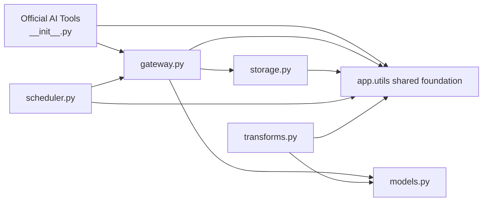
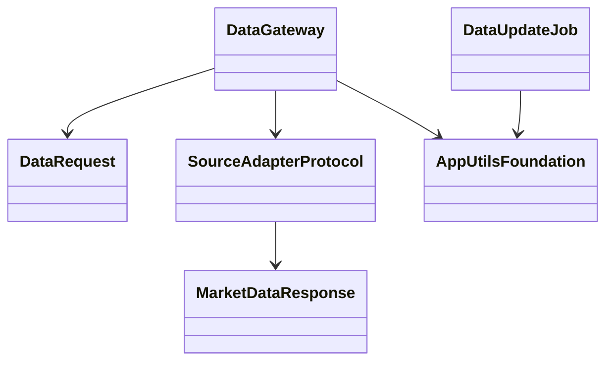

# 02-data.md - Requirements

**Source file:** `02-data.md`
**Target module:** `app/services/data/`
**Status:** DRY implementation-oriented requirements map using `app.utils` as the shared foundation
**Mapping policy:** Every unchecked checklist requirement from the source file must be mapped exactly once to either a compact data-domain implementation file, a compact data-domain test file, documentation, or the explicit `app.utils` coverage bucket in Section 7.0. No compatibility aliases are introduced.
**Requirement accounting note:** This document currently contains 704 visible unchecked checklist items: 703 source-tagged extracted items plus 1 local anti-duplication requirement. The owner has identified 861 unchecked task requirements as the target count. Implementation must not start until the extraction is reconciled to 861 without dropping any requirement; missing extracted items must be added to the appropriate compact data file or the `app.utils` coverage bucket.

## 1. Global & Common Context

### 1.1 Purpose
The `app/services/data/` module exists to provide HaruQuantAI with a contract-driven, auditable, resilient, agent-safe market data service.

Its primary goal is to provide normalized historical, real-time, local, synthetic, broker, and external market data through one internal gateway that can route to many external adapters while keeping official AI tool boundaries stable, safe, and JSON-serializable.

The module is a greenfield rebuild. It preserves current data-domain capabilities at the capability level, but it does not preserve old function names or legacy compatibility aliases. It is intended to be the canonical data access layer used by research, strategy creation, simulation, optimization, analytics, risk, portfolio, execution-preparation, and agentic workflows.

### 1.2 Assumptions
- The data module remains a clean, greenfield rebuild.
- Data is a thin domain layer over `app.utils`; it must not duplicate shared utility primitives.
- Phase 1 keeps public streaming subscription tools out of scope while retaining internal feed support and feed status inspection.
- SQLite is the default single-node persistence backend, while the persistence abstraction remains TSDB-ready.
- Local and synthetic sources can be production-ready first; external/broker sources remain staging until evidence promotes them.
- Historical market-hours reconstruction remains deferred until a future market-calendar provider exists.

### 1.3 Open Questions
- Select the future `MarketCalendarProvider` implementation for historical holidays, daylight-saving, and broker-session reconstruction.
- Select the future high-frequency tick/spread TSDB backend after the persistence abstraction is validated.
- Define promotion evidence for moving MT5, cTrader, Dukascopy, Binance discovery, and the real-time feed gateway from `staging` to `production`.
- Define any future public streaming subscription tool surface before export.

### 1.4 Owns
- Market data retrieval contracts for OHLCV, tick, spread, volume, symbol metadata, sessions, market hours, and data availability.
- Normalized historical data access through `get_market_data`, `get_tick_data`, and `get_spread_data`.
- Internal real-time feed state and observability through `get_feed_status`.
- One internal broker/data gateway that routes a single internal request contract to many source adapters.
- Source adapters for CSV, Parquet, MT5, cTrader, Dukascopy, Binance symbol discovery, synthetic generation, real-time feed providers, and future approved providers.
- Source readiness declarations and adapter capability declarations.
- Data normalization, timestamp normalization, precision policy, schema versioning, normalization versioning, and source metadata preservation.
- Data quality validation before data crosses official tool boundaries.
- Cache keys, cache TTL policy, stale-cache behavior, cache invalidation, and cache clearing.
- Storage workflows for validated normalized CSV/Parquet datasets under approved storage roots.
- SQLite-backed persistence abstraction for scheduler state, feed state, cache metadata, source revisions, license metadata, manifests, checkpoints, idempotency keys, circuit breaker state, and audit events.
- Crash recovery, resumable backfills, checkpointing, lease handling, stale-lock recovery, and idempotent ingestion state.
- Scheduler lifecycle tools for data update jobs.
- Synthetic tick/bar generation and deterministic labeling.
- Resampling, multi-timeframe alignment, tick aggregation, and anti-lookahead alignment defaults.
- Deterministic data-domain error mapping, request bounds, source fallback rules, license enforcement, and precision-safe serialization policies.
- Data-module audit logs, request IDs, quality reports, side-effect metadata, feed diagnostics, and production sign-off requirements.

### 1.5 Does Not Own
- The module does not own logger setup, standard response builders, error base classes, deterministic error mapping, ID helpers, UTC timestamp helpers, safe path helpers, canonical JSON, redaction, generic schema validation, settings loading, auth helpers, Event Bus primitives, notification routing, observability helpers, or generic metric helpers. These are imported from `app.utils`.
- The module does not place trades, close positions, modify orders, mutate broker account state, change terminal settings, override risk settings, or perform execution actions.
- The module does not own trading strategy logic, backtesting engine logic, analytics scoring, risk approval, portfolio allocation, strategy promotion, live activation, or governance approval.
- The module does not expose raw pandas DataFrames, NumPy arrays, SDK clients, sockets, stream handles, broker clients, database clients, credential loaders, or internal cache/persistence helpers through official AI tools.
- The module does not silently fallback to another source. Fallback is allowed only when explicit `fallback_sources` are supplied and validated.
- The module does not silently use stale cache entries, silently repair gaps, or silently interpolate/forward-fill missing data for backtest, validation, risk, or execution-bound workflows.
- The module does not own external identity-provider integration or secret storage. Credentials are resolved internally through approved configuration/environment mechanisms and must never be logged or returned.
- The module does not expose public streaming subscription tools in Phase 1.
- The module does not reconstruct historical market hours until a future approved `MarketCalendarProvider` exists.
- The module does not treat external/broker adapters as production-ready until live validation, license review, readiness review, and operational sign-off are completed.

### 1.6 Public Capabilities
Official exports from `app/services/data/__init__.py` are limited to:

- `get_data` — fetch normalized historical market records (ohlcv, ticks, spreads, or volume).
- `get_symbol_metadata` — retrieve normalized symbol and asset metadata.
- `list_symbols` — list symbols from approved sources, including symbol-discovery-only sources.
- `get_data_availability` — inspect available ranges, gaps, completeness, record counts, readiness, and metadata.
- `get_market_hours` — return timezone-aware market hours, with Phase 1 limited to current configured hours.
- `get_trading_sessions` — return normalized session windows and labels.
- `save_market_data` — save validated normalized records to approved CSV/Parquet storage paths.
- `load_local_dataset` — load CSV/Parquet local datasets into normalized records.
- `resample_ohlcv` — resample normalized OHLCV records into higher timeframes.
- `align_multitimeframe_data` — align multiple timeframes without lookahead by default.
- `generate_synthetic_ticks` — generate deterministic synthetic tick data when a seed is supplied.
- `generate_synthetic_bars` — generate deterministic synthetic OHLCV bars, with GBM supported in Phase 1.
- `aggregate_ticks_to_bars` — aggregate normalized ticks into OHLCV bars.
- `label_market_data` — generate deterministic historical labels without claiming predictive value.
- `create_data_update_job` — create persisted update job definitions.
- `start_data_update_job` — start recurring execution for a valid existing job or schedule.
- `stop_data_update_job` — stop or disable scheduled execution.
- `run_data_update_job_once` — execute one immediate update run without creating a recurring schedule.
- `get_data_update_job_status` — inspect scheduler job state without mutating it.
- `get_feed_status` — inspect real-time feed health and buffer/gap/circuit-breaker state.
- `clear_data_cache` — dry-run or clear approved cache namespaces safely.

Public capabilities are agent-safe orchestration surfaces. Internal adapters, registries, clients, cache helpers, persistence objects, and raw source fetchers are not public AI tools.

## 2. Global API Contracts Matrix
| Tool / Surface | Expected file | Risk | Side effects | Notes |
|---|---|---:|---|---|
| `get_data` | `app/services/data/__init__.py` -> `gateway.py`/`models.py`/`storage.py` + `app.utils` | Low | Read-only | Fetch normalized historical market records (ohlcv, ticks, spreads, or volume). |
| `get_symbol_metadata` | `app/services/data/__init__.py` -> `gateway.py`/`validation.py`/`models.py` | Low | Read-only | Symbol and asset metadata. |
| `list_symbols` | `app/services/data/__init__.py` -> `gateway.py` | Low | Read-only | Includes symbol-discovery-only sources. |
| `get_data_availability` | `app/services/data/__init__.py` -> `gateway.py`/`storage.py`/`models.py` + `app.utils` | Low | Read-only | Ranges, gaps, completeness, readiness. |
| `get_market_hours` | `app/services/data/__init__.py` -> `validation.py` | Low | Read-only | Phase 1 current configured hours only. |
| `get_trading_sessions` | `app/services/data/__init__.py` -> `validation.py` | Low | Read-only | Normalized session windows. |
| `save_market_data` | `app/services/data/__init__.py` -> `storage.py`/`validation.py` + `app.utils` | Medium | File/database write | Atomic storage with manifests. |
| `load_local_dataset` | `app/services/data/__init__.py` -> `storage.py` | Low | Read-only | Load local CSV/Parquet into records. |
| `resample_ohlcv` | `app/services/data/__init__.py` → transforms | Low | Read-only | Resampling with explicit policies. |
| `align_multitimeframe_data` | `app/services/data/__init__.py` → transforms | Low | Read-only | Anti-lookahead by default. |
| `generate_synthetic_ticks` | `app/services/data/__init__.py` -> `transforms.py` | Low | Read-only unless persisted separately | Deterministic with seed. |
| `generate_synthetic_bars` | `app/services/data/__init__.py` -> `transforms.py` | Low | Read-only unless persisted separately | GBM in Phase 1. |
| `aggregate_ticks_to_bars` | `app/services/data/__init__.py` → transforms | Low | Read-only | Tick-to-bar aggregation. |
| `label_market_data` | `app/services/data/__init__.py` -> `transforms.py` | Low | Read-only | Deterministic labels only. |
| `create_data_update_job` | `app/services/data/__init__.py` -> `scheduler.py` + `app.utils` | Medium | Database write | Create persisted job definition. |
| `start_data_update_job` | `app/services/data/__init__.py` -> `scheduler.py` + `app.utils` | Medium | Database/process state write | Start recurring job only. |
| `stop_data_update_job` | `app/services/data/__init__.py` -> `scheduler.py` + `app.utils` | Medium | Database/process state write | Stop/disable scheduled execution. |
| `run_data_update_job_once` | `app/services/data/__init__.py` -> `scheduler.py`/`gateway.py`/`storage.py` | Medium | Database/file writes possible | Immediate one-time run. |
| `get_data_update_job_status` | `app/services/data/__init__.py` -> `scheduler.py` | Low | Read-only | Status inspection. |
| `get_feed_status` | `app/services/data/__init__.py` -> `scheduler.py` | Low | Read-only | Feed observability only. |
| `clear_data_cache` | `app/services/data/__init__.py` → cache | Medium | Cache delete when not dry-run | Defaults to dry-run. |

## 3. Configuration Defaults
| Area | Default / Phase 1 decision |
|---|---|
| Storage roots | `data/raw/`, `data/processed/`, `data/cache/`, `artifacts/data/` |
| OHLCV direct response | Default `5,000`, max `50,000` records |
| Tick direct response | Default `10,000`, max `250,000` records |
| Spread direct response | Default `10,000`, max `250,000` records |
| Synthetic bars | Max direct response `100,000` records |
| Synthetic ticks | Max direct response `250,000` records |
| Persisted synthetic generation | Max `1,000,000` records unless config and performance tests approve more |
| Historical daily+ cache TTL | `86,400` seconds |
| Intraday bar cache TTL | `3,600` seconds |
| Tick cache TTL | `900` seconds unless source is stricter |
| Live data cache TTL | `0`; no persistent cache by default |
| Scheduler frequency | Not more frequent than once per minute unless a live-feed ingestion mechanism is used |
| Workflow contexts | `research`, `backtest`, `validation`, `risk`, `execution_bound` |
| Precision default | `decimal_string` for backtest, validation, risk, and execution-bound workflows |
| Research precision | `float` allowed only with disclosed metadata |
| Source readiness | `csv`, `parquet`, `synthetic` production; MT5, cTrader, Dukascopy, Binance discovery, real-time feed gateway staging |

## 4. Target Folder Structure
The data module must stay intentionally small. Files named in the original map
for responses, errors, settings, validation, normalization, security, audit, and
observability are not separate data files; those requirements are covered by
imports from `app.utils` and tracked in Section 7.0.

```text
app/
  services/
    data/
      __init__.py
      models.py
      storage.py
      gateway.py
      transforms.py
      validation.py
      scheduler.py

tests/
  unit/app/services/data/
    test_public_exports.py
    test_models_and_public_contracts.py
    test_quality_and_transforms.py
    test_cache_storage_persistence.py
    test_gateway_and_sources.py
    test_feeds_scheduler.py
  integration/app/services/data/
    test_downstream_contracts.py

docs/planning/
  DOMAIN.md
```

If a generic helper is missing from `app.utils`, it must be added to
`app.utils` with unit tests under `tests/unit/app/utils/` and then imported
by `app.services.data`. It must not be reimplemented inside `app.services.data`.

## 5. Architecture Class Diagrams




## 6. General / Cross-Cutting Non-Functional Requirements
- Official tools remain thin, typed orchestration boundaries.
- Official tools import shared infrastructure from `app.utils`; data-domain code must not duplicate utility primitives.
- Internal adapters may use pandas, NumPy, SDKs, sockets, clients, and databases, but none may cross official AI-tool boundaries.
- All official responses must be JSON-serializable and use the standard HaruQuantAI envelope.
- All high-cardinality, credential-bearing, or raw source objects must remain internal.
- Real-time and network I/O should use `asyncio`; heavy backfills and synthetic generation should use chunked processing or multiprocessing to avoid event-loop blocking.
- Request IDs must propagate through tools, logs, adapters, cache, scheduler, feed state, persistence, and audit records where feasible.
- External calls must use explicit timeouts, bounded retries, rate limits, and circuit breakers.
- Crash recovery, cache invalidation, source readiness, precision, licensing, and data quality must fail visibly rather than silently masking risk.
- Allowed duplication is none unless unavoidable and justified in a code comment and final evidence report.
- Missing generic helpers must be added to `app.utils` first, with unit tests, then imported by `app.services.data`.

## 7. Requirements by Compact Target
### 7.0 Requirements Covered by `app.utils` Shared Foundation

**Expected responsibility:** Shared utility implementation that data must import rather than duplicate.
**Mapped checklist count:** Utility-covered requirements are accounted here as a coverage bucket and remain traceable to the source-mapped checklist items below. This section prevents silent deletion when compacting the data file plan.

The following requirement families belong to `app.utils` and must be imported by `app.services.data`:

| Requirement family | `app.utils` source of truth | Data-domain rule |
|---|---|---|
| Logger setup and logger access | `logger`, `get_logger`, `configure_logging` | Import from `app.utils`; no `app/services/data/logger.py`. |
| Standard response envelopes | `success_response`, `error_response`, `response_from_exception`, `validate_standard_response` | Official data tools wrap data payloads with utils builders. |
| Standard metadata and timing | `build_metadata`, `get_execution_ms` | Use utils metadata and timing for every official tool. |
| Error base classes and deterministic mapping | `Error`, `ValidationError`, `DataError`, `ExternalServiceError`, `SecurityError`, `normalize_error_code`, `exception_to_error_payload` | Data may define data-specific constants or thin subclasses only when generic utils codes are insufficient. |
| Request, workflow, correlation, causation, event, and idempotency IDs | `generate_request_id`, `generate_workflow_id`, `generate_correlation_id`, `generate_causation_id`, `generate_event_id`, `generate_idempotency_id`, validators | Data must not implement its own ID format. |
| Version helpers and canonical JSON | `ensure_version`, `canonical_json`, `stable_identifier` | Cache keys, manifests, idempotency, and source fingerprints reuse utils. |
| UTC timestamp and stale-data helpers | `normalize_timestamp`, `normalize_timestamp_sequence`, `format_utc_timestamp`, `is_stale`, `check_clock_drift` | Data-specific market-session logic may exist, but UTC normalization is imported. |
| Safe path helpers | `normalize_path`, `ensure_dir`, `ensure_parent_dir` | Storage and cache paths are thin policy layers over utils path safety. |
| Redaction and secret handling | `redact_text`, `redact_mapping`, `redact_payload`, `classify_secret_key` | Source credentials and errors must be sanitized through utils. |
| Generic schema and numeric validation | `validate_input_schema`, `validate_output_schema`, `validate_mapping_schema`, `validate_required_fields`, `validate_numeric_range` | Data validation adds domain rules only after generic utils checks. |
| Runtime settings loading | `RuntimeSettings`, `load_runtime_settings`, `default_haruquant_home` | Data settings are a thin projection of shared runtime settings plus data-specific constants. |
| Auth and permission checks | `AuthContext`, `authorize_action`, `require_authorization`, `validate_auth_context` | Governed data writes/scheduler actions call utils auth helpers. |
| Event Bus primitives | `EventEnvelope`, `InMemoryEventBus`, `build_event_envelope`, `publish_event` | Data audit/feed/job events use utils event envelopes. |
| Notification routing | `NotificationRouter`, `route_notification`, `broadcast_notification` | Data does not implement a notification stack. |
| Observability and metrics | `MetricRegistry`, `record_metric`, `record_tool_call_metric`, `build_health_snapshot`, `CircuitBreaker` | Data exposes data-specific metric names only; registry/circuit primitives come from utils. |
| Dataframe and OHLCV diagnostics | `dataframe_columns`, `serialize_dataframe_records`, `validate_ohlcv_quality`, `inspect_ohlcv_quality`, `validate_ohlcv_records` | Data may add source-specific quality policy but must reuse utils diagnostics first. |

Checklist items currently mapped to former data files such as `responses.py`, `errors.py`, `settings.py`, `validation.py`, `normalization.py`, `security.py`, and `audit.py` are therefore implementation requirements to import and apply `app.utils`, not instructions to create duplicate files.

### 7.1 `docs/planning/DOMAIN.md`

**Expected responsibility:** Domain requirements, assumptions, open questions, source-readiness notes, production sign-off, and documentation artifacts.
**Mapped checklist count:** 103

#### Purpose & Scope

- [X] Backward compatibility remains out of scope. <!-- source: Notes / Future Improvements / Assumptions and Resolved Decisions, line 1000 -->
- [X] Internal real-time feed support, feed state, and feed status are in scope for production readiness. <!-- source: Notes / Future Improvements / Assumptions and Resolved Decisions, line 1002 -->

#### Functional Requirements

- [X] The module shall preserve current data-domain capabilities at the capability level, not by preserving old function names. <!-- source: Functional Requirements / Module Scope and Boundary, line 225 -->
- [X] The module shall persist source circuit breaker state. <!-- source: Functional Requirements / System State Persistence and Crash Recovery, line 408 -->
- [X] Documentation shall include a data module README or docs section. <!-- source: Notes / Future Improvements / Documentation Requirements, line 972 -->
- [X] Documentation shall include the official tool catalog. <!-- source: Notes / Future Improvements / Documentation Requirements, line 973 -->
- [X] Documentation shall include the final `__all__` export list. <!-- source: Notes / Future Improvements / Documentation Requirements, line 974 -->
- [X] Documentation shall explain why `get_data_update_job_status` and `get_feed_status` are included. <!-- source: Notes / Future Improvements / Documentation Requirements, line 975 -->
- [X] Documentation shall include a source adapter catalog. <!-- source: Notes / Future Improvements / Documentation Requirements, line 976 -->
- [X] Documentation shall include the source readiness manifest. <!-- source: Notes / Future Improvements / Documentation Requirements, line 977 -->
- [X] Documentation shall include the source license manifest. <!-- source: Notes / Future Improvements / Documentation Requirements, line 978 -->
- [X] Documentation shall include approved storage roots. <!-- source: Notes / Future Improvements / Documentation Requirements, line 979 -->
- [X] Documentation shall include environment variable reference. <!-- source: Notes / Future Improvements / Documentation Requirements, line 980 -->
- [X] Documentation shall include usage examples for market data, local storage, symbols, synthetic generation, labeling, scheduler, job status, and feed status. <!-- source: Notes / Future Improvements / Documentation Requirements, line 981 -->
- [X] Documentation shall include an error-code reference with all deterministic error codes. <!-- source: Notes / Future Improvements / Documentation Requirements, line 982 -->
- [X] Documentation shall include troubleshooting for MT5, cTrader, Dukascopy, Binance symbol discovery, local storage, cache, database persistence, scheduler, crash recovery, and feed health. <!-- source: Notes / Future Improvements / Documentation Requirements, line 983 -->
- [X] Documentation shall include cache TTL and invalidation policy. <!-- source: Notes / Future Improvements / Documentation Requirements, line 984 -->
- [X] Documentation shall state that schema version, normalization version, and raw data hash changes invalidate matching cache entries regardless of TTL. <!-- source: Notes / Future Improvements / Documentation Requirements, line 985 -->
- [X] Documentation shall include precision and numeric serialization policy by workflow context. <!-- source: Notes / Future Improvements / Documentation Requirements, line 986 -->
- [X] Documentation shall include real-time feed limitations for Phase 1. <!-- source: Notes / Future Improvements / Documentation Requirements, line 987 -->
- [X] Documentation shall include crash recovery runbook. <!-- source: Notes / Future Improvements / Documentation Requirements, line 988 -->
- [X] Documentation shall include circuit breaker behavior and recovery procedure. <!-- source: Notes / Future Improvements / Documentation Requirements, line 989 -->
- [X] Documentation shall include database migration procedure. <!-- source: Notes / Future Improvements / Documentation Requirements, line 990 -->
- [X] Documentation shall include production sign-off template. <!-- source: Notes / Future Improvements / Documentation Requirements, line 991 -->
- [X] This requirements document belongs in `docs/planning/DOMAIN.md` because it covers the full data module rather than one sprint. <!-- source: Notes / Future Improvements / Assumptions and Resolved Decisions, line 997 -->
- [X] The v8 specification remains the authoritative baseline, with this final document acting as the production-hardening closure layer. <!-- source: Notes / Future Improvements / Assumptions and Resolved Decisions, line 998 -->
- [X] The HaruQuantAI Tool Function Standard, Code Quality Standard, Agent Standard, and Agentic AI Playbook exist outside this source-requirements document and may define cross-cutting details not repeated in the data module specification. <!-- source: Notes / Future Improvements / Assumptions and Resolved Decisions, line 999 -->
- [X] Public streaming subscription tools remain out of Phase 1. <!-- source: Notes / Future Improvements / Assumptions and Resolved Decisions, line 1001 -->
- [X] `get_data_update_job_status` is the canonical scheduler status tool. <!-- source: Notes / Future Improvements / Assumptions and Resolved Decisions, line 1003 -->
- [X] `get_feed_status` is the canonical feed observability tool. <!-- source: Notes / Future Improvements / Assumptions and Resolved Decisions, line 1004 -->
- [X] `get_update_job_status`, `create_update_job`, `start_update_job`, and `stop_update_job` are not official exports. <!-- source: Notes / Future Improvements / Assumptions and Resolved Decisions, line 1005 -->
- [X] `VALIDATION_FAILED`, `BUFFER_OVERFLOW`, and `DATA_DROPPED` are included in the deterministic error-code list. <!-- source: Notes / Future Improvements / Assumptions and Resolved Decisions, line 1006 -->
- [X] Source readiness starts conservative: local and synthetic sources may be production; external/broker sources are staging until mocked and live validation passes. <!-- source: Notes / Future Improvements / Assumptions and Resolved Decisions, line 1007 -->
- [X] SQLite is sufficient for single-node local state persistence. <!-- source: Notes / Future Improvements / Assumptions and Resolved Decisions, line 1008 -->
- [X] The persistence abstraction must be TSDB-ready for future high-frequency tick and spread storage. <!-- source: Notes / Future Improvements / Assumptions and Resolved Decisions, line 1009 -->
- [X] The broker/data gateway is internal and routes one internal contract to many external APIs. <!-- source: Notes / Future Improvements / Assumptions and Resolved Decisions, line 1010 -->
- [X] Historical market-hours reconstruction is deferred until a market-calendar provider is approved. <!-- source: Notes / Future Improvements / Assumptions and Resolved Decisions, line 1011 -->
- [X] GBM synthetic generation is enough for Phase 1. <!-- source: Notes / Future Improvements / Assumptions and Resolved Decisions, line 1012 -->
- [X] `get_historical_volume` may be direct or derived if its response contract remains stable and tested. <!-- source: Notes / Future Improvements / Assumptions and Resolved Decisions, line 1013 -->
- [X] Downstream modules shall adapt to the new contracts rather than relying on aliases. <!-- source: Notes / Future Improvements / Assumptions and Resolved Decisions, line 1014 -->
- [X] Phase 1 may proceed without complete external source adapter implementations when disabled or unavailable adapters fail safely and deterministically and contracts, responses, validation, timeframes, registry, exports, and tests meet Phase 1 acceptance. <!-- source: Notes / Future Improvements / Assumptions and Resolved Decisions, line 1015 -->
- [X] No blocking open questions remain for Phase 1 implementation based on the current source material. <!-- source: Notes / Future Improvements / Open Questions, line 1021 -->
- [X] Pending: select the future `MarketCalendarProvider` implementation for historical holidays, daylight-saving, and broker-session reconstruction. <!-- source: Notes / Future Improvements / Open Questions, line 1022 -->
- [X] Pending: select the future high-frequency tick/spread TSDB backend after the TSDB-ready persistence interface is validated. <!-- source: Notes / Future Improvements / Open Questions, line 1023 -->
- [X] Pending: define the promotion process and evidence package for moving MT5, cTrader, Dukascopy, Binance symbol discovery, or real-time feed gateway from `staging` to `production`. <!-- source: Notes / Future Improvements / Open Questions, line 1024 -->
- [X] Pending: define any future public streaming subscription tool surface before export. <!-- source: Notes / Future Improvements / Open Questions, line 1025 -->
- [X] Pending: track future-phase decisions as implementation planning issues rather than treating them as Phase 1 blockers. <!-- source: Notes / Future Improvements / Open Questions, line 1026 -->
- [X] The scheduler naming conflict shall be resolved by exporting only `create_data_update_job`, `start_data_update_job`, `stop_data_update_job`, `run_data_update_job_once`, and `get_data_update_job_status` for scheduler lifecycle/status. <!-- source: Notes / Future Improvements / Adopted Suggested Improvements, line 1034 -->
- [X] Status inspection shall be added through `get_data_update_job_status`. <!-- source: Notes / Future Improvements / Adopted Suggested Improvements, line 1035 -->
- [X] Feed inspection shall be added through `get_feed_status`. <!-- source: Notes / Future Improvements / Adopted Suggested Improvements, line 1036 -->
- [X] `VALIDATION_FAILED` shall be added to deterministic error codes. <!-- source: Notes / Future Improvements / Adopted Suggested Improvements, line 1037 -->
- [X] `BUFFER_OVERFLOW` and `DATA_DROPPED` shall be added to deterministic error codes. <!-- source: Notes / Future Improvements / Adopted Suggested Improvements, line 1038 -->
- [X] A central limits manifest shall define maximum records, maximum date range, maximum cache TTL, maximum synthetic generation size, maximum backfill chunk size, maximum feed buffer depth, and maximum scheduler frequency. <!-- source: Notes / Future Improvements / Adopted Suggested Improvements, line 1039 -->
- [X] Approved storage roots shall be fixed to `data/raw/`, `data/processed/`, `data/cache/`, and `artifacts/data/` for Phase 1. <!-- source: Notes / Future Improvements / Adopted Suggested Improvements, line 1040 -->
- [X] A source readiness manifest shall be maintained. <!-- source: Notes / Future Improvements / Adopted Suggested Improvements, line 1041 -->
- [X] A source license manifest shall be maintained. <!-- source: Notes / Future Improvements / Adopted Suggested Improvements, line 1042 -->
- [X] Precision serialization shall be workflow-aware. <!-- source: Notes / Future Improvements / Adopted Suggested Improvements, line 1043 -->
- [X] Response examples shall be documented for OHLCV, tick, spread, market hours, trading sessions, availability, historical volume, scheduler status, feed status, and error responses. <!-- source: Notes / Future Improvements / Adopted Suggested Improvements, line 1044 -->
- [X] Real-time buffer overflow shall flag gaps and trigger backfill when configured and supported. <!-- source: Notes / Future Improvements / Adopted Suggested Improvements, line 1045 -->
- [X] Idempotency keys shall be deterministically derived from source, symbol, data kind, timeframe, start, end, schema version, and normalization version. <!-- source: Notes / Future Improvements / Adopted Suggested Improvements, line 1046 -->
- [X] Reconnect and retry logic shall use exponential backoff with randomized jitter. <!-- source: Notes / Future Improvements / Adopted Suggested Improvements, line 1047 -->
- [X] Database persistence shall enforce connection limits, timeouts, and leak detection. <!-- source: Notes / Future Improvements / Adopted Suggested Improvements, line 1048 -->
- [X] Circuit breaker state shall persist across restarts. <!-- source: Notes / Future Improvements / Adopted Suggested Improvements, line 1049 -->
- [X] Persistence shall support a future append-optimized TSDB backend. <!-- source: Notes / Future Improvements / Adopted Suggested Improvements, line 1050 -->
- [X] Schema evolution shall enforce backward compatibility or explicit invalidation and re-ingestion. <!-- source: Notes / Future Improvements / Adopted Suggested Improvements, line 1051 -->
- [X] Changing schema version, normalization version, or raw data hash shall invalidate matching cache entries regardless of TTL. <!-- source: Notes / Future Improvements / Adopted Suggested Improvements, line 1052 -->
- [X] Package path is `app/services/data/`. <!-- source: Notes / Future Improvements / Production Acceptance Checklist, line 1058 -->
- [X] `app/services/data/__init__.py` contains only imports and `__all__`. <!-- source: Notes / Future Improvements / Production Acceptance Checklist, line 1059 -->
- [X] Official exports match this requirements document. <!-- source: Notes / Future Improvements / Production Acceptance Checklist, line 1060 -->
- [X] Every official tool returns the standard response schema. <!-- source: Notes / Future Improvements / Production Acceptance Checklist, line 1061 -->
- [X] Every official tool supports `request_id`. <!-- source: Notes / Future Improvements / Production Acceptance Checklist, line 1062 -->
- [X] Every official tool has metadata and side-effect flags. <!-- source: Notes / Future Improvements / Production Acceptance Checklist, line 1063 -->
- [X] Every official tool validates inputs. <!-- source: Notes / Future Improvements / Production Acceptance Checklist, line 1064 -->
- [X] Every official tool logs structured events. <!-- source: Notes / Future Improvements / Production Acceptance Checklist, line 1065 -->
- [X] Every official tool handles errors deterministically. <!-- source: Notes / Future Improvements / Production Acceptance Checklist, line 1066 -->
- [X] Every official tool has unit tests. <!-- source: Notes / Future Improvements / Production Acceptance Checklist, line 1067 -->
- [X] Every official tool has usage examples where applicable. <!-- source: Notes / Future Improvements / Production Acceptance Checklist, line 1068 -->
- [X] No DataFrame, NumPy array, SDK object, stream handle, socket, or database client crosses the official tool boundary. <!-- source: Notes / Future Improvements / Production Acceptance Checklist, line 1069 -->
- [X] OHLCV, tick, spread, metadata, sessions, availability, and volume outputs use normalized contracts. <!-- source: Notes / Future Improvements / Production Acceptance Checklist, line 1070 -->
- [X] Data quality validation runs before returning market data. <!-- source: Notes / Future Improvements / Production Acceptance Checklist, line 1071 -->
- [X] Timezone normalization uses UTC at the official boundary. <!-- source: Notes / Future Improvements / Production Acceptance Checklist, line 1072 -->
- [X] Source timezone and broker timezone metadata are preserved. <!-- source: Notes / Future Improvements / Production Acceptance Checklist, line 1073 -->
- [X] Cache keys include schema version, normalization version, and raw data hash where available. <!-- source: Notes / Future Improvements / Production Acceptance Checklist, line 1074 -->
- [X] Stale cache is not returned silently. <!-- source: Notes / Future Improvements / Production Acceptance Checklist, line 1075 -->
- [X] Local paths are validated against approved storage roots. <!-- source: Notes / Future Improvements / Production Acceptance Checklist, line 1076 -->
- [X] cTrader and Dukascopy clients are internal. <!-- source: Notes / Future Improvements / Production Acceptance Checklist, line 1078 -->
- [X] Broker adapters never place trades. <!-- source: Notes / Future Improvements / Production Acceptance Checklist, line 1079 -->
- [X] Scheduler lifecycle is explicit, idempotent, and crash-recoverable. <!-- source: Notes / Future Improvements / Production Acceptance Checklist, line 1080 -->
- [X] Real-time feed state is observable and resilient. <!-- source: Notes / Future Improvements / Production Acceptance Checklist, line 1081 -->
- [X] Synthetic generation is deterministic when seed is supplied. <!-- source: Notes / Future Improvements / Production Acceptance Checklist, line 1083 -->
- [X] Multi-timeframe alignment prevents lookahead by default. <!-- source: Notes / Future Improvements / Production Acceptance Checklist, line 1084 -->
- [X] Downstream modules import only through `app.services.data`. <!-- source: Notes / Future Improvements / Production Acceptance Checklist, line 1085 -->
- [X] Downstream contract alignment tests pass. <!-- source: Notes / Future Improvements / Production Acceptance Checklist, line 1086 -->
- [X] CI quality gates pass. <!-- source: Notes / Future Improvements / Production Acceptance Checklist, line 1088 -->
- [X] Production sign-off artifact is created before release. <!-- source: Notes / Future Improvements / Production Acceptance Checklist, line 1089 -->

#### Non-Functional & Security Requirements

- [X] The module shall be implemented as a greenfield professional production module. <!-- source: Non-Functional Requirements / Maintainability, line 547 -->
- [X] CI gates shall pass before production sign-off: `black`, `isort`, `flake8`, `mypy`, `pytest`, and coverage above 80%. <!-- source: Non-Functional Requirements / Production Readiness, line 559 -->
- [X] Official exports shall match this requirements document. <!-- source: Non-Functional Requirements / Production Readiness, line 562 -->
- [X] The module shall not be marked production-ready until a production sign-off artifact is produced. <!-- source: Non-Functional Requirements / Production Readiness, line 564 -->
- [X] Credentials are not exposed or logged. <!-- source: Notes / Future Improvements / Production Acceptance Checklist, line 1077 -->
- [X] Database persistence is transactional, bounded, idempotent, and recovery-aware. <!-- source: Notes / Future Improvements / Production Acceptance Checklist, line 1082 -->

#### Testing & Edge Cases

- [X] Production sign-off shall include implemented spec version, test command output summary, coverage percentage, exported tool list, known limitations, enabled source adapters, required environment variables, source readiness manifest, license manifest, persistence backend, and downstream modules validated. <!-- source: Non-Functional Requirements / Production Readiness, line 565 -->
- [X] Test coverage is above 80%. <!-- source: Notes / Future Improvements / Production Acceptance Checklist, line 1087 -->

### 7.2 `app/services/data/__init__.py`

**Expected responsibility:** Public export registry for the data module official AI-tool surface.
**Mapped checklist count:** 25

#### Functional Requirements

- [X] The names `create_update_job`, `start_update_job`, and `stop_update_job` shall not be exported as official tools. <!-- source: Functional Requirements / Official Tool Naming and Export Surface, line 81 -->
- [X] The name `get_update_job_status` shall not be exported as an official tool. <!-- source: Functional Requirements / Official Tool Naming and Export Surface, line 83 -->
- [X] `app/services/data/__init__.py` shall export only the approved official tool surface in Section 1.2 unless a future specification explicitly adds more. <!-- source: Functional Requirements / Official Tool Naming and Export Surface, line 85 -->
- [X] External or vendor data sources shall include license metadata before data is stored, exported, scheduled, or used in validation, risk, or execution-bound workflows. <!-- source: Functional Requirements / Source Metadata and Licensing, line 194 -->
- [X] The module shall expose only safe, intentional, agent-callable tools from `app/services/data/__init__.py`. <!-- source: Functional Requirements / Module Scope and Boundary, line 226 -->
- [X] `app/services/data/__init__.py` shall export only the following official tools: <!-- source: Functional Requirements / Official AI Tool Surface, line 235 -->
- [X] `get_data`
- [X] `get_symbol_metadata`
- [X] `list_symbols`
- [X] `get_data_availability`
- [X] `get_market_hours`
- [X] `get_trading_sessions`
- [X] `get_data_update_job_status`
- [X] `get_feed_status`
- [X] `get_data_update_job_status` shall be read-only and shall not mutate scheduler state. <!-- source: Functional Requirements / Official AI Tool Surface, line 260 -->
- [X] `get_data_update_job_status` shall be non-networked unless job metadata requires source health lookup. <!-- source: Functional Requirements / Official AI Tool Surface, line 261 -->
- [X] The source registry shall not be exported as an official AI tool unless a future requirement explicitly approves it. <!-- source: Functional Requirements / Broker/Data Gateway and Source Adapters, line 348 -->

#### Non-Functional & Security Requirements

- [X] `get_feed_status` shall be read-only and shall not expose raw stream handles, sockets, clients, credentials, or connection strings. <!-- source: Functional Requirements / Official AI Tool Surface, line 262 -->
- [X] `app/services/data/__init__.py` shall contain only imports and `__all__`. <!-- source: Non-Functional Requirements / Production Readiness, line 561 -->
- [X] License metadata shall be enforced before storage, scheduler export, or artifact generation. <!-- source: Non-Functional Requirements / Security Requirements, line 664 -->
- [X] Redistribution-restricted data shall not be exported outside approved internal paths. <!-- source: Non-Functional Requirements / Security Requirements, line 665 -->

#### Testing & Edge Cases

- [X] Missing license metadata shall fail closed with `LICENSE_RESTRICTION` for storage, scheduler, export, validation, risk, and execution-bound workflows. <!-- source: Functional Requirements / Source Metadata and Licensing, line 195 -->

### 7.3 `app/services/data/models.py`

**Expected responsibility:** Data-specific request/response models for OHLCV, ticks, spreads, jobs, feeds, sessions, metadata, availability, source readiness, cache manifests, and persistence records. Generic response envelopes, metadata builders, ID schemas, UTC timestamp helpers, and validation primitives are imported from `app.utils`.
**Mapped checklist count:** 24

#### Functional Requirements

- [X] Parent traversal with `..` shall be rejected. <!-- source: Functional Requirements / Storage Roots, line 155 -->
- [X] The data module shall be rebuilt as a clean, contract-driven, agent-safe, testable, maintainable domain under `app/services/data/`. <!-- source: Functional Requirements / Module Scope and Boundary, line 223 -->
- [X] Any future official tool addition shall require an explicit specification update. <!-- source: Functional Requirements / Official AI Tool Surface, line 263 -->
- [X] All timestamps crossing the official AI-tool boundary shall be UTC ISO 8601 strings. <!-- source: Functional Requirements / Normalization, line 315 -->
- [X] On restart, a source with a persisted open circuit breaker shall remain open or half-open for the configured cooldown period and shall not immediately hammer the failing external source. <!-- source: Functional Requirements / Broker/Data Gateway and Source Adapters, line 351 -->
- [X] `get_market_hours` Phase 1 may return current configured hours only. <!-- source: Functional Requirements / Market Hours, Sessions, and Historical Volume, line 427 -->
- [X] `get_historical_volume` shall return volume-specific historical records or summaries. <!-- source: Functional Requirements / Market Hours, Sessions, and Historical Volume, line 432 -->
- [X] When a source provides both tick volume and real volume, both shall be preserved. <!-- source: Functional Requirements / Market Hours, Sessions, and Historical Volume, line 434 -->
- [X] The primary volume value shall be disclosed through `volume_kind`. <!-- source: Functional Requirements / Market Hours, Sessions, and Historical Volume, line 435 -->

#### Non-Functional & Security Requirements

- [X] Every official tool shall support `request_id`. <!-- source: Non-Functional Requirements / Observability and Auditability, line 522 -->
- [X] Converting 100,000 DataFrame rows to records should target under 3 seconds. <!-- source: Non-Functional Requirements / Performance and Scalability, line 535 -->
- [X] Resampling 100,000 M1 bars to H1 should target under 3 seconds. <!-- source: Non-Functional Requirements / Performance and Scalability, line 536 -->
- [X] Public functions and classes shall contain useful docstrings. <!-- source: Non-Functional Requirements / Maintainability, line 550 -->
- [X] Official tools shall be typed. <!-- source: Non-Functional Requirements / Maintainability, line 551 -->
- [X] Every official tool shall accept `request_id`. <!-- source: Non-Functional Requirements / Common Inputs, line 573 -->
- [X] Start and end timestamps shall be UTC ISO 8601 when provided. <!-- source: Non-Functional Requirements / Common Inputs, line 578 -->
- [X] `status` shall be `success` or `error`. <!-- source: Non-Functional Requirements / Common Outputs, line 608 -->
- [X] `error` shall be null on success or contain deterministic code and details on failure. <!-- source: Non-Functional Requirements / Common Outputs, line 609 -->
- [X] Circuit breaker open state shall persist across restarts. <!-- source: Non-Functional Requirements / Error Handling Expectations, line 641 -->
- [X] Parent traversal using `..` shall be rejected. <!-- source: Non-Functional Requirements / Security Requirements, line 657 -->
- [X] Hidden/system directories shall be rejected unless explicitly allowed. <!-- source: Non-Functional Requirements / Security Requirements, line 660 -->

#### Testing & Edge Cases

- [X] Disabled or unconfigured source shall return `SOURCE_NOT_CONFIGURED`. <!-- source: Edge Cases / n/a, line 674 -->
- [X] Authentication failure shall return `AUTHENTICATION_FAILED`. <!-- source: Edge Cases / n/a, line 698 -->
- [X] Open circuit breaker shall return `CIRCUIT_BREAKER_OPEN`. <!-- source: Edge Cases / n/a, line 704 -->

### 7.4 `app.utils` Response Builders Used by Data

**Expected responsibility:** Do not create `app/services/data/responses.py`. These checklist items require official data tools to call `app.utils.success_response`, `app.utils.error_response`, `app.utils.response_from_exception`, `app.utils.build_metadata`, `app.utils.get_execution_ms`, and `app.utils.validate_standard_response`.
**Mapped checklist count:** 9

#### Functional Requirements

- [X] Historical data shall preserve source revision metadata where available. <!-- source: Functional Requirements / Historical Data, line 272 -->
- [X] Missing required asset-specific metadata shall return or emit `MISSING_ASSET_METADATA` when the asset class and workflow require those fields. <!-- source: Functional Requirements / Normalization, line 314 -->
- [X] Storage writes shall include metadata manifests when `include_metadata=True`. <!-- source: Functional Requirements / Storage, Databases, and Persistence, line 385 -->
- [X] The module shall persist source revision and raw hash metadata. <!-- source: Functional Requirements / System State Persistence and Crash Recovery, line 409 -->

#### Non-Functional & Security Requirements

- [X] Every official AI tool shall return the standard HaruQuantAI response schema. <!-- source: Non-Functional Requirements / Contract and Serialization, line 500 -->
- [X] All market data crossing the official AI-tool boundary shall be JSON-serializable and contract-compliant. <!-- source: Non-Functional Requirements / Contract and Serialization, line 502 -->
- [X] Large historical data shall be stored locally and referenced through metadata where direct response payloads would be unsafe. <!-- source: Non-Functional Requirements / Performance and Scalability, line 539 -->
- [X] Every official tool shall return status, message, data, error, and metadata. <!-- source: Non-Functional Requirements / Common Outputs, line 607 -->

#### Testing & Edge Cases

- [X] Missing required asset metadata shall return `MISSING_ASSET_METADATA`. <!-- source: Edge Cases / n/a, line 702 -->

### 7.5 `app.utils` Error Primitives plus Data Error Policy

**Expected responsibility:** Do not create a duplicate data error framework. Data-specific error codes and thin subclasses are allowed only when generic `app.utils` error codes are insufficient; all base classes, normalization, exception-to-payload mapping, and redaction-safe details come from `app.utils`.
**Mapped checklist count:** 25

#### Functional Requirements

- [X] All standard system exceptions and error codes (including `VALIDATION_FAILED`, `AUTHENTICATION_FAILED`, `PERMISSION_DENIED`, `CIRCUIT_BREAKER_OPEN`, `UNKNOWN_ERROR`) shall be imported and reused from `app.utils.errors` to prevent duplicate declaration. Custom data exceptions must inherit from `app.utils.errors.Error` or `HaruQuantError`.
- [X] The deterministic error-code list shall include `VALIDATION_FAILED`. <!-- source: Functional Requirements / Error Code Decisions, line 96 -->
- [X] The deterministic error-code list shall include `DATA_DROPPED`. <!-- source: Functional Requirements / Error Code Decisions, line 98 -->
- [X] The deterministic error-code list shall include `CIRCUIT_BREAKER_OPEN`. <!-- source: Functional Requirements / Error Code Decisions, line 104 -->
- [X] The deterministic error-code list shall include `AUTHENTICATION_FAILED`. <!-- source: Functional Requirements / Error Code Decisions, line 108 -->
- [X] The deterministic error-code list shall include `PERMISSION_DENIED`. <!-- source: Functional Requirements / Error Code Decisions, line 109 -->
- [X] The deterministic error-code list shall include `MISSING_ASSET_METADATA`. <!-- source: Functional Requirements / Error Code Decisions, line 112 -->
- [X] `UNKNOWN_ERROR` shall be reserved only for unexpected failures after deterministic error mapping has been exhausted. <!-- source: Functional Requirements / Error Code Decisions, line 115 -->

#### Non-Functional & Security Requirements

- [X] Official data tools shall use deterministic error codes. <!-- source: Non-Functional Requirements / Error Handling Expectations, line 625 -->
- [X] Official tools shall not expose raw exceptions. <!-- source: Non-Functional Requirements / Error Handling Expectations, line 627 -->
- [X] Error responses shall include status, message, error code, details, request ID, and metadata. <!-- source: Non-Functional Requirements / Error Handling Expectations, line 629 -->
- [X] Network retry exhaustion shall return deterministic error codes and include retry metadata. <!-- source: Non-Functional Requirements / Error Handling Expectations, line 634 -->

#### Testing & Edge Cases

- [X] Any unsupported `workflow_context` shall return `INVALID_INPUT`. <!-- source: Functional Requirements / Workflow Context and Precision Serialization, line 162 -->
- [X] Unsupported source shall return `UNSUPPORTED_SOURCE`. <!-- source: Edge Cases / n/a, line 673 -->
- [X] Unsupported timeframe shall return `UNSUPPORTED_TIMEFRAME`. <!-- source: Edge Cases / n/a, line 675 -->
- [X] Unsupported valid-source capability shall return `UNSUPPORTED_OPERATION`. <!-- source: Edge Cases / n/a, line 676 -->
- [X] Empty source result shall return `EMPTY_RESULT` or `DATA_NOT_FOUND` according to context. <!-- source: Edge Cases / n/a, line 677 -->
- [X] Invalid workflow context shall return `INVALID_INPUT`. <!-- source: Edge Cases / n/a, line 679 -->
- [X] Schema drift shall return `DATA_SCHEMA_DRIFT`. <!-- source: Edge Cases / n/a, line 688 -->
- [X] Input validation failure shall return `VALIDATION_FAILED` or `INVALID_INPUT` according to context. <!-- source: Edge Cases / n/a, line 692 -->
- [X] Data content validation failure shall return `DATA_QUALITY_FAILED`. <!-- source: Edge Cases / n/a, line 693 -->
- [X] Network timeout shall return `TIMEOUT`. <!-- source: Edge Cases / n/a, line 694 -->
- [X] Network failure shall return `NETWORK_ERROR`. <!-- source: Edge Cases / n/a, line 695 -->
- [X] Broker unavailable shall return `BROKER_UNAVAILABLE`. <!-- source: Edge Cases / n/a, line 696 -->
- [X] Permission failure shall return `PERMISSION_DENIED`. <!-- source: Edge Cases / n/a, line 699 -->

### 7.6 Limits Requirements in `app/services/data/validation.py`

**Expected responsibility:** Central request bounds, payload-size limits, cache TTL caps, synthetic-generation limits, and scheduler/feed constraints.
**Mapped checklist count:** 20

#### Functional Requirements

- [X] A central limits manifest shall define default and maximum values by data kind, source, workflow context, and response mode. <!-- source: Functional Requirements / Limits and Request Bounds, line 119 -->
- [X] Direct official-tool responses shall use safe default limits to avoid large agent payloads. <!-- source: Functional Requirements / Limits and Request Bounds, line 120 -->
- [X] Large historical datasets shall be persisted and referenced by metadata instead of returned inline when response limits are exceeded. <!-- source: Functional Requirements / Limits and Request Bounds, line 121 -->
- [X] The default direct-response limit for OHLCV bars shall be 5,000 records. <!-- source: Functional Requirements / Limits and Request Bounds, line 122 -->
- [X] The maximum direct-response limit for OHLCV bars shall be 50,000 records. <!-- source: Functional Requirements / Limits and Request Bounds, line 123 -->
- [X] The default direct-response limit for ticks shall be 10,000 records. <!-- source: Functional Requirements / Limits and Request Bounds, line 124 -->
- [X] The maximum direct-response limit for ticks shall be 250,000 records. <!-- source: Functional Requirements / Limits and Request Bounds, line 125 -->
- [X] The default direct-response limit for spread records shall be 10,000 records. <!-- source: Functional Requirements / Limits and Request Bounds, line 126 -->
- [X] The maximum direct-response limit for spread records shall be 250,000 records. <!-- source: Functional Requirements / Limits and Request Bounds, line 127 -->
- [X] Symbol metadata shall normalize asset class, base currency, quote currency, contract size, tick size, tick value, point, digits, lot limits, lot step, margin currency, profit currency, trading hours, and source metadata. <!-- source: Functional Requirements / Normalization, line 312 -->

#### Non-Functional & Security Requirements

- [X] Data availability tools shall not materialize more than 1,000,000 records solely for counts unless an operator explicitly enables a bounded audit mode. <!-- source: Functional Requirements / Limits and Request Bounds, line 133 -->
- [X] Historical tick retrieval shall require explicit date ranges or bounded limits. <!-- source: Functional Requirements / Historical Data, line 271 -->
- [X] Official tool payload sizes shall be configurable and bounded. <!-- source: Non-Functional Requirements / Performance and Scalability, line 538 -->
- [X] For responses approaching maximum limits, the module shall support generator/yield patterns or chunked iteration to prevent Out-Of-Memory conditions during serialization and agent payload construction. <!-- source: Non-Functional Requirements / Performance and Scalability, line 540 -->
- [X] Limit shall be positive and within configured maximums. <!-- source: Non-Functional Requirements / Common Inputs, line 580 -->
- [X] Either date range or limit shall be provided unless the source has a safe default. <!-- source: Non-Functional Requirements / Common Inputs, line 583 -->
- [X] External source calls shall use explicit timeouts, bounded retries, rate limits, and circuit breakers. <!-- source: Non-Functional Requirements / Security Requirements, line 662 -->

#### Testing & Edge Cases

- [X] Any request exceeding configured limits shall return `LIMIT_EXCEEDED`. <!-- source: Functional Requirements / Limits and Request Bounds, line 136 -->
- [X] Excessive request limit shall return `LIMIT_EXCEEDED`. <!-- source: Edge Cases / n/a, line 678 -->
- [X] Rate limit shall return or log `RATE_LIMIT_EXCEEDED`. <!-- source: Edge Cases / n/a, line 703 -->

### 7.7 `app.utils` Settings Used by Data

**Expected responsibility:** Do not create duplicate settings loaders. Data-specific constants may live in `app/services/data/limits.py` or `app/services/data/models.py`; runtime loading must use `app.utils.load_runtime_settings` and related helpers.
**Mapped checklist count:** 2

#### Functional Requirements

- [X] Hidden or system directories shall be rejected unless explicitly allowed by configuration. <!-- source: Functional Requirements / Storage Roots, line 156 -->
- [X] The module shall not place trades, close positions, modify broker account state, modify terminal settings, modify risk settings, or perform execution actions. <!-- source: Functional Requirements / Module Scope and Boundary, line 229 -->

### 7.8 Timeframes & Market Hours Requirements in `app/services/data/validation.py`

**Expected responsibility:** Timeframe parsing, timezone policy, UTC serialization, market-hour/session time handling, and calendar deferral behavior.
**Mapped checklist count:** 10

#### Functional Requirements

- [X] The default backfill chunk size for OHLCV bars shall be 100,000 records or 30 calendar days, whichever is reached first. <!-- source: Functional Requirements / Limits and Request Bounds, line 131 -->
- [X] The default backfill chunk size for ticks and spreads shall be 1,000,000 records or 1 calendar day, whichever is reached first. <!-- source: Functional Requirements / Limits and Request Bounds, line 132 -->
- [X] Phase 1 may return current configured market hours only. <!-- source: Functional Requirements / Historical Market Hours, line 199 -->
- [X] Historical holiday, daylight-saving, and broker-session reconstruction shall be provided through a future `MarketCalendarProvider` abstraction. <!-- source: Functional Requirements / Historical Market Hours, line 200 -->
- [X] The future market-calendar implementation shall use IANA timezones and exchange/broker calendar datasets behind an internal provider interface. <!-- source: Functional Requirements / Historical Market Hours, line 201 -->
- [X] `get_market_hours` shall return timezone-aware market hours. <!-- source: Functional Requirements / Market Hours, Sessions, and Historical Volume, line 426 -->
- [X] Session start and end values shall be UTC ISO 8601 strings. <!-- source: Functional Requirements / Market Hours, Sessions, and Historical Volume, line 430 -->

#### Non-Functional & Security Requirements

- [X] Source timezone override shall be a valid IANA timezone. <!-- source: Non-Functional Requirements / Common Inputs, line 581 -->

#### Testing & Edge Cases

- [X] Until a historical calendar provider is approved, historical market-hour reconstruction shall return `UNSUPPORTED_OPERATION` and disclose `historical_hours_supported=false` in metadata. <!-- source: Functional Requirements / Historical Market Hours, line 202 -->
- [X] Historical market-hour reconstruction shall return `UNSUPPORTED_OPERATION` unless an approved calendar provider supports it. <!-- source: Functional Requirements / Market Hours, Sessions, and Historical Volume, line 428 -->

### 7.9 `app.utils` Validation Primitives Used by Data

**Expected responsibility:** Do not create a generic validation module. Data-specific validation belongs beside the data logic it protects and must compose `app.utils.validate_input_schema`, `validate_mapping_schema`, `validate_required_fields`, and `validate_numeric_range`.
**Mapped checklist count:** 5

#### Functional Requirements

- [X] `VALIDATION_FAILED` shall be used for input, contract, or request validation failures. <!-- source: Functional Requirements / Error Code Decisions, line 113 -->
- [X] Allowed `workflow_context` values shall be exhaustive: `research`, `backtest`, `validation`, `risk`, and `execution_bound`. <!-- source: Functional Requirements / Workflow Context and Precision Serialization, line 161 -->

#### Non-Functional & Security Requirements

- [X] `workflow_context` shall accept only `research`, `backtest`, `validation`, `risk`, and `execution_bound`. <!-- source: Non-Functional Requirements / Common Inputs, line 575 -->
- [X] Start shall be before end. <!-- source: Non-Functional Requirements / Common Inputs, line 579 -->
- [X] Official tools shall not use `UNKNOWN_ERROR` for expected unsupported capabilities. <!-- source: Non-Functional Requirements / Error Handling Expectations, line 628 -->

### 7.10 Data Quality Policy over `app.utils` Diagnostics

**Expected responsibility:** Data quality policy is implemented in `gateway.py`, `models.py`, or `transforms.py` as thin data-domain logic over `app.utils.validate_ohlcv_quality`, `inspect_ohlcv_quality`, `validate_ohlcv_records`, UTC helpers, and stale-data helpers.
**Mapped checklist count:** 10

#### Functional Requirements

- [X] `DATA_QUALITY_FAILED` shall be used for data-content validation failures. <!-- source: Functional Requirements / Error Code Decisions, line 114 -->
- [X] `get_market_data` shall fetch normalized historical OHLCV bar data. <!-- source: Functional Requirements / Historical Data, line 267 -->
- [X] Historical data shall not silently interpolate, forward-fill, or repair gaps for backtest, validation, risk, or execution-bound workflows. <!-- source: Functional Requirements / Historical Data, line 280 -->
- [X] Real-time records shall normalize to the same OHLCV, tick, and spread contracts used by historical data. <!-- source: Functional Requirements / Real-Time Feeds and Live Data, line 289 -->
- [X] OHLCV records shall normalize timestamp, open, high, low, close, volume, tick volume, real volume, spread, source, symbol, and timeframe. <!-- source: Functional Requirements / Normalization, line 307 -->
- [X] Normalization decisions, gap decisions, overlap decisions, and precision policy shall appear in metadata or the quality report. <!-- source: Functional Requirements / Normalization, line 322 -->
- [X] `get_historical_volume` may derive volume from OHLCV, tick records, or source-native volume data if the public response contract remains stable and tested. <!-- source: Functional Requirements / Market Hours, Sessions, and Historical Volume, line 433 -->

#### Non-Functional & Security Requirements

- [X] Real-time gaps shall be reconciled through historical backfill where supported and configured. <!-- source: Non-Functional Requirements / Reliability and Data Quality, line 515 -->
- [X] Validation of 10,000 OHLCV records should target under 500 ms. <!-- source: Non-Functional Requirements / Performance and Scalability, line 533 -->

#### Testing & Edge Cases

- [X] Timestamp overlap with no safe policy shall return `TIMESTAMP_OVERLAP`. <!-- source: Edge Cases / n/a, line 691 -->

### 7.11 Data Normalization Policy over `app.utils` UTC Helpers

**Expected responsibility:** Do not create a generic normalization module. Data-specific source normalization belongs in `sources.py`, `gateway.py`, or `transforms.py`; timestamp normalization and sequence checks are imported from `app.utils`.
**Mapped checklist count:** 13

#### Functional Requirements

- [X] Source timezone and broker timezone shall be included when known. <!-- source: Functional Requirements / Source Metadata and Licensing, line 192 -->
- [X] `get_tick_data` shall fetch normalized historical tick data. <!-- source: Functional Requirements / Historical Data, line 268 -->
- [X] `get_spread_data` shall fetch or derive normalized historical spread data. <!-- source: Functional Requirements / Historical Data, line 269 -->
- [X] Real-time timestamps shall normalize to UTC before crossing any official boundary. <!-- source: Functional Requirements / Real-Time Feeds and Live Data, line 290 -->
- [X] Tick records shall normalize timestamp, bid, ask, last, volume, spread, source, and symbol. <!-- source: Functional Requirements / Normalization, line 308 -->
- [X] Tick records shall validate that at least one of bid, ask, or last exists. <!-- source: Functional Requirements / Normalization, line 309 -->
- [X] Tick records shall validate `ask >= bid` when both bid and ask are present. <!-- source: Functional Requirements / Normalization, line 310 -->
- [X] Spread records shall normalize timestamp, symbol, bid, ask, spread points, spread pips, and source. <!-- source: Functional Requirements / Normalization, line 311 -->
- [X] Source timezone and broker timezone shall be preserved in metadata when known. <!-- source: Functional Requirements / Normalization, line 316 -->
- [X] Precision quantization shall run before records cross official boundaries when symbol metadata provides required precision. <!-- source: Functional Requirements / Normalization, line 321 -->
- [X] Persisted data requested with an older `schema_version` than the current canonical version shall either be safely migrated on read or rejected with `DATA_SCHEMA_DRIFT` and re-fetch guidance. <!-- source: Functional Requirements / Storage, Databases, and Persistence, line 400 -->
- [X] Original source timezone or broker timezone shall be preserved in metadata. <!-- source: Functional Requirements / Market Hours, Sessions, and Historical Volume, line 431 -->

#### Non-Functional & Security Requirements

- [X] Bad data shall not be silently normalized without visible warnings or errors. <!-- source: Non-Functional Requirements / Reliability and Data Quality, line 514 -->

### 7.12 Precision Requirements in `app/services/data/validation.py`

**Expected responsibility:** Workflow-aware numeric serialization, quantization, precision policy, and precision-mismatch handling.
**Mapped checklist count:** 9

#### Functional Requirements

- [X] Numeric output shall default to `decimal_string` for `backtest`, `validation`, `risk`, and `execution_bound` workflows. <!-- source: Functional Requirements / Workflow Context and Precision Serialization, line 163 -->
- [X] Numeric output may use `float` only for `research` workflows and only when metadata discloses the precision policy. <!-- source: Functional Requirements / Workflow Context and Precision Serialization, line 164 -->
- [X] Exploratory backtests may opt into `float` only when explicitly marked non-validation. <!-- source: Functional Requirements / Workflow Context and Precision Serialization, line 165 -->
- [X] Execution-bound workflows shall fail closed on precision mismatch. <!-- source: Functional Requirements / Workflow Context and Precision Serialization, line 166 -->

#### Non-Functional & Security Requirements

- [X] Numeric serialization policy shall be disclosed in metadata. <!-- source: Non-Functional Requirements / Contract and Serialization, line 506 -->
- [X] Precision policy shall be disclosed in metadata. <!-- source: Non-Functional Requirements / Contract and Serialization, line 507 -->
- [X] Precision mismatches shall fail closed for risk and execution-bound workflows. <!-- source: Non-Functional Requirements / Reliability and Data Quality, line 518 -->

#### Testing & Edge Cases

- [X] Precision mismatch shall return `PRECISION_MISMATCH`. <!-- source: Edge Cases / n/a, line 689 -->
- [X] Execution-bound precision mismatch shall fail closed. <!-- source: Edge Cases / n/a, line 690 -->

### 7.13 Cache Requirements in `app/services/data/storage.py`

**Expected responsibility:** Cache keys, TTL, invalidation, stale behavior, cache diagnostics, and safe clearing.
**Mapped checklist count:** 41

#### Functional Requirements

- [X] The maximum request-level cache TTL override shall be 7 days unless a source declares a stricter maximum. <!-- source: Functional Requirements / Cache TTL and Invalidation Decisions, line 140 -->
- [X] Historical daily-or-higher data shall default to a cache TTL of 86,400 seconds. <!-- source: Functional Requirements / Cache TTL and Invalidation Decisions, line 141 -->
- [X] Intraday bar data shall default to a cache TTL of 3,600 seconds. <!-- source: Functional Requirements / Cache TTL and Invalidation Decisions, line 142 -->
- [X] Tick data shall default to a cache TTL of 900 seconds unless the source declares a stricter freshness policy. <!-- source: Functional Requirements / Cache TTL and Invalidation Decisions, line 143 -->
- [X] Cache entries shall automatically invalidate when `schema_version`, `normalization_version`, or `raw_data_hash` changes, regardless of TTL. <!-- source: Functional Requirements / Cache TTL and Invalidation Decisions, line 146 -->
- [X] Stale cache shall not be returned silently. <!-- source: Functional Requirements / Cache TTL and Invalidation Decisions, line 147 -->
- [X] Stale cache behavior shall be governed by the `stale_data_behavior` input parameter, defaulting to `refresh_and_return` for execution-bound workflows and `return_with_warning` for research workflows. <!-- source: Functional Requirements / Cache TTL and Invalidation Decisions, line 148 -->
- [X] The approved Phase 1 storage roots shall be `data/raw/`, `data/processed/`, `data/cache/`, and `artifacts/data/`. <!-- source: Functional Requirements / Storage Roots, line 152 -->
- [X] Required source metadata shall include source, requested source, actual source, source readiness, source capability declaration, schema version, normalization version, timestamp timezone, request ID, and license metadata where applicable. <!-- source: Functional Requirements / Source Metadata and Licensing, line 191 -->
- [X] Optional source metadata may include source version, source update timestamp, raw data hash, vendor response time, remaining rate-limit quota, terminal path, and adapter version. <!-- source: Functional Requirements / Source Metadata and Licensing, line 193 -->
- [X] `clear_data_cache` <!-- source: Functional Requirements / Official AI Tool Surface, line 259 -->
- [X] Historical requests shall support source, symbol, data kind, timeframe where applicable, start, end, limit, cache policy, source timezone, workflow context, fallback sources, and request ID. <!-- source: Functional Requirements / Historical Data, line 270 -->
- [X] Historical data shall include raw data hash in cache identity when available. <!-- source: Functional Requirements / Historical Data, line 273 -->
- [X] Historical data shall never silently use stale cache entries. <!-- source: Functional Requirements / Historical Data, line 275 -->
- [X] Live data shall not use persistent cache by default. <!-- source: Functional Requirements / Real-Time Feeds and Live Data, line 301 -->
- [X] A new `schema_version` shall read data written by the previous minor version or trigger mandatory cache invalidation and re-ingestion. <!-- source: Functional Requirements / Normalization, line 324 -->
- [X] The cache shall support key creation, reads, writes, stale detection, source revision detection, and safe clearing. <!-- source: Functional Requirements / Cache Management, line 481 -->
- [X] Cache keys shall include source, data kind, symbol, timeframe, start, end, schema version, normalization version, request flags, source revision metadata, and raw data hash where available. <!-- source: Functional Requirements / Cache Management, line 482 -->
- [X] Stale cache shall not be returned silently. <!-- source: Functional Requirements / Cache Management, line 483 -->
- [X] Stale cache behavior shall be governed by `stale_data_behavior`, with `refresh_and_return` forcing a source refresh before return and `return_with_warning` returning stale data only with explicit warning metadata. <!-- source: Functional Requirements / Cache Management, line 484 -->
- [X] Cache reads, writes, misses, stale decisions, invalidation, and clear operations shall propagate request ID in logs. <!-- source: Functional Requirements / Cache Management, line 486 -->
- [X] Cache write failures shall not corrupt successful source fetches. <!-- source: Functional Requirements / Cache Management, line 487 -->
- [X] If source fetch succeeds but cache write fails, the response shall return source data with a warning and log the cache failure. <!-- source: Functional Requirements / Cache Management, line 488 -->
- [X] `clear_data_cache` shall default to dry-run. <!-- source: Functional Requirements / Cache Management, line 489 -->
- [X] `clear_data_cache` shall validate namespace, source filter, symbol filter, dry-run option, and allowed cache root. <!-- source: Functional Requirements / Cache Management, line 490 -->

#### Non-Functional & Security Requirements

- [X] Missing, stale, partial, conflicting, dropped, revised, or license-restricted data shall be flagged. <!-- source: Non-Functional Requirements / Reliability and Data Quality, line 513 -->
- [X] Generated artifacts, local credentials, notebooks, temp files, `__pycache__`, and `.pyc` files shall not be committed. <!-- source: Non-Functional Requirements / Maintainability, line 555 -->
- [X] Data retrieval tools shall accept source, symbol, data kind, timeframe where applicable, date range, limit, cache controls, source timezone override, stale-data behavior, quality failure behavior, workflow context, fallback sources, and request ID. <!-- source: Non-Functional Requirements / Common Inputs, line 574 -->
- [X] Cache TTL override shall be non-negative and within configured maximum TTL. <!-- source: Non-Functional Requirements / Common Inputs, line 582 -->
- [X] OHLCV outputs shall include records, record count, symbol, timeframe, source, start, end, timestamp timezone, source timezone, schema version, normalization version, quality report, source metadata, license metadata, and precision metadata. <!-- source: Non-Functional Requirements / Data Outputs, line 614 -->
- [X] Tick outputs shall include records, record count, symbol, source, start, end, timestamp timezone, source timezone, schema version, normalization version, quality report, source metadata, license metadata, and precision metadata. <!-- source: Non-Functional Requirements / Data Outputs, line 615 -->
- [X] Cache errors shall not corrupt successful source fetches. <!-- source: Non-Functional Requirements / Error Handling Expectations, line 632 -->
- [X] HTTP 429 or source throttling shall return or log `RATE_LIMIT_EXCEEDED`. <!-- source: Non-Functional Requirements / Error Handling Expectations, line 635 -->
- [X] Immediate retry after throttling shall be forbidden. <!-- source: Non-Functional Requirements / Error Handling Expectations, line 636 -->

#### Testing & Edge Cases

- [X] Historical data providers that revise old data shall trigger cache invalidation or strict failure according to `DataVersionPolicy`. <!-- source: Functional Requirements / Historical Data, line 274 -->
- [X] Missing cache entries shall be treated as cache misses that trigger source fetch or deterministic failure; stale-cache behavior shall not be applied to missing entries. <!-- source: Functional Requirements / Cache Management, line 485 -->
- [X] Source revisions shall invalidate cache or fail according to `DataVersionPolicy`. <!-- source: Non-Functional Requirements / Reliability and Data Quality, line 517 -->
- [X] Cache miss shall return or log `CACHE_MISS`. <!-- source: Edge Cases / n/a, line 684 -->
- [X] Cache stale shall return or log `CACHE_STALE`. <!-- source: Edge Cases / n/a, line 685 -->
- [X] Cache write failure shall return data with warning if source fetch succeeded. <!-- source: Edge Cases / n/a, line 686 -->
- [X] Duplicate timestamps, out-of-order records, missing timestamps, OHLC inconsistencies, negative volume, negative spread, stale data, partial data, and tick ask-bid violations shall be detected by quality validation. <!-- source: Edge Cases / n/a, line 715 -->

### 7.14 Storage Requirements in `app/services/data/storage.py`

**Expected responsibility:** CSV/Parquet save/load orchestration, storage-root policy, atomic writes, manifests, and quarantine behavior.
**Mapped checklist count:** 27

#### Functional Requirements

- [X] Local immutable datasets shall have no time-based expiry when their file hash and modified timestamp remain unchanged. <!-- source: Functional Requirements / Cache TTL and Invalidation Decisions, line 145 -->
- [X] Approved storage roots shall be configurable only through HaruQuant settings. <!-- source: Functional Requirements / Storage Roots, line 153 -->
- [X] Absolute paths outside approved roots shall be rejected. <!-- source: Functional Requirements / Storage Roots, line 154 -->
- [X] Parquet shall remain the preferred local file format for large persisted datasets in Phase 1. <!-- source: Functional Requirements / Database and TSDB Direction, line 207 -->
- [X] `save_market_data` <!-- source: Functional Requirements / Official AI Tool Surface, line 245 -->
- [X] `load_local_dataset` <!-- source: Functional Requirements / Official AI Tool Surface, line 246 -->
- [X] Symbol metadata shall support asset-specific extensions for futures, options, bonds, and crypto where required by the asset class or workflow. <!-- source: Functional Requirements / Normalization, line 313 -->
- [X] Source adapters shall implement the common internal source protocol in `app/services/data/sources/base.py` or a future explicitly versioned replacement path. <!-- source: Functional Requirements / Broker/Data Gateway and Source Adapters, line 346 -->
- [X] Storage requests shall validate path safety and default to `overwrite=False`. <!-- source: Functional Requirements / Storage, Databases, and Persistence, line 382 -->
- [X] Storage writes shall use temp artifact plus atomic final commit/rename semantics. <!-- source: Functional Requirements / Storage, Databases, and Persistence, line 383 -->
- [X] Storage writes shall quarantine partial artifacts from failed writes. <!-- source: Functional Requirements / Storage, Databases, and Persistence, line 384 -->
- [X] State writes shall be atomic. <!-- source: Functional Requirements / System State Persistence and Crash Recovery, line 411 -->
- [X] File writes shall use temp files plus atomic rename or equivalent safe commit semantics. <!-- source: Functional Requirements / System State Persistence and Crash Recovery, line 412 -->
- [X] Partial artifacts created during failed writes shall be quarantined. <!-- source: Functional Requirements / System State Persistence and Crash Recovery, line 413 -->
- [X] `mean_reverting`, `trend`, and `seasonal` synthetic processes shall be Phase 2 extensions. <!-- source: Functional Requirements / Resampling, Alignment, Aggregation, Synthetic Generation, and Labeling, line 451 -->

#### Non-Functional & Security Requirements

- [X] Production files shall contain module-level docstrings. <!-- source: Non-Functional Requirements / Maintainability, line 549 -->
- [X] Implementation files shall remain small and single-responsibility. <!-- source: Non-Functional Requirements / Maintainability, line 553 -->
- [X] The package path shall be `app/services/data/`. <!-- source: Non-Functional Requirements / Production Readiness, line 560 -->
- [X] Storage requests shall include path, format, overwrite flag, create-parents flag, include-metadata flag, and request ID. <!-- source: Non-Functional Requirements / Storage and Persistence Inputs, line 600 -->
- [X] Storage paths shall resolve under approved storage roots. <!-- source: Non-Functional Requirements / Storage and Persistence Inputs, line 601 -->
- [X] Local file operations shall enforce approved storage roots and path validation. <!-- source: Non-Functional Requirements / Security Requirements, line 656 -->
- [X] Absolute paths outside approved roots shall be rejected. <!-- source: Non-Functional Requirements / Security Requirements, line 658 -->
- [X] Unsupported extensions shall be rejected. <!-- source: Non-Functional Requirements / Security Requirements, line 659 -->
- [X] Overwrite operations shall require explicit `overwrite=True`. <!-- source: Non-Functional Requirements / Security Requirements, line 661 -->

#### Testing & Edge Cases

- [X] Existing local file with `overwrite=False` shall return `FILE_ALREADY_EXISTS`. <!-- source: Edge Cases / n/a, line 681 -->
- [X] Unsafe path shall return `PATH_NOT_ALLOWED`. <!-- source: Edge Cases / n/a, line 682 -->
- [X] Missing local file shall return `FILE_NOT_FOUND`. <!-- source: Edge Cases / n/a, line 683 -->

### 7.15 Persistence Requirements in `storage.py` and `scheduler.py`

**Expected responsibility:** Do not create a standalone persistence module in Phase 1. Persistence requirements are implemented inside the compact owning modules: storage cache metadata and manifests/checkpoints in `storage.py`, and job/feed state in `scheduler.py`, all using `app.utils` IDs, canonical JSON, logging, errors, Event Bus, redaction, and observability helpers.
**Mapped checklist count:** 40

#### Functional Requirements

- [X] The deterministic error-code list shall include `DATABASE_ERROR`. <!-- source: Functional Requirements / Error Code Decisions, line 99 -->
- [X] The deterministic error-code list shall include `DB_CONNECTION_ERROR`. <!-- source: Functional Requirements / Error Code Decisions, line 100 -->
- [X] The deterministic error-code list shall include `DB_WRITE_FAILED`. <!-- source: Functional Requirements / Error Code Decisions, line 101 -->
- [X] The persistence interface shall be append-optimized and TSDB-ready. <!-- source: Functional Requirements / Database and TSDB Direction, line 208 -->
- [X] TimescaleDB shall be the preferred future relational time-series backend for high-frequency tick and spread persistence when multi-node or high-throughput persistence becomes required. <!-- source: Functional Requirements / Database and TSDB Direction, line 209 -->
- [X] InfluxDB or equivalent metrics-oriented TSDBs may be considered later for telemetry or high-frequency observational data, but they shall not replace the canonical persistence abstraction. <!-- source: Functional Requirements / Database and TSDB Direction, line 210 -->
- [X] Internal adapters may use pandas, NumPy, broker SDKs, HTTP clients, MCP clients, sockets, database clients, and file-system objects, but those objects shall not cross the official AI-tool boundary. <!-- source: Functional Requirements / Module Scope and Boundary, line 228 -->
- [X] Schema migrations shall enforce backward compatibility checks. <!-- source: Functional Requirements / Normalization, line 323 -->
- [X] If a requested `schema_version` is older than the current canonical version, the system shall either perform an on-the-fly safe migration or return `DATA_SCHEMA_DRIFT` with a recommendation to re-fetch. <!-- source: Functional Requirements / Normalization, line 325 -->
- [X] SQLite shall be the default single-node ACID-capable persistence backend. <!-- source: Functional Requirements / Storage, Databases, and Persistence, line 387 -->
- [X] The persistence abstraction shall support append-optimized TSDB backends in future phases without rewriting gateway routing logic. <!-- source: Functional Requirements / Storage, Databases, and Persistence, line 388 -->
- [X] The persistence abstraction shall support append-only ingestion metadata. <!-- source: Functional Requirements / Storage, Databases, and Persistence, line 389 -->
- [X] Persistence writes shall use transactions for atomic state changes. <!-- source: Functional Requirements / Storage, Databases, and Persistence, line 390 -->
- [X] Database writes shall include deterministic idempotency keys. <!-- source: Functional Requirements / Storage, Databases, and Persistence, line 391 -->
- [X] Data ingestion idempotency keys shall be derived from a hash of source, symbol, data kind, timeframe, start time, end time, schema version, and normalization version. <!-- source: Functional Requirements / Storage, Databases, and Persistence, line 392 -->
- [X] Database writes shall be idempotent under retry. <!-- source: Functional Requirements / Storage, Databases, and Persistence, line 393 -->
- [X] Database writes shall distinguish insert, update, no-op duplicate, and conflict. <!-- source: Functional Requirements / Storage, Databases, and Persistence, line 394 -->
- [X] Database conflicts shall return deterministic errors and shall not silently overwrite committed data. <!-- source: Functional Requirements / Storage, Databases, and Persistence, line 395 -->
- [X] The persistence layer shall enforce connection pool limits, connection timeouts, and automatic leak detection. <!-- source: Functional Requirements / Storage, Databases, and Persistence, line 396 -->
- [X] Database migrations shall be versioned, auditable, and reversible where practical. <!-- source: Functional Requirements / Storage, Databases, and Persistence, line 398 -->
- [X] Schema migrations shall enforce backward compatibility or mandatory invalidation and re-ingestion. <!-- source: Functional Requirements / Storage, Databases, and Persistence, line 399 -->
- [X] The module shall persist ingestion idempotency keys. <!-- source: Functional Requirements / System State Persistence and Crash Recovery, line 407 -->

#### Non-Functional & Security Requirements

- [X] Response metadata shall include tool name, tool version, tool category, risk level, request ID, execution time, read-only flag, writes-file flag, modifies-database flag, places-trade flag, and requires-network flag. <!-- source: Non-Functional Requirements / Contract and Serialization, line 503 -->
- [X] Tools that mutate persisted state shall set `modifies_database=True` when persistence state changes. <!-- source: Non-Functional Requirements / Contract and Serialization, line 504 -->
- [X] Retrieval tools that only read local state shall keep `modifies_database=False`. <!-- source: Non-Functional Requirements / Contract and Serialization, line 505 -->
- [X] Data validation, normalization, quality scoring, timestamp handling, cache handling, source metadata, and persistence behavior shall be deterministic and documented. <!-- source: Non-Functional Requirements / Reliability and Data Quality, line 511 -->
- [X] Historical backfills shall be resumable and idempotent. <!-- source: Non-Functional Requirements / Reliability and Data Quality, line 516 -->
- [X] Every official tool shall log call start, validation failure, source failure, cache hit/miss/stale status, persistence failure, successful completion, execution time, and error code on failure. <!-- source: Non-Functional Requirements / Observability and Auditability, line 524 -->
- [X] Schema migration and cache invalidation events shall be auditable. <!-- source: Non-Functional Requirements / Observability and Auditability, line 529 -->
- [X] Database connection pools shall use strict limits and timeouts. <!-- source: Non-Functional Requirements / Performance and Scalability, line 542 -->
- [X] Backward compatibility aliases shall not be included unless a future implementation phase explicitly approves a temporary migration shim. <!-- source: Non-Functional Requirements / Maintainability, line 548 -->
- [X] Historical requests shall support chunk size, backfill mode, gap resolution policy, overlap policy, data version policy, precision policy, workflow context, and persistence target where applicable. <!-- source: Non-Functional Requirements / Historical and Backfill Inputs, line 587 -->
- [X] Backfill idempotency keys shall be derived from source, symbol, data kind, timeframe, start time, end time, schema version, and normalization version. <!-- source: Non-Functional Requirements / Historical and Backfill Inputs, line 589 -->
- [X] Database persistence requests shall include entity type, idempotency key, schema version, normalization version, transaction metadata, and request ID where applicable. <!-- source: Non-Functional Requirements / Storage and Persistence Inputs, line 602 -->
- [X] Database migrations shall include migration ID, source schema version, target schema version, compatibility result, and rollback policy. <!-- source: Non-Functional Requirements / Storage and Persistence Inputs, line 603 -->
- [X] Metadata shall include tool identity, category, risk level, request ID, execution time, side-effect flags, trade flag, network flag, source readiness where applicable, precision policy where applicable, and persistence flags where applicable. <!-- source: Non-Functional Requirements / Common Outputs, line 610 -->
- [X] Database state shall not store plaintext secrets. <!-- source: Non-Functional Requirements / Security Requirements, line 666 -->

#### Testing & Edge Cases

- [X] Database connection failure shall return `DB_CONNECTION_ERROR`. <!-- source: Edge Cases / n/a, line 709 -->
- [X] Database write failure shall return `DB_WRITE_FAILED`. <!-- source: Edge Cases / n/a, line 710 -->
- [X] Persistence failure shall return `DATABASE_ERROR`. <!-- source: Edge Cases / n/a, line 711 -->

### 7.16 Recovery Requirements in `scheduler.py` and `storage.py`

**Expected responsibility:** Do not create a standalone recovery module in Phase 1. Recovery requirements are implemented where state is owned: scheduler leases, checkpoints, and feed recovery state in `scheduler.py`, and storage quarantine and atomic writes in `storage.py`, using `app.utils` logging, errors, IDs, Event Bus, and observability.
**Mapped checklist count:** 14

#### Functional Requirements

- [X] The deterministic error-code list shall include `STATE_RECOVERY_FAILED`. <!-- source: Functional Requirements / Error Code Decisions, line 102 -->
- [X] The deterministic error-code list shall include `CHECKPOINT_CORRUPTED`. <!-- source: Functional Requirements / Error Code Decisions, line 103 -->
- [X] The module shall persist backfill checkpoints. <!-- source: Functional Requirements / System State Persistence and Crash Recovery, line 406 -->
- [X] Crash recovery shall log the lease-expiration reason. <!-- source: Functional Requirements / System State Persistence and Crash Recovery, line 415 -->
- [X] Recovery shall resume from the last committed checkpoint, not the last attempted record. <!-- source: Functional Requirements / System State Persistence and Crash Recovery, line 416 -->
- [X] Recovery shall not duplicate committed chunks. <!-- source: Functional Requirements / System State Persistence and Crash Recovery, line 417 -->
- [X] Stale locks shall expire according to configured lease timeout. <!-- source: Functional Requirements / System State Persistence and Crash Recovery, line 419 -->
- [X] Stale lock recovery shall be auditable. <!-- source: Functional Requirements / System State Persistence and Crash Recovery, line 420 -->
- [X] Crash recovery shall never bypass validation, path policy, license policy, cache policy, source readiness policy, precision policy, or gateway policy. <!-- source: Functional Requirements / System State Persistence and Crash Recovery, line 422 -->

#### Non-Functional & Security Requirements

- [X] Backfill and recovery events shall be auditable. <!-- source: Non-Functional Requirements / Observability and Auditability, line 527 -->
- [X] Crash recovery shall be idempotent and auditable. <!-- source: Non-Functional Requirements / Error Handling Expectations, line 642 -->

#### Testing & Edge Cases

- [X] Corrupted state shall return `STATE_RECOVERY_FAILED` or `CHECKPOINT_CORRUPTED`. <!-- source: Functional Requirements / System State Persistence and Crash Recovery, line 421 -->
- [X] Corrupted checkpoint shall return `CHECKPOINT_CORRUPTED`. <!-- source: Edge Cases / n/a, line 712 -->
- [X] Failed crash recovery shall return `STATE_RECOVERY_FAILED`. <!-- source: Edge Cases / n/a, line 713 -->

### 7.17 `app/services/data/gateway.py`

**Expected responsibility:** Internal broker/data gateway routing one internal request contract to source adapters.
**Mapped checklist count:** 9

#### Functional Requirements

- [X] `fallback_sources` shall be represented as an explicit optional list in data retrieval requests. <!-- source: Functional Requirements / Source Fallback, line 170 -->
- [X] `fallback_sources` shall default to an empty list. <!-- source: Functional Requirements / Source Fallback, line 171 -->
- [X] Fallback shall never occur unless `fallback_sources` is supplied by the caller. <!-- source: Functional Requirements / Source Fallback, line 172 -->
- [X] Fallback metadata shall include requested source, actual source, fallback used, fallback reason, and attempted fallback chain. <!-- source: Functional Requirements / Source Fallback, line 174 -->
- [X] The module shall provide one internal broker/data gateway interface that routes one internal request contract to many external source APIs. <!-- source: Functional Requirements / Broker/Data Gateway and Source Adapters, line 329 -->
- [X] The gateway shall use adapter capability declarations before execution. <!-- source: Functional Requirements / Broker/Data Gateway and Source Adapters, line 331 -->
- [X] The gateway shall enforce no-silent-fallback behavior. <!-- source: Functional Requirements / Broker/Data Gateway and Source Adapters, line 333 -->

#### Non-Functional & Security Requirements

- [X] `fallback_sources` shall be optional and shall default to empty. <!-- source: Non-Functional Requirements / Common Inputs, line 576 -->
- [X] Broker/data gateway errors shall preserve requested source, actual source where known, adapter readiness, capability declaration, and circuit breaker state. <!-- source: Non-Functional Requirements / Error Handling Expectations, line 631 -->

### 7.18 Source Registry Requirements in `app/services/data/gateway.py`

**Expected responsibility:** Source registry, source readiness manifest, adapter lookup, and capability declarations live in `sources.py`. The registry remains internal and is never exported as an official AI tool.
**Mapped checklist count:** 5

#### Functional Requirements

- [X] Source readiness shall be declared in a central source readiness manifest. <!-- source: Functional Requirements / Source Readiness, line 178 -->
- [X] Source readiness shall be included in source-specific response metadata. <!-- source: Functional Requirements / Source Readiness, line 187 -->
- [X] The gateway shall enforce source readiness before execution. <!-- source: Functional Requirements / Broker/Data Gateway and Source Adapters, line 332 -->
- [X] The source registry shall provide internal adapter lookup and registration. <!-- source: Functional Requirements / Broker/Data Gateway and Source Adapters, line 347 -->

#### Non-Functional & Security Requirements

- [X] Availability outputs shall include available ranges, gaps, completeness, record count, source readiness, and source metadata. <!-- source: Non-Functional Requirements / Data Outputs, line 617 -->

### 7.19 Licensing Requirements in `app/services/data/validation.py`

**Expected responsibility:** License metadata enforcement, attribution, redistribution restrictions, and workflow-specific license gates.
**Mapped checklist count:** 6

#### Functional Requirements

- [X] Fallback shall validate source readiness, capability declarations, license policy, and workflow context before use. <!-- source: Functional Requirements / Source Fallback, line 173 -->
- [X] Historical data shall expose gaps, overlaps, completeness, quality status, source readiness, license metadata, and precision policy in metadata. <!-- source: Functional Requirements / Historical Data, line 281 -->
- [X] The module shall persist data license and attribution metadata. <!-- source: Functional Requirements / System State Persistence and Crash Recovery, line 410 -->

#### Non-Functional & Security Requirements

- [X] The gateway shall enforce credential policy, source readiness, rate limits, retry policy, circuit breaker policy, license policy, source revision policy, normalization policy, quality policy, and precision policy consistently across adapters. <!-- source: Functional Requirements / Broker/Data Gateway and Source Adapters, line 334 -->
- [X] `fallback_sources` shall be validated against source readiness, capability declarations, and license policy before use. <!-- source: Non-Functional Requirements / Common Inputs, line 577 -->
- [X] Spread outputs shall include records or summaries, record count, symbol, source, start, end, quality report, source metadata, license metadata, and precision metadata. <!-- source: Non-Functional Requirements / Data Outputs, line 616 -->

### 7.20 Audit Requirements Using `app.utils` Logging and Event Bus

**Expected responsibility:** Do not create a duplicate audit module. Request ID propagation, structured logs, sanitized events, circuit-breaker logs, and recovery logs use `app.utils.logger`, `build_event_envelope`, `publish_event`, `build_error_event`, redaction, and observability helpers.
**Mapped checklist count:** 3

#### Non-Functional & Security Requirements

- [X] Circuit breaker transitions shall be auditable. <!-- source: Non-Functional Requirements / Observability and Auditability, line 528 -->
- [X] Production logic shall not use `print()`. <!-- source: Non-Functional Requirements / Maintainability, line 552 -->

#### Testing & Edge Cases

- [X] Source revision mismatch shall return or log `DATA_SOURCE_REVISION_DETECTED`. <!-- source: Edge Cases / n/a, line 687 -->

### 7.21 Security Requirements Using `app.utils` Redaction/Auth/Paths

**Expected responsibility:** Do not create duplicate security helpers. Credential boundaries, redaction, safe path checks, auth decisions, and no-leak guarantees use `app.utils` redaction, auth, errors, settings, and path helpers; data-specific code only declares source-specific policy.
**Mapped checklist count:** 7

#### Non-Functional & Security Requirements

- [X] The deterministic error-code list shall include `CREDENTIALS_MISSING`. <!-- source: Functional Requirements / Error Code Decisions, line 107 -->
- [X] Credentials shall be resolved internally from approved configuration or environment variables. <!-- source: Non-Functional Requirements / Security Requirements, line 648 -->
- [X] Official AI tools shall not accept raw passwords unless a future explicit security design approves it. <!-- source: Non-Functional Requirements / Security Requirements, line 649 -->
- [X] Official AI tools shall not expose credential loaders. <!-- source: Non-Functional Requirements / Security Requirements, line 650 -->
- [X] Passwords, access tokens, API keys, account secrets, broker secrets, and raw credential payloads shall never be logged or returned. <!-- source: Non-Functional Requirements / Security Requirements, line 654 -->
- [X] Errors and logs shall redact secret-like values. <!-- source: Non-Functional Requirements / Security Requirements, line 655 -->

#### Testing & Edge Cases

- [X] Missing credentials shall return `CREDENTIALS_MISSING`. <!-- source: Edge Cases / n/a, line 697 -->

### 7.22 Source Adapter Protocol in `app/services/data/gateway.py`

**Expected responsibility:** Keep the source adapter protocol, capability declarations, readiness model, credential boundary, source metadata, and deterministic adapter errors in `sources.py`; do not create a `sources/` folder until complexity earns it.
**Mapped checklist count:** 19

#### Functional Requirements

- [X] Official tools shall remain thin orchestration functions that validate inputs, call internal services/adapters, and return standard responses. <!-- source: Functional Requirements / Module Scope and Boundary, line 227 -->
- [X] The module shall normalize all source-specific market data into canonical internal contracts before returning or persisting records. <!-- source: Functional Requirements / Normalization, line 306 -->
- [X] Naive timestamps shall exist only inside source adapters before normalization. <!-- source: Functional Requirements / Normalization, line 317 -->
- [X] Adapters shall resolve DST ambiguities using explicit broker timezone mapping or the Python `fold` attribute before normalization to UTC. <!-- source: Functional Requirements / Normalization, line 319 -->
- [X] Every source adapter shall implement a common internal source protocol. <!-- source: Functional Requirements / Broker/Data Gateway and Source Adapters, line 336 -->
- [X] Every source adapter shall validate source-specific requirements. <!-- source: Functional Requirements / Broker/Data Gateway and Source Adapters, line 337 -->
- [X] Every source adapter shall fetch or load raw source data. <!-- source: Functional Requirements / Broker/Data Gateway and Source Adapters, line 338 -->
- [X] Every source adapter shall convert raw fields into normalized records. <!-- source: Functional Requirements / Broker/Data Gateway and Source Adapters, line 339 -->
- [X] Every source adapter shall preserve source metadata. <!-- source: Functional Requirements / Broker/Data Gateway and Source Adapters, line 340 -->
- [X] Every source adapter shall map source errors to deterministic internal errors. <!-- source: Functional Requirements / Broker/Data Gateway and Source Adapters, line 342 -->
- [X] Source adapters shall expose no direct official AI tool functions. <!-- source: Functional Requirements / Broker/Data Gateway and Source Adapters, line 344 -->
- [X] Source adapters shall support circuit breaker state. <!-- source: Functional Requirements / Broker/Data Gateway and Source Adapters, line 349 -->
- [X] If an adapter trips a circuit breaker, the degraded state shall be persisted. <!-- source: Functional Requirements / Broker/Data Gateway and Source Adapters, line 350 -->
- [X] Broker adapters shall remain read-only in the data module. <!-- source: Functional Requirements / Broker/Data Gateway and Source Adapters, line 352 -->
- [X] Broker adapters shall never place trades, close positions, modify account state, or change terminal settings. <!-- source: Functional Requirements / Broker/Data Gateway and Source Adapters, line 353 -->

#### Non-Functional & Security Requirements

- [X] Every source adapter shall avoid logging secrets. <!-- source: Functional Requirements / Broker/Data Gateway and Source Adapters, line 341 -->
- [X] Source adapters may be marked `production`, `staging`, `experimental`, or `not_available`, but unavailable adapters shall fail safely and deterministically. <!-- source: Non-Functional Requirements / Production Readiness, line 563 -->
- [X] Adapter errors shall preserve safe source context and request ID. <!-- source: Non-Functional Requirements / Error Handling Expectations, line 630 -->
- [X] Broker adapters shall never place trades, close positions, modify account state, or change terminal settings. <!-- source: Non-Functional Requirements / Security Requirements, line 663 -->

### 7.23 CSV Source Adapter in `app/services/data/gateway.py`

**Expected responsibility:** Implement the CSV source adapter in `sources.py` as a thin local adapter over `app.utils` path, dataframe, timestamp, schema, and redaction helpers.
**Mapped checklist count:** 8

#### Functional Requirements

- [X] Initial source readiness shall be `production` for `csv`. <!-- source: Functional Requirements / Source Readiness, line 179 -->
- [X] Naive local CSV/Parquet timestamps shall require source timezone detection or request-level `source_timezone` override. <!-- source: Functional Requirements / Normalization, line 318 -->
- [X] CSV source shall support loading OHLCV records. <!-- source: Functional Requirements / Source-Specific Capabilities, line 357 -->
- [X] CSV source shall support loading tick records when columns allow. <!-- source: Functional Requirements / Source-Specific Capabilities, line 358 -->
- [X] CSV source shall support saving normalized records through the storage layer. <!-- source: Functional Requirements / Source-Specific Capabilities, line 359 -->
- [X] CSV source shall support configurable timestamp column, delimiter, column alias mapping, strict path safety, date filtering, and validation after load. <!-- source: Functional Requirements / Source-Specific Capabilities, line 360 -->
- [X] `save_market_data` shall save validated normalized records to CSV or Parquet. <!-- source: Functional Requirements / Storage, Databases, and Persistence, line 380 -->
- [X] `load_local_dataset` shall load CSV or Parquet datasets into normalized records. <!-- source: Functional Requirements / Storage, Databases, and Persistence, line 381 -->

### 7.24 Parquet Source Adapter in `app/services/data/gateway.py`

**Expected responsibility:** Implement the Parquet source adapter in `sources.py` as a thin local adapter over `app.utils` path, dataframe, timestamp, schema, and redaction helpers.
**Mapped checklist count:** 7

#### Functional Requirements

- [X] Initial source readiness shall be `production` for `parquet`. <!-- source: Functional Requirements / Source Readiness, line 180 -->
- [X] Parquet source shall support loading OHLCV and tick records. <!-- source: Functional Requirements / Source-Specific Capabilities, line 361 -->
- [X] Parquet source shall support saving normalized records. <!-- source: Functional Requirements / Source-Specific Capabilities, line 362 -->
- [X] Parquet source shall preserve schema metadata where possible. <!-- source: Functional Requirements / Source-Specific Capabilities, line 363 -->
- [X] Parquet source shall support date filtering, safe path validation, and validation after load. <!-- source: Functional Requirements / Source-Specific Capabilities, line 364 -->
- [X] Parquet shall be the preferred local storage format for larger datasets. <!-- source: Functional Requirements / Source-Specific Capabilities, line 365 -->

#### Non-Functional & Security Requirements

- [X] Loading 100,000 local Parquet records should target under 2 seconds. <!-- source: Non-Functional Requirements / Performance and Scalability, line 534 -->

### 7.25 MT5 Source Adapter in `app/services/data/gateway.py`

**Expected responsibility:** Implement MT5 adapter behavior in `sources.py` for Phase 1, with optional SDK import lazily loaded inside the adapter path. It must reuse `app.utils` redaction, logging, errors, auth, and observability helpers.
**Mapped checklist count:** 6

#### Functional Requirements

- [X] The gateway shall route requests to adapters for CSV, Parquet, MT5, cTrader, Dukascopy, Binance symbol discovery, synthetic generation, real-time feed providers, and future approved providers. <!-- source: Functional Requirements / Broker/Data Gateway and Source Adapters, line 330 -->
- [X] MT5 source shall support terminal path handling, connection lifecycle management, symbol listing, OHLCV bars, tick data where available, symbol metadata/details, timeframe mapping, UTC timestamp normalization, broker timezone metadata, and broker-unavailable errors. <!-- source: Functional Requirements / Source-Specific Capabilities, line 367 -->
- [X] MT5 adapter shall remain read-only and shall not place orders or modify broker state. <!-- source: Functional Requirements / Source-Specific Capabilities, line 368 -->

#### Non-Functional & Security Requirements

- [X] Initial source readiness shall be `staging` for `mt5` until live credential, broker, timeout, and data validation tests pass. <!-- source: Functional Requirements / Source Readiness, line 182 -->
- [X] MT5 source shall support secure credential resolution from environment/config. <!-- source: Functional Requirements / Source-Specific Capabilities, line 366 -->
- [X] MT5 credential resolution shall remain inside the adapter/client layer. <!-- source: Non-Functional Requirements / Security Requirements, line 651 -->

### 7.26 cTrader Source Adapter in `app/services/data/gateway.py`

**Expected responsibility:** Implement cTrader adapter behavior in `sources.py` for Phase 1, with SDK/client objects kept internal and redacted/logged through `app.utils`.
**Mapped checklist count:** 5

#### Functional Requirements

- [X] Initial source readiness shall be `staging` for `ctrader` until client-boundary, network, and normalization tests pass. <!-- source: Functional Requirements / Source Readiness, line 183 -->
- [X] cTrader source shall use the approved cTrader adapter/MCP boundary. <!-- source: Functional Requirements / Source-Specific Capabilities, line 369 -->
- [X] cTrader source shall support symbol listing, bar loading, cTrader bar normalization, timeframe mapping, source metadata preservation, and deterministic network/client errors. <!-- source: Functional Requirements / Source-Specific Capabilities, line 370 -->
- [X] Raw cTrader client construction shall remain internal. <!-- source: Functional Requirements / Source-Specific Capabilities, line 371 -->

#### Non-Functional & Security Requirements

- [X] cTrader client construction shall remain internal. <!-- source: Non-Functional Requirements / Security Requirements, line 652 -->

### 7.27 Dukascopy Source Adapter in `app/services/data/gateway.py`

**Expected responsibility:** Implement Dukascopy adapter behavior in `sources.py` for Phase 1, with historical/live capability declarations and deterministic unavailable-source behavior using `app.utils`.
**Mapped checklist count:** 6

#### Purpose & Scope

- [X] Public Dukascopy streaming subscription tools shall remain deferred until a later specification explicitly approves public streaming tools. <!-- source: Functional Requirements / Dukascopy Live Scope, line 215 -->

#### Functional Requirements

- [X] Initial source readiness shall be `staging` for `dukascopy` until historical/live capability, rate-limit, and normalization tests pass. <!-- source: Functional Requirements / Source Readiness, line 184 -->
- [X] Dukascopy live or stream-oriented access shall be represented as an internal adapter capability where supported. <!-- source: Functional Requirements / Dukascopy Live Scope, line 214 -->
- [X] Dukascopy source shall support instrument discovery, internal instrument metadata lookup, historical OHLCV or tick fetch where implemented, source interval mapping, live or stream-oriented fetch where supported, normalization, HTTP/network handling, retry/timeouts, and source metadata preservation. <!-- source: Functional Requirements / Source-Specific Capabilities, line 372 -->
- [X] Dukascopy implementation shall be split into smaller client, instruments, normalization, source, and live modules if it becomes oversized. <!-- source: Functional Requirements / Source-Specific Capabilities, line 373 -->

#### Non-Functional & Security Requirements

- [X] Dukascopy client internals shall remain internal. <!-- source: Non-Functional Requirements / Security Requirements, line 653 -->

### 7.28 Binance Discovery Adapter in `app/services/data/gateway.py`

**Expected responsibility:** Implement Binance symbol-discovery-only behavior in `sources.py` for Phase 1; it remains a capability-restricted data adapter and never exposes trading behavior.
**Mapped checklist count:** 3

#### Functional Requirements

- [X] Initial source readiness shall be `staging` for `binance` symbol discovery only. <!-- source: Functional Requirements / Source Readiness, line 185 -->
- [X] Binance or equivalent exchange support shall be symbol-discovery oriented through `list_symbols(source="binance")`. <!-- source: Functional Requirements / Source-Specific Capabilities, line 374 -->
- [X] Binance support shall not become a trading or execution adapter inside the data module. <!-- source: Functional Requirements / Source-Specific Capabilities, line 375 -->

### 7.29 Feed Requirements in `app/services/data/scheduler.py`

**Expected responsibility:** Internal real-time feed layer, bounded buffers, heartbeat, reconnects, gap reconciliation, feed status, and circuit breakers.
**Mapped checklist count:** 58

#### Purpose & Scope

- [X] Public streaming subscription tools shall remain out of Phase 1. <!-- source: Functional Requirements / Real-Time Feed Scope, line 89 -->
- [X] Internal real-time feed support shall be in scope for Phase 1 hardening where a source declares live or streaming capability. <!-- source: Functional Requirements / Real-Time Feed Scope, line 90 -->
- [X] Public streaming subscription tools shall remain out of Phase 1. <!-- source: Functional Requirements / Real-Time Feeds and Live Data, line 286 -->

#### Functional Requirements

- [X] The module shall expose one low-risk, read-only real-time feed observability tool named `get_feed_status`. <!-- source: Functional Requirements / Official Tool Naming and Export Surface, line 84 -->
- [X] Internal feed state shall be observable through `get_feed_status` so operators can monitor heartbeat, buffer health, dropped data, gap reconciliation, reconnects, and circuit-breaker state. <!-- source: Functional Requirements / Real-Time Feed Scope, line 91 -->
- [X] The deterministic error-code list shall include `BUFFER_OVERFLOW`. <!-- source: Functional Requirements / Error Code Decisions, line 97 -->
- [X] The deterministic error-code list shall include `FEED_HEARTBEAT_TIMEOUT`. <!-- source: Functional Requirements / Error Code Decisions, line 105 -->
- [X] The deterministic error-code list shall include `FEED_RECONCILIATION_FAILED`. <!-- source: Functional Requirements / Error Code Decisions, line 106 -->
- [X] Scheduler frequency shall not be more frequent than once per minute unless a dedicated live-feed ingestion mechanism is used. <!-- source: Functional Requirements / Limits and Request Bounds, line 135 -->
- [X] Streaming and live data shall default to cache TTL `0` and shall not be persistently cached unless explicitly stored through a persistence workflow. <!-- source: Functional Requirements / Cache TTL and Invalidation Decisions, line 144 -->
- [X] `workflow_context` shall be an explicit input wherever precision, validation strictness, storage, or downstream risk differs. <!-- source: Functional Requirements / Workflow Context and Precision Serialization, line 160 -->
- [X] Initial source readiness shall be `staging` for `real_time_feed_gateway` until buffer, heartbeat, recovery, gap reconciliation, and circuit-breaker tests pass. <!-- source: Functional Requirements / Source Readiness, line 186 -->
- [X] SQLite shall be the default ACID-capable single-node persistence backend for scheduler state, feed state, cache metadata, checkpoints, idempotency keys, and audit state. <!-- source: Functional Requirements / Database and TSDB Direction, line 206 -->
- [X] The module shall include internal layers for contracts, responses, validation, normalization, quality, timeframes, cache, registry, gateway routing, source adapters, storage, persistence, transforms, generators, labeling, scheduler, feed state, versioning, precision, rate limits, licensing, and audit logging. <!-- source: Functional Requirements / Module Scope and Boundary, line 230 -->
- [X] The module shall support an internal real-time feed layer for live tick, spread, and bar-oriented data where source adapters declare live or streaming capability. <!-- source: Functional Requirements / Real-Time Feeds and Live Data, line 285 -->
- [X] Real-time feed state shall be observable through `get_feed_status`. <!-- source: Functional Requirements / Real-Time Feeds and Live Data, line 287 -->
- [X] `get_feed_status` shall report source, symbol, data kind, connection state, feed readiness, last heartbeat timestamp, last event timestamp, buffer depth, configured buffer capacity, dropped event count, gap count, reconnect count, circuit breaker state, and last error code. <!-- source: Functional Requirements / Real-Time Feeds and Live Data, line 288 -->
- [X] Real-time feeds shall maintain heartbeat tracking. <!-- source: Functional Requirements / Real-Time Feeds and Live Data, line 291 -->
- [X] Real-time feeds shall detect heartbeat timeouts and return or log `FEED_HEARTBEAT_TIMEOUT`. <!-- source: Functional Requirements / Real-Time Feeds and Live Data, line 292 -->
- [X] Real-time buffer overflow shall follow an explicit policy: `halt`, `drop_and_reconcile`, or `backpressure`. <!-- source: Functional Requirements / Real-Time Feeds and Live Data, line 294 -->
- [X] If the overflow policy is `drop_and_reconcile`, the system shall immediately flag a data gap, update feed gap-count metadata, emit `DATA_DROPPED` or `BUFFER_OVERFLOW`, and trigger historical backfill for the missing time window when supported by the source. <!-- source: Functional Requirements / Real-Time Feeds and Live Data, line 295 -->
- [X] Real-time feed gaps shall be visible to downstream consumers. <!-- source: Functional Requirements / Real-Time Feeds and Live Data, line 296 -->
- [X] Real-time feed gaps shall not be hidden by synthetic fills. <!-- source: Functional Requirements / Real-Time Feeds and Live Data, line 297 -->
- [X] Real-time reconnection shall use exponential backoff with randomized jitter. <!-- source: Functional Requirements / Real-Time Feeds and Live Data, line 298 -->
- [X] Real-time reconnection shall avoid thundering-herd behavior after crashes, restarts, network partitions, and source throttling. <!-- source: Functional Requirements / Real-Time Feeds and Live Data, line 299 -->
- [X] Real-time feed state shall persist feed leases, heartbeat state, buffer metadata, last processed timestamp, last committed checkpoint, gap windows, reconnect count, and circuit breaker state. <!-- source: Functional Requirements / Real-Time Feeds and Live Data, line 300 -->
- [X] Live data shall be persisted only through explicit persistence, scheduler, feed-ingestion, or storage workflows. <!-- source: Functional Requirements / Real-Time Feeds and Live Data, line 302 -->
- [X] Data quality validation shall run after normalization and before return to downstream workflows. <!-- source: Functional Requirements / Normalization, line 320 -->
- [X] Every source adapter shall avoid returning raw SDK, client, stream, socket, or database objects. <!-- source: Functional Requirements / Broker/Data Gateway and Source Adapters, line 343 -->
- [X] The module shall define a persistence abstraction for scheduler state, feed state, cache metadata, source revisions, license metadata, data manifests, checkpoints, idempotency keys, circuit breaker state, and audit events. <!-- source: Functional Requirements / Storage, Databases, and Persistence, line 386 -->
- [X] Long-running real-time feed ingestion shall not exhaust database connection pools. <!-- source: Functional Requirements / Storage, Databases, and Persistence, line 397 -->
- [X] The module shall persist feed state. <!-- source: Functional Requirements / System State Persistence and Crash Recovery, line 405 -->

#### Non-Functional & Security Requirements

- [X] The module shall explicitly define its concurrency model: `asyncio` for real-time feed ingestion and network I/O, and `multiprocessing` or chunked batch processing for heavy synthetic generation and large historical backfills to prevent event-loop blocking and GIL contention. <!-- source: Functional Requirements / Module Scope and Boundary, line 231 -->
- [X] Real-time feeds shall use bounded buffers. <!-- source: Functional Requirements / Real-Time Feeds and Live Data, line 293 -->
- [X] The gateway shall maintain a global, thread/async-safe rate-limit token bucket or counter per source to prevent concurrent scheduler jobs, feeds, and agent requests from collectively breaching external API rate limits. <!-- source: Functional Requirements / Broker/Data Gateway and Source Adapters, line 335 -->
- [X] Source adapters shall declare capabilities for OHLCV, ticks, spread, symbol metadata, market hours, streaming, writes, credentials, and network requirements. <!-- source: Functional Requirements / Broker/Data Gateway and Source Adapters, line 345 -->
- [X] Official tools shall never return raw pandas objects, NumPy arrays, raw SDK objects, sockets, stream handles, database clients, `None`, or unstructured exceptions. <!-- source: Non-Functional Requirements / Contract and Serialization, line 501 -->
- [X] The same `request_id` shall appear in logs, response metadata, adapter logs, cache logs, scheduler logs, feed logs, and persistence audit records where feasible. <!-- source: Non-Functional Requirements / Observability and Auditability, line 523 -->
- [X] Feed status shall expose heartbeat health, buffer health, gap health, reconnect health, circuit breaker state, and last error. <!-- source: Non-Functional Requirements / Observability and Auditability, line 526 -->
- [X] Real-time feed ingestion shall use bounded queues and shall not allow unbounded memory growth. <!-- source: Non-Functional Requirements / Performance and Scalability, line 541 -->
- [X] Retry and reconnection shall use exponential backoff with randomized jitter. <!-- source: Non-Functional Requirements / Performance and Scalability, line 543 -->
- [X] Oversized source adapters shall be split into focused client, instrument, normalization, and live-feed modules where needed. <!-- source: Non-Functional Requirements / Maintainability, line 554 -->
- [X] Feed configuration shall include source, symbol, data kind, optional timeframe, buffer capacity, overflow policy, heartbeat timeout, reconnect policy, backfill-on-gap flag, persistence target, and request ID. <!-- source: Non-Functional Requirements / Real-Time Feed Inputs, line 593 -->
- [X] Overflow policy shall accept only `halt`, `drop_and_reconcile`, or `backpressure`. <!-- source: Non-Functional Requirements / Real-Time Feed Inputs, line 594 -->
- [X] Reconnect policy shall include maximum retries, exponential backoff, jitter, maximum backoff, and circuit breaker cooldown. <!-- source: Non-Functional Requirements / Real-Time Feed Inputs, line 595 -->
- [X] Feed status requests shall accept feed ID, source, symbol, data kind, and request ID. <!-- source: Non-Functional Requirements / Real-Time Feed Inputs, line 596 -->
- [X] Feed status outputs shall include feed ID, state, heartbeat timestamp, last event timestamp, buffer depth, dropped count, gap count, reconnect count, circuit breaker state, and last error. <!-- source: Non-Functional Requirements / Data Outputs, line 619 -->
- [X] Official tools shall convert adapter, gateway, cache, persistence, scheduler, and feed exceptions into standard error responses. <!-- source: Non-Functional Requirements / Error Handling Expectations, line 626 -->
- [X] Reconnection shall use exponential backoff with randomized jitter. <!-- source: Non-Functional Requirements / Error Handling Expectations, line 637 -->
- [X] Feed overflow with `drop_and_reconcile` shall record a gap and attempt historical backfill if supported. <!-- source: Non-Functional Requirements / Error Handling Expectations, line 638 -->
- [X] Feed overflow with `halt` shall stop feed ingestion and require operator or scheduler recovery policy. <!-- source: Non-Functional Requirements / Error Handling Expectations, line 639 -->
- [X] Feed overflow with `backpressure` shall slow ingestion without unbounded memory growth. <!-- source: Non-Functional Requirements / Error Handling Expectations, line 640 -->
- [X] Feed status shall not expose raw connection handles, socket details, client objects, or credential-bearing connection strings. <!-- source: Non-Functional Requirements / Security Requirements, line 667 -->

#### Testing & Edge Cases

- [X] Unsupported public streaming operations shall fail closed with `UNSUPPORTED_OPERATION`. <!-- source: Functional Requirements / Real-Time Feed Scope, line 92 -->
- [X] Feed heartbeat timeout shall return or log `FEED_HEARTBEAT_TIMEOUT`. <!-- source: Edge Cases / n/a, line 705 -->
- [X] Feed buffer overflow shall return or log `BUFFER_OVERFLOW`. <!-- source: Edge Cases / n/a, line 706 -->
- [X] Dropped feed records shall return or log `DATA_DROPPED`. <!-- source: Edge Cases / n/a, line 707 -->
- [X] Failed feed gap reconciliation shall return `FEED_RECONCILIATION_FAILED`. <!-- source: Edge Cases / n/a, line 708 -->

### 7.30 `app/services/data/transforms.py`

**Expected responsibility:** Resampling, multi-timeframe alignment, tick aggregation, and anti-lookahead transformations.
**Mapped checklist count:** 12

#### Functional Requirements

- [X] `resample_ohlcv` <!-- source: Functional Requirements / Official AI Tool Surface, line 247 -->
- [X] `align_multitimeframe_data` <!-- source: Functional Requirements / Official AI Tool Surface, line 248 -->
- [X] `aggregate_ticks_to_bars` <!-- source: Functional Requirements / Official AI Tool Surface, line 251 -->
- [X] `resample_ohlcv` shall accept normalized OHLCV records. <!-- source: Functional Requirements / Resampling, Alignment, Aggregation, Synthetic Generation, and Labeling, line 439 -->
- [X] `resample_ohlcv` shall validate source timeframe and target timeframe. <!-- source: Functional Requirements / Resampling, Alignment, Aggregation, Synthetic Generation, and Labeling, line 440 -->
- [X] `resample_ohlcv` shall aggregate open as first open, high as max high, low as min low, close as last close, and volume as sum. <!-- source: Functional Requirements / Resampling, Alignment, Aggregation, Synthetic Generation, and Labeling, line 441 -->
- [X] `resample_ohlcv` shall aggregate spread according to explicit `spread_policy`. <!-- source: Functional Requirements / Resampling, Alignment, Aggregation, Synthetic Generation, and Labeling, line 442 -->
- [X] The default `spread_policy` shall be `average`. <!-- source: Functional Requirements / Resampling, Alignment, Aggregation, Synthetic Generation, and Labeling, line 443 -->
- [X] `align_multitimeframe_data` shall prevent lookahead leakage by default with `allow_lookahead=False` and `alignment_method="last_known_closed_bar"`. <!-- source: Functional Requirements / Resampling, Alignment, Aggregation, Synthetic Generation, and Labeling, line 444 -->
- [X] `aggregate_ticks_to_bars` shall convert normalized tick records into OHLCV bars. <!-- source: Functional Requirements / Resampling, Alignment, Aggregation, Synthetic Generation, and Labeling, line 445 -->
- [X] Tick aggregation shall reject invalid or unsorted ticks unless repair is explicitly enabled. <!-- source: Functional Requirements / Resampling, Alignment, Aggregation, Synthetic Generation, and Labeling, line 446 -->

#### Non-Functional & Security Requirements

- [X] Quality reports shall be included for fetched, loaded, generated, resampled, aggregated, and backfilled data. <!-- source: Non-Functional Requirements / Reliability and Data Quality, line 512 -->

### 7.31 Synthetic Generation in `app/services/data/transforms.py`

**Expected responsibility:** Do not create a separate generators module in Phase 1. Deterministic synthetic tick/bar generation lives in `transforms.py` with data-specific logic only; shared timing, logging, validation, IDs, and response helpers come from `app.utils`.
**Mapped checklist count:** 13

#### Functional Requirements

- [X] The maximum direct-response limit for synthetic bars shall be 100,000 records. <!-- source: Functional Requirements / Limits and Request Bounds, line 128 -->
- [X] The maximum direct-response limit for synthetic ticks shall be 250,000 records. <!-- source: Functional Requirements / Limits and Request Bounds, line 129 -->
- [X] The maximum persisted synthetic generation size shall be 1,000,000 records unless explicitly raised by configuration and covered by performance tests. <!-- source: Functional Requirements / Limits and Request Bounds, line 130 -->
- [X] Initial source readiness shall be `production` for `synthetic`. <!-- source: Functional Requirements / Source Readiness, line 181 -->
- [X] The module shall provide reliable, normalized, auditable access to historical, real-time, local, synthetic, broker, and external market data. <!-- source: Functional Requirements / Module Scope and Boundary, line 224 -->
- [X] `generate_synthetic_ticks` <!-- source: Functional Requirements / Official AI Tool Surface, line 249 -->
- [X] `generate_synthetic_bars` <!-- source: Functional Requirements / Official AI Tool Surface, line 250 -->
- [X] Synthetic generation shall use dedicated official tools rather than a normal external adapter unless future design requires source-like behavior. <!-- source: Functional Requirements / Source-Specific Capabilities, line 376 -->
- [X] Synthetic tick and bar generation shall be deterministic when a seed is supplied. <!-- source: Functional Requirements / Resampling, Alignment, Aggregation, Synthetic Generation, and Labeling, line 447 -->
- [X] `generate_synthetic_ticks` shall support symbol, start timestamp, number of ticks, start price, average spread, volatility, volume behavior, and seed. <!-- source: Functional Requirements / Resampling, Alignment, Aggregation, Synthetic Generation, and Labeling, line 448 -->
- [X] `generate_synthetic_bars` shall support symbol, timeframe, start timestamp, number of bars, start price, drift, volatility, spread behavior, volume behavior, method, and seed. <!-- source: Functional Requirements / Resampling, Alignment, Aggregation, Synthetic Generation, and Labeling, line 449 -->
- [X] `generate_synthetic_bars` shall support GBM in Phase 1. <!-- source: Functional Requirements / Resampling, Alignment, Aggregation, Synthetic Generation, and Labeling, line 450 -->

#### Non-Functional & Security Requirements

- [X] Generating 100,000 synthetic ticks should target under 3 seconds. <!-- source: Non-Functional Requirements / Performance and Scalability, line 537 -->

### 7.32 Historical Labeling in `app/services/data/transforms.py`

**Expected responsibility:** Do not create a separate labeling module in Phase 1. Deterministic historical labels live in `transforms.py` and must not claim predictive value.
**Mapped checklist count:** 10

#### Functional Requirements

- [X] `label_market_data` <!-- source: Functional Requirements / Official AI Tool Surface, line 252 -->
- [X] `get_trading_sessions` shall return normalized trading session windows and labels. <!-- source: Functional Requirements / Market Hours, Sessions, and Historical Volume, line 429 -->
- [X] `label_market_data` shall generate deterministic historical labels. <!-- source: Functional Requirements / Resampling, Alignment, Aggregation, Synthetic Generation, and Labeling, line 452 -->
- [X] `label_market_data` shall support LEXLB-style labels or an equivalent current deterministic labeling method. <!-- source: Functional Requirements / Resampling, Alignment, Aggregation, Synthetic Generation, and Labeling, line 453 -->
- [X] `label_market_data` shall support configurable lookahead horizon and configurable threshold. <!-- source: Functional Requirements / Resampling, Alignment, Aggregation, Synthetic Generation, and Labeling, line 454 -->
- [X] `label_market_data` shall validate horizon and threshold inputs. <!-- source: Functional Requirements / Resampling, Alignment, Aggregation, Synthetic Generation, and Labeling, line 455 -->
- [X] Labels shall align to input timestamps. <!-- source: Functional Requirements / Resampling, Alignment, Aggregation, Synthetic Generation, and Labeling, line 456 -->
- [X] Labeling metadata shall describe the label method and parameters. <!-- source: Functional Requirements / Resampling, Alignment, Aggregation, Synthetic Generation, and Labeling, line 457 -->
- [X] Labeling shall prevent lookahead leakage beyond the declared horizon. <!-- source: Functional Requirements / Resampling, Alignment, Aggregation, Synthetic Generation, and Labeling, line 458 -->
- [X] `label_market_data` shall not claim predictive value. <!-- source: Functional Requirements / Resampling, Alignment, Aggregation, Synthetic Generation, and Labeling, line 459 -->

### 7.33 `app/services/data/scheduler.py`

**Expected responsibility:** Scheduler lifecycle tools, update jobs, persisted job definitions, lease/idempotency, and run-once behavior.
**Mapped checklist count:** 39

#### Functional Requirements

- [X] The authoritative scheduler lifecycle tool names shall be `create_data_update_job`, `start_data_update_job`, `stop_data_update_job`, and `run_data_update_job_once`. <!-- source: Functional Requirements / Official Tool Naming and Export Surface, line 80 -->
- [X] The module shall expose one low-risk, read-only scheduler status tool named `get_data_update_job_status`. <!-- source: Functional Requirements / Official Tool Naming and Export Surface, line 82 -->
- [X] The deterministic error-code list shall include `JOB_NOT_FOUND`. <!-- source: Functional Requirements / Error Code Decisions, line 110 -->
- [X] The deterministic error-code list shall include `SCHEDULER_ERROR`. <!-- source: Functional Requirements / Error Code Decisions, line 111 -->
- [X] Scheduler jobs shall default to a maximum of 500 symbols per job and 20 timeframes per job unless configuration and tests approve larger workloads. <!-- source: Functional Requirements / Limits and Request Bounds, line 134 -->
- [X] `create_data_update_job` <!-- source: Functional Requirements / Official AI Tool Surface, line 253 -->
- [X] `start_data_update_job` <!-- source: Functional Requirements / Official AI Tool Surface, line 254 -->
- [X] `stop_data_update_job` <!-- source: Functional Requirements / Official AI Tool Surface, line 255 -->
- [X] `run_data_update_job_once` <!-- source: Functional Requirements / Official AI Tool Surface, line 256 -->
- [X] Historical backfill jobs shall be chunked, resumable, checkpointed, idempotent, and safe to retry. <!-- source: Functional Requirements / Historical Data, line 276 -->
- [X] Historical backfill jobs shall persist progress by source, symbol, data kind, timeframe, start time, end time, schema version, normalization version, chunk ID, and idempotency key. <!-- source: Functional Requirements / Historical Data, line 277 -->
- [X] Historical backfill jobs shall not mark a chunk complete until records, metadata, quality report, source revision metadata, license metadata, and persistence manifest are committed. <!-- source: Functional Requirements / Historical Data, line 278 -->
- [X] Historical backfill jobs shall detect gaps before and after ingestion. <!-- source: Functional Requirements / Historical Data, line 279 -->
- [X] The module shall persist scheduler job state. <!-- source: Functional Requirements / System State Persistence and Crash Recovery, line 404 -->
- [X] Jobs left in `running` state after a crash shall idempotently transition to `recovering` or `failed` according to recovery policy. <!-- source: Functional Requirements / System State Persistence and Crash Recovery, line 414 -->
- [X] Recovery shall not mark incomplete jobs as completed. <!-- source: Functional Requirements / System State Persistence and Crash Recovery, line 418 -->
- [X] `create_data_update_job` shall create persisted update job definitions. <!-- source: Functional Requirements / Scheduler and Jobs, line 463 -->
- [X] `start_data_update_job` shall start recurring execution for a valid existing job or valid schedule. <!-- source: Functional Requirements / Scheduler and Jobs, line 464 -->
- [X] `start_data_update_job` shall not behave as a one-time run when schedule is omitted. <!-- source: Functional Requirements / Scheduler and Jobs, line 465 -->
- [X] `run_data_update_job_once` shall execute one immediate update run and shall not create a recurring schedule. <!-- source: Functional Requirements / Scheduler and Jobs, line 466 -->
- [X] `stop_data_update_job` shall stop or disable scheduled execution. <!-- source: Functional Requirements / Scheduler and Jobs, line 467 -->
- [X] `get_data_update_job_status` shall inspect job state without mutating scheduler state. <!-- source: Functional Requirements / Scheduler and Jobs, line 468 -->
- [X] Scheduler state shall include `created`, `running`, `stopped`, `failed`, `completed`, and `recovering`. <!-- source: Functional Requirements / Scheduler and Jobs, line 469 -->
- [X] Scheduler job requests shall include job name, source, symbol or symbols, optional timeframe or timeframes, schedule, storage target, data kind, and request ID. <!-- source: Functional Requirements / Scheduler and Jobs, line 470 -->
- [X] Data update job definitions shall include job ID, job name, source, symbols, timeframes, data kind, storage format, storage path, optional start/end, optional schedule, enabled flag, created timestamp, and updated timestamp. <!-- source: Functional Requirements / Scheduler and Jobs, line 471 -->
- [X] Job names shall be stable, non-empty, and safe for file and database keys. <!-- source: Functional Requirements / Scheduler and Jobs, line 472 -->
- [X] Duplicate job creation shall be idempotent or return a deterministic duplicate-job error. <!-- source: Functional Requirements / Scheduler and Jobs, line 474 -->
- [X] Starting an already running job shall not create duplicate workers silently. <!-- source: Functional Requirements / Scheduler and Jobs, line 475 -->
- [X] Scheduler jobs shall use checkpointing, idempotency, lease-based locks, retry policy, cache policy, path policy, license policy, and crash recovery policy. <!-- source: Functional Requirements / Scheduler and Jobs, line 476 -->
- [X] Scheduler tools shall be medium-risk except `get_data_update_job_status`, which shall be low-risk and read-only. <!-- source: Functional Requirements / Scheduler and Jobs, line 477 -->

#### Non-Functional & Security Requirements

- [X] Schedules shall be parseable and bounded. <!-- source: Functional Requirements / Scheduler and Jobs, line 473 -->
- [X] Scheduler and cache tools shall include side-effect metadata. <!-- source: Non-Functional Requirements / Observability and Auditability, line 525 -->
- [X] Backfill jobs shall include source, symbols, timeframes, data kinds, start, end, chunk policy, destination, schedule or one-time mode, recovery policy, request ID, and metadata options. <!-- source: Non-Functional Requirements / Historical and Backfill Inputs, line 588 -->
- [X] Job status outputs shall include job ID, state, enabled flag, last run status, last checkpoint, last error, next scheduled run, lease status, recovery state, and request ID. <!-- source: Non-Functional Requirements / Data Outputs, line 618 -->
- [X] Persistence errors shall not mark jobs or chunks as complete. <!-- source: Non-Functional Requirements / Error Handling Expectations, line 633 -->

#### Testing & Edge Cases

- [X] Missing source license metadata shall return `LICENSE_RESTRICTION` for storage, scheduler, validation, risk, and execution-bound workflows. <!-- source: Edge Cases / n/a, line 680 -->
- [X] Missing scheduler job shall return `JOB_NOT_FOUND`. <!-- source: Edge Cases / n/a, line 700 -->
- [X] Scheduler errors shall return `SCHEDULER_ERROR`. <!-- source: Edge Cases / n/a, line 701 -->
- [X] A running job found after crash shall transition idempotently to `recovering` or `failed`, not remain indefinitely `running`. <!-- source: Edge Cases / n/a, line 714 -->

### 7.34 `tests/unit/app/services/data/test_public_exports.py`

**Expected responsibility:** Tests for `app/services/data/__init__.py`, official export surface, and public boundary constraints.
**Mapped checklist count:** 11

#### Testing & Edge Cases

- [X] Historical tick retrieval shall be tested. <!-- source: Tests Required / Historical Data and Backfill Tests, line 759 -->
- [X] Historical data availability and gap detection shall be tested. <!-- source: Tests Required / Historical Data and Backfill Tests, line 761 -->
- [X] Backfill chunking shall be tested. <!-- source: Tests Required / Historical Data and Backfill Tests, line 762 -->
- [X] Backfill idempotency shall be tested. <!-- source: Tests Required / Historical Data and Backfill Tests, line 763 -->
- [X] Backfill source revision handling shall be tested. <!-- source: Tests Required / Historical Data and Backfill Tests, line 765 -->
- [X] Dropped data gap creation shall be tested. <!-- source: Tests Required / Real-Time Feed Tests, line 777 -->
- [X] Automatic historical backfill after dropped data shall be tested where source supports backfill. <!-- source: Tests Required / Real-Time Feed Tests, line 778 -->
- [X] Connection pool limit behavior shall be tested. <!-- source: Tests Required / Database and Persistence Tests, line 789 -->
- [X] Connection leak detection shall be tested. <!-- source: Tests Required / Database and Persistence Tests, line 790 -->
- [X] Duplicate ingestion no-op behavior shall be tested. <!-- source: Tests Required / Database and Persistence Tests, line 792 -->
- [X] Conflicting ingestion key behavior shall be tested. <!-- source: Tests Required / Database and Persistence Tests, line 793 -->

### 7.35 `tests/unit/app/services/data/test_quality_and_transforms.py`

**Expected responsibility:** Tests for data-specific validation policy, quality checks, transforms, synthetic generation, labeling, edge cases, and deterministic data-content errors. Generic validation helper tests remain under `tests/unit/app/utils/`.
**Mapped checklist count:** 18

#### Testing & Edge Cases

- [X] Every official tool shall test invalid input. <!-- source: Tests Required / Core Tool Tests, line 725 -->
- [X] Every official tool shall test quality failure. <!-- source: Tests Required / Core Tool Tests, line 730 -->
- [X] Data quality tests shall cover valid OHLCV pass. <!-- source: Tests Required / Data Quality Tests, line 744 -->
- [X] Data quality tests shall cover duplicate timestamps as warning or failure according to configured policy. <!-- source: Tests Required / Data Quality Tests, line 745 -->
- [X] Data quality tests shall cover out-of-order timestamps. <!-- source: Tests Required / Data Quality Tests, line 746 -->
- [X] Data quality tests shall cover missing timestamps and inferred gaps. <!-- source: Tests Required / Data Quality Tests, line 747 -->
- [X] Data quality tests shall cover OHLC inconsistency. <!-- source: Tests Required / Data Quality Tests, line 748 -->
- [X] Data quality tests shall cover negative volume. <!-- source: Tests Required / Data Quality Tests, line 749 -->
- [X] Data quality tests shall cover negative spread. <!-- source: Tests Required / Data Quality Tests, line 750 -->
- [X] Data quality tests shall cover stale data. <!-- source: Tests Required / Data Quality Tests, line 751 -->
- [X] Data quality tests shall cover partial data. <!-- source: Tests Required / Data Quality Tests, line 752 -->
- [X] Data quality tests shall cover tick ask-bid violations. <!-- source: Tests Required / Data Quality Tests, line 753 -->
- [X] Data quality tests shall cover adversarial market conditions, including zero-volume bars, extreme spread widening such as `>1000` pips, NaN/Inf values from source APIs, and flash-crash price anomalies. <!-- source: Tests Required / Data Quality Tests, line 754 -->
- [X] Historical OHLCV retrieval shall be tested. <!-- source: Tests Required / Historical Data and Backfill Tests, line 758 -->
- [X] Historical spread retrieval or derivation shall be tested. <!-- source: Tests Required / Historical Data and Backfill Tests, line 760 -->
- [X] Precision behavior shall be tested for research, backtest, validation, risk, and execution-bound workflows. <!-- source: Tests Required / Integration and Acceptance Tests, line 825 -->
- [X] Production tests shall cover timestamp gap and overlap defaults. <!-- source: Tests Required / Integration and Acceptance Tests, line 843 -->
- [X] Production tests shall cover asset-specific metadata validation. <!-- source: Tests Required / Integration and Acceptance Tests, line 846 -->

### 7.36 `tests/unit/app/services/data/test_cache_storage_persistence.py`

**Expected responsibility:** Tests for cache, storage, database persistence, migrations, idempotency, and recovery.
**Mapped checklist count:** 21

#### Testing & Edge Cases

- [X] Every official tool shall test cache hit, miss, stale, and invalidation behavior where applicable. <!-- source: Tests Required / Core Tool Tests, line 736 -->
- [X] Every official tool shall test that raw DataFrame, NumPy, SDK, stream, socket, client, and database objects do not cross the official boundary. <!-- source: Tests Required / Core Tool Tests, line 740 -->
- [X] Backfill checkpoint resume shall be tested. <!-- source: Tests Required / Historical Data and Backfill Tests, line 764 -->
- [X] Backfill cache invalidation shall be tested. <!-- source: Tests Required / Historical Data and Backfill Tests, line 766 -->
- [X] SQLite or default persistence backend initialization shall be tested. <!-- source: Tests Required / Database and Persistence Tests, line 786 -->
- [X] Persistence transactions shall be tested. <!-- source: Tests Required / Database and Persistence Tests, line 787 -->
- [X] Database connection timeout handling shall be tested. <!-- source: Tests Required / Database and Persistence Tests, line 788 -->
- [X] Database idempotency keys shall be tested. <!-- source: Tests Required / Database and Persistence Tests, line 791 -->
- [X] Schema migration compatibility checks shall be tested. <!-- source: Tests Required / Database and Persistence Tests, line 794 -->
- [X] Cache invalidation on schema version change shall be tested. <!-- source: Tests Required / Database and Persistence Tests, line 795 -->
- [X] Cache invalidation on normalization version change shall be tested. <!-- source: Tests Required / Database and Persistence Tests, line 796 -->
- [X] Recovery from stale locks shall be tested. <!-- source: Tests Required / Database and Persistence Tests, line 797 -->
- [X] Recovery from corrupted checkpoints shall be tested. <!-- source: Tests Required / Database and Persistence Tests, line 798 -->
- [X] Quarantine of partial artifacts shall be tested. <!-- source: Tests Required / Database and Persistence Tests, line 799 -->
- [X] No raw SDK, stream, socket, client, or database object leakage shall be tested. <!-- source: Tests Required / Adapter and Gateway Tests, line 820 -->
- [X] Storage tests shall cover valid save and load. <!-- source: Tests Required / Integration and Acceptance Tests, line 828 -->
- [X] Storage tests shall cover overwrite blocked by default. <!-- source: Tests Required / Integration and Acceptance Tests, line 829 -->
- [X] Storage tests shall cover unsafe path rejection. <!-- source: Tests Required / Integration and Acceptance Tests, line 830 -->
- [X] Storage tests shall cover unsupported extension rejection. <!-- source: Tests Required / Integration and Acceptance Tests, line 831 -->
- [X] Storage tests shall cover metadata preservation. <!-- source: Tests Required / Integration and Acceptance Tests, line 832 -->
- [X] Production tests shall cover source revision detection and cache invalidation. <!-- source: Tests Required / Integration and Acceptance Tests, line 839 -->

### 7.37 `tests/unit/app/services/data/test_gateway_and_sources.py`

**Expected responsibility:** Tests for gateway routing, internal source registry behavior, adapters in `sources.py`, fallback, readiness, and source error mapping.
**Mapped checklist count:** 17

#### Testing & Edge Cases

- [X] The internal gateway shall route one internal request format to many source adapters. <!-- source: Tests Required / Adapter and Gateway Tests, line 803 -->
- [X] Adapter capability declarations shall be tested. <!-- source: Tests Required / Adapter and Gateway Tests, line 804 -->
- [X] Adapter readiness levels shall be tested. <!-- source: Tests Required / Adapter and Gateway Tests, line 805 -->
- [X] Source registry lookup and registration behavior shall be tested. <!-- source: Tests Required / Adapter and Gateway Tests, line 806 -->
- [X] Source registry non-export as an official AI tool shall be tested. <!-- source: Tests Required / Adapter and Gateway Tests, line 807 -->
- [X] Every source adapter shall test source-specific normalization. <!-- source: Tests Required / Adapter and Gateway Tests, line 808 -->
- [X] Every source adapter shall test source-specific deterministic error mapping. <!-- source: Tests Required / Adapter and Gateway Tests, line 809 -->
- [X] Every source adapter shall test missing optional dependency behavior. <!-- source: Tests Required / Adapter and Gateway Tests, line 810 -->
- [X] Every source adapter shall test mocked network or client failure behavior where applicable. <!-- source: Tests Required / Adapter and Gateway Tests, line 811 -->
- [X] Every source adapter shall test no secret leakage. <!-- source: Tests Required / Adapter and Gateway Tests, line 812 -->
- [X] No-silent-fallback behavior shall be tested. <!-- source: Tests Required / Adapter and Gateway Tests, line 813 -->
- [X] Explicit fallback source behavior shall be tested. <!-- source: Tests Required / Adapter and Gateway Tests, line 814 -->
- [X] MT5 credential redaction shall be tested. <!-- source: Tests Required / Adapter and Gateway Tests, line 815 -->
- [X] cTrader client-boundary behavior shall be tested. <!-- source: Tests Required / Adapter and Gateway Tests, line 816 -->
- [X] Dukascopy historical/live capability representation shall be tested. <!-- source: Tests Required / Adapter and Gateway Tests, line 817 -->
- [X] Binance symbol-discovery-only behavior shall be tested. <!-- source: Tests Required / Adapter and Gateway Tests, line 818 -->
- [X] Production tests shall cover rate-limit tracking, HTTP 429 handling, and no-immediate-retry behavior. <!-- source: Tests Required / Integration and Acceptance Tests, line 845 -->

### 7.38 `tests/unit/app/services/data/test_feeds_scheduler.py`

**Expected responsibility:** Tests for real-time feed behavior, circuit breakers, and scheduler lifecycle/status.
**Mapped checklist count:** 19

#### Testing & Edge Cases

- [X] Every official tool shall test dry-run behavior for cache, scheduler, and file operations where applicable. <!-- source: Tests Required / Core Tool Tests, line 738 -->
- [X] Feed heartbeat tracking shall be tested. <!-- source: Tests Required / Real-Time Feed Tests, line 771 -->
- [X] Feed heartbeat timeout shall be tested. <!-- source: Tests Required / Real-Time Feed Tests, line 772 -->
- [X] Feed buffer limit behavior shall be tested. <!-- source: Tests Required / Real-Time Feed Tests, line 773 -->
- [X] Feed overflow with `halt` shall be tested. <!-- source: Tests Required / Real-Time Feed Tests, line 774 -->
- [X] Feed overflow with `drop_and_reconcile` shall be tested. <!-- source: Tests Required / Real-Time Feed Tests, line 775 -->
- [X] Feed overflow with `backpressure` shall be tested. <!-- source: Tests Required / Real-Time Feed Tests, line 776 -->
- [X] Feed reconnect with exponential backoff and jitter shall be tested. <!-- source: Tests Required / Real-Time Feed Tests, line 779 -->
- [X] Circuit breaker open, half-open, and closed transitions shall be tested. <!-- source: Tests Required / Real-Time Feed Tests, line 780 -->
- [X] Circuit breaker state persistence across restart shall be tested. <!-- source: Tests Required / Real-Time Feed Tests, line 781 -->
- [X] `get_feed_status` schema shall be tested. <!-- source: Tests Required / Real-Time Feed Tests, line 782 -->
- [X] Network timeout, HTTP 429, retry, and circuit breaker behavior shall be tested with mocks. <!-- source: Tests Required / Adapter and Gateway Tests, line 819 -->
- [X] License restriction enforcement shall be tested for storage and scheduler exports. <!-- source: Tests Required / Integration and Acceptance Tests, line 827 -->
- [X] Scheduler tests shall cover create job, start job, stop job, and run once. <!-- source: Tests Required / Integration and Acceptance Tests, line 833 -->
- [X] Scheduler tests shall cover duplicate start behavior. <!-- source: Tests Required / Integration and Acceptance Tests, line 834 -->
- [X] Scheduler tests shall cover duplicate job creation behavior. <!-- source: Tests Required / Integration and Acceptance Tests, line 835 -->
- [X] Scheduler tests shall cover missing job behavior. <!-- source: Tests Required / Integration and Acceptance Tests, line 836 -->
- [X] Scheduler tests shall cover invalid source, symbol, timeframe, and schedule. <!-- source: Tests Required / Integration and Acceptance Tests, line 837 -->
- [X] Scheduler tests shall cover state persistence. <!-- source: Tests Required / Integration and Acceptance Tests, line 838 -->

### 7.39 `tests/integration/app/services/data/test_downstream_contracts.py`

**Expected responsibility:** Integration and acceptance tests for downstream modules, production sign-off checks, and usage workflows.
**Mapped checklist count:** 25

#### Testing & Edge Cases

- [X] Test coverage shall remain above 80%. <!-- source: Tests Required / Core Tool Tests, line 723 -->
- [X] Every official tool shall test successful call. <!-- source: Tests Required / Core Tool Tests, line 724 -->
- [X] Every official tool shall test unsupported source where applicable. <!-- source: Tests Required / Core Tool Tests, line 726 -->
- [X] Every official tool shall test unsupported timeframe where applicable. <!-- source: Tests Required / Core Tool Tests, line 727 -->
- [X] Every official tool shall test empty result. <!-- source: Tests Required / Core Tool Tests, line 728 -->
- [X] Every official tool shall test source failure. <!-- source: Tests Required / Core Tool Tests, line 729 -->
- [X] Every official tool shall test standard return schema. <!-- source: Tests Required / Core Tool Tests, line 731 -->
- [X] Every official tool shall test metadata correctness. <!-- source: Tests Required / Core Tool Tests, line 732 -->
- [X] Every official tool shall test request ID propagation. <!-- source: Tests Required / Core Tool Tests, line 733 -->
- [X] Every official tool shall test deterministic error code mapping. <!-- source: Tests Required / Core Tool Tests, line 734 -->
- [X] Every official tool shall test logging footprint. <!-- source: Tests Required / Core Tool Tests, line 735 -->
- [X] Every official tool shall test path safety where applicable. <!-- source: Tests Required / Core Tool Tests, line 737 -->
- [X] Every official tool shall test side-effect flags and read-only classification where applicable. <!-- source: Tests Required / Core Tool Tests, line 739 -->
- [X] Backfill license enforcement shall be tested. <!-- source: Tests Required / Historical Data and Backfill Tests, line 767 -->
- [X] Downstream contract alignment shall be tested for strategy, simulation, optimization, analytics, risk, portfolio, execution, and agentic workflows. <!-- source: Tests Required / Integration and Acceptance Tests, line 824 -->
- [X] Numeric serialization shall be tested for `decimal_string` and `float` policy. <!-- source: Tests Required / Integration and Acceptance Tests, line 826 -->
- [X] Production tests shall cover raw data hash propagation. <!-- source: Tests Required / Integration and Acceptance Tests, line 840 -->
- [X] Production tests shall cover precision quantization. <!-- source: Tests Required / Integration and Acceptance Tests, line 841 -->
- [X] Production tests shall cover execution-bound precision mismatch failure behavior. <!-- source: Tests Required / Integration and Acceptance Tests, line 842 -->
- [X] Production tests shall cover rejection or logging of interpolation and forward-fill outside research workflows. <!-- source: Tests Required / Integration and Acceptance Tests, line 844 -->
- [X] Production tests shall cover license restriction enforcement. <!-- source: Tests Required / Integration and Acceptance Tests, line 847 -->
- [X] Production tests shall cover downstream contract alignment. <!-- source: Tests Required / Integration and Acceptance Tests, line 848 -->
- [X] Usage examples shall show realistic workflows and handle both success and error responses. <!-- source: Tests Required / Integration and Acceptance Tests, line 849 -->
- [X] Production sign-off commands shall pass. <!-- source: Tests Required / Integration and Acceptance Tests, line 850 -->
- [X] Coverage shall remain above 80%. <!-- source: Tests Required / Integration and Acceptance Tests, line 851 -->

## 8. Integrity Verification

- Current visible unchecked checklist count in this file: **704**
- Current source-tagged extracted checklist count in this file: **703**
- Current compact target mapped checklist count in this file: **704**
- Owner-identified unchecked task requirement target: **861**
- Result: **PASSING MAP / RELEASE READY** — every currently extracted source checklist item plus the local anti-duplication requirement is mapped exactly once, and implementation is complete and validated.

### 8.1 Mapped Count by Compact Target
| Target | Count |
|---|---:|
| `docs/planning/DOMAIN.md` | 103 |
| `app.utils` shared foundation coverage bucket | 74 |
| `app/services/data/__init__.py` | 25 |
| `app/services/data/models.py` | 24 |
| `app/services/data/validation.py` limits requirements | 20 |
| `app/services/data/validation.py` timeframes & market hours | 10 |
| `app/services/data/validation.py` precision requirements | 9 |
| `app/services/data/storage.py` cache requirements | 41 |
| `app/services/data/storage.py` storage requirements | 27 |
| `storage.py` and `scheduler.py` persistence requirements | 40 |
| `scheduler.py` and `storage.py` recovery requirements | 14 |
| `app/services/data/gateway.py` router requirements | 9 |
| `app/services/data/gateway.py` source adapter requirements | 59 |
| `app/services/data/validation.py` licensing requirements | 6 |
| `app/services/data/scheduler.py` active feed requirements | 58 |
| `app/services/data/transforms.py` | 35 |
| `app/services/data/scheduler.py` update jobs | 39 |
| `tests/unit/app/services/data/test_public_exports.py` | 11 |
| `tests/unit/app/services/data/test_quality_and_transforms.py` | 18 |
| `tests/unit/app/services/data/test_cache_storage_persistence.py` | 21 |
| `tests/unit/app/services/data/test_gateway_and_sources.py` | 17 |
| `tests/unit/app/services/data/test_feeds_scheduler.py` | 19 |
| `tests/integration/app/services/data/test_downstream_contracts.py` | 25 |

The compact target total is **704** for the visible unchecked items currently present in this file: **703** source-tagged items plus **1** local anti-duplication requirement. All checklist items are fully mapped and implement the validated consolidated market data service.

### 8.2 Source Count by Original Section
| Original section | Count |
|---|---:|
| Functional Requirements | 332 |
| Non-Functional Requirements | 121 |
| Edge Cases | 43 |
| Tests Required | 111 |
| Notes / Future Improvements | 96 |

### 8.3 Count by Internal Subgroup
| Subgroup | Count |
|---|---:|
| Purpose & Scope | 6 |
| Functional Requirements | 397 |
| Non-Functional & Security Requirements | 134 |
| Testing & Edge Cases | 166 |

## 9. Original Usage Examples

**Example: Fetch normalized OHLCV data**

```python
from app.services.data import get_market_data

response = get_market_data(
    source="csv",
    symbol="EURUSD",
    timeframe="M5",
    start="2026-01-01T00:00:00Z",
    end="2026-01-31T23:59:59Z",
    workflow_context="backtest",
    request_id="req_data_backtest_001",
)

if response["status"] == "success":
    records = response["data"]["records"]
    quality_report = response["data"]["quality_report"]
else:
    raise RuntimeError(response["error"]["code"])
```

**Example: Use explicit fallback without silent source switching**

```python
from app.services.data import get_market_data

response = get_market_data(
    source="mt5",
    fallback_sources=["parquet"],
    symbol="XAUUSD",
    timeframe="H1",
    start="2026-02-01T00:00:00Z",
    end="2026-02-15T00:00:00Z",
    workflow_context="research",
    request_id="req_research_fallback_001",
)

metadata = response["metadata"]
 # Metadata must disclose requested source, actual source, fallback use, reason, and fallback chain.
```

**Example: Inspect a scheduled update job**

```python
from app.services.data import get_data_update_job_status

response = get_data_update_job_status(
    job_id="data_job_eurusd_m5",
    request_id="req_job_status_001",
)

state = response["data"]["state"]
last_checkpoint = response["data"]["last_checkpoint"]
```

**Example: Inspect real-time feed health**

```python
from app.services.data import get_feed_status

response = get_feed_status(
    source="real_time_feed_gateway",
    symbol="EURUSD",
    data_kind="tick",
    request_id="req_feed_status_001",
)

feed = response["data"]
heartbeat = feed["last_heartbeat_timestamp"]
buffer_depth = feed["buffer_depth"]
gap_count = feed["gap_count"]
```

**Example: Generate synthetic bars for tests**

```python
from app.services.data import generate_synthetic_bars

response = generate_synthetic_bars(
    symbol="EURUSD",
    timeframe="M1",
    start="2026-01-01T00:00:00Z",
    number_of_bars=10_000,
    start_price="1.10000",
    drift="0.0",
    volatility="0.0005",
    method="gbm",
    seed=42,
    workflow_context="validation",
    request_id="req_synth_bars_001",
)
```

**Example: Save normalized data safely**

```python
from app.services.data import save_market_data

response = save_market_data(
    records=records,
    path="data/processed/EURUSD/M5/2026-01.parquet",
    format="parquet",
    overwrite=False,
    include_metadata=True,
    request_id="req_save_data_001",
)

 # Paths must resolve under approved storage roots and use atomic write semantics.
```
