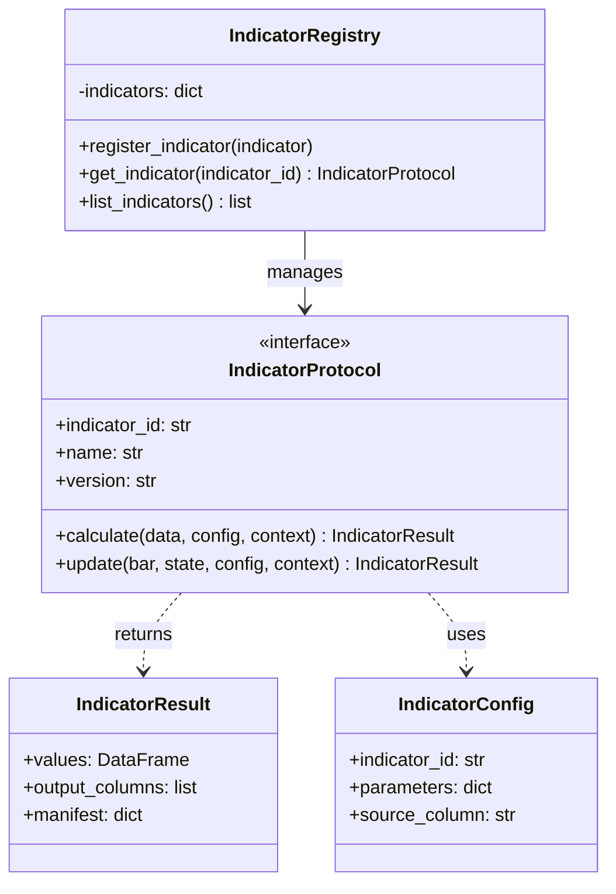

# 03-indicator.md - Requirements

## 1. Purpose


### 1.1 Assumptions and resolved decisions

- [x] Indicator implementations target Python.
- [x] Indicator outputs are decision support artifacts, not official execution artifacts.
- [x] Data normalization and source-readiness rules are owned by the data module.

### 1.2 Open Questions


## 2. Ownership

### 2.1 Owns

### 2.2 Does Not Own

## 3. Global API Contracts and Configuration

### 3.1 Public Capabilities Summary

### 3.3 Configuration Defaults

## 4. Module Architecture

### 4.1 Target Folder Structure

```text
app/
    __init__.py
    services/
        services/
                indicators/
                    __init__.py
                    registry.py
                    protocols.py
                    errors.py
                    calculations.py
                    batch/
                        __init__.py
                        trend.py
                        volatility.py
                        momentum.py
                    incremental/
                        __init__.py
                        state.py
                        accumulators.py
                    adapters/
                        __init__.py
                        cache.py
                        audit.py
tests/
    unit/
        app/
            services/
                services/
                        indicators/
                            test_trend.py
                            test_volatility.py
                            test_momentum.py
                            test_registry.py
    usage/
        app/
            services/
                services/
                        indicators/
                            test_indicator_usage.py```

### 4.2 Class Diagrams



## 5. General / Cross-Cutting Non-Functional Requirements

- [x] Indicator code shall be typed, documented, deterministic, and testable.
- [x] Indicator APIs shall remain separate from strategy execution and simulation execution services.
- [x] Indicator functions shall avoid production `print()` output and shall use structured logging only through approved utility logging contracts where logging is required.
- [x] Indicator implementations shall be reusable by notebook, CLI, agentic, and simulation workflows without changing semantics.
- [x] The module shall be packageable through standard Python packaging metadata.
- [x] Build-system and project metadata shall be declared in `pyproject.toml`.
- [x] Runtime dependencies, optional acceleration dependencies, development dependencies, and test dependencies shall be separated.
- [x] Distributed typed packages shall include `py.typed` when public inline type annotations are intended for downstream type checking.
- [x] Public type information shall be maintained for downstream users when the package is published as typed.
- [x] Logs shall include indicator id, implementation version, parameter hash, input checksum, symbol count, timeframe, and request id when available.
- [x] Logs shall not include full market data payloads by default.
- [x] Indicator execution shall support correlation ids for strategy and simulation workflow tracing.
- [x] Indicator execution shall support distributed tracing across data fetch, indicator calculation, strategy consumption, and simulation integration boundaries when tracing is enabled.
- [x] The module shall support OpenTelemetry-compatible trace propagation or an equivalent vendor-neutral tracing contract.
- [x] Indicator implementations shall support feature-flagged and canary-routed execution for controlled rollout of new implementations.
- [x] Canary execution shall allow a configured subset of actors, workflows, symbols, or requests to receive a new implementation while comparing outputs against the baseline implementation.
- [x] Canary comparison shall record output deltas, tolerance status, performance deltas, and rollback decisions without changing official outputs unless the canary route is explicitly selected.
- [x] Observability shall be optional and shall not change calculation semantics.
- [x] Distributed tracing, feature-flagged execution, canary routing, SLO alert routing, and rollback metadata shall be classified as Optional Extension unless a later approved decision promotes them.
- [x] Indicator requests shall support configurable maximum rows, maximum symbols, maximum columns, memory budget, and execution timeout.
- [x] The module shall define default resource limits for maximum rows, symbols, columns, memory budget, chunk size, and timeout before production use.
- [x] Proposed Core MVP default resource limits are `default_max_rows=10_000_000`, `default_max_symbols=1_000`, `default_max_columns=256`, `default_memory_budget_bytes=4_294_967_296`, `default_chunk_rows=1_000_000`, and `default_timeout_seconds=60`, pending owner/architect approval.
- [x] Resource-limit defaults shall live in an approved configuration schema before Builder handoff and shall be overrideable only through validated configuration.
- [x] Partial outputs shall not be returned as successful official results unless explicitly marked partial.
- [x] Chunked, parallel, and out-of-core processing shall define backpressure behavior before implementation.
- [x] Runtime dependencies shall be explicitly declared and version-constrained.
- [x] Optional acceleration dependencies shall be isolated behind extras or feature flags.
- [x] The project shall maintain a lockfile or equivalent reproducible dependency mechanism for official workflows.
- [x] SBOM generation, cryptographic package signing, vulnerability checks, license gates, and release provenance attestations shall be CI/CD and release-engineering responsibilities, not Python indicator module runtime responsibilities, unless explicitly assigned by a later approved architecture decision.
- [x] The project shall generate or support generating a software bill of materials for production releases.
- [x] Distributed Python wheels, source distributions, and production packages shall be cryptographically signed by the approved CI/CD release pipeline using Sigstore, PEP 740-compatible attestations, or an equivalent approved signing mechanism.
- [x] Release artifacts shall include provenance attestations that identify source revision, build workflow, build environment, package hash, and signing identity.
- [x] Dependency licenses shall be compatible with the intended deployment and distribution model.
- [x] Known vulnerable dependencies shall not be allowed in production releases unless explicitly waived.
- [x] Official indicator workflows shall declare supported numeric dtypes.
- [x] Indicator implementations shall define whether outputs use `float64`, nullable floats, decimals, fixed-point integers, or another representation.
- [x] Unless an indicator formula specification explicitly overrides this policy, NaN input values shall propagate to NaN outputs for affected rows or windows and shall be represented as unavailable values with quality metadata.
- [x] Unless an indicator formula specification explicitly overrides this policy, division by zero shall produce NaN unavailable outputs with deterministic warning metadata rather than silently clipping or filling values.
- [x] Negative zero shall be normalized to zero for hashing, checksums, output comparison, and display.
- [x] Floating-point warning and error handling shall be deterministic within official workflows.
- [x] Indicator comparisons in tests shall use documented absolute and relative tolerances.
- [x] Indicator implementations shall document thread-safety guarantees.
- [x] Production non-transient indicator error rate shall target less than 0.1 percent over the configured measurement window, excluding deterministic user input validation failures.
- [x] Production indicator timeout rate shall target less than 0.05 percent over the configured measurement window.
- [x] SLO thresholds, measurement windows, included workflows, excluded error categories, and alert routing shall be configurable.
- [x] SLO measurements shall be emitted through observability metrics and summarized in production readiness reports.

### 5.1 Other Global and Cross-Cutting Requirements

- [x] The indicator module shall live under `app/services/indicators/` (relocated and approved per DEC-029/DONE-037).
- [x] The indicator module shall provide reusable indicator calculation primitives for strategy, research, and simulation workflows.
- [x] The indicator module shall not determine final official position size, margin acceptance, risk approval, or order matching.
- [x] The indicator module shall expose typed, deterministic functions or classes that can be consumed by strategies and simulation orchestration.
- [x] Indicator outputs shall be treated as decision inputs only; official execution remains owned by `app/services/simulation/`.
- [x] Indicator implementations shall define required input columns, output column names, parameter schema, warmup length, and missing-data behavior.
- [x] Indicator implementations shall validate parameter ranges before calculation.
- [x] Indicators shall accept normalized historical market data from the data module contract.
- [x] Indicators shall accept OHLCV inputs with explicit timestamp, symbol, timeframe, and timezone metadata.
- [x] Indicators shall support multi-symbol input only when output grouping preserves symbol identity.
- [x] Indicators shall preserve input row order after deterministic timestamp and symbol validation.
- [x] Indicator outputs shall include timestamp and symbol alignment metadata.
- [x] Indicator outputs shall expose warmup or unavailable regions explicitly rather than silently filling values.
- [x] Indicator outputs shall distinguish computed values, warmup nulls, missing-input nulls, and rejected rows.
- [x] Indicator outputs used by official backtests shall be serializable in the precision policy required by the downstream workflow.
- [x] Batch indicators shall calculate outputs through vectorized dataframe, array, or columnar operations where the formula permits vectorized calculation.
- [x] Indicator calculation shall not mutate the input dataframe by default.
- [x] Official workflows shall treat in-place input mutation as prohibited unless an explicitly configured internal optimization proves copy-equivalent output and records the optimization in the manifest.
- [x] The default batch result shall be an `IndicatorResult` containing an aligned `values` dataframe with timestamp, symbol, generated indicator columns, availability metadata, and quality metadata.
- [x] The result object shall expose a `join_to(input_data, mode="copy")` helper that returns a copy of the source dataframe with generated indicator columns appended.
- [x] The result object shall expose generated column names through `output_columns`.
- [x] The result object shall expose `values_only` output for workflows that require indicator columns without the original OHLCV columns.
- [x] A call equivalent to `ema(data, period=10, source="close")` shall generate an indicator column named `ema_10` when `close` is the default source.
- [x] When the source column is not the default source or when naming ambiguity exists, output column names shall include the source column, such as `ema_open_10` or `ema_close_10`.
- [x] Multi-output indicators shall expose deterministic output column names for each component, such as `adx_14`, `plus_di_14`, and `minus_di_14`.
- [x] Output column naming shall use stable lowercase snake_case names derived from indicator id, source column, period, and named parameters in canonical parameter order.
- [x] Custom output column names shall be accepted only when they pass schema validation, collision checks, and deterministic naming policy checks.
- [x] Output column collisions with existing input columns shall fail with a deterministic error by default.
- [x] Explicit overwrite, suffix, prefix, or namespace behavior for output column collisions shall require configuration and shall be recorded in the manifest.
- [x] Joined output shall preserve original input columns, row count, row ordering, timestamp alignment, symbol grouping, and index policy.
- [x] Warmup and unavailable rows shall remain present in joined output with nullable indicator values and explicit metadata rather than being dropped.
- [x] Vectorized output alignment shall be verified by timestamp and symbol keys rather than by positional row number alone when the input dataframe has an external index.
- [x] Indicator-derived trade signals shall obey no-lookahead timing.
- [x] Indicators used for bar-open strategies shall expose only fully closed-bar values available before the first tick of the next bar.
- [x] At the first tick of bar `N`, indicator-derived data with timestamp greater than or equal to bar `N` open time shall be masked, dropped, or rejected before strategy access.
- [x] Multi-timeframe indicator alignment shall not expose higher-timeframe values until the higher-timeframe bar is fully closed.
- [x] The module shall provide `available_at`, source `bar_close_time`, source `bar_open_time` when available, `computed_from_start`, `computed_from_end`, `source_timeframe`, and a `lookahead_prohibited` flag for downstream lookahead enforcement.
- [x] Vectorized indicator generation shall provide explicit utilities to shift outputs, such as `.shift(1)`, to align with bar-open execution logic.
- [x] Documentation shall warn against using unshifted current-bar values for bar-open decisions.
- [x] The same indicator input data, parameter set, implementation version, and precision policy shall produce the same output.
- [x] Indicator implementations shall define numeric precision behavior.
- [x] Core MVP numeric behavior shall use IEEE 754 `float64` outputs with default relative tolerance `1e-9` and default absolute tolerance `1e-12` for golden and cross-validation tests unless an approved formula table overrides the tolerance.
- [x] Floating-point arithmetic may be used for research indicators when outputs are not directly used for official accounting or official fill prices.
- [x] Indicator outputs that feed official simulation decisions shall be reproducible across replay runs.
- [x] Indicator result manifests shall include input data checksum, parameter hash, implementation version, output schema version, and calculation timestamp.
- [x] Chunked indicator output shall match full-run output within the documented precision policy.
- [x] Performance benchmarks shall specify hardware profile, including CPU model, core count, RAM, and disk type when caching is disk-backed.
- [x] Performance benchmarks shall specify Python version and key dependency versions, including NumPy, pandas, and any optional acceleration dependencies.
- [x] Performance benchmarks shall define warmup iterations before measurement.
- [x] Performance benchmarks shall define measurement methodology, including wall-clock timing and min, median, and p99 over a documented run count.
- [x] The benchmark suite shall fail CI when performance regresses by more than 20 percent without explicit approval.
- [x] Per-indicator benchmarks shall be maintained and tracked over releases.
- [x] Out-of-core outputs shall match in-memory full-run outputs within the documented precision policy.
- [x] Optional hardware acceleration backends, including Numba, CuPy, SIMD, or equivalent backends, shall be isolated behind explicit feature flags or extras.
- [x] Every accelerated indicator path shall provide a pure NumPy, pandas, or standard Python fallback with identical public API behavior.
- [x] Accelerated and fallback paths shall produce outputs that match within the documented precision policy and shall record backend metadata in the result manifest.
- [x] The module shall document whether each accelerated or parallel backend releases the GIL, uses multiprocessing, or requires single-threaded execution.
- [x] The indicator module shall explicitly declare its public API surface.
- [x] Internal modules shall be clearly marked as private and shall not be consumed directly by strategy or simulation code.
- [x] Public API changes shall follow semantic versioning.
- [x] Backward-incompatible public API, schema, formula, or behavior changes shall require a major version bump or documented migration path.
- [x] Deprecated APIs, indicators, parameters, or schemas shall emit deterministic deprecation warnings and remain supported for a documented compatibility window.
- [x] Indicator result schema versions shall be independently versioned from implementation versions.
- [x] Public indicator interfaces shall use `typing.Protocol` or equivalent structural typing contracts so custom indicators can integrate without inheriting from framework base classes.
- [x] Indicator result objects shall implement rich notebook inspection methods, including `_repr_html_` and `_repr_pretty_`, with summary statistics, warmup visualization, unavailable-region visibility, and manifest summary.
- [x] Debug-mode APIs shall enforce strict typing and runtime validation before calculation begins, using validated schemas or equivalent runtime guards.
- [x] Deprecated indicators, parameters, schemas, or APIs shall follow a three-phase lifecycle.
- [x] The deprecation warning phase shall last at least two minor releases, emit structured warnings on every use, and continue full support.
- [x] The deprecation error with opt-in phase shall last at least two minor releases, raise `IND_DEPRECATED` by default, and support an explicit opt-in flag to restore behavior with a warning.
- [x] The removal phase shall occur only in a major version and shall return `IND_UNSUPPORTED_INDICATOR` or the closest deterministic unsupported-API error.
- [x] Deprecation timelines shall be documented in the changelog and migration guide.
- [x] The indicator module shall expose a documented anatomy for every official and custom indicator.
- [x] `IndicatorProtocol` shall define required attributes for `indicator_id`, `name`, `version`, `formula_version`, `input_schema`, `parameter_schema`, `output_schema`, `warmup_policy`, `capabilities`, and `status`.
- [x] `IndicatorProtocol` shall define `validate_parameters(parameters)`.
- [x] `IndicatorProtocol` shall define `required_columns(parameters)`.
- [x] `IndicatorProtocol` shall define `output_columns(parameters, source=None, naming_policy=None)`.
- [x] `IndicatorProtocol` shall define `warmup_requirement(parameters, timeframe, calendar=None)`.
- [x] `IndicatorProtocol` shall define `validate_input(data, config, context)`.
- [x] `IndicatorProtocol` shall define `calculate(data, config, context)`.
- [x] `IndicatorProtocol` shall define `calculate_vectorized(data, config, context)` when the indicator supports vectorized batch execution separately from generic calculation.
- [x] `IndicatorContext` shall contain request id, correlation id, actor, workflow, environment, entitlement context, tracing context, observability context, and SLO context where applicable.
- [x] Private helper modules shall not be required for downstream strategy, simulation, notebook, or custom-indicator integration.
- [x] Every indicator shall define its exact mathematical formula.
- [x] Every built-in indicator shall provide a concrete formula specification before implementation begins.
- [x] Every built-in indicator shall define default parameters, allowed parameter ranges, default source columns, required input columns, warmup length, output columns, null behavior, and degenerate-window behavior.
- [x] Every rolling-window indicator shall define whether windows are left-closed, right-closed, and whether the current row is included.
- [x] ADR shall define whether it uses high-low range, close-to-close range, session range, calendar-day range, or trading-day range.
- [x] Williams %R shall define behavior when highest high equals lowest low.
- [x] Indicator formulas shall be documented with enough precision that an independent implementation can reproduce the same output.
- [x] Each official built-in indicator shall include a formula specification table defining indicator id, required columns, default source column, parameters, default parameter values, valid parameter ranges, formula, smoothing convention, seed behavior, warmup length, window inclusivity, null handling, degenerate-window behavior, output columns, and precision tolerance.
- [x] Formula tables must be approved before any Core MVP implementation begins; their absence shall halt coding for `app/services/indicators/`.
- [x] The HaruQuant formula specification shall remain the source of truth when third-party library conventions differ.
- [x] Any formula, seed, warmup, tolerance, or default-parameter change shall require an implementation version update, golden fixture review, and documented migration or changelog note.
- [x] Formula specification tables shall use this minimum template:
- [x] Every indicator output row shall include or derive a deterministic `available_at` timestamp.
- [x] `available_at` shall represent the earliest time at which the value may be consumed by a strategy without lookahead.
- [x] Indicator output rows shall include `computed_from_start`, `computed_from_end`, and `source_timeframe` metadata where applicable.
- [x] Higher-timeframe indicator values shall set `available_at` no earlier than the close of the higher-timeframe source bar plus configured data latency.
- [x] Strategy-facing APIs shall filter by `available_at <= decision_time`, not merely by indicator timestamp.
- [x] Indicator outputs shall expose `label_time`, `bar_open_time`, `bar_close_time`, and `available_at` when these differ.
- [x] If a strategy-facing consumer attempts to read a value with `available_at > decision_time`, the retrieval shall raise `IND_LOOKAHEAD_RISK` or return a masked/unavailable result according to the configured error mode.
- [x] Session-aware indicators shall use an explicit trading calendar.
- [x] The module shall define behavior for weekends, exchange holidays, half-days, daylight-saving transitions, and missing session opens or closes.
- [x] Multi-session rolling windows shall define whether overnight gaps are included.
- [x] Indicators shall define whether pre-market, regular-session, post-market, and 24/7 market data are treated separately or continuously.
- [x] Session resets shall be explicit for indicators that require them.
- [x] Official workflows shall reject timezone-naive, ambiguous, or nonexistent local timestamps.
- [x] Local time or exchange time conversion shall occur only at input, output, display, or external integration boundaries.
- [x] Timezone database dependent conversions shall be confined to I/O boundaries and shall record timezone database version or conversion policy when available.
- [x] Historical indicator calculation shall not depend on host timezone database changes after inputs are normalized to UTC.
- [x] Internal processing shall use UTC-aware timestamps or documented naive UTC representations only.
- [x] Indicator inputs shall declare price adjustment status: raw, split-adjusted, dividend-adjusted, total-return-adjusted, back-adjusted, or synthetic.
- [x] Indicator inputs shall declare price source: trade, bid, ask, mid, mark, settlement, or vendor-derived.
- [x] Indicator inputs shall declare venue, exchange, data vendor, symbol normalization version, and corporate-action adjustment version when available.
- [x] Continuous futures or synthetic instruments shall declare roll method and adjustment method.
- [x] Indicator manifests shall include data provenance fields required to reproduce the calculation.
- [x] Official workflows shall reject inputs with unknown adjustment status unless explicitly configured to allow them.
- [x] Official workflows shall reject bars affected by intra-bar corporate-action adjustments unless a deterministic intra-bar adjustment policy is configured before calculation.
- [x] Symbol changes, mergers, ticker replacements, and vendor remaps shall use an explicit symbol mapping contract.
- [x] Bid, ask, and mid-price indicators shall define behavior for stub quotes, inverted markets, missing bid or ask values, and extreme spreads.
- [x] Official workflows shall reject stub quotes or spreads greater than the configured threshold, with a default rejection threshold of 50 percent of mid price, unless an explicit fallback policy is configured.
- [x] Mid-price indicators shall deterministically reject missing or inverted bid/ask inputs unless configured to fall back to last valid mid, trade price, mark price, or unavailable output.
- [x] Indicators shall define whether they support batch calculation, incremental calculation, streaming calculation, or a subset of these modes.
- [x] Incremental updates shall be idempotent for the same input bar.
- [x] Incremental and batch outputs shall match within the documented precision policy.
- [x] Late-arriving, corrected, or revised bars shall trigger deterministic recomputation or deterministic rejection.
- [x] The module shall define whether out-of-order incremental updates are supported.
- [x] Unsupported incremental mode requests shall fail deterministically.
- [x] Custom indicators shall pass a conformance test suite before registration in official workflows.
- [x] Custom indicators shall declare status: official, experimental, deprecated, or research-only.
- [x] Experimental indicators shall not be used in official simulation workflows unless explicitly allowed.
- [x] Custom indicators shall not perform network I/O, broker calls, filesystem writes, account mutations, or nondeterministic random operations during calculation.
- [x] Custom indicators shall declare all external dependencies.
- [x] Custom indicator conformance shall verify prohibited side effects through a documented enforcement mechanism before registration in official workflows.
- [x] Official workflows shall reject custom indicators whose prohibited-operation checks cannot be executed, cannot be trusted, or return an inconclusive result.
- [x] Custom indicator enforcement shall document whether validation uses static analysis, sandbox execution, runtime guards, process isolation, conformance tests, policy review, or a combination of these mechanisms.
- [x] Custom indicators shall be reviewed before promotion to official status.
- [x] Promotion of custom indicators to official status shall require documentation, golden fixtures, conformance tests, no-lookahead tests, determinism tests, and benchmark coverage.
- [x] Indicator functions shall validate all inputs at call time before any calculation begins.
- [x] Parameter validation, schema validation, and data sufficiency checks shall be performed as the first operation and shall fail fast with deterministic error codes.
- [x] The module shall support indicator composition where one indicator output serves as another indicator input.
- [x] When composition is enabled, the module shall accept only validated acyclic indicator graphs.
- [x] Composed indicator chains shall preserve `available_at` correctly.
- [x] No composed indicator shall consume a value before it is available.
- [x] Composed indicator chains shall preserve provenance metadata through the chain.
- [x] Indicator inputs may include per-row data quality flags from the data module.
- [x] Supported quality flags shall include interpolated, backfilled, suspect, corrected, synthetic, auction, and vendor-specific flags when provided by the data module.
- [x] Indicator implementations shall document how each quality flag affects calculation.
- [x] Configured inclusion of flagged rows shall be recorded in the indicator manifest.
- [x] Indicator output rows derived from flagged inputs shall propagate the highest-severity quality flag present in the source data for that calculation window.
- [x] Strategy-facing outputs shall expose quality metadata so strategies can require a minimum data quality level for consumption.
- [x] The indicator module shall define a protocol to request minimum required warmup data from the data module before calculation.
- [x] Warmup requests shall include requested symbol, timeframe, and lookback period.
- [x] Warmup requests shall include indicator id and parameter set to determine exact warmup length.
- [x] Warmup requests shall declare whether warmup data must be closed-bar only or may include the current incomplete bar.
- [x] The indicator module shall request warmup data through the data module contract and shall validate that returned warmup data conforms to the same schema and provenance requirements as the primary input before using it.
- [x] The indicator module shall not directly own market-data fetching, source readiness, vendor adapters, or normalization logic.
- [x] When an indicator is configured with a higher-timeframe source, the module shall request higher-timeframe bars through the data module contract alongside the primary timeframe.
- [x] Higher-timeframe bars shall be validated before calculation and shall not make the indicator module responsible for market-data fetching, provider readiness, or normalization.
- [x] Higher-timeframe indicator values may be forward-filled onto the primary timeframe only after the higher-timeframe source bar is fully closed plus configured data latency.
- [x] The module shall set `available_at` for each primary-timeframe row to the higher-timeframe bar close time plus configured data latency.
- [x] Higher-timeframe bars shall be aligned using left-closed, right-closed boundaries matching the primary timeframe bar edges.
- [x] The module shall support multiple higher-timeframe sources simultaneously with independent availability timestamps.
- [x] Weekend and holiday gaps in higher-timeframe data shall not cause forward-fill of stale values across session boundaries unless explicitly configured.
- [x] Proprietary or licensed indicator implementations shall require an access-control decision before execution.
- [x] Access-control checks shall validate actor, workflow, entitlement, environment, indicator id, indicator version, and intended use before calculation begins.
- [x] Proprietary indicator result manifests shall record non-sensitive access-control decision metadata, including decision id, entitlement policy version, and authorized workflow.
- [x] Proprietary indicator execution shall be supported only through approved protected packaging mechanisms.
- [x] Normalized OHLCV market data.
- [x] Optional normalized tick or lower-timeframe data when an indicator explicitly requires it.
- [x] Symbol metadata.
- [x] Timeframe metadata.
- [x] Indicator id.
- [x] Indicator parameter set.
- [x] Source column selection for indicators that operate on a specific price or value column.
- [x] Output mode: values-only result, joined copy result, or explicitly configured internal optimization.
- [x] Output naming policy.
- [x] Output column conflict policy.
- [x] Precision policy.
- [x] Trading calendar or session policy when an indicator is session-aware.
- [x] Timezone metadata with unambiguous timestamp handling.
- [x] Price adjustment status.
- [x] Price source.
- [x] Venue, exchange, data vendor, symbol normalization version, and corporate-action adjustment version where available.
- [x] Optional intra-bar corporate-action adjustment policy.
- [x] Optional symbol mapping contract for symbol changes, mergers, ticker replacements, and vendor remaps.
- [x] Optional microstructure quality policy containing stub quote, inverted market, missing bid/ask, spread threshold, and mid-price fallback configuration.
- [x] Data latency configuration for availability-time calculation.
- [x] Calculation mode: batch, incremental, streaming, or explicitly unsupported.
- [x] Optional indicator composition graph.
- [x] Optional out-of-core processing configuration containing memory budget, chunk size, storage backend, and spill directory.
- [x] Optional acceleration backend configuration containing backend id, feature flag, worker pool, worker count, and fallback policy.
- [x] Optional feature flag and canary routing configuration for indicator implementation rollout.
- [x] Optional proprietary indicator access context containing actor, workflow, entitlement, environment, and intended use.
- [x] Optional per-row data quality flags from the data module.
- [x] Optional warmup data request configuration.
- [x] Resource limit configuration.
- [x] Optional observability context containing request id and correlation id.
- [x] Optional tracing context containing trace id, parent span id, baggage, and sampling decision.
- [x] Indicator result data aligned to timestamp and symbol.
- [x] Generated indicator column names.
- [x] Indicator values dataframe containing timestamp, symbol, indicator columns, availability metadata, and quality metadata.
- [x] Joined dataframe copy when join output mode is requested.
- [x] Original input dataframe preserved without default mutation.
- [x] `available_at` timestamp or deterministic availability metadata for every output row.
- [x] `label_time`, `bar_open_time`, `bar_close_time`, `computed_from_start`, `computed_from_end`, and `source_timeframe` metadata where applicable.
- [x] Warmup and missing-data metadata.
- [x] Indicator result manifest.
- [x] Input checksum.
- [x] Parameter hash.
- [x] Implementation version.
- [x] Formula version.
- [x] Output schema version.
- [x] Dtype metadata.
- [x] Data provenance metadata required to reproduce the calculation.
- [x] Out-of-core execution metadata when out-of-core processing is enabled.
- [x] Acceleration backend metadata when an accelerated or fallback backend is used.
- [x] Feature flag, canary route, baseline implementation, selected implementation, and canary comparison metadata when rollout controls are enabled.
- [x] Non-sensitive proprietary access-control decision metadata when proprietary indicator execution is requested.
- [x] Output checksum.
- [x] Propagated data quality metadata.
- [x] Indicator composition lineage where applicable.
- [x] Observability metrics when enabled.
- [x] Trace ids and span ids when distributed tracing is enabled.
- [x] SLO measurement fields when SLO tracking is enabled.
- [x] Structured error result with deterministic error code on failure.
- [x] Every indicator result shall include a machine-readable manifest as a standalone serializable object.
- [x] The manifest shall include `manifest_version`.
- [x] The manifest shall include `indicator_id`.
- [x] The manifest shall include `indicator_version`.
- [x] The manifest shall include `formula_version`.
- [x] The manifest shall include `output_schema_version`.
- [x] The manifest shall include `parameter_hash` derived from a canonical parameter representation.
- [x] The manifest shall include `input_checksum` derived from input data including timestamps, symbols, and OHLCV values in canonical order.
- [x] The manifest shall include `output_checksum`.
- [x] The module shall define the exact canonical representation used for parameter hashing, including key ordering, defaults, omitted optional values, numeric formatting, null representation, string normalization, and version material.
- [x] The module shall define the exact input and output checksum policy, including included columns, dtype normalization, timestamp normalization, symbol ordering, row ordering, float handling, null representation, precision policy, and excluded metadata.
- [x] The manifest shall include `data_provenance` with adjustment status, price source, vendor, venue, symbol normalization version, corporate-action version, and continuous contract roll method when applicable.
- [x] The manifest shall include `output_contract` with generated column names, source column, output mode, naming policy, column conflict policy, join mode, input mutation flag, and index alignment policy.
- [x] The manifest shall include `execution_backend` with in-memory, out-of-core, accelerated, fallback, parallelism, worker count, and backend version fields where applicable.
- [x] The manifest shall include `rollout` with feature flag, canary route, selected implementation, baseline implementation, and tolerance status where applicable.
- [x] The manifest shall include `access_control` with non-sensitive decision metadata for proprietary indicator requests where applicable.
- [x] The manifest shall include `timing` with calculation start, calculation end, and wall-clock duration.
- [x] The manifest shall include `output_shape` with row count, symbol count, column list, and dtypes.
- [x] The manifest shall include `environment` with Python version, key dependency versions, operating system, and optional host identifier for debugging.
- [x] The manifest shall include composition lineage when the result depends on upstream indicator outputs.
- [x] The manifest shall include quality-flag policy and propagated quality summary when data quality flags are present.
- [x] Every invalid indicator request shall return a deterministic error code.
- [x] Every invalid input schema shall return a deterministic error code.
- [x] Every invalid parameter set shall return a deterministic error code.
- [x] Invalid output names, invalid output modes, invalid naming policies, and output column collisions shall return deterministic error codes.
- [x] Unexpected input mutation during official calculation shall return a deterministic error code.
- [x] Every insufficient-data condition shall return a deterministic error code or explicit unavailable output according to configuration.
- [x] Lookahead-sensitive indicator access shall provide metadata required for `SIM_LOOKAHEAD_DETECTED`.
- [x] Unsupported indicator ids shall return a deterministic error code.
- [x] Unsupported timeframes shall return a deterministic error code.
- [x] Unsupported dtypes shall return a deterministic error code.
- [x] Ambiguous, nonexistent, or timezone-naive timestamps shall return deterministic error codes in official workflows.
- [x] Unknown adjustment status shall return a deterministic error code unless explicitly allowed.
- [x] Intra-bar corporate-action adjustment inputs without a configured deterministic policy shall return a deterministic error code.
- [x] Missing or incompatible symbol mapping for symbol changes, mergers, ticker replacements, or vendor remaps shall return a deterministic error code.
- [x] Stub quotes, inverted markets, missing bid or ask values, and spread-threshold violations shall return deterministic error codes unless an explicit fallback policy is configured.
- [x] Formula version mismatches shall return a deterministic error code.
- [x] Custom indicators rejected by conformance, status, dependency, or governance checks shall return deterministic error codes.
- [x] Unauthorized proprietary indicator requests shall return deterministic access-control error codes.
- [x] SLO violations detected during production monitoring shall emit deterministic metric events and shall return deterministic error codes when the request policy requires synchronous enforcement.
- [x] Deprecated indicator, parameter, schema, or API use in the deprecation error phase shall return a deterministic error code unless an explicit opt-in flag is configured.
- [x] `IND_INVALID_CONFIG`
- [x] `IND_INVALID_PARAMETER`
- [x] `IND_UNSUPPORTED_INDICATOR`
- [x] `IND_UNSUPPORTED_TIMEFRAME`
- [x] `IND_UNSUPPORTED_DTYPE`
- [x] `IND_INVALID_INPUT_SCHEMA`
- [x] `IND_MISSING_REQUIRED_COLUMN`
- [x] `IND_INVALID_OUTPUT_COLUMN`
- [x] `IND_OUTPUT_COLUMN_CONFLICT`
- [x] `IND_INVALID_OUTPUT_MODE`
- [x] `IND_INPUT_MUTATION_DETECTED`
- [x] `IND_DUPLICATE_TIMESTAMP`
- [x] `IND_NON_MONOTONIC_TIME`
- [x] `IND_AMBIGUOUS_TIMESTAMP`
- [x] `IND_INVALID_TIMEZONE`
- [x] `IND_INVALID_OHLC`
- [x] `IND_INSUFFICIENT_DATA`
- [x] `IND_LOOKAHEAD_RISK`
- [x] `IND_UNKNOWN_ADJUSTMENT_STATUS`
- [x] `IND_INTRA_BAR_ADJUSTMENT_UNSUPPORTED`
- [x] `IND_SYMBOL_MAPPING_REQUIRED`
- [x] `IND_STUB_QUOTE_REJECTED`
- [x] `IND_INVERTED_MARKET`
- [x] `IND_SPREAD_THRESHOLD_EXCEEDED`
- [x] `IND_FORMULA_VERSION_MISMATCH`
- [x] `IND_DEPRECATED`
- [x] `IND_UNSUPPORTED_OUT_OF_CORE`
- [x] `IND_ACCELERATION_BACKEND_UNAVAILABLE`
- [x] `IND_RESOURCE_LIMIT_EXCEEDED`
- [x] `IND_TIMEOUT`
- [x] `IND_CANCELLED`
- [x] `IND_PARTIAL_RESULT`
- [x] `IND_UNSUPPORTED_INCREMENTAL_MODE`
- [x] `IND_CUSTOM_INDICATOR_REJECTED`
- [x] `IND_ACCESS_DENIED`
- [x] `IND_PROPRIETARY_UNAUTHORIZED`
- [x] `IND_SLO_VIOLATION`
- [x] `IND_INTERNAL_ERROR`
- [x] Every functional and non-functional requirement shall have a stable requirement id before implementation begins.
- [x] The test plan shall include a requirement-to-test traceability matrix mapping each requirement id to one or more unit, contract, integration, performance, security, or documentation tests.
- [x] Input validation tests shall cover missing columns, duplicate timestamps, non-monotonic timestamps, invalid OHLC, empty data, insufficient warmup, and invalid parameters.
- [x] Input validation tests shall cover malformed config payloads and invalid configuration combinations, including valid parameters that are incompatible when combined.
- [x] Input validation tests shall verify simultaneous conflicting options, such as `values_only=True` with `output_mode="join"`, fail with `IND_INVALID_CONFIG`.
- [x] Default-parameter tests shall verify default parameter values and valid parameter ranges for every built-in indicator.
- [x] Public API contract tests shall verify every public callable against the documented API contract table.
- [x] Capability-matrix tests shall verify every built-in indicator against its machine-readable capability matrix.
- [x] Public API tests shall verify `typing.Protocol` compatibility for custom indicators that do not inherit from framework base classes.
- [x] Notebook representation tests shall verify indicator result `_repr_html_` and `_repr_pretty_` output includes summary statistics, warmup visualization, unavailable-region visibility, and manifest summary without exposing full market data payloads.
- [x] Vectorized output tests shall verify batch indicators use vectorized dataframe, array, or columnar operations where the formula permits vectorized calculation.
- [x] Vectorized output tests shall verify `ema(data, period=10, source="close")` produces `ema_10` when `close` is the default source.
- [x] Vectorized output tests shall verify non-default source naming such as `ema_open_10` and deterministic multi-output names such as `adx_14`, `plus_di_14`, and `minus_di_14`.
- [x] Join helper tests shall verify `IndicatorResult.join_to(input_data, mode="copy")` appends generated indicator columns while preserving original columns, row count, row order, timestamp alignment, symbol grouping, index policy, warmup rows, and unavailable rows.
- [x] No-lookahead tests shall cover previous-closed-bar availability, current-bar masking, multi-timeframe alignment, and vectorized signal shifting.
- [x] Availability tests shall verify strategy-facing APIs filter by `available_at <= decision_time`.
- [x] Availability tests shall verify higher-timeframe values are unavailable until the higher-timeframe source bar is fully closed plus configured latency.
- [x] Timezone database tests shall verify historical outputs remain stable after UTC-normalized inputs are supplied and that timezone-database-dependent conversions occur only at I/O boundaries.
- [x] Determinism tests shall verify identical inputs and parameters produce identical outputs and manifests.
- [x] Chunking tests shall verify chunked output matches full-run output within documented precision policy.
- [x] Out-of-core tests shall verify datasets exceeding memory budget produce the same output as full in-memory runs within documented precision policy.
- [x] Out-of-core tests shall verify deterministic rejection for indicators that require full in-memory context and cannot be safely chunked.
- [x] Acceleration backend tests shall verify feature-flag isolation, fallback behavior, backend metadata, and parity between accelerated and fallback paths within documented precision policy.
- [x] Batch and incremental tests shall verify incremental output matches batch output within the documented precision policy.
- [x] Composition tests shall verify cyclic graphs, missing upstream columns, incompatible source timeframes, unavailable upstream values, and output column collisions fail deterministically.
- [x] Market data quality tests shall verify default exclusion of flagged rows, explicit inclusion configuration, quality-flag propagation, highest-severity quality summarization, and strategy-facing quality metadata.
- [x] Performance benchmark tests shall prove the CI regression gate fails the build when the greater-than-20-percent regression threshold is triggered without explicit approval.
- [x] Manifest tests shall verify every required manifest field, nested data provenance, calculation config, timing, output shape, environment, composition lineage, and quality summary.
- [x] Manifest tests shall verify output contract fields for generated column names, source column, output mode, naming policy, column conflict policy, join mode, input mutation flag, and index alignment policy.
- [x] Manifest tests shall verify parameter hash canonicalization and input/output checksum policies are stable and documented.
- [x] Reference outputs shall be reviewed and pinned by implementation version.
- [x] Changes to golden outputs shall require explicit approval and changelog entry.
- [x] EMA, SMA, RSI, ATR, and ADX outputs shall be cross-validated against at least two industry-standard libraries, including TA-Lib and pandas-ta, tulipy, or equivalent libraries, on fixed golden fixtures.
- [x] Cross-validation deviations beyond documented tolerance shall require formula justification, implementation-version pinning, golden fixture approval, and changelog entry.
- [x] Calendar and session tests shall cover weekends, exchange holidays, half-days, daylight-saving transitions, session gaps, missing opens, missing closes, pre-market, regular-session, post-market, and 24/7 market data.
- [x] Provenance tests shall cover raw, split-adjusted, dividend-adjusted, total-return-adjusted, back-adjusted, synthetic, bid, ask, mid, mark, settlement, vendor-derived, continuous futures, and unknown adjustment status inputs.
- [x] Microstructure tests shall cover stub quotes, inverted markets, missing bid or ask values, spreads above the configured threshold, and mid-price fallback policies.
- [x] Survivorship bias tests shall verify indicators do not silently produce misleading signals for delisted, bankrupt, merged, or inactive symbols without data-quality flags and provenance metadata.
- [x] Resource-limit tests shall cover maximum rows, symbols, columns, memory budget, execution timeout, cancellation, and partial-result handling.
- [x] Observability tests shall verify metrics, logs, traces, canary comparison metadata, and SLO measurement fields include required fields and do not change calculation semantics.
- [x] Feature flag and canary tests shall verify routed execution, baseline comparison, output delta recording, tolerance status, rollback metadata, and unchanged official outputs when canary route is not selected.
- [x] Warmup protocol tests shall verify requested symbol, timeframe, lookback, indicator id, parameter set, closed-bar policy, returned provenance, data-module contract integration through a fake data-module provider, and warmup output marking.
- [x] Multi-timeframe alignment tests shall verify higher-timeframe data requests through a fake data-module contract, forward-fill only after availability, independent availability timestamps for multiple higher-timeframe sources, boundary alignment, and stale gap prevention across weekends and holidays.
- [x] Custom indicator conformance tests shall verify status, dependency declarations, no network I/O, no broker calls, no filesystem writes, no account mutations, no nondeterministic random operations, and promotion requirements.
- [x] Custom indicator conformance tests shall verify rejection when prohibited-operation enforcement cannot run, cannot be trusted, or returns an inconclusive result.
- [x] Custom indicator tests shall verify import failure, dependency conflict, unsupported Python version, and side-effect enforcement failure handling.
- [x] Proprietary indicator tests shall verify entitlement context and protected-package metadata do not leak secrets into logs, traces, manifests, or error messages.
- [x] Supply-chain tests shall verify dependency declarations, lockfile or equivalent reproducibility mechanism, license compatibility checks, vulnerability checks, SBOM generation support, cryptographic package signing, and release provenance attestations.
- [x] Property-based tests shall cover valid and invalid OHLCV inputs.
- [x] Property-based tests shall verify SMA over constant price input equals the constant price after warmup.
- [x] Property-based tests shall verify EMA over constant price input converges deterministically according to its seed policy.
- [x] Property-based tests shall verify RSI remains within documented bounds for valid inputs.
- [x] Property-based tests shall verify Williams %R remains within documented bounds for valid non-degenerate windows.
- [x] Property-based tests shall verify ATR is non-negative for valid OHLC inputs.
- [x] Property-based tests shall verify indicator output row count and symbol grouping match the documented output policy.
- [x] Property-based tests shall verify adding future rows does not change previously available closed-bar outputs except when explicitly documented for revision-aware modes.
- [x] Strategy integration tests shall verify indicator outputs can feed trade-signal generation without exposing prohibited current-bar data.
- [x] Simulation integration tests shall verify indicator-derived signals are converted to trade intents before tick execution.
- [x] Documentation tests shall execute usage examples, invalid-input examples, manifest-inspection examples, multi-symbol examples, multi-timeframe examples, and incremental examples where supported.
- [x] Usage examples shall include normal output, invalid parameter handling, missing-column handling, manifest inspection, availability filtering, multi-symbol input, multi-timeframe input, and incremental update behavior where supported.
- [x] Usage examples shall show deterministic structured error behavior rather than relying only on successful calls.
- [x] Usage examples shall remain executable documentation examples once implementation begins.
- [x] Documentation shall include a configuration reference for every supported indicator.
- [x] Documentation shall include the Production Scope Tiers classification for every requirement before implementation begins.
- [x] Documentation shall include a requirement-to-test traceability matrix.
- [x] Documentation shall include input schema, output schema, parameter schema, warmup policy, and missing-data behavior for every supported indicator.
- [x] Documentation shall describe no-lookahead behavior for indicator-derived signals.
- [x] Documentation shall describe multi-timeframe indicator alignment.
- [x] Documentation shall include API examples showing `ema(data, period=10, source="close")` returning an `IndicatorResult` with `ema_10` and `result.join_to(data)` returning a copied dataframe with `ema_10` appended.
- [x] Documentation shall describe vectorized calculation requirements, values-only output, joined-copy output, default input immutability, official in-place mutation restrictions, and internal optimization manifest requirements.
- [x] Documentation shall describe output column naming, default source naming, non-default source naming, multi-output naming, custom output names, output column conflict policy, and generated `output_columns`.
- [x] Documentation shall describe notebook result representations, including `_repr_html_`, `_repr_pretty_`, summary statistics, warmup visualization, unavailable-region visibility, and manifest summaries.
- [x] Documentation shall describe debug-mode strict typing and runtime validation behavior.
- [x] Documentation shall describe semantic versioning policy and migration requirements for backward-incompatible changes.
- [x] Documentation shall include exact mathematical formula, smoothing convention, alpha convention, seed behavior, rolling-window inclusivity, and edge-case behavior for every supported indicator.
- [x] Documentation shall describe RSI, ATR, and ADX smoothing conventions.
- [x] Documentation shall describe ADR range convention and Williams %R degenerate-window behavior.
- [x] Documentation shall describe golden fixtures and reference output approval workflow.
- [x] Documentation shall describe the `available_at` contract, `label_time`, `bar_open_time`, `bar_close_time`, `computed_from_start`, `computed_from_end`, and strategy-facing filtering.
- [x] Documentation shall describe calendar, session, weekend, holiday, half-day, daylight-saving, missing-session, pre-market, regular-session, post-market, and 24/7 market semantics.
- [x] Documentation shall describe market-data provenance, price adjustment status, price source, venue, vendor, symbol normalization version, corporate-action adjustment version, and continuous-instrument adjustment policy.
- [x] Documentation shall describe intra-bar corporate-action adjustment rejection, deterministic intra-bar adjustment policies, symbol mapping continuity, mergers, ticker replacements, vendor remaps, stub quote handling, inverted market handling, spread thresholds, and mid-price fallback behavior.
- [x] Documentation shall describe batch, incremental, and streaming calculation modes.
- [x] Documentation shall describe out-of-core processing, memory budgets, chunk sizes, spill storage, unsupported out-of-core rejection, and in-memory parity requirements.
- [x] Documentation shall describe optional acceleration backends, feature flags, pure fallback behavior, backend metadata, GIL-release behavior, and parallel symbol execution configuration.
- [x] Documentation shall describe input validation timing and fail-fast behavior.
- [x] Documentation shall describe indicator result manifest structure and every required manifest field.
- [x] Documentation shall describe data quality flags, default exclusion policy, explicit inclusion policy, output quality propagation, and strategy-facing quality metadata.
- [x] Documentation shall describe warmup data request protocol and warmup output marking.
- [x] Documentation shall describe detailed multi-timeframe alignment, boundary semantics, independent availability timestamps, and stale gap prevention.
- [x] Documentation shall describe observability metrics, log fields, request ids, correlation ids, distributed tracing, OpenTelemetry-compatible propagation, feature flags, canary routing, output delta comparison, and rollback metadata.
- [x] Documentation shall describe packaging metadata, `pyproject.toml`, dependency categories, `py.typed`, and typed package behavior.
- [x] Documentation shall describe dependency pinning, lockfile or equivalent reproducibility mechanism, SBOM generation, license checks, vulnerability checks, cryptographic package signing, release provenance attestations, and waiver process.
- [x] Documentation shall describe custom indicator conformance, status values, prohibited operations, dependency declarations, and promotion review.
- [x] Documentation shall describe proprietary indicator access control, entitlement checks, authorized workflows, non-sensitive manifest metadata, source protection, and protected-package determinism.
- [x] Documentation shall describe mandatory cross-validation against industry-standard libraries, third-party formula convention differences, golden fixture approval, mutation fuzz testing, and survivorship bias testing.
- [x] Public API surface is documented.
- [x] Production Scope Tiers are assigned and approved for every requirement.
- [x] Public API contract tables are complete for every public callable.
- [x] Requirement-to-test traceability matrix exists and maps every requirement id to tests or approved deferral.
- [x] `typing.Protocol` contracts and notebook result representations are implemented and tested.
- [x] Vectorized dataframe output, deterministic indicator column naming, values-only output, joined-copy output, and output column conflict behavior are implemented and tested.
- [x] `ema(data, period=10, source="close")` produces `ema_10`, and `IndicatorResult.join_to(data)` appends `ema_10` to a copied dataframe without mutating the input by default.
- [x] `pyproject.toml` metadata is present and valid.
- [x] Typed distribution includes `py.typed` when public inline type annotations are exported.
- [x] Formula specifications exist for every official indicator.
- [x] Golden fixtures exist for every official indicator.
- [x] Availability-time metadata is implemented and tested.
- [x] Calendar and session behavior is documented and tested.
- [x] Market-data provenance, adjustment status, intra-bar corporate actions, symbol mapping, and microstructure rules are validated.
- [x] Cross-library validation passes for EMA, SMA, RSI, ATR, and ADX against at least two industry-standard libraries.
- [x] Batch and incremental parity tests pass for indicators that support incremental mode.
- [x] Out-of-core parity and unsupported out-of-core rejection tests pass.
- [x] Acceleration backend parity, feature flag, fallback, and backend metadata tests pass.
- [x] Performance benchmark metadata and regression gate are implemented.
- [x] Machine-readable manifest structure is implemented and tested.
- [x] Manifest output-contract fields are implemented and tested.
- [x] Indicator composition tests pass where composition is supported.
- [x] Data-quality flag handling is implemented and tested.
- [x] Deprecation lifecycle and `IND_DEPRECATED` behavior are implemented.
- [x] Warmup data request protocol is documented and tested.
- [x] Multi-timeframe alignment protocol is documented and tested.
- [x] Custom indicator conformance suite passes for every registered custom indicator.
- [x] Proprietary indicator access control and protected-source determinism tests pass for every proprietary indicator.
- [x] Property-based and invariant tests pass.
- [x] Mutation fuzz and survivorship bias tests pass.
- [x] Distributed tracing, feature flag, canary routing, and SLO measurement tests pass.
- [x] Dependency lockfile or equivalent reproducibility mechanism is present for official workflows.
- [x] Dependency license and vulnerability checks pass or have explicit waivers.
- [x] Cryptographic package signing and release provenance attestation are present for production packages.
- [x] Software bill of materials generation is supported for production releases.
- [x] Core MVP coding shall halt until `IND-PREQ-001`, `IND-PREQ-002`, `IND-PREQ-003`, `IND-PREQ-004`, `IND-PREQ-005`, and `IND-PREQ-006` are resolved or explicitly deferred.
- [x] Official Backtest Required shall include no-lookahead alignment, reproducible fixtures, manifest/checksum behavior, data-quality propagation, and strategy/simulation integration contracts.
- [x] Optional Extension shall include streaming, out-of-core processing, acceleration backends, proprietary indicator execution, distributed tracing, SLO alert routing, and canary routing unless a later approved decision promotes any item.
- [x] Future Improvement shall include capabilities that are useful but not required for the current approved implementation phase.
- [x] Core MVP shall be implementable without optional acceleration backends, proprietary indicator controls, out-of-core execution, distributed tracing, SLO enforcement, or release-signing infrastructure.
- [x] Every public callable shall be classified as stable, experimental, internal, optional, or future before implementation begins.
- [x] Every official indicator shall publish a machine-readable capability matrix covering batch, vectorized, incremental, streaming, out-of-core, acceleration, composition, multi-symbol, and multi-timeframe support.
- [x] Public usage examples shall be executable documentation examples once implementation begins.
- [x] GPU/SIMD acceleration may be added as an Optional Extension after Core MVP formula and fixture behavior is stable.
- [x] Rich notebook HTML representations may be added after stable result and manifest schemas exist.
- [x] Proprietary source protection may be added through approved packaging/security controls without changing public indicator semantics.

## 6. Detailed Requirements by File

### File: app/__init__.py

#### Purpose & Scope
Contains functional, security, and testing requirements specifically assigned to `app/__init__.py`.

#### Functional Requirements
- [x] Every smoothed indicator shall define smoothing method, alpha convention, and initial seed behavior.
- [x] Documentation shall describe numeric dtype policy, NaN, infinity, negative zero, overflow, underflow, divide-by-zero, and floating-point tolerance behavior.
- [x] `IndicatorProtocol.calculate(data, config, context)` shall use approved type hints before implementation begins.
- [x] `data` shall be a `pandas.DataFrame` for Core MVP batch execution unless a formula table explicitly approves an alternate typed input.
- [x] Core MVP `data` shall contain UTC-normalized timestamp information as either a UTC `DatetimeIndex` for single-symbol input or a `MultiIndex` containing `symbol` and UTC `timestamp` levels for multi-symbol input.
- [x] Core MVP `data` shall expose required OHLCV columns through stable lowercase column names and shall reject ambiguous duplicate columns.
- [x] `IndicatorResult.values` shall be a `pandas.DataFrame` aligned to the accepted input timestamp/symbol keys and containing generated indicator columns plus required availability and quality metadata.
- [x] `IndicatorConfig` and `IndicatorContext` shall be typed as dataclasses, `TypedDict`, Pydantic models, or equivalent approved Python contracts before Builder handoff.
- [x] Any future array-native input such as `numpy.ndarray` shall be an Optional Extension with explicit schema, shape, dtype, symbol/timestamp alignment, and conversion rules.

#### Non-Functional & Security Requirements
- [x] No file-specific non-functional requirements defined.

#### Testing & Edge Cases
- [x] Numeric tests shall cover dtype preservation, NaN, infinity, negative zero, overflow, underflow, divide-by-zero, absolute tolerance, and relative tolerance.
- [x] Numeric tests shall verify NaN propagation, infinity rejection in official workflows, division-by-zero unavailable outputs, negative-zero normalization, and overflow/underflow deterministic handling.
- [x] Property-based mutation fuzz tests shall inject NaN, infinity, extreme outliers, zero volume, flat prices, negative values, malformed timestamps, duplicate timestamps, and random missing intervals.

### File: app/services/indicators/__init__.py

#### Purpose & Scope
Contains functional, security, and testing requirements specifically assigned to `app/services/indicators/__init__.py`.

#### Functional Requirements
- [x] No file-specific functional requirements defined. Foundation properties apply.

#### Non-Functional & Security Requirements
- [x] No file-specific non-functional requirements defined.

#### Testing & Edge Cases
- [x] No file-specific testing requirements defined.

### File: app/services/indicators/registry.py

#### Purpose & Scope
Contains functional, security, and testing requirements specifically assigned to `app/services/indicators/registry.py`.

#### Functional Requirements
- [x] The module shall provide an indicator registry for approved indicator implementations.
- [x] Registered indicators shall declare id, name, version, parameter schema, input schema, output schema, warmup policy, and deterministic behavior.
- [x] Custom indicators shall be registered through approved extension points before use in official workflows.
- [x] Custom indicator registration shall not bypass input validation, no-lookahead metadata, schema validation, or deterministic replay requirements.
- [x] Public APIs shall include stable import paths, function and class signatures, parameter schemas, result schemas, error schemas, and registry contracts.
- [x] The deprecation phase for each indicator, parameter, schema, or API shall be machine-readable through the registry.
- [x] The public package shall expose registry operations for `register_indicator(...)`, `get_indicator(...)`, `list_indicators(...)`, `validate_indicator(...)`, and `unregister_indicator(...)` where unregistering is allowed outside official production registries.
- [x] Convenience functions shall return `IndicatorResult` and shall use the same validation, naming, manifest, cache, availability, and no-lookahead rules as registry-driven execution.
- [x] Public module layout shall separate core protocols, result types, registry code, built-in indicator implementations, error definitions, and test fixtures.
- [x] Documentation shall declare the public API surface, stable import paths, `typing.Protocol` contracts, registry contracts, schema versions, and deprecation policy.
- [x] Documentation shall describe indicator anatomy, required public types, required protocol attributes, required protocol methods, registry operations, built-in convenience functions, result objects, manifests, and state objects.
- [x] Documentation shall describe the deprecation lifecycle, machine-readable registry phase, changelog entries, migration guide, and `IND_DEPRECATED`.
- [x] Indicator anatomy, required interfaces, registry operations, built-in convenience functions, and result object methods are documented and tested.
- [x] The public API contract table shall cover registry operations, built-in convenience functions, result object methods, protocol methods, state serialization functions, and manifest serialization functions.
- [x] The machine-readable capability matrix shall be generated from the registry and shall include indicator id, version, tier, supported modes, optional dependencies, unsupported-mode error codes, and official-workflow eligibility.

#### Non-Functional & Security Requirements
- [x] No file-specific non-functional requirements defined.

#### Testing & Edge Cases
- [x] Registry API tests shall verify `register_indicator`, `get_indicator`, `list_indicators`, `validate_indicator`, and allowed `unregister_indicator` behavior.
- [x] Built-in convenience function tests shall verify `ema`, `sma`, `adx`, `atr`, `adr`, `rolling_volatility`, `rsi`, and `williams_r` return `IndicatorResult` and follow the same validation, naming, manifest, cache, availability, and no-lookahead rules as registry execution.
- [x] Deprecation lifecycle tests shall verify deprecation warning phase, deprecation error with opt-in phase, removal phase, registry machine-readable phase, `IND_DEPRECATED`, and migration-guide coverage.

### File: app/services/indicators/protocols.py

#### Purpose & Scope
Contains functional, security, and testing requirements specifically assigned to `app/services/indicators/protocols.py`.

#### Functional Requirements
- [x] No file-specific functional requirements defined. Foundation properties apply.

#### Non-Functional & Security Requirements
- [x] No file-specific non-functional requirements defined.

#### Testing & Edge Cases
- [x] No file-specific testing requirements defined.

### File: app/services/indicators/errors.py

#### Purpose & Scope
Contains functional, security, and testing requirements specifically assigned to `app/services/indicators/errors.py` (which must inherit from `app/utils/errors.py` and reuse standard exception types).

#### Functional Requirements
- [x] All standard system exceptions and error codes shall be imported and reused from `app.utils.errors` to prevent duplicate declaration. Custom indicator exceptions must inherit from `app.utils.errors.Error` or `HaruQuantError`.
- [x] Indicator implementations shall return deterministic errors for invalid input schema, invalid parameter values, insufficient data, non-monotonic timestamps, duplicate timestamps, or impossible OHLCV values.
- [x] The module shall provide metadata required for downstream layers to raise their own lookahead errors while keeping simulation-layer errors outside indicator ownership.
- [x] Out-of-core processing shall expose deterministic errors when an indicator requires full in-memory context and cannot be safely chunked.
- [x] Type mismatch failures in debug mode shall fail fast with deterministic errors before any output, state mutation, cache read, or cache write occurs.
- [x] `IndicatorResult` shall contain `values`, `output_columns`, `manifest`, `availability`, `quality`, `state`, `errors`, `metrics`, and `join_to(...)`.
- [x] Division-by-zero, all-null windows, constant-price windows, zero-volume windows, flat-market windows, NaN inputs, infinite values, overflow, underflow, and negative zero shall produce deterministic outputs or deterministic errors.
- [x] Composition shall reject cycles, missing upstream outputs, incompatible source timeframes, unavailable upstream values, and output column collisions with deterministic errors before calculation.
- [x] The module shall document whether deterministic errors are raised as exceptions, returned inside `IndicatorResult.errors`, or both, and shall document the default mode.
- [x] Indicator errors shall be safe, deterministic, and machine-readable.
- [x] Requests exceeding configured resource limits shall fail with deterministic machine-readable errors.
- [x] Missing optional acceleration, proprietary, tracing, or audit dependencies shall produce deterministic unsupported-backend or not-configured errors without changing default built-in indicator semantics.
- [x] Unless an indicator formula specification explicitly overrides this policy, positive and negative infinity inputs shall be rejected with deterministic numeric errors in official workflows before calculation.
- [x] Overflow and underflow shall return deterministic errors or unavailable outputs according to the indicator formula specification and shall be recorded in result errors or warning metadata.
- [x] Core MVP shall include deterministic batch calculation for EMA, SMA, ADX, ATR, ADR, rolling volatility, RSI, and Williams %R; input validation; output naming; no-lookahead availability metadata; manifests; deterministic errors; and golden tests.
- [x] Public contracts shall define whether invalid requests raise exceptions, return `IndicatorResult(errors=...)`, or support both modes, and shall document the default mode.
- [x] Unsupported modes, unsupported backends, unsupported indicators, unavailable optional dependencies, and unsupported composition requests shall fail before calculation with deterministic errors.

#### Non-Functional & Security Requirements
- [x] No file-specific non-functional requirements defined.

#### Testing & Edge Cases
- [x] Error-mode tests shall verify deterministic exception mode and deterministic `IndicatorResult.errors` mode if both are supported.
- [x] Error-mode tests shall verify that result-error mode does not raise exceptions and instead populates `IndicatorResult.errors` with deterministic codes.
- [x] Output contract tests shall verify custom output names, invalid output names, output naming policies, output modes, column conflict policies, and deterministic collision errors.
- [x] Simulation integration tests shall verify simulation-layer lookahead detection uses indicator-provided availability metadata without making the indicator module own simulation errors.

### File: app/services/indicators/calculations.py

#### Purpose & Scope
Contains functional, security, and testing requirements specifically assigned to `app/services/indicators/calculations.py`.

#### Functional Requirements
- [x] Indicator calculations shall not use current incomplete bar high, low, close, volume, or derived values for previous-closed-bar decisions.
- [x] Indicator calculations may be cached by indicator id, parameter hash, input data checksum, implementation version, schema version, and precision policy.
- [x] Indicator calculations shall support chunked processing where mathematically valid and shall preserve warmup continuity across chunks.
- [x] Indicator calculations shall support out-of-core processing for datasets that exceed configured memory budgets when the indicator formula permits bounded-state or chunked computation.
- [x] Indicator calculations shall define whether windows operate over rows, elapsed time, trading sessions, or calendar time.
- [x] For batch calculations, full input validation shall complete before any output rows are computed.
- [x] For incremental calculations, state deserialization validation and new-bar validation shall complete before incremental state is updated.
- [x] Flagged rows shall be excluded from official calculations by default unless explicitly configured otherwise.
- [x] Optional incremental state for incremental calculations.
- [x] Indicator calculations shall emit structured operational metrics where enabled.

#### Non-Functional & Security Requirements
- [x] No file-specific non-functional requirements defined.

#### Testing & Edge Cases
- [x] Input immutability tests shall verify indicator calculations do not mutate the input dataframe by default and raise `IND_INPUT_MUTATION_DETECTED` when official calculation detects unexpected mutation.

### File: app/services/indicators/batch/__init__.py

#### Purpose & Scope
Contains functional, security, and testing requirements specifically assigned to `app/services/indicators/batch/__init__.py`.

#### Functional Requirements
- [x] No file-specific functional requirements defined. Foundation properties apply.

#### Non-Functional & Security Requirements
- [x] No file-specific non-functional requirements defined.

#### Testing & Edge Cases
- [x] No file-specific testing requirements defined.

### File: app/services/indicators/batch/trend.py

#### Purpose & Scope
Contains functional, security, and testing requirements specifically assigned to `app/services/indicators/batch/trend.py`.

#### Functional Requirements
- [x] The module shall support trend indicators including EMA, SMA, and ADX.
- [x] Documentation shall include examples for EMA/SMA trend signals, ATR volatility sizing inputs, RSI momentum signals, vectorized dataframe output, joined indicator columns, and multi-timeframe alignment.

#### Non-Functional & Security Requirements
- [x] No file-specific non-functional requirements defined.

#### Testing & Edge Cases
- [x] No file-specific testing requirements defined.

### File: app/services/indicators/batch/volatility.py

#### Purpose & Scope
Contains functional, security, and testing requirements specifically assigned to `app/services/indicators/batch/volatility.py`.

#### Functional Requirements
- Provide typed built-in convenience functions for `ema(...)`, `sma(...)`, `adx(...)`, `atr(...)`, `adr(...)`, `rolling_volatility(...)`, `rsi(...)`, and `williams_r(...)`.
- [x] The module shall support volatility indicators including ATR, ADR, and rolling volatility.
- [x] Official indicator convenience functions shall expose typed wrappers for supported built-ins, including `ema(...)`, `sma(...)`, `adx(...)`, `atr(...)`, `adr(...)`, `rolling_volatility(...)`, `rsi(...)`, and `williams_r(...)`.
- [x] Rolling volatility shall define return type, log-return versus simple-return behavior, sample versus population standard deviation, degrees of freedom, and annualization factor.
- [x] Formula specification tables shall be completed for EMA, SMA, ADX, ATR, ADR, rolling volatility, RSI, and Williams %R before implementation begins.
- [x] Documentation shall describe rolling volatility return type, log/simple return policy, standard-deviation convention, degrees of freedom, and annualization factor.

#### Non-Functional & Security Requirements
- [x] No file-specific non-functional requirements defined.

#### Testing & Edge Cases
- [x] Indicator tests shall cover EMA, SMA, ADX, ATR, ADR, rolling volatility, RSI, and Williams %R.
- [x] Formula golden tests shall verify exact formula conventions, seed behavior, warmup length, rolling-window inclusivity, null handling, and degenerate-window behavior for EMA, SMA, ADX, ATR, ADR, rolling volatility, RSI, and Williams %R.
- [x] Golden fixtures shall cover normal data, flat markets, gaps, missing bars, duplicated timestamps, extreme volatility, zero volume, all-null windows, and insufficient warmup.
- [x] Property-based tests shall verify rolling volatility is non-negative.

### File: app/services/indicators/batch/momentum.py

#### Purpose & Scope
Contains functional, security, and testing requirements specifically assigned to `app/services/indicators/batch/momentum.py`.

#### Functional Requirements
- [x] The module shall support momentum indicators including RSI and Williams %R.

#### Non-Functional & Security Requirements
- [x] No file-specific non-functional requirements defined.

#### Testing & Edge Cases
- [x] No file-specific testing requirements defined.

### File: app/services/indicators/incremental/__init__.py

#### Purpose & Scope
Contains functional, security, and testing requirements specifically assigned to `app/services/indicators/incremental/__init__.py`.

#### Functional Requirements
- [x] No file-specific functional requirements defined. Foundation properties apply.

#### Non-Functional & Security Requirements
- [x] No file-specific non-functional requirements defined.

#### Testing & Edge Cases
- [x] No file-specific testing requirements defined.

### File: app/services/indicators/incremental/state.py

#### Purpose & Scope
Contains functional, security, and testing requirements specifically assigned to `app/services/indicators/incremental/state.py`.

#### Functional Requirements
- [x] Official fills, orders, account state, journals, and reports are produced by the simulation module.
- [x] The indicator module shall not execute trades, create fills, mutate account state, mutate simulation journals, or perform broker-state operations.
- [x] Official production batch indicators shall not rely on per-row Python loops except for formulas with documented stateful dependencies that cannot be vectorized safely.
- [x] Indicator implementations shall avoid hidden global mutable state.
- [x] Performance benchmarks shall state whether cached or uncached performance is being measured.
- [x] The public package shall expose `IndicatorProtocol`, `IndicatorConfig`, `IndicatorContext`, `IndicatorResult`, `IndicatorManifest`, `IndicatorState`, `WarmupRequirement`, `IndicatorRegistration`, and `IndicatorError` with exact approved type contracts.
- [x] `IndicatorProtocol` shall define `update(bar, state, config, context)` when the indicator supports incremental or streaming execution.
- [x] `IndicatorProtocol` shall define `serialize_state(state)` and `deserialize_state(payload)` when the indicator supports incremental or streaming execution.
- [x] `IndicatorState` shall contain serializable incremental accumulators, last processed timestamp, last processed symbol, warmup completion status, input checksum, and state schema version.
- [x] RSI, ATR, and ADX implementations shall explicitly state whether they use Wilder smoothing or another smoothing convention.
- [x] Formula specification tables shall state whether each indicator is Core MVP, Official Backtest Required, Production Required, Optional Extension, or Future Improvement.
- [x] Symbol mapping shall preserve indicator state continuity across equivalent instrument identities without resetting warmup unless the mapping policy marks the instrument as discontinuous.
- [x] Incremental indicators shall expose serializable state.
- [x] Incremental state shall include enough information to resume calculation without recomputing the full history.
- [x] Serialized incremental state shall use a documented binary or text serialization format.
- [x] Serialized incremental state shall include indicator id.
- [x] Serialized incremental state shall include implementation version.
- [x] Serialized incremental state shall include incremental state schema version.
- [x] Serialized incremental state shall include parameter hash.
- [x] Serialized incremental state shall include input checksum of all data processed so far.
- [x] Serialized incremental state shall include internal accumulator values sufficient to resume without recomputation.
- [x] Serialized incremental state shall include last-processed timestamp and symbol.
- [x] Serialized incremental state shall include warmup completion flag.
- [x] Deserialization shall validate that provided state matches current indicator id, implementation version, schema version, and parameter set.
- [x] Deserialization of state from a different indicator version, schema version, or parameter set shall return `IND_STATE_INCOMPATIBLE`.
- [x] Corrupted or unreadable serialized state shall return `IND_STATE_CORRUPTED`.
- [x] Incremental state size shall be bounded and shall not grow proportionally to the total number of bars processed.
- [x] Indicators shall consume warmup data for calculation state but shall not emit output rows for the warmup period unless those rows are explicitly marked as warmup.
- [x] Unauthorized proprietary indicator requests shall fail before input data is read, state is deserialized, cache entries are read, or calculation begins.
- [x] Serializable incremental state when incremental calculation is enabled.
- [x] Incompatible incremental state shall return a deterministic error code before state is updated.
- [x] Corrupted incremental state shall return a deterministic error code before state is updated.
- [x] `IND_STATE_INCOMPATIBLE`
- [x] `IND_STATE_CORRUPTED`
- [x] Stateless indicator functions shall be thread-safe by default.
- [x] Stateful incremental indicators shall be single-owner or lock-free according to their documented state model.
- [x] Single-owner incremental state objects shall not be safe for concurrent mutation.
- [x] Lock-free incremental state objects shall be safe for concurrent reads with immutable state snapshots.
- [x] Documentation shall describe incremental state serialization, idempotency, late-arriving data, corrected data, revised data, and out-of-order update behavior.
- [x] Documentation shall describe incremental state format, state compatibility validation, state corruption handling, and bounded state size.
- [x] Documentation shall describe thread-safety guarantees, incremental state ownership, immutable state snapshots, cache concurrency, parallel symbol execution, worker pools, worker counts, chunk sizes, and cache synchronization.
- [x] Debug-mode strict typing and runtime validation fail before calculation or state mutation.
- [x] Incremental state compatibility and corruption tests pass.
- [x] `IndicatorManifest`, `IndicatorState`, and `IndicatorError` shall have exact serialized field contracts before implementation begins.

#### Non-Functional & Security Requirements
- [x] No file-specific non-functional requirements defined.

#### Testing & Edge Cases
- [x] Input validation timing tests shall verify parameter validation, schema validation, data sufficiency checks, state deserialization validation, and new-bar validation fail before calculation or state mutation.
- [x] Indicator anatomy tests shall verify `IndicatorProtocol`, `IndicatorConfig`, `IndicatorContext`, `IndicatorResult`, `IndicatorManifest`, `IndicatorState`, `WarmupRequirement`, `IndicatorRegistration`, and `IndicatorError` contracts.
- [x] Indicator anatomy tests shall verify required methods for `validate_parameters`, `required_columns`, `output_columns`, `warmup_requirement`, `validate_input`, `calculate`, `calculate_vectorized`, `update`, `serialize_state`, and `deserialize_state` where applicable.
- [x] Debug-mode validation tests shall verify type mismatches fail before calculation, state mutation, cache reads, cache writes, or output generation.
- [x] Incremental tests shall verify state serialization, resume behavior, idempotent repeated input bars, late-arriving bars, corrected bars, revised bars, and out-of-order updates.
- [x] Incremental state tests shall verify state format, indicator id, implementation version, schema version, parameter hash, processed input checksum, accumulator values, last-processed timestamp, last-processed symbol, warmup completion flag, bounded state size, `IND_STATE_INCOMPATIBLE`, and `IND_STATE_CORRUPTED`.
- [x] Symbol mapping tests shall cover symbol changes, mergers, ticker replacements, vendor remaps, state continuity, discontinuity markers, and warmup reset behavior.
- [x] Concurrency tests shall verify stateless function thread safety, single-owner incremental-state behavior, immutable snapshot reads, parallel symbol execution, cache concurrent reads, and atomic synchronized cache writes.
- [x] Fuzz tests shall verify graceful unavailable outputs or deterministic rejection for invalid mutated inputs without crashes, nondeterminism, cache corruption, or state corruption.

### File: app/services/indicators/incremental/accumulators.py

#### Purpose & Scope
Contains functional, security, and testing requirements specifically assigned to `app/services/indicators/incremental/accumulators.py`.

#### Functional Requirements
- [x] No file-specific functional requirements defined. Foundation properties apply.

#### Non-Functional & Security Requirements
- [x] No file-specific non-functional requirements defined.

#### Testing & Edge Cases
- [x] No file-specific testing requirements defined.

### File: app/services/indicators/adapters/__init__.py

#### Purpose & Scope
Contains functional, security, and testing requirements specifically assigned to `app/services/indicators/adapters/__init__.py`.

#### Functional Requirements
- [x] No file-specific functional requirements defined. Foundation properties apply.

#### Non-Functional & Security Requirements
- [x] No file-specific non-functional requirements defined.

#### Testing & Edge Cases
- [x] No file-specific testing requirements defined.

### File: app/services/indicators/adapters/cache.py

#### Purpose & Scope
Contains functional, security, and testing requirements specifically assigned to `app/services/indicators/adapters/cache.py`.

#### Functional Requirements
- [x] Cache hits shall be deterministic and shall never reuse results across incompatible input data, parameter sets, implementation versions, or schema versions.
- [x] If an optional cache adapter is unreachable and `cache_policy="best_effort"`, the module shall degrade to uncached calculation with warning metadata rather than raising an unhandled exception.
- [x] If an optional cache adapter is unreachable and `cache_policy="strict"`, the request shall fail before calculation with deterministic cache-unavailable diagnostics.
- [x] Uncached first-run batch calculation for each official built-in indicator over 10 symbols and 10 years of M1 bars shall target p99 less than or equal to 5 seconds on the documented benchmark hardware profile.
- [x] Warm-cache batch calculation for official indicator workloads shall target p99 less than or equal to 250 milliseconds for up to 10 symbols and 100,000 input rows, aligned with the service-level objective section.
- [x] Performance benchmark specifications shall be the source for the p99 uncached and warm-cache targets defined in the service-level objective section.
- [x] Out-of-core processing shall preserve warmup continuity, symbol grouping, timestamp ordering, provenance metadata, and cache-key determinism across chunks.
- [x] Parallel execution across symbols shall be configurable by thread pool, process pool, worker count, chunk size, and cache synchronization mode.
- [x] `IndicatorConfig` shall contain indicator id, parameters, source column, output naming policy, output mode, column conflict policy, precision policy, cache policy, calendar policy, availability policy, and execution backend configuration.
- [x] All internal timestamp arithmetic and cache keys shall be normalized to UTC.
- [x] Deterministic intra-bar adjustment policies shall be recorded in the indicator manifest and shall not differ across batch, incremental, streaming, or cached execution.
- [x] The cache layer shall support composition.
- [x] The indicator module shall own cache-key derivation and downstream invalidation triggers for composition when upstream inputs, upstream parameters, upstream formulas, or upstream implementation versions change.
- [x] External cache storage backends shall own eviction, physical invalidation, consistency, and synchronization mechanisms through documented adapter contracts.
- [x] The selected protection mechanism shall be outside the public API contract and shall not change deterministic outputs, error behavior, manifest content, cache keys, or test expectations.
- [x] Optional cache policy.
- [x] Optional SLO configuration containing latency target, cache-hit target, error-rate target, timeout-rate target, measurement window, and alert routing.
- [x] Optional benchmark context containing hardware profile, Python version, dependency versions, cache mode, warmup iterations, and measurement methodology.
- [x] The manifest shall include `calculation_config` with precision policy, session calendar identifier, data latency config, calculation mode, resource limits, and cache policy.
- [x] The manifest shall include `slo` with configured thresholds and observed latency, cache status, error classification, and timeout status where applicable.
- [x] Resource-limit, timeout, cancellation, partial-result, cache-write, unsupported out-of-core, unavailable acceleration backend, and unsupported incremental mode conditions shall return deterministic error codes.
- [x] `IND_CACHE_INVALID`
- [x] `IND_CACHE_WRITE_FAILED`
- [x] Importing `app.services.indicators` shall not perform network I/O, filesystem writes, cache writes, plugin execution, long-running computation, environment mutation, or registration from untrusted plugins.
- [x] Metrics shall include calculation duration, input row count, output row count, symbol count, cache hit or miss, memory usage estimate, rejected row count, warmup row count, and error code counts.
- [x] Trace spans shall carry request id, correlation id, indicator id, implementation version, parameter hash, input checksum, cache status, backend id, and error code when available.
- [x] Cache writes shall be atomic and shall not corrupt existing valid cache entries on failure.
- [x] The module shall define behavior under memory pressure, cancellation, timeout, and interrupted cache writes.
- [x] Cancellation, timeout, and memory-pressure handling shall clean up partial cache writes, audit writes, and out-of-core spill artifacts according to a documented cleanup policy.
- [x] Dependency upgrades shall run the full indicator correctness, determinism, no-lookahead, cache, and benchmark suite.
- [x] Cached outputs shall preserve dtype metadata.
- [x] The cache layer shall be thread-safe for concurrent reads and atomic writes.
- [x] Cache implementations shall support multiple concurrent readers.
- [x] Cache implementations shall support single-writer or multi-writer operation with documented synchronization.
- [x] The module shall document whether parallel symbol execution is supported and how it interacts with the cache.
- [x] Production indicator workflows shall define service level objectives for calculation latency, cache hit ratio, non-transient error rate, and timeout rate.
- [x] Default warm-cache calculation latency for official indicator workloads shall target p99 less than or equal to 250 milliseconds per indicator request for up to 10 symbols and 100,000 input rows.
- [x] Default uncached first-run calculation latency for official indicator workloads shall target p99 less than or equal to 5 seconds for 10 years by 10 symbols of M1 bars on the documented benchmark hardware profile.
- [x] Repeated research and simulation runs with stable inputs shall target cache hit ratio of at least 95 percent after cache warmup.
- [x] Documentation shall include public API contract tables covering import paths, signatures, defaults, input schemas, output schemas, error behavior, side effects, cache behavior, stability level, and official-workflow eligibility.
- [x] Documentation shall describe cache keys and invalidation behavior.
- [x] Documentation shall describe UTC normalization for internal timestamp arithmetic and cache keys, and shall define local and exchange time handling at I/O boundaries.
- [x] Documentation shall describe performance benchmark hardware profile, dependency versions, cached and uncached modes, warmup iterations, measurement methodology, and regression threshold.
- [x] Documentation shall describe indicator composition, `available_at` preservation, provenance propagation, and downstream cache invalidation.
- [x] Documentation shall describe service level objectives, latency thresholds, cache-hit thresholds, error-rate thresholds, timeout-rate thresholds, measurement windows, excluded error categories, and alert routing.
- [x] Documentation shall describe resource limits, timeout behavior, cancellation behavior, memory-pressure behavior, interrupted cache-write behavior, and partial-result policy.
- [x] UTC normalization for internal timestamp arithmetic and cache keys is implemented and tested.
- [x] Thread-safety and cache-concurrency tests pass.
- [x] Parallel symbol execution configuration and cache synchronization tests pass.
- [x] Resource-limit, timeout, cancellation, and cache-write failure tests pass.
- [x] Indicator documentation is complete for formulas, APIs, schemas, dtypes, cache behavior, observability, and release controls.
- [x] Production Required shall include resource limits, redacted structured diagnostics, documented cache behavior if caching is enabled, public API compatibility rules, and acceptance gates for official workflows.
- [x] Every public callable shall define its stable import path, function signature, required parameters, optional parameters and defaults, accepted input schema, returned object type, deterministic error behavior, side effects, cache behavior, stability level, and official-workflow eligibility.
- [x] Out-of-core processing may be added as an Optional Extension after chunking parity and cache integrity requirements are approved.
- [x] Canary routing, distributed tracing, SLO alerting, cryptographic package signing, release attestations, SBOM generation, and multi-writer cache synchronization may be added through platform or release-engineering integrations after ownership is approved.

#### Non-Functional & Security Requirements
- [x] No file-specific non-functional requirements defined.

#### Testing & Edge Cases
- [x] Import-time tests shall verify importing `app.services.indicators` performs no network I/O, filesystem writes, cache writes, plugin execution, long-running computation, environment mutation, or registration from untrusted plugins.
- [x] UTC normalization tests shall verify internal timestamp arithmetic and cache keys are UTC-normalized while local and exchange time conversions occur only at I/O boundaries.
- [x] Cache tests shall cover cache hits, cache misses, schema-version changes, implementation-version changes, parameter changes, and input checksum changes.
- [x] Cache tests shall verify atomic cache writes and failure behavior for interrupted cache writes.
- [x] Cache degradation tests shall verify cache adapter connection failures fall back to uncached calculation with warning metadata under `cache_policy="best_effort"` and fail before calculation under `cache_policy="strict"`.
- [x] Cache tests shall verify corrupt manifest rejection, stale cache rejection when dependency versions or schema versions change, output checksum mismatch detection, and canonical parameter hash stability across equivalent parameter ordering.
- [x] Composition tests shall verify `available_at` preservation, provenance propagation, downstream cache invalidation, and rejection of unavailable upstream values.
- [x] Performance benchmark tests shall verify benchmark metadata, cached and uncached modes, warmup iterations, min/median/p99 measurement, per-indicator tracking, and CI failure on unapproved regressions above 20 percent.
- [x] Corporate-action tests shall cover intra-bar adjustment rejection, deterministic intra-bar adjustment policies, manifest recording, and parity across batch, incremental, streaming, and cached execution.
- [x] SLO tests shall verify latency, cache-hit ratio, non-transient error rate, timeout rate, measurement windows, excluded error categories, alert routing metadata, and synchronous enforcement behavior when configured.
- [x] Proprietary indicator tests shall verify access checks before execution, unauthorized request rejection before data or cache access, non-sensitive access-control manifest metadata, and deterministic parity for protected-source packages.

### File: app/services/indicators/adapters/audit.py

#### Purpose & Scope
Contains functional, security, and testing requirements specifically assigned to `app/services/indicators/adapters/audit.py`.

#### Functional Requirements
- [x] `IndicatorManifest` shall contain calculation identity, formula identity, input checksum, output checksum, parameter hash, output schema version, output column contract, data provenance, execution backend, timing, environment, and audit metadata.
- [x] Official simulation and production workflows may require indicator calculation audit entries.
- [x] When audit mode is enabled, the indicator module shall produce an immutable audit log entry.
- [x] When `audit_mode=true` or the workflow policy requires audit, the module shall emit an immutable audit entry containing the full indicator manifest, request metadata, input checksum, output checksum, and tamper-evident integrity metadata.
- [x] The module shall emit audit payloads through a documented audit sink interface rather than owning external audit storage unless a later approved architecture decision assigns that responsibility.
- [x] Audit entries shall include the full indicator manifest.
- [x] Audit entries shall include request metadata containing actor, workflow, correlation id, request id, and timestamp when available.
- [x] Audit entries shall include input data checksum.
- [x] Audit entries shall include output data checksum.
- [x] Audit entries shall be append-only and tamper-evident through the approved Audit Policy appendix, which must define either chained SHA-256 HMAC with managed signing-key handling or a tamper-evident Merkle-tree policy before production use.
- [x] Pending: Audit integrity mechanism selection, signing-key custody, rotation, and verification rules require owner/security approval before production audit mode is accepted.
- [x] Audit mode shall not change indicator outputs except for additional audit metadata.
- [x] Optional audit mode.
- [x] Audit log entry when audit mode is enabled.
- [x] Documentation shall describe audit mode, audit entry structure, tamper-evident integrity, and audit metadata.
- [x] Audit mode entries are append-only, tamper-evident, and tested when audit mode is enabled.
- [x] Production audit mode shall halt until `IND-PREQ-007` is resolved.

#### Non-Functional & Security Requirements
- [x] No file-specific non-functional requirements defined.

#### Testing & Edge Cases
- [x] Audit tests shall verify audit entries include full manifest, request metadata, input checksum, output checksum, append-only behavior, tamper-evident integrity, and unchanged calculation semantics.

## 7. Global Testing, Quality Gates, and Usage Examples


### 7.3 Usage Examples

#### Example 1
```python
from app.services.indicators import ema

result = ema(data, period=10, source="close")
assert result.output_columns == ["ema_10"]
joined = result.join_to(data, mode="copy")
```

#### Example 2
```python
from app.services.indicators import adx

result = adx(data, period=14)
assert {"adx_14", "plus_di_14", "minus_di_14"}.issubset(result.output_columns)
```

#### Example 3
```python
# Strategy-facing consumers must filter by availability, not just by bar timestamp.
# decision_time is the current bar's open time in UTC.
decision_ready = result.values[result.values["available_at"] <= decision_time]
```

#### Example 4
```python
from app.services.indicators import register_indicator, validate_indicator

validation = validate_indicator(custom_indicator)
if validation.valid:
    register_indicator(custom_indicator)
```

#### Example 5
```python
from app.services.indicators import IndicatorError, ema

try:
    result = ema(data, period=-5, source="close")
except IndicatorError as exc:
    assert exc.code == "IND_INVALID_PARAMETER"
```

#### Example 6
```python
from app.services.indicators import ema

result = ema(short_data, period=200, source="close", error_mode="result")
assert result.errors[0].code == "IND_INSUFFICIENT_DATA"
assert result.values.empty or result.values["ema_200"].isna().all()
```

## 8. Acceptance


### 8.3 Glossary

| Term | Meaning |
|---|---|
| Warmup | Input rows required to initialize an indicator before values are safe for downstream consumption. |
| `available_at` | Earliest UTC-aware timestamp when an output value may be consumed without lookahead. |
| Canonical | Stable normalized representation used for hashing, checksums, manifests, cache keys, and deterministic comparison. |
| Closed-bar | A bar whose source interval has ended and whose configured data latency has elapsed. |
| Golden fixture | Approved input/output fixture used as a deterministic reference for formulas, tolerances, and regression tests. |
| Capability matrix | Machine-readable registry output describing supported indicators, modes, tiers, and optional features. |
