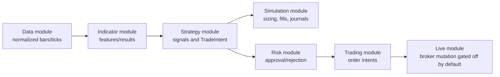
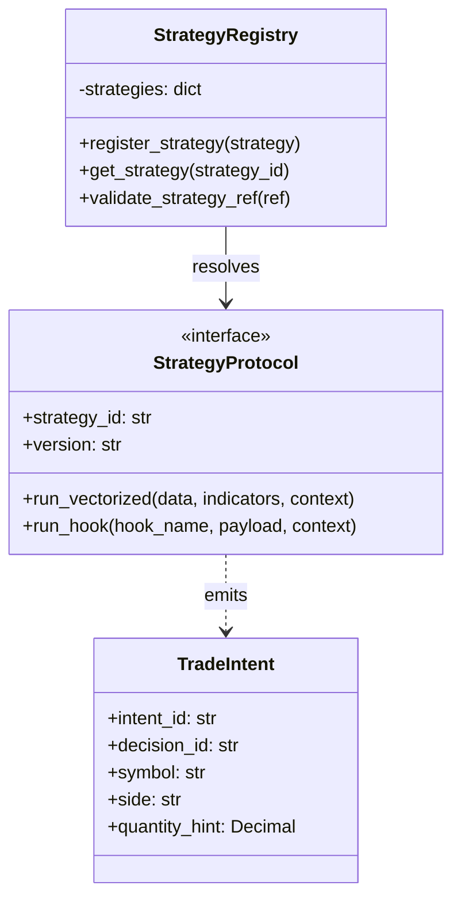

# 04-strategy.md - Requirements

## 1. Purpose

The strategy module is a side-effect-free decision layer: `(market data, indicators, configuration, read-only state) -> (TradeIntent objects, diagnostics, strategy-local state checkpoint)`. It does not execute orders, manage accounts, mutate broker or portfolio state, or enforce official portfolio, risk, compliance, venue, deployment, or disaster-recovery rules.

The module may attach metadata about external domains to decisions and diagnostics, but it never enforces rules, mutates state, or performs actions belonging to those domains.

### 1.1 Assumptions and resolved decisions

- [X] [REQ-STRAT-436] Strategy implementations target Python.
- [X] [REQ-STRAT-437] Official execution remains owned by the simulation module.
- [X] [REQ-STRAT-438] Indicator calculations are owned by the indicator module.
- [X] [REQ-STRAT-439] Data normalization and source-readiness rules are owned by the data module.
- [X] [REQ-STRAT-440] Technology stack version constraints shall be explicit for production-eligible strategy execution.
- [X] [REQ-STRAT-441] Third-party service dependencies shall be declared before production-eligible strategy execution.
- [X] [REQ-STRAT-442] Capacity assumptions shall include maximum supported symbols and maximum concurrent strategies.
- [X] [REQ-STRAT-443] Assumption: This document remains a domain-level requirements source until the active roadmap approves Strategy implementation scope.

### 1.2 Open Questions


## 2. Ownership

### 2.1 Owns

### 2.2 Does Not Own

## 3. Global API Contracts and Configuration

### 3.1 Public Capabilities Summary
- [X] [REQ-STRAT-001] Each public capability shall document an exact Python signature before implementation begins.
- [X] [REQ-STRAT-002] Each public capability shall define versioned input and output schemas using Pydantic models, `TypedDict`, dataclasses, or an approved equivalent.
- [X] [REQ-STRAT-003] Each public capability shall include a decision table mapping every validation condition, dependency condition, lifecycle condition, timeout condition, and security condition to one deterministic error code.
- [X] [REQ-STRAT-005] Each public capability shall define precise side effects, mutation permissions, idempotency behavior, concurrency assumptions, retry behavior, and redaction behavior.
- [X] [REQ-STRAT-006] Each public capability shall define its official callable name, stability level, intended consumers, input schema, output schema, deterministic error codes, side-effect policy, idempotency behavior, and compatibility guarantees before implementation begins.
- [X] [REQ-STRAT-007] Public capabilities shall be versioned and compatibility-tested before being consumed by orchestration, simulation, risk, portfolio, audit, reporting, or API workflows.
- [X] [REQ-STRAT-008] Public capabilities shall return structured results and shall not rely on free-form logs, unmapped exceptions, or implicit global state.

### 3.3 Configuration Defaults

## 4. Module Architecture

### 4.1 Target Folder Structure

```text
app/
    __init__.py
    services/
        services/
                strategies/
                    __init__.py
                    registry.py
                    protocols.py
                    errors.py
                    vectorized.py
                    event.py
                    sandbox.py
tests/
    unit/
        app/
            services/
                services/
                        strategies/
                            test_registry.py
                            test_vectorized.py
                            test_event.py
    usage/
        app/
            services/
                services/
                        strategies/
                            test_strategy_usage.py```

### 4.2 Class Diagrams






## 5. General / Cross-Cutting Non-Functional Requirements

- [X] [REQ-STRAT-303] Strategy code shall pass the project's configured type checker, expose public interfaces with docstrings or generated API documentation, avoid nondeterministic decision inputs except simulation-provided seeded randomness, and include linked unit or contract tests for each public strategy behavior.
- [X] [REQ-STRAT-304] Strategy APIs shall remain separate from simulation execution services.
- [X] [REQ-STRAT-305] Strategies shall use indicator module contracts for indicator-derived inputs.
- [X] [REQ-STRAT-306] Strategies shall use data module contracts for normalized market data.
- [X] [REQ-STRAT-308] Strategies shall not perform production `print()` output.
- [X] [REQ-STRAT-309] Strategy imports shall be side-effect safe and shall not perform broker calls, network access, filesystem writes, subprocess execution, environment mutation, or decision-time clock/randomness reads.
- [X] [REQ-STRAT-314] Provisional v1.0 baseline: performance tests shall define reference hardware, operating system, Python version, dependency versions, dataset size, strategy type, and measurement method before targets are accepted in CI.
- [X] [REQ-STRAT-316] Strategy diagnostics shall enforce redaction, maximum payload size, and structured schema validation.
- [X] [REQ-STRAT-317] Strategy APIs shall remain backward compatible within a major interface version.
- [X] [REQ-STRAT-318] Strategy modules shall be deterministic under repeated execution with the same seed, inputs, configuration, indicator outputs, and environment policy.
- [X] [REQ-STRAT-321] `MULTIPROCESS_ISOLATED` strategies shall define serialization, timeout, cancellation, restart, and resource-limit behavior.
- [X] [REQ-STRAT-322] Randomized strategies shall use only the approved simulation-provided seeded randomness interface; direct use of process-global randomness is prohibited unless explicitly wrapped by that interface.
- [X] [REQ-STRAT-323] Strategy dependency calls to data, indicator, simulation, or read-only state providers shall define timeout, retry/no-retry, stale result, partial failure, and exception mapping behavior.

### 5.1 Other Global and Cross-Cutting Requirements

- [X] [REQ-STRAT-009] Public schema changes shall require a schema-version change and compatibility review.
- [X] [REQ-STRAT-010] Error examples and diagnostics examples shall include `schema_version`, `request_id`, and `correlation_id`.
- [X] [REQ-STRAT-023] The strategy module shall live under `app/services/strategies/`.
- [X] [REQ-STRAT-024] Strategies shall produce decisions, signals, trade intents, or strategy state updates.
- [X] [REQ-STRAT-025] Strategies shall not directly mutate official account, order, deal, position, pending-order, margin, equity, journal, or execution timestamp state.
- [X] [REQ-STRAT-027] Strategies shall not finalize official order volume, margin acceptance, execution price, fill status, or risk approval.
- [X] [REQ-STRAT-028] Official execution, matching, accounting, journal, reporting, and production-realism classification shall remain owned by `app/services/simulation/`.
- [X] [REQ-STRAT-034] Martingale, grid, pyramiding, basket recovery, and trade-decomposition strategies shall execute through the canonical simulation tick engine.
- [X] [REQ-STRAT-035] Advanced strategies shall query the simulation engine for actual fills, remaining volume, average price, and open exposure through approved read-only interfaces.
- [X] [REQ-STRAT-036] Advanced strategies that need fills or open positions shall use `ReadOnlyExecutionStateQuery` and `ReadOnlyExecutionStateSnapshot`; direct access to official simulation, execution, account, or position state is prohibited.
- [X] [REQ-STRAT-037] Martingale level progression shall be based on confirmed deals or official position state, not submitted requests.
- [X] [REQ-STRAT-039] When `min_expected_alpha` or `max_acceptable_transaction_cost` is declared, the strategy shall evaluate the declared threshold before emitting a trade intent and shall emit a deterministic suppression diagnostic when the threshold blocks the decision.
- [X] [REQ-STRAT-041] Strategies shall emit `TradeIntent` objects instead of official orders.
- [X] [REQ-STRAT-042] `TradeIntent` objects shall include strategy id, strategy version, symbol, side, intent type, requested sizing mode or quantity hint, optional stop loss, optional take profit, optional expiration, optional rationale, and signal timestamp.
- [X] [REQ-STRAT-043] `TradeIntent` objects shall include an explicit `allow_partial_fills` boolean and `min_fill_size` parameter to guide the simulation or execution engine.
- [X] [REQ-STRAT-044] Bar-based signals shall be aligned using the configured signal timing policy before becoming executable trade intents.
- [X] [REQ-STRAT-045] The simulation engine shall transform `TradeIntent` into a sized `TradeRequest`.
- [X] [REQ-STRAT-046] The simulation engine shall execute `TradeIntent` objects only when the canonical tick loop reaches an eligible tick.
- [X] [REQ-STRAT-047] Strategies may request a sizing mode but shall not directly finalize official volume.
- [X] [REQ-STRAT-048] Strategy-generated rationales shall be preserved for compliance or audit records when provided.
- [X] [REQ-STRAT-049] The default strategy signal timing policy shall be `BAR_OPEN_PREVIOUS_CLOSE`.
- [X] [REQ-STRAT-050] At the first tick of bar `N`, strategies may use only bars up to and including fully closed bar `N-1`.
- [X] [REQ-STRAT-051] At the first tick of bar `N`, strategies shall not use current incomplete bar `N` high, low, close, volume, indicator-derived values, multi-timeframe values, or metadata derived from unavailable current-bar data.
- [X] [REQ-STRAT-052] Strategies shall enter at the first valid tick of bar `N` only when a valid trade intent is emitted from previous-closed-bar data.
- [X] [REQ-STRAT-055] Strategy tests shall cover previous-close-only behavior, shifted signals, no current-bar leakage, and first tick of new bar activation.
- [X] [REQ-STRAT-056] Strategies shall enforce point-in-time correctness for all feature and indicator lookups.
- [X] [REQ-STRAT-057] A query for data at timestamp `T` shall return only the state of the data as it was known at `T`, excluding subsequent revisions, restatements, or late-arriving ticks.
- [X] [REQ-STRAT-058] Strategies shall declare `max_data_latency_tolerance`.
- [X] [REQ-STRAT-059] Data arriving outside the declared latency tolerance shall cause the strategy to skip the decision or emit `STRATEGY_STALE_DATA`.
- [X] [REQ-STRAT-077] `run_backtest` shall not execute arbitrary user-provided Python code strings.
- [X] [REQ-STRAT-079] Phase 1 strategy execution shall allow registered strategies and validated configuration only.
- [X] [REQ-STRAT-083] Raw strategy-code injection attempts shall be rejected before execution.
- [X] [REQ-STRAT-084] Rejected raw strategy-code input shall return `SIM_ARBITRARY_CODE_REJECTED`.
- [X] [REQ-STRAT-085] Rejected strategy-injection attempts shall be journaled without logging unsafe code bodies in full.
- [X] [REQ-STRAT-086] Rejected strategy-input diagnostics shall include request id, strategy identifier when present, rejection reason, and deterministic error code.
- [X] [REQ-STRAT-087] Approved strategy code shall still be protected by resource controls for CPU time, recursion depth, loop iterations where measurable, memory growth, checkpoint size, diagnostic size, and dependency call timeouts.
- [X] [REQ-STRAT-088] Resource exhaustion by sanctioned strategy code, sanctioned indicator calls, or sanctioned data access shall fail deterministically with `STRATEGY_RESOURCE_LIMIT_EXCEEDED` or a more specific approved error code.
- [X] [REQ-STRAT-089] Strategies may maintain decision state only.
- [X] [REQ-STRAT-090] Strategy decision state shall be serializable when checkpoint or replay workflows require it.
- [X] [REQ-STRAT-091] Strategy state checkpoints shall not include secrets or unrestricted raw proprietary strategy source.
- [X] [REQ-STRAT-092] Strategy replay shall use strategy id, strategy version, configuration hash, data checksum, indicator result manifest, and simulation config hash.
- [X] [REQ-STRAT-093] The same strategy id, version, configuration, input data, indicator outputs, and simulation seed shall produce the same trade intents.
- [X] [REQ-STRAT-096] Concurrent strategy instances shall not share mutable strategy-local state unless an approved synchronization contract exists.
- [X] [REQ-STRAT-097] Strategies may maintain decision state but shall not mutate official trading state.
- [X] [REQ-STRAT-099] Bar-open trading must use previous closed-bar data by default.
- [X] [REQ-STRAT-101] Advanced stateful strategies and agent-generated strategies shall provide decision rationale when required by compliance configuration.
- [X] [REQ-STRAT-102] Strategy security rejections must be journaled with safe redaction.
- [X] [REQ-STRAT-103] Strategy identifiers, configuration hashes, and version hashes must be included in replay and audit metadata.
- [X] [REQ-STRAT-104] Registered strategy identifier.
- [X] [REQ-STRAT-105] Strategy version or version constraint.
- [X] [REQ-STRAT-106] Validated strategy configuration.
- [X] [REQ-STRAT-107] Indicator specifications or precomputed indicator outputs.
- [X] [REQ-STRAT-108] Normalized market data.
- [X] [REQ-STRAT-109] Symbol metadata.
- [X] [REQ-STRAT-110] Signal timing policy.
- [X] [REQ-STRAT-113] Timestamped `TradeIntent` objects.
- [X] [REQ-STRAT-114] Strategy diagnostics.
- [X] [REQ-STRAT-115] Strategy rationale where provided.
- [X] [REQ-STRAT-116] Strategy state checkpoint where enabled.
- [X] [REQ-STRAT-117] Strategy manifest containing strategy id, version, configuration hash, required indicators, required data, and timing policy.
- [X] [REQ-STRAT-118] Structured error result with deterministic error code on failure.
- [X] [REQ-STRAT-119] `TradeIntent` schema shall define required fields, optional fields, enum values, precision rules, nullability, serialization format, and schema version.
- [X] [REQ-STRAT-120] Registered strategies shall have one lifecycle status: `DRAFT`, `RESEARCH`, `BACKTEST_APPROVED`, `PAPER_APPROVED`, `LIVE_ELIGIBLE`, `DEPRECATED`, or `REVOKED`.
- [X] [REQ-STRAT-121] A strategy shall not execute in an environment higher than its approved lifecycle status.
- [X] [REQ-STRAT-122] Promotion between lifecycle states shall require recorded evidence, including test results, validation report, owner approval, and risk approval where applicable.
- [X] [REQ-STRAT-123] Material strategy changes shall require a new immutable strategy version.
- [X] [REQ-STRAT-124] Deprecated or revoked strategies shall fail deterministically before execution unless explicitly run in historical replay mode.
- [X] [REQ-STRAT-126] Registered strategies shall declare a strategy-level risk profile.
- [X] [REQ-STRAT-127] The risk profile shall include maximum gross exposure, maximum net exposure, maximum symbol exposure, maximum intent notional, maximum intent frequency, maximum concurrent positions, maximum pyramiding depth, maximum martingale level, and maximum grid depth where applicable.
- [X] [REQ-STRAT-128] Strategy risk declarations shall be advisory inputs to the simulation or risk engine and shall not replace official risk approval.
- [X] [REQ-STRAT-129] Strategies may self-suppress trade intents when strategy-local risk limits are breached.
- [X] [REQ-STRAT-130] The simulation or risk engine shall remain the final authority for official risk acceptance or rejection.
- [X] [REQ-STRAT-131] Risk-limit breaches shall produce deterministic diagnostics and audit metadata.
- [X] [REQ-STRAT-132] Strategy risk profiles shall include concentration risk limits where applicable.
- [X] [REQ-STRAT-133] Strategy risk profiles shall include time-based exposure limits where applicable.
- [X] [REQ-STRAT-134] Strategy risk profiles shall declare gap risk assumptions.
- [X] [REQ-STRAT-136] Every `TradeIntent` shall include a deterministic `intent_id`.
- [X] [REQ-STRAT-138] Every `TradeIntent` shall include an idempotency key.
- [X] [REQ-STRAT-139] Child intents shall include `parent_intent_id` when created from decomposition, scale-in, scale-out, recovery, or basket logic.
- [X] [REQ-STRAT-140] Trade intents shall include a monotonically increasing strategy-local sequence number.
- [X] [REQ-STRAT-141] Duplicate `intent_id` or idempotency key collisions shall fail deterministically.
- [X] [REQ-STRAT-142] Superseded, cancelled, expired, or replaced intents shall preserve lineage to the original intent.
- [X] [REQ-STRAT-143] Strategies shall not emit executable trade intents until required indicators are warm and ready.
- [X] [REQ-STRAT-144] Indicator readiness shall include warmup period, minimum sample count, NaN policy, and dependency readiness.
- [X] [REQ-STRAT-145] Strategies shall declare their missing-data policy: reject, forward-fill, interpolate, skip signal, or use module default.
- [X] [REQ-STRAT-146] Strategies shall declare their stale-data policy.
- [X] [REQ-STRAT-147] Strategies shall declare whether they require bid, ask, mid, last, volume, spread, session metadata, corporate-action-adjusted prices, or raw prices.
- [X] [REQ-STRAT-148] Multi-timeframe indicators shall be usable only when the higher-timeframe bar is fully closed as of the strategy decision timestamp.
- [X] [REQ-STRAT-149] Strategy execution shall fail deterministically if required market data fields are missing, stale, out of order, duplicated, or timezone-inconsistent unless an explicit approved policy handles them.
- [X] [REQ-STRAT-150] Strategy execution shall emit structured diagnostics, not free-form logs.
- [X] [REQ-STRAT-151] Diagnostics shall include run id, strategy id, strategy version, configuration hash, data checksum, decision timestamp, signal timestamp, intent id, decision id, and error code where applicable.
- [X] [REQ-STRAT-153] Strategy diagnostics shall support debug mode without exposing secrets, proprietary source, unsafe code bodies, or excessive market-data payloads.
- [X] [REQ-STRAT-154] Strategy execution shall support trace correlation across data, indicator, strategy, simulation, and reporting modules.
- [X] [REQ-STRAT-155] Parameter optimization shall produce a validation artifact.
- [X] [REQ-STRAT-156] Validation artifacts shall include parameter search space, objective function, training period, validation period, test period, data checksum, transaction-cost assumptions, slippage assumptions, and random seed.
- [X] [REQ-STRAT-157] Strategy validation shall include in-sample and out-of-sample results.
- [X] [REQ-STRAT-158] Strategy validation shall include walk-forward or rolling-window analysis where applicable.
- [X] [REQ-STRAT-159] Strategy validation shall include transaction-cost sensitivity and slippage sensitivity.
- [X] [REQ-STRAT-160] Strategy validation shall include market-regime analysis where applicable.
- [X] [REQ-STRAT-161] Strategy validation shall reject or flag configurations whose performance depends on future data, unclosed bars, unapproved survivorship-biased data, or unapproved parameter leakage.
- [X] [REQ-STRAT-162] Optimized configurations shall be immutable and hash-addressed before simulation or production replay.
- [X] [REQ-STRAT-163] Strategies shall declare expected computational complexity or supported maximum input size where applicable.
- [X] [REQ-STRAT-164] Strategies shall declare their concurrency model: `SYNC_BLOCKING`, `ASYNC_AWAIT`, or `MULTIPROCESS_ISOLATED`.
- [X] [REQ-STRAT-165] Strategy execution shall have configurable per-decision latency budgets.
- [X] [REQ-STRAT-166] Strategy execution shall have configurable memory limits.
- [X] [REQ-STRAT-167] Strategy state checkpoint size shall be bounded and monitored.
- [X] [REQ-STRAT-169] Strategies shall not instantiate unbounded caches, memoization dictionaries, or rolling window arrays without explicit maximum size limits and eviction behavior.
- [X] [REQ-STRAT-172] Strategy behavior under timeout shall be deterministic.
- [X] [REQ-STRAT-173] Performance regression tests shall verify strategy latency and memory remain within approved budgets.
- [X] [REQ-STRAT-174] Registered strategy artifacts shall be immutable after approval.
- [X] [REQ-STRAT-176] Strategy artifacts shall be produced by an approved build pipeline.
- [X] [REQ-STRAT-177] Strategy artifacts shall pass type checking, linting, unit tests, contract tests, security scans, and dependency vulnerability checks before approval.
- [X] [REQ-STRAT-178] Strategy artifacts shall include an SBOM where production packaging requires it.
- [X] [REQ-STRAT-179] Strategy dependency versions shall be pinned for replayable execution.
- [X] [REQ-STRAT-180] Strategy approval shall be invalidated if the source hash, artifact hash, dependency hash, or build provenance changes.
- [X] [REQ-STRAT-181] A strategy failure shall not corrupt official simulation state.
- [X] [REQ-STRAT-182] Strategy failures shall be isolated to the failing strategy instance unless configured fail-fast behavior requires run termination.
- [X] [REQ-STRAT-183] The orchestration layer shall support deterministic failure policies: `FAIL_RUN`, `DISABLE_STRATEGY`, `SKIP_DECISION`, or `QUARANTINE_INSTANCE`.
- [X] [REQ-STRAT-184] Strategy state checkpoint restore shall validate strategy id, version, configuration hash, state schema version, and checkpoint checksum.
- [X] [REQ-STRAT-185] Corrupt, incompatible, or unauthorized checkpoints shall fail deterministically before execution.
- [X] [REQ-STRAT-187] Strategies shall support an external asynchronous hard kill signal from the orchestration layer.
- [X] [REQ-STRAT-188] A hard kill signal shall immediately halt execution, cancel pending intents, and dump state according to the approved emergency policy.
- [X] [REQ-STRAT-189] Upon receiving a hard kill signal, the strategy shall emit a final `STRATEGY_HARD_KILLED` diagnostic with the last known safe state checkpoint.
- [X] [REQ-STRAT-190] Strategies shall declare permitted environments: `BACKTEST`, `REPLAY`, `PAPER`, `SHADOW`, or `LIVE`.
- [X] [REQ-STRAT-192] Paper or live execution eligibility shall require successful completion of configured validation gates.
- [X] [REQ-STRAT-193] Live execution shall require explicit approval, expiry, rollback plan, monitoring plan, and emergency disable procedure.
- [X] [REQ-STRAT-194] Environment-specific configuration differences shall be explicit, hash-addressed, and audit-recorded.
- [X] [REQ-STRAT-195] Strategy interface versions shall follow explicit compatibility rules.
- [X] [REQ-STRAT-197] Deprecated strategy APIs shall include removal version, migration guidance, and compatibility test coverage.
- [X] [REQ-STRAT-198] Strategy replay shall use the exact interface version active at the time of original execution unless an approved migration exists.
- [X] [REQ-STRAT-199] Strategies shall not use wall-clock time, system randomness, network state, filesystem state, or environment variables as decision inputs.
- [X] [REQ-STRAT-200] Randomized strategies shall use only simulation-provided seeded randomness.
- [X] [REQ-STRAT-202] Price, volume, and quantity comparisons shall follow approved precision and rounding rules.
- [X] [REQ-STRAT-203] Floating-point tolerance rules shall be explicit in tests.
- [X] [REQ-STRAT-204] Every production-eligible strategy shall include a runbook.
- [X] [REQ-STRAT-205] The runbook shall document expected behavior, configuration parameters, known failure modes, monitoring metrics, disable procedure, replay procedure, and owner escalation path.
- [X] [REQ-STRAT-206] Strategies shall declare their execution assumptions, including fill model, latency model, and market impact model.
- [X] [REQ-STRAT-207] Trade intents shall specify acceptable execution algorithms, such as `TWAP`, `VWAP`, or `ICEBERG`, where applicable.
- [X] [REQ-STRAT-208] Strategies shall declare maximum permissible spread for execution.
- [X] [REQ-STRAT-209] Strategies shall declare minimum volume requirements and maximum volume participation rates.
- [X] [REQ-STRAT-210] Dark pool, auction, and alternative venue eligibility shall be explicitly declared.
- [X] [REQ-STRAT-211] Strategies shall declare one deterministic policy for each halt-like market state: `SUPPRESS_NEW_INTENTS`, `ALLOW_REDUCE_ONLY`, `CLOSE_INTENTS_ONLY`, or `NO_SPECIAL_HANDLING`.
- [X] [REQ-STRAT-212] The selected halt-like market-state policy shall be included in strategy diagnostics when such a market state affects a decision.
- [X] [REQ-STRAT-213] Fill probability models shall account for queue position and adverse selection where applicable.
- [X] [REQ-STRAT-214] Strategies shall declare interaction modes: `INDEPENDENT`, `COOPERATIVE`, or `PORTFOLIO_AWARE`.
- [X] [REQ-STRAT-215] Strategies shall declare portfolio-interaction assumptions and optional strategy-local exposure preferences.
- [X] [REQ-STRAT-216] Portfolio-level gross and net exposure enforcement shall remain owned by the portfolio or risk module.
- [X] [REQ-STRAT-217] Strategy-level capital allocation assumptions and position-sizing preferences shall be metadata for portfolio or risk consumers, not official allocation enforcement.
- [X] [REQ-STRAT-218] Strategies may declare conflict-priority hints, but cross-strategy conflict resolution shall remain owned by portfolio, risk, or orchestration modules.
- [X] [REQ-STRAT-219] Correlation-aware position-limit assumptions shall be declared where applicable.
- [X] [REQ-STRAT-220] Strategy turn-off and onboarding runbook metadata shall describe existing-position assumptions; official position handling shall remain owned by trading, risk, portfolio, live, or simulation modules.
- [X] [REQ-STRAT-221] Strategy health checks shall be defined for signal generation frequency, decision staleness, and data freshness.
- [X] [REQ-STRAT-222] Strategies shall declare circuit-breaker inputs, expected trigger diagnostics, and safe-disable behavior; circuit-breaker enforcement shall remain owned by orchestration, risk, live, or operations modules.
- [X] [REQ-STRAT-223] Strategies shall declare graduated-deployment eligibility metadata and rollback assumptions; deployment progression and rollback enforcement shall remain owned by deployment or operations modules.
- [X] [REQ-STRAT-224] Strategy performance metadata shall declare expected review bands for supplied analytics, but these bands shall not become approved risk thresholds or promotion rules until owner/governance approval records them.
- [X] [REQ-STRAT-225] Strategies shall emit or expose drift-detection diagnostics where applicable; alert routing remains owned by observability or operations modules.
- [X] [REQ-STRAT-226] Canary-analysis metadata shall describe expected paper/live consistency checks; official comparison and promotion decisions remain owned by analytics, risk, live, or governance modules.
- [X] [REQ-STRAT-227] Strategies shall declare applicable regulatory regimes, such as `SEC`, `ESMA`, or `FCA`, where applicable.
- [X] [REQ-STRAT-228] Position-limit and reporting assumptions by jurisdiction shall be declared where applicable; official regulatory reporting and limit enforcement remain owned by compliance, risk, portfolio, or reporting modules.
- [X] [REQ-STRAT-230] Market manipulation safeguards shall prohibit spoofing, layering, marking the close, and equivalent manipulative behavior.
- [X] [REQ-STRAT-231] Strategy audit metadata shall preserve intent creation and decision rationale references; official sizing, execution, fill, and regulatory audit records remain owned by trading, simulation, live, audit, or reporting modules.
- [X] [REQ-STRAT-232] Best-execution and venue-analysis assumptions shall be declared where applicable; official venue analysis remains owned by execution, compliance, or reporting modules.
- [X] [REQ-STRAT-233] Large-position reporting assumptions shall be documented where applicable; official reporting threshold enforcement remains external to the strategy module.
- [X] [REQ-STRAT-234] Strategies shall declare maximum permissible data gaps before entering safe mode.
- [X] [REQ-STRAT-235] Dividend, split, and corporate action handling procedures shall be specified.
- [X] [REQ-STRAT-236] Strategies shall declare startup data-readiness requirements for completeness, expected ranges, and consistency checks; validation enforcement remains owned by data, orchestration, or simulation modules.
- [X] [REQ-STRAT-237] Strategies shall declare behavior when the data layer reports cross-venue price deviation, degraded data quality, failover, or unavailable data.
- [X] [REQ-STRAT-238] Strategies shall declare delisted-symbol assumptions and safe behavior; official position liquidation procedures remain owned by trading, risk, live, portfolio, or operations modules.
- [X] [REQ-STRAT-239] Data vendor failover orchestration shall remain owned by the data or operations module.
- [X] [REQ-STRAT-240] Strategy decision latency SLOs shall be defined by environment, including P50, P95, and P99 targets.
- [X] [REQ-STRAT-241] Signal generation throughput minimums shall be defined for expected market conditions.
- [X] [REQ-STRAT-242] Recovery time objectives shall be defined for strategy restarts and failovers.
- [X] [REQ-STRAT-243] Recovery point objectives shall be defined for strategy state.
- [X] [REQ-STRAT-244] Resource utilization limits shall include CPU, memory, and network bandwidth budgets.
- [X] [REQ-STRAT-245] Graceful degradation procedures shall be defined for overload conditions.
- [X] [REQ-STRAT-246] Strategies shall define calibration frequency and trigger conditions.
- [X] [REQ-STRAT-247] Parameter stability analysis shall cover different market regimes.
- [X] [REQ-STRAT-248] Sensitivity analysis shall include approved parameter perturbation bands, including plus or minus 10% and plus or minus 20% where applicable.
- [X] [REQ-STRAT-249] Minimum training data period requirements and regime representation shall be defined.
- [X] [REQ-STRAT-250] Overfitting detection criteria and automated strategy retirement procedures shall be defined.
- [X] [REQ-STRAT-251] Ensemble and model averaging policies shall be defined for production strategies where applicable.
- [X] [REQ-STRAT-252] Strategies shall declare assumptions for backup execution venues where applicable; backup venue failover enforcement remains owned by execution, live, or operations modules.
- [X] [REQ-STRAT-253] Strategy-local state checkpoint and restore assumptions shall be defined for primary and backup instances.
- [X] [REQ-STRAT-254] Maximum tolerable strategy-local state loss and decision staleness shall be declared.
- [X] [REQ-STRAT-255] Communication metadata for strategy degradation shall identify owner escalation paths; incident communications remain owned by operations.
- [X] [REQ-STRAT-256] Market closure and early close strategy behavior shall be declared.
- [X] [REQ-STRAT-257] Emergency position liquidation assumptions may be documented, but official liquidation procedures and responsible-party approval remain owned by trading, risk, live, portfolio, compliance, or operations modules.
- [X] [REQ-STRAT-258] Strategy performance review cadence and responsible parties shall be defined.
- [X] [REQ-STRAT-259] Automated performance attribution shall distinguish alpha, market exposure, and style factor contributions where applicable.
- [X] [REQ-STRAT-260] Strategy improvements shall support an A/B testing framework where applicable.
- [X] [REQ-STRAT-261] Shadow testing requirements shall be satisfied before production promotion.
- [X] [REQ-STRAT-262] Kill criteria shall define objective rules for permanent strategy decommissioning.
- [X] [REQ-STRAT-263] Post-mortem documentation shall be required for strategy failures.
- [X] [REQ-STRAT-264] Strategy intellectual property classification and protection measures shall be documented.
- [X] [REQ-STRAT-265] Third-party dependency licensing compliance shall be verified.
- [X] [REQ-STRAT-266] Data vendor agreement compliance checks shall be performed where applicable.
- [X] [REQ-STRAT-267] Strategy descriptions shall be available for regulatory filings where applicable.
- [X] [REQ-STRAT-268] Material change notification procedures to stakeholders shall be documented.
- [X] [REQ-STRAT-269] Strategy documentation retention periods shall be defined for regulatory inquiries.
- [X] [REQ-STRAT-271] Model artifacts shall be serialized in standardized, language-agnostic formats such as `ONNX` or `PMML` where possible.
- [X] [REQ-STRAT-272] Strategies shall declare any dependency on a feature store.
- [X] [REQ-STRAT-273] Feature lookups shall be validated against the strategy's declared point-in-time correctness policy.
- [X] [REQ-STRAT-274] ML-based strategies shall implement concept drift and data drift detection where applicable.
- [X] [REQ-STRAT-275] Strategies shall emit `STRATEGY_DRIFT_DETECTED` when input feature distributions or model prediction confidence deviate beyond approved statistical thresholds.
- [X] [REQ-STRAT-276] Strategies shall be prohibited from containing hardcoded secrets, API keys, or credentials.
- [X] [REQ-STRAT-277] Strategies requiring external configuration secrets shall request them through an approved read-only secrets manager interface injected at runtime by the orchestration layer.
- [X] [REQ-STRAT-278] Strategies shall not log, serialize, checkpoint, or expose secrets in diagnostics, rationale, manifests, or state snapshots.
- [X] [REQ-STRAT-280] Strategies using Level 2 or Level 3 data shall declare their maximum supported order book depth.
- [X] [REQ-STRAT-282] Strategies may annotate intents with declared maximum volume participation assumptions for visible order book data at the decision timestamp; official sizing validation remains owned by risk, trading, simulation, or live execution modules.
- [X] [REQ-STRAT-284] Strategies shall define deterministic behavior when order book data is crossed, locked, stale, incomplete, or outside the declared supported depth.
- [X] [REQ-STRAT-285] Each requirement shall be traceable to a specific test case id where implementation is required.
- [X] [REQ-STRAT-286] Major design-choice requirements shall be traceable to an Architecture Decision Record.
- [X] [REQ-STRAT-287] The strategy domain requirements document shall be versioned using Semantic Versioning.
- [X] [REQ-STRAT-288] Breaking changes to strategy interfaces shall require a major document version bump and a documented migration guide.
- [X] [REQ-STRAT-289] A strategy shall not be considered production-ready until it passes applicable testing, validation, and runbook requirements.
- [X] [REQ-STRAT-290] Production-ready strategy approval shall require sign-off from the Quant Research Lead and Engineering Lead, or their approved delegates.
- [X] [REQ-STRAT-291] Strategies shall follow a standard processing anatomy: data input, indicator calculation, signal generation, timing alignment, trade intent creation, and simulation execution.
- [X] [REQ-STRAT-297] Hook inputs and outputs shall be typed and schema-documented.
- [X] [REQ-STRAT-298] Strategy hooks shall return only approved strategy outputs, including decisions, diagnostics, state updates, or `TradeIntent` objects.
- [X] [REQ-STRAT-299] Strategy hooks shall not mutate official simulation, execution, account, order, position, journal, or reporting state directly.
- [X] [REQ-STRAT-301] Required and optional hooks shall be explicitly declared by strategy type.
- [X] [REQ-STRAT-302] Unsupported hooks for a strategy type shall fail deterministically or be ignored according to the approved interface contract.
- [X] [REQ-STRAT-324] Unknown strategy id shall fail before execution.
- [X] [REQ-STRAT-325] Empty strategy identifier shall fail before execution with a deterministic validation error.
- [X] [REQ-STRAT-326] Unapproved strategy module shall fail before execution.
- [X] [REQ-STRAT-327] Invalid strategy configuration schema shall fail before execution.
- [X] [REQ-STRAT-329] Unknown configuration fields shall be rejected or ignored according to an explicit schema policy.
- [X] [REQ-STRAT-330] Unsupported strategy version or unsatisfiable version constraint shall fail before execution.
- [X] [REQ-STRAT-333] Raw arbitrary Python strategy code strings shall be rejected before execution.
- [X] [REQ-STRAT-335] Unsafe rejected code bodies shall not be logged in full.
- [X] [REQ-STRAT-336] Empty market-data input shall produce `STRATEGY_DATA_NOT_READY` or a more specific deterministic error.
- [X] [REQ-STRAT-337] Data-service timeout, unavailable dependency, broken connection, or network partition shall produce `STRATEGY_DATA_NOT_READY` after the approved retry/no-retry policy is exhausted.
- [X] [REQ-STRAT-338] Indicator module timeout, unavailable dependency, broken connection, or unhandled indicator exception shall map to `INDICATOR_MODULE_ERROR` with original exception details redacted.
- [X] [REQ-STRAT-339] Partial data degradation shall follow the strategy's declared missing-data policy: `reject` suppresses all intents, `skip signal` suppresses affected symbols, and any degraded subset execution shall emit `STRATEGY_DATA_QUALITY_GATE_FAILED` diagnostics naming omitted symbols without exposing private payloads.
- [X] [REQ-STRAT-340] Timezone-naive, DST-ambiguous, or timezone-inconsistent data shall fail unless an approved normalization policy exists.
- [X] [REQ-STRAT-341] Clock drift beyond the approved tolerance between strategy runtime, data feed, indicator outputs, or simulation clock shall fail closed with `STRATEGY_STALE_DATA`, checkpoint abort, or a more specific approved error code.
- [X] [REQ-STRAT-343] Duplicate, out-of-order, stale, revised, or late-arriving ticks shall follow the declared data policy.
- [X] [REQ-STRAT-344] Strategy hook timeout shall return `STRATEGY_TIMEOUT` and follow the configured failure policy.
- [X] [REQ-STRAT-345] Checkpoint restore with unsupported schema version, checksum mismatch, or unauthorized source shall fail before execution.
- [X] [REQ-STRAT-346] Duplicate `intent_id`, duplicate idempotency key, or non-monotonic strategy-local sequence number shall fail deterministically.
- [X] [REQ-STRAT-348] Attempted secret exposure in diagnostics, checkpoints, manifests, or rationale shall fail redaction validation.
- [X] [REQ-STRAT-350] Concurrent read-only state snapshots across multiple strategies shall define isolation level, snapshot timestamp, and behavior when official state updates during decision traversal.
- [X] [REQ-STRAT-351] `STRATEGY_INVALID_CONFIG`
- [X] [REQ-STRAT-352] `STRATEGY_NOT_FOUND`
- [X] [REQ-STRAT-353] `STRATEGY_VERSION_CONSTRAINT_UNSATISFIABLE`
- [X] [REQ-STRAT-354] `STRATEGY_DEPRECATED`
- [X] [REQ-STRAT-355] `STRATEGY_UNAPPROVED_MODULE`
- [X] [REQ-STRAT-356] `STRATEGY_SCHEMA_VALIDATION_FAILED`
- [X] [REQ-STRAT-357] `STRATEGY_UNSUPPORTED_TIMING_POLICY`
- [X] [REQ-STRAT-358] `STRATEGY_LOOKAHEAD_DETECTED`
- [X] [REQ-STRAT-359] `SIM_ARBITRARY_CODE_REJECTED`
- [X] [REQ-STRAT-361] `STRATEGY_INTERNAL_ERROR`
- [X] [REQ-STRAT-362] `STRATEGY_LIFECYCLE_NOT_APPROVED`
- [X] [REQ-STRAT-363] `STRATEGY_ENVIRONMENT_NOT_PERMITTED`
- [X] [REQ-STRAT-364] `STRATEGY_ARTIFACT_HASH_MISMATCH`
- [X] [REQ-STRAT-365] `STRATEGY_DEPENDENCY_HASH_MISMATCH`
- [X] [REQ-STRAT-366] `INDICATOR_MODULE_ERROR`
- [X] [REQ-STRAT-367] `STRATEGY_CHECKPOINT_INVALID`
- [X] [REQ-STRAT-368] `STRATEGY_CHECKPOINT_INCOMPATIBLE`
- [X] [REQ-STRAT-369] `STRATEGY_DATA_NOT_READY`
- [X] [REQ-STRAT-370] `STRATEGY_INDICATOR_NOT_READY`
- [X] [REQ-STRAT-371] `STRATEGY_MISSING_REQUIRED_DATA`
- [X] [REQ-STRAT-372] `STRATEGY_STALE_DATA`
- [X] [REQ-STRAT-373] `STRATEGY_DUPLICATE_INTENT`
- [X] [REQ-STRAT-374] `STRATEGY_RESOURCE_LIMIT_EXCEEDED`
- [X] [REQ-STRAT-375] `STRATEGY_TIMEOUT`
- [X] [REQ-STRAT-376] `STRATEGY_VALIDATION_ARTIFACT_REQUIRED`
- [X] [REQ-STRAT-377] `STRATEGY_RISK_PROFILE_REQUIRED`
- [X] [REQ-STRAT-378] `STRATEGY_CIRCUIT_BREAKER_TRIGGERED`
- [X] [REQ-STRAT-379] `STRATEGY_POSITION_LIMIT_EXCEEDED`
- [X] [REQ-STRAT-380] `STRATEGY_VOLUME_PARTICIPATION_EXCEEDED`
- [X] [REQ-STRAT-381] `STRATEGY_DATA_QUALITY_GATE_FAILED`
- [X] [REQ-STRAT-382] `STRATEGY_PERFORMANCE_DEGRADED`
- [X] [REQ-STRAT-383] `STRATEGY_DRIFT_DETECTED`
- [X] [REQ-STRAT-384] `STRATEGY_REGULATORY_LIMIT_BREACHED`
- [X] [REQ-STRAT-385] `STRATEGY_MARKET_ACCESS_REVOKED`
- [X] [REQ-STRAT-386] `STRATEGY_HARD_KILLED`
- [X] [REQ-STRAT-387] Every requirement id shall have at least one linked test id or a documented non-implementation rationale.
- [X] [REQ-STRAT-389] Every confirmed error code shall have at least one focused failure-path test that triggers the code and verifies the full response or diagnostic shape.
- [X] [REQ-STRAT-390] Every usage example shall be executable or schema-validatable as documentation test coverage.
- [X] [REQ-STRAT-391] The traceability matrix shall be tested or reviewed as an explicit pre-implementation deliverable.
- [X] [REQ-STRAT-392] Public capability tests shall verify exact Python signatures, input schema validation, output schema validation, error decision tables, side-effect rules, and batch/stream behavior.
- [X] [REQ-STRAT-393] Performance tests shall state the exact hardware/software environment, dataset size, strategy type, dependency versions, measurement method, and target thresholds used.
- [X] [REQ-STRAT-396] Strategy tests shall cover EMA trend intents, martingale recovery, decomposition child orders, and partial-fill handling.
- [X] [REQ-STRAT-397] Strategy tests shall cover previous-closed-bar signal timing and no-lookahead behavior.
- [X] [REQ-STRAT-398] Strategy tests shall verify indicator-derived signals cannot access prohibited current-bar values.
- [X] [REQ-STRAT-402] Strategy configuration tests shall verify valid schemas pass and invalid schemas fail deterministically.
- [X] [REQ-STRAT-403] AI Tool strategy security tests shall verify `run_backtest` rejects raw arbitrary Python strategy code, returns `SIM_ARBITRARY_CODE_REJECTED`, does not execute rejected code, and does not log rejected code in full.
- [X] [REQ-STRAT-404] Replay tests shall verify the same strategy id, version, configuration, input data, indicator outputs, and simulation seed produce the same trade intents.
- [X] [REQ-STRAT-405] Strategy tests shall include golden-file replay tests for emitted `TradeIntent` manifests.
- [X] [REQ-STRAT-406] Strategy tests shall include property-based tests for no-lookahead, deterministic replay, and risk-envelope invariants.
- [X] [REQ-STRAT-407] Property-based no-lookahead tests shall cover timezone offsets, DST gaps, DST overlaps, session boundaries, late-arriving data, revised bars, and multi-timeframe closure boundaries.
- [X] [REQ-STRAT-408] Strategy tests shall include fuzz tests for invalid configuration, malformed data, missing fields, duplicate ticks, out-of-order ticks, NaN indicators, and extreme prices.
- [X] [REQ-STRAT-410] Strategy tests shall include performance regression tests with approved latency and memory thresholds.
- [X] [REQ-STRAT-412] Strategy tests shall include snapshot tests verifying stable intent ids, decision ids, configuration hashes, and replay manifests.
- [X] [REQ-STRAT-413] Strategy tests shall include scenario tests for session boundaries, holidays, weekend gaps, DST transitions, spread spikes, partial fills, rejected fills, and multi-timeframe bar closure.
- [X] [REQ-STRAT-414] Strategy tests shall include mutation testing to verify that deliberate subtle corruptions to strategy logic or data inputs are caught by the test suite.
- [X] [REQ-STRAT-417] Boundary tests shall verify strategies cannot mutate official account, order, deal, position, margin, equity, journal, reporting, or execution timestamp state.
- [X] [REQ-STRAT-419] Boundary tests shall verify portfolio, compliance, disaster-recovery, deployment, and venue requirements are exposed only as declarations or metadata, not enforced inside the strategy module.
- [X] [REQ-STRAT-420] Security tests shall verify strategy imports perform no broker calls, network calls, filesystem writes, subprocess calls, environment mutation, or secret reads.
- [X] [REQ-STRAT-421] Security tests shall cover configuration-injection payloads, oversized configuration payloads, excessive nesting, excessive string lengths, and resource exhaustion through sanctioned strategy and indicator paths.
- [X] [REQ-STRAT-424] Clock-drift tests shall verify behavior when strategy, data, indicator, or simulation timestamps exceed approved tolerance.
- [X] [REQ-STRAT-426] Replay tests shall verify historical interface versions are used unless an approved migration exists.
- [X] [REQ-STRAT-428] Documentation shall include strategy input modes approved for `run_backtest`.
- [X] [REQ-STRAT-429] Documentation shall state that raw arbitrary Python strategy code is not accepted by `run_backtest`.
- [X] [REQ-STRAT-430] Documentation shall include configuration schema requirements for registered strategies.
- [X] [REQ-STRAT-432] Documentation shall describe no-lookahead strategy timing.
- [X] [REQ-STRAT-434] Documentation shall describe strategy replay metadata.
- [X] [REQ-STRAT-435] Documentation shall include public capability contracts, requirement IDs, applicability tags, acceptance criteria, and linked test IDs before Builder handoff.
- [X] [REQ-STRAT-011] Before Builder handoff, each requirement shall include a stable requirement id, priority, phase, applicability tags, owning module, acceptance criteria, and at least one linked test case id where implementation is required.
- [X] [REQ-STRAT-012] Applicability tags shall identify whether a requirement applies to `BACKTEST_CORE`, `REPLAY`, `PAPER`, `SHADOW`, `LIVE`, `ML_ONLY`, `L2_L3_ONLY`, `REGULATED_MARKET_ONLY`, or `FUTURE`.
- [X] [REQ-STRAT-013] Requirements without implementation scope shall carry an explicit `Documentation Only`, `Future`, or `Not Implemented` rationale.
- [X] [REQ-STRAT-014] Each confirmed error code shall have at least one triggering scenario and a stable diagnostic shape before implementation acceptance.
- [X] [REQ-STRAT-015] A traceability matrix shall be a required deliverable before implementation begins, not a future improvement.
- [X] [REQ-STRAT-016] Stable requirement IDs, acceptance criteria, applicability tags, and linked test IDs are required for v1.0 Builder handoff.
- [X] [REQ-STRAT-017] Strategies shall emit `TradeIntent` objects and diagnostics, not broker orders, official fills, account mutations, portfolio mutations, risk approvals, or regulatory reports.
- [X] [REQ-STRAT-018] Risk, trading, simulation, live, portfolio, compliance, reporting, data, and indicator modules shall remain the authorities for their own enforcement responsibilities.
- [X] [REQ-STRAT-019] Strategy execution shall receive read-only snapshots or approved read-only handles for external state; strategy code shall not mutate official external state directly.
- [X] [REQ-STRAT-020] Every external-module interaction shall pass through a documented contract with deterministic error mapping, timeout behavior, and redaction behavior.
- [X] [REQ-STRAT-021] Every strategy decision shall be reproducible from strategy id, strategy version, configuration hash, data checksum, indicator manifest, simulation config hash where applicable, interface version, timing policy, and seed material.
- [X] [REQ-STRAT-022] Strategy implementation scope shall be narrowed to an approved phase slice before Builder handoff.

## 6. Detailed Requirements by File

### File: app/__init__.py

#### Purpose & Scope
Contains functional, security, and testing requirements specifically assigned to `app/__init__.py`.

#### Functional Requirements
- [X] [REQ-STRAT-281] Strategies shall not assume infinite liquidity at the best bid or ask.

#### Non-Functional & Security Requirements
- [X] No file-specific non-functional requirements defined.

#### Testing & Edge Cases
- [X] No file-specific testing requirements defined.

### File: app/services/strategies/__init__.py

#### Purpose & Scope
Contains functional, security, and testing requirements specifically assigned to `app/services/strategies/__init__.py`.

#### Functional Requirements
- [X] No file-specific functional requirements defined. Foundation properties apply.

#### Non-Functional & Security Requirements
- [X] No file-specific non-functional requirements defined.

#### Testing & Edge Cases
- [X] No file-specific testing requirements defined.

### File: app/services/strategies/registry.py

#### Purpose & Scope
Contains functional, security, and testing requirements specifically assigned to `app/services/strategies/registry.py`.

#### Functional Requirements
- [X] [REQ-STRAT-038] A strategy registry entry may declare `min_expected_alpha`, `max_acceptable_transaction_cost`, both, or neither.
- [X] [REQ-STRAT-062] The module shall provide an official strategy registry.
- [X] [REQ-STRAT-063] Registered strategies shall declare strategy id, version, module path, owner, configuration schema, supported symbols or asset classes, supported timing policy, required indicators, required data, risk assumptions, and permitted execution modes.
- [X] [REQ-STRAT-064] Registered strategy identifiers shall resolve only to approved strategy modules.
- [X] [REQ-STRAT-065] Strategy configuration shall be schema-validated before execution.
- [X] [REQ-STRAT-066] Invalid strategy identifiers shall fail deterministically before simulation execution.
- [X] [REQ-STRAT-067] Invalid strategy configuration shall fail deterministically before simulation execution.
- [X] [REQ-STRAT-068] Strategy registry entries shall include version hashes for replay and audit.
- [X] [REQ-STRAT-069] Strategy files and module paths shall resolve through approved registries or allowlisted roots, not arbitrary user-supplied filesystem paths.
- [X] [REQ-STRAT-070] Duplicate strategy id/version registry entries shall fail registry validation deterministically before execution.
- [X] [REQ-STRAT-071] Strategy version constraints shall resolve deterministically to exactly one approved immutable version or fail with `STRATEGY_VERSION_CONSTRAINT_UNSATISFIABLE` before execution.
- [X] [REQ-STRAT-072] Deprecated strategies shall fail with `STRATEGY_DEPRECATED` unless explicitly run in approved historical replay mode.
- [X] [REQ-STRAT-073] Strategy configuration schemas shall define default handling, unknown-field policy, required-field policy, type-coercion policy, enum validation, and version migration behavior.
- [X] [REQ-STRAT-074] Strategy configuration validation shall reject configuration-injection patterns, including string fields that request evaluation, import, subprocess execution, filesystem access, network access, environment-variable access, template expansion, or dynamic attribute access unless a future approved sandbox contract explicitly permits them.
- [X] [REQ-STRAT-075] Strategy configuration validation shall explicitly reject `eval()`, `exec()`, dynamic `__import__`, import strings, function-object strings, and magic-method access patterns in user-provided configuration.
- [X] [REQ-STRAT-076] Strategy configuration validation shall enforce maximum payload size, maximum nesting depth, maximum string length, maximum collection length, and maximum schema-validation time before implementation acceptance.
- [X] [REQ-STRAT-125] Strategy registry entries shall include owner, reviewer, approver, approval timestamp, approval expiry, and linked validation artifact ids.
- [X] [REQ-STRAT-175] Strategy registry entries shall include source commit hash, artifact hash, package version, dependency lockfile hash, and build environment identifier.
- [X] [REQ-STRAT-191] A strategy shall not execute in an environment not declared in its registry entry.
- [X] [REQ-STRAT-196] Breaking changes to `TradeIntent`, strategy configuration schemas, event interfaces, or registry schemas shall require a version bump.
- [X] [REQ-STRAT-270] ML-based strategies shall load models exclusively from an approved, versioned model registry or approved local artifact store, not arbitrary file paths.
- [X] [REQ-STRAT-311] Provisional v1.0 baseline: event-driven strategy decision latency shall target P99 <= 10 ms per event on the approved reference environment unless a stricter registry profile is approved.
- [X] [REQ-STRAT-312] Provisional v1.0 baseline: vectorized batch strategy execution shall target P99 <= 500 ms for the approved benchmark batch profile unless a stricter registry profile is approved.
- [X] [REQ-STRAT-313] Provisional v1.0 baseline: each strategy instance shall target memory usage <= 256 MB, checkpoint size <= 10 MB, diagnostic payload <= 64 KB per decision, configuration payload <= 64 KB, and dependency call timeout <= 2 seconds unless an approved registry profile overrides the value.
- [X] [REQ-STRAT-427] Documentation shall include strategy registry behavior.

#### Non-Functional & Security Requirements
- [X] No file-specific non-functional requirements defined.

#### Testing & Edge Cases
- [X] [REQ-STRAT-328] Null or missing strategy configuration shall either apply schema defaults or fail according to the registry entry's configuration policy.
- [X] [REQ-STRAT-331] Duplicate registry entry for the same strategy id/version shall fail registry validation.
- [X] [REQ-STRAT-332] Malformed registry configuration schema shall fail registry validation with `STRATEGY_INVALID_CONFIG`.
- [X] [REQ-STRAT-399] Strategy registry tests shall verify registered strategy identifiers resolve to approved modules.
- [X] [REQ-STRAT-400] Strategy registry tests shall verify unregistered strategy identifiers are rejected.
- [X] [REQ-STRAT-401] Strategy registry tests shall verify unapproved modules are rejected.
- [X] [REQ-STRAT-411] Strategy tests shall include contract tests against data, indicator, simulation, and registry interfaces.

### File: app/services/strategies/protocols.py

#### Purpose & Scope
Contains functional, security, and testing requirements specifically assigned to `app/services/strategies/protocols.py`.

#### Functional Requirements
- [X] No file-specific functional requirements defined. Foundation properties apply.

#### Non-Functional & Security Requirements
- [X] No file-specific non-functional requirements defined.

#### Testing & Edge Cases
- [X] No file-specific testing requirements defined.

### File: app/services/strategies/errors.py

#### Purpose & Scope
Contains functional, security, and testing requirements specifically assigned to `app/services/strategies/errors.py` (which must inherit from `app/utils/errors.py` and reuse standard exception types).

#### Functional Requirements
- [X] [REQ-STRAT-DRY-01] All standard system exceptions and error codes shall be imported and reused from `app.utils.errors` to prevent duplicate declaration. Custom strategy exceptions must inherit from `app.utils.errors.Error` or `HaruQuantError`.
- [X] [REQ-STRAT-054] Strategy access to prohibited current-bar or future data shall fail with the canonical strategy-domain error code `STRATEGY_LOOKAHEAD_DETECTED`; lower-level simulation lookahead errors, if any, shall be mapped to this code before returning strategy diagnostics.
- [X] [REQ-STRAT-186] Repeated strategy errors shall trigger deterministic disablement or escalation according to configuration.
- [X] [REQ-STRAT-307] Strategies shall return safe, deterministic errors for invalid configuration or unsupported inputs.

#### Non-Functional & Security Requirements
- [X] No file-specific non-functional requirements defined.

#### Testing & Edge Cases
- [X] [REQ-STRAT-388] Every public capability shall have contract tests for valid input, invalid input, deterministic errors, idempotency, and side effects.
- [X] [REQ-STRAT-422] Error-code tests shall verify lower-level lookahead errors map to `STRATEGY_LOOKAHEAD_DETECTED` at strategy-module boundaries.
- [X] [REQ-STRAT-423] Dependency-failure tests shall verify data-layer failures map to `STRATEGY_DATA_NOT_READY` or approved data errors and indicator-layer failures map to `INDICATOR_MODULE_ERROR`.

### File: app/services/strategies/vectorized.py

#### Purpose & Scope
Contains functional, security, and testing requirements specifically assigned to `app/services/strategies/vectorized.py`.

#### Functional Requirements
- [X] [REQ-STRAT-004] Each public capability shall define whether results are returned as a single batch, iterator, stream, or async stream; `run_vectorized_strategy_signals` shall be treated as batch output until a streaming contract is explicitly approved.
- [X] [REQ-STRAT-029] The module shall support vectorized signal strategies.
- [X] [REQ-STRAT-031] Vectorized signal strategies shall compute indicators, generate signals, and convert signals to timestamped `TradeIntent` objects before simulation execution.
- [X] [REQ-STRAT-053] Vectorized signal generation shall shift current-bar conditions so that bar-open entries are based on previous closed-bar values.
- [X] [REQ-STRAT-060] If a vectorized batch detects lookahead at any element, the entire batch shall fail atomically, emit `STRATEGY_LOOKAHEAD_DETECTED`, discard intents produced by that batch, and preserve a diagnostic identifying the first failing timestamp.
- [X] [REQ-STRAT-061] A vectorized batch decision clock shall be anchored to the supplied `StrategyExecutionContext.decision_timestamp`; wall-clock elapsed time during long-running batches shall not advance decision-time semantics.
- [X] [REQ-STRAT-098] Vectorized processing is allowed only for indicator and signal generation.
- [X] [REQ-STRAT-170] CPU-bound vectorized strategies shall run in isolated worker processes when their declared execution profile is `MULTIPROCESS_ISOLATED`, when configured by orchestration, or when measured event-loop latency exceeds the approved threshold for the target environment.
- [X] [REQ-STRAT-292] Vectorized strategies shall calculate indicators in a vectorized manner where supported by the indicator module.
- [X] [REQ-STRAT-293] Vectorized strategies shall generate signals in a vectorized manner before conversion to timestamped `TradeIntent` objects.
- [X] [REQ-STRAT-294] Vectorized processing shall not bypass tick-accurate simulation execution, fill modeling, accounting, margin checks, risk checks, or journal generation.
- [X] [REQ-STRAT-300] Hook execution order shall be deterministic and documented for vectorized runs, event-driven runs, replay, checkpoint restore, and shutdown.
- [X] [REQ-STRAT-433] Documentation shall include examples for vectorized signal strategies and event-driven strategies.

#### Non-Functional & Security Requirements
- [X] No file-specific non-functional requirements defined.

#### Testing & Edge Cases
- [X] [REQ-STRAT-342] Clock drift detected during a long-running vectorized batch shall not change the batch decision timestamp; the batch shall either complete under the original timestamp or fail atomically according to the configured clock-drift policy.
- [X] [REQ-STRAT-394] Strategy tests shall cover vectorized signal strategies.

### File: app/services/strategies/event.py

#### Purpose & Scope
Contains functional, security, and testing requirements specifically assigned to `app/services/strategies/event.py`.

#### Functional Requirements
- [X] [REQ-STRAT-026] Strategies shall not directly create official fills, deals, journal events, or reports.
- [X] [REQ-STRAT-030] The module shall support stateful event strategies.
- [X] [REQ-STRAT-032] Event strategies shall respond to initialization, bar-open, tick, and trade-transaction events through controlled interfaces.
- [X] [REQ-STRAT-033] `INTRABAR_EVENT` strategies may use current tick data only through approved event interfaces.
- [X] [REQ-STRAT-040] Event strategies shall support `FILL_UPDATE` or `PARTIAL_FILL` events to react to incomplete executions through approved read-only execution-state interfaces.
- [X] [REQ-STRAT-094] Strategy-local state updates shall be atomic per decision event or shall fail with a deterministic rollback diagnostic.
- [X] [REQ-STRAT-095] Read-only external state supplied to a strategy shall be an immutable snapshot or shall carry a documented consistency model preventing races with concurrent simulation, risk, portfolio, or data updates.
- [X] [REQ-STRAT-111] Optional read-only simulation state for event strategies.
- [X] [REQ-STRAT-135] Strategy risk profiles shall declare correlation assumptions during stress events.
- [X] [REQ-STRAT-137] Every `TradeIntent` shall include a `decision_id` linking it to the strategy decision event that created it.
- [X] [REQ-STRAT-152] Strategy metrics shall include intents emitted, intents suppressed, no-signal decisions, rejected decisions, invalid data events, lookahead detections, configuration validation failures, state checkpoint size, and per-event decision latency.
- [X] [REQ-STRAT-168] Strategies shall not perform unbounded loops, unbounded recursion, unbounded memory growth, or unbounded history scans during event execution.
- [X] [REQ-STRAT-171] Event strategies shall be reentrant or explicitly marked single-threaded.
- [X] [REQ-STRAT-201] Simultaneous events shall be processed using a stable deterministic ordering policy.
- [X] [REQ-STRAT-229] Wash trade prevention rules shall be declared.
- [X] [REQ-STRAT-283] Strategies shall declare behavior during `AUCTION_PHASE`, `TRADING_HALT`, `CROSSING_SESSION`, and `BROKEN_MARKET` microstructure events.
- [X] [REQ-STRAT-295] Event strategies shall implement a standard lifecycle interface where applicable.
- [X] [REQ-STRAT-296] The standard event strategy lifecycle interface shall include hooks such as `on_init`, `on_start`, `on_bar`, `on_tick`, `on_fill_update`, `on_partial_fill`, `on_order_update`, `on_timer`, `on_error`, `on_checkpoint`, `on_restore`, and `on_stop`.
- [X] [REQ-STRAT-310] Strategy execution shall define measurable latency, memory, checkpoint-size, diagnostic-payload-size, event-queue, timeout, and retry-exhaustion limits per supported environment before implementation acceptance.
- [X] [REQ-STRAT-315] Strategy execution shall define deterministic backpressure behavior when event volume exceeds configured capacity.
- [X] [REQ-STRAT-319] `ASYNC_AWAIT` strategies shall define an approved async compatibility contract and shall not block the event loop.
- [X] [REQ-STRAT-320] `SYNC_BLOCKING` strategies shall define maximum call duration and isolation expectations before being used in shared event loops.

#### Non-Functional & Security Requirements
- [X] No file-specific non-functional requirements defined.

#### Testing & Edge Cases
- [X] [REQ-STRAT-349] Simultaneous events for a single strategy instance shall be processed in a stable documented order, such as timestamp, event type priority, then deterministic sequence number.
- [X] [REQ-STRAT-395] Strategy tests shall cover stateful event strategies.
- [X] [REQ-STRAT-409] Strategy tests shall include stress tests for large histories, many symbols, dense tick streams, and high-frequency event dispatch.
- [X] [REQ-STRAT-415] Strategy tests shall include chaos engineering scenarios, including simulated data-feed disconnections, sudden latency spikes, and out-of-order message injection during event processing.
- [X] [REQ-STRAT-416] Strategy tests shall verify memory leak detection over extended event-loop iterations and assert stable memory usage within approved thresholds.
- [X] [REQ-STRAT-418] Boundary tests shall verify strategies cannot create fills, deals, official orders, reports, or journal events directly.
- [X] [REQ-STRAT-425] Concurrency tests shall verify read-only state snapshot isolation and stable event ordering for simultaneous events.

### File: app/services/strategies/sandbox.py

#### Purpose & Scope
Contains functional, security, and testing requirements specifically assigned to `app/services/strategies/sandbox.py`.

#### Functional Requirements
- [X] [REQ-STRAT-078] The strategy input path shall accept only registered strategy identifiers, validated strategy configuration schemas, or code explicitly vetted and sandboxed by the orchestration layer.
- [X] [REQ-STRAT-080] Code-based strategy execution shall remain disabled until sandbox policy, approval workflow, and prohibited-operation lists are approved.
- [X] [REQ-STRAT-081] Sandboxed code-based strategy execution, if enabled later, shall require `simulation.admin` approval, strategy owner approval, sandbox profile id, vetting artifact hash, allowed capability list, audit record, and approval expiry.
- [X] [REQ-STRAT-082] Sandbox policy shall define allowed imports, denied imports, filesystem access, network access, subprocess access, environment-variable access, timeouts, memory limits, and prohibited operations.
- [X] [REQ-STRAT-100] Strategy execution shall occur only through registered strategies, validated schemas, or explicitly sandboxed and vetted orchestration paths.
- [X] [REQ-STRAT-112] Sandbox and vetting metadata only when code-based strategy execution is explicitly permitted.
- [X] [REQ-STRAT-279] Any attempt by a strategy to read environment variables not explicitly allowlisted in the sandbox profile shall emit `STRATEGY_ENVIRONMENT_NOT_PERMITTED`.
- [X] [REQ-STRAT-431] Documentation shall describe sandbox and vetting requirements if code-based strategy execution is ever enabled.

#### Non-Functional & Security Requirements
- [X] No file-specific non-functional requirements defined.

#### Testing & Edge Cases
- [X] [REQ-STRAT-334] Missing sandbox or vetting metadata for a code-based strategy path shall fail before execution.
- [X] [REQ-STRAT-347] Sandbox approval expiry shall cause code-based strategy execution to fail before execution.
- [X] [REQ-STRAT-360] `STRATEGY_SANDBOX_REQUIRED`

## 7. Global Testing, Quality Gates, and Usage Examples


### 7.3 Usage Examples

#### Example 1
```python
from __future__ import annotations

from datetime import datetime
from decimal import Decimal
from typing import Any, Literal

from pydantic import BaseModel, Field

StrategyEnvironment = Literal["BACKTEST", "REPLAY", "PAPER", "SHADOW", "LIVE"]
StrategySide = Literal["BUY", "SELL", "HOLD"]
StrategyIntentType = Literal["OPEN", "CLOSE", "REDUCE", "INCREASE", "NO_ACTION"]
StrategyTimingPolicy = Literal["BAR_OPEN_PREVIOUS_CLOSE", "INTRABAR_EVENT"]
ConfigUnknownFieldPolicy = Literal["REJECT", "IGNORE"]


class StrategyRefInput(BaseModel):
    schema_version: str = "strategy.ref.v1"
    strategy_id: str
    version: str | None = None
    version_constraint: str | None = None
    environment: StrategyEnvironment
    request_id: str | None = None
    correlation_id: str | None = None


class StrategyConfigInput(BaseModel):
    schema_version: str = "strategy.config.v1"
    strategy_ref: StrategyRefInput
    config: dict[str, Any]
    registry_schema_version: str
    unknown_field_policy: ConfigUnknownFieldPolicy = "REJECT"
    max_payload_bytes: int = 65536


class ReadOnlyExecutionStateQuery(BaseModel):
    schema_version: str = "strategy.read_only_state_query.v1"
    strategy_id: str
    symbol: str | None = None
    include_fills: bool = True
    include_open_positions: bool = True
    snapshot_at: datetime
    request_id: str | None = None
    correlation_id: str | None = None


class ReadOnlyExecutionStateSnapshot(BaseModel):
    schema_version: str = "strategy.read_only_state_snapshot.v1"
    snapshot_id: str
    snapshot_at: datetime
    source_module: str
    fills: list[dict[str, Any]] = Field(default_factory=list)
    open_positions: list[dict[str, Any]] = Field(default_factory=list)
    consistency_model: Literal["IMMUTABLE_SNAPSHOT"]


class StrategyExecutionContext(BaseModel):
    schema_version: str = "strategy.execution_context.v1"
    environment: StrategyEnvironment
    decision_timestamp: datetime
    timing_policy: StrategyTimingPolicy
    seed_material: str
    request_id: str
    correlation_id: str
    read_only_state: ReadOnlyExecutionStateSnapshot | None = None
    resource_budget_ref: str | None = None


class TradeIntent(BaseModel):
    schema_version: str = "strategy.trade_intent.v1"
    intent_id: str
    decision_id: str
    idempotency_key: str
    strategy_id: str
    strategy_version: str
    symbol: str
    side: StrategySide
    intent_type: StrategyIntentType
    requested_sizing_mode: str | None = None
    quantity_hint: Decimal | None = None
    signal_timestamp: datetime
    decision_timestamp: datetime
    parent_intent_id: str | None = None
    stop_loss: Decimal | None = None
    take_profit: Decimal | None = None
    expiration: datetime | None = None
    allow_partial_fills: bool = False
    min_fill_size: Decimal | None = None
    rationale_ref: str | None = None
    lineage: dict[str, str] = Field(default_factory=dict)


class StrategyDiagnostics(BaseModel):
    schema_version: str = "strategy.diagnostics.v1"
    strategy_id: str
    strategy_version: str | None = None
    request_id: str
    correlation_id: str
    decision_timestamp: datetime | None = None
    status: Literal["success", "error", "degraded", "suppressed"]
    error_code: str | None = None
    details: dict[str, Any] = Field(default_factory=dict)
    redaction_status: Literal["redacted", "not_required"]
    dependency_health: dict[str, str] = Field(default_factory=dict)
```

#### Example 2
```python
strategy_ref = {
    "strategy_id": "ema_trend_v1",
    "version": "1.0.0",
    "config": {
        "fast_ema": 20,
        "slow_ema": 50,
        "signal_timing_policy": "BAR_OPEN_PREVIOUS_CLOSE",
    },
}

# Orchestration validates the registry entry and configuration first.
# The strategy uses data + indicator contracts, then emits TradeIntent objects.
# The simulation module, not the strategy module, sizes and executes those intents.
```

#### Example 3
```python
class RecoveryStrategy:
    def on_init(self, context):
        return {"diagnostics": {"ready": True}}

    def on_bar(self, bar, indicators, read_only_state):
        return {
            "trade_intents": [
                {
                    "schema_version": "strategy.trade_intent.v1",
                    "intent_id": "strategy-recovery-2026-01-01T00:00:00Z-000001",
                    "decision_id": "decision-000001",
                    "idempotency_key": "idem-strategy-recovery-000001",
                    "strategy_id": "recovery_v1",
                    "strategy_version": "1.0.0",
                    "symbol": "EURUSD",
                    "side": "BUY",
                    "intent_type": "OPEN",
                    "requested_sizing_mode": "risk_fraction_hint",
                    "quantity_hint": None,
                    "signal_timestamp": "2026-01-01T00:00:00Z",
                    "decision_timestamp": "2026-01-01T00:00:00Z",
                    "allow_partial_fills": True,
                    "min_fill_size": "0.01",
                    "rationale_ref": "rationale-000001",
                    "lineage": {"source": "on_bar"},
                }
            ]
        }

    def on_fill_update(self, fill_event, read_only_execution_state):
        # Reacts to confirmed fills or partial fills through approved read-only state.
        return {"state_updates": {}}
```

#### Example 4
```python
result = validate_strategy_ref(
    strategy_id="ema_trend_v1",
    version_constraint=">=1.0,<2.0",
    environment="BACKTEST",
    request_id="req_example",
)

if result["status"] == "error":
    code = result["error"]["code"]
    if code in {"STRATEGY_NOT_FOUND", "STRATEGY_VERSION_CONSTRAINT_UNSATISFIABLE"}:
        # Stop before execution; callers may surface the validation error.
        raise RuntimeError(code)

execution = run_vectorized_strategy_signals(
    strategy_ref=result["data"]["strategy_ref"],
    market_data=validated_market_data,
    indicators=indicator_outputs,
    timing_policy="BAR_OPEN_PREVIOUS_CLOSE",
    context=execution_context,
)

if execution["status"] == "error" and execution["error"]["code"] == "STRATEGY_LOOKAHEAD_DETECTED":
    # Stop the run and preserve the diagnostic for review.
    raise RuntimeError("strategy attempted unavailable current-bar or future-data access")
```

## 8. Acceptance
