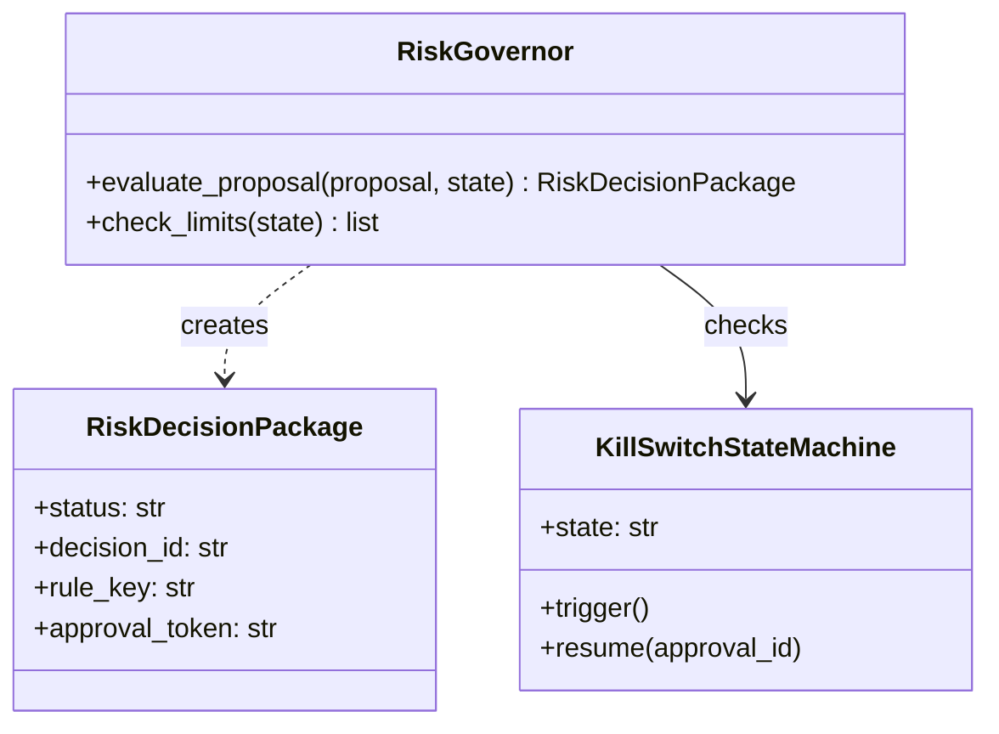

# 05-risk.md - Requirements

## 1. Purpose

The `tools/risk/` module exists to provide deterministic, production-grade risk governance for HaruQuant.

It converts portfolio, market, strategy, approval, and policy evidence into reproducible risk snapshots, sizing outputs, admission reviews, allocation reviews, scenario analyses, approval-token checks, kill-switch checks, and canonical `RiskDecisionPackage` results.

Its core purpose is to act as the safety gate between strategy intent and execution-sensitive workflows. It can approve, reject, block, request more evidence, or require approval according to deterministic policy, but it never places trades or mutates broker state.

The risk module is a deterministic policy engine with no trading authority.

Architectural axiom: In HaruQuant Risk, ambiguity is treated as a hard failure. If the system cannot prove an action is safe, it must block it.

Out of scope summary: Risk does not fetch market data, own long-term historical market data, place trades, mutate broker or execution state, render UI, or own portfolio, cost, incident, lifecycle, or broad reporting workflows.

### 1.1 Assumptions and resolved decisions

- [ ] The target module path is `tools/risk/`.
- [ ] The source document is the production requirements baseline v8.0.
- [ ] The implementation language is Python.
- [ ] The module targets Python 3.12 or newer.
- [ ] Public contracts use Pydantic V2; frozen dataclasses are limited to internal immutable calculation helpers.
- [ ] Risk thresholds and profiles are config-driven and stored under `configs/risk/*.yaml`.
- [ ] Integration dependencies are accessed through stable public interfaces.
- [ ] Market data, portfolio state, execution state, governance state, and utility services are external domains.
- [ ] `tools.execution` may provide read-only open orders/positions but shall not be mutated by risk.
- [ ] JSONL storage is permitted for local development and deterministic tests.
- [ ] PostgreSQL is required for production live audit chains, approval-token state, token revocation state, and token consumption state.
- [ ] Performance targets are measured in local deterministic mode with no remote broker/network calls unless otherwise specified.
- [ ] Risk module production readiness is requirement-first: requirement -> contract -> deterministic implementation -> unit test -> workflow test -> audit evidence -> acceptance gate.
- [ ] Governance remains externally owned by `tools/governance` or an equivalent governance service exposed through stable public interfaces.
- [ ] The production benchmark environment is `RISK_BENCHMARK_PROFILE_V1`.
- [ ] If `RISK-PEND-001` is unresolved, live-sensitive pre-trade approval shall fail closed with `PENDING_APPROVAL_DOUBLE_SPEND_BLOCKED` unless refreshed `PortfolioState` evidence includes pending orders or pending approvals.
- [ ] If `RISK-PEND-003` is unresolved, live-sensitive `high_volatility` or `crisis` regime decisions that require stressed correlation, VaR, or CVaR shall return `needs_more_evidence` or `block` rather than falling back to ordinary lookbacks.
- [ ] If `RISK-PEND-004` is unresolved, crisis-reference-dependent live decisions shall fail closed as missing evidence.
- [ ] If `RISK-PEND-005` is unresolved, historical VaR shall remain the only production-live default and non-historical parametric VaR shall require explicit profile configuration plus approval.
- [ ] If `RISK-PEND-006` is unresolved, Gaussian parametric VaR in production-live workflows shall return `needs_approval` or `block` according to profile and shall emit `PARAMETRIC_VAR_GAUSSIAN_WARNING`.
- [ ] No safe fallback for a `RISK-PEND-*` item shall remain the permanent default for more than two sprint cycles without owner/architect review and a roadmap entry.
- [ ] Source-confirmed production requirements are captured in this document unless explicitly marked Pending or Recommendation.
- [ ] Recommendations remain non-mandatory until promoted by owner or architecture decision.
- [ ] Future ambiguity shall be added as a new requirements decision item with owner, target section, and production-readiness impact instead of as an open-ended question.
- [ ] Pending: confirm whether double-spend prevention is implemented inside Risk through a pending-approvals cache or enforced externally by Execution/Governance serialization.
- [ ] Pending: confirm the exact default fractional Kelly multiplier value.
- [ ] Pending: confirm the exact stressed-lookback policy for crisis correlation, VaR, and CVaR calculations.
- [ ] Pending: confirm whether crisis-period references are configured profiles, evidence-pack inputs, or implementation fixtures.
- [ ] Pending: confirm which heavy-tailed parametric VaR distribution is supported first.
- [ ] Pending: confirm whether Gaussian parametric VaR is allowed in production-live workflows after warning or requires explicit waiver.
- [ ] Recommendation: approval tokens should include a cryptographic nonce or single-use flag for all governed workflows, not only live-sensitive workflows.
- [ ] Recommendation: token validation should record approval tokens as consumed in audit storage and reject consumed tokens on replay.
- [ ] Recommendation: scenario analysis should include broker margin-call and stop-out stress tests using adverse price moves of two to three standard deviations.

### 1.2 Open Questions


## 2. Ownership

### 2.1 Owns

### 2.2 Does Not Own

## 3. Global API Contracts and Configuration

### 3.1 Public Capabilities Summary
- [ ] Every exported symbol shall be classified as one of `official_ai_tool`, `public_python_contract`, `deterministic_service`, `internal_helper`, or `legacy_compatibility_export`.
- [ ] Symbols not listed in `tools.risk.__all__` shall be private implementation details and may change without compatibility guarantees.
- [ ] Only symbols classified as `official_ai_tool` shall be agent-callable official risk tools.
- [ ] Internal helpers shall not be agent-callable and shall not be included in the official AI tool registry.
- [ ] Legacy compatibility exports shall document replacement guidance, stability, and deprecation status when they differ from canonical tool names.
- [ ] Every official AI tool shall follow the HaruQuant AI Tool Function Standard.
- [ ] Every official AI tool shall accept `request_id: Optional[str] = None`.
- [ ] Every official AI tool shall return the standard HaruQuant tool response schema.
- [ ] No official risk tool shall place trades, close trades, mutate broker state, or override execution controls.
- [ ] Official AI tools shall call deterministic services rather than implementing risk logic inline.
- [ ] Required official tool surface shall include:
- [ ] `build_portfolio_risk_snapshot`
- [ ] `review_trade_risk`
- [ ] `calculate_position_size`
- [ ] `assess_risk_regime`
- [ ] `review_strategy_admission`
- [ ] `review_allocation_proposal`
- [ ] `create_risk_decision_package`
- [ ] `validate_risk_approval_token`
- [ ] `run_risk_scenario_analysis`
- [ ] `generate_risk_report`
- [ ] Current implementation traceability shall map the canonical official tool groups above to the present `tools.risk.__all__` export surface without treating differently named but equivalent legacy requirements as separate behavior.
- [ ] Current portfolio-state and portfolio-risk exports shall include `get_open_positions`, `get_open_orders`, `get_strategy_allocations`, `get_portfolio_equity_curve`, `calculate_portfolio_returns`, `calculate_portfolio_volatility`, `calculate_portfolio_correlation`, `calculate_portfolio_var`, `calculate_portfolio_cvar`, `calculate_risk_contribution`, `calculate_margin_usage`, `calculate_currency_exposure`, `detect_strategy_overlap`, `detect_symbol_cluster_risk`, and `build_portfolio_risk_snapshot`.
- [ ] Current shared risk tool helpers shall include `risk_tool_result`, `risk_tool_context`, `risk_business_payload`, `risk_limit_check`, `risk_policy_module`, `risk_portfolio_module`, `risk_safety_module`, and `risk_live_module`, and shall remain support helpers rather than independent trading authority.
- [ ] The current implementation support surface shall include risk request assembly through `RiskRequestAssemblyContext` and `assemble_risk_assessment_request`.
- [ ] The current implementation support surface shall include threshold/config helpers through `load_risk_thresholds`, `config_version_hash`, `validate_threshold_schema`, and `validate_config_hash`.
- [ ] The current implementation support surface shall include metric and scorecard contracts through `MetricRow`, `MetricContext`, `MetricFamily`, `RiskSnapshot`, `MetricRegistry`, `ScoreRow`, `ScoreContext`, `ScoreFamily`, `RiskScorecard`, `ScoreRegistry`, `RiskSnapshotEngine`, `RiskScorecardEngine`, and `RecommendationEngine`.
- [ ] The current implementation support surface shall include decision, signature, approval, validity, and audit helpers through `compose_risk_decision`, `pack_risk_decision_rationale_and_provenance`, `create_approval_token`, `validate_approval_token`, `stable_hash`, `sign_payload`, `invalidate_for_material_proposal_change`, `enforce_risk_decision_expiry`, and `write_risk_audit`.
- [ ] The current implementation support surface shall include reporting and persistence contracts for risk snapshots, scenario results, replay outputs, Markdown reports, JSON reports, decisions, snapshot bundles, and scenario stores.
- [ ] Portfolio-under-risk compatibility shall treat `tools.portfolio` and the `portfolio` tool category as compatibility adapters unless explicitly classified as risk-owned services.
- [ ] Portfolio-under-risk compatibility adapters shall not own source-of-truth portfolio, execution, cost, incident, governance, or broad reporting state.
- [ ] Each portfolio-under-risk compatibility adapter shall document its owning external domain, side effects, storage boundary, and failure behavior.
- [ ] Portfolio-under-risk compatibility is transitional; the long-term target is a separate `tools/portfolio` domain where Risk consumes read-only portfolio evidence and emits risk decisions through stable interfaces.
- [ ] Portfolio-under-risk lazy service resolution shall raise `AttributeError` for unknown lazy service names.
- [ ] Portfolio-under-risk compatibility shall preserve the method-level service surface for `propose`, `equal_capital`, `confidence_weighted`, `evaluate`, `trigger`, `resume`, `transition`, `audit`, `create_incident`, `report`, and `generate`.
- [ ] Transitional compatibility facades shall emit deprecation warnings or deprecation metadata in public docs, tool metadata, or runtime diagnostics where applicable.
- [ ] Transitional portfolio-under-risk facades shall be fully migrated to `tools/portfolio` or explicitly reapproved by the owner/architect no later than v2.0.
- [ ] Safe fallback compatibility facades shall not be treated as permanent architecture without owner/architect review.
- [ ] `RiskConfig` / `RiskThresholds`
- [ ] `PortfolioState`
- [ ] `PortfolioRiskSnapshot`
- [ ] `ProposedTrade`
- [ ] `ProposedAllocation`
- [ ] `RegimeAssessment`
- [ ] `ScenarioResult`
- [ ] `RiskDecisionPackage`
- [ ] `RiskApprovalToken`
- [ ] `RiskAuditRecord`
- [ ] `RiskReport`
- [ ] Shared helpers such as `risk_tool_result`, `risk_tool_context`, `risk_business_payload`, `risk_limit_check`, `risk_policy_module`, `risk_portfolio_module`, `risk_safety_module`, and `risk_live_module` shall remain support helpers and shall not be official AI tools.
- [ ] Storage repositories, token-state backend clients, audit-chain internals, policy-resolution internals, and lazy service loaders shall not be agent-callable.
- [ ] Private service internals shall not appear in `tools.risk.__all__` unless they are intentionally classified, documented, tested, and reviewed for public import.

| Transitional surface | Classification | Target owner | Handoff requirement |
|---|---|---|---|
| Governor check exports | `deterministic_service` or `legacy_compatibility_export` | Risk | Map each export to a canonical official tool or private service before Builder handoff. |
| Portfolio state/risk exports | `public_python_contract` or `legacy_compatibility_export` | Risk plus external Portfolio/Data evidence owners | Document read-only evidence ownership and replacement path. |
| Allocation service facade | `legacy_compatibility_export` | Portfolio/Governance, with Risk constraints consumed through interfaces | Keep as compatibility facade until `tools/portfolio` owns the service. |
| Cost service facade | `legacy_compatibility_export` | Cost/Observability | Keep out of core Risk ownership and document advisory/reporting behavior. |
| Incident service facade | `legacy_compatibility_export` | Incident/Governance | Keep out of core Risk ownership and document artifact/audit behavior. |
| Lifecycle service facade | `legacy_compatibility_export` | Strategy/Governance | Keep lifecycle execution external; Risk only supplies gate decisions. |
| Portfolio kill-switch facade | `legacy_compatibility_export` | Risk block state plus Execution/Governance enforcement | Risk emits block state; external authority mutates execution controls. |
| Portfolio audit/reporting facades | `legacy_compatibility_export` | Audit/Reporting | Keep broad reports external; Risk owns risk decision evidence and risk summaries. |

### 3.3 Configuration Defaults

## 4. Module Architecture

### 4.1 Target Folder Structure

```text
tools/
    __init__.py
    risk/
        __init__.py
        models.py
        governor.py
        limits.py
        sizing.py
        lifecycle.py
        kill_switch.py
        scenarios.py
tests/
    unit/
        tools/
            risk/
                test_governor.py
                test_limits.py
                test_sizing.py
                test_kill_switch.py
    usage/
        tools/
            risk/
                test_risk_usage.py
```

### 4.2 Class Diagrams



## 5. General / Cross-Cutting Non-Functional Requirements

- [ ] The risk module shall define a canonical decision-state enum containing `approve`, `warn`, `needs_approval`, `needs_more_evidence`, `reject`, `block`, and `error`.
- [ ] The risk module shall define a canonical limit-status enum containing `pass`, `warn`, `needs_more_evidence`, `fail`, and `blocked`.
- [ ] The risk module shall define Decimal precision and rounding behavior for money, volume, lot size, pips, percentages, VaR, CVaR, margin, leverage, exposure, and allocation calculations.
- [ ] Public Pydantic V2 model configuration shall set `allow_inf_nan=False` for public request, response, config, snapshot, decision, approval-token, audit, and tool contracts.
- [ ] Public JSON serialization shall preserve Decimal precision through string or another documented exact JSON-safe representation and shall not silently convert Decimal values to binary floats.
- [ ] The risk module shall expose a deterministic schema/version identifier for every public request and response contract.
- [ ] Time-sensitive contracts and services shall accept an injected time provider or explicit `now` datetime for deterministic tests, scenario replay, and audit reproduction.
- [ ] Official Risk tools shall not read local system time directly except through the approved time provider or shared Utils clock helper.
- [ ] The risk module shall produce the same `RiskDecisionPackage` for the same inputs, configuration hash, and dependency versions.
- [ ] All material decisions shall include enough metadata to reproduce the decision later.
- [ ] Randomized scenario tests, if added, shall require explicit seeds and shall report the seed used.
- [ ] Config changes shall create a new config hash visible in snapshots, decisions, approvals, and reports.
- [ ] Pre-trade risk review latency for a normal portfolio shall complete within 100 ms p95 in local deterministic mode.
- [ ] Snapshot generation for up to 500 open positions shall complete within 250 ms p95.
- [ ] Markdown report generation from a completed decision package shall complete within 1 second p95.
- [ ] Audit chain verification of 10,000 audit records shall complete within 2 seconds p95.
- [ ] The module shall support at least 500 open positions in portfolio-level calculations.
- [ ] The module shall support at least 100 strategies in allocation and concentration review.
- [ ] The module shall support at least 5,000 historical return points for VaR/CVaR calculations.
- [ ] The module shall avoid O(n³) algorithms in normal pre-trade paths unless explicitly justified.
- [ ] Benchmark results shall report hardware, Python version, dependency versions, dataset size, and warm/cold cache state.
- [ ] The module shall define maximum accepted payload sizes for public tools and return `PAYLOAD_TOO_LARGE` or `INVALID_INPUT` for oversized requests before expensive calculation begins.
- [ ] Public official Risk tools shall reject payloads larger than 1 MiB by default unless an owner-approved profile sets a lower limit.
- [ ] Public official Risk tools shall reject JSON payload nesting deeper than 10 levels by default before expensive validation or calculation begins.
- [ ] Public official Risk tools shall reject arrays or lists with more than 10,000 items by default before expensive validation or calculation begins.
- [ ] Normal pre-trade paths shall not exceed O(n^2) complexity over open positions and correlated symbols under supported portfolio sizes.
- [ ] Non-critical reporting failures shall not silently hide risk decisions.
- [ ] Audit write failure behavior shall be configurable.
- [ ] Live-readiness workflows shall fail closed when audit persistence is mandatory and unavailable.
- [ ] External dependency failure shall be represented as `needs_more_evidence`, `reject`, or `block`, never as silent success.
- [ ] Exceptions shall be mapped to deterministic error codes, which must inherit and reuse exceptions from `tools.utils.errors` to prevent duplicate declaration.
- [ ] Failures shall not be swallowed.
- [ ] The module shall define timeout behavior for governance, audit storage, token state backend, config loading, and evidence-provider calls.
- [ ] The module shall define retry and retry-exhaustion behavior for idempotent persistence and validation operations.
- [ ] Approval-token signing keys, secrets, broker credentials, and private account identifiers shall never be logged.
- [ ] Approval tokens shall be tamper-evident using HMAC or stronger signing.
- [ ] Risk tools shall declare accurate risk metadata and side-effect flags.
- [ ] Internal helpers shall not be exposed as official AI tools unless intentionally promoted through `__all__`.
- [ ] The module shall enforce least privilege: risk can approve or block readiness but cannot execute trades.
- [ ] Every material risk decision shall emit structured logs with request id, workflow id, decision status, reason codes, and execution time.
- [ ] Every material risk decision shall be serializable as an audit record.
- [ ] Audit records shall include evidence references, config hash, input summary, limit results, approval state, and final decision.
- [ ] Observability metrics shall include decision count, block count, reject count, approval-required count, latency, calculation failures, and missing-evidence events.
- [ ] Logs and audit records shall redact secrets and sensitive account data.
- [ ] Audit hash-chain verification shall complete before live-sensitive decisions when configured as mandatory.
- [ ] Hash-chain generation shall use canonical serialization and a documented hash algorithm.
- [ ] Audit-chain genesis behavior shall be deterministic and documented; genesis value shall not depend on random runtime state.
- [ ] The module shall support Python 3.12 or newer.
- [ ] The module shall use project logging and result conventions.
- [ ] The module shall use Pydantic V2 for all public request, response, config, snapshot, decision, approval-token, audit, and tool contracts.
- [ ] Frozen dataclasses may be used only for internal immutable calculation structures and shall not replace public Pydantic contracts.
- [ ] The module shall avoid unnecessary heavy dependencies in deterministic pre-trade paths.
- [ ] Public contracts shall be versioned when downstream workflows depend on them.
- [ ] Each production file shall have a clear module-level docstring and public function/class docstrings.
- [ ] Public functions shall have type hints.
- [ ] Core functions shall remain small, focused, and testable.
- [ ] Official AI tools shall not be added without tests, usage examples, metadata, and registry review.
- [ ] Public interface changes shall be versioned, documented, and reviewed before downstream workflows depend on them.
- [ ] `tools.risk.__all__` shall remain the explicit current agent-facing export registry and shall be reviewed whenever current implementation exports diverge from canonical future tool names.
- [ ] Portfolio-under-risk service classes shall be lazy-loaded so optional portfolio workflow dependencies do not break risk importability.
- [ ] Portfolio-under-risk artifacts shall not contain secrets, credentials, broker passwords, API keys, or unredacted private data.
- [ ] Portfolio-under-risk reports shall distinguish complete, incomplete, accepted, rejected, blocked, triggered, and approval-required states.
- [ ] Concurrent risk decisions shall not share mutable request state, cached intermediate values, approval-token state, or audit buffers unless explicitly synchronized and tested.
- [ ] Any cache used by the risk module shall be keyed by input evidence version, config hash, and dependency version and shall be safe for concurrent reads/writes.
- [ ] Pre-trade risk review shall remain safe under concurrent strategy submissions using the same portfolio state.
- [ ] Any pending-approval reservation cache used by the risk module shall be keyed by `workflow_id`, bounded by expiry, and synchronized for concurrent reads and writes.
- [ ] Risk calculations for production live workflows shall prefer methods that reduce tail-risk underestimation.
- [ ] VaR, CVaR, and correlation methods shall account for non-stationarity during high-volatility and crisis regimes.
- [ ] Production live VaR behavior shall avoid Gaussian assumptions unless explicitly overridden and warning-tagged.
- [ ] The module shall prevent LLM agents from approving live trading.
- [ ] The module shall prevent approval tokens from authorizing mismatched subject/action scopes.
- [ ] The module shall prevent stale, revoked, tampered, or expired approval tokens from validating.
- [ ] The module shall prevent consumed approval tokens from validating for live-sensitive actions.
- [ ] The module shall require nonce or single-use validation for live-sensitive approval tokens.
- [ ] The module shall redact broker passwords, API keys, account passwords, private tokens, token signing keys, full account credentials, and raw private approval secrets from logs and audit records.
- [ ] The module shall use HMAC or stronger signing for approval-token tamper evidence.
- [ ] Audit hash chaining shall use SHA-256 or stronger and deterministic canonical JSON serialization.
- [ ] The first audit-chain record shall use a documented genesis value; the default is 64 zeroes unless deployment config defines a different constant.
- [ ] Live-sensitive workflows shall hard-fail when audit chain integrity is required and verification fails.
- [ ] Risk tools shall never set `places_trade=True`.
- [ ] The risk module shall enforce least privilege: readiness decisions only, no execution.

### 5.1 Other Global and Cross-Cutting Requirements

- [ ] The risk module shall own portfolio risk state construction.
- [ ] The risk module shall own portfolio exposure analysis.
- [ ] The risk module shall own risk limit checks.
- [ ] The risk module shall own strategy admission checks.
- [ ] The risk module shall own pre-trade risk review.
- [ ] The risk module shall own allocation review.
- [ ] The risk module shall own portfolio-level risk decisions.
- [ ] The risk module shall own approval-token creation and validation.
- [ ] The risk module shall own risk audit records.
- [ ] The risk module shall own risk report summaries.
- [ ] The risk module shall own scenario and what-if analysis for risk review.
- [ ] The risk module shall expose agent-safe risk tools.
- [ ] The risk module shall not acquire market data directly.
- [ ] The risk module shall not generate strategy signals.
- [ ] The risk module shall not execute backtests.
- [ ] The risk module shall not place broker orders.
- [ ] The risk module shall not close positions.
- [ ] The risk module shall not mutate live account state.
- [ ] The risk module shall not render UI.
- [ ] The risk module shall not allow LLM-based final approval.
- [ ] The risk module shall not own database infrastructure outside its storage boundary.
- [ ] The risk module shall emit execution-blocking decisions and risk-owned block state, but it shall not directly disable broker orders, cancel orders, close positions, or mutate execution controls.
- [ ] The risk module shall not own or cache long-term historical market data; it shall consume point-in-time snapshots and bounded evidence packs from external evidence providers.
- [ ] The risk module shall normalize raw account, equity, position, order, strategy, and symbol inputs into a canonical `PortfolioState`.
- [ ] The risk module shall build a reproducible `RiskSnapshot` from `PortfolioState` and `RiskConfig` without mutating source inputs.
- [ ] The risk module shall calculate account equity, balance, open risk, floating PnL, realized PnL, margin usage, free margin, and leverage when inputs are available.
- [ ] The risk module shall explicitly mark unavailable snapshot fields as missing evidence rather than inventing defaults.
- [ ] The risk module shall include `request_id`, `workflow_id`, `as_of`, `config_hash`, and evidence references in every material snapshot or decision package.
- [ ] The risk module shall verify stored config hash compatibility before applying a previous decision or approval token; mismatches shall return `CONFIG_VERSION_MISMATCH` and require a new decision.
- [ ] Pending orders shall be included in exposure, margin, leverage, concentration, and cluster-risk calculations according to the configured pending-order exposure policy.
- [ ] Near-market pending orders shall be treated as potential exposure unless explicitly configured otherwise.
- [ ] The risk module shall calculate exposure by symbol, strategy, currency, asset class, direction, and account-level aggregate.
- [ ] The risk module shall calculate net and gross exposure separately.
- [ ] The risk module shall detect currency-cluster and correlated-cluster exposure risks for FX portfolios.
- [ ] The risk module shall support account-base-currency conversion when conversion rates are available.
- [ ] The risk module shall block or request evidence when required FX conversion rates are unavailable for material decisions.
- [ ] All monetary account-level risk metrics shall be expressed in account base currency.
- [ ] Conversion assumptions shall appear in snapshot metadata and audit records.
- [ ] Missing material conversion rates shall fail closed for live-readiness decisions.
- [ ] The risk module shall calculate daily drawdown, total drawdown, peak-to-valley drawdown, and current drawdown state.
- [ ] The risk module shall enforce configurable maximum daily loss, with default baseline of 5%.
- [ ] Maximum daily loss percentage shall define its equity base explicitly in each risk profile; if the base is missing for live profiles, config validation shall return `INVALID_RISK_CONFIG`.
- [ ] The risk module shall enforce configurable maximum total loss, with default baseline of 10%.
- [ ] The risk module shall support configurable monthly profit target tracking, with default baseline of 10%.
- [ ] Monthly profit target tracking shall define the reset calendar, account timezone, equity/balance base, inclusion of open PnL, and handling of deposits/withdrawals before production handoff.
- [ ] The risk module shall detect best-day or consistency-rule risk when configured.
- [ ] The risk module shall calculate margin required for current positions and proposed trades when contract size, leverage, price, and currency data are available.
- [ ] The risk module shall calculate projected margin usage after a proposed trade.
- [ ] The risk module shall fail closed when required broker symbol metadata is missing for live-readiness or pre-trade decisions.
- [ ] The risk module shall calculate portfolio volatility using a deterministic method and documented lookback window.
- [ ] The risk module shall calculate VaR at configurable confidence levels, with default baseline of 95%.
- [ ] The risk module shall calculate CVaR / expected shortfall at configurable confidence levels.
- [ ] The risk module shall support historical and parametric VaR methods when configured.
- [ ] Historical VaR shall be the default VaR method for production live workflows unless an explicitly approved profile config selects another method.
- [ ] If parametric VaR is used for production live workflows, it shall default to a heavy-tailed distribution.
- [ ] If Gaussian parametric VaR is used, the decision or calculation result shall emit `PARAMETRIC_VAR_GAUSSIAN_WARNING`.
- [ ] The risk module shall reject or request more evidence when return history is insufficient for configured VaR/CVaR requirements.
- [ ] The minimum data points for VaR/CVaR sufficiency shall be explicit in each risk profile; missing production-live values shall return `INVALID_RISK_CONFIG`.
- [ ] The risk module shall expose calculation assumptions in snapshot metadata, including lookback, confidence level, method, and data coverage.
- [ ] The risk module shall calculate pairwise and portfolio-level correlation exposure for active positions and proposed trades.
- [ ] The risk module shall evaluate proposed trades against the existing portfolio, not only against individual positions.
- [ ] The risk module shall reject or warn when a proposed trade increases portfolio correlation above the configured threshold; the default FX baseline is 0.50.
- [ ] The risk module shall handle missing or insufficient correlation data explicitly as missing evidence.
- [ ] The risk module shall calculate incremental risk contribution when enough data exists.
- [ ] The risk module shall accept spread, slippage, session, liquidity, and economic-calendar context as external evidence.
- [ ] The risk module shall enforce high-impact-news blackout windows when calendar evidence is supplied; the default baseline is 10 minutes before and 10 minutes after high-impact events.
- [ ] The risk module shall treat missing required news/calendar evidence according to configured mode: `ignore`, `warn`, `needs_more_evidence`, or `block`.
- [ ] The risk module shall support weekend, overnight, and restricted-session rules when enabled.
- [ ] Weekend, overnight, restricted-session, and news-blackout rules shall have a concrete configuration schema before Builder implementation.
- [ ] The risk module shall use explicit timezone configuration for all session and calendar rules.
- [ ] The risk module shall not compare naive and aware datetimes.
- [ ] Timezone conversion failure shall fail closed for live workflows.
- [ ] The risk module shall create tamper-evident approval tokens for approval-required decisions.
- [ ] Approval tokens shall include request id, workflow id, approved action, approver, expiry, config hash, decision hash, scope, and nonce or single-use identifier.
- [ ] Approval tokens shall expire deterministically and fail validation after expiry.
- [ ] Approval tokens shall support revocation and fail validation after revocation.
- [ ] Approval tokens shall be bound to the decision, account, strategy, symbol/action scope, and config hash they were created for.
- [ ] The risk module shall reject approval reuse for materially different actions.
- [ ] The risk module shall reject consumed approval tokens for live-sensitive actions, even if they are otherwise unexpired, correctly signed, and correctly scoped.
- [ ] Approval-token consumption shall be persisted through the production token-state backend before a live-sensitive approval is treated as valid.
- [ ] Approval-token compatibility across config changes shall fail closed unless an explicit governed compatibility policy authorizes the exact old config hash, new config hash, action scope, and expiry.
- [ ] Emergency revocation shall be logged as a material governance event.
- [ ] Token validation shall verify schema, signature, expiry, revocation, action type, scope, decision hash, config hash or approved config compatibility, nonce or single-use state, authorized approver, and required audit write.
- [ ] The risk module shall run deterministic scenario and what-if analysis without changing live state.
- [ ] The risk module shall generate human-readable Markdown risk reports from snapshots, decisions, and scenario outputs.
- [ ] Risk reports shall separate evidence, calculations, assumptions, warnings, decisions, and recommendations.
- [ ] Risk reports shall not claim live approval unless a valid approval token and risk decision exist.
- [ ] The risk module shall calculate `RegimeAssessment` for portfolio snapshots when regime assessment is enabled.
- [ ] The regime layer shall classify volatility, liquidity, correlation, drawdown, crisis, news, and session regimes.
- [ ] The risk module shall support deterministic regime transitions with timestamp, previous regime, new regime, reason, and evidence references.
- [ ] The risk module shall expose regime state in snapshots, risk reports, audit records, and decision packages.
- [ ] The regime layer shall fail closed for live-sensitive workflows when required regime evidence is missing and policy requires it.
- [ ] For live pre-trade review in `high_volatility` or `crisis` regimes, correlation calculations shall use stressed lookback evidence or configured stressed assumptions instead of the standard recent lookback.
- [ ] For live pre-trade review in `high_volatility` or `crisis` regimes, VaR and CVaR calculations shall use stressed assumptions, stressed lookback evidence, or explicit crisis-period evidence.
- [ ] Stressed lookback policy shall support configurable crisis references or maximum-observed-correlation style evidence over an approved historical window.
- [ ] `PortfolioAuditService.audit` shall mark critical audit failure as disabling live trading when findings exist and severity is critical, and shall write an audit artifact.
- [ ] `IncidentService.create_incident` shall create portfolio incident reports from supplied incident fields and write an incident audit artifact.
- [ ] `CostService.report` shall aggregate cost by period, agent, provider, model, task, workflow, strategy, token usage, failed call cost, and backtest compute cost.
- [ ] `ReportingService.generate` shall generate portfolio performance reports, mark reports incomplete when required fields or execution evidence are missing, include critical audit or risk findings in decision-required output, and write a performance report artifact.
- [ ] The risk module shall calculate portfolio exit-liquidity stress for production live workflows and when otherwise enabled, including stressed VaR, stressed CVaR where available, stressed max drawdown, and market-impact assumptions.
- [ ] The risk module shall apply graduated risk step-down controls before hard circuit breakers for production live workflows and when otherwise enabled.
- [ ] The risk module shall validate live portfolio-state freshness for production live workflows and return `needs_more_evidence` or `block` when state is stale beyond configured tolerance.
- [ ] The risk module shall support in-flight order tolerance buffers during live reconciliation for production live workflows and when otherwise enabled.
- [ ] The risk module shall disclose `in_flight_tolerance_used` in decision metadata when used.
- [ ] The audit layer shall support cryptographic hash chaining with `previous_hash` and `record_hash` for tamper-evident audit records, and production live workflows shall require audit-chain persistence.
- [ ] Risk reports shall highlight `primary_failure_limit` first and list composite breach flags separately.
- [ ] Missing risk configuration entirely shall return `INVALID_RISK_CONFIG` immediately.
- [ ] Missing required field shall trigger invalid input, evidence request, warning, reject, or block according to workflow policy.
- [ ] Wrong type shall trigger invalid input handling.
- [ ] Negative price, equity, margin, volatility, or quantity shall be rejected where invalid.
- [ ] Zero account equity shall be invalid for percentage risk calculations.
- [ ] Impossible timestamps shall be rejected or blocked according to workflow policy.
- [ ] Stale `as_of` timestamps shall trigger stale-evidence handling.
- [ ] Timezone mismatch between broker-provided timestamps and the system-configured timezone shall trigger `INVALID_PORTFOLIO_STATE`.
- [ ] Insufficient return history shall reject or request more evidence for VaR/CVaR.
- [ ] Insufficient correlation overlap shall be handled explicitly as missing evidence or configured fallback.
- [ ] Missing symbol metadata shall fail closed for live-readiness or pre-trade decisions.
- [ ] Missing FX conversion rates shall fail closed for material live-readiness decisions.
- [ ] Inconsistent account currency shall trigger data-quality failure.
- [ ] Unsupported symbol or asset class shall trigger data-quality failure.
- [ ] Duplicate position identifiers shall trigger data-quality failure.
- [ ] Inconsistent position direction, quantity, or sign shall trigger data-quality failure.
- [ ] Invalid approval-token scope shall fail token validation.
- [ ] Insufficient ATR/volatility evidence shall emit `INSUFFICIENT_VOLATILITY_EVIDENCE`.
- [ ] Insufficient Kelly trade sample evidence shall emit `INSUFFICIENT_K_EVIDENCE`.
- [ ] Concurrent approval attempts that would overspend in-flight tolerance shall block or fail deterministically.
- [ ] Parametric VaR configured with Gaussian assumptions shall emit `PARAMETRIC_VAR_GAUSSIAN_WARNING`.
- [ ] Live pre-trade review in `high_volatility` or `crisis` regimes shall not silently use ordinary correlation, VaR, or CVaR lookbacks when stressed evidence is required.
- [ ] Missing or ambiguous pending-order execution policy when pending orders exist shall trigger configured failure behavior.
- [ ] Unknown regime state shall fail closed for live-sensitive workflows when configured.
- [ ] Empty allocation strategy list shall return empty equal-capital allocation instead of dividing by zero.
- [ ] Allocation confidence inputs that are missing or all zero shall not divide by zero.
- [ ] Portfolio service lazy lookup for an unknown service name shall raise `AttributeError`.
- [ ] Protected decision task routed to a non-deterministic model shall be flagged as a cost governance anomaly.
- [ ] Performance report missing portfolio PnL, drawdown, trade count, audit evidence, or execution logs shall be marked incomplete.
- [ ] Unreadable or corrupted persisted step-down state shall return `needs_more_evidence` or `block` for live-sensitive workflows according to config.
- [ ] Audit-chain tamper detection shall emit `AUDIT_CHAIN_TAMPER_DETECTED`.
- [ ] In-flight reconciliation grace-period expiry shall emit `IN_FLIGHT_RECONCILIATION_EXPIRED` and require forced portfolio-state refresh before live-sensitive decision.
- [ ] Malformed JSON-like payloads shall return `INVALID_INPUT` through official AI tools.
- [ ] Oversized payloads shall return `PAYLOAD_TOO_LARGE` or `INVALID_INPUT` before expensive calculation begins.
- [ ] Maliciously deep JSON payloads or excessively large arrays, including more than 10,000 items in a single list, shall be rejected with `PAYLOAD_TOO_LARGE` before parsing or expensive validation.
- [ ] Token-state backend unavailable during live-sensitive token validation shall fail closed.
- [ ] Audit persistence partial write shall fail closed when audit persistence is mandatory.
- [ ] Clock skew beyond configured tolerance shall trigger stale-evidence or token-validation failure.
- [ ] Permission-denied responses from governance, audit, or token backends shall fail closed for live-sensitive workflows.
- [ ] The risk module shall use deterministic error codes, including:
- [ ] `INVALID_INPUT`
- [ ] `INVALID_PORTFOLIO_STATE`
- [ ] `INVALID_RISK_CONFIG`
- [ ] `MISSING_EVIDENCE`
- [ ] `STALE_EVIDENCE`
- [ ] `LIMIT_FAILED`
- [ ] `POLICY_BLOCKED`
- [ ] `APPROVAL_REQUIRED`
- [ ] `APPROVAL_TOKEN_INVALID`
- [ ] `APPROVAL_TOKEN_EXPIRED`
- [ ] `APPROVAL_TOKEN_REVOKED`
- [ ] `APPROVAL_TOKEN_CONSUMED`
- [ ] `CONFIG_VERSION_MISMATCH`
- [ ] `CONFIG_COMPATIBILITY_NOT_APPROVED`
- [ ] `PARAMETRIC_VAR_GAUSSIAN_WARNING`
- [ ] `PENDING_APPROVAL_DOUBLE_SPEND_BLOCKED`
- [ ] `PAYLOAD_TOO_LARGE`
- [ ] `MISSING_STOP_LOSS`
- [ ] `INSUFFICIENT_VOLATILITY_EVIDENCE`
- [ ] `INSUFFICIENT_K_EVIDENCE`
- [ ] `LIVE_STATE_STALE`
- [ ] `IN_FLIGHT_TOLERANCE_EXCEEDED`
- [ ] `CALCULATION_FAILED`
- [ ] `SNAPSHOT_BUILD_FAILED`
- [ ] `REPORT_GENERATION_FAILED`
- [ ] `STORAGE_ERROR`
- [ ] `TOOL_EXECUTION_FAILED`
- [ ] `UNKNOWN_ERROR`
- [ ] Internal services may raise domain exceptions.
- [ ] Official AI tools shall catch domain exceptions and return standard tool responses.
- [ ] Unknown exceptions shall be logged and converted into `TOOL_EXECUTION_FAILED` or `UNKNOWN_ERROR`.
- [ ] External dependency failures shall not result in silent success.
- [ ] Double-spend detection shall not silently approve concurrent risk-increasing actions.
- [ ] Gaussian parametric VaR shall not silently pass as normal production-live VaR behavior.
- [ ] Zero-equity percentage-risk calculations shall not silently compute or default.
- [ ] Unit tests shall exist for every non-trivial risk module file.
- [ ] Contract tests shall validate all public contracts and invalid payloads.
- [ ] Contract tests shall prove every official AI tool returns the standard envelope with `status`, `message`, `data`, `error`, and `metadata` on success.
- [ ] Contract tests shall prove every official AI tool returns deterministic error envelopes for invalid input, missing evidence, hard block, approval required, domain exceptions, and tool execution failure.
- [ ] Contract tests shall prove public contracts preserve Decimal precision during validation and JSON serialization without implicit float conversion.
- [ ] Config tests shall cover loading, validation, hash stability, and config mismatch.
- [ ] Calculator tests shall cover exposure, margin, drawdown, VaR, CVaR, volatility, and correlation.
- [ ] Regime tests shall cover classification, transitions, missing evidence, and limit multipliers.
- [ ] Regime tests shall prove stressed correlation lookback behavior is used in `high_volatility` or `crisis` regimes when required.
- [ ] Regime tests shall prove stressed VaR/CVaR behavior is used in `high_volatility` or `crisis` regimes when required.
- [ ] Limit tests shall cover pass, warn, fail, and block paths for every configured limit.
- [ ] Approval tests shall cover nonce or single-use validation, consumed-token rejection, and config-compatibility rejection by default.
- [ ] Approval tests shall prove unauthorized approvers cannot create or validate governed approval tokens.
- [ ] Approval tests shall prove token-consumption write failure blocks live-sensitive validation.
- [ ] Approval tests shall prove clock-skewed token expiry fails closed according to configured tolerance.
- [ ] Tool-standard tests shall cover every exported AI tool.
- [ ] Tool-standard tests shall verify every official AI tool has one success example and one failure example.
- [ ] Export-registry tests shall verify `tools.risk.__all__` exactly matches the expected current agent-facing tool surface until a versioned registry change is approved.
- [ ] Documentation tests shall verify each risk file and top-level public member has a module or member docstring.
- [ ] Usage tests shall verify every exported risk tool has a usage example or an explicit approved skip.
- [ ] Failure tests shall cover missing evidence, stale evidence, dependency failure, and audit failure.
- [ ] Security tests shall cover prompt override, token replay, secret logging, and permission bypass.
- [ ] Edge-case hardening tests shall cover step-down startup/restore/reset, audit genesis, correlation fallback, deterministic limit order, and in-flight grace expiry.
- [ ] Portfolio-under-risk tests shall cover lazy service loading, unknown lazy service names, and package import behavior.
- [ ] Portfolio-under-risk tests shall cover `PortfolioAuditService.audit`, `IncidentService.create_incident`, `CostService.report`, and `ReportingService.generate`, including artifact references and missing-evidence behavior.
- [ ] Profile fixture tests shall cover `prop_firm_default`, `paper`, and `live_conservative` default thresholds and documented overrides.
- [ ] Traceability tests or review artifacts shall verify every business rule maps to an owning requirement before production promotion.
- [ ] Performance tests shall prove oversized payload rejection happens before expensive calculations.
- [ ] Payload parsing tests shall prove deeply nested, malformed, and excessively large JSON/list payloads are rejected efficiently without CPU exhaustion.
- [ ] Performance tests shall cover cold-cache and warm-cache p95 latency when both cache states are supported.
- [ ] Concurrency tests shall prove concurrent pre-trade requests cannot double-spend in-flight tolerance or pending approval capacity.
- [ ] Concurrency tests shall prove pending-approval cache behavior is deterministic if implemented inside risk.
- [ ] Workflow tests shall prove Execution/Governance serialization or state-refresh requirements are enforced if pending approval reservation is externalized.
- [ ] Integration tests shall cover governance service unavailable during approval-required decisions.
- [ ] Integration tests shall cover token-state backend unavailable during live-sensitive approval-token validation.
- [ ] Integration tests shall cover audit persistence partial write when mandatory audit is enabled.
- [ ] Integration tests shall cover the Execution/Governance serialization path when Risk does not own pending-approval reservations.
- [ ] VaR/CVaR tests shall prove historical VaR is the production-live default.
- [ ] VaR/CVaR tests shall prove parametric VaR defaults to a heavy-tailed distribution when used in production-live profiles.
- [ ] VaR/CVaR tests shall prove Gaussian parametric VaR emits `PARAMETRIC_VAR_GAUSSIAN_WARNING`.
- [ ] Error-code tests shall prove `PARAMETRIC_VAR_GAUSSIAN_WARNING` and `PENDING_APPROVAL_DOUBLE_SPEND_BLOCKED` are included in deterministic error or warning handling.
- [ ] Integration tests shall cover the current pipeline from portfolio state to risk snapshot, scorecard, recommendations, storage, and risk/scenario report generation.
- [ ] Coverage shall remain above 80%, with higher practical coverage for core risk gates.
- [ ] All FR and NFR requirements shall have implementation owners.
- [ ] All FR and NFR requirements shall have test evidence or explicit deferral notes.
- [ ] All official AI tools shall comply with the HaruQuant Tool Function Standard.
- [ ] Regime assessment and transition tests shall pass.
- [ ] Performance benchmarks shall be measured with hardware/reference-environment metadata.
- [ ] Audit persistence behavior shall be verified.
- [ ] Live execution shall remain outside the risk module.
- [ ] Usage examples shall include one happy-path response envelope for a normal approved or warning-only advisory decision.
- [ ] Usage examples shall include response examples for `approve`, `reject`, `block`, `needs_more_evidence`, `needs_approval`, and `error` states.
- [ ] Before Builder handoff, every mandatory Risk requirement shall have a stable unique identifier.
- [ ] Before Builder handoff, every official Risk tool shall have a public contract covering purpose, classification, stability, required inputs, optional inputs, output `data` schema, status values, error codes, warning codes, side-effect metadata, network behavior, persistence behavior, and success/failure examples.
- [ ] Before Builder handoff, every pending production decision shall be resolved, explicitly deferred, or assigned an owner-approved safe default.
- [ ] Builder handoff shall remain blocked while any `RISK-PEND-*` item is unresolved or not explicitly deferred by owner/architect approval.
- [ ] No live-production Risk workflow shall depend on an unresolved `Pending:` production decision.
- [ ] Before Builder handoff, the current checkbox inventory shall be converted into a numbered requirements catalogue with stable `RISK-FR-*`, `RISK-NFR-*`, `RISK-SEC-*`, `RISK-EDGE-*`, `RISK-TEST-*`, `RISK-DOC-*`, and `RISK-COMPAT-*` identifiers.
- [ ] Forward references to source-only IDs such as `FR-096` through `FR-100` shall remain migration notes only until equivalent active `RISK-*` identifiers are assigned.
- [ ] `README.md` shall explain risk module responsibilities.
- [ ] Tool catalog shall document official tools.
- [ ] Config documentation shall explain thresholds.
- [ ] Config documentation shall identify `configs/risk/*.yaml` as the canonical risk config path and document `prop_firm_default`, `paper`, and `live_conservative` profiles.
- [ ] Workflow documentation shall explain risk gates.
- [ ] Workflow documentation shall explain concurrent pre-trade request behavior and the owner of double-spend prevention.
- [ ] Workflow documentation shall state whether double-spend prevention is handled by an internal pending-approvals cache or by Execution/Governance serialization.
- [ ] Error code documentation shall exist.
- [ ] Error code documentation shall explain `PARAMETRIC_VAR_GAUSSIAN_WARNING` and `PENDING_APPROVAL_DOUBLE_SPEND_BLOCKED`.
- [ ] Component map shall document which file owns each risk capability.
- [ ] A traceability table shall map each business rule to its owning FR, NFR, security, test, or documentation requirement.
- [ ] Approval-token documentation shall define config-hash compatibility, default fail-closed behavior, nonce or single-use handling, token consumption, revocation, and replay rejection.
- [ ] Benchmark documentation shall define `RISK_BENCHMARK_PROFILE_V1` and required benchmark manifest fields.
- [ ] VaR documentation shall explain production-live VaR method defaults and parametric distribution assumptions.
- [ ] Regime documentation shall explain stressed lookback behavior for `high_volatility` and `crisis` regimes.
- [ ] Risk reports shall be available in Markdown and JSON-compatible dict formats.
- [ ] Risk reports shall separate observed evidence, calculated metrics, limit results, assumptions, warnings, decisions, and approval requirements.
- [ ] Risk decision reports shall include plain-language explanations for primary `reject` or `block` reasons.
- [ ] Documentation review shall be complete before production promotion.
- [ ] Portfolio workflow artifacts should have explicit retention, redaction, and artifact-write failure behavior before production use.
- [ ] Portfolio service exposure should be reviewed whenever `tools.portfolio.__all__` changes so lazy service exports and formal package exports remain intentionally aligned.
- [ ] Institutional hardening requirements shall be canonically treated as `FR-096` through `FR-100`.
- [ ] Duplicate source references to `FR-086` through `FR-091` shall be normalized during implementation planning and traceability review.
- [ ] The official AI tool requirements shall use their own canonical tool-surface requirement group and shall not reuse institutional hardening IDs.
- [ ] A requirements traceability table shall map each business rule to its owning FR, NFR, security, test, or documentation requirement before production promotion.
- [ ] Risk thresholds and profiles shall be stored under `configs/risk/*.yaml`.
- [ ] Production profile examples shall include `configs/risk/prop_firm_default.yaml`, `configs/risk/paper.yaml`, and `configs/risk/live_conservative.yaml`.
- [ ] The module shall target Python 3.12 or newer.
- [ ] Pydantic V2 shall be the standard implementation for public contracts.
- [ ] Frozen dataclasses may be used internally for immutable performance-critical calculation steps when they do not replace public Pydantic contracts.
- [ ] Default baselines such as 5% maximum daily loss, 10% maximum total loss, 10% monthly profit target tracking, 95% VaR, and 0.50 FX correlation threshold shall apply to `prop_firm_default` and `live_conservative` profiles.
- [ ] The `paper` profile shall keep the same default thresholds unless a documented paper-only override is configured.
- [ ] The `research` profile may relax, warn, or disable selected production baselines, but relaxed settings shall never be inherited by live workflows.
- [ ] Acceptance fixtures shall exist for `prop_firm_default`, `paper`, and `live_conservative` profiles.
- [ ] JSONL storage shall be permitted for local development and deterministic tests.
- [ ] PostgreSQL shall be the mandatory durable production backend for live audit chains, approval-token state, token revocation state, and token consumption state.
- [ ] Governance ownership shall remain in an external `tools/governance` domain or governance service accessed through stable public interfaces; the risk module shall consume governance decisions and persist risk-owned audit facts through those interfaces without owning enterprise governance policy.
- [ ] The production benchmark profile shall be `RISK_BENCHMARK_PROFILE_V1`: Python 3.12+, 8 vCPU minimum, 32 GB RAM minimum, NVMe SSD, release build settings, no debugger, and no unrelated heavy background workload.
- [ ] Benchmark manifests shall record OS, CPU model, logical CPU count, RAM, storage type, Python version, dependency lock hash, git commit, dataset hash, warm/cold cache state, and benchmark profile id.
- [ ] Approval tokens shall fail closed across config changes unless an explicit compatibility policy marks the old and new config hashes as equivalent for the same action scope.
- [ ] Approval-token compatibility exceptions shall require authorized governance approval, bounded expiry, audit evidence, and deterministic compatibility metadata.
- [ ] Approval tokens shall include a cryptographic nonce or single-use identifier.
- [ ] Validated approval tokens for live-sensitive actions shall be marked consumed through the production token-state backend and shall not validate a second time.
- [ ] Final risk gates shall be deterministic code decisions; LLM agents may explain, summarize, or recommend but shall not make final safety-critical decisions.
- [ ] The module shall produce one canonical `RiskDecisionPackage` for approvals, rejections, warnings, and approval-required states.
- [ ] Missing evidence, invalid state, missing approval, unclear policy, or calculation failure shall block or reject instead of guessing.
- [ ] Risk may decide whether an action is allowed, blocked, or approval-required, but shall not place trades, close positions, mutate broker state, or override execution tools.
- [ ] Risk shall advise and gate; Execution shall act.
- [ ] Agents shall call official risk tools only; internal calculators and helpers shall remain private unless intentionally promoted.
- [ ] Limit checks shall execute in a documented deterministic order.
- [ ] Limit aggregation shall follow: `blocked > fail > needs_more_evidence > warn > pass`.
- [ ] Approval shall be required for live trading requests, promotion to live candidate, risk budget increases, allocation increases beyond threshold, configured warning overrides, and high-risk or critical state transitions.
- [ ] Allocation recommendations shall not be execution instructions.
- [ ] Historical VaR shall be the production-live default.
- [ ] Gaussian parametric VaR shall be warning-gated with `PARAMETRIC_VAR_GAUSSIAN_WARNING`.
- [ ] Pre-trade approvals shall not be allowed to double-spend in-flight order tolerance.
- [ ] Either Risk shall reserve pending approval capacity, or Execution/Governance shall serialize requests or update state before subsequent checks.
- [ ] LLM Agent: may explain, summarize, or recommend, but shall not enforce final safety-critical gates.
- [ ] Authorized Approver: may approve eligible approval-required actions through deterministic approval-token workflow.
- [ ] Strategy/Research workflow user: may request advisory risk reviews and strategy admission checks.
- [ ] Simulation/Paper/Live workflow caller: may request mode-specific risk decisions.
- [ ] Execution layer: may consume readiness output from the risk module but must handle actual execution outside risk.
- [ ] Execution/Governance layer: shall serialize pre-trade requests or update `PortfolioState` with pending orders when Risk does not own a pending-approval reservation cache.
- [ ] Governance/audit service: may provide approval state, audit persistence, and policy metadata through stable public interfaces.
- [ ] Risk Agent shall not approve live trading by itself.
- [ ] Risk Agent shall not invent missing evidence.
- [ ] Risk Agent shall not bypass approval tokens.
- [ ] Agents shall not import internal calculators unless intentionally exposed as official tools.

## 6. Detailed Requirements by File

### File: tools/__init__.py

#### Purpose & Scope
Contains functional, security, and testing requirements specifically assigned to `tools/__init__.py`.

#### Functional Requirements
- [ ] `tools/risk/__init__.py` shall expose only symbols intentionally classified as `official_ai_tool`, `public_python_contract`, `deterministic_service`, or `legacy_compatibility_export`.
- [ ] `tools/risk/__init__.py` shall use `__all__` as the strict public export registry.
- [ ] Portfolio-under-risk compatibility shall preserve package-level traceability for `tools.portfolio.__init__`, `tools.portfolio.__all__`, and `tools.portfolio.standard_tools` when portfolio remains exposed as a workflow-facing package under risk governance.
- [ ] `ScenarioDefinition`
- [ ] The risk module shall reject NaN, Infinity, non-finite Decimal values, and values outside configured numeric bounds for all public contracts.
- [ ] Non-positive-semidefinite correlation matrices shall be detected and either sanitized through a documented deterministic method or rejected as a data-quality failure according to profile configuration.
- [ ] The risk domain shall expose only approved official AI tools through `tools/risk/__init__.py`.
- [ ] Structured logs, metrics, and audit records shall include a `correlation_id` or `trace_id` propagated from the initial agent or API request through the risk decision and audit chain.
- [ ] The root package initializer shall remain limited to import/export exposure and shall not contain business implementation.

#### Non-Functional & Security Requirements
- [ ] No file-specific non-functional requirements defined.

#### Testing & Edge Cases
- [ ] NaN, Infinity, and non-finite Decimal values shall be rejected.
- [ ] Contract tests shall prove public contracts reject NaN, Infinity, malformed payloads, unknown enum values, and out-of-range numeric values.
- [ ] Correlation tests shall cover non-positive-semidefinite matrix handling, including deterministic sanitization or configured data-quality rejection.
- [ ] Package-initializer tests shall verify `tools.risk.__init__` has no business implementation beyond import/export exposure.
- [ ] Portfolio-under-risk tests shall verify `tools.portfolio.__init__` has no business implementation beyond package exposure, `tools.portfolio.__all__` remains unique and aligned with the expected exported tool surface, and `tools.portfolio.standard_tools` carries required tool documentation and envelope behavior.

### File: tools/risk/__init__.py

#### Purpose & Scope
Contains functional, security, and testing requirements specifically assigned to `tools/risk/__init__.py`.

#### Functional Requirements
- [ ] No file-specific functional requirements defined. Foundation properties apply.

#### Non-Functional & Security Requirements
- [ ] No file-specific non-functional requirements defined.

#### Testing & Edge Cases
- [ ] No file-specific testing requirements defined.

### File: tools/risk/models.py

#### Purpose & Scope
Contains functional, security, and testing requirements specifically assigned to `tools/risk/models.py`.

#### Functional Requirements
- [ ] The risk module shall not train models.
- [ ] `CostService.report` shall flag budget exceeded and protected decision types routed to non-deterministic models, require high-cost workflow approval when budget is exceeded, and write a cost audit artifact.

#### Non-Functional & Security Requirements
- [ ] No file-specific non-functional requirements defined.

#### Testing & Edge Cases
- [ ] No file-specific testing requirements defined.

### File: tools/risk/governor.py

#### Purpose & Scope
Contains functional, security, and testing requirements specifically assigned to `tools/risk/governor.py`.

#### Functional Requirements
- [ ] `run_portfolio_risk_governor`
- [ ] Current governor-check exports shall include `check_max_drawdown_limit`, `check_daily_loss_limit`, `check_strategy_loss_limit`, `check_portfolio_exposure_limit`, `check_symbol_exposure_limit`, `check_currency_exposure_limit`, `check_correlation_limit`, `check_var_limit`, `check_cvar_limit`, `check_leverage_limit`, `check_margin_limit`, `check_news_blackout`, `check_spread_limit`, `check_slippage_limit`, `check_trade_frequency_limit`, `check_kill_switch_state`, and `run_risk_governor_checks`.
- [ ] The current implementation support surface shall include domain contracts for `RiskProposal`, `RiskApprovalToken`, `RiskGovernorDecision`, `RiskMemo`, `RiskAssessmentRequest`, `AccountState`, `MarketState`, `SymbolState`, `PositionState`, `PortfolioState`, `MarketSnapshot`, `AccountSnapshot`, and `PortfolioSnapshot`.
- [ ] The current implementation support surface shall include policy and governance contracts through `RiskPolicy`, `CorrelationPreference`, `OverrideRecord`, `CircuitBreakerState`, `BudgetUtilization`, `GovernanceState`, `PolicyEngine`, `PolicyScope`, `PolicyVersion`, `PolicyBundle`, `PolicyEnforcementResult`, `PolicyResolutionQuery`, `PolicyResolver`, `RiskGovernor`, and `GovernanceEngine`.
- [ ] The risk module shall review every proposed trade through a canonical `ProposedTrade` contract before execution.
- [ ] The risk module shall return one canonical `RiskDecisionPackage` for each pre-trade review.
- [ ] The risk module shall calculate projected exposure, margin, drawdown, VaR/CVaR, concentration, and correlation impact when evidence is available.
- [ ] The risk module shall return `approve` only when all required hard limits pass and no unresolved blocking evidence exists.
- [ ] The risk module shall return `reject` or `block` for hard-limit breaches, active kill-switch states, invalid input, or missing mandatory live-readiness evidence.
- [ ] The risk module shall return `needs_more_evidence` when configured mandatory evidence is missing but the action is not automatically prohibited.
- [ ] The risk module shall return `needs_approval` when a deterministic policy permits exception handling but requires approval.
- [ ] The risk governor shall validate request, portfolio state, and risk configuration before evaluating risk.
- [ ] The risk governor shall check kill switch before final approval.
- [ ] The risk governor shall run required limit checks and missing/stale evidence checks.
- [ ] The risk governor shall determine approval requirements and attach approval tokens only when policy permits.
- [ ] The risk governor shall emit audit event metadata for material decisions.
- [ ] The pre-trade risk workflow shall prevent concurrent double-spending of in-flight tolerance buffers when simultaneous requests use the same portfolio state.
- [ ] The production architecture shall choose exactly one double-spend prevention owner before Builder handoff: Risk-owned pending-approval reservation cache or external Execution/Governance serialization.
- [ ] The selected double-spend prevention owner shall be recorded in configuration and documentation.
- [ ] If no double-spend prevention owner is configured for live workflows, pre-trade approval shall fail closed with `PENDING_APPROVAL_DOUBLE_SPEND_BLOCKED`.
- [ ] If double-spend prevention is externalized, Execution/Governance shall update `PortfolioState` with pending orders or pending approvals before later risk checks.
- [ ] The risk module shall reject or block simultaneous approvals that would collectively breach configured limits while relying on the same stale `PortfolioState`.
- [ ] Pre-trade review output shall disclose whether pending approval capacity, in-flight tolerance, or external serialization evidence was used.
- [ ] `LifecycleService.transition` shall require board approval and risk-governor compatibility for micro-live and live transitions.
- [ ] Position sizing shall not approve trades; the governor shall review sized trades before they are approved, rejected, blocked, or marked approval-required.
- [ ] `PortfolioKillSwitch.evaluate` shall trigger when critical audit failure, unavailable risk governor, unavailable audit logging, failed broker heartbeat, daily or weekly loss breach, account or strategy drawdown breach, spread spike, slippage spike, or repeated order failures are detected.
- [ ] Scenario outputs shall be advisory unless passed through the canonical governor.
- [ ] The Risk Governor shall consume `RegimeAssessment` before approving, warning, rejecting, or blocking proposed risk-increasing actions.
- [ ] `PortfolioAuditService.audit` shall flag missing risk-governor approval, approval token/order mismatch, unauthorized risk threshold changes, skipped lifecycle stages, missing live strategy board approval, missing evidence refs, missing execution logs, missing broker responses, and hidden failed tool calls.
- [ ] The risk governor shall downgrade decisions to `needs_approval`, `reject`, or `block` when portfolio exit-liquidity stress breaches configured limits.
- [ ] The governor shall populate `primary_failure_limit` and `composite_breach_flags` in every material `RiskDecisionPackage`.
- [ ] `run_portfolio_risk_governor`
- [ ] Governor decision generation shall complete within 50 ms p95 after snapshot inputs are prepared.
- [ ] Complex orchestration shall belong in services or the governor, not calculators.
- [ ] Risk calculators, limit checks, sizing calculations, regime checks, and governor logic shall be stateless and thread-safe.
- [ ] The governor shall not rely on unordered dictionaries, sets, filesystem discovery order, dynamic import order, or plugin discovery order for safety-critical limit sequencing.
- [ ] Governor decision precedence shall follow: `block > error > reject > needs_more_evidence > needs_approval > warn > approve`.
- [ ] Scenario outputs shall remain advisory unless passed through the governor.
- [ ] Risk Agent: may request snapshots, ask for governor decisions, explain findings, summarize approval requirements, and package evidence for human review.
- [ ] Risk Agent shall not override deterministic governor decisions.

#### Non-Functional & Security Requirements
- [ ] No file-specific non-functional requirements defined.

#### Testing & Edge Cases
- [ ] `GOVERNOR_DECISION_FAILED`
- [ ] Governor tests shall cover decision truth tables.
- [ ] Portfolio-under-risk tests shall cover `LifecycleService.transition` across allowed transitions, invalid transitions, missing board approval, risk-governor incompatibility, missing strategy review evidence, and accepted transitions.
- [ ] Governor truth-table tests shall pass.

### File: tools/risk/limits.py

#### Purpose & Scope
Contains functional, security, and testing requirements specifically assigned to `tools/risk/limits.py`.

#### Functional Requirements
- [ ] Recommendation: `RegimeAssessment` should output a configurable `risk_multiplier` that can scale position sizing and exposure limits when promoted by owner decision.
- [ ] The current implementation support surface shall include validation contracts and validators through `ValidationIssue`, `ValidationSummary`, `validate_account_state`, `validate_market_states`, `validate_symbol_states`, `validate_position_states`, and `validate_risk_limits`.
- [ ] The risk module shall detect symbol concentration breaches using configurable limits.
- [ ] The risk module shall detect strategy concentration breaches using configurable limits.
- [ ] The risk module shall enforce maximum margin utilization limits.
- [ ] The risk module shall enforce maximum effective leverage limits.
- [ ] The risk module shall enforce configurable maximum spread limits for pre-trade review.
- [ ] The risk module shall enforce demotion, suspension, and retirement rules for strategies breaching risk limits.
- [ ] The risk module shall clamp or reject position sizes that exceed broker constraints, configured risk, margin, leverage, concentration, or symbol limits.
- [ ] The risk module shall validate allocation proposals against portfolio-level risk limits before approval.
- [ ] The risk module shall apply stricter configured risk limits during high-risk regimes.
- [ ] Agent-provided text shall never override deterministic policy, approvals, kill-switch state, or configured risk limits.
- [ ] The module shall prevent LLM and agent prompt text from overriding deterministic policy, approvals, kill-switch state, or configured risk limits.
- [ ] Composite breach tracking shall include all breached limits, but primary failure shall be selected from deterministic order after precedence is applied.

#### Non-Functional & Security Requirements
- [ ] No file-specific non-functional requirements defined.

#### Testing & Edge Cases
- [ ] Concurrent pre-trade requests using the same stale `PortfolioState` shall not receive approvals that collectively breach configured risk limits.

### File: tools/risk/sizing.py

#### Purpose & Scope
Contains functional, security, and testing requirements specifically assigned to `tools/risk/sizing.py`.

#### Functional Requirements
- [ ] Institutional hardening blocks may be feature-flagged during implementation, but production live workflows require exit-liquidity stress, correlation-adjusted sizing, graduated step-down controls, live portfolio-state freshness checks, in-flight order tolerance enforcement, audit hash chaining, and composite breach reporting.
- [ ] If `RISK-PEND-002` is unresolved, production Kelly sizing shall require `kelly_fraction_multiplier` in the active risk profile and shall return `INVALID_RISK_CONFIG` when it is missing.
- [ ] The risk module shall own position sizing recommendations.
- [ ] Current allocation and sizing exports shall include `calculate_fixed_fractional_size`, `calculate_volatility_adjusted_size`, `calculate_risk_parity_weights`, `calculate_correlation_adjusted_size`, `calculate_margin_aware_size`, `calculate_cost_adjusted_size`, `calculate_max_safe_position_size`, `propose_strategy_allocation`, `rebalance_strategy_allocations`, and `validate_allocation_proposal`.
- [ ] The current implementation support surface shall include reusable calculation helpers for stop distance, pip value, proposed trade risk, notional exposure, risk/reward, VaR, CVaR, drawdown, exposure, concentration, margin, correlation, and position sizing.
- [ ] `PositionSizingRequest`
- [ ] `PositionSizingResult`
- [ ] Raw calculators for stop distance, pip value, proposed trade risk, notional exposure, risk/reward, VaR, CVaR, drawdown, exposure, concentration, margin, correlation, and position sizing shall remain private or deterministic-service internals unless explicitly promoted.
- [ ] Monetary and sizing calculations shall use `ROUND_HALF_EVEN` unless an approved risk profile explicitly documents a different deterministic rounding mode.
- [ ] Public Pydantic V2 contracts shall use strict `Decimal` typing for monetary, sizing, margin, leverage, exposure, VaR, CVaR, and allocation fields and shall forbid implicit float casting for those fields.
- [ ] The risk module shall calculate `fixed_lot` sizing using a configured lot size.
- [ ] The risk module shall calculate `fixed_risk` sizing using fixed account risk percentage or fixed account risk amount.
- [ ] The risk module shall calculate `milestone` sizing using deterministic account balance/equity milestone tables.
- [ ] The risk module shall calculate conservative `kelly_criterion` sizing using validated win-rate/payoff evidence, configured caps, and a configurable minimum trade sample requirement.
- [ ] Kelly sizing shall use default baseline `min_kelly_trades = 30`; insufficient samples shall emit `INSUFFICIENT_K_EVIDENCE`.
- [ ] Production Kelly sizing shall apply fractional Kelly by default to account for estimation error in historical win-rate and payoff-ratio evidence.
- [ ] Full Kelly sizing shall be prohibited by default and allowed only when an explicit documented risk waiver is supplied.
- [ ] Kelly sizing output shall disclose the fractional Kelly multiplier applied and whether full Kelly was rejected, downgraded, or allowed by waiver.
- [ ] The risk module shall calculate `volatility` sizing using ATR or volatility-adjusted stop distance.
- [ ] The risk module shall calculate `fixed_fractional` sizing using configured capital fraction or notional allocation.
- [ ] The `fixed_risk` sizing method shall calculate risk from distance to the provided stop-loss.
- [ ] `ProposedTrade.stop_loss` shall be required and valid for `fixed_risk` sizing unless an approved sizing policy explicitly uses another stop-distance evidence field.
- [ ] The risk module shall return a canonical `PositionSizingResult` for every sizing request.
- [ ] The risk module shall support risk-parity-style allocation proposals for strategy baskets.
- [ ] `AllocationService.propose` shall evaluate portfolio allocation proposals against available capital, stale allocation data, eligible lifecycle states, maximum strategy allocation, maximum symbol allocation, and maximum cluster allocation.
- [ ] `AllocationService.propose` shall reject allocations that exceed capital, use ineligible lifecycle states, exceed strategy caps, exceed symbol concentration, exceed cluster concentration, or rely on stale allocation data.
- [ ] `AllocationService.propose` shall accept valid allocations with a constraint report and board approval flag, and shall write an allocation audit artifact.
- [ ] `AllocationService.equal_capital` shall split available capital equally across supplied strategy ids and return an empty allocation when no strategy ids are supplied.
- [ ] `AllocationService.confidence_weighted` shall allocate capital in proportion to non-negative strategy confidence scores and avoid division by zero when confidence inputs are absent or all zero.
- [ ] The position sizing engine shall support correlation-adjusted sizing for production live workflows and when otherwise enabled, using marginal correlation to open positions and configured penalty method.
- [ ] Kelly sizing shall either reject insufficient evidence with `INSUFFICIENT_K_EVIDENCE` or, when configured, fall back to `fixed_risk` and emit `SIZING_FALLBACK_TO_FIXED_RISK`.
- [ ] Position sizing for one standard sizing request with broker constraints shall complete within 25 ms p95.
- [ ] Correlation-adjusted sizing for one request plus 100-symbol correlation context shall complete within 50 ms p95.
- [ ] Sizing documentation shall explain the default fractional Kelly policy and risk-waiver requirement for full Kelly.
- [ ] Production live workflows shall enable exit-liquidity stress, correlation-adjusted sizing, graduated step-down controls, live portfolio-state freshness checks, in-flight order tolerance enforcement, audit hash chaining, and composite breach reporting.
- [ ] Per-trade sizing shall call `sizing.py`; allocation shall not duplicate sizing formulas.
- [ ] Valid `PositionSizingResult` shall mean only that sizing calculated successfully, not that the trade is approved.
- [ ] Production Kelly sizing shall be fractional by default.
- [ ] Full Kelly sizing shall require an explicit documented risk waiver.

#### Non-Functional & Security Requirements
- [ ] No file-specific non-functional requirements defined.

#### Testing & Edge Cases
- [ ] Missing stop-loss for fixed-risk sizing shall emit `MISSING_STOP_LOSS` when required.
- [ ] Full Kelly sizing requested without a documented waiver shall be rejected or downgraded to fractional Kelly according to policy.
- [ ] Stop-loss-dependent sizing shall not silently infer stop-loss distance when required evidence is absent.
- [ ] Position sizing tests shall cover `fixed_lot`, `fixed_risk`, `milestone`, Kelly, volatility, and `fixed_fractional`.
- [ ] Position sizing tests shall prove production Kelly sizing applies fractional Kelly by default.
- [ ] Position sizing tests shall prove full Kelly requires a documented risk waiver.
- [ ] Position sizing tests shall prove missing or invalid stop-loss for `fixed_risk` returns `MISSING_STOP_LOSS`.
- [ ] Position sizing tests shall prove zero account equity returns `INVALID_PORTFOLIO_STATE` for percentage-risk calculations.
- [ ] Workflow tests shall cover pre-trade, position sizing, regime assessment, strategy admission, allocation, and live-readiness.
- [ ] Institutional hardening tests shall cover exit-liquidity stress, correlation-adjusted sizing, step-down state, live freshness, in-flight tolerance, audit chain, and composite failure.
- [ ] Concurrency tests shall cover simultaneous risk decisions, simultaneous sizing calls, and cached read/write paths.
- [ ] Position sizing methods shall have expected-value fixtures.

### File: tools/risk/lifecycle.py

#### Purpose & Scope
Contains functional, security, and testing requirements specifically assigned to `tools/risk/lifecycle.py`.

#### Functional Requirements
- [ ] The risk module shall not own portfolio management, cost aggregation, incident management, lifecycle execution logic, or broad reporting workflows.
- [ ] Current strategy lifecycle and decision-package exports shall include `admit_strategy_to_portfolio`, `promote_strategy_to_paper`, `promote_strategy_to_live_candidate`, `suspend_strategy`, `retire_strategy`, `demote_strategy_to_paper`, `update_strategy_status`, and `build_risk_decision_package`.
- [ ] `AllocationService`, `CostService`, `IncidentService`, `LifecycleService`, `PortfolioKillSwitch`, `PortfolioAuditService`, and `ReportingService` shall be documented as external compatibility facades and not core Risk-owned services unless a later owner decision explicitly reclassifies them.
- [ ] Portfolio-under-risk compatibility shall include lazy service exposure through `__getattr__` for `AllocationService`, `CostService`, `IncidentService`, `PortfolioAuditService`, `PortfolioKillSwitch`, `LifecycleService`, and `ReportingService`.
- [ ] The risk module shall review strategy admission using a canonical validation evidence package.
- [ ] The risk module shall support the canonical lifecycle states `research`, `validated`, `paper_candidate`, `paper_active`, `live_candidate`, `live_active`, `suspended`, `retired`, and `rejected`.
- [ ] The risk module shall normalize legacy lifecycle aliases to canonical lifecycle states only when the mapping is deterministic.
- [ ] The risk module shall reject ambiguous lifecycle aliases with a deterministic data-quality failure.
- [ ] The risk module shall enforce promotion gates before a strategy moves into paper or live eligibility.
- [ ] The risk module shall not mark a strategy live-ready without evidence, risk decision, approval state, and kill-switch status.
- [ ] `LifecycleService.transition` shall evaluate governed strategy lifecycle transitions against the allowed transition map.
- [ ] `LifecycleService.transition` shall reject transitions that are not allowed by the lifecycle transition map.
- [ ] `LifecycleService.transition` shall require strategy review evidence when transitioning to paper-live.
- [ ] `LifecycleService.transition` shall write a lifecycle audit artifact.
- [ ] A canonical glossary shall document decision states, lifecycle states, evidence states, workflow modes, and limit statuses.
- [ ] Strategy lifecycle state names and board approval semantics should remain aligned between portfolio-under-risk workflows and the canonical risk governance glossary.
- [ ] The canonical strategy lifecycle states shall be `research`, `validated`, `paper_candidate`, `paper_active`, `live_candidate`, `live_active`, `suspended`, `retired`, and `rejected`.
- [ ] Legacy or source-only lifecycle aliases such as `draft`, `candidate`, `backtested`, `robustness_passed`, `paper`, `approved_for_live`, `live_approved`, and `live` shall be normalized to canonical lifecycle states or rejected when ambiguous.
- [ ] The risk module documentation shall include a canonical glossary for decision states, lifecycle states, evidence states, workflow modes, and limit statuses.
- [ ] Any important risk decision, approval token, kill-switch check, live-readiness decision, or strategy lifecycle change shall produce audit data.

#### Non-Functional & Security Requirements
- [ ] No file-specific non-functional requirements defined.

#### Testing & Edge Cases
- [ ] Invalid strategy lifecycle state shall trigger data-quality failure.
- [ ] Portfolio-under-risk tests shall cover `AllocationService.propose`, `AllocationService.equal_capital`, and `AllocationService.confidence_weighted` across accepted, rejected, stale, over-capital, ineligible lifecycle, strategy cap, symbol cap, cluster cap, empty strategy list, and zero-confidence cases.

### File: tools/risk/kill_switch.py

#### Purpose & Scope
Contains functional, security, and testing requirements specifically assigned to `tools/risk/kill_switch.py`.

#### Functional Requirements
- [ ] The risk module shall own kill-switch state checks.
- [ ] `check_risk_kill_switch`
- [ ] The current implementation support surface shall include kill-switch contracts through `KillSwitchStateMachine`, `KillSwitchService`, `evaluate_new_entry_block`, and `require_hard_trigger_recovery_dual_auth`.
- [ ] `KillSwitchState`
- [ ] Token expiry, stale evidence detection, kill-switch timeout handling, step-down expiry, audit ordering, and clock-skew checks shall use the injected time source where available.
- [ ] The risk module shall classify portfolio drawdown state as normal, caution, restricted, blocked, or kill-switch-required according to configured thresholds.
- [ ] Kill-switch activation shall revoke or invalidate outstanding approval tokens for affected global, account, strategy, or symbol scope.
- [ ] The risk module shall check kill-switch state for live-readiness and execution-sensitive workflows.
- [ ] Active kill switch shall force `block` for live-related decisions.
- [ ] Unknown kill-switch state shall fail closed for live-related decisions.
- [ ] LLM agents shall not be able to override kill-switch state through prompt text, tool arguments, or approval tokens.
- [ ] The module shall support graduated risk step-down controls when enabled.
- [ ] Step-down controls shall apply before hard circuit breakers.
- [ ] Step-down controls shall never authorize a trade that would breach a hard risk limit.
- [ ] Step-down state shall support deterministic initialization, restoration, reset, expiry, and corruption handling.
- [ ] Live-sensitive workflows shall treat unreadable or corrupted persisted step-down state as `needs_more_evidence` or `block` according to config.
- [ ] `PortfolioKillSwitch.evaluate` shall return current state when no trigger is active.
- [ ] `PortfolioKillSwitch.trigger` shall set risk-owned kill-switch state to triggered, emit a deterministic block decision for new orders, require approval before resume, create incident details, and write a kill-switch audit artifact.
- [ ] Any execution-control mutation required to disable new orders shall be performed only by Execution/Governance through its own authorized interface after consuming the risk-owned block state.
- [ ] `PortfolioKillSwitch.resume` shall block resume without approval id and restore healthy state only when approval id is supplied.
- [ ] Every risk decision report shall include a plain-language explanation for `reject` or `block`, referencing the specific limit, rule, missing evidence, approval failure, or kill-switch state.
- [ ] `check_risk_kill_switch`
- [ ] Safety-critical decisions shall fail closed on invalid input, missing mandatory evidence, unknown approval state, unknown kill-switch state, or calculation failure.
- [ ] The module shall prevent LLM agents from overriding kill switch.
- [ ] The module shall invalidate outstanding approvals affected by kill-switch activation.
- [ ] Approval shall never be allowed for LLM kill-switch override, hidden live execution, broker action without execution gate, missing portfolio evidence, stale approval token, or mismatched subject/action token.
- [ ] Active kill switch shall always block risk-increasing and live-related action.
- [ ] Unknown kill switch shall fail closed for live-related actions.
- [ ] Tolerance buffers shall never override kill-switch, max-total-loss, or prohibited-action rules.
- [ ] Risk Agent shall not override kill switch.

#### Non-Functional & Security Requirements
- [ ] No file-specific non-functional requirements defined.

#### Testing & Edge Cases
- [ ] `KILL_SWITCH_ACTIVE`
- [ ] `KILL_SWITCH_UNKNOWN`
- [ ] Safety-critical workflows shall fail closed on invalid input, missing evidence, unknown approval state, unknown kill-switch state, or calculation failure.
- [ ] Approval tests shall cover creation, validation, expiry, revocation, emergency kill-switch revocation, mismatch, and tamper.
- [ ] Time manipulation tests shall prove token expiry, stale evidence detection, kill-switch timeouts, step-down expiry, and clock-skew behavior remain deterministic with mocked or injected clocks.
- [ ] Kill-switch tests shall cover active, inactive, unknown, and attempted override.
- [ ] Portfolio-under-risk tests shall cover `PortfolioKillSwitch.evaluate`, `PortfolioKillSwitch.trigger`, and `PortfolioKillSwitch.resume` across each trigger condition and approval-required resume behavior.
- [ ] Approval and kill-switch security tests shall pass.
- [ ] Usage examples shall include failure response envelopes for missing evidence, active kill switch, and invalid approval token.

### File: tools/risk/scenarios.py

#### Purpose & Scope
Contains functional, security, and testing requirements specifically assigned to `tools/risk/scenarios.py`.

#### Functional Requirements
- [ ] The current implementation support surface shall include scenario and replay contracts through `StressScenario`, `ScenarioResult`, `ScenarioRegistry`, `build_default_scenario_registry`, and `evaluate_scenarios`.
- [ ] Scenario analysis with up to 100 scenarios and 500 positions shall complete within 5 seconds p95.
- [ ] The module shall support at least 100 stress scenarios per scenario-analysis run.
- [ ] Benchmark scenarios `PERF-001` through `PERF-012` shall define dataset size, portfolio shape, strategy count, historical return count, scenario count, cache state, expected p95 latency, and acceptable variance.

#### Non-Functional & Security Requirements
- [ ] No file-specific non-functional requirements defined.

#### Testing & Edge Cases
- [ ] Performance tests shall cover benchmark scenarios `PERF-001` through `PERF-012`.

## 7. Global Testing, Quality Gates, and Usage Examples


### 7.3 Usage Examples

#### Example 1
```python
from tools.risk import build_portfolio_risk_snapshot, review_trade_risk, calculate_position_size

snapshot_response = build_portfolio_risk_snapshot(
    portfolio_state=portfolio_state,
    risk_config=risk_config,
    request_id="req-risk-001",
)

sizing_response = calculate_position_size(
    sizing_request={
        "symbol": "EURUSD",
        "method": "fixed_risk",
        "risk_percent": 1.0,
        "stop_loss_pips": 30,
    },
    portfolio_state=portfolio_state,
    risk_config=risk_config,
    request_id="req-risk-002",
)

decision_response = review_trade_risk(
    proposed_trade={
        "symbol": "EURUSD",
        "side": "long",
        "volume": "0.10",
        "requires_live_execution": False,
    },
    portfolio_state=portfolio_state,
    market_context=market_context,
    risk_config=risk_config,
    request_id="req-risk-003",
)
```

#### Example 2
```python
from tools.risk import validate_risk_approval_token, check_risk_kill_switch

kill_switch_response = check_risk_kill_switch(
    scope={"account_id": "account-001", "strategy_id": "mean-reversion-v1"},
    request_id="req-risk-004",
)

token_response = validate_risk_approval_token(
    token=approval_token,
    expected_scope={
        "account_id": "account-001",
        "strategy_id": "mean-reversion-v1",
        "symbol": "EURUSD",
        "action": "increase_allocation",
    },
    request_id="req-risk-005",
)
```

#### Example 3
```python
from tools.risk import run_risk_scenario_analysis, generate_risk_report

scenario_response = run_risk_scenario_analysis(
    portfolio_state=portfolio_state,
    scenarios=[
        {"name": "USD shock", "currency_move": {"USD": -0.02}},
        {"name": "spread widening", "spread_multiplier": 3.0},
    ],
    risk_config=risk_config,
    request_id="req-risk-006",
)

report_response = generate_risk_report(
    risk_decision_package=decision_response["data"],
    output_format="markdown",
    request_id="req-risk-007",
)
```

## 8. Acceptance
