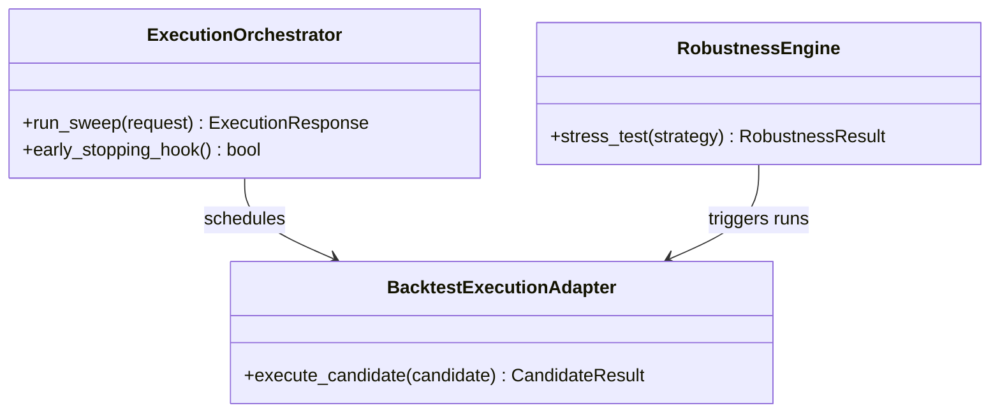

# 09_optimization.md - Requirements

## 1. Purpose

The Optimization module provides parameter-search, walk-forward, robustness, Monte Carlo, scoring, and optimization-result packaging capabilities for HaruQuantAI research and simulation workflows. It exists to help evaluate candidate strategy parameters, compare optimization runs, assess robustness against overfitting and adverse execution assumptions, and prepare optimization artifacts for downstream reporting or persistence.

The module is a library of functions, data structures, and contracts, not a standalone service. It has explicitly separated scopes. Current public service tools package requests or perform lightweight deterministic calculations. Internal rebuild components define lower-level optimization, execution, simulation, scoring, repository, and evidence contracts. Future production platform capabilities require owner-approved limits, repository policy, dependency policy, and public contract review before Builder handoff.

The Optimization module shall never provide live-trading approval, broker execution authority, or final strategy promotion authority.

### 1.1 Assumptions and resolved decisions


### 1.2 Open Questions


## 2. Ownership

### 2.1 Owns

### 2.2 Does Not Own

## 3. Global API Contracts and Configuration

### 3.1 Public Capabilities Summary

### 3.3 Configuration Defaults

## 4. Module Architecture

### 4.1 Target Folder Structure

```text
app/
    __init__.py
    services/
        services/
                optimization/
                    __init__.py
                    sweeps.py
                    robustness.py
                    splitting.py
                    scoring.py
                    algorithms/
                        __init__.py
                        grid.py
                        random.py
                        bayesian.py
                        genetic.py
                    persistence/
                        __init__.py
                        checkpoint.py
                        repository.py
                    helpers.py
                    models.py
tests/
    unit/
        app/
            services/
                services/
                        optimization/
                            test_sweeps.py
                            test_robustness.py
                            test_splitting.py
                            test_scoring.py
    usage/
        app/
            services/
                services/
                        optimization/
                            test_optimization_usage.py```

### 4.2 Class Diagrams



## 5. General / Cross-Cutting Non-Functional Requirements

- [ ] Optimization behavior must be reproducible for the same inputs where deterministic algorithms are used.
- [ ] Public service tools must not perform unbounded compute directly when their documented behavior is request packaging.
- [ ] Parameter spaces, iteration counts, population sizes, bootstrap counts, simulation counts, and worker counts must be bounded before production use.
- [ ] Each execution-capable workflow shall enforce configured timeout, retry, cancellation, and backpressure policies.
- [ ] Public request-packaging API responses shall complete within an approved latency budget.
- [ ] Proposed engineering baseline: public packaging responses should complete in `<= 200 ms` under owner-approved payload-size limits, subject to owner finalization and benchmark validation.
- [ ] Proposed engineering baseline: execution-capable workflows should use a configurable default timeout of `30 minutes`, with overrides allowed only through approved resource profiles.
- [ ] Large request payloads shall be rejected before expensive validation or execution with `OPT_PAYLOAD_TOO_LARGE` when they exceed configured size limits.
- [ ] Optimization outputs shall include objective, executable parameters, candidate score, data slice, algorithm name and version, seed, engine type and version, cost model hash, simulator realism profile hash, parameter-space hash, candidate hash, warnings, and caveats.
- [ ] Optimization must control compute load and warn about overfitting risks.
- [ ] Optimization must not mutate production strategy state without governance.
- [ ] Optimization must not place trades, call live brokers, or bypass risk/trading/live safety gates.
- [ ] Error responses must be structured, traceable, and safe for API/agent consumption.
- [ ] Parallel workflows must avoid race conditions in progress tracking and result aggregation.
- [ ] Optional lower-level dependencies shall either use a documented fallback or return a structured dependency error such as `OPT_SAMPLER_UNAVAILABLE`, `OPT_OPTIMIZER_BACKEND_UNAVAILABLE`, or `OPT_DEPENDENCY_UNAVAILABLE`; unhandled `ImportError` or backend-specific exceptions shall not cross public tool boundaries.
- [ ] Persist/package tools must distinguish request packaging from actual durable storage.
- [ ] Generated reports, saved results, and logs must not expose secrets, credentials, broker tokens, private trade payloads, or authorization headers.
- [ ] Logs, traces, reports, and errors shall redact secrets, credentials, authorization headers, private trade payloads, sensitive file paths, and environment variables.
- [ ] Metrics shall include request count, validation failures, runtime failures, resource-cap rejections, execution duration, queue time, candidate count, and cancellation count.
- [ ] Registry changes must remain covered by tests and catalog updates.
- [ ] Hashing shall use SHA-256 over canonical JSON with sorted keys and normalized decimals, with decimals quantized to eight decimal places by default unless field-specific precision is declared.
- [ ] Repeated deterministic runs with the same inputs shall produce the same candidate ordering, same candidate hashes, same parameter-space hash, and same evidence when backtest execution is deterministic.
- [ ] Resource caps shall fail closed by default unless an explicitly approved override is present.
- [ ] Resource overrides shall include approver, reason, requested cap, approved cap, timestamp, request ID, and workflow trust context in audit metadata.
- [ ] Production signoff shall be blocked when required institutional evidence fields are missing or when performance benchmarks exceed configured limits without approved exception.
- [ ] Official optimization tools shall not possess live broker credentials, live broker gateway network access, or permission to place or close trades.
- [ ] Error codes shall use deterministic enum-style values and optimization-specific errors shall use the `OPT_` prefix. Custom optimization exceptions and error codes must inherit and reuse exceptions from `app.utils.errors` to prevent duplicate declaration.

### 5.1 Other Global and Cross-Cutting Requirements

- [ ] Each requirement shall include a stable requirement ID, priority, scope tier, owner, acceptance criteria, and one or more mapped tests before Builder handoff.
- [ ] Requirement priorities shall distinguish `P0 safety`, `P0 contract`, `P1 current public tool`, `P2 internal rebuild`, and `P3 future`.
- [ ] Confirmed requirements, assumptions, proposed decisions, pending decisions, and future improvements shall remain separated.
- [ ] The optimization registry must expose only intentional public service tools through `app.services.optimization.__all__`.
- [ ] The optimization registry must keep exports unique, callable, documented, and synchronized with tests and catalog entries.
- [ ] Public service tools shall return the documented standard optimization envelope containing `tool_name`, `status`, `request_id`, `data`, `errors`, `warnings`, `audit`, and `side_effects`; unit tests shall verify conformance to this contract.
- [ ] Public service tools must include request/audit context including request ID, tool name, risk level, and approval requirement.
- [ ] Public service tools that package work must not execute live broker actions or mutate production strategy state.
- [ ] Request-packaging tools shall not trigger candidate execution, persistence writes, external network calls, or background jobs unless explicitly documented and approved.
- [ ] Public service tools must preserve business request payloads separately from standard context fields.
- [ ] Dry-run behavior shall be defined per capability type: packaging tools return a validated request envelope without execution, background jobs, persistence writes, or external calls; lightweight calculation tools still perform the deterministic calculation but skip any logging, persistence, or external side-effect writes.
- [ ] When a caller omits `dry_run`, public optimization tools shall default to `dry_run=True`.
- [ ] `dry_run` requested on a calculation-only public tool shall follow that tool contract and shall not change the calculation result except for side-effect metadata and audit context.
- [ ] Public service tools must surface validation and runtime errors in structured result fields rather than uncaught exceptions.
- [ ] The module shall support float, integer, categorical, boolean, fixed, conditional, and constrained parameter spaces.
- [ ] Parameter constraints shall be evaluated before candidate execution, and unsafe constraint expressions shall be blocked.
- [ ] Constraint violations shall be persisted or represented in audit-ready evidence and shall not be sent to the backtest adapter for execution.
- [ ] Official optimization tools shall never place trades, close broker positions, access live broker gateways, or return `approved_for_live_trading`.
- [ ] Official optimization tools shall include side-effect metadata with `places_trade=False`.
- [ ] Final optimization output states shall use the canonical enum `ready_for_risk_review`, `validation_needed`, `research_only`, `rejected`, `failed`, or `cancelled`; all requirements, schemas, tests, examples, and reports shall use these exact values.
- [ ] Portfolio Manager handoff packages shall include capacity estimates, exposure assumptions, cross-symbol validation, cross-timeframe validation, regime evidence, intended deployment AUM, estimated capacity in deployment base currency, and portfolio-impact warnings.
- [ ] UI/reporting handoff packages shall provide chart-ready data without requiring recomputation and shall not render charts inside this module.
- [ ] Evidence package schemas shall be versioned and backward-compatible according to a documented compatibility policy.
- [ ] `run_walk_forward_optimization` shall package rolling train/test walk-forward optimization details.
- [ ] `run_walk_forward_matrix` shall package a matrix of walk-forward train/test combinations.
- [ ] `compare_optimization_runs` shall package candidate optimization run IDs or result payloads for comparison.
- [ ] `calculate_parameter_stability` shall calculate standard-deviation-style stability by parameter across selected candidates.
- [ ] `detect_overfit_parameters` shall detect overfit risk from the gap between in-sample and out-of-sample scores.
- [ ] `rank_parameter_sets` shall rank optimization parameter candidates deterministically from highest score to lowest score.
- [ ] `rank_parameter_sets` tie-breaking shall sort tied scores by `trade_count` descending when available, then by `candidate_hash` ascending; missing `trade_count` shall sort after present `trade_count` for the same score.
- [ ] `save_optimization_result` shall package optimization result metadata for downstream storage.
- [ ] `build_optimization_report` shall package optimization report creation inputs for downstream reporting.
- [ ] Search methods shall return optimization summaries containing candidate results, best parameters, best score, objective, runtime, and total-run metadata.
- [ ] Sobol or Latin Hypercube unavailability shall be explicit and shall either return `OPT_SAMPLER_UNAVAILABLE` or use an approved configured fallback with sampler method, seed, scramble setting, fallback usage, and fallback reason recorded in evidence.
- [ ] Optional backend-specific objects shall not leak into official tool responses.
- [ ] `walk_forward` shall optimize parameters on rolling training windows and test them on out-of-sample windows.
- [ ] `optimization_walk_forward` shall expose a user-facing wrapper around walk-forward parameter optimization.
- [ ] `print_optimization_report` shall print or format a top-candidate optimization report for inspection.
- [ ] `splitter_from_rolling` shall create deterministic rolling time-series train/test windows.
- [ ] `splitter_from_expanding` shall create deterministic expanding time-series train/test windows.
- [ ] `splitter_rolling_split` shall split tabular data into rolling train/test or train/validation/test slices.
- [ ] `SplitterResult` shall hold split windows and support plotting/inspection behavior.
- [ ] Walk-forward results shall preserve train window, test window, selected parameters, train score, test score, and degradation context.
- [ ] Walk-forward validation shall support rolling, anchored, expanding, and custom fold modes.
- [ ] Walk-forward evidence shall include fold results, best parameters per fold, OOS results per fold, fold pass rate, parameter drift score, OOS retention score, walk-forward score, Walk-Forward Efficiency, and walk-forward status.
- [ ] Walk-forward and cross-validation splits shall enforce configurable purging and embargo periods between training and validation sets when required.
- [ ] If average trade duration is known, effective embargo shall be at least the average trade duration in bars unless a stricter value is configured.
- [ ] CPCV validation shall support deterministic path generation when enabled and shall enforce purging and embargo on every path.
- [ ] PBO shall be calculated when CPCV is enabled, and PBO above the configured threshold shall flag or reject overfit risk according to the workflow profile.
- [ ] Evidence shall include embargo configuration, effective embargo bars, and leakage-prevention status for walk-forward and CPCV runs.
- [ ] `resample_returns_simulation` shall sample returns with replacement from the empirical return distribution.
- [ ] `bootstrap_simulation` shall use block bootstrap to preserve short-term temporal structure.
- [ ] `calculate_probability_of_ruin` shall estimate probability that drawdown exceeds the configured ruin threshold.
- [ ] `calculate_confidence_intervals` shall calculate confidence intervals for selected metrics.
- [ ] `compare_simulation_methods` shall run multiple Monte Carlo methods and compare their results.
- [ ] `position_sizing_simulation` shall compare linear and compounding position-sizing equity curves.
- [ ] `consecutive_losing_simulation` shall simulate maximum consecutive losses for win-rate and reward/risk pairs.
- [ ] `profit_target_simulation` shall estimate probability of reaching a target balance.
- [ ] `multi_entry_simulation` shall simulate multi-entry strategy scenarios.
- [ ] `MonteCarloResult` shall hold Monte Carlo simulation outputs and provide summary/statistics behavior.
- [ ] `ParametricSimulationResult`, `PositionSizingResult`, `ConsecutiveLosingScenarioResult`, and `ProfitTargetScenarioResult` shall hold scenario-specific simulation results.
- [ ] Monte Carlo evidence shall include ruin probability, daily-loss breach probability, total-loss breach probability, profit-target probability, equity percentiles, drawdown percentiles, losing-streak distribution, and return distribution.
- [ ] Prop-firm compliance gates shall support max daily loss, max total loss, monthly target, best-day consistency, news restrictions, weekend restrictions, overnight restrictions, exposure limits, correlated exposure limits, and forbidden behavior flags.
- [ ] Prop-firm profiles shall be versioned configuration profiles and shall define rule-evaluation frequency as one of `per_tick`, `per_bar_close`, `per_trade_event`, `session_close`, or `end_of_day`.
- [ ] Prop-firm compliance checks shall evaluate max daily loss, max exposure, and max correlated exposure at the configured intraday frequency when the selected profile requires intraday evidence.
- [ ] End-of-day-only prop-firm evaluation shall be allowed only when the specific versioned prop-firm profile explicitly permits it.
- [ ] `ProgressTracker` shall track progress for parallel optimization work in a thread-safe manner.
- [ ] `parallel_walk_forward` shall run walk-forward optimization across windows and/or candidates in parallel.
- [ ] `compare_parallel_speedup` shall compare optimization runtime across different worker counts.
- [ ] `get_optimal_n_jobs` shall recommend a worker count based on available CPU capacity.
- [ ] `estimate_completion_time` shall estimate total execution time from single-run time, run count, and worker count.
- [ ] `analyze_parallel_results` shall convert parallel optimization results into tabular analysis output.
- [ ] `analyze_walk_forward_results` shall summarize walk-forward optimization results.
- [ ] Parallel processing must keep worker inputs serializable and preserve deterministic aggregation of results.
- [ ] The service layer shall depend on an `ExecutionOrchestrator` abstraction rather than direct multiprocessing.
- [ ] Local sequential and local multiprocessing orchestration shall preserve deterministic aggregation order and equivalent failure isolation.
- [ ] The `ExecutionOrchestrator` shall support backend-neutral early-stopping and pruning hooks.
- [ ] Pruned candidates shall remain persisted with partial evidence, including prune reason, prune phase, intermediate metric snapshot, backend name, and retryable flag.
- [ ] `pfo_from_optimize_func` shall periodically optimize portfolio allocation weights from a deterministic callback.
- [ ] `pfo_plot` shall package periodic allocation-weight data for inspection and may provide non-UI diagnostic serialization; UI chart rendering shall remain outside the Optimization module.
- [ ] `PortfolioOptimizerResult` shall hold periodic portfolio weights and non-UI inspection metadata.
- [ ] `run_optimization_task` shall coordinate a background parameter optimization run and report progress.
- [ ] `run_walk_forward_task` shall coordinate a background walk-forward analysis run and report progress.
- [ ] `run_monte_carlo_task` shall coordinate a background Monte Carlo simulation run.
- [ ] Background task entry points shall return a `task_id` and polling/progress reference, not block the calling thread until optimization completion.
- [ ] Candidate cache entries shall be invalidated automatically when strategy hash, data hash, cost model hash, simulator realism profile hash, objective hash, engine type, module version, or parameter-space hash changes.
- [ ] `candidate_hash` shall be the source of truth for candidate deduplication and shall deterministically combine strategy hash, data hash, cost model hash, simulator realism profile hash, objective hash, engine type, module version, and canonicalized sorted executable parameter values.
- [ ] `candidate_hash` shall exclude inactive conditional parameters and shall use canonical JSON with sorted keys and normalized decimals.
- A prop-firm profile requiring intraday checks must reject end-of-day-only compliance evidence.
- Equivalent parameter spaces with different dictionary insertion order must produce identical `parameter_space_hash` values.
- Candidate pruning must preserve partial evidence and must not make failed or abandoned trials disappear from audit history.
- Strict capital deployment must reject candidates that pass a research PBO threshold but fail the stricter production threshold.
- Simulator realism profiles that introduce stochasticity must conflict with deterministic-only noisy-objective policy unless the run switches to an approved repeated-evaluation policy.
- Candidate cache reuse must be blocked when simulator realism profile hash, objective hash, module version, or parameter-space hash changes.
- Sobol or Latin Hypercube sampler unavailability must be explicit and must not silently fall back without evidence metadata.
- Intraday prop-firm rule data unavailable at the required frequency must produce structured failure details with rule name, required evaluation frequency, available data frequency, and profile ID.
- Current public service tools mostly package requests or calculate lightweight summaries; deeper compute functions exist in lower-level files and should be promoted to the public registry only through an explicit registry review.
- Proposed Decision: PBO thresholds from the audit should replace earlier broad production defaults after risk-owner approval: production `probability_of_backtest_overfitting <= 0.20`, strict capital `<= 0.10`, and `<= 0.50` only for research-only or explicitly approved exploratory validation.
- Pending: numeric production limits other than audit-proposed PBO defaults remain owner/risk decisions and must not be treated as live trading approval.

## 6. Detailed Requirements by File

### File: app/__init__.py

#### Purpose & Scope
Contains functional, security, and testing requirements specifically assigned to `app/__init__.py`.

#### Functional Requirements
- [ ] Optimization workflows shall record reproducibility context including `strategy_id`, parameter-space definition including constraints, objective, data window start/end, engine type, engine version, seed, cost model hash, simulator realism profile hash, module version, parameter-space hash, candidate hashes, and all candidate results required to reproduce ranking and report outputs.
- [ ] The module shall validate optimization requests, strategy compatibility, market data quality, parameter spaces, objective definitions, and evidence-package shape before running expensive work or persisting artifacts.
- [ ] `parametric_simulation` shall simulate outcomes from win rate, reward/risk ratio, risk per trade, trade count, simulation count, and initial balance.
- [ ] `parameter_space_hash` shall be order-invariant, shall sort dictionary keys, shall canonicalize parameter definitions, and shall include constraints after canonical sorting and normalization.
- [ ] The module shall perform no broker, database, network, multiprocessing, or heavy dependency initialization at import time.
- [ ] Timeout enforcement shall use a monotonic clock source such as `time.monotonic()` or `time.perf_counter()` so NTP adjustments or wall-clock changes cannot cause premature timeout or infinite hangs.
- [ ] Public result payloads shall be JSON-safe before envelope return. `NaN`, `Infinity`, and `-Infinity` shall serialize as `null` with a warning; `datetime` values shall serialize as UTC ISO-8601 strings; `Decimal` values shall serialize as normalized strings unless a schema declares a numeric representation; unsupported objects shall fail closed with `OPT_JSON_SERIALIZATION_FAILED`.

#### Non-Functional & Security Requirements
- [ ] No file-specific non-functional requirements defined.

#### Testing & Edge Cases
- [ ] No file-specific testing requirements defined.

### File: app/services/optimization/__init__.py

#### Purpose & Scope
Contains functional, security, and testing requirements specifically assigned to `app/services/optimization/__init__.py`.

#### Functional Requirements
- [ ] No file-specific functional requirements defined. Foundation properties apply.

#### Non-Functional & Security Requirements
- [ ] No file-specific non-functional requirements defined.

#### Testing & Edge Cases
- [ ] No file-specific testing requirements defined.

### File: app/services/optimization/sweeps.py

#### Purpose & Scope
Contains functional, security, and testing requirements specifically assigned to `app/services/optimization/sweeps.py`.

#### Functional Requirements
- [ ] No file-specific functional requirements defined. Foundation properties apply.

#### Non-Functional & Security Requirements
- [ ] No file-specific non-functional requirements defined.

#### Testing & Edge Cases
- [ ] No file-specific testing requirements defined.

### File: app/services/optimization/robustness.py

#### Purpose & Scope
Contains functional, security, and testing requirements specifically assigned to `app/services/optimization/robustness.py`.

#### Functional Requirements
- [ ] Optimization workflows must warn about overfitting, parameter instability, and robustness weaknesses instead of presenting candidate scores as live readiness.
- [ ] Risk Governor handoff packages shall include the full evidence package, final decision, best candidate, top candidates, rejected-candidate summary, production gates, walk-forward evidence, robustness evidence, Monte Carlo evidence, prop-firm compliance evidence, warnings, audit references, and institutional evidence fields.
- [ ] `run_spread_stress_test` shall package wider-spread stress-test inputs.
- [ ] `run_slippage_stress_test` shall package slippage stress-test inputs.
- [ ] `run_commission_stress_test` shall package commission stress-test inputs.
- [ ] `run_randomize_trade_order_mc` shall package shuffled-trade-order Monte Carlo inputs.
- [ ] `run_resample_trades_mc` shall package resampled-trade Monte Carlo inputs.
- [ ] `run_skip_trades_mc` shall package skipped-trade Monte Carlo inputs.
- [ ] `run_randomize_parameters_mc` shall package randomized-parameter Monte Carlo inputs.
- [ ] `run_randomize_history_mc` shall package randomized-history Monte Carlo inputs.
- [ ] `run_combined_monte_carlo` shall package combined Monte Carlo stress inputs.
- [ ] `run_cross_market_test` shall package cross-market robustness-test inputs.
- [ ] `run_cross_timeframe_test` shall package cross-timeframe robustness-test inputs.
- [ ] `run_second_oos_test` shall package second out-of-sample validation inputs.
- [ ] `run_third_oos_test` shall package third out-of-sample validation inputs.
- [ ] `calculate_robustness_score` shall calculate a deterministic robustness percentage from pass/fail checks.
- [ ] `build_robustness_report` shall package robustness report creation inputs.
- [ ] `assess_strategy_robustness` shall produce a comprehensive Monte Carlo robustness assessment.
- [ ] `robustness_simulation` shall simulate robustness with skipped trades, deterioration, and selected Monte Carlo mode.
- [ ] `optimization_monte_carlo` shall expose a user-facing wrapper around Monte Carlo robustness simulation over trade results.
- [ ] Candidate scoring shall support return, net profit, Sharpe, Sortino, Calmar, profit factor, expectancy, win rate, drawdown, trade count, exposure, turnover, cost-adjusted return, OOS retention, fold consistency, robustness survival, Monte Carlo p5 outcome, and prop-firm breach probability.
- [ ] `RobustnessRequest`, `RobustnessStats`, and `RobustnessResponse` shall model robustness simulation inputs and outputs.
- [ ] Evidence packages shall include best candidate, top candidates, rejected candidate summary, optimization summary, walk-forward evidence, parameter stability evidence, robustness evidence, Monte Carlo evidence, prop-firm compliance evidence, production gates, final decision, warnings, audit references, and visualization data.
- [ ] Chart-ready data shall support equity curves, drawdown curves, candidate scatter plots, parameter heatmaps, Pareto front, walk-forward fold results, Monte Carlo cone, final equity distribution, drawdown distribution, regime performance, robustness degradation, DSR versus raw Sharpe, topology visualization, capacity ladder, embargo table, and execution-realism stress table.
- [ ] The module shall support checkpointing after configured candidate intervals, state transitions, before long robustness or Monte Carlo phases, on cancellation, and on recoverable errors.
- [ ] Metrics and reports must not overstate live readiness or hide sample-size, out-of-sample, robustness, or overfit caveats.
- Optimization outputs should eventually label data source, environment, simulation mode, train/test split, and robustness context explicitly so optimized candidates cannot be mistaken for approved live strategies.

#### Non-Functional & Security Requirements
- [ ] No file-specific non-functional requirements defined.

#### Testing & Edge Cases
- [ ] No file-specific testing requirements defined.

### File: app/services/optimization/splitting.py

#### Purpose & Scope
Contains functional, security, and testing requirements specifically assigned to `app/services/optimization/splitting.py`.

#### Functional Requirements
- [ ] No file-specific functional requirements defined. Foundation properties apply.

#### Non-Functional & Security Requirements
- [ ] No file-specific non-functional requirements defined.

#### Testing & Edge Cases
- [ ] No file-specific testing requirements defined.

### File: app/services/optimization/scoring.py

#### Purpose & Scope
Contains functional, security, and testing requirements specifically assigned to `app/services/optimization/scoring.py`.

#### Functional Requirements
- [ ] Inactive conditional parameters shall be excluded from executable candidate parameters, candidate hashes, backtest adapter payloads, scoring, and strategy invocation, while remaining available only in metadata or audit records.
- [ ] Search methods shall support objective/scoring functions, initial balance, symbol, engine type, max workers, verbosity, progress callbacks, and reproducibility controls where implemented.
- [ ] `sharpe_score` shall score results using Sharpe ratio.
- [ ] `sortino_score` shall score results using Sortino ratio.
- [ ] `calmar_score` shall score results using Calmar ratio.
- [ ] `profit_factor_score` shall score results using profit factor.
- [ ] `total_return_score` shall score results using total return percentage.
- [ ] `custom_score` shall calculate a weighted composite from return, Sharpe, and drawdown components.
- [ ] `optimization_get_scoring_func` shall resolve supported objective names to scoring functions.
- [ ] Scoring helpers shall handle missing metrics with deterministic fallback behavior.
- [ ] Candidate scoring shall support single-objective, weighted multi-objective, constraint-based, and Pareto-ready scoring.
- [ ] Pareto selection shall be deterministic and shall record fallback behavior for knee-point selection when used.
- [ ] Anti-overfitting gates shall evaluate in-sample versus out-of-sample degradation, walk-forward consistency, parameter neighborhood smoothness, top-candidate clustering, profit concentration, trade count adequacy, cost sensitivity, Monte Carlo survival, regime dependency, Deflated Sharpe Ratio, multiple-testing correction, topology stability, leakage prevention, and capacity degradation.
- [ ] Every scored candidate shall include raw Sharpe, deflated Sharpe, multiple-testing method, nominal or effective trial count metadata, Sharpe variance estimate, MTB pass status, and MTB rejection reason.
- [ ] `nominal_trial_count` shall be calculated from unique executable candidate hashes after canonical normalization, inactive conditional exclusion, constraint rejection, and cache deduplication.
- [ ] If topology-adjusted or effective-trial estimation is enabled, evidence shall include `effective_trial_count`, `trial_count_method`, and any required method metadata.
- [ ] Evidence shall include `trial_count_independence_warning` when nominal counts may overstate independence in highly correlated, Bayesian, exploitative, or highly constrained parameter spaces.
- [ ] `nominal_trial_count` shall not be presented as a statistically independent trial count unless the configured method explicitly supports that interpretation.
- [ ] PBO threshold enforcement shall remain blocked until the designated risk owner approves production, strict-capital, research-only, and exploratory-validation thresholds.

#### Non-Functional & Security Requirements
- [ ] No file-specific non-functional requirements defined.

#### Testing & Edge Cases
- [ ] No file-specific testing requirements defined.

### File: app/services/optimization/algorithms/__init__.py

#### Purpose & Scope
Contains functional, security, and testing requirements specifically assigned to `app/services/optimization/algorithms/__init__.py`.

#### Functional Requirements
- [ ] No file-specific functional requirements defined. Foundation properties apply.

#### Non-Functional & Security Requirements
- [ ] No file-specific non-functional requirements defined.

#### Testing & Edge Cases
- [ ] No file-specific testing requirements defined.

### File: app/services/optimization/algorithms/grid.py

#### Purpose & Scope
Contains functional, security, and testing requirements specifically assigned to `app/services/optimization/algorithms/grid.py`.

#### Functional Requirements
- [ ] `run_parameter_sweep` shall package a grid or random parameter search request for downstream optimization execution.
- [ ] `run_parameter_sweep` shall require `search_method` with approved values `grid`, `random`, `latin_hypercube`, or `sobol`; distribution-based methods shall include validated distribution definitions instead of grid-only parameter lists.
- [ ] `grid_search` shall evaluate an exhaustive parameter grid over a supplied strategy/backtest context.
- [ ] `optimization_grid_search` shall expose a user-facing wrapper for exhaustive parameter grid search.
- [ ] Grid expansion shall support `100,000+` combinations through strict iterator mode that yields one candidate at a time and never materializes the full Cartesian product in memory.
- [ ] Strict iterator mode shall stay within an owner-approved memory budget regardless of grid size; the budget value remains pending owner/architect approval.
- [ ] `parallel_grid_search` shall run parameter-grid candidate evaluations across multiple workers.

#### Non-Functional & Security Requirements
- [ ] No file-specific non-functional requirements defined.

#### Testing & Edge Cases
- [ ] No file-specific testing requirements defined.

### File: app/services/optimization/algorithms/random.py

#### Purpose & Scope
Contains functional, security, and testing requirements specifically assigned to `app/services/optimization/algorithms/random.py`.

#### Functional Requirements
- [ ] `random_search` shall sample parameter combinations from distributions and evaluate candidates.
- [ ] `optimization_random_search` shall expose a user-facing wrapper for randomized parameter search.
- [ ] Seeded random search shall support pseudo-random, Sobol sequence, and Latin Hypercube sampling contracts.
- [ ] Pseudo-random sampling shall be the always-available deterministic fallback.
- [ ] `monte_carlo_analysis` shall run Monte Carlo analysis against a backtest result with selected simulation type and random seed.
- [ ] `shuffle_trades_simulation` shall randomize trade order while preserving individual trade outcomes.
- [ ] `random_win_rate_simulation` shall simulate trading with random win-rate/reward-risk pairs.
- [ ] Monte Carlo and scenario simulations shall support reproducibility controls and must not claim certainty from randomized outputs.
- [ ] Monte Carlo random number generation shall derive deterministic seeds from run seed, candidate ID, and phase-specific offsets.
- [ ] `parallel_random_search` shall run sampled parameter candidate evaluations across multiple workers.
- [ ] `ManualPairInput`, `RandomWinRateRequest`, `RandomWinRatePair`, `DistributionStats`, `RandomWinRateResult`, and `RandomWinRateResponse` shall model random win-rate simulation inputs and outputs.
- [ ] Random, Monte Carlo, Bayesian, and genetic workflows must support seed or random-state controls where practical.

#### Non-Functional & Security Requirements
- [ ] No file-specific non-functional requirements defined.

#### Testing & Edge Cases
- [ ] No file-specific testing requirements defined.

### File: app/services/optimization/algorithms/bayesian.py

#### Purpose & Scope
Contains functional, security, and testing requirements specifically assigned to `app/services/optimization/algorithms/bayesian.py`.

#### Functional Requirements
- [ ] `bayesian_optimization` shall run Gaussian-process-style Bayesian optimization over a parameter space.
- [ ] `optimization_bayesian` shall expose a user-facing wrapper for Bayesian parameter optimization.
- Bayesian and genetic optimization may require optional scientific dependencies and should document dependency/fallback behavior before production use.

#### Non-Functional & Security Requirements
- [ ] No file-specific non-functional requirements defined.

#### Testing & Edge Cases
- Bayesian or exploitative optimizer runs must emit an independence warning when only `nominal_trial_count` is available.

### File: app/services/optimization/algorithms/genetic.py

#### Purpose & Scope
Contains functional, security, and testing requirements specifically assigned to `app/services/optimization/algorithms/genetic.py`.

#### Functional Requirements
- [ ] `genetic_algorithm` shall evolve parameter candidates through population, selection, crossover, mutation, and elitism behavior.
- [ ] `optimization_genetic` shall expose a user-facing wrapper for genetic algorithm parameter optimization.

#### Non-Functional & Security Requirements
- [ ] No file-specific non-functional requirements defined.

#### Testing & Edge Cases
- [ ] No file-specific testing requirements defined.

### File: app/services/optimization/persistence/__init__.py

#### Purpose & Scope
Contains functional, security, and testing requirements specifically assigned to `app/services/optimization/persistence/__init__.py`.

#### Functional Requirements
- [ ] No file-specific functional requirements defined. Foundation properties apply.

#### Non-Functional & Security Requirements
- [ ] No file-specific non-functional requirements defined.

#### Testing & Edge Cases
- [ ] No file-specific testing requirements defined.

### File: app/services/optimization/persistence/checkpoint.py

#### Purpose & Scope
Contains functional, security, and testing requirements specifically assigned to `app/services/optimization/persistence/checkpoint.py`.

#### Functional Requirements
- [ ] The module shall write optimization runs, candidates, candidate results, checkpoints, evidence packages, and audit records only through an approved repository interface.
- [ ] Resume logic shall reject corrupted, partial, or schema-invalid checkpoint artifacts rather than silently resuming.
- [ ] If the latest checkpoint is corrupted but an earlier valid checkpoint exists, the run may resume from the earlier checkpoint with an audit warning.
- [ ] File-backed checkpoint and candidate-result writes shall use atomic rename semantics by writing to a uniquely named temporary file, flushing and fsyncing where supported, then replacing the target artifact.
- [ ] Atomic write failure shall produce a structured repository or checkpoint error with artifact type, temporary path reference, target path reference, run ID, and phase.
- [ ] Atomic write temporary files shall be created only under approved artifact directories and shall not be treated as valid evidence packages or checkpoints.
- [ ] File-backed checkpoint writes shall prevent path traversal through both temporary and final artifact paths.
- [ ] The module shall include `OPT_ATOMIC_WRITE_FAILED`, `OPT_CHECKPOINT_CORRUPTED`, `OPT_INTRADAY_RULE_DATA_UNAVAILABLE`, `OPT_PROP_FIRM_INTRADAY_EVALUATION_REQUIRED`, `OPT_TRIAL_COUNT_METHOD_UNSUPPORTED`, `OPT_PRUNED_BY_HARD_GATE`, `OPT_PBO_THRESHOLD_FAILED`, and `OPT_NOISY_OBJECTIVE_NOT_ALLOWED` with subtype `STOCHASTIC_REALISM_CONFLICT` where applicable.
- Proposed Decision: file-backed atomic-write requirements should apply to JSONL, Parquet, report, checkpoint, and evidence artifacts; database-backed repositories should provide equivalent transactional safety.

#### Non-Functional & Security Requirements
- [ ] No file-specific non-functional requirements defined.

#### Testing & Edge Cases
- A checkpoint write interrupted mid-write must not corrupt the latest valid checkpoint.
- A corrupted checkpoint must fail closed or fall back to the previous valid checkpoint with an audit warning.

### File: app/services/optimization/persistence/repository.py

#### Purpose & Scope
Contains functional, security, and testing requirements specifically assigned to `app/services/optimization/persistence/repository.py`.

#### Functional Requirements
- [ ] Execution-capable workflows shall require an approved execution profile with resource caps, timeout policy, repository policy, and safety gates.
- [ ] Repository-backed workflows shall be idempotent for repeated resume, cancel, and progress requests.
- [ ] Production implementation shall be blocked until owner-approved limits exist for max candidates, max parameter-space expansion, max runtime, max worker count, max Monte Carlo simulations, objective whitelist, repository backend, artifact root, report schema version, and resource override approver.
- [ ] Optional Optuna and scikit-optimize backends shall sit behind a stable optimizer backend interface and shall require dependency approval, version pinning, repository policy approval, and contract tests before production use.
- [ ] Future Ray, Dask, or Celery adapters shall remain deferred until repository idempotency, retry behavior, and resource accounting are production-mature.
- [ ] The module shall own repository contracts and payload schemas, but shall not own production database provisioning, migrations, credentials, or operations unless explicitly assigned by architecture decision.
- [ ] Concrete repository adapters shall be owned by the approved persistence layer unless explicitly assigned to this module by architecture decision.
- [ ] Repository implementations shall be passed into execution-capable workflows through Dependency Injection rather than imported or constructed by optimization core code.
- [ ] Repository backend support for in-memory fixtures, JSONL fixtures, SQLite, DuckDB/Parquet, PostgreSQL, or managed PostgreSQL-compatible databases shall require deployment-tier approval before production use.
- [ ] Proposed engineering baseline: repository writes over network-backed repositories should retry safe transient failures with exponential backoff up to `3` attempts before surfacing a persistent structured error.
- [ ] Candidate hash generation shall benchmark at `10,000 candidates/sec` locally for simple parameters, parameter validation shall benchmark at `5,000 candidates/sec` for simple numeric parameters, repository write throughput shall benchmark `1,000` candidate records, and resume scan shall benchmark `10,000` candidate hash checks.

#### Non-Functional & Security Requirements
- [ ] No file-specific non-functional requirements defined.

#### Testing & Edge Cases
- [ ] No file-specific testing requirements defined.

### File: app/services/optimization/helpers.py

#### Purpose & Scope
Contains functional, security, and testing requirements specifically assigned to `app/services/optimization/helpers.py`.

#### Functional Requirements
- [ ] `service_strategy_class` shall normalize either a concrete strategy class or a callable strategy-class factory.
- [ ] `optimization_tool_result` shall build the standard HaruQuant optimization result envelope.
- [ ] `optimization_tool_context` shall extract request ID, agent name, environment, and dry-run context from tool keyword arguments.
- [ ] `optimization_business_payload` shall remove standard context fields and retain only business request fields.
- [ ] `package_optimization_request` shall create deterministic request packages without running compute-heavy optimization jobs.
- [ ] Lazy attribute resolution shall resolve lower-level optimization service attributes without putting business logic in the package initializer.
- [ ] `load_strategy_from_path` shall dynamically load a strategy class from a file path and class name.
- [ ] `normalize_engine_type` shall normalize legacy engine labels to supported execution engine names.
- [ ] `run_strategy_backtest` shall run one optimization candidate through the trading/backtest engine with supplied strategy, data, symbol, parameters, balance, engine type, and position size.
- [ ] `run_strategy_backtest_from_path` shall load a strategy class from disk and run one optimization candidate through the backtest path.
- [ ] `EngineOptimizationResult` shall expose a small optimization-facing result contract built from engine outputs.
- [ ] Execution helpers shall convert engine trades, equity points, processed tick counts, and analytics into optimization-ready result objects.
- [ ] Execution helpers shall return or raise structured `OptimizationExecutionError` results with deterministic `OPT_EXECUTION_FAILED`, `OPT_STRATEGY_LOAD_FAILED`, `OPT_ENGINE_CREATION_FAILED`, `OPT_SYMBOL_SETUP_FAILED`, or `OPT_CANDIDATE_EXECUTION_FAILED` codes when strategy loading, engine creation, symbol setup, or candidate execution fails.
- [ ] Candidate execution shall occur only through a versioned `BacktestExecutionAdapter`.
- [ ] The backtest adapter shall validate required data columns, strategy compatibility, cost model, engine type, deterministic seed behavior, and adapter version before execution.
- [ ] Backtest adapter version mismatch shall fail closed before execution.
- [ ] Unsupported simulator realism shocks shall return structured unsupported-feature errors and shall not be silently ignored.
- [ ] Deterministic-only noisy-objective mode shall fail closed with `OPT_NOISY_OBJECTIVE_NOT_ALLOWED` when stochastic simulator realism is active, and failure details shall include conflict subtype `STOCHASTIC_REALISM_CONFLICT`.
- [ ] Background tasks shall isolate database/progress-manager side effects from low-level deterministic optimization helpers.

#### Non-Functional & Security Requirements
- [ ] No file-specific non-functional requirements defined.

#### Testing & Edge Cases
- [ ] No file-specific testing requirements defined.

### File: app/services/optimization/models.py

#### Purpose & Scope
Contains functional, security, and testing requirements specifically assigned to `app/services/optimization/models.py`.

#### Functional Requirements
- [ ] `OptimizationResult` shall represent one candidate optimization result with parameters, score, metrics, and metadata.
- [ ] `OptimizationSummary` shall represent an optimization run summary and expose top-N and dataframe conversion behavior.
- [ ] `UnsupervisedConfigRequest`, `UnsupervisedRunSummary`, and `UnsupervisedAnalysisRequest` shall model unsupervised-analysis configuration and output attached to optimization flows.
- [ ] `ParameterRange` shall model a named parameter range for optimization requests.
- [ ] `OptimizationRequest`, `OptimizationResponse`, `OptimizationRunDetails`, and `OptimizationResultItem` shall model optimization request, response, run detail, and result item payloads.
- [ ] `PositionSizingRequest` shall model position-sizing simulation requests.
- [ ] `WalkForwardRequest`, `WalkForwardWindow`, and `WalkForwardResponse` shall model walk-forward analysis inputs and outputs.
- [ ] `MonteCarloRequest`, `ParametricMonteCarloRequest`, and `MonteCarloResponse` shall model Monte Carlo inputs and outputs.
- [ ] `ConsecutiveLosingRequest`, `ConsecutiveLosingScenario`, and `ConsecutiveLosingResponse` shall model consecutive-loss simulation inputs and outputs.
- [ ] `ProfitTargetRequest`, `ProfitTargetResult`, and `ProfitTargetResponse` shall model profit-target simulation inputs and outputs.
- [ ] `MultiEntryRequest`, `MultiEntryScenarioResult`, and `MultiEntryResponse` shall model multi-entry simulation inputs and outputs.
- [ ] Evidence packages shall include institutional fields for raw Sharpe, Deflated Sharpe Ratio, multiple-testing method, purging and embargo data, leakage prevention status, parameter plateau score, isolation penalty, estimated capacity, simulator realism profiles, orchestrator backend, and resource quota.
- [ ] Evidence packages shall include advanced research fields for PBO, CPCV, sensitivity, noisy-objective handling, repeated score statistics, and compute cost when applicable.
- [ ] Capacity evidence shall include `deployment_base_currency`, `intended_deployment_aum`, and `estimated_capacity_in_base_currency`.
- [ ] Reports shall be generated from evidence without recomputation and shall include constraint violations, WFE summary, sampler policy, Pareto selection method, PBO when enabled, pruning/partial-evidence behavior, and production/research threshold context.

#### Non-Functional & Security Requirements
- [ ] No file-specific non-functional requirements defined.

#### Testing & Edge Cases
- [ ] No file-specific testing requirements defined.

## 7. Global Testing, Quality Gates, and Usage Examples


### 7.3 Usage Examples

#### Example 1
```python
from app.services.optimization import run_parameter_sweep, rank_parameter_sets

sweep = run_parameter_sweep(
    request_id="req_optimization_sweep",
    agent_name="research_agent",
    environment="development",
    dry_run=True,
    strategy_id="strategy_alpha",
    symbol="EURUSD",
    timeframe="H1",
    parameter_grid={"fast": [5, 10], "slow": [20, 30]},
    objective="sharpe_ratio",
)

ranked = rank_parameter_sets(
    request_id="req_optimization_rank",
    candidates=[
        {"params": {"fast": 5, "slow": 20}, "score": 0.8},
        {"params": {"fast": 10, "slow": 30}, "score": 1.1},
    ],
)

assert sweep["status"] in {"success", "rejected", "blocked", "failed"}
assert ranked["data"]["ranked"][0]["score"] == 1.1
```

#### Example 2
```python
from app.services.optimization import detect_overfit_parameters, calculate_robustness_score

overfit = detect_overfit_parameters(
    in_sample_score=1.2,
    out_of_sample_score=0.7,
    threshold=0.25,
    request_id="req_optimization_overfit",
)

robustness = calculate_robustness_score(
    checks=[
        {"name": "spread_stress", "passed": True},
        {"name": "slippage_stress", "passed": False},
        {"name": "second_oos", "passed": True},
    ],
    request_id="req_optimization_robustness",
)
```

#### Example 3
```python
from app.services.optimization import run_spread_stress_test, run_walk_forward_optimization

stress = run_spread_stress_test(
    strategy_id="strategy_alpha",
    spread_multiplier=2.0,
    request_id="req_optimization_stress",
)

walk_forward = run_walk_forward_optimization(
    strategy_id="strategy_alpha",
    symbol="EURUSD",
    timeframe="H1",
    parameter_grid={"fast": [5, 10], "slow": [20, 30]},
    train_period="180D",
    test_period="30D",
    objective="profit_factor",
    request_id="req_optimization_wf",
)
```

#### Example 4
```python
evidence_metadata = {
    "final_decision": "ready_for_risk_review",
    "places_trade": False,
    "nominal_trial_count": 128,
    "effective_trial_count": None,
    "trial_count_method": "unique_executable_candidate_hashes",
    "trial_count_independence_warning": True,
    "parameter_space_hash": "sha256:...",
    "candidate_hash_inputs": [
        "strategy_hash",
        "data_hash",
        "cost_model_hash",
        "simulator_realism_profile_hash",
        "objective_hash",
        "engine_type",
        "module_version",
        "canonicalized_executable_parameters",
    ],
}
```

#### Example 5
```python
from app.services.optimization import run_parameter_sweep

random_sweep = run_parameter_sweep(
    request_id="req_optimization_random_sweep",
    dry_run=True,
    strategy_id="strategy_alpha",
    symbol="EURUSD",
    timeframe="H1",
    search_method="random",
    distributions={
        "fast": {"type": "int_uniform", "min": 5, "max": 20},
        "slow": {"type": "int_uniform", "min": 21, "max": 80},
    },
    objective="sharpe_ratio",
    seed=42,
    max_candidates=100,
)

assert random_sweep["side_effects"]["places_trade"] is False
```

#### Example 6
```python
from app.services.optimization import calculate_parameter_stability

stability_error = calculate_parameter_stability(
    request_id="req_optimization_stability_error",
    candidates=[
        {"params": {"fast": 5, "slow": 20}, "score": 0.8},
    ],
)

assert stability_error["status"] in {"rejected", "failed"}
assert stability_error["errors"][0]["code"].startswith("OPT_")
```

#### Example 7
```python
from app.services.optimization import run_parameter_sweep

invalid_grid = run_parameter_sweep(
    request_id="req_optimization_invalid_grid",
    dry_run=True,
    strategy_id="strategy_alpha",
    symbol="EURUSD",
    timeframe="H1",
    parameter_grid={"fast": [], "slow": [20, 30]},
    objective="sharpe_ratio",
)

assert invalid_grid["status"] in {"rejected", "failed"}
assert invalid_grid["errors"][0]["code"].startswith("OPT_")
assert invalid_grid["side_effects"]["places_trade"] is False
```

#### Example 8
```python
risk_governor_handoff = {
    "schema_version": "optimization_evidence.v1",
    "final_decision": "validation_needed",
    "places_trade": False,
    "evidence": {
        "best_candidate": {"candidate_hash": "sha256:..."},
        "walk_forward": {"status": "validation_needed"},
        "robustness": {"status": "warning"},
        "monte_carlo": {"status": "pending"},
        "warnings": ["OPT_OVERFIT_REVIEW_REQUIRED"],
    },
    "audit": {
        "request_id": "req_optimization_handoff",
        "parameter_space_hash": "sha256:...",
    },
}
```

## 8. Acceptance
