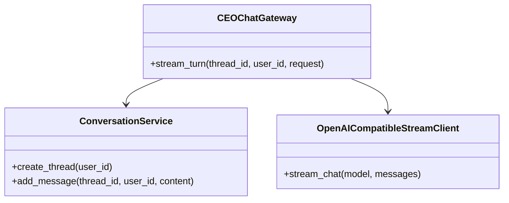

# 13_conversation.md - Requirements

## 1. Purpose

The conversation module provides the governed AI chat layer for HaruQuant. It manages durable chat threads, redacted messages, rolling memory, page-context assembly, prompt composition, provider-aware response streaming, CEO/planner routing, read-only tool evidence, and governed action drafts.

The module exists so users can ask for explanations, summaries, planning support, research routing, and action proposals without allowing chat to directly mutate trading state, bypass risk controls, or execute broker-affecting actions.

Conversation defers governed execution, risk-control authority, and action approval to the approved API/UI, governance, risk, trading, and live modules. Conversation may create draft-only proposals and evidence-backed responses but must not become a final approval or execution path.

### 1.1 Assumptions and resolved decisions


### 1.2 Open Questions


## 2. Ownership

### 2.1 Owns

### 2.2 Does Not Own

## 3. Global API Contracts and Configuration

### 3.1 Public Capabilities Summary
- [ ] Each public capability shall document whether it is a stable public API, internal helper, official callable tool, or experimental export.

| Term | Meaning |
|---|---|
| Regulated | A conversation or artifact requiring stricter retention and audit handling because it references governed action, signal proposal, action draft, or compliance-sensitive workflow material. |
| Legal hold | A retention state that blocks archive, deletion, and purge until an approved release action returns the thread to a governed retention class. |
| Action draft | A conversation-created proposal package that requires separate human/governance approval and cannot execute directly from chat. |
| Tool evidence | Read-only evidence returned from approved tools or services and included in prompt composition only after provenance, permission, freshness, and read-only classification checks. |
| CEO route | The planner/CEO gateway routing decision used to select response strategy, evidence needs, optional research routing, and deterministic fallback behavior. |
| Provider-degraded | A state where model/provider execution failed, was unavailable, or partially failed and the gateway emits documented fallback or degraded terminal behavior. |

### 3.3 Configuration Defaults

## 4. Module Architecture

### 4.1 Target Folder Structure

```text
tools/
  conversation/
    __init__.py          # Exposed namespace initialization
    service.py           # Durable ConversationService
    config.py            # Conversation configurations validator
    retention.py         # ConversationRetentionService and redaction engine
    prompt_builder.py    # Composes prompts from layers
    ceo_gateway.py       # CEOChatGateway turn runner
    memory.py            # Durable conversation summaries & pinned facts
    context/
      __init__.py
      service.py         # PageContextService & ContextAssembler
      builders.py        # Route-aware context builders
    providers/
      __init__.py
      stream.py          # OpenAICompatibleStreamClient & StreamManager
    errors.py            # Conversation errors definition
```

### 4.2 Class Diagrams



## 5. General / Cross-Cutting Non-Functional Requirements

- [ ] Importing `tools.conversation` shall not require provider credentials, network access, database access, optional provider SDKs, or model availability.
- [ ] Conversation persistence shall redact secrets before storing user or assistant message content.
- [ ] Chat shall remain usable when LLM providers are disabled or unavailable.
- [ ] Standard and regulated inactive conversations shall be archived rather than immediately purged.
- [ ] Read-only tool evidence shall include provenance where available and shall not silently become authority for side effects.
- [ ] Security-sensitive logs shall never include unredacted message text, secrets, provider keys, action draft payload secrets, or raw tool evidence containing credentials.
- [ ] The package-level domain registry shall remain explicit about no exposed conversation function tools when `__all__` is empty.

### 5.1 Other Global and Cross-Cutting Requirements

- [ ] `tools.conversation.__all__` shall remain the package-level exposed function-tool registry for the conversation domain.
- [ ] `tools.conversation.__all__` shall be allowed to be empty when no conversation functions are registered as external tools.
- [ ] Duplicate chat turn requests shall be idempotent by `(user_id, thread_id, request_id)` and shall not create duplicate user messages, duplicate assistant messages, duplicate action drafts, or duplicate lifecycle events.
- [ ] `list_threads` shall list a user's threads, optionally include archived threads, apply a limit, and filter by case-insensitive title query when supplied.
- [ ] `rename_thread` shall trim a supplied title, fall back to the default title when the result is empty, persist the title, and return updated thread detail.
- [ ] `delete_thread` shall soft-delete a user's thread and return whether the operation succeeded.
- [ ] `archive_thread` shall archive a user's thread with a lifecycle reason and return updated thread detail.
- [ ] `restore_thread` shall restore an archived thread with a lifecycle reason and return updated thread detail.
- [ ] `update_context` shall persist the current route, page type, and active context revision for a thread.
- [ ] `update_context` shall record a lifecycle audit event when the active context revision changes.
- [ ] `add_message` shall persist a redacted chat message with role, request id, context revision, tool calls, linked signal proposal, linked action draft, metadata, and latency.
- [ ] `add_message` on archived or deleted threads shall return a documented machine-readable error or exception shape before implementation.
- [ ] `add_message` shall mark a thread regulated when a message links to a signal proposal or action draft.
- [ ] `export_thread` shall export a thread as JSON when requested and record an export lifecycle event.
- [ ] `export_thread` shall export a thread as Markdown by default and record an export lifecycle event.
- [ ] `export_thread` shall include CEO workflow metadata for assistant messages when response metadata is available.
- [ ] `create_action_draft` shall create a governed action draft with generated draft id, request id, draft type, title, description, payload, risk precheck status, risk notes, and required human approval.
- [ ] `create_action_draft` shall validate payloads against a versioned schema for each supported draft type before persistence.
- [ ] `create_action_draft` shall mark the conversation regulated because action drafts are governed artifacts.
- [ ] `get_action_draft` shall return one action draft for a user and shall raise a lookup error when missing.
- [ ] `list_action_drafts` shall list a user's action drafts, optionally filtered by thread id and status.
- [ ] `ActionDraftRecord` shall represent draft id, thread id, user id, request id, draft type, title, description, payload, risk precheck status, approval id, status, human approval requirement, side-effect status, governed workflow id, execution intent id, execution receipt id, and timestamps.
- [ ] `ActionDraftRecord.model_dump` shall expose `model_dump` behavior that returns a dictionary copy suitable for API serialization.
- [ ] Action drafts shall remain proposals and shall not execute directly from the conversation module.
- [ ] `utc_now` shall return the current UTC timestamp.
- [ ] `to_sqlite_timestamp` shall convert datetimes to UTC SQLite-compatible timestamp strings without microseconds.
- [ ] `apply_legal_hold` shall place a thread on legal hold, clear expiry and purge dates, and store legal-hold reason and optional end date.
- [ ] `run_lifecycle` shall skip legal-hold threads, purge deleted threads past purge date, purge expired ephemeral threads, and archive inactive standard or regulated threads past the archive threshold.
- [ ] `maybe_refresh_summary` shall return the latest existing summary until the message-count cadence is reached.
- [ ] `maybe_refresh_summary` shall create a new deterministic rolling summary when the cadence threshold is met.
- [ ] `list_pinned_facts` shall return pinned facts for a user's thread.
- [ ] `build_rolling_summary` shall create a compact deterministic summary from recent user and assistant turns without requiring an LLM provider.
- [ ] `ContextAssembler` shall act as the canonical page-context assembler alias for routes and chat tools.
- [ ] `infer_page_type` shall infer page type from explicit hint or route text.
- [ ] `compact_dom_snapshot` shall compact DOM title, headings, text excerpt, tables, semantic blocks, and actionable elements within fixed limits.
- [ ] `compact_page_intelligence` shall compact page identity, selected entities, visible metrics, visible tables, visible charts, filters, user selection, action affordances, and freshness metadata.
- [ ] `entity_refs_from_state` shall create entity references for session, symbol, timeframe, and selected UI entities.
- [ ] `build_compact_context` shall create a bounded `PageContext` with schema version, route, page type, page title, entity refs, context revision, freshness, authority, summary, and payload.
- [ ] `freshness_payload` shall describe the freshness and source of context data.
- [ ] `build_dashboard_context` shall build context for dashboard pages.
- [ ] `build_data_workspace_context` shall build context for data workspace pages.
- [ ] `build_strategy_detail_context` shall build context for strategy detail pages.
- [ ] `build_backtest_detail_context` shall build context for backtest or simulation detail pages.
- [ ] `build_optimization_context` shall build context for optimization pages.
- [ ] `build_portfolio_risk_context` shall build context for portfolio risk pages.
- [ ] `build_live_trading_context` shall build context for live trading pages.
- [ ] `build_operator_workflow_context` shall build context for operator workflow pages.
- [ ] `build_generic_context` shall build fallback context for unrecognized pages.
- [ ] Tool evidence rejection or quarantine shall have a documented result shape, excluded-layer composition log entry, and security/audit metadata before implementation.
- [ ] Provider calls shall use documented timeout, retry, and no-retry conditions.
- [ ] Short follow-up detection and pending research context merge rules shall be explicitly defined before implementation, including token/sentence limits, accepted answer shapes, and conflict behavior when the follow-up is ambiguous.
- Proposed Decision: short follow-up detection should treat a reply as a pending-context answer only when it is fewer than 15 tokens, is a single sentence, matches the prior clarification intent, and contains no new route/action request; otherwise it should start a normal new turn.
- [ ] Conversation shall not present unsupported live market conditions, strategy suitability, volatility, regime, or price-action claims as facts.
- [ ] Conversation shall describe unavailable evidence as pending instead of inventing market data, backtest results, risk approvals, owner decisions, or provider behavior.
- [ ] Conversation shall not claim to execute trades or irreversible actions from chat.
- [ ] Action drafts shall require human approval and shall preserve side-effect status as draft-only unless external governance changes it.
- Unit tests proving importing `tools.conversation` does not require provider credentials, network access, database access, optional SDKs, or model availability.
- [ ] Usage examples shall include expected return shape or representative output for each public capability shown.
- [ ] Usage examples shall include at least one invalid-input example and one provider-disabled fallback example.
- [ ] Usage examples shall include an action draft creation example that demonstrates draft-only side-effect status and human approval requirement.
- [ ] Repository behavior shall define transactional boundaries, isolation expectations, conflict detection, optimistic version or per-thread lock behavior, idempotency lookup/write behavior, partial-failure handling, retryability, and machine-readable persistence error codes.
- [ ] Concrete non-functional targets shall be approved or explicitly deferred from release scope before production-readiness claims are made.
- [ ] `ConversationRepository` shall be defined as a Python protocol, abstract base class, or companion persistence contract before implementation.
- [ ] Deterministic fallback responses shall use a documented schema, not free-form implicit text.
- [ ] Provider-disabled fallback shall emit a metadata event before token events and a terminal `done` event with `generation_source="deterministic_fallback"`.

## 6. Detailed Requirements by File

### File: tools/conversation/__init__.py

#### Purpose & Scope
Contains functional, security, and testing requirements specifically assigned to `tools/conversation/__init__.py`.

#### Functional Requirements
- [ ] Package initialization shall standardize conversation domain export metadata with tool category `conversation`.
- [ ] `list_ceo_chat_tools` shall list chat tool definitions available to the CEO chat workflow.

#### Non-Functional & Security Requirements
- [ ] No file-specific non-functional requirements defined.

#### Testing & Edge Cases
- [ ] No file-specific testing requirements defined.

### File: tools/conversation/service.py

#### Purpose & Scope
Contains functional, security, and testing requirements specifically assigned to `tools/conversation/service.py`.

#### Functional Requirements
- User authentication, identity provisioning, access-token validation, or independent validation that a supplied `user_id` is authentic. Conversation trusts the authenticated actor context supplied by API/UI or an approved service boundary and must fail closed when that context is missing or invalid.
- [ ] `ConversationService` public methods shall document whether they mutate persistent state, emit audit events, require user ownership checks, or trigger retention escalation.
- [ ] Package initialization shall make `ConversationService` importable from `tools.conversation`.
- [ ] `ConversationService` shall provide durable chat operations used by the UI API and CEO gateway.
- [ ] `ConversationService` shall provide the durable conversation API for UI API and CEO gateway callers, including thread lifecycle, redacted message persistence, retention detail, context metadata update, export, memory summary retrieval, pinned fact retrieval, and governed action draft operations.
- [ ] Request IDs shall be generated by the API/UI gateway or service caller using the approved Utils identity helper once available; missing request IDs may be generated by `stream_turn`, but malformed, oversized, or unsafe request IDs shall return a documented validation error.
- [ ] `ConversationRetentionService` shall apply lifecycle, archival, legal-hold, and purge rules through the repository.
- [ ] `ConversationMemoryService` shall keep durable memory separate from ephemeral page context.
- [ ] `PageContextService` shall build compact page context without persisting it as durable memory.
- [ ] `PageContextService.from_chat_request` shall expose `from_chat_request` behavior that builds page context from a chat request's route, page title, session id, symbol, timeframe, DOM snapshot, and page intelligence.
- [ ] Tool plans shall be read-only unless routed through separate governed services outside the conversation module.
- [ ] The API/UI Gateway or an approved authorization service shall own authentication, identity validation, and final permission authority for read-only tool evidence. Conversation owns only permission result consumption, evidence inclusion rules, and prompt/audit handling.
- [ ] The repository contract shall define how SQLite launch persistence maps thread IDs, user IDs, request IDs, lifecycle events, JSON metadata, booleans, timestamps, and version fields without exposing raw database rows at public service boundaries.
- The package-level function-tool registry is currently empty even though important service classes exist in submodules; future API design should decide whether any conversation capabilities should be exported as standardized tools.

#### Non-Functional & Security Requirements
- [ ] No file-specific non-functional requirements defined.

#### Testing & Edge Cases
- [ ] No file-specific testing requirements defined.

### File: tools/conversation/config.py

#### Purpose & Scope
Contains functional, security, and testing requirements specifically assigned to `tools/conversation/config.py`.

#### Functional Requirements
- [ ] Each public capability shall document machine-readable error codes for validation, authorization, idempotency, concurrency, provider, persistence, configuration, cancellation, and internal failure paths.
- [ ] `list_threads` and `get_thread` shall define default limits, maximum limits, and behavior when requested limits exceed configured maximums.
- [ ] `add_message` shall refresh durable memory summaries on the configured cadence.
- [ ] `redact_sensitive_text` shall redact configured secret patterns, email addresses, and long numeric identifiers from persisted text.
- [ ] Retention durations, archive thresholds, purge delays, and legal-hold release behavior shall be loaded from a validated retention policy configuration with documented local-development defaults and explicit production overrides.
- [ ] The retention policy configuration schema and local-development defaults shall be committed with this specification or a referenced companion specification before lifecycle tests are accepted.
- [ ] `normalize_text` shall collapse whitespace and truncate text to a configured limit.
- [ ] `PromptBuilder.build` shall include only the configured maximum number of recent user/assistant messages.
- [ ] `ModelConfigurationError` shall represent missing or invalid model runtime configuration.
- [ ] `ModelRuntimeError` shall represent configured provider runtime failure.
- [ ] `OpenAICompatibleStreamClient` shall select providers based on model names and configured environment variables.
- [ ] `OpenAICompatibleStreamClient.is_configured` shall expose `is_configured` behavior that reports whether any supported provider credentials are available.
- [ ] `OpenAICompatibleStreamClient.is_configured_for` shall expose `is_configured_for` behavior that reports whether a specific model can be served by its inferred provider.
- [ ] OpenAI streaming shall require a configured API key and stream chat-completion deltas.
- [ ] Google/Gemini streaming shall require a configured API key and installed provider SDK.
- [ ] Ollama streaming shall use the configured local Ollama base URL and report configuration/runtime errors when unreachable or failing.
- [ ] Provider failure after partial token streaming shall emit a documented degraded terminal event and shall not replace already-streamed content with deterministic fallback text unless explicitly configured.
- [ ] `stream_turn` shall use model streaming only when chat is enabled, a model is selected, and the provider is configured.
- [ ] `stream_turn` shall degrade to fallback responses when the model is disabled, not configured, blocked, or unavailable before tokens are produced.
- [ ] Import-time behavior shall not configure providers, open databases, run migrations, load `.env`, contact networks, start background tasks, or register live side-effecting tools.
- [ ] Provider streaming shall fail over to deterministic fallback text when model configuration or provider runtime fails before output is produced.
- Proposed Decision: backpressure should drop non-terminal progress events after the configured buffer limit and emit or record `BACKPRESSURE_DROPPED`; terminal, cancellation, error, and provider-degraded events must not be silently dropped.
- [ ] All retention lifecycle decisions shall be deterministic for a supplied clock and retention policy configuration.
- [ ] Deleted conversations shall only purge after the configured purge delay unless retention class blocks purging.
- [ ] Model-provider configuration shall be environment-driven and shall not require hardcoded secrets.
- [ ] The retention policy configuration schema shall be approved before lifecycle implementation. The schema shall define retention classes, durations, archive thresholds, purge delays, legal-hold release behavior, local-development defaults, production override requirements, and validation errors.
- [ ] The Conversation configuration reference shall be approved before implementation. The reference shall enumerate prompt budgets, context budgets, provider timeouts, stream buffering limits, active-stream memory limits, import-time expectations, lifecycle batch limits, summary cadence, and fallback behavior.
- [ ] Requirement-to-test traceability shall map every accepted public contract, configuration value, event type, error code, concurrency rule, and retention rule to tests.
- [ ] Fallback metadata shall include `generation_source`, `fallback_reason`, `model_requested`, `provider_label`, `provider_configured`, `tokens_started`, `request_id`, `thread_id`, and redacted tool/evidence availability state.
- [ ] Fallback text shall be bounded by configuration and shall not invent market data, risk approval, backtest results, owner decisions, or provider behavior.
- [ ] Conversation configuration shall define names, types, default values, validation rules, environment override behavior, and failure behavior for every runtime-configurable value.
- [ ] Retention configuration values shall include standard retention duration, ephemeral retention duration, regulated retention duration or no-expiry behavior, archive inactivity thresholds, deleted-thread purge delay, legal-hold release behavior, lifecycle batch size, and lifecycle time budget. Concrete values are Pending owner approval.
- [ ] Prompt and context configuration values shall include maximum page-context characters, DOM snapshot characters, page-intelligence characters, tool-evidence characters, memory summary characters, pinned fact count, recent message count, per-message characters, total prompt budget, and truncation strategy. Concrete values are Pending owner approval.
- [ ] Streaming configuration values shall include provider timeout, retry count, no-retry conditions, fallback chunk size, fallback delay, outgoing event buffer limit, backpressure policy, active-stream memory budget, and cancellation persistence behavior. Concrete values are Pending owner approval.
- [ ] Import-time configuration expectations shall define the maximum allowed side effects and optional dependency behavior; concrete timing targets are Pending benchmark approval.
- [ ] Observability configuration values shall include telemetry field names, audit sink expectations, redaction-before-log requirements, prompt composition log sampling or retention, provider degradation metadata, and security-sensitive log exclusions.
- [ ] Developers MUST NOT implement retention durations, prompt budgets, stream buffer limits, provider timeouts, or lifecycle limits as hardcoded constants; they MUST be loaded from the approved configuration schema with injectable test overrides.
- Developers MUST NOT hardcode retention durations, prompt budgets, provider timeouts, stream buffer limits, active-stream memory limits, or lifecycle batch limits; these values must be injected through the approved Conversation configuration schema.
- Provider-backed streaming depends on external API availability, environment configuration, and optional SDK installation; fallback behavior should remain deterministic and well tested.

#### Non-Functional & Security Requirements
- [ ] No file-specific non-functional requirements defined.

#### Testing & Edge Cases
- [ ] No file-specific testing requirements defined.

### File: tools/conversation/retention.py

#### Purpose & Scope
Contains functional, security, and testing requirements specifically assigned to `tools/conversation/retention.py`.

#### Functional Requirements
- [ ] Conversation mutations shall enforce user ownership before reading, writing, exporting, deleting, archiving, restoring, updating retention, creating action drafts, or listing action drafts.
- [ ] Conversation mutations that affect thread state, message state, action draft state, retention state, or lifecycle audit state shall be atomic where consistency is required.
- [ ] Repository operations used by thread creation, message persistence, action draft creation, retention escalation, export audit logging, and lifecycle updates shall return explicit failure results or raise documented exceptions on partial failure.
- [ ] Concurrent conversation mutations shall preserve consistent thread, message, retention, and audit state or return a documented conflict/failure result.
- [ ] `create_thread` shall create a thread for a user, assign a generated thread id, default the title when absent, persist route/page/context metadata, initialize retention policy, and return full thread detail.
- [ ] Archived thread behavior shall be explicitly defined for message addition, context update, export, retention changes, and action draft creation.
- [ ] Deleted thread behavior shall be explicitly defined for read, restore, export, retention detail, message addition, action draft creation, and lifecycle purge.
- [ ] `retention_detail` shall return retention policy detail and lifecycle audit events for a user's thread, including deleted threads, and shall raise a lookup error when missing.
- [ ] `set_thread_retention_class` shall support `ephemeral`, `regulated`, `legal_hold`, and `standard` retention classes.
- [ ] `set_thread_retention_class` shall define whether changing to the current retention class is a no-op, lifecycle event, or validation error before implementation.
- [ ] `set_thread_retention_class` shall reject unsupported retention classes with a value error.
- [ ] `RetentionDecision` shall represent one retention lifecycle decision with action, thread id, and reason.
- [ ] `retention_expiry_for` shall calculate expiration timestamps only for supported retention classes and shall either reject unknown retention classes with a documented error or treat them according to an explicitly documented fail-closed default.
- [ ] `purge_after_for` shall return no purge date for regulated or legal-hold threads and otherwise align purge timing with retention expiry.
- [ ] `initialize_thread_policy` shall initialize thread retention with class, expiry, purge date, and lifecycle reason.
- [ ] `mark_regulated` shall upgrade non-regulated threads to regulated retention and preserve already regulated or legal-hold threads.
- [ ] `set_ephemeral` shall set ephemeral retention for eligible threads and shall not downgrade regulated or legal-hold threads.
- [ ] `release_legal_hold` shall return a legal-hold thread to regulated retention and clear legal-hold fields.
- [ ] Regulated chat artifacts shall trigger regulated retention handling.
- [ ] Conversation shall preserve user ownership boundaries for threads, messages, retention detail, pinned facts, and action drafts.
- [ ] Retention lifecycle actions shall be auditable and shall respect legal hold before archive, delete, or purge behavior.
- [ ] Regulated and legal-hold retention classes shall not be downgraded by ephemeral retention requests.
- [ ] A `ConversationRepository` contract or companion persistence specification shall be approved before implementation. The contract shall define thread, message, memory summary, pinned fact, action draft, retention policy, lifecycle audit, export audit, idempotency, and locking/version operations.
- [ ] The repository contract shall define method signatures or operation records for creating, reading, listing, renaming, archiving, restoring, soft-deleting, exporting, and retention-updating threads.
- [ ] The repository contract shall define transaction scopes for operations that must update multiple records, including thread creation with retention policy, message persistence with title update or retention escalation, action draft creation with retention escalation, export with lifecycle audit event, and legal-hold changes.
- [ ] The repository contract shall define conflict signals for version mismatch, active-turn lock conflict, duplicate request replay, duplicate request material mismatch, retention race, lifecycle race, and partial persistence failure.

#### Non-Functional & Security Requirements
- [ ] No file-specific non-functional requirements defined.

#### Testing & Edge Cases
- [ ] No file-specific testing requirements defined.

### File: tools/conversation/prompt_builder.py

#### Purpose & Scope
Contains functional, security, and testing requirements specifically assigned to `tools/conversation/prompt_builder.py`.

#### Functional Requirements
- [ ] Public conversation exports shall be documented in a capability contract table before Builder handoff.
- [ ] `add_message` shall auto-title default conversation threads from the first user prompt.
- [ ] `add_message` shall define the fallback title format for empty, whitespace-only, redacted-empty, or too-short first prompts before implementation.
- Proposed Decision: fallback titles for empty, whitespace-only, redacted-empty, or too-short first prompts should use `Untitled Thread - {YYYY-MM-DD}` with the date generated from the injected UTC clock.
- [ ] `generate_thread_title` shall generate a compact thread title from the prompt and use a fallback when the prompt is empty.
- [ ] `get_context_builder` shall resolve the context builder for a page type or route.
- [ ] `build_page_context` shall route page-context creation to the appropriate specialized builder.
- [ ] `PromptBuildResult` shall contain the composed chat messages and prompt-composition audit log.
- [ ] `PromptBuilder.build` shall expose `build` behavior that includes the highest-authority governance system prompt first.
- [ ] `PromptBuilder.build` shall include user-attached read-only tool hints when supplied.
- [ ] `PromptBuilder.build` shall include read-only tool evidence when supplied and instruct the model not to guess when tools are unavailable.
- [ ] Prompt building shall reject or quarantine tool evidence that lacks required provenance, permission status, freshness metadata, retrieval timestamp, or read-only classification.
- [ ] `PromptBuilder.build` shall append the current user prompt last.
- [ ] `PromptBuilder.build` shall return a composition log with layer authority, inclusion state, character counts, token estimates, message count, route, and truncation state.
- [ ] Prompt composition shall compact oversized page context to a bounded representation.
- [ ] `CEOChatGateway` shall run chat turns through context assembly, planner routing, read-only evidence tools, CEO memo creation, prompt building, model/fallback response generation, metadata creation, and message persistence.
- [ ] Read-only tool attachment and evidence inclusion shall require an explicit permission check for the requesting user, thread, route, and target data scope before tool hints or evidence are included in prompt composition.
- [ ] Conversation context shall be compacted to bounded payload sizes before prompt inclusion.
- [ ] Prompt composition shall complete within a documented latency budget for normal bounded inputs.
- Proposed Decision: prompt composition should emit `PROMPT_COMPOSITION_SLOW` telemetry when it exceeds the approved p95 threshold for bounded inputs.
- [ ] Prompt composition shall produce auditable layer metadata for governance and debugging.
- [ ] Authorization context and read-only evidence permission contracts shall be approved before tool evidence can be included in prompts. The contract shall define how principal identity, roles, permissions, scopes, route, thread, and target data scope are passed and denied.
- [ ] Public capability contracts shall be approved before Builder handoff, including machine-readable error codes rather than only exception class names.

#### Non-Functional & Security Requirements
- [ ] No file-specific non-functional requirements defined.

#### Testing & Edge Cases
- [ ] No file-specific testing requirements defined.

### File: tools/conversation/ceo_gateway.py

#### Purpose & Scope
Contains functional, security, and testing requirements specifically assigned to `tools/conversation/ceo_gateway.py`.

#### Functional Requirements
- [ ] `CEOChatGateway` shall record telemetry, usage/cost metadata when available, deterministic-decision metadata, planner metadata, CEO memo metadata, page context, attached tools, tool results, generation source, and provider name.
- [ ] CEO gateway events shall support streaming UI consumption through progress, metadata, token, and completion events.

#### Non-Functional & Security Requirements
- [ ] No file-specific non-functional requirements defined.

#### Testing & Edge Cases
- [ ] No file-specific testing requirements defined.

### File: tools/conversation/memory.py

#### Purpose & Scope
Contains functional, security, and testing requirements specifically assigned to `tools/conversation/memory.py`.

#### Functional Requirements
- [ ] `get_thread` shall return a user's thread detail with thread fields, messages, latest memory summary, and pinned facts, and shall raise a lookup error when the thread is missing.
- [ ] `PromptBuilder` shall build layered, auditable prompts from thread, memory, pinned facts, page context, route decision, tool evidence, recent messages, and the current user prompt.
- [ ] `PromptBuilder.build` shall include memory summary and pinned facts only when available.
- [ ] `PromptBuilder.build` shall always include current page context and shall prefer it over stale thread memory for page-specific questions.
- [ ] Page context, tool evidence, memory summary, pinned facts, and recent-message layers shall each have documented maximum character or token budgets.
- [ ] Concrete NFR targets for prompt composition latency, import-time latency, stream startup latency, active-stream memory, event buffer limits, lifecycle batch duration, and export size shall be approved before production-readiness claims.
- [ ] Streaming shall support backpressure or bounded buffering so slow UI consumers do not cause unbounded memory growth.
- [ ] Page context shall remain ephemeral and shall not become durable memory unless explicitly persisted through thread context metadata.
- [ ] The repository contract shall define method signatures or operation records for adding messages, reading messages, detecting duplicate request IDs, storing message metadata, storing action drafts, reading action drafts, listing action drafts, storing memory summaries, listing pinned facts, and writing lifecycle audit events.

#### Non-Functional & Security Requirements
- [ ] No file-specific non-functional requirements defined.

#### Testing & Edge Cases
- [ ] No file-specific testing requirements defined.

### File: tools/conversation/context/__init__.py

#### Purpose & Scope
Contains functional, security, and testing requirements specifically assigned to `tools/conversation/context/__init__.py`.

#### Functional Requirements
- [ ] No file-specific functional requirements defined. Foundation properties apply.

#### Non-Functional & Security Requirements
- [ ] No file-specific non-functional requirements defined.

#### Testing & Edge Cases
- [ ] No file-specific testing requirements defined.

### File: tools/conversation/context/service.py

#### Purpose & Scope
Contains functional, security, and testing requirements specifically assigned to `tools/conversation/context/service.py`.

#### Functional Requirements
- [ ] No file-specific functional requirements defined. Foundation properties apply.

#### Non-Functional & Security Requirements
- [ ] No file-specific non-functional requirements defined.

#### Testing & Edge Cases
- [ ] No file-specific testing requirements defined.

### File: tools/conversation/context/builders.py

#### Purpose & Scope
Contains functional, security, and testing requirements specifically assigned to `tools/conversation/context/builders.py`.

#### Functional Requirements
- [ ] No file-specific functional requirements defined. Foundation properties apply.

#### Non-Functional & Security Requirements
- [ ] No file-specific non-functional requirements defined.

#### Testing & Edge Cases
- [ ] No file-specific testing requirements defined.

### File: tools/conversation/providers/__init__.py

#### Purpose & Scope
Contains functional, security, and testing requirements specifically assigned to `tools/conversation/providers/__init__.py`.

#### Functional Requirements
- [ ] No file-specific functional requirements defined. Foundation properties apply.

#### Non-Functional & Security Requirements
- [ ] No file-specific non-functional requirements defined.

#### Testing & Edge Cases
- [ ] No file-specific testing requirements defined.

### File: tools/conversation/providers/stream.py

#### Purpose & Scope
Contains functional, security, and testing requirements specifically assigned to `tools/conversation/providers/stream.py`.

#### Functional Requirements
- [ ] `CEOChatGateway.stream_turn` shall document stable event names, event ordering, required payload fields, terminal event behavior, cancellation behavior, degraded-provider behavior, and error event behavior.
- [ ] Concurrent `stream_turn` calls for the same `(user_id, thread_id)` shall use an approved serialization mechanism, optimistic version check, or documented conflict event such as `concurrent_turn_in_progress`; the final mechanism is Pending.
- Proposed Decision: until a final concurrency mechanism is approved, planning and tests should assume same-thread concurrent turns return a conflict stream event with code `CONCURRENT_TURN_IN_PROGRESS` rather than attempting parallel persistence.
- [ ] `StreamCancelled` shall represent a cancelled response stream.
- [ ] `OpenAICompatibleStreamClient.provider_for_model` shall expose `provider_for_model` behavior that infers `ollama`, `openai`, or `google` from model prefixes or names.
- [ ] `OpenAICompatibleStreamClient.provider_label_for_model` shall expose `provider_label_for_model` behavior that returns a user-facing provider label.
- [ ] `OpenAICompatibleStreamClient.stream_chat` shall expose `stream_chat` behavior that streams chat tokens through Ollama, Google/Gemini, or OpenAI-compatible APIs according to provider selection.
- [ ] Streaming shall collect provider usage metadata when available.
- [ ] Stream cancellation shall stop provider streaming, persist cancellation metadata when appropriate, and emit a documented terminal cancellation event.
- [ ] `StreamManager.text_tokens` shall expose `text_tokens` behavior that splits fallback text into deterministic chunks and optionally delays between chunks.
- [ ] `handle_turn` shall consume the streaming workflow and return the final chat turn result from the completed event.
- [ ] `handle_turn` shall raise a runtime error if the streaming workflow never completes.
- [ ] `stream_turn` shall emit progress events for request receipt, context assembly, planner route selection, tool planning, evidence completion, response composition, streaming, and completion.
- [ ] `stream_turn` shall generate a request id when the request does not provide one.
- [ ] `stream_turn` shall update thread page context before reading thread state.
- [ ] `stream_turn` shall avoid duplicate user-message persistence when a request id already exists in the thread.
- [ ] `stream_turn` shall merge pending research context when a short follow-up appears to answer a prior data-window clarification.
- [ ] `stream_turn` shall route through the planner and derive CEO route decisions from the plan, request, and page context.
- [ ] `stream_turn` shall execute only planned read-only tool calls through the read-only tool executor.
- [ ] `stream_turn` shall return deterministic needs-input progress when required clarification or market evidence is missing.
- [ ] `stream_turn` shall run the research workflow only when the planner intent is research and successful market-data evidence is available.
- [ ] `stream_turn` shall run direct news sentiment specialist handling only through approved routing conditions.
- [ ] `stream_turn` shall block deterministic direct specialist or live-execution requests instead of invoking live mutations.
- [ ] `stream_turn` shall persist assistant responses with metadata, latency, context revision, and tool-call metadata.
- [ ] `stream_turn` shall emit `meta`, `token`, progress, and `done` events for UI consumption.
- [ ] `stream_turn` shall emit events using a documented schema with stable event names, required payload fields, ordering guarantees, terminal event rules, cancellation event rules, error event rules, degraded-provider event rules, and backward-compatibility expectations for UI consumers.
- [ ] `stream_turn` shall emit a documented conflict/error event when a same-thread concurrent turn cannot be serialized safely.
- [ ] Redaction shall occur before persistence, audit logging, telemetry, stream metadata, dead-letter diagnostics, and security-sensitive logs.
- [ ] The stream event contract shall be approved before UI integration or gateway implementation. The contract shall define event names, payload fields, ordering, heartbeats if applicable, terminal events, cancellation, provider-degraded events, backpressure events, and error events.
- [ ] The repository contract shall define whether conflict and failure behavior is surfaced as typed exceptions, standard result objects, or gateway stream events at each boundary.
- [ ] The stream contract shall define canonical event names for request receipt, context assembly, planner route selection, tool planning, evidence completion, needs-input, response composition, metadata, token, provider-degraded, cancellation, error, backpressure, conflict, and done.
- [ ] Every stream event payload shall include `event_type`, `schema_version`, `request_id`, `thread_id`, `user_id` or redacted actor reference, `timestamp`, `correlation_id` where available, and event-specific payload fields.
- [ ] Token events shall define text chunk field names, ordering index behavior, provider/fallback source metadata, and whether empty chunks are allowed.
- [ ] Metadata events shall define planner metadata, CEO memo metadata, model/provider metadata, tool evidence status, prompt composition summary, usage metadata, latency metadata, and redaction status.
- [ ] Terminal events shall be mutually exclusive and shall include success, needs-input, cancelled, provider-degraded-complete, failed, and conflict terminal states.
- [ ] Error events shall include a machine-readable error code, severity, retryability, user-safe message, redacted details, and persistence state where available.
- [ ] Cancellation events shall define behavior before first token, after partial tokens, and during final persistence.
- [ ] Backpressure events shall define whether events are buffered, dropped, coalesced, or fail-fast; exact limits are Pending until NFR targets are approved.
- Proposed Decision: stream buffering should default to 50 queued outgoing events per consumer; when the buffer is exceeded, the gateway should emit or record `BACKPRESSURE_DROPPED` and drop non-terminal progress events before token or terminal events.
- [ ] Provider failure before first token may use deterministic fallback text; provider failure after partial tokens shall emit a degraded terminal event and shall not replace already-streamed content unless an approved policy explicitly permits replacement.
- Proposed Decision: fallback text should be limited to 1,200 characters and split into chunks of at most 160 characters for deterministic token streaming until final UI requirements are approved.

#### Non-Functional & Security Requirements
- [ ] No file-specific non-functional requirements defined.

#### Testing & Edge Cases
- [ ] No file-specific testing requirements defined.

### File: tools/conversation/errors.py

#### Purpose & Scope
Contains functional, security, and testing requirements specifically assigned to `tools/conversation/errors.py` (which must inherit from `tools/utils/errors.py` and reuse standard exception types).

#### Functional Requirements
- [ ] All standard system exceptions and error codes shall be imported and reused from `tools.utils.errors` to prevent duplicate declaration. Custom conversation exceptions must inherit from `tools.utils.errors.Error` or `HaruQuantError`.
- [ ] Each public capability shall document intended consumers, input schema, output schema, documented errors, side effects, authorization expectations, idempotency behavior, risk level, network behavior, persistence behavior, and stability.

#### Non-Functional & Security Requirements
- [ ] No file-specific non-functional requirements defined.

#### Testing & Edge Cases
- [ ] No file-specific testing requirements defined.

## 7. Global Testing, Quality Gates, and Usage Examples


### 7.3 Usage Examples

#### Example 1
```python
from tools.conversation import ConversationService

service = ConversationService(repository)
thread = service.create_thread(user_id="user-1", current_route="/dashboard")
message = service.add_message(
    thread_id=thread.thread_id,
    user_id="user-1",
    role="user",
    content="Summarize this dashboard.",
)
```

#### Example 2
```python
from tools.conversation.context.service import ContextAssembler

page_context = ContextAssembler().from_chat_request(chat_turn_request)
```

#### Example 3
```python
from tools.conversation.prompt_builder import PromptBuilder

prompt = PromptBuilder().build(
    request=chat_turn_request,
    request_id="chat-123",
    thread=thread_detail,
    page_context=page_context,
    route=route_decision,
    tool_evidence="symbol_stats: unavailable",
)
```

#### Example 4
```python
from tools.conversation.ceo_gateway import CEOChatGateway

gateway = CEOChatGateway(conversation_service)
for event_name, payload in gateway.stream_turn(
    thread_id=thread.thread_id,
    user_id="user-1",
    request=chat_turn_request,
):
    handle_stream_event(event_name, payload)
```

#### Example 5
```python
from tools.conversation.retention import redact_sensitive_text

safe_text = redact_sensitive_text("api_key=example_secret_value_12345 user@example.com")
```

#### Example 6
```python
from tools.conversation import ConversationService

service = ConversationService(repository)
try:
    service.add_message(
        thread_id="archived-thread",
        user_id="user-1",
        role="user",
        content="Continue this.",
    )
except ConversationArchivedError as exc:
    assert exc.code == "CONVERSATION_ARCHIVED"
```

#### Example 7
```python
from tools.conversation.ceo_gateway import CEOChatGateway

gateway = CEOChatGateway(conversation_service, chat_enabled=False)
events = list(gateway.stream_turn(
    thread_id="thread-1",
    user_id="user-1",
    request=chat_turn_request,
))

assert events[-1][0] == "done"
assert events[-1][1]["generation_source"] == "deterministic_fallback"
```

#### Example 8
```python
from tools.conversation import ConversationService

service = ConversationService(repository)
try:
    service.create_action_draft(
        thread_id="thread-1",
        user_id="user-1",
        draft_type="trade_action",
        title="Prepare action",
        description="Draft only.",
        payload={"unsupported": "field"},
    )
except ActionDraftValidationError as exc:
    assert exc.code == "ACTION_DRAFT_SCHEMA_INVALID"
```

## 8. Acceptance


### 8.3 Glossary

| Term | Meaning |
|---|---|
| Regulated | A conversation or artifact requiring stricter retention and audit handling because it references governed action, signal proposal, action draft, or compliance-sensitive workflow material. |
| Legal hold | A retention state that blocks archive, deletion, and purge until an approved release action returns the thread to a governed retention class. |
| Action draft | A conversation-created proposal package that requires separate human/governance approval and cannot execute directly from chat. |
| Tool evidence | Read-only evidence returned from approved tools or services and included in prompt composition only after provenance, permission, freshness, and read-only classification checks. |
| CEO route | The planner/CEO gateway routing decision used to select response strategy, evidence needs, optional research routing, and deterministic fallback behavior. |
| Provider-degraded | A state where model/provider execution failed, was unavailable, or partially failed and the gateway emits documented fallback or degraded terminal behavior. |
